# 第一章 C++ 与 C

> 本章主要讲解 C++ 相较于 C 新增或强化的一些重要语法点。
>
> C++ 源文件常用后缀名为 `.cc`、`.cpp`，头文件常用后缀名为 `.hh`、`.hpp`。
>
> 安装g++命令：<font color=red>**sudo apt install g++**</font>
>
> <span style=color:red;background:yellow>**编译命令 g++ 文件名.cc/.cpp [-o name]**</span>
>
> 可以按如下方式设置代码预设片段，减少一点重复性的工作
>
> ```bash
> st:~$ cd .vim/plugged/prepare-code/snippet/
> st:snippet$ ls
> snippet.c   snippet.cpp  snippet.h   snippet.sh
> snippet.cc  snippet.go   snippet.py
> st:snippet$ vim snippet.cpp
>```
> 
>通过vim打开snippet.cpp文件设置代码模板

```cpp
#include <iostream>
using namespace std;

void test(){

}
int main(int argc, char * argv[]){

	return 0;
}
```

先从最常见的 C++ `hello, world` 程序入手，认识本章会反复出现的几个语法点。

```cpp
#include <iostream>
using namespace std;

int main(int argc, char * argv[]){
 	cout << "hello,world" << endl;
	return 0;
}
```

初学时通常会产生以下疑问：

（1）`iostream` 是 C++ 标准库头文件，为什么没有后缀？

- C++ 标准库头文件一般不带 `.h` 后缀，例如 `<iostream>`、`<vector>`。
- C 语言标准库在 C++ 中通常使用 `<cxxx>` 形式，例如 `<cstdio>` 对应 C 的 `<stdio.h>`。
- C++ 标准库中的大多数名字都位于 `std` 命名空间中，使用时需要通过 `std::` 或 `using` 引入。

（2）`using namespace std` 是什么含义？

​	—— 命名空间的使用

（3）`cout << "hello,world" << endl;` 实现了输出 `hello,world` 的功能，如何理解这行代码？

​	—— C++输出流的使用

## 命名空间

### 为什么要使用命名空间

大型工程通常由多人协作完成，不同模块会被分别开发，最后再组合成一个完整程序。由于不同开发者可能使用相同的名字定义变量、函数或类型，组合后就可能出现名字冲突。

名字冲突指的是同一个作用域中出现两个或多个同名实体。C 语言没有命名空间机制，通常只能依赖命名约定来降低冲突概率。

```C
int hw_cpp_tom_num = 100;
int wd_cpp_bob_num = 200;
```

C++ 为了解决命名冲突，引入了**命名空间**。命名空间本质上是一个可命名的声明区域，在不同命名空间中可以定义同名实体，编译器能够根据作用域区分它们。

### 什么是命名空间

命名空间又称为名字空间，它不是一段内存区域，而是一个**声明作用域**。程序员可以把相关的全局实体放入同一个命名空间中，从而与其他全局实体隔离开。通俗地说，命名空间给一组名字加了一层前缀，避免它们直接暴露在全局作用域中。

> [!NOTE]
> 命名空间解决的是“名字查找”和“作用域隔离”问题，不负责对象的内存分配。变量真正存放在哪个内存区域，仍然由它的存储期和定义位置决定。

C++中定义命名空间的基本格式如下：

```cpp
namespace wd
{
int val1 = 0;
char val2;
}// end of namespace wd
```

在声明命名空间时，大括号内不仅可以定义变量，还可以定义常量、函数、结构体、引用、类、对象、模板、命名空间等，这些都可以统称为**实体**。

那么命名空间中的实体如何使用呢？

### 命名空间的使用方式

命名空间常见的使用方式有三种：

1. 作用域限定符
2. using编译指令
3. using声明

#### 作用域限定符

> 每次要使用某个命名空间中的实体时，都直接加上<span style=color:red;background:yellow>**作用域限定符::**</span>
>
> 例如：
>
> ```cpp
> namespace wd
> {
> int number = 10;
> void display()
> {
> 	//cout,endl都是std空间中的实体，所以都加上'std::'命名空间
> 	std::cout << "wd::display()" << std::endl;
> }
> }//end of namespace wd
>
> void test0()
> {
> 	std::cout << "wd::number = " << wd::number << endl;
> 	wd::display();
> }
> ```
>
>  以helloworld程序为例，可能在很多地方的范例长这个样子，也是没有问题的
>
>    ```cpp
>   #include <iostream>
>
>    int main(int argc, char * argv[]){
>        	std::cout << "hello,world" << std::endl;
>    		return 0;
>    }
>    ```
>
>    好处：访问目标明确，只要命名空间中确实有这个实体，就能够准确调用。
>
>    坏处：繁琐

#### using编译指令

> 如helloworld程序中的写法，其中std代表的是标准命名空间。
>
> cout和endl都是std中的实体，使用了using编译指令后，这两个实体就可以直接使用了。
>
> ```cpp
> #include <iostream>
> using namespace std; //using编译指令
>
> int main(int argc, char * argv[]){
>     cout << "hello,world" << endl;
>     return 0;
> }
> ```
>

#### using声明

**初学 C++ 时，更推荐使用 using 声明。**需要哪个实体，就只引入哪个实体。

> using 声明的作用域是从 using 语句开始，到 using 所在的作用域结束。
>
> 同样建议将 using 声明写在局部作用域中。此时即使命名空间中的实体与全局实体重名，在局部位置也会遵循“就近原则”形成屏蔽。
>
> ```cpp
> #include <iostream>
> using std::cout;
> using std::endl;
>
> int number = 100;
>
> namespace wd
> {
> int number = 10;
> void display()
> {
> 	cout << "wd::display()" << endl;
> }
> }//end of namespace wd
>
> int main(void)
> {
>  	using wd::number;
> 	using wd::display;//只写函数名
>  	cout << "wd::number = " << number << endl;   //ok，访问到wd::number
> 	display();
>  	return 0;
> }
> ```
>

### 注意事项

- using编译指令尽量写在局部作用域
- 采用using编译指令使用命名空间中的实体时，要注意避免命名空间中实体与全局位置实体同名。
- 在不清楚命名空间中实体的具体情况时，尽量不使用using编译指令
- 在同一作用域内使用 using 声明时，不同命名空间中被引入的实体不能同名，否则会发生冲突。

> [!TIP]
> 日常写代码时优先级可以这样记：`std::cout` 最明确，局部 `using std::cout` 较方便，全局 `using namespace std` 最省事但风险最高。头文件中尤其不要写全局 `using namespace std`。

> <span style=color:red;background:yellow>**注意1：**</span>using编译指令尽量写在局部作用域
>
> ```cpp
> namespace cpp{
> int number = 100;
> }//end of namespace cpp
>
> namespace wd
> {
> int number = 10;
> void display()
> {
> 	cout << "wd::display()" << endl;
> }
> }//end of namespace wd
>
> using namespace wd;
> void test0()
> {
> 	cout << number << endl;
> }
>
> using namespace cpp;
> void test1()
> {
> 	cout << number << endl; //error，有冲突
> }
> ```
>
> <font color=red>**建议：**</font>
>
> **将using编译指令写在局部作用域**，这样using编译指令的效果也会在其作用域结束时结束。
>
> 当然如果需要在同一个作用域下使用两个命名空间中同名的实体，这种方法就不可行了，可以采用命名空间的作用域限定符方式。

> <span style=color:red;background:yellow>**注意2：**</span>采用using编译指令使用命名空间中的实体时，要注意避免命名空间中实体与全局位置实体同名。
>
> ```cpp
> int number = 100;
>
> namespace wd
> {
> int number = 10;
> void display()
> {
> 	cout << "wd::display()" << endl;
> }
> }//end of namespace wd
>
> void test0()
> {
> 	using namespace wd;
> 	cout << number << endl; //error,有冲突
> }
> ```

> <span style=color:red;background:yellow>**注意3：**</span> 在不清楚命名空间中实体的具体情况时，尽量不使用using编译指令
>
> ```cpp
> #include <iostream>
> using namespace std;
>
> //如果不知道std中有cout这个实体，
> //可能会去定义一个cout函数
> double cout()
> {
> 	return 1.1;
> }
>
> int main(void)
> {
> 	cout();
> 	return 0;
> }
> ```
>
> 如果一个命名空间中有多个实体，使用 using 编译指令会把该空间中的所有实体一次性引入到当前作用域的名字查找范围中。
>
> 对初学者来说，如果并不熟悉某个命名空间中的实体，直接使用这种方式可能造成名字冲突，而且出错后不容易定位原因。
>

> <span style=color:red;background:yellow>**注意4**</span>
>
> 在同一作用域内用using声明机制, 不同的命名空间的实体，不能是同名的，否则会发生冲突。
>
> ```cpp
>namespace wd
> {
> int number = 10;
> void display()
> {
> 	cout << "wd::display()" << endl;
> }
> }//end of namespace wd
>
> namespace wd2
> {
> void display()
> {
> 	cout << "wd2::display()" << endl;
> }
> }//end of namespace wd2
>
> void test0(){
> 	using wd::display;
> 	using wd2::display;
>  	display(); //冲突
>  	wd::display();
>   	wd2::display();
> }
>  ```
>
> **using 声明的特点是：需要哪个实体就引入哪个实体，不需要的实体不引入，从而尽量降低名字冲突的概率。**

### 命名空间的嵌套使用

类似于文件夹下还可以建立文件夹，命名空间中还可以定义命名空间。那么内层命名空间中的实体如何访问呢？

```cpp
namespace wd
{
int num = 100;

void func(){
    cout << "func" << endl;
}

namespace cpp
{
int num = 200;

void func(){
    cout << "cpp::func" << endl;
}
}//end of namespace cpp

}//end of namespace wd

//方式一，使用作用域限定精确访问实体
void test0(){
    cout << wd::cpp::num << endl;
    wd::cpp::func();
}

//方式二，using编译指令一次性引入cpp的实体
void test1(){
    using namespace wd::cpp;
    cout << num << endl;
    func();
}

//方式三，using声明语句
void test2(){
    using wd::cpp::num;
    using wd::cpp::func;
    cout << num << endl;
    func();
}
```

### 匿名命名空间（了解）

> 命名空间还可以不定义名字，不定义名字的命名空间称为匿名命名空间（简称匿名空间）。
>
> 通常，如果我们希望一部分实体只在本文件中起作用，那么可以将它们定义在匿名空间中。
>
> 其定义方式如下：
>
> ```cpp
> namespace {
> //...
> }//end of anonymous namespace
> ```
>
> 使用匿名空间中实体时，可以直接使用，也可以加上作用域限定符（没有空间名）
>
> ````cpp
> namespace {
> int val = 10;
> void func(){
>  cout << "func()" << endl;
> }
> }//end of anonymous namespace
>
> //以下用法均ok
> void test0(){
>  cout << val << endl;
>  cout << ::val << endl;
>  func();
>  ::func();
> }
> ````
>

<span style=color:red;background:yellow>**注意：**</span>

如果匿名空间中定义了和全局位置中同名的实体，会有冲突。

**如果使用::作用域限定符，也无法访问到匿名空间中重名的实体，只能访问到全局的实体。**

```cpp
int val = 100;
void func(){
    cout << "g_func()" << endl;
}

namespace {
int val = 10;
void func(){
    cout << "func()" << endl;
}
}//end of anonymous namespace

void test0(){
    cout << val << endl; //冲突
    cout << ::val << endl; //全局的val
    func(); //冲突
    ::func(); //全局的func
}
```

> 匿名空间注意事项：
>
> （1）匿名空间不要定义与全局空间中同名的实体；
>
> （2）匿名空间中的实体不能跨模块调用。

### 跨模块调用问题

一个 `*.c`、`*.cc`、`*.cpp` 文件通常可以看作一个独立的源文件模块。

- `全局变量和函数`是可以跨模块调用的
- `有名命名空间中的实体`可以跨模块调用

**补充：vim多窗口操作技巧**

```cpp
:e 文件名（带路径） 若文件存在就打开，不存在就创建
:bp 打开上一个窗口
:bn 打开下一个窗口
:bd 关闭当前窗口
// 如果觉得每次切换窗口麻烦 可以使用Tab键进行替换 需要在.vimrc中进行设置
// 将如下内容添加到.vimrc中
nmap <Tab> :bn<cr>
```

> （1）全局变量和函数是可以跨模块调用的
>
> ```cpp
> //externA.cc
> int num = 100;
>
> void print(){
>  cout << "print()" << endl;
> }
>
> //externB.cc
> extern int num;//外部引入声明
> extern void print();
> void test0(){
>  cout << num << endl;
>  print();
> }
> ```
>
> 对externA.cc和externB.cc联合编译，实现跨模块调用

> （2）有名命名空间中的实体可以跨模块调用
>
> ```cpp
> //externA.cc
> namespace wd
> {
> int val = 300;
> void display(){
> cout << "wd::display()" << endl;
> }
> }//end of namespace wd
>
> //////////////////////////////
> //externB.cc
> // 定义与要引入模块的同名命名空间
> namespace wd
> {
> // 通过extern引入
> extern int val;
> extern void display();
> }
>
> void test0(){
> // 访问实体
> cout << wd::val << endl;
> wd::display();
> }
> ```
>
> 命名空间中的实体跨模块调用时，要在新的源文件中再次定义同名的命名空间，在其中通过extern引入实体。
>
> 访问命名空间中的实体时，之前所学的三种方式都可以。
>
> <span style=color:red;background:yellow>**进行联合编译时，这两次定义被认为是同一个命名空间。**</span>

> [!NOTE]
> 同名命名空间可以在多个位置被“打开”并继续添加声明，这叫命名空间扩展。跨源文件使用时，关键点不是“重新创建一个命名空间”，而是在同一个命名空间作用域中声明要引用的外部实体。

><font color=red>**易错点：**</font>
>
>如果在externA.cc中有同名的命名空间实体与全局实体，并且同时在externB.cc中做外部引入,直接访问的是全局实体, 通过::访问的是命名空间中实体
>
>````cpp
>//externA.cc
>int val = 100;
>void display(){
>	cout << "display()" << endl;
>}
>
>namespace wd
>{
>int val = 300;
>void display(){
>	cout << "wd::display()" << endl;
>}
>}//end of namespace wd
>
>//////////////////////////////
>//externB.cc
>extern int val;
>extern void display();
>
>namespace wd
>{
>extern int val;
>extern void display();
>}
>
>//访问到全局的实体
>void test0(){
>	cout << val << endl;
>	display();
>}
>
>//访问到命名空间中的实体
>void test1(){
>	cout << wd::val << endl;
>	wd::display();
>}
>
>void test2(){
>    	using namespace wd;
>	cout << val << endl; //冲突
>	display();  //冲突
>}
>
>using wd::val;//声明冲突
>using wd::display;//声明冲突
>void test3(){
>	//...
>}
>
>void test4(){
>	using wd::val;
>	using wd::display;
>	cout << val << endl; //ok，在本作用域中对全局的实体起到了屏蔽的效果
>	display();  //ok
>}
>````
>
><span style=color:red;background:yellow>**使用规则：如果需要跨模块调用命名空间中的实体，要尽量避免它们与全局位置的实体重名，在使用时尽量采取作用域限定的方式。**</span>

> （3）命名空间作用域下的 `static` 变量和函数只能在本源文件内部使用。
>
> （4）匿名空间的实体只能在本模块内部使用。
>
> 匿名空间中的实体只能在本文件的作用域内有效，它的作用域是从匿名命名空间声明开始到本文件结束。
>
> 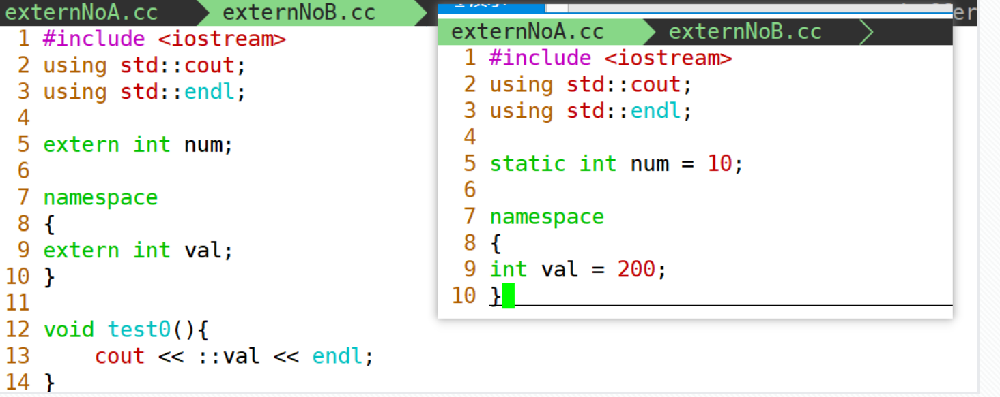
>

<font color=red>**extern与include的对比：**</font>

extern 外部引入的方式适合管理较小的代码组织，用什么就声明什么。但是如果跨模块调用关系不清晰，容易出错；

include 头文件的方式在代码组织上更清晰，也更符合工程开发习惯。它会把头文件内容引入当前翻译单元，可能增加编译依赖，但不是运行效率低。

### 使用命名空间的规则

> 以前我们知道，函数可以声明多次，但是只能定义一次；
>
> 而命名空间可以多次定义，可以对命名空间进行扩展。
>
> 在同一个源文件中可以多次定义同名的命名空间，被认为是同一个命名空间，所以不能在其中定义相同的实体。
>
> ```cpp
> namespace wd
> {
> int num = 100;
> void print(){
> 	cout << "print()" << endl;
> }
> }//end of namespace wd
>
> namespace wd
> {
> int num2 = 300;
> int num = 100;//error
> }//end of namespace wd
>
> void test0(){
> 	cout << wd::num << endl;
> 	cout << wd::num2 << endl;
> }
> ```

### 小结

**命名空间的作用：**

1. 避免命名冲突：命名空间提供了一种将全局作用域划分成更小的作用域的机制，用于避免不同的代码中可能发生的命名冲突问题；

2. 组织代码：将相关的实体放到同一个命名空间；

3. 版本控制：不同版本的代码放到不同的命名空间中；

   总之，需要用到代码分隔的情况就可以考虑使用命名空间。

还有一个隐藏的好处：声明主权。

> 下面引用当前流行的命名空间使用<font color=red>**指导原则**</font>：
>
> 1. 提倡在已命名的名称空间中定义变量，而不是直接定义外部全局变量或者静态全局变量。
>
> 2. 如果开发了一个函数库或者类库，提倡将其放在一个命名空间中。
>
> 3. 对于using 声明，首先将其作用域设置为局部而不是全局。
>
> 4. 包含头文件的顺序可能会影响程序的行为，如果非要使用using编译指令，建议放在所有#include预编译指令后。
>

**规范补充：** include 多个头文件时，可以按照“当前模块自己的头文件、C 标准库头文件、C++ 标准库头文件、第三方库头文件”的顺序组织。不同团队可能有不同规范，关键是保持一致。

## const关键字

### 修饰内置类型

const 修饰的变量通常称为 const 常量，初始化后不能再通过该变量名修改其值。更准确地说，它仍然是一个有类型、有作用域的对象，只是被赋予了只读属性。

整型、浮点型等对象都可以被 const 修饰。<span style=color:red;background:yellow>**const 对象在定义时必须初始化。**</span>

```cpp
const int number1 = 10;
int const number2 = 20;

const int val;//error 常量必须要进行初始化
```

C语言中是使用宏定义的方式创建常量

```cpp
#define NUMBER 1024
```

> 由此引出一个**面试常考题**：
>
> <span style=color:red;background:yellow>**const常量和宏定义常量的区别**</span>
>
> 1. <font color=red>**处理阶段不同**</font>：宏定义在预处理阶段做文本替换；
>
>    const 对象由编译器处理，有明确的类型和作用域。注意：`const` 不等于一定是编译期常量；如果需要明确要求编译期求值，C++11 之后应使用 `constexpr`。
>
> 2. <font color=red>**类型和安全检查不同**</font>：宏定义没有类型，不做类型检查；**const 对象有具体类型**，编译器会进行类型检查。
>
>    在使用中，应尽量用 `const` 或 `constexpr` 替换宏定义常量，可以降低出错概率。

> [!IMPORTANT]
> `const` 强调“不可修改”，`constexpr` 强调“可在编译期求值”。二者经常一起出现，但解决的问题不同。

### 修饰指针类型

以int指针为例，用const修饰有三种形式：

- `const int * p`
- `int const * p1`
- `int * const p2`

可能有些资料上将其归类为**指针常量**和**常量指针**。

> 我们采取C++之父的说法，参考《C++程序设计语言》给出定义, 分为两种类型
>
> - 指向常量的指针：pointer to const
>
>   - const int *p
>
>   - int const *p
>
>   - > const 在 `*` 左边，即为指向常量的指针，不能通过该指针改变其指向的值，但是可以改变这个指针本身的指向。
>
> - 常量指针：const pointer
>
>   - int * const p
>
>   - > const 在 `*` 右边，即为常量指针，不能改变这个指针本身的指向，但是可以通过该指针改变其指向的值。
>
> [!TIP]
> 判断指针和 `const` 的关系时，先找 `*`：`const` 在 `*` 左边，限制“指向的内容”；`const` 在 `*` 右边，限制“指针本身”。

**指向常量的指针(pointer to const)**

1. 指向常量的指针具有只读属性,无法通过该指针修改其指向内容的数据
2. 但是可以修改该指针的指向

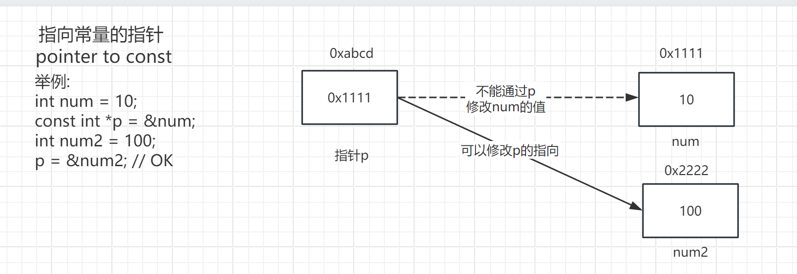

> ```cpp
> int number1 = 10;
> int number2 = 20;
>
> const int * p1 = &number1;//指向常量的指针
> *p1 = 100;//error 通过p1指针无法修改其所指内容的值
> p1 = &number2;//ok 可以改变p1指针的指向
>
> //例子中p1称为指向常量的指针（pointer to const），尽管number1本身并不是一个int常量，但定义指针p1的方式决定了无法通过p1修改其指向的值。但值得注意的是，修改p1的指向是允许的。
> ```
>
> **补充**：如果有一个const常量，那么普通的指针也无法指向这个常量，只有指向常量的指针才可以。
>
> ````cpp
>const int x = 20;
> int * p = &x; //error
> const int * cp = &x; //ok
> ````

> 指向常量的指针还有第二种写法，各种特点同上，一般较少采用
>
> ```cpp
> int const * p2 = &number1; //指向常量的指针的第二种写法
> ```
>

**常量指针(const pointer)**

1. 指针本身是个常量,即保存的地址不能修改,具有只读属性,不能修改指向
2. 但是可以通过指针修改其指向内容的数据

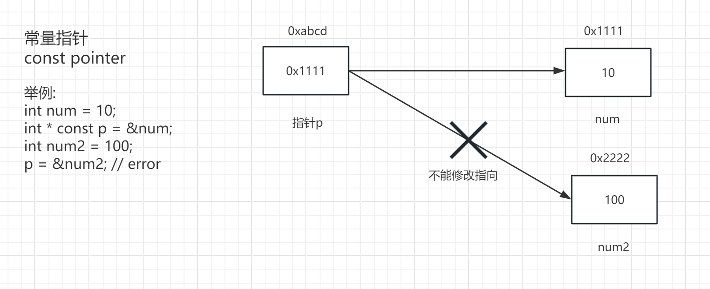

> ```cpp
> int * const p3 = &number1;//常量指针
> *p3 = 100;//ok 通过p3指针可以修改其所指内容的值
> p3 = &number2;//error 不可以改变p1指针的指向
> ```
>

> **双重const限定的指针**
>
> 1. 既不能修改指向
> 2. 又不能修改指向内容的数据
>
> 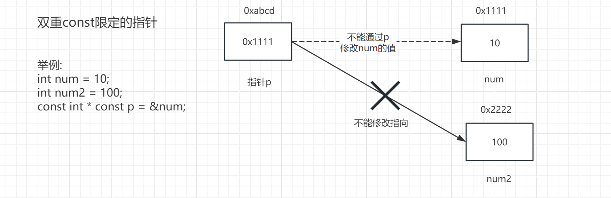
>
> ```cpp
> const int * const p4 = &number1;//指向和指向的值皆不能进行修改
> ```

与这组概念相似的，再补充两组对比，也应该理解其含义，尝试写代码，分辨一下：

**数组指针/指针数组**

**数组指针**

- 指向数组的指针 pointer to array，本质是指针，指向整个数组
- int (*p)[3];

**指针数组**

- 元素都是指针类型的数组 array of pointers，本质是数组，其元素是指针
- int *p[3];

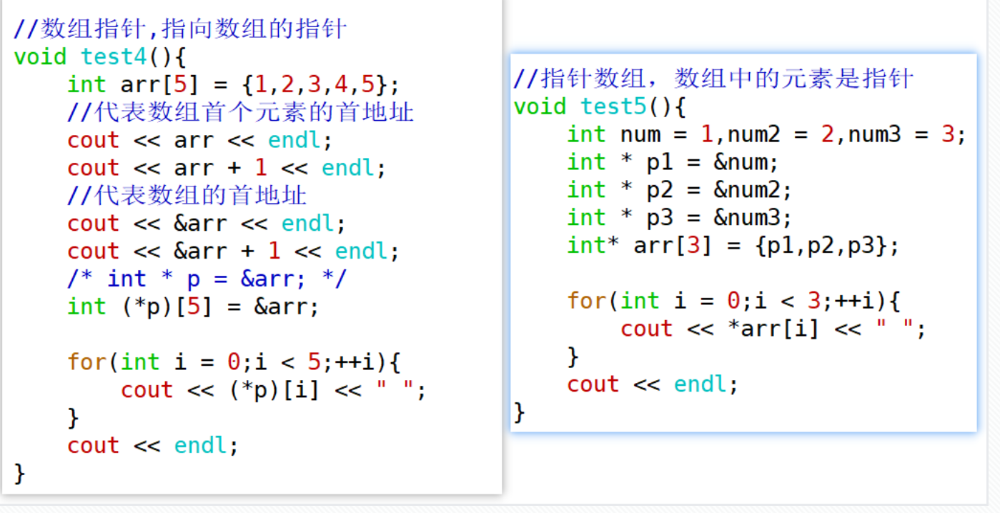

区别

| 特性     | 数组指针                     | 指针数组                 |
| -------- | ---------------------------- | ------------------------ |
| 定义方式 | `int (*p)[n]`                | `int *p[n]`              |
| 含义     | 指向一个数组的指针           | 包含多个指针的数组       |
| 用途     | 适用于需要处理整个数组的情况 | 适用于需要多个指针的情况 |
| 访问元素 | `(*p)[i]` 访问数组中的元素   | `*p[i]` 访问指针指向的值 |

**函数指针/指针函数**

**函数指针**

- 指向函数的指针 pointer to function ,本质是指针
- 可以通过函数指针调用函数
- 定义方式: return_type (*pointer_name)(parameter_list);

**指针函数**

- 返回值为指针类型的函数 function returning a pointer，本质是函数
- 定义方式 return_type* function_name(parameter_list){};

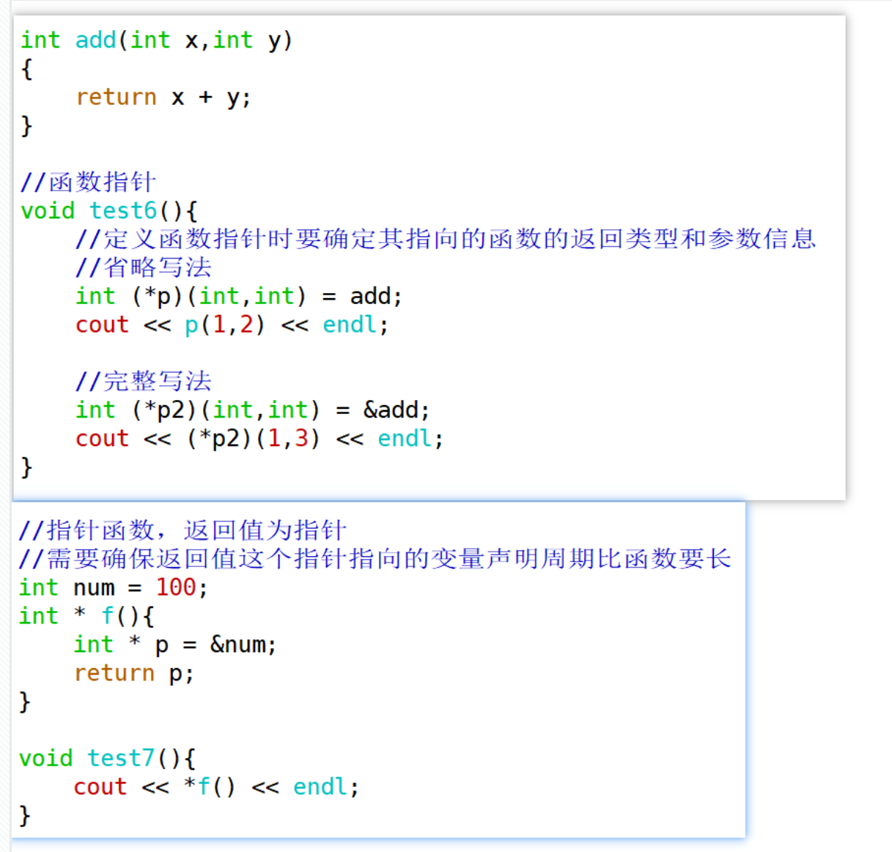

## new/delete运算符

### C/C++申请、释放堆空间的方式对比

**C语言中使用malloc/free函数进行动态内存分配**

1. 使用malloc分配内存 `void * malloc(size_t size)`
2. 初始化
3. 使用
4. 使用完毕后进行free释放空间
5. 为避免悬挂指针，将指针置为 `NULL`

处理基本数据类型的数据

```c
// 注意malloc的返回值为void * , 需要强制转换为相应指针类型
int * p = (int*)malloc(sizeof(int));
*p = 10;
free(p);
p = NULL;
```

处理数组类型的数据

```c
// C中动态分配数组空间
int size = 3;
int *p = (int *)malloc(size * sizeof(int));
for(int i = 0; i < size; i++){
    p[i] = i;
}
```

**C++使用new/delete运算符**

1. 使用new表达式分配空间,并初始化
2. 使用
3. 使用delete表达式释放空间
4. 将指针置为空，C++11 之后推荐使用 `nullptr`

new 表达式可以直接初始化对象；使用 `{}` 或 `()` 可以进行值初始化。

处理基本类型数据

```cpp
// 第一种写法
//初始化为该类型的默认值
int * p1 = new int{};
cout << *p1 << endl;
// 值初始化
int * p2 = new int{1};
cout << *p2 << endl;

// 第二种写法
//初始化为该类型的默认值
int * p3= new int();
cout << *p3 << endl;
// 值初始化
int * p4 = new int(1);
cout << *p4 << endl;

// 释放空间 delete 表达式
delete p1;
delete p2;
delete p3;
delete p4;
// 将指针置为空
p1 = nullptr;
p2 = nullptr;
p3 = nullptr;
p4 = nullptr;
```

处理数组类型的数据

```cpp
// 默认初始化元素为int类型默认值 0
int * p3 = new int[10]{};
for(int idx = 0; idx < 10; ++idx){
    cout << p3[idx] << endl;
}
// 对于数组数据要使用delete[]
delete [] p3;
p3 = nullptr;

// 使用值初始化
int * p4 = new int[3]{1,2,3};
for(int idx = 0; idx < 3; ++idx){
    cout << p4[idx] << endl;
}
// delete [] 释放
delete [] p4;
p4 = nullptr;
```

**常考面试题**

<span style=color:red;background:yellow>**malloc/free 和 new/delete 的区别**</span>

1. `malloc/free` 是库函数；`new/delete` 是运算符，后两者使用时不是函数调用写法；
2. `new` 表达式的返回值是相应类型的指针，`malloc` 返回值是 `void *`；
3. `malloc` 只分配原始内存，不会调用构造函数；`new` 会分配内存并构造对象；
4. `free` 只释放内存，不会调用析构函数；`delete` 会先调用析构函数，再释放内存；
5. `malloc` 的参数是字节数，`new` 表达式会根据类型自动计算所需空间大小。

> [!IMPORTANT]
> `malloc/free` 和 `new/delete` 必须成对使用。C++ 对象优先使用 `new/delete`，更推荐在后续学习中使用智能指针和标准容器来管理资源。

### valgrind工具集

valgrind是一种开源工具集，它提供了一系列用于调试和分析程序的工具。其中最为常用和强大的工具就是memcheck。它是valgrind中的一个内存错误检查器，它能够对C/C++程序进行内存泄漏检测、非法内存访问检测等工作。

- <font color=red>**sudo apt install valgrind**</font>

安装完成后即可通过memcheck工具查看内存泄漏情况，编译后输入如下指令

```cpp
valgrind --tool=memcheck ./a.out
```

如果想要更详细的泄漏情况，如造成泄漏的代码定位，编译时加上-g

```cpp
valgrind --tool=memcheck --leak-check=full ./a.out
```

但是这么长的指令使用起来不方便，每查一次就得输入一次，可以设置一下。

- 在home目录下编辑.bashrc文件，改别名

  ```cpp
  alias memcheck='valgrind --tool=memcheck --leak-check=full --show-reachable=yes'
  ```

- 重新加载 source .bashrc

- 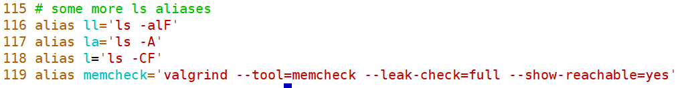

改写之后，就可以直接使用memcheck指令查看内存泄漏情况     ——  memcheck ./a.out

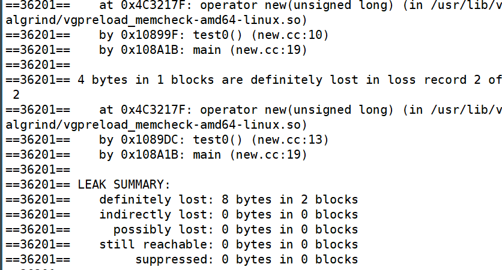

（1）definitely lost: 确定泄漏；

（2）indirectly lost: 间接泄漏了；

（3）possibly lost: 可能泄漏了，基本不会出现；

（4）still reachable: 程序结束时仍可访问，通常需要结合上下文判断是否需要处理；

（5）suppressed: 被工具或系统库规则抑制的报告，通常先不用处理

如上发生了两处泄漏，一共泄漏了8个字节，此时需要对new表达式申请的空间进行回收

```cpp
int * p1 = new int();
cout << *p1 << endl;
delete p1;

int * p2 = new int(4);
cout << *p2 << endl;
delete p2;
```

### 回收空间时的注意事项

（1）三组申请空间和回收空间的匹配组合

```cpp
malloc            free

new               delete

new int[5]()      delete[]
```

如果没有匹配，memcheck会报出错误匹配的信息，实际开发中有可能回收掉了预期外的信息。

（2）安全回收

delete 只是回收指针指向的空间，指针变量本身依然存在，并且仍保存着原来的地址。此时它变成了悬挂指针，继续解引用会导致未定义行为。因此释放后通常要把指针设为空指针。C++11 之后使用 <span style=color:red;background:yellow>**nullptr**</span> 表示空指针。

```cpp
    int * p1 = new int();//初始化为该类型的默认值
    cout << *p1 << endl;
    delete p1;
    p1 = nullptr;//安全回收
```

> [!CAUTION]
> `delete nullptr;` 是安全的，但重复 `delete` 同一个非空悬挂指针是未定义行为。释放后置为 `nullptr` 可以降低重复释放的风险。

## `引用（最重点）`

### 引用的概念

在C++中，在逻辑层面上（在使用时），<span style=color:red;background:yellow>**引用是一个已定义变量的别名**</span>。

其语法是：

```cpp
//定义方式：类型 & ref = 变量；
int number = 2;
int & ref = number;
```

在使用引用的过程中，要注意以下几点：

1. `&` 在声明语句中表示引用符号，不是取地址运算符。

2. 引用的类型需要和其绑定的变量的类型相同（目前这样使用，学习继承后这一条有所不同）
3. 声明引用的同时，必须对引用进行初始化，否则编译时报错
4. 引用一经绑定，无法更改绑定

```cpp
void test0(){
    int num = 100;
    int & ref = num;//声明ref时进行了初始化（绑定）
    //int & ref2; //error 没有进行初始化
    cout << num << endl;
    cout << ref << endl;
    cout << &num << endl;
    cout << &ref << endl;

    int num2 = 200;
    ref = num2;//这里只是一个赋值操作,并不是更改绑定
}
```

### 引用的本质

C++ 语法层面上，引用就是一个对象的别名。它一经绑定就不能再改绑，使用引用就像直接使用被绑定的对象。

从实现角度看，编译器经常会用指针来实现引用，尤其是引用作为函数参数、返回值或类成员时，可以把它理解为一种受限制的指针。但这只是常见实现方式，不应简单理解为“引用变量一定占据一个指针大小的空间”。在很多局部场景中，编译器可以直接把引用优化掉。

可以尝试对引用取址，获取到的地址就是引用所绑定对象的地址。

> [!NOTE]
> 学习时可以把引用理解成“受限制的指针”，便于理解引用传参和引用返回；写代码时则应该按“别名”来使用它，不要试图操作引用本身。

```cpp
void test(){
    int num = 100;
    int *p = &num;
    cout << &p << endl;
    cout << p << endl;
    cout << &num;

    int & ref = num;// 定义引用ref，绑定num变量
    // 对引用取地址获取到的是其绑定对象的地址
    cout << &ref << endl;
    cout << ref << endl;
}
```

### 引用与指针的联系与区别

这是一道非常经典的面试题，请尝试着回答一下：

联系：

1. 引用和指针都与地址有关，都可以用于间接访问对象；

2. 很多实现中引用底层可以由指针完成，学习时可以把引用视为受限制的指针。

区别：

1. 引用必须初始化，指针可以不初始化；
2. 引用不能修改绑定，但是指针可以修改指向；
3. 在代码层面对引用取址，取到的是被绑定对象的地址；对指针变量取址，取到的是指针变量自身的地址。

### 引用的使用场景

1. 引用作为函数的参数
2. 引用作为函数的返回值

#### 引用作为函数的参数（重点）

在没有引用之前，如果想通过形参改变实参的值，通常需要使用指针。

但指针写法更灵活，也更容易出错。

引用可以作为其他变量的别名存在，因此很多场合可以用引用代替指针，代码的可读性和安全性通常更好。

这就是引用存在的意义。

一个经典的例子就是交换两个变量的值，请实现一个函数，能够交换两个int型变量的值：

````cpp
void swap(int x, int y){//值传递，发生复制
    int temp = x;
    x = y;
    y = temp;
}

void swap2(int * px, int * py){//地址传递，不复制
    int temp = *px;
    *px = *py;
    *py = temp;
}

//在实参传给swap3时，
//其实就是发生了初始化int & x = a;
//int & y = b;
void swap3(int & x, int & y){//引用传递，不复制
    int temp = x;
    x = y;
    y = temp;
}
````

补充：如果一个函数不需要改变实参本身，而且参数类型是内置类型，依然可以使用值传递；

引用作为函数参数时，会把形参绑定到实参。对较大的对象或数据，使用引用参数可以避免复制实参，从而减少开销。

当然，如果函数中需要改变实参本身的内容，值传递就无法实现了，需要引用传递（或者地址传递）。

参数传递的方式包括`值传递`、`指针传递`和`引用传递`。

> 采用值传递时，系统会在内存中开辟空间用来存储形参变量，并将实参变量的值拷贝给形参变量。
>
> 也就是说形参变量只是实参变量的副本而已；如果函数传递的是类对象，而该对象占据的存储空间比较大，那发生复制就会造成较大的不必要开销。
>
> 这种情况下，强烈建议使用引用作为函数的形参，这样会大大提高函数的时空效率。

> 当用引用作为函数的参数时，其效果和用指针作为函数参数的效果相当。当调用函数时，函数中的形参就会被当成实参变量或对象的一个别名来使用，也就是说此时**函数中对形参的各种操作实际上是对实参本身进行操作**，而非简单的将实参变量或对象的值拷贝给形参。

> 使用指针作为函数的形参虽然达到的效果和使用引用一样，但当调用函数时仍需要为形参指针变量在内存中分配空间，也由于指针的灵活更可能导致问题的产生，故在C++中推荐使用引用而非指针作为函数的参数。

**常引用：使用 const 修饰的引用**

如果不希望函数体中通过引用改变传入的变量，那么可以使用<span style=color:red;background:yellow>**常引用作为函数参数**</span>

1. 不会修改值
2. 不会复制（不会造成不必要的开销）

**注：不少编码规范要求，如果引用参数不需要修改实参，就应写成 const 引用。**

```cpp
// 常引用基本特点
void test1(){
    int num = 10;
    // 常引用可以绑定到临时值
    const int & ref = 10;
    // 既不能修改指向,也不能通过这个引用修改变量的值
    // ref = 100; // error read only
    num = 100;
    cout << "num = " << num << endl;
    cout << "ref = " << ref << endl;
    // 不能通过引用常引用修改 但是可以通过变量自身修改
}

// 函数不希望通过引用改变变量的值的时候可以使用常引用
// 形参为常引用
void func(const int & x){
    cout << x << endl;
   //  x = 100; //error read only  无法通过常引用修改
}

void test(){
    int num = 1;
    func(num);
    cout << num << endl;
}
```

> [!TIP]
> 参数传递可以按这个规则选择：小型内置类型用值传递；大对象且不修改用 `const T &`；需要修改实参用 `T &`；允许传空或需要表达“可选对象”时再考虑指针。

#### 引用作为函数的返回值

要求：当以引用作为函数返回值时，<span style=color:red;background:yellow>**返回引用所绑定对象的生命周期必须长于函数调用过程**</span>。也就是说，函数执行完毕后，被返回的对象仍然必须存在。

目的：避免复制，节省开销；也可以让函数调用表达式具备左值属性。

```cpp
int a = 1;
int b = 2;
// 返回值为int类型
int  func(){
    //...
    return a;   //在函数内部，当执行return语句时，会发生复制
}

// 返回值为int类型的引用
int & func2(){
     //...
    return b;   //返回引用，不会复制b
}
```

```cpp
// 全局变量
int a  = 100;
int func(){
    // func函数返回的是a的一个副本,一个临时变量
    return a;
}

// 全局变量
int b = 200;
// 函数返回值为引用
int & func2(){
    // return时不会发生复制
    return b; // 返回的实际是一个绑定到b的引用
    // 要注意返回的引用所绑定的变量的生命周期要比函数更长
}

void test(){
    cout << func() << endl;
    cout << &a << endl;
    // cout << &func() << endl;// error
    // func()返回的是一个临时值,不能对这个临时值取地址

    cout << func2() << endl;
    cout << &func2() << endl; // OK func2 返回的是引用不是值.
}
```

**注意事项**

1. **不要返回局部变量的引用**。因为局部变量会在函数返回后被销毁，被返回的引用就成为了"无所指"的引用，程序会进入未知状态。

```cpp
int & func()
{
	int number = 1;
    return number;
}
```

2. <span style=color:red;background:yellow>**不要轻易**</span>返回一个堆空间变量的引用，非常容易造成内存泄漏。

```cpp
int & func()
{
	int * p_int = new int(1);
	return *p_int;
}

void test()
{
	int a = 2, b = 4;
	int c = a + func() + b;//内存泄漏
}
```

如果函数返回的是堆空间对象的引用，那么这个函数调用一次就会 `new` 一次，非常容易造成内存泄漏。所以应谨慎使用这种写法，并且必须有清晰的资源回收机制。

```cpp
int & func3(){
    int *p = new int{10};
    return *p;
}

void test(){
    // func3调用1次就会new一次, 如果不释放就会内存泄漏
    //cout << func3() << endl;
    //delete &func3();
    // 调用2次func3,释放一次,仍然泄露

    // 完善写法,使用引用接收之后再处理
    int &ref = func3();
    cout << ref << endl;
    delete &ref;
}
```

> [!CAUTION]
> 引用返回最常见的安全对象是全局变量、静态局部变量、对象成员或调用者传入的对象。不要返回局部变量引用，也不要把 `new` 出来的对象伪装成引用返回。

### 总结

引用总结：

1. 在引用的使用中，单纯给某个变量取个别名没有什么意义，引用的目的主要用于在函数参数传递中，解决大块数据或对象的传递效率和空间不理想的问题。
2. 用引用传递函数的参数，能保证参数传递中不产生副本，提高传递的效率，还可以通过const的使用，保证了引用传递的安全性。
3. 引用与指针的区别是，指针通过某个指针变量指向对象后，再对所指对象进行间接操作；引用在语法层面就是对象的别名，逻辑上可以理解为——对引用的操作就是对目标对象的操作。<font color=red>**可以用指针或引用解决的问题，通常更推荐使用引用。**</font>

## 强制转换

C 语言中的强制转换在 C++ 代码中依然可以使用，这种 C 风格转换格式很简单：

```cpp
TYPE a = (TYPE)EXPRESSION;
```

**特点**：

- **简单直接**：只需指定目标类型即可完成类型转换。
- **无类型安全**：C 风格转换会尽量完成转换，缺乏明确的意图表达，容易掩盖潜在错误。
- **灵活但容易出错**：尤其是指针类型转换时，很容易导致未定义行为。
- **不容易查找**：它由括号加类型组成，在 C++ 程序中不如 `static_cast` 等关键字醒目。

```cpp
void func(){
    double d = 3.14;
    // double指针强转为int指针 编译虽然通过 但是会导致未定义行为
    int *p = (int *)&d;
	// 未定义行为
    cout << *p << endl; // 输出结果无法预测
}
```

C++ 为了克服这些缺点，引入了 4 个新的类型转换操作符：

- **static_cast**
- const_cast
- dynamic_cast
- reinterpret_cast(了解)

### static_cast

`static_cast` 是最常用的类型转换符，适用于含义相对明确、编译器能够检查一部分合法性的转换，例如把 `int` 转换为 `float`。

基本语法:

```cpp
目标类型 转换后的变量 = static_cast<目标类型>(要转换的变量)
```

static_cast的用法主要有以下几种：

1）用于基本数据类型之间的转换

```cpp
int iNumber = 100;
float fNumber = 0;
fNumber = static_cast<float>(iNumber);
```

2）把 `void *` 转换成目标类型的指针。注意：如果 `void *` 实际指向的对象类型和目标类型不一致，后续解引用会导致未定义行为，编译器通常无法检查；

```cpp
void * pVoid = malloc(sizeof(int));
// void * ---> int *
int * pInt = static_cast<int*>(pVoid);
*pInt = 1;
```

3）用于类层次结构中基类和子类之间指针或引用的转换（后面学）。

注意: <span style=color:red;background:yellow>**不能完成任意两个指针类型间的转换**</span>

```cpp
int iNumber = 1;
int * pInt = &iNumber;
float * pFloat = static_cast<float *>(pInt);//error
```

**好处：** 查找方便。例如使用 `grep -rn "static_cast" ./` 可以快速定位项目中哪些文件使用了强制转换，比查找 C 风格转换更可靠。

### const_cast(了解)

该运算符用来移除或添加指针、引用上的 const 属性，实际开发中应谨慎使用，**仅做了解**。

使用形式:

1.指向常量的指针被转化成普通指针，并且仍然指向原来的对象；

- const int * p 指向常量
- const int * p 指向普通变量

```cpp
// 定义常量
const int number = 100;
//int * p_int = &number;//error read only
// 去除const属性
int * p_int2 = const_cast<int *>(&number); // OK 转换为普通指针
// 以下代码是未定义行为，不合法
// 通过指针修改原本定义为const的对象
*p_int2 = 10; //后续属于未定义行为 (C++标准中,修改一个原本声明为const的变量属于未定义行为)
cout << number << endl;
cout << *p_int2 << endl;// 值居然不一样
cout << &number << endl;
cout << p_int2 << endl;// 地址一样

// 定义普通变量
int num = 1;
// 指向常量的指针指向num 无法通过该指针修改变量数据
const int *p1 = &num;
// 去除const属性
int *p2 = const_cast<int*>(p1);
*p2 = 2; // OK
cout << num << endl;
cout << *p2 << endl;
```

2.常量引用被转换成非常量引用，并且仍然指向原来的对象；

```cpp
// 常量引用转为非常量引用
int num = 100;
const int & ref = num;
// ref = 101;// error read only
int & ref2 = const_cast<int&>(ref);
ref2 = 101;
cout << "num = " << num << endl;
cout << "ref = "<< ref<< endl;
```

`dynamic_cast`：主要用于基类和派生类之间的安全转换，尤其是向下转型（后面讲多态时再展开）。

`reinterpret_cast`：功能强大，必须慎用。

该运算符可以处理无关类型之间的底层转换，例如任意指针（或引用）类型之间的转换，以及指针与足够大的整数类型之间的转换。错误使用 `reinterpret_cast` 很容易导致程序不安全，只有在非常明确底层表示含义时才考虑使用。

> [!CAUTION]
> 类型转换不是“让错误代码编译通过”的工具。优先使用正常类型设计；必须转换时，优先使用 C++ 风格转换，并让转换意图尽可能明确。

## 函数重载

### 什么是函数重载

在实际开发中，有时候需要实现几个功能类似、参数类型不同的函数。例如交换两个变量的值，变量可能是 `short`、`int`、`float` 等类型。在 C 语言中，通常必须设计不同的函数名，其原型类似于：

```C
void swap1(short *, short *);
void swap2(int *, int *);
void swap3(float *, float *);
```

但在C++中，这完全没有必要。C++ 允许多个函数拥有相同的名字，只要它们的参数列表不同就可以，这就是函数重载（Function Overloading）。借助重载，一个函数名可以有多种用途。

<font color=red>**在同一作用域内，可以有一组函数名相同、参数列表不同的函数，这组函数被称为重载函数。**</font> 重载函数通常用于表达一组功能相似的操作，使同一函数名可以作用于不同的数据类型或参数组合，从而减少无意义的函数名数量，提高可读性。

**注意：C 语言中不支持函数重载，C++才支持函数重载。**

```cpp
// 函数名相同 参数列表不同
int add(int x, int y) {
    return x + y;
}

int add(int x, int y, int z) {
    return x + y + z;
}

int add(float x, int y) {
    return x + y;
}

int add(int x, float y) {
    return x + y;
}
```

### 实现函数重载的条件

**函数名相同、参数列表不同可以构成重载。**

1. 函数参数的数量
2. 数量相同，类型不同
3. 数量、类型都相同，参数顺序不同

注意: 只有返回类型不同，参数完全相同，是不能构成重载的

```cpp
int add(int x, int y) {
    return x + y;
}
// 只有返回值类型不同, 不能构成重载
void add(int x, int y) {
   cout << x + y << endl;
}// 不是重载
```

### 函数重载的实现原理

实现原理：名字改编（name mangling）。当函数名称相同时，C++ 编译器会根据参数的类型、顺序、个数对符号名进行改编。

- g++ -c Overload.cc

- nm Overload.o

查看目标文件，可以发现原本的函数名都被改编成与参数相关的函数名。

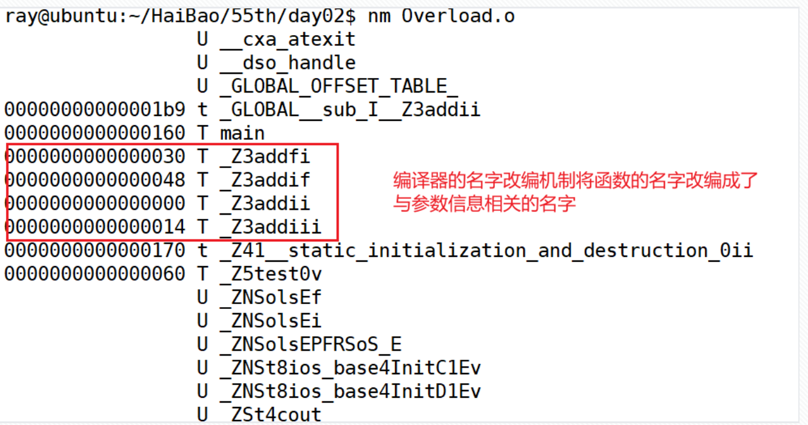

而C语言没有名字改编机制。

分析：C++的函数重载提供了一个便利，以前C语言要想实现各种不同类型参数的计算需要定义多个不同名字的函数，在调用函数时要注意参数的信息和函数名匹配。

C++有了函数重载，想要对不同类型的参数进行计算时，就可以使用同一个函数名字（代码层面的同名，编译器会处理成不同的函数名）。

这属于编译期工作，对运行期没有额外开销。相较 C 编译器，C++ 编译器需要做更多语义分析，编译过程可能更复杂。

### extern "C"

在C/C++混合编程的场景下，如果在C++代码中想要对部分内容按照C的方式编译，应该怎么办？

```cpp
extern "C" void func() //用 extern"C"修饰单个函数
{

}

//如果是多个函数都希望用C的方式编译
//或是需要使用C语言的库文件
//都可以放到如下{}中
extern "C"
{
//……
}

```

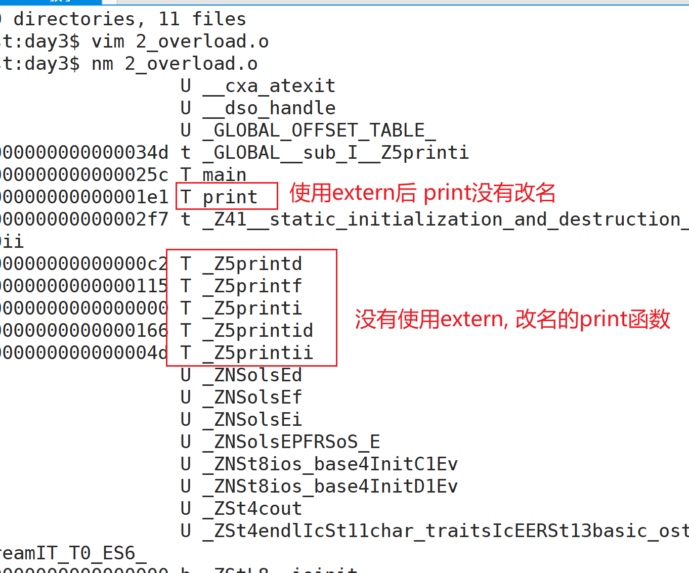

> [!IMPORTANT]
> `extern "C"` 的核心作用是关闭 C++ 名字改编，让函数符号名按 C 的规则生成。它常用于 C++ 调用 C 库，或让 C 代码能够链接 C++ 编译出来的函数。

## 函数默认参数

### 什么是函数默认参数

在 C++ 中，**函数默认参数**是指在函数声明或定义中为一个或多个参数提供**默认值**。调用函数时，如果没有为这些参数传递实参，就使用默认值。

### 函数默认参数的目的

- 函数调用时进行缺省调用
- 减少函数重载

**函数提供默认参数可以进行缺省调用**

C++可以给函数定义默认参数值。通常，调用函数时，要为函数的每个参数给定对应的实参。

```cpp
void func(int x, int y) {
	cout << "x = " << x << endl;
	cout << "y = " << y << endl;
}
// 无论何时调用func1函数，都必须要给其传递两个参数。
```

但C++可以给参数定义默认值，如果将func1函数参数中的x定义成默认值0， y定义成默认值0

```cpp
void func(int x = 0, int y = 0){
    cout << "x = " << x << endl;
	cout << "y = " << y << endl;
}

void test0(){
    // 如果传参,实际参数就是传递的参数, 如果不传,那么参数就是默认参数
    func(24,30);
    func(100);
    func();
}
```

这样调用时，若不给参数传递实参，则func1函数会按指定的默认值进行工作，即缺省调用。

给函数参数赋默认值后就可以进行缺省调用，但是<span style=color:red;background:yellow>**传入的参数优先级高于默认参数。**</span>

**减少函数重载**

默认参数可以把一系列简单的重载函数合并成一个。例如：

```cpp
void func3();
void func3(int x);
void func3(int x, int y);
//上面3个函数其实是函数重载
//上面三个函数可以合成下面这一个带默认参数的函数
void func3(int x = 0, int y = 0);
```

通过使用带默认参数的函数来减少函数重载的数量

**注意:**

如果一组重载函数（可能带有默认参数）都允许相同实参个数的调用，将会引起调用的二义性。

```cpp
void func4(int x);
void func4(int x, int y = 0);

func4(1);//error,编译器无法确定调用的是哪种形式的func4
```

<span style=color:red;background:yellow>**所以在函数重载时，要谨慎使用默认参数。**</span>重载是允许的，但是缺省调用时会产生冲突。**应避免在同一个范围内定义带有默认参数的重载函数**，否则编译器可能会因为无法确定合适的调用而报错。

### 默认参数的声明

**一般默认参数在函数声明中提供。**

当一个函数既有声明又有定义时，只需要在其中一个中设置默认值即可。

若在定义时而不是在声明时设置默认值，那么函数定义一定要出现在调用之前。因为编译器处理函数调用时，必须已经知道哪些参数有默认值；如果此时只看到不带默认值的声明，就无法进行缺省调用。

```cpp
//这样可以编译通过
// 函数声明
void func(int x,int y);

void test0(){
    // 函数调用
   func(1,2);
}
// 函数定义
void func(int x,int y){
    cout << x + y << endl;
}
```

```cpp
//这样无法缺省调用
// 函数声明
void func(int x,int y);

void test0(){
   func();//error 函数定义在函数调用之后
}
// 函数定义
void func(int x = 0,int y = 0){
    cout << x + y << endl;
}
```

所以我们<span style=color:red;background:yellow>**通常是将默认值的设置放在声明中而不是定义**</span>中。

**注意:**

如果在声明中和定义中都传了默认值，会报错

```cpp
// 函数定义
void func(int x = 0, int y = 0);
//  函数声明
void func(int x = 0, int y = 0){ // error 重复设置默认值
    cout << "x = " << x << endl;
    cout << "y = " << y << endl;
}
```

### 默认参数的顺序规定

如果一个函数中有多个默认参数，则形参分布中，默认参数应从右至左逐渐定义。

当调用函数时，只能从左向右匹配参数。如：

```cpp
void func2(int a = 1, int b, int c = 0, int d);//error
void func2(int a, int b, int c = 0, int d = 0);//ok
```

若给某一参数设置了默认值，那么在参数表中其后所有的参数都必须也设置默认值，否则，由于函数调用时可不列出已设置默认值的参数，编译器无法判断在调用时是否有参数遗漏。

完成函数默认参数的设置后，该函数就可以按照相应的缺省形式进行调用。

<span style=color:red;background:yellow>**总结：函数参数赋默认值必须从右向左连续设置，保证缺省调用时可以完成准确匹配。**</span>

> [!CAUTION]
> 默认参数和函数重载都能减少调用负担，但二者混用容易产生二义性。设计接口时，能用一个默认参数函数表达清楚，就不要再写一组容易冲突的重载。

## bool类型

`bool` 是 C++ 中的基本类型，用来表示 `true` 和 `false`。`true` 和 `false` 是布尔字面值，转换为 `int` 时，<font color=red>**true 为 1，false 为 0。**</font>

```cpp
int x = true;// 1
int y = false;// 0
```

任何数字或指针值都可以隐式转换为bool值。

任何非零值都将转换为true，而零值转换为false（<span style=color:red;background:yellow>**注意：-1也是代表true**</span>）

```cpp
bool b1 = -100;
bool b2 = 100;
bool b3 = 0;
bool b4 = 1;
bool b5 = true;
bool b6 = false;
int x = sizeof(bool);//x = 1
```

在常见实现中，`bool` 变量占 1 个字节。

## inline函数

在C++中，通常定义以下函数来求取两个整数的最大值

```cpp
int max(int x, int y)
{
	return x > y ? x : y;
}
```

为这么一个小的操作定义一个函数的好处有：

(1)阅读和理解函数 max 的调用，要比读一条等价的条件表达式并解释它的含义要容易得多;

(2)如果需要做任何修改，修改函数要比找出并修改每一处等价表达式容易得多;

(3)使用函数可以确保统一的行为，每个测试都保证以相同的方式实现;

(4)函数可以重用，不必为其他应用程序重写代码。

虽然有这么多好处，但是写成函数有一个潜在的缺点：调用函数比求解等价表达式要慢得多。

在大多数的机器上，调用函数都要做很多工作：调用前要先保存寄存器，并在返回时恢复，复制实参，程序还必须转向一个新位置执行。即对于这种简短的语句使用函数开销太大。

在C语言中，我们使用带参数的宏定义这种借助编译器的优化技术来减少程序的执行时间，编译预处理器用文本替换的方式取代函数调用，省去了参数压栈、生成汇编语言的CALL调用、返回参数、执行return等过程，从而提高了速度。宏代码本身不是函数，但是看起来像函数。

请定义一个宏完成以上的max函数的功能

使用宏代码最大的**缺点**是**容易出错**，预处理器在文本替换时常常产生意想不到的副作用。

例如：

```cpp
#define MAX(a, b) (a) > (b) ? (a) : (b)

int result = MAX(20,10) + 20;//result的值是多少？

int result2 = MAX(10,20) + 20;//result2的值是多少？

//result = MAX(i, j) + 20; 将被预处理器扩展为: result = (i) > (j) ?(i):(j)+20

```

修改宏代码

```cpp
#define MAX(a, b) ((a) > (b) ? (a) : (b))
```

可以解决上面的错误了，但也不是万无一失的.

例如：

```cpp
int i = 4,j = 3;
int result = MAX(i++,j);
cout << result << endl; //result = 5；
cout << i << endl; //i = 6;
//使用MAX的代码段经过预处理器扩展后，result = ((i++) > (j) ? (i++):(j));
```

**宏**的另一个缺点就是**不可调试**

那么在C++中有没有类似于宏的优化手段,但没有宏的缺点的处理方式呢?

答案是有的，那就是内联（inline）函数。内联函数是编译器优化手段之一，对短小且频繁调用的函数可能有帮助。

### 什么是内联函数

内联函数是 C++ 的增强特性之一，目标是减少函数调用开销。

在代码中在一个函数的定义之前加上`inline`关键字，就是对编译器提出了内联的**建议**。

如果编译器接受这个建议，就会进行内联展开。

当编译器决定内联时，会使用函数定义体来**替代**函数调用语句，**这种替代行为发生在编译阶段而非程序运行阶段。**

定义函数时，在函数的最前面以关键字“inline”声明函数，该函数即可称为内联函数（内联声明函数）。

```cpp
// 内联函数
inline int max(int x, int y)
{
	return x > y ? x : y;
}

void test() {
    cout << max(1,2) << endl;
    // 如果编译器采用内联建议，会用函数定义替代函数调用
    // 使用内联函数 不会有函数调用的开销
}
```

使用inline函数来验证之前宏处理时遇到的问题

```cpp
// 内联函数
inline int max(int x, int y) {
    return x > y ? x : y;
}

void test() {
    int i = 4,j = 3;
    int result = max(i++,j);
    cout << result << endl; //result = 4；
    cout << i << endl; //i = 5;
}
```

### 内联函数原理

那C++的内联函数是如何工作的呢？

对于任何内联函数，编译器在符号表（符号表是编译器用来收集和保存字面常量和某些符号常量的地方）里放入函数的声明，包括名字、参数类型、返回值类型。

如果编译器没有发现内联函数存在错误，那么该函数的代码也会被放入符号表里。

在调用一个内联函数时，编译器首先检查调用是否正确（进行类型安全检查，或者进行自动类型转换）。

如果正确，内联函数的代码就会直接替换函数调用语句，于是省去了函数调用的开销。

这个过程与预处理有显著的不同，因为预处理器不能执行类型安全检查和自动类型转换。

—— 内联函数就是在普通函数**定义之前**加上**inline**关键字

（1）`inline` 是给编译器的建议，并不是强制命令，可能不会生效。

（2）`inline` 的建议如果被采纳，就会在<span style=color:red;background:yellow>**编译时**</span>展开。可以把它理解为一种更安全的代码替换机制，但它不同于宏的预处理文本替换。

（3）函数体内容如果太长，或者包含循环、复杂分支等结构，不建议使用 `inline`，以免造成代码膨胀；**短小并且频繁调用的函数更适合使用 `inline`。**

比如函数体中有循环结构，那么执行函数体的开销比调用函数的开销大得多，设为内联函数只能减少函数调用的开销，没有太大意义。

C++ 的**函数内联机制**兼顾了宏代码的部分效率优势和普通函数的类型安全，<font color=red>**所以在 C++ 中应尽量用内联函数取代宏函数。**</font>

> [!IMPORTANT]
> `inline` 更重要的工程意义还包括：允许函数定义放在头文件中并被多个翻译单元包含，而不违反“一处定义规则”的要求。是否真的内联展开，最终由编译器决定。

### 宏 VS 内联函数

**内联函数与宏的对比总结**

| 特性               | 内联函数 (`inline`)                  | 宏 (`#define`)                     |
| ------------------ | ------------------------------------ | ---------------------------------- |
| 类型安全           | 提供类型安全，编译器进行类型检查     | 没有类型检查，可能产生不匹配的错误 |
| 编译期替换         | 编译器决定是否内联（有优化机制）     | 预处理器简单文本替换               |
| 代码可读性和调试性 | 支持断点调试，可读性和普通函数相似   | 调试困难，无法跟踪宏的展开过程     |
| 副作用             | 参数只求值一次，不会有多次求值副作用 | 参数会多次求值，可能导致副作用     |
| 代码膨胀           | 函数被多次内联可能导致代码膨胀       | 频繁替换也会导致代码膨胀           |
| 灵活性             | 适用于明确类型的函数                 | 可以处理不同类型的参数             |
| 性能               | 小型函数可以避免函数调用开销         | 无函数调用开销                     |

**适用场景**

- **内联函数**适用于需要提高性能的小型、频繁调用的函数，特别是需要进行类型检查和避免副作用的场景。对于需要安全性和封装性的代码段，应优先使用内联函数。
- **宏**适用于简单的文本替换、条件编译、或者需要通用计算而不考虑类型的情况。然而，应该尽量避免使用宏函数来实现复杂逻辑。

总体而言，**内联函数**比宏更安全、更易读、更易于调试。在现代C++开发中，宏更多用于**常量定义**和**条件编译**，而逻辑操作和计算应尽量使用**内联函数**以确保代码的健壮性和可维护性。

### 内联函数注意事项

1.如果内联函数采用声明和实现分离的写法

```cpp
// 声明
inline int add(int x ,int y);

// 实现
int add(int x ,int y){
    return x + y;
}

void test() {
    // 按照普通函数的形式调用
    cout << add(1,2) << endl;
}
```

调用一个函数时，是采取内联函数的方式还是普通函数的方式，<font color=red>**取决于该函数的实现**</font>—— 下面两种写法都会按照内联函数的方式展开。

```cpp
inline int add1(int x ,int y);

inline int add1(int x ,int y){
    return x + y;
}

int add2(int x ,int y);

inline int add2(int x ,int y){
    return x + y;
}

void test() {
    cout << add1(1,2) << endl;
    cout << add2(1,2) << endl;
}
```

建议：在声明和定义处都加上 `inline`，使意图更加明确。

<font color=red>**如果要把inline函数声明在头文件中，则必须把函数定义也写在头文件中。**</font>若头文件中只有声明没有实现，被认为是没有定义替换规则。

如下，foo函数不能成为内联函数：

```cpp
inline void foo(int x, int y);//该语句在头文件中

void foo(int x, int y)//实现在.cpp文件中
{ //... }
```

因为编译器在调用点内联展开函数代码时，必须能够找到 inline 函数的定义，只有函数声明是不够的。

当然内联函数定义也可以放在源文件中，但此时只有定义的那个源文件可以用它，而且需要为每个源文件拷贝一份内联函数的定义(每个源文件里的定义必须是完全相同的)。相比之下，放在头文件中既能够确保调用函数的定义是相同的，又能够保证在调用点能够找到函数定义从而完成内联(替换)。

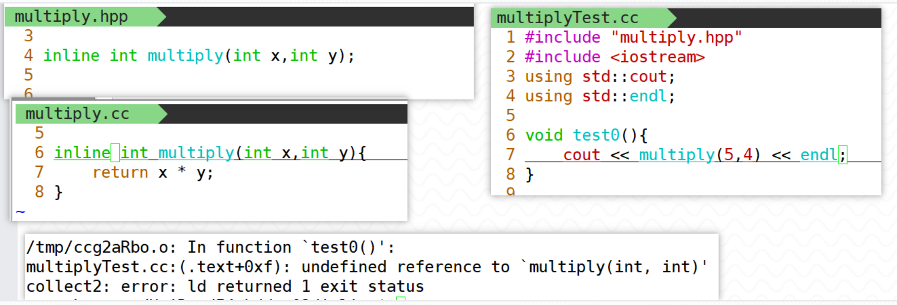

从测试文件出发，编译器看到头文件中声明了 inline 函数；但要展开替换时必须有明确的函数定义。如果头文件中只有声明、没有定义，就可能出现未定义问题。

<font color=red>**inline函数在头文件必须有定义。**</font>

2.谨慎使用内联

内联能提高函数的执行效率，为什么不把所有的函数都定义成内联函数？事实上，内联不是万灵丹，它以代码膨胀（拷贝）为代价，仅仅省去了函数调用的开销，从而提高程序的执行效率。（注意：这里的“函数调用开销”是指参数压栈、跳转、退栈和返回等操作）

如果执行函数体内代码的时间比函数调用的开销大得多，那么 inline 的效率收益会很小。另外，每一处内联函数的调用都要拷贝代码，将使程序的总代码量增大，消耗更多的内存空间。以下情况不宜使用内联：

- 如果函数体内的代码比较长，使用内联将导致可执行代码膨胀过大。

- 如果函数体内出现循环或其他复杂的控制结构，那么执行函数体内代码的时间将比函数调用开销大得多，因此内联的意义并不大。

实际上，inline 在实现的时候就是对编译器的一种请求，因此编译器完全有权利取消一个函数的内联请求。一个好的编译器能够根据函数的定义体，自动取消不值得的内联，或自动地内联一些没有inline 请求的函数。因此编译器往往选择那些短小而简单的函数来内联。

## 异常处理（了解）

异常是描述程序在执行期间产生的问题。

**异常处理**是用于处理运行时错误的机制。它允许开发者在程序中检测错误并采取相应的补救措施，从而使程序能够更清晰地表达错误处理流程。C++ 异常处理涉及三个关键字：`try`、`catch`、`throw`。

抛出异常即检测是否产生异常，在 C++ 中，其采用 **throw 语句**来实现，如果检测到产生异常，则抛出异常。该语句的格式为：

```cpp
throw 表达式;
```

- 先定义抛出异常的规则（throw）。异常是一个表达式，它的值可以是基本类型，也可以是类类型；

```cpp
double division(double x, double y)
{
	if(y == 0)
		throw "Division by zero condition!";
	return x / y;
}
```

**try-catch语句块**的语法如下：

```cpp
try {
//语句块
} catch(异常类型) {
//具体的异常处理...
} ...
catch(异常类型) {
//具体的异常处理...
}
```

try-catch 语句块的 catch 可以有多个，至少要有一个，否则会报错。

- 执行 try 块中的语句，如果执行过程中没有异常抛出，那么执行完后会跳过所有 catch 块，继续执行最后一个 catch 块后面的语句；
- 如果 try 块执行过程中抛出了异常，那么抛出异常后会立即跳转到第一个“异常类型”和抛出异常类型匹配的 catch 块中执行（称作异常被该 catch 块“捕获”），执行完后再跳转到最后一个 catch 块后面继续执行。

注意：<font color=red>**catch 匹配的是异常类型，不是具体信息**</font>。

```cpp
double division(double x,double y){
    if(y == 0){
        throw "Division by zero";
    }
    return x/y;
}

void test0(){
    double x = 100, y = 0;
    try{
        cout << "before" << endl;
        cout << division(x,y) << endl;//异常行后的代码不会执行
        cout << "after" << endl;
    }catch(const char * msg){ //catch的小括号里是类型
    	cout << "hello" << endl;
        cout << "hello," << msg << endl;
    }catch(double x){
        cout << "double" << endl;
    }catch(int x){
        cout << "int" << endl;
    }
    cout << "end test" << endl;
}

```

> [!TIP]
> 初学阶段先掌握异常的控制流：`throw` 抛出，`try` 包住可能出错的代码，`catch` 按类型捕获。工程中更常见的是抛出标准异常类型，如 `std::runtime_error`。

## `内存布局（重要）`

64 位系统理论地址空间可达到 16EB（2^64），但实际可用范围会受到硬件、操作系统和进程地址空间布局限制。

以 32 位系统为例，一个进程在执行时能够访问的是**虚拟地址空间**。理论上为 2^32，即 4GB，其中一部分空间属于内核态，剩余部分属于用户态。从高地址到低地址通常可以理解为以下几个区域：

- 栈区：由编译器和操作系统共同管理，通常由高地址向低地址生长，存放局部变量、函数参数、返回地址等。

- 堆区：由程序员通过 `malloc/free`、`new/delete` 等方式管理，通常由低地址向高地址增长。

- 全局/静态区：读写段（数据段），存放全局变量、静态变量。

- 文字常量区：只读段，存放程序中直接使用的字符串字面值，如 `const char * p = "hello";` 中的 `"hello"`。

- 程序代码区：只读段，存放函数体的二进制代码。

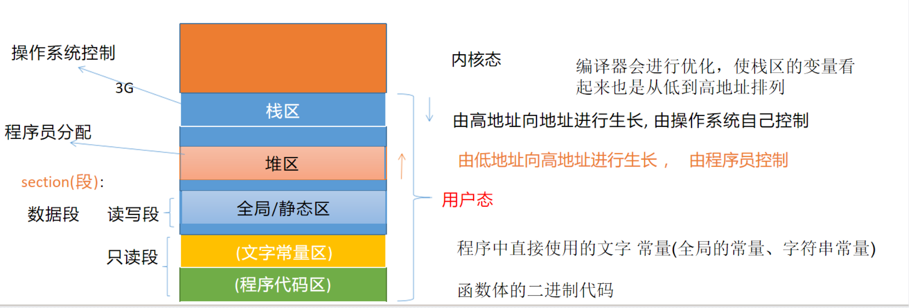

注意:

因为编译器优化、ABI 和系统环境都会影响实际布局，局部变量的地址变化不能作为判断程序正确性的依据。观察地址只适合辅助理解。

> [!CAUTION]
> 内存布局图是理解模型，不是所有平台都完全一致的硬性规则。不要写依赖具体栈地址增长方向或变量相邻关系的代码。

## C风格字符串

**两种形式**

1. 字符数组形式，注意留出一位给终止符'\0'；
2. 字符指针形式，使用字符串常量时，直接定义为 `const char *`，这是 C++ 代码中更安全的 C 风格字符串写法。
3. 字符指针形式, 并在堆上申请空间

输出流运算符对 `char *` 和 `const char *` 做了特殊处理，`cout` 连接字符数组名或字符指针时，默认输出字符串内容，而不是地址。

**字符数组形式**

```cpp
void test1(){

    // 字符数组形式
    char str1[] = "hello";
    // 等价于下面 最后一位'\0'
    char str2[] = {'h','e','l','l','o','\0'};
    // cout输出流运算符默认重载,连接char类型的数组名/指针名时
    // 输出的是内容,而不是地址
    cout << "str1 = " << str1 << endl; // hello
    cout << "str2 = " << str2 << endl; // hello
    str1[0] = 'H';
    cout << "str1 = " << str1 << endl; // Hello

}

```

**字符指针形式**

```cpp
// 字符指针形式
// C++ 中字符串字面值应使用 const char *
// 即指向常量的指针，不能通过指针修改字符串字面值
const char *str1 = "hello";
const char *str2 = "world";
cout << "str1 = " << str1 << endl;
cout << "str2 = " << str2 << endl;
/* str1[0] = "H"; // error read only*/
str1 = "wd";
cout << "str1 = " << str1 << endl;

```

应用：

1. 获取字符串长度

2. 字符串复制

3. 字符串拼接

......

```cpp
void test3(){
    // 字符串复制
    const char *str1 = "hello";
    cout << "str len:" << strlen(str1) << endl;
    char *str2 = (char *)malloc(strlen(str1) + 1);
    strcpy(str2,str1);
    cout << "str2 len: " << strlen(str2 )<< endl;
    cout << "str2 = " << str2 << endl;
    free(str2);
    str2 = NULL;
}

void test4(){
    // C字符串拼接
    const char *str1 = "hello";
    const char *str2 = ",world";
    size_t len = strlen(str1) + strlen(str2) + 1;
    char *str = new char[len]{};
    strcat(str,str1);
    strcat(str,str2);
    cout << "str = " << str << endl;
    delete [] str;
    str = nullptr;
}
```

> [!IMPORTANT]
> C 风格字符串必须以 `'\0'` 结尾。使用 `strlen`、`strcpy`、`strcat` 等函数时，要确保目标空间足够，否则容易发生越界写入。现代 C++ 中更推荐使用 `std::string`。
