# 第二章 类与对象基础

## 面向对象思想

**过程式思维**更关注“步骤”。它通常把数据和处理数据的逻辑分开组织，程序由一系列函数调用和执行流程组成。

**面向对象思维**更关注“对象”。它把相关的数据和操作封装在一起，形成相对独立的个体。对象通过对外提供接口参与协作，外部代码不需要直接了解对象内部的全部实现细节。

过程式思维适合描述清晰、顺序明确的流程；当系统规模变大、状态和协作关系增多时，单纯按流程组织代码会变得难以维护。面向对象通过“抽象、封装、继承、多态”等机制，把复杂系统拆分为多个相对稳定的对象，便于分离关注点。它的难点在于：如何划分类、如何设计对象之间的职责和协作边界。

> [!NOTE]
> 面向对象不是为了“消灭过程”，而是为了更好地组织数据和行为。类中的成员函数依然是过程，只是它们被放到了更合适的对象边界内。

## 类的定义

C++ 用类来描述对象。类是对一组相似事物的抽象，例如摩托车、自行车、汽车都可以抽象出“车”的共同属性和行为。

类的定义分为两个部分：

1. 数据，相当于现实世界中的属性，称为<font color=red>**数据成员**</font>；

2. 对数据的操作，相当于现实世界中的行为，称为<font color=red>**成员函数**</font>。

有些地方，会将类的数据成员和成员函数统称为类的<font color=red>**成员**</font>。

从程序设计的观点来说，**类就是数据类型**，是用户定义的数据类型，对象可以看成某个类的实例（某类的变量）。所以说类是对象的抽象，对象是类的实例。

<span style=color:red;background:yellow>**由对象抽象出类**</span>

<span style=color:red;background:yellow>**由类实例化出对象**</span>

C++ 中用关键字 `class` 定义类。类可以先声明、后定义，完整定义末尾的分号不能省略。

```cpp
// 类名采用大驼峰命名
class MyClass{//类的定义
    //……
    void myFunc(){}  //成员函数 采用小驼峰命名
    int m_a;          //数据成员
};//一定要有分号

//类也可以先声明，后完成定义
class MyClass2;//类的声明

class MyClass2{//类的定义
    //……
};//分号不能省略
```

### 访问修饰符

如下定义一个 `Computer` 类。它有两个属性：品牌和价格；两个行为：设置品牌和设置价格。

```cpp
class Computer {
	void setBrand(const char * brand)
	{
		strcpy(m_brand, brand);
	}

	void setPrice(float price)
	{
		m_price = price;
	}

	char m_brand[20];
	float m_price;
};
```

按之前的理解，现在我们自定义了一个新的类——Computer类，我们需要实例化出一个对象（特定的Computer），再通过这个对象来访问数据成员或调用成员函数，如下：

```cpp
int main(void){
    Computer pc;
    pc.setPrice(10000); //error
    pc.m_price; //error
    return 0;
}

```

结果发现都会报错。这是因为 `class` 中的成员都有访问权限，常见访问修饰符有三种：

<span style=color:red;background:yellow>**public:**</span> 公有权限，在类外可以通过对象直接访问公有成员。

<span style=color:red;background:yellow>**protected:**</span> 保护权限，在本类和派生类中可以访问，在类外不能通过对象直接访问（后面学习继承时展开）。

<span style=color:red;background:yellow>**private:**</span> 私有权限，在本类之外不能直接访问。通常把不希望外部随意修改的数据成员设为 `private`。

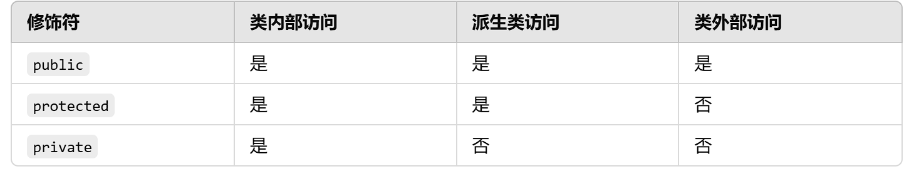

**注意：**

- 类定义中访问修饰符的管理范围从当前行到下一个访问修饰符或类定义结束;

- `class` 定义中如果在成员定义（或声明）之前没有任何访问修饰符，其<font color=red>**默认访问权限为 private**</font>。

  补充：`public` 成员函数也常被称为接口，是类提供给外部使用的访问路径。

> [!IMPORTANT]
> 封装的基本做法是：数据成员尽量设为 `private`，通过必要的 `public` 成员函数对外提供操作。这样可以控制对象状态的合法性。

```cpp
class Computer {
public:
	void setBrand(const char * brand)
	{
		strcpy(m_brand, brand);
	}
	void setPrice(float price)
	{
		m_price = price;
	}
private:
	char m_brand[20];
	float m_price;
};

int main(void){
    Computer pc;
    pc.setPrice(10000); //ok
    pc.m_price; //error,因为_price是私有的
}

```

### struct与class的对比

学习了类的定义后，我们会发现它与C语言中的struct很相似。

- **C语言中的struct**

回顾一下C语言中struct的写法

```cpp
struct Student{
    int number;
    char name[25];
    int score;
};

void test0(){
    struct Student s1;
    struct Student s2 = {10,"Jack",98};
}
```

**struct VS class**

- C 中的 `struct` 只能包含数据成员，可以把数据组织到一起，但不能定义成员函数，也没有访问控制。

- C++ 中的 `struct` 对 C 中的 `struct` 做了扩展，可以定义成员函数，基本能力接近 `class`，默认访问权限是 `public`。

- `class` 默认访问权限是 `private`。

### 成员函数的定义

**成员函数定义的形式**

1. 成员函数定义在类内部
2. 成员函数在类中声明，在类的外部实现
3. 成员函数在类中声明并使用头文件，成员函数的定义使用实现文件

**1. 成员函数定义在类内部**

成员函数定义在类内部时，默认具有内联属性。

```cpp
class Computer {
public:
	void setBrand(const char * brand)
	{
		strcpy(m_brand, brand);
	}
	void setPrice(float price)
	{
		m_price = price;
	}
private:
	char m_brand[20];
	float m_price;
};
```

**2. 成员函数在类内部声明，在类外部定义**

类外定义的成员函数默认不是内联函数，除非使用 inline 来显式声明它为内联函数。

```cpp
class Computer {
public:
	//成员函数
	void setBrand(const char * brand);//设置品牌

	void setPrice(float price);//设置价格

    void print();//打印信息
private:
	//数据成员
	char m_brand[20];
	float m_price;
};

// 定义成员函数的时候结合作用域限定符一起使用
void Computer::setBrand(const char * brand)
{
    strcpy(m_brand, brand);
}
void Computer::setPrice(float price)
{
    m_price = price;
}
```

实际开发中为什么采用成员函数声明和实现分离的写法？

当类中成员函数较多或实现较复杂时，把成员函数声明放在类中，把定义放到类外，可以让类的结构更清晰。

**3. 成员函数在头文件中声明，在实现文件中定义**

为什么一般不在头文件中定义函数？

普通函数或类外成员函数如果直接定义在头文件中，并且该头文件被多个源文件包含，链接时可能出现重定义错误。原因是头文件内容会被展开到每个包含它的源文件中，最终产生多个相同函数定义。

> [!NOTE]
> 定义在类内部的成员函数默认具有内联属性，通常可以放在头文件中。较复杂的成员函数建议只在头文件中声明，把定义放到 `.cc/.cpp` 实现文件中。

```cpp
// 头文件 computer.h
#ifndef __COMPUTER_H__
#define __COMPUTER_H__
class Computer{
private:
    char m_brand[20];
    int m_price;
public:
    // 在类中声明成员函数
    void setBrand(const char * brand);
    void setPrice(int price);
    void printInfo();
};
// -----------------

// 实现文件computer.cc
#include "computer.h"
#include <iostream>
#include <cstring>
using std::cout;
using std::endl;
void Computer::setBrand(const char* brand){
    strcpy(m_brand, brand);
}

void Computer::setPrice(int price){
    m_price = price;
}

void Computer::printInfo(){
    cout << "computer info: brand: " << m_brand
        << ", price: " << m_price << endl;
}
// ---------------------------------

// 测试文件 testComputer.cc
#include "computer.h"
#include <iostream>
#include <cstring>

int main(int argc, char *argv[])
{
    Computer com;
    com.setBrand("Lenovo");
    com.setPrice(3999);
    com.printInfo();
    return 0;
}
```

## 对象的创建

在之前的 Computer 类中，通过自定义的公共成员函数 setBrand 和 setPrice 实现了对数据成员的初始化（严格意义上是赋值）。

实际上，C++ 为类提供了一种<span style=color:red;background:yellow>**特殊的成员函数——构造函数**</span>来完成真正的初始化。

构造函数的作用：初始化对象，让对象从创建完成起就处于有效状态。

构造函数的形式：`类名(形参列表){ }`

注意:

- 没有返回值，即使是 `void` 也不能写；
- 函数名与类名相同，再加上函数参数列表。
- 构造函数在对象创建时<font color=red>**自动调用**</font>，用以完成对象成员变量初始化及其他准备工作（如为指针成员动态申请内存等）。

### 对象的创建规则

1. 当类中没有显式定义任何构造函数时，编译器会自动生成一个默认构造函数。对于默认初始化的局部对象，内置类型数据成员不会被自动清零；

   以Point类为例：

   ```cpp
   class Point {
   public:
	void print()
	{
		cout << "(" << m_x
               << "," << m_y
			<< ")" << endl;
	}
   private:
	int m_x;
	int m_y;
   };

   void test0()
   {
	Point pt; //调用了默认的无参构造
	pt.print();
   }
   //运行结果显示，pt的m_x,m_y都是不确定的值
   ```

   Point pt; 这种方式创建的对象，其数据成员没有被初始化,输出的会是不确定的值

2. 当类中显式提供了任意构造函数时，编译器就不会再自动生成默认构造函数；

   ```cpp
   class Point {
   public:
       Point()
       {
           cout << "Point()" << endl;
           m_x = 0;
           m_y = 0;
       }
	void print()
	{
		cout << "(" << m_x
               << "," << m_y
			<< ")" << endl;
	}
   private:
	int m_x;
	int m_y;
   };

   void test0()
   {
	Point pt;
	pt.print();
   }
   //这次创建pt对象时就调用了自定义的构造函数，而非默认构造函数
   ```

3. 构造函数可以重载,以提升代码的灵活性（可以用多种不同的数据来创建出同一类的对象）。

   ```cpp
   class Point{
   public:
       // 无参构造
       Point(){
           cout << "Point()" << endl;
           m_x = 0;
           m_y = 0;
       }
	// 两参构造
       Point(int x, int y){
           cout << "Point(x,y)" << endl;
           m_x = x;
           m_y = y;
       }
       // 一参构造
       Point(int x){
           cout << "Point(x)" << endl;
           m_x = x;
           m_y = 0;
       }
       void print(){
           cout << "(x,y) = " << "("
               <<m_x << "," << m_y << ")"
               << endl;
       }
   private:
       int m_x;
       int m_y;
   };

   void test(){
       Point p;// 调用无参构造
       p.print();

       Point p2(1,2);// 调用两参构造
       p2.print();

       Point p3(10);// 调用一参构造
       p3.print();
   }
   ```

4. 如果还希望通过无参构造函数创建对象，则必须手动提供一个无参构造函数，或者让所有构造参数都有默认值。

> [!CAUTION]
> “编译器提供默认构造函数”不等于“数据成员都会被初始化”。内置类型成员如果没有被初始化，值是不确定的。

### 对象的数据成员初始化

上述例子中，在构造函数体中对数据成员进行赋值，严格来说不属于初始化，而是对象成员已经初始化之后再被赋值。

在C++中，对于类中数据成员的初始化，**推荐**使用<span style=color:red;background:yellow>**初始化列表**</span>完成。

初始化列表位于构造函数形参列表之后，函数体之前，用冒号开始，如果有多个数据成员，再用逗号分隔，初始值放在一对小括号中。

```cpp
class Point {
public:
	//...
	Point(int x = 0, int y = 0)
	: m_x(x)
    , m_y(y)
	{
		cout << "Point(int,int)" << endl;
	}
	//...
};
```

细节注意:

- 如果没有在构造函数初始化列表中显式初始化成员，则该成员会在构造函数体执行之前按规则默认初始化。
- 数据成员的初始化顺序不取决于它们在初始化列表中的书写顺序，而取决于它们在类中声明的顺序。

- 构造函数的参数也可以按从右向左规则赋默认值，同样的，如果构造函数的声明和定义分开写，只用在声明或定义中的一处设置参数默认值，一般建议在声明中设置默认值。

  ````cpp
  class Point {
  public:
	Point(int ix, int iy = 0);//默认参数设置在声明时
	//...
  };

  Point::Point(int ix, int iy)
  : m_x(ix)
  , m_y(iy)
  {
	cout << "Point(int,int)" << endl;
  }

  void test0(){
      Point pt(10);
  }
  ````

- C++11之后，普通的数据成员也可以在声明时就进行初始化<font color=red>**（类似于默认值的性质）**</font>。

  但一些特殊的数据成员初始化只能在初始化列表中进行，故一般情况下统一推荐在初始化列表中进行数据成员初始化。

```cpp
class Point {
public:
	//...
    int m_x = 0;//C++11
    int m_y = 0;
};
```

> [!IMPORTANT]
> 构造函数初始化列表优先于构造函数体执行。`const` 成员、引用成员、没有默认构造函数的对象成员，必须通过初始化列表初始化。

### 对象所占空间大小

之前在讲引用时提过，使用引用作为函数返回值可以避免多余复制。内置类型对象通常较小，但自定义类型对象可能包含多个数据成员，甚至管理堆资源，因此复制成本可能很高。

使用<font color=red>**sizeof**</font>查看一个类的大小和查看该类对象的大小，得到的结果是相同的。可以理解为：类定义决定了该类对象需要的存储布局。

```cpp
void test0(){
    Point pt(1,2);
    cout << sizeof(Point) << endl;
    cout << sizeof(pt) << endl;
 }
```

成员函数通常不影响单个对象的大小，对象大小主要与非静态数据成员、内存对齐有关（后面学习继承、多态后，对象内存布局会更复杂）。

现阶段，在不考虑继承多态的情况下，我们做以下测试。发现有时一个类所占空间大小就是其数据成员类型所占大小之和，有时则不是，这就是因为有<span style=color:red;background:yellow>**内存对齐**</span>的机制。

```cpp
class A{
    int m_num;
    double m_price;
};

class B{
    int m_num;
    int m_price;
};

//sizeof(A) = 16
//sizeof(B) = 8
```

- **为什么要进行内存对齐？**

  1. 平台原因（移植原因）：不是所有硬件平台都能访问任意地址上的任意数据；某些硬件平台只能在特定地址处访问特定类型的数据，否则可能抛出硬件异常。

  2. 性能原因：CPU 访问内存通常按块读取。若不进行内存对齐，访问一个数据可能需要两次内存读取；对齐后通常可以减少访问次数。

  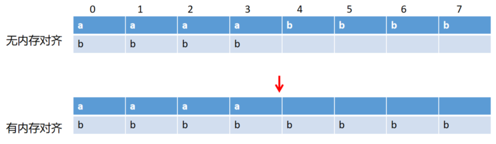

  64位系统默认以8个字节的块大小进行读取。

  如果没有内存对齐机制，CPU读取m_price时，需要两次总线周期来访问内存，第一次读取 m_price数据前四个字节的内容，第二次读取后四个字节的内容，还要经过计算，将它们合并成一个数据。

  有了内存对齐机制后，以浪费4个字节的空间为代价，读取m_price时只需要一次访问，所以编译器会隐式地进行内存对齐。

  **规则：**

  1. <span style=color:red;background:yellow>**整体按照类中最大对齐要求的数据成员的倍数对齐；**</span>

  2. 自定义类型对象所占的空间大小还与这些数据成员的顺序有关

     ```cpp
     class C{
         int m_c1;
         int m_c2;
         double m_c3;
     };

     class D{
         int m_d1;
         double m_d2;
         int m_d3;
     };

     //sizeof(C) = 16
     //sizeof(D) = 24
     ```

  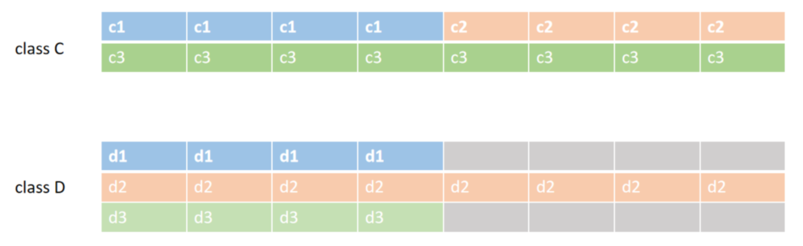
  3. 如果数据成员中有数组类型，数组本身的对齐要求取决于元素类型，而不是数组总大小。

     ```cpp
     class E{
         double m_e;
         char m_eArr[20];
         double m_e1;
         int m_e2;
     };

     class F{
         char m_fArr[20];
     };

     //sizeof(E) = 48
   //sizeof(F) = 20
   ```

  4. **特殊情况**，如果定义了一个空类，这个类依然是可以创建对象的。空类对象所占空间为1个字节，这仅仅是编译器的一种占位机制。

     ```cpp
     class A{};

     A a;
     ```

在 C 语言结构体代码中，我们可能会看到 `#pragma pack` 设置。`#pragma pack(n)` 表示设置最大对齐系数，`n` 可以取值 1、2、4、8、16 等。在 C++ 中也可以使用这个设置，最终对齐效果通常取 `#pragma pack` 指定值和成员自身对齐要求中的较小者。

> [!NOTE]
> `sizeof(类)` 反映的是对象布局大小，不包含成员函数代码大小，也不包含指针指向的堆空间大小。

### 指针数据成员

类的数据成员中有指针时，通常意味着对象可能管理一份外部资源，例如堆空间。此时必须明确资源的申请、释放和复制规则。

**在初始化列表中申请空间，在函数体中复制内容。**

```cpp
class Computer {
public:
	Computer(const char * brand, double price)
	: m_brand(new char[strlen(brand) + 1]())
	, m_price(price)
	{
        strcpy(m_brand,brand);
    }

private:
	char * m_brand;
	double m_price;
};

void test0(){
    Computer pc("Apple",12000);
}
```

思考一下，以上代码有没有问题？

代码运行没有报错，但使用 memcheck 工具检查会发现内存泄漏。有 `new` 表达式被执行，就要有对应的 `delete` 表达式回收。如果没有回收机制，对象被销毁时，它管理的堆空间不会自动释放。

那么如何进行妥善的内存回收呢？这需要交给**析构函数**来完成。

## 对象的销毁

**析构函数概述**

1. 基本语法:`~类名(){ }`
2. 执行特点：对象在销毁时，一定会调用析构函数
3. 析构函数的作用：清理资源。
   - 释放动态内存：使用 `new` 分配的堆空间内存需要在析构函数中使用 `delete` 释放。
   - 关闭文件句柄：如果在对象的生命周期中打开了文件，析构函数可以确保在对象销毁时关闭文件。
   - 断开网络连接：在网络编程中，析构函数可以确保在对象销毁时关闭套接字连接。
   - .......
4. 形式：【特殊的成员函数】

   - 没有返回值，即使是void也没有
   - 没有参数
   - 函数名与类名相同，在类名之前需要加上一个波浪号~
5. 析构函数只有一个（不能重载）
6. **如果没有显式定义析构函数，编译器会自动提供一个默认析构函数**
7. <span style=color:red;background:yellow>**当对象生命周期结束时，会自动调用析构函数【非常重要】**</span>

### 自定义析构函数

之前的例子中，我们没有显式定义出析构函数，但是没有问题，系统会自动提供一个默认的析构。

<span style=color:red;background:yellow>**析构函数用于清理对象生命周期内持有的资源。**</span>

当数据成员中有指针，并且对象负责管理该指针指向的堆空间时，默认析构函数就不够用了。此时需要自定义析构函数，在其中释放堆资源，避免内存泄漏。

同样以Computer类为例

````cpp
class Computer {
private:
	char * m_brand;
	double m_price;
public:
	Computer(const char * brand, double price)
	: m_brand(new char[strlen(brand) + 1]())
	, m_price(price)
	{}
	~Computer()
	{
        if(m_brand){
            delete [] m_brand;
	m_brand = nullptr; //设为空指针，安全回收
        }
		cout << "~Computer()" << endl;
	}
};
````

析构函数的规范写法为什么这样写呢？实际上，如果类中没有指针数据成员，即数据成员没有申请堆空间的情况下，默认的析构函数就够用了。

（1）如果没有进行安全回收这一步会引发很多问题，此时我们没有学习类与对象的更多知识，可以做个简单小实验，看看会发生什么情况，思考一下原因

```cpp
~Computer()
{
	if(m_brand){
	delete [] m_brand;
        //_brand = nullptr//设为空指针，安全回收
       }
	cout << "~Computer()" << endl;
}

void test0(){
    Computer pc("apple",12000);
    pc.print();
    pc.~Computer();//手动调用析构函数
}
```

——第一次手动调用析构函数时已经回收了这片堆空间，但是m_brand存的地址值依然有效，当对象销毁时自动调用析构函数，依然会进入if语句，再一次试图回收这片空间，发生double free错误。

（2）`delete` 空指针是安全的，不会产生效果。这里的 `if(m_brand)` 判断主要是为了让代码意图更直观；真正关键的是避免重复释放同一片非空堆空间。

> 注意：对象被销毁，一定会调用析构函数;
>
> ​			<font color=red>**调用了析构函数，对象并不会被销毁。**</font>

上述例子中手动调用了析构函数，发现之后又自动调用了一次析构函数。

那么在手动调用析构函数之后，再次调用print函数,看看会发生什么？

```cpp
Computer pc("apple",12000);
pc.~Computer();
pc.print();
```

发现程序在print执行时尝试对char型空指针进行输出，导致程序中断。

结论：<font color=red>**不建议手动调用析构函数，因为容易导致各种问题，应该让析构函数自动被调用。**</font>

> [!CAUTION]
> 析构函数被调用，并不等于对象本身的存储空间已经释放。手动调用析构函数后继续使用对象，或者让析构函数再次自动执行，都很容易导致未定义行为。

> **注：**析构函数是可以通过对象来调用，而构造函数不同。
>
> 构造函数是最特殊的成员函数，不是由对象来调用构造函数。而是，编译器在看到创建对象的语句时，会自动生成一段代码，在这段代码中调用构造函数，利用传入的参数来初始化对象。

### 析构函数的调用时机（重点）

1. 对于**全局对象**，<font color=red>**整个程序结束时**</font>，自动调用全局对象的析构函数。
2. 对于**局部对象**，在<font color=red>**程序离开局部对象的作用域**</font>时调用对象的析构函数。
3. 对于**静态对象**，在<font color=red>**整个程序结束时**</font>调用析构函数。
4. 对于 **堆对象**，<span style=color:red;background:yellow>**在使用 delete 删除该对象时，调用析构函数。**</span>

```cpp
void test(){
    // 堆对象
    Computer *pc = new Computer("apple",6500);
    delete pc; // 调用析构函数
    cout << "after delete" << endl;
}

```

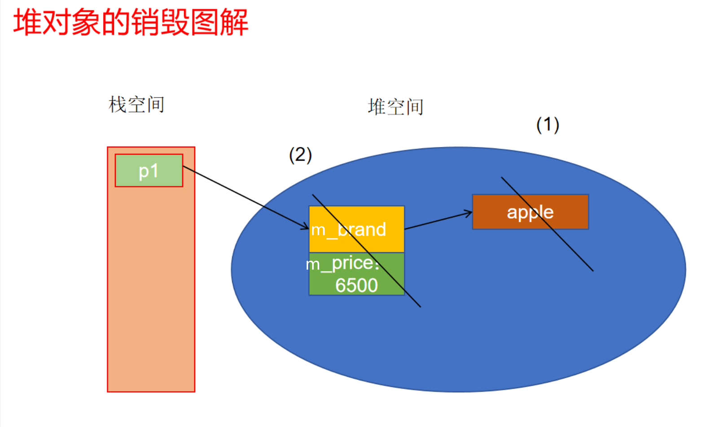

通过 **`new`** 操作符在堆上创建对象时，如果该对象的某些**数据成员**本身也是通过 `new` 在堆上动态分配的内存，那么在回收对象时，需要确保这些动态资源也被正确释放。通常做法是在对象的**析构函数**中显式释放成员管理的资源。

## 本类型对象的复制

### 拷贝构造函数

对于内置类型而言，使用一个变量初始化另一个变量是很常见的操作

```cpp
int x = 1;
int y = x;
```

那么对于自定义类型，我们也希望能有这样的效果，如

```cpp
Point pt1(1,2);
Point pt2 = pt1;
pt2.print();
```

发现这种操作也是可以通过的。执行 Point pt2 = pt1; 语句时， pt1 对象已经存在，而 pt2 对象还不存在，所以也是这句创建了 pt2 对象，既然涉及到对象的创建，就必然需要调用构造函数，而这里会调用的就是拷贝构造函数(复制构造函数)。

#### 拷贝构造函数的定义

拷贝构造函数的形式是固定的：<span style=color:red;background:yellow>**类名(const 类名 &)  **</span>

1. 该函数是一个构造函数  —— 拷贝构造也是构造！
2. 该函数用一个已经存在的同类型的对象，来初始化新对象，即对对象本身进行复制

没有显式定义拷贝构造函数，这条复制语句依然可以通过，说明编译器自动提供了默认的拷贝构造函数。其形式是：

```cpp
Point(const Point & rhs)
: m_x(rhs.m_x)
, m_y(rhs.m_y)
{}
```

 拷贝构造函数看起来非常简单，那么我们尝试对Computer类的对象进行同样的复制操作。发现同样可以编译通过，但运行报错。思考一下为什么？

```cpp
Computer pc("Acer",4500);
Computer pc2 = pc;//调用拷贝构造函数

// 拷贝构造函数
Computer(const Computer & rhs) : m_brand(rhs.m_brand) , m_price(rhs.m_price){
    cout << "Computer(const Computer &)" << endl;
}
```

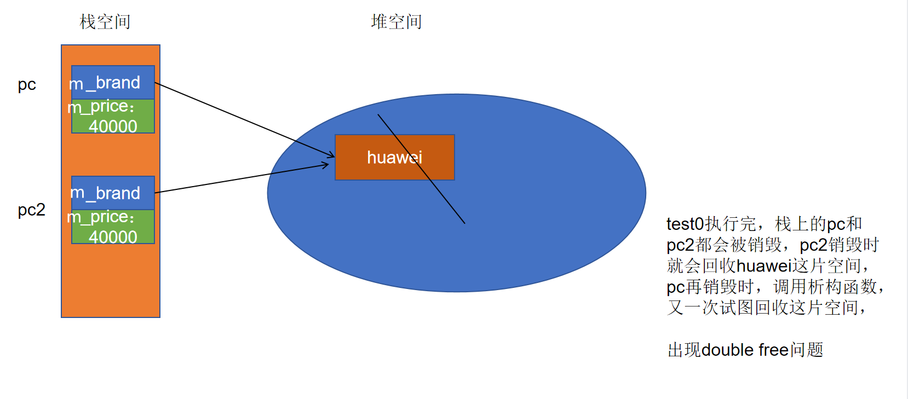

如果使用默认拷贝构造函数，`pc2` 会对 `pc` 的 `m_brand` 进行<font color=red>**浅拷贝**</font>，两个对象指向同一片内存；`pc2` 被销毁时会释放这片堆空间，`pc` 再销毁时又会试图释放同一片空间，出现 double free 问题。

所以，当类拥有并管理指针资源时，需要显式定义拷贝构造函数，并使用<font color=red>**深拷贝**</font>：先申请新的空间，再复制内容。

> [!IMPORTANT]
> 只要类自己管理堆资源，就要重点检查拷贝构造、赋值运算符和析构函数。默认生成的版本只会逐成员复制，指针成员会被复制地址，而不会复制指向的资源。

```cpp
Computer::Computer(const Computer & rhs)
: m_brand(new char[strlen(rhs.m_brand) + 1]())
, m_price(rhs.m_price)
{
	strcpy(m_brand, rhs.m_brand);
}
```

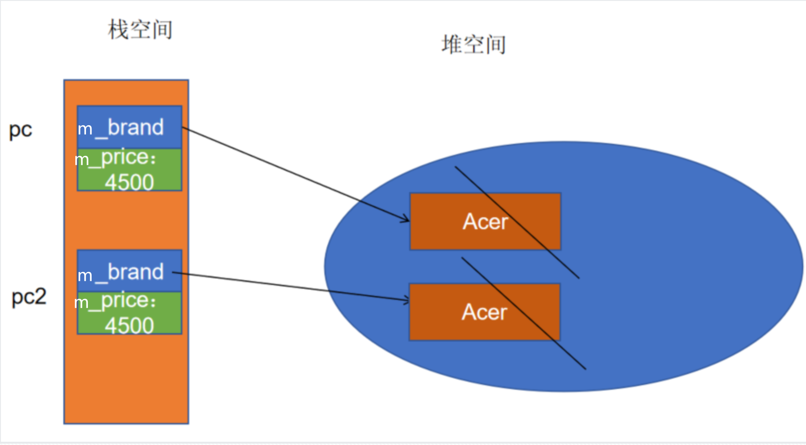

深拷贝 VS 浅拷贝

| **特性**     | 浅拷贝 (Shallow Copy) | 深拷贝 (Deep Copy)        |
| :----------- | :-------------------- | :------------------------ |
| **复制内容** | 只复制指针地址        | 复制指针指向的实际数据    |
| **内存关系** | 新旧对象共享同一内存  | 新旧对象有独立内存        |
| **修改影响** | 修改一方会影响另一方  | 修改一方不影响另一方      |
| **资源释放** | 双重释放风险（崩溃）  | 可安全释放                |
| **实现方式** | 编译器默认生成        | 需手动实现                |
| **性能开销** | 低（仅复制指针）      | 高（需分配内存+复制数据） |

#### 拷贝构造函数的调用时机（重点）

1. 当使用一个已经存在的对象初始化另一个同类型的新对象时;

   ```cpp
   void test0(){
       Point pt(10,8);
       // 利用一个已经存在的对象用复制的方式创建新的对象
       // 调用拷贝构造, 用=连接是为了跟内置类型保持一致
       Point pt2 = pt;
       pt2.print();
   }
   ```

2. 当函数参数（实参和形参的类型都是对象），形参与实参结合时（实参初始化形参）;

   —— 为了避免这次不必要的拷贝，可以使用引用作为参数

   ```cpp
   //当函数的实参和形参都是对象时,利用实参初始化形参,相当于值传递,会发生复制
   // 为了避免这次多余的复制,可以将参数改为引用
   /* void func1(Point & p) */
   void func1(Point p)
   {
       p.print();
   }

   void test1()
   {
       Point p(1,1);
       func1(p);
   }
   ```

3. 当函数的返回值是对象，执行return语句时（编译器有优化）。

——为了避免这次多余的拷贝，可以使用引用作为返回值，但一定要确保返回值的生命周期大于函数的生命周期

```cpp
// 函数的返回值是对象时, 函数体中执行return语句时会发生复制
// 为了避免多余的复制,可以将函数的返回值改为引用,并且要确保引用绑定的对象的生命周期比函数更长
Point p(1,1);
/* Point & func2() */
Point func2()
{
    return p;
}

void test2()
{
    // 直接调用
	func2();
    // 使用对象接收
    Point p = func2();//编译器优化 可能看不到拷贝构造函数的调用 需要加上去优化参数进行编译
}
```

第三种情况直接编译时，可能因为返回值优化看不到拷贝构造函数的调用。加上去优化参数进行编译，可以观察到更接近理论模型的调用过程。

```cpp
g++ CopyComputer.cc -fno-elide-constructors --std=c++11
```

#### 拷贝构造函数的形式探究

<span style=color:red;background:yellow>**思考1：拷贝构造函数是否可以去掉引用符号？**</span>

—— 类名(const 类名)   形式，首先编译器不允许这样写，直接报错

如果拷贝函数的参数中去掉引用符号，进行拷贝时调用拷贝构造函数的过程中会发生“实参和形参都是对象，用实参初始化形参”（拷贝构造第二种调用时机），会再一次调用拷贝构造函数。形成递归调用，直到栈溢出，导致程序崩溃。

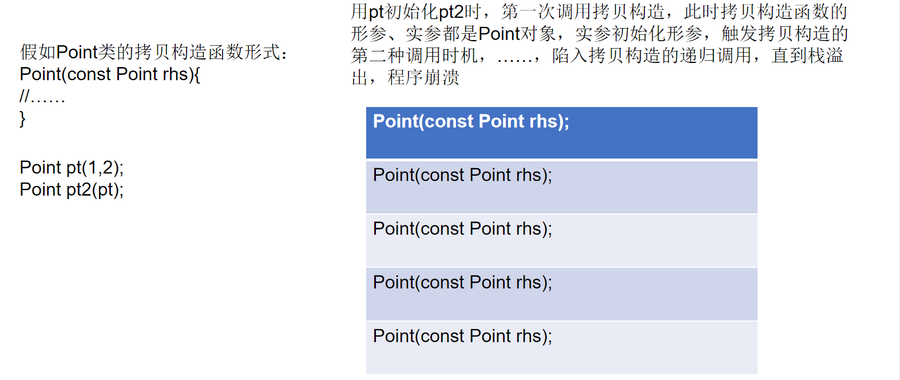

```cpp
// 如果拷贝构造函数的形式是Point(const Point rhs)
// Point pt2(pt)
// 形参的初始化const Point rhs = pt; 会触发拷贝构造的第二种时机 会对pt进行复制
// const Point rhs = pt;
// ......
// 如此会导致拷贝构造函数递归调用,直到栈溢出,程序崩溃
Point(const Point & rhs)
: m_ix(rhs.m_ix)
, m_iy(rhs.m_iy)
{
    cout << "Point(const Point &)" << endl;
}

```

<span style=color:red;background:yellow>**思考2：拷贝构造函数是否可以去掉const？**</span>

—— 类名(类名 &) 形式      编译器不会报错

加const的目的:

1. 确保原始对象的数据成员不被改变
2. 为了能够复制临时对象的内容，因为非const引用不能绑定临时变量（右值）

> 如果不加const，那么如下操作是可以通过的，不合理。
>
> ```cpp
> Point(Point & rhs)
> : m_ix(rhs.m_ix)
> , m_iy(rhs.m_iy)
> {
>     rhs.m_ix = 0;
>     rhs.m_iy = 0;
>     cout << "Point(const Point &)" << endl;
> }
> ```

> **左值与右值**
>
> - 左值 : 表示的是**一个占据内存并可以取地址的对象**。简单来说，左值是表达式**可以放在赋值运算符 `=` 左侧**的内容，是可以被**引用**的、持久存在的内存位置。
>
>   - 左值有**确定的内存地址**。
>
>   - 左值是可以被赋值的，即可以放在 `=` 左边。
>
>   - 左值通常表示一个变量或对象，可以通过引用来获取它的内存地址。
>
>     ```cpp
>     int x = 5;    // x是一个变量 是左值, 占据内存，有具体的地址
>     x = 10;       // x 可以被赋值，因此 x 是左值
>     int & ref = x; // 非const引用只能绑定左值
>     ```
>
>
>
> - 右值 : **没有明确存储位置的临时对象**，通常用于表达式的结果。右值是**不能取地址**的，通常表示临时的、短暂存在的值。
>
>   - 右值是**临时的值**，没有明确的内存地址，不能取地址。
>
>   - 右值通常是**字面常量**或**表达式计算的结果**。
>
>   - 右值只能放在赋值运算符的右边，不能作为左值（因为没有存储位置）。
>
>     ```cpp
>      int y = 5 + 3; // 5 + 3 是右值，表达式的结果是一个临时值
>     int z = 10;    // 10 是一个字面常量，也是右值
>     // int & ref2 = 10; error 非const引用不能绑定右值
>     const int & ref = 10; // const引用既可以绑定左值, 也可以绑定右值
>     ```
>
>
>
> ```cpp
>void test()
> {
>     // num为左值可以取地址  1为右值不能取地址
>     int num = 1;
>     &num;
>     // &1 // 字面常量1 没有存在内存中
>     int & ref = num; // 非const常量只能绑定左值, 不能绑定右值
>     // int & ref2 = 10;
>     // const引用既能够绑定左值,又能绑定右值
>     const int & ref3 = 10;
>     const int & ref4 = num;
> }
> ```
>
>
>
> 如果拷贝构造函数中去掉const
>
> ```cpp
>// 如果拷贝构造函数中去掉const
> void test()
> {
>     // Computer("apple",12000) 是一个临时变量/对象(匿名对象),是右值
>     // 非const引用不能绑定右值
> 	Computer & rhs = Computer("apple",12000); //error
> }
> ```
>
> 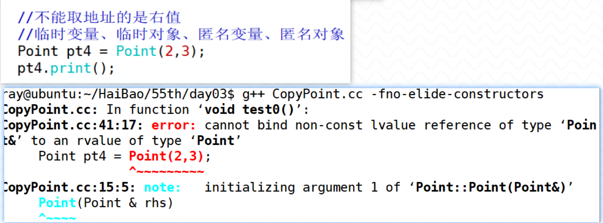

### 赋值运算符函数

赋值运算同样是一种很常见的运算，比如：

```cpp
int x = 1, y = 2;
x = y;
```

自定义类型当然也需要这种运算，比如：

```cpp
Point pt1(1, 2), pt2(3, 4);
pt1 = pt2;//赋值操作
```

在执行 `pt1 = pt2;` 时，`pt1` 与 `pt2` 都已经存在，所以不存在对象构造。这要与 `Point pt2 = pt1;` 区分开，后者是在创建新对象。

#### 赋值运算符函数的形式

在上述例子中，当 = 作用于对象时，其实是把它当成一个函数来看待的。在执行 pt1 = pt2; 该语句时，需要调用的是<span style=color:red;background:yellow>**赋值运算符函数**</span>。

其形式如下：

<span style=color:red;background:yellow>**类名& operator=(const 类名 &)**</span>

1. `类名 &`：返回值类型是当前对象的引用；
2. `const 类名 &`：参数是常量引用，避免复制，并防止函数内部修改右操作数。

对Point类进行测试时，会发现我们不需要显式给出赋值运算符函数，就可以执行测试。这是因为如果类中没有显式定义赋值运算符函数时，编译器会自动提供一个赋值运算符函数。对于 Point 类而言，其实现如下:

```cpp
Point & Point::operator=(const Point & rhs)
{
	m_ix = rhs.m_ix;
	m_iy = rhs.m_iy;
}
```

手动写出赋值运算符，再加上函数调用的提示语句。执行发现语句被输出，也就是说，**当对象已经创建时，将另一个对象的内容复制给这个对象，会调用赋值运算符函数**。

那么现在又产生了问题

首先，赋值号是一个双目运算符，如果把它视为一个函数，那么应该有两个参数。但是从赋值运算符函数的形式上看只接收了一个参数，为什么？

其次，赋值运算符函数返回类型是 `Point &`，那么它返回什么？答案是返回当前对象，即 `*this`。要理解这一点，需要先理解 <font color=red>**this 指针**</font>。

#### this指针

**this指针的本质**

- `this` 指针的本质是一个常量指针，形式可以理解为 `Type * const this`；
- `this` 指针指向调用当前成员函数的对象；
- 它保存调用对象的地址，指向不能被修改。这样成员函数才知道自己正在操作哪个对象的数据成员；
- `this` 是一个隐藏参数。非静态成员函数被调用时，编译器会隐式传入调用对象的地址作为 `this` 指针。

```cpp
//返回值类型为Point&
//函数名operator=
//this不能显式写在形参列表中，它是编译器隐式传入的参数
Point & operator=(const Point & p)
{
    // 省略this的访问
    /* m_x = p.m_x; */
    /* m_y = p.m_y; */

    // 对this指针解引用后通过.访问对象中成员
    /* (*this).m_x = p.m_x; */
    /* (*this).m_y = p.m_y; */

    // 可以使用->箭头运算符访问对象成员，简化写法
    this -> m_x = p.m_x;
    this -> m_y = p.m_y;
    return *this;
}

void print()
{
    // this指针指向当前对象 即调用print函数的对象
    // 通过this + 箭头运算符来访问对象中成员
    cout << "x=" << this->m_x
        << ", y=" << this->m_y << endl;
}
```

> **this指针存在哪儿**
>
> - `this` 是编译器为非静态成员函数隐式传入的参数。具体放在寄存器还是栈上，取决于平台 ABI 和编译器实现。
>
>
>
>**this指针的生命周期**
>
>**this 指针的生命周期开始于成员函数的执行开始。**当一个**非静态**成员函数被调用时，this 指针被自动设置为指向调用该函数的对象实例。在成员函数执行期间，this 指针一直有效。它可以被用来访问调用对象的成员变量和成员函数。<font color=red>**this指针的生命周期结束于成员函数的执行结束。**</font>当成员函数返回时，this指针的作用范围就结束了。
>
>
>
>要注意，this指针的生命周期与它所指向的对象的生命周期虽然并不完全相同，但是是相关的。
>
>this指针本身只在成员函数执行期间存在，但它指向的对象可能在成员函数执行前就已经存在，并且在成员函数执行后继续存在。
>
>如果成员函数是通过一个已经销毁或未初始化的对象调用的，this指针将是悬空的，它的使用将会是未定义行为。

**理解以下问题：**

1. 对象调用函数时，是如何找到自己本对象的数据成员的？    —— 通过this指针
2. this指针代表的是什么？                                                         —— 指向本对象
3. this指针在参数列表中的什么位置？                                       ——  由编译器隐式传入，通常可理解为隐藏的第一个参数
4. this指针的形式是什么？                                                         ——  `类名 * const this`（常量指针）

```cpp
Point & operator=(const Point & rhs){
    this->m_ix = rhs.m_ix;
    this->m_iy = rhs.m_iy;
    cout << "Point & operator=(const Point &)" << endl;
    return *this;
}
```

成员函数中可以加上this指针，展示本对象通过this指针找到本对象的数据成员。但是不要在参数列表中显式加上this指针，因为编译器一定会在参数列表的第一位加上this指针，如果显式再给一个，参数数量就不对了。

#### 赋值运算符函数的定义

注意：如果对象的指针数据成员申请了堆空间，默认的赋值运算符函数就不够用了，以Computer类为例，默认的赋值运算符函数长这样

```cpp
Computer & operator=(const Computer & rhs){
    this->m_brand = rhs.m_brand;
    this->m_price = rhs.m_price;
    return *this;
}
```

这里的指针成员 `m_brand` 进行的是浅拷贝，会造成问题。

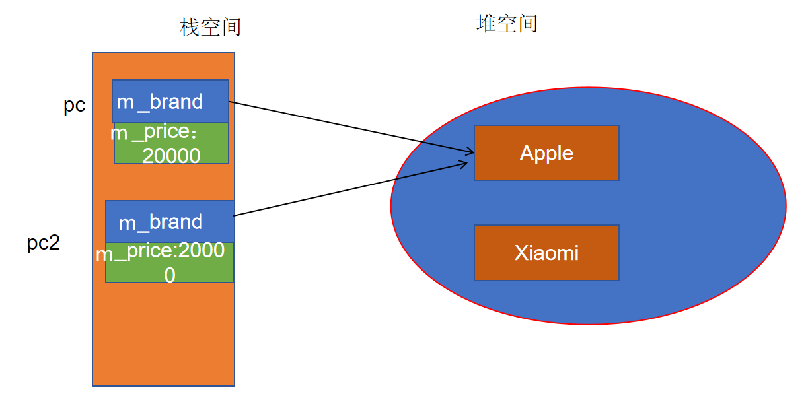

**思考：**

如果直接进行深拷贝，可行吗？

```cpp
Computer & operator=(const Computer & rhs){
    this->m_brand = new char[strlen(rhs.m_brand)+1]{};
    strcpy(this->m_brand, rhs.m_brand);
    this->m_price = rhs.m_price;
    return *this;
}
```

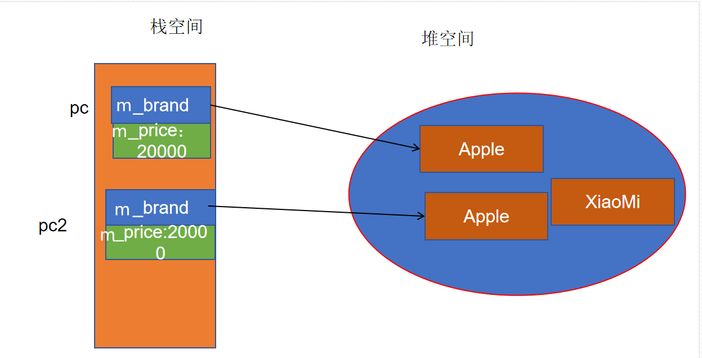

会有内存泄漏，需要先回收掉 `pc2.m_brand` 原本申请的空间。

如果用 `delete` 回收掉 `pc2.m_brand` 原本申请的空间，再进行深拷贝，是否可行？

—— 还要考虑自赋值

<span style=color:red;background:yellow>**总结步骤—— 四步走（重点）：**</span>

1. 考虑自赋值问题
2. 回收左操作数的数据成员原本申请的堆空间
3. 深拷贝（以及其他的数据成员的赋值）
4. 返回 `*this`（本对象）

```cpp
Computer & operator=(const Computer & rhs){
    // 1.自赋值情况判断
    if(this != &rhs){
        delete [] m_brand; //回收当前对象中指针成员原来申请的堆空间
        m_brand = new char[strlen(rhs.m_brand) + 1](); // 深拷贝
        strcpy(m_brand,rhs.m_brand);
        m_price = rhs.m_price; // 其他数据成员的简单赋值
    }
    return *this; // 返回当前对象
}
```

> [!CAUTION]
> 赋值运算符一定要考虑自赋值。否则 `pc = pc;` 这类代码可能先释放自身资源，再从已经释放的资源中复制数据。

#### 赋值运算符函数的形式探究

关于赋值运算符函数的形式探究也是面试中比较可能出现的问题，以下提出四个思考：

1. 赋值运算符函数的返回必须是一个引用吗？

```cpp
Computer operator=(const Computer & rhs)
{
    ……
    return *this;
}
```

**—— 会造成一次多余的拷贝，增加不必要的开销**

2. 赋值操作符函数的返回类型可以是void吗？

```cpp
void operator=(const Computer & rhs)
{
    ……
}
```

—— **无法处理连续赋值**

3. 赋值操作符函数的参数一定要是引用吗？

```cpp
Computer & operator=(const Computer rhs)
{
	……
	return *this;
}
```

**—— 会造成一次多余的拷贝，增加不必要的开销**（符合拷贝构造函数的第二种调用时机）

注意：此时讨论的是赋值运算符函数的参数形式，前提是拷贝构造是正常的。拷贝构造的参数依然是引用，就不会陷入拷贝构造递归调用

4. 赋值操作符函数的参数必须是一个const引用吗？

```cpp
Computer & operator=(Computer & rhs)
{
	……
	return *this;
}
```

—— **无法避免在赋值运算符函数中修改右操作的内容，不合理**

—— 而且不能处理通过右值属性的对象进行赋值的情况

```cpp
// pc = Computer("xiaomi",5999); // error
// 即 pc.operator=(Computer("xiaomi",5999)) // error
// pc.print();
```

### 三合成原则

<span style=color:red;background:yellow>**三合成原则**</span>很容易在面试时被问到：

**拷贝构造函数、赋值运算符函数、析构函数，如果需要手动定义其中的一个，那么另外两个也需要手动定义。**

> [!IMPORTANT]
> 三合成原则的根本原因是“资源所有权”。只要类负责管理资源，就必须明确资源如何复制、如何赋值、如何释放。现代 C++ 中还会进一步扩展为“五法则”：析构、拷贝构造、拷贝赋值、移动构造、移动赋值。

## 特殊的数据成员

在 C++ 的类中，有4种比较特殊的数据成员，分别是常量成员、引用成员、类对象成员和静态成员，它们的初始化与普通数据成员有所不同。

### 常量数据成员

当数据成员用 `const` 关键字修饰以后，就成为常量成员。一经初始化，该数据成员便具有只读属性。事实上，在构造函数体内对 `const` 数据成员赋值是非法的，<span style=color:red;background:yellow>**const 数据成员需在初始化列表中进行初始化**</span>（C++11 之后也允许在声明时给出默认成员初始化值）。

普通的 `const` 常量必须在定义时初始化，初始化之后不再允许修改值；

`const` 数据成员初始化后也不再允许修改值。

```cpp
class Point {
public:
	Point(int ix, int iy)
	: m_ix(ix)
	, m_iy(iy)
	{}
private:
	const int m_ix;
	const int m_iy;
};
```

```cpp
class Point {
public:
	Point(int ix, int iy)
	: m_ix(ix)
	, m_iy(iy)
	{}
private:
    // C++11后允许在声明时进行初始化
    // 在这里初始化的值理解为默认值
	const int m_ix = 1;
	const int m_iy = 1;
};

void test(){
    Point p1(10,20);
    Point p2 = p1;

    // p2 = p1; // error 不能进行赋值操作
}
```

### 引用数据成员

<span style=color:red;background:yellow>**引用数据成员在初始化列表中进行初始化**</span>，C++11 之后允许在声明时给出默认绑定。

之前的学习中，我们知道了引用要绑定到已经存在的变量，引用成员同样如此。

```cpp
class Point {
public:
	Point(int ix, int iy)
	: m_ix(ix)
	, m_iy(iy)
	, m_iz(m_ix)
	{}
private:
	int m_ix;
	int m_iy;
	int & m_iz;
};
```

思考：构造函数再接收一个参数，用这个参数初始化引用成员可以吗？

```cpp
class Point
{
public:
	Point(int x,int y,int z)
	: m_ix(x)
	, m_iy(y)
	, m_iz(z) //这样绑定可行吗
	{}

private:
	int m_ix;
	int m_iy;
	int & m_iz;
    // int & m_iz = m_ix; C++11之后允许在声明时初始化（绑定)
};
```

**引用成员需要绑定一个已经存在的、且在这个引用成员的生命周期内始终有效的变量（对象）。**

> [!CAUTION]
> 不要让引用成员绑定到构造函数的值参数或局部变量，因为它们会在构造函数结束后失效，引用成员会变成悬空引用。

```cpp
class A
{
public:
    A(int & num)
    : m_num(num)
    {
        cout << "constructor" << endl;
    }
    void print()
    {
        cout << "m_num=" << m_num << endl;
    }
private:
    int & m_num;
};

void test(){
    int num =100;
    A a{num};
    a.print();
    num = 200;
    a.print();
}
```

### 对象成员

有时候，一个类对象会作为另一个类对象的数据成员被使用。比如一个A类对象中包含B类对象和C类对象

<span style=color:red;background:yellow>**对象成员在初始化列表中进行初始化。**</span>

注意：

1. 初始化列表中写的是需要被初始化的对象成员的名称，而不是对象成员的类名。
2. 不能在声明对象成员时直接使用有参构造去创建。

```cpp
class B
{
public:
    B(int num)
    : m_numB(num)
    {
        cout << "B constructor" << endl;
    }
    ~B()
    {
        cout << "B destructor" << endl;
    }
private:
    int m_numB;
};

class C
{
public:
    C(int num)
    : m_numC(num)
    {
        cout << "C constructor" << endl;
    }
    ~C()
    {
        cout << "C destructor" << endl;
    }
private:
    int m_numC;

};

class A
{
public:
    A(int numB, int numC)
    : m_b(numB) // 显式调用B类一参构造
    , m_c(numC) // 显式调用C类一参构造
    {
        cout << "A constructor" << endl;
    }
    ~A()
    {
        cout << "A destructor" << endl;
    }
private:
    C m_c;
    B m_b;
};

void test()
{
    A a{ 1, 2 };
}
```

注意：

**如果在A类的构造函数的初始化列表中没有显式地初始化B类和C类对象成员，编译器会自动去调用B/C类型的默认无参构造;**

如果不想用B/C的无参构造，那么必须在A类的初始化列表中对B/C类的对象成员进行初始化

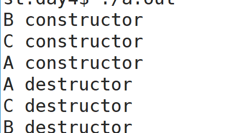

<font color=red>**一个A对象中包含两个其他类型对象，被包含的那个对象数据成员称为成员子对象。**</font>

执行流程：

1. 创建A对象会马上调用A的构造函数
2. 在 A 的构造函数体执行之前，先按对象成员声明顺序调用成员子对象的构造函数
3. A对象要销毁，就会马上调用A的析构函数
4. A 析构函数体执行完之后，再根据**对象成员声明的反序**销毁成员子对象
5. 通过成员子对象调用 B 和 C 的析构函数
6. m_c调用析构函数，执行完后，m_b再调用析构函数

如果A中有数据成员申请堆空间，B类/C类对象也有数据成员申请堆空间，堆空间资源的回收顺序如下

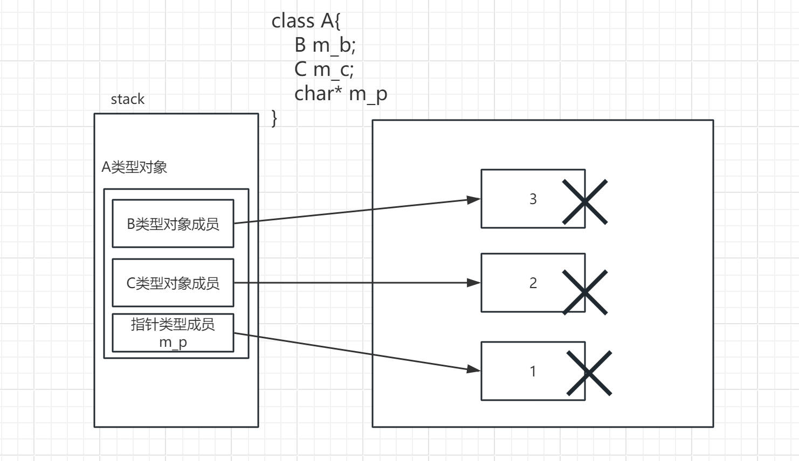

### 静态数据成员

C++ 允许使用 `static` 修饰数据成员。静态数据成员属于类本身，而不是某一个对象；整个类共享同一份静态数据成员。

- 静态数据成员和之前介绍的静态变量类似，具有静态存储期，通常在程序运行期间一直存在；

- **静态数据成员存储在全局/静态区，并不占据对象的存储空间**。
- <span style=color:red;background:yellow>**静态数据成员被整个类的所有对象共享。**</span>

需求：定义一个学生类，创建 3 个不同的学生：张三、李四、王五。他们是同一个班级的同学，如何描述？

```cpp
class Student
{
public:
    Student(int id, const char* name)
    : m_id(id)
    , m_name(new char[strlen(name)+ 1]{})
    {
        strcpy(m_name, name);
    }
    ~Student()
    {
        if(m_name){
            delete [] m_name;
            m_name = nullptr;
        }
    }
    void print()
    {
        cout << m_id << "," << m_name << endl;
    }

    // 静态成员作为班级ID
    static int ms_classID;// 静态的成员必须在类的外部进行初始化
private:
    int m_id;
    char *m_name;
};

// 类外部 静态成员的初始化
// 需要指明是在哪个类中定义的静态成员 类名::
int Student::ms_classID = 2;
```

静态成员规则：

1. private的静态数据成员无法在类之外直接访问（显然）
2. <span style=color:red;background:yellow>**非 inline 的静态数据成员通常需要在类外定义并初始化**</span>（一般紧接着类的定义）
3. 静态数据成员初始化时不能在数据类型前面加static，在数据成员名前面要加上类名+作用域限定符
4. 如果有多条静态数据成员，那么它们的初始化顺序需要与声明顺序一致（规范）
5. 静态成员在访问时可以通过对象访问，**也可以直接通过 `类名::成员名` 的形式**（更常用）

> [!TIP]
> 静态数据成员表示“属于整个类的一份数据”，普通数据成员表示“每个对象各有一份数据”。

## 特殊的成员函数

除了特殊的数据成员以外， C++ 类中还有两种特殊的成员函数：静态成员函数和 const 成员函数。我们先来看看静态成员函数。

### 静态成员函数

在某一个成员函数的前面加上 `static` 关键字，这个函数就是静态成员函数。静态成员函数具有以下特点：

（1）<span style=color:red;background:yellow>**静态成员函数不依赖于某一个对象；**</span>

（2）静态成员函数可以通过对象调用，但更常见的方式是<font color=red>**通过类名加上作用域限定符调用**</font>；

（3）静态成员函数没有 `this` 指针；

（4）<font color=red>**静态成员函数中无法直接访问非静态成员**</font>，只能访问静态数据成员或调用静态成员函数（因为没有 `this` 指针）。

非静态成员函数可以访问静态成员；静态成员函数没有 `this` 指针，因此不能直接访问普通数据成员或调用普通成员函数。

构造函数、析构函数、拷贝构造函数、赋值运算符函数都不能声明为 `static`，因为它们都依赖具体对象的创建、销毁或赋值过程。

需求：`Computer` 中有品牌和价格 2 个数据成员，现在希望通过一个静态成员统计所有 `Computer` 对象的价格，每创建一个 `Computer` 对象就进行累加。

```cpp
class Computer {
public:
	Computer(const char * brand, double price)
	: m_brand(new char[strlen(brand) + 1]())
	, m_price(price)
	{
        strcpy(m_brand, brand);
		ms_totalPrice += m_price;
	}
    ~Computer()
    {
        if(m_brand){
            delete [] m_brand;
            m_brand = nullptr;
        }
    }

	//...
    //静态成员函数
	static void printTotalPrice()
	{
		cout << "totalPrice:" << ms_totalPrice << endl;
        cout << m_price << endl;//error
	}
private:
	char * m_brand;
	double m_price;
	static double ms_totalPrice;
};
double Computer::ms_totalPrice = 0;
```

练习:

想要完成Computer类的总价计算逻辑，除了构造函数之外，还需要做哪些补充呢？

请结合前面学到的知识完成这个功能：无论是创建多个Computer对象，还是进行Computer对象的复制、赋值，Computer的总价始终能够正确输出。

```cpp
class Computer {
public:
    // constructor
	Computer(const char * brand, double price)
	: m_brand(new char[strlen(brand) + 1]())
	, m_price(price)
	{
        strcpy(m_brand, brand);
        // 新建商品 增加价格
		ms_totalPrice += m_price;
	}

    // copy constructor
    Computer(const Computer & com)
        : m_brand(new char[strlen(com.m_brand) + 1]{})
        , m_price(com.m_price)
    {
        strcpy(m_brand, com.m_brand);
        // 复制商品 增加价格
		ms_totalPrice += m_price;

    }
    // destructor
    ~Computer()
    {
        if(m_brand){
            delete[] m_brand;
            m_brand = nullptr;
        }
    }
    // operator =
    Computer & operator=(const Computer & com)
    {
        // 1.自身赋值校验
        if(this != &com){
        // 2.删除原对象中分配的空间 并重新分配
            delete [] m_brand;
            m_brand = new char[strlen(com.m_brand)+1]{};

        // 3.深拷贝与其他成员复制
            strcpy(m_brand, com.m_brand);
            // 更新总金额
            // 减去原来的价格
            ms_totalPrice -= m_price;
            // 新价格
            m_price = com.m_price;
            // 加上新价格
            ms_totalPrice += m_price;

        }
        // 4.返回当前对象引用
        return *this;
    }
	//静态成员函数
	static void printTotalPrice()
	{
		cout << "totalPrice:" << ms_totalPrice << endl;
	}
private:
	char * m_brand;
	double m_price;
	static double ms_totalPrice;
};

double Computer::ms_totalPrice = 0;

void test(){
    Computer pc1("xiaomi",100);
    Computer pc2("lenovo",200);
    Computer pc3("huawei",300);
    Computer::printTotalPrice();
    // 拷贝构造
    Computer pc4 = pc1;
    Computer::printTotalPrice();
    // 赋值
    pc2 = pc1;
    Computer::printTotalPrice();
}
```

### const成员函数

之前已经介绍了 `const` 的应用。实际上，`const` 在类成员函数中还有一种特殊用法。

在成员函数的参数列表之后、函数体之前加上 `const` 关键字，这个函数就是 const 成员函数。

**形式:**`void func() const { }`

例如:

```cpp
class Computer{
public:
    //...
    void print() const{
        cout << "brand:" << m_brand << endl;
        cout << "price:" << m_price << endl;
    }
    //...
};
```

**特点：**

1. const 成员函数中，不能直接修改对象的非静态普通数据成员；

2. 当编译器发现该函数是 const 成员函数时，会把 `this` 指针视为**双重 const 限定的指针**：`const Type * const this`。因此，同名的非 const 版本和 const 版本成员函数可以构成重载。

> [!TIP]
> 只要成员函数不修改对象状态，就优先声明为 `const` 成员函数。这样 const 对象也能调用它，接口语义也更清楚。

## 对象的组织

有了自己定义的类，或者使用别人定义好的类创建对象，其机制与使用内置类型创建普通变量几乎完全一致，同样可以创建 const 对象、创建指向对象的指针、创建对象数组，还可使用 new(delete) 来创建(回收)堆对象。

### const对象

类对象也可以声明为 const 对象，一般来说，能作用于 const 对象的成员函数除了构造函数和析构函数，就只有 const 成员函数了。

因为 const 对象只能被创建、销毁和只读访问，写操作是不允许的。

```cpp
class Data{
public:
    Data(int value) : m_value(value){}
    int getValue()
    {
        return this->m_value;
    }
    void setValue(int value)
    {
        this->m_value = value;
    }
    void print() const
    {
        cout << "value: " << this->m_value << endl;
    }
    void show() const
    {
        cout << "const show()" << endl;
    }
    void show()
    {
        cout << "show()" << endl;
    }

/* private: */
    int m_value;
};

void test1(){
    // 非const对象
    Data data1(1);
    int value1 = data1.getValue();
    data1.setValue(2);
    data1.print();
    data1.m_value = 20;

    // const对象 定义后不能修改成员
    const Data data2(3);
    /* int value2 = data2.getValue(); error const对象只能调用const函数*/
    /* data2.setValue(4);//error 不能修改const对象成员 */
    data2.print();
    /* data2.m_value = 30; //error*/
}
```

**const对象与const成员函数的规则：**

1. 当类中有const成员函数和非const成员函数重载时，const对象会调用const成员函数，非const对象会调用非const成员函数;
2. 当类中只有一个const成员函数时，无论const对象还是非const对象都可以调用这个版本;
3. 当类中只有一个非const成员函数时，const对象就不能调用非const版本。

**总结：**<span style=color:red;background:yellow>**如果一个成员函数中确定不会修改数据成员，就把它定义为const成员函数。**</span>

**思考1：**

一个类中可以有参数形式“完全相同”的两个成员函数（const版本与非const版本），既然没有报错重定义，那么它们必然是构成了重载，为什么它们能构成重载呢？

—— 参数(this指针)的类型是不同的。

**思考2：**

const成员函数中不允许修改数据成员，const数据成员初始化后不允许修改，其效果是否相同？请动手验证下面的问题

举例，如果有一个普通的指针成员，在const成员函数中，它被如何限制？

> 对于普通类型的数据成员，const数据成员初始化后不允许修改，在const成员函数中无论是const数据成员还是非const数据成员，都不能修改值;
>
> 对于指针类型的数据成员：
>
> `const int * p`，初始化之后在任何地方都不能修改其指向的值（无论在const成员函数中还是在非const成员函数中），在非const成员函数中可以修改指向，在const成员函数中不能修改指向;
>
> `int * p`,在非const成员函数中可以修改指向，也可以修改值，在const成员函数中不能修改指向，可以修改指向的值。

### 指向对象的指针

对象占据一定的内存空间，和普通变量一致， C++ 程序中采用如下形式声明指向对象的指针：

```cpp
类名 * 指针名 = [初始化表达式];
```

初始化表达式是可选的，既可以通过取地址（&对象名）给指针初始化，也可以通过申请动态内存给指针初始化，或者干脆不初始化（比如置为 nullptr ），在程序中再对该指针赋值。

指针中存储的是对象所占内存空间的首地址。针对上述定义，则下列形式都是合法的：

```cpp
Point pt(1, 2);
Point * p1 = nullptr;
Point * p2 = &pt;
Point * p3 = new Point(3, 4); // 记得delete
```

问题：定义好这些指针后，如何利用指针去调用Point类的成员函数print？请试验一下

```cpp
p2->print();
// 等价于
(*p2).print();
```

​

### 对象数组

对象数组和标准类型数组的使用方法并没有什么不同，也有声明、初始化和使用等步骤。

- 对象数组的声明

```cpp
Point pts[2];
```

这种格式会自动调用默认构造函数或所有参数都是缺省值的构造函数。

- 对象数组的初始化（可以在声明时进行初始化）

```cpp
Point pts[2] = {Point(1, 2), Point(3, 4)};
Point pts2[] = {Point(1, 2), Point(3, 4)};
Point pts3[5] = {Point(1, 2), Point(3, 4)};
//或者
Point pts4[2] = {{1, 2}, {3, 4}};
pts->print();  //（1,2）
(pts + 1)->print(); //(3,4)
Point pts5[] = {{1, 2}, {3, 4}};
Point pts6[5] = {{1, 2}, {3, 4}};
```

### 堆对象

和把一个简单变量创建在动态存储区一样，可以用 new 和 delete 表达式为对象分配动态存储区，在拷贝构造函数一节中已经介绍了为类内的指针成员分配动态内存的相关范例，这里主要讨论如何为对象和对象数组动态分配内存。如：

```cpp
void test()
{
	Point * pt1 = new Point(11, 12);
	pt1->print();
	delete pt1;
	pt1 = nullptr;

	Point * pt2 = new Point[5]();//注意
	pt2->print();
	(pt2 + 1)->print();
	delete [] pt2;
    pt2 = nullptr;
}
```

## new/delete表达式的工作步骤（了解）

现在我们已经学习了new和delete的基本使用，在new/delete和malloc/free作对比时提到了二者的最本质区别 —— new/delete是表达式，而malloc/free是库函数。

那么new/delete表达式的底层工作步骤是怎样的呢？我们有必要进行了解，因为很多时候写出的bug就藏在这个工作步骤中。

### new表达式的工作步骤

对于**自定义类型**而言：

<span style=color:red;background:yellow>**使用new表达式时发生的三个步骤**</span>：

1. 调用operator new标准库函数申请未类型化的空间

2. 在该空间上调用该类型的构造函数初始化对象

3. 返回指向该对象的相应类型的指针

### delete表达式的工作步骤

对于**自定义类型**而言：

<span style=color:red;background:yellow>**使用delete表达式时发生的两个步骤**</span>：

1. 调用析构函数,回收数据成员申请的资源(堆空间)

2. 调用operator delete库函数回收本对象所在的空间

   ```cpp
   //默认的operator new
   void * operator new(size_t sz){
       void * ret = malloc(sz);
	return ret;
   }

   //默认的operator delete
   void operator delete(void * p){
       free(p);
   }
   ```

   通过一个Student例子来认识这两个函数的用法

   Student类基本结构

   ```cpp
   class Student
   {
   public:
	Student(int id, const char * name)
	: m_id(id)
	, m_name(new char[strlen(name) + 1]())
	{
		strcpy(m_name, name);
		cout << "Student()" << endl;
	}

	~Student()
	{
		delete [] m_name;
		cout << "~Student()" << endl;
	}

	void print() const
	{
		cout << "id:" << m_id << endl
			<< "name:" << m_name << endl;
	}
   private:
	int m_id;
	char * m_name;
   };
   ```

   完善new/delete过程

   ```cpp
   class Student
   {
   public:
	Student(int id, const char * name)
	: m_id(id)
	, m_name(new char[strlen(name) + 1]())
	{
		strcpy(m_name, name);
		cout << "Student()" << endl;
	}

	~Student()
	{
		delete [] m_name;
		cout << "~Student()" << endl;
	}

	void * operator new(size_t sz)
	{
           cout << "operator new" << endl;
		void * ret = malloc(sz);
		return ret;
	}

	void operator delete(void * pointer)
	{
           cout << "operator delete" << endl;
		free(pointer);
	}

	void print() const
	{
		cout << "id:" << m_id << endl
			<< "name:" << m_name << endl;
	}
   private:
	int m_id;
	char * m_name;
   };

   void test0()
   {
	Student * stu = new Student(100, "Jackie");
	stu->print();
       delete stu;
   }
   ```

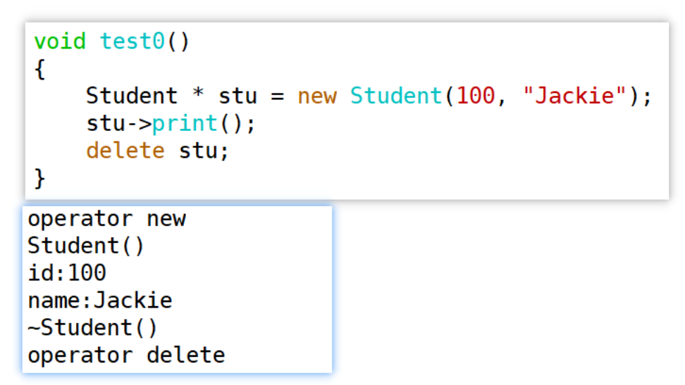

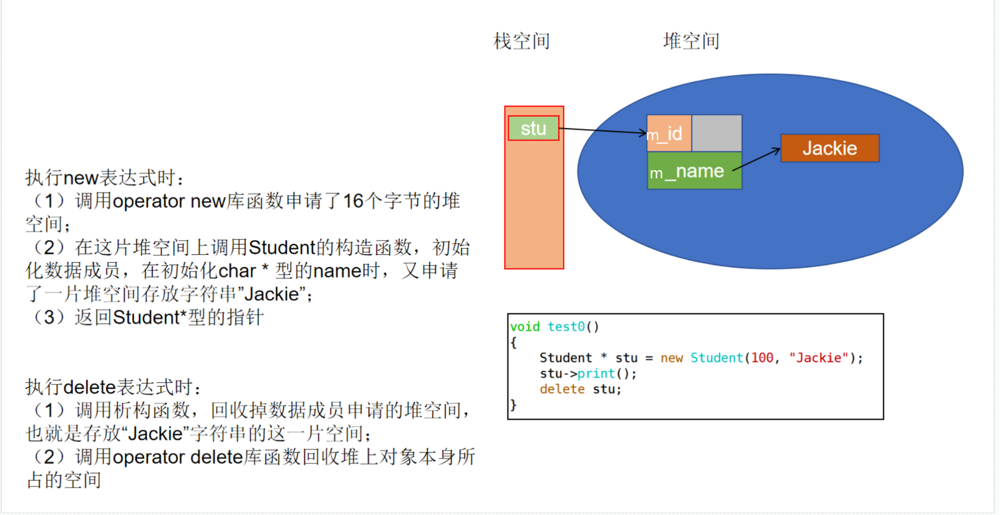

### 创建对象的探究

定义一个类，即使什么成员函数也不定义，依然可以创建栈对象和堆对象。之前我们知道了构造函数和析构函数会自动提供默认版本，那么能够创建堆对象、回收堆对象，说明会自动提供默认的operator new / operator delete函数。

默认的operator new / operator delete函数实际上就是通过malloc / free 实现的申请 / 回收堆空间。

请探究：

- <font color=red>**创建堆对象需要什么条件？**</font>

  思路：将创建、销毁对象过程中所调用到的函数一一设为私有，私有的成员函数在类外就无法被直接调用了。

需要公有的operator new、operator delete、构造函数，对析构函数没有要求;在销毁堆对象的时候，才会调用析构函数。

```cpp
//创建堆上的对象需要public的构造函数/ operator new / operator delete
void test1(){
    Student *p = new Student{1, "zs"};
    p->print();
    // delete p;
}
```

- <font color=red>**创建栈对象需要什么条件？**</font>

需要公有的构造函数、析构函数，对operator new/operator delete没有要求。

```cpp
void test2()
{
    // 创建栈对象需要public的构造函数 析构函数
    Student stu{2,"ls"};
    // 离开作用域会调用析构函数
}
```

**根据探究得出的结论，仍以Student类为例，想要实现以下需求，应该怎么做**

- 只能生成栈对象 , 不能生成堆对象

可以将operator new/operator delete 设为私有。

- 只能生成堆对象 ，不能生成栈对象

 可以将析构函数设为私有。

> **总结：**我们需要了解new/delete表达式的工作步骤，以此为依据更合理地设计类的成员函数来进行对象的创建和回收。
>
> <font color=red>**operator new/operator delete在平时不需要特别地写出，使用默认的即可。**</font>只在如上的特别的需求下，可以显式定义出来，实现不同的限制效果。

## `单例模式（重点）`

单例模式是23种常用设计模式中最简单的设计模式之一，它提供了一种维护对象(实例)的方式，确保每次获取的都是同一个唯一的对象。这个设计模式主要目的是想在整个系统中只能出现类的一个实例，即一个类只有一个唯一对象。

### 将单例对象创建在静态区

根据已经学过的知识进行分析：

1. 将构造函数私有;
2. 通过静态成员函数getInstance创建局部静态对象，确保对象的生命周期和唯一性;
3. getInstance的返回值设为引用，避免复制;

```cpp
class Singleton
{
public:
    // 提供一个静态方法返回堆上的唯一对象
    // 返回值设置为引用 避免复制
    static Singleton& getInstance()
    {
        // 声明并初始化局部静态变量对象 静态对象只会被初始化一次
        // 后续调用中每次会返回同一对象
        static Singleton instance;
        return instance;
    }
private:
    // 构造函数私有 确保不能在外部创建对象
    Singleton(){
        cout << "default constructor" << endl;
    }
};
void test1(){
    Singleton & instance = Singleton::getInstance();
    cout << &instance << endl;
    Singleton & instance2 = Singleton::getInstance();
    cout << &instance2 << endl;
}

```

<font color=red>**隐患：如果单例对象所占空间较大，可能会对静态区造成内存压力。**</font>

### 将单例对象创建在堆区（重点）

既然将单例对象创建在全局/静态区可能会有内存压力，那么为这个单例对象动态分配空间是比较合理的选择。请尝试实现代码：

分析：

1. 构造函数私有;
2. 通过静态成员函数getInstance创建堆上的对象，返回相应类型的指针;
3. 通过静态成员函数完成堆对象的回收。

```cpp
class Singleton
{
public:
    // 提供一个静态方法返回静态对象
    static Singleton* getInstance()
    {
        // 在堆上创建对象
        if(ms_instance == nullptr){
            // 为nullptr才创建
            ms_instance = new Singleton();
        }
        return ms_instance;
    }
    // 提供一个静态方法来销毁对象 释放空间
    static void destroyInstance()
    {
        if(ms_instance != nullptr){
            delete  ms_instance;
            ms_instance = nullptr;
        }
    }
    void func()
    {
        cout << "func()" << endl;
    }
private:
    // 构造函数私有 确保不能在外部创建对象
    Singleton(){
        cout << "default constructor" << endl;
    }
    // 析构函数私有 避免外部删除对象
    ~Singleton()
    {
        cout << "destructor" << endl;
    }
    // 提供静态的自身类型的指针 指向唯一的实例
    static Singleton * ms_instance;

    // C++11之前可以将拷贝构造和赋值运算符函数设置为private
    // C++11以后可以删除类中的成员函数来避免外部复制对象 保证单例
    // 删除拷贝构造函数
    Singleton(const Singleton &) = delete;
    // 删除赋值运算符函数
    Singleton & operator=(const Singleton &) = delete;

};
// 类中静态成员指针初始化为nullptr
Singleton * Singleton::ms_instance = nullptr;

void test1(){
    Singleton * instance1 = Singleton::getInstance();
    cout << instance1 << endl;
    Singleton * instance2 = Singleton::getInstance();
    cout << instance2 << endl;  // 地址相同
    // 单例对象的使用规范 避免多个指针拥有单例对象的管理权
    Singleton::getInstance()->func();

    Singleton::destroyInstance();
    // 多次destroy也不会double free
    Singleton::destroyInstance();
}
```

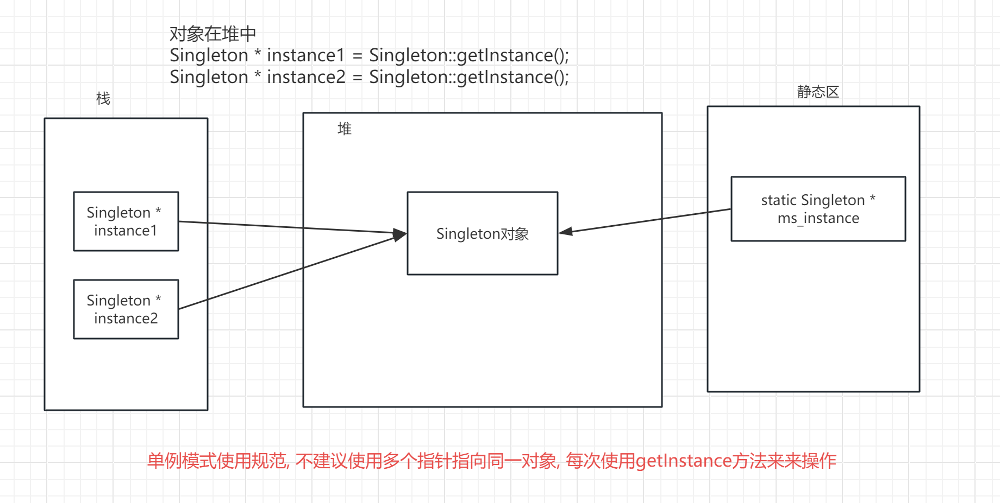

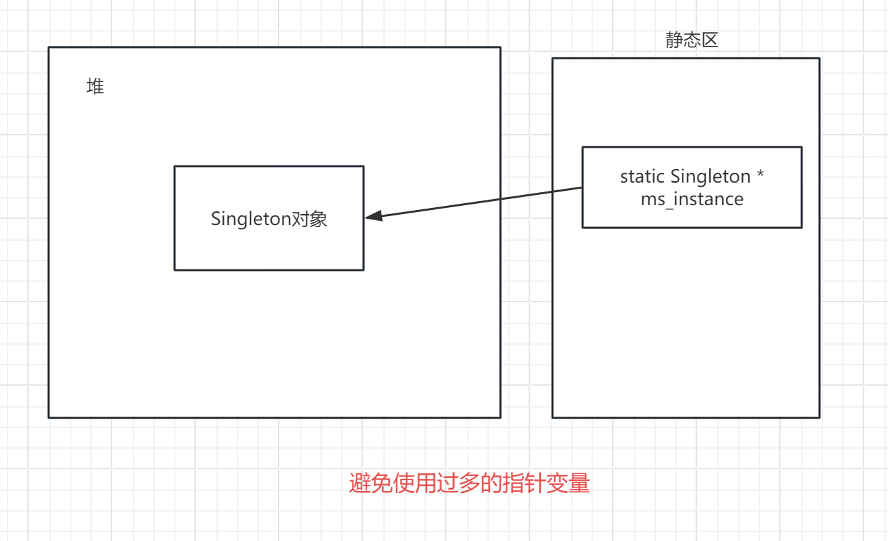

**规范：**

1. 要使用单例对象时，直接使用 `getInstance` 函数的返回值

2. 析构函数的访问权限一般也设置为私有，避免外部随意 `delete`

3. 为了确保只有一个对象（严格避免复制），C++11 后可以将拷贝构造和赋值运算符函数从类中删除（`= delete`）

> [!CAUTION]
> 上面的堆区单例没有考虑多线程并发创建问题。多线程环境下需要加锁、使用 `std::call_once`，或者优先使用函数内局部静态对象实现单例。

### 单例对象的数据成员申请堆空间

要求：实现一个单例的Computer类，包含品牌和价格信息。

```cpp
class Computer {
public:
    // init
    void init(const char* brand, double price)
    {
        // 回收之前的空间
        delete [] m_brand;
        m_brand = new char[strlen(brand)+1]{};
        strcpy(m_brand, brand);
        m_price = price;
    }
    // 静态方法来返回实例
    static Computer * getInstance()
    {
        if(ms_pInstance == nullptr){
            ms_pInstance = new Computer{};
        }
        return ms_pInstance;
    }
    static void destroyInstance()
    {
        if(ms_pInstance != nullptr)
        {
            delete ms_pInstance;
            ms_pInstance = nullptr;
        }
    }
    Computer(const Computer & pc) = delete;
    Computer & operator=(const Computer & com) = delete;

private:
    // constructor
    Computer(){}
    // destructor
	~Computer()
	{
        if(m_brand){
            delete [] m_brand;
	m_brand = nullptr; //设为空指针，安全回收
        }
		cout << "destructor" << endl;
	}

	char * m_brand;
	double m_price;
    static Computer * ms_pInstance;
};
Computer * Computer::ms_pInstance = nullptr;
void test1(){
    cout << Computer::getInstance() << endl;
    cout << Computer::getInstance() << endl;
    Computer::getInstance()->init("xiaomi",2999);
    Computer::getInstance()->init("huawei",3999);
    cout << Computer::getInstance() << endl;

    Computer::destroyInstance();
}
```

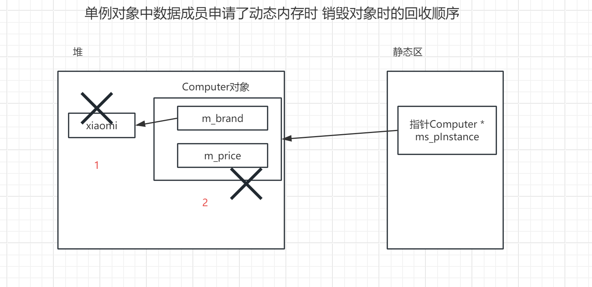

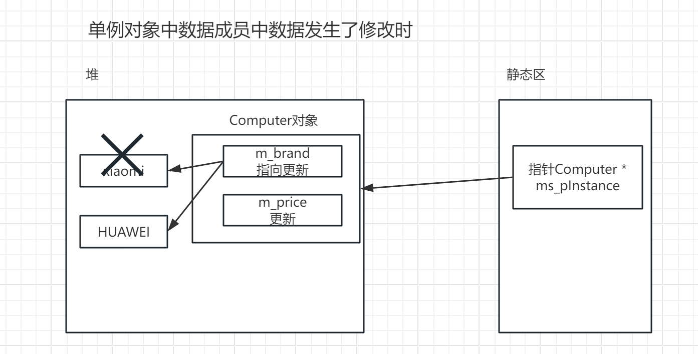

### 单例模式的应用场景

1、有频繁实例化然后销毁的情况，也就是频繁的 new 对象，可以考虑单例模式;

2、创建对象时耗时过多或者耗资源过多，但又经常用到的对象;

3、当某个资源需要在整个程序中只有一个实例时，可以使用单例模式进行管理（全局资源管理）。例如数据库连接池、日志记录器等;

4、当需要读取和管理程序配置文件时，可以使用单例模式确保只有一个实例来管理配置文件的读取和写入操作（配置文件管理）;

5、在多线程编程中，线程池是一种常见的设计模式。使用单例模式可以确保只有一个线程池实例，方便管理和控制线程的创建和销毁;

6、GUI应用程序中的全局状态管理：在GUI应用程序中，可能需要管理一些全局状态，例如用户信息、应用程序配置等。使用单例模式可以确保全局状态的唯一性和一致性。

## `C++字符串`

有了类与对象的知识基础之后，我们可以来认识两种应用广泛的标准库类型：C++ 字符串 `std::string` 和动态数组 `std::vector`。先看 C++ 字符串。

字符串处理在程序中应用广泛。C 风格字符串是以 `'\0'`（空字符）结尾的字符数组，在 C++ 中字符串字面值通常用 `const char *` 指向。

对字符串进行操作的 C 函数定义在头文件 `<string.h>` 或 `<cstring>` 中。常用库函数如下：

```cpp
//字符检查函数(非修改式操作)
size_t strlen(const char *str);//返回str的长度，不包括null结束符
//比较lhs和rhs是否相同。lhs等于rhs,返回0; lhs大于rhs，返回正数; lhs小于rhs，返回负数
int strcmp(const char *lhs, const char *rhs);
int strncmp(const char *lhs, const char *rhs, size_t count);
//在str中查找首次出现ch字符的位置;查找不到，返回空指针
char *strchr(const char *str, int ch);
//在str中查找首次出现子串substr的位置;查找不到，返回空指针
char *strstr(const char* str, const char* substr);
//字符控制函数(修改式操作)
char *strcpy(char *dest, const char *src);//将src复制给dest，返回dest
char *strncpy(char *dest, const char *src, size_t count);
char *strcat(char *dest, const char *src);//concatenates two strings
char *strncat(char *dest, const char *src, size_t count);
```

在使用时，程序员需要考虑字符数组大小的开辟，结尾空字符的处理，使用起来有诸多不便。

``` c
void test0()
{
	char str[] = "hello,";
	const char * pstr = "world";
	//求取字符串长度
	printf("%d\n", strlen(str));

	//字符串拼接
	char * ptmp = (char*)malloc(strlen(str) + strlen(pstr) + 1);
	strcpy(ptmp, str);
	strcat(ptmp, pstr);
	printf("%s\n", ptmp);

	//查找子串
	char * p1 = strstr(ptmp, "world");
	free(ptmp);
}
```

### C++风格字符串

C++ 提供了 `std::string`（后面简写为 `string`）类用于字符串处理。`string` 类定义在 C++ 头文件 `<string>` 中，注意和头文件 `<cstring>` 区分，`<cstring>` 是对 C 标准库 `<string.h>` 的封装，里面定义的是一些处理 C 风格字符串的函数。

尽管 C++ 支持 C 风格字符串，但在 C++ 程序中更推荐使用 `std::string`。C 风格字符串需要手动管理空间、长度和结尾空字符，容易引发越界和内存问题；`string` 会自动管理字符存储，并提供丰富的成员函数。使用体验上，<span style=color:red;background:yellow>**可以把 `string` 当成常用值类型来使用，和 `int`、`double` 一样自然。**</span>

`std::string` 是标准库类模板 `std::basic_string<char>` 的类型别名。使用它时通常不需要关心底层内存管理，直接按字符串对象使用即可。

> [!IMPORTANT]
> C++ 代码中优先使用 `std::string` 管理字符串。只有和 C 接口交互时，再通过 `c_str()` 获取 C 风格字符串。

#### string的构造

basic_string的常用构造——查看C++参考文档（cppreference-zh-20211231.chm）

```cpp
basic_string(); //无参构造

basic_string( size_type count,
              CharT ch,
              const Allocator& alloc = Allocator() );  //count + 字符

basic_string( const basic_string& other,
              size_type pos,
              size_type count,
              const Allocator& alloc = Allocator() ); //接收一个basic_string对象

basic_string( const CharT* s,
              size_type count,
              const Allocator& alloc = Allocator() ); //接收一个C风格字符串
```

`basic_string` 是一个类模板，`std::string` 是它针对 `char` 的实例化别名。这里涉及后面模板的知识，现在掌握常用构造方式即可。

在创建字符串对象时，我们可以直接使用std::string作为类名，如std::string str = "hello". 这是因为C++标准库已经为我们定义了std::string这个类型的别名。

**string对象常用的构造**

```cpp
string();//无参构造函数，生成一个空字符串
string(const char * rhs);//通过c风格字符串构造一个string对象
string(const char * rhs, size_type count);//通过rhs的前count个字符构造一个string对象
string(const string & rhs);//拷贝构造函数
string(const string & rhs,size_t pos, size_t count);//通过string对象的一部分创建新的string
string(size_type count, char ch);//生成一个string对象，该对象包含count个ch字符
string(InputIt first, InputIt last);//以区间[first, last)内的字符创建一个string对象
```

```cpp
void test1(){
    /* string();//无参构造函数，生成一个空字符串 */
    string s1;
    /* string(const char * rhs);//通过c风格字符串构造一个string对象 */
    string s2("zs");
    /* string(const char * rhs, size_type count);//通过rhs的前count个字符构造一个string对象 */
    string s3("zslswwzl", 4);
    /* string(const string & rhs);//拷贝构造函数 */
    string s4(s2);
    /* string(const string & rhs, size_t pos, size_t count);//通过string对象的一部分创建新的string */
    string base("zslswwzl");
    string s5(base, 1, 4);
    /* string(size_type count, char ch);//生成一个string对象，该对象包含count个ch字符 */
    string s6(5,'a');
    // 如若采用列表初始化string s6{97,a}效果是把97当成了字符, 原因是string中 有个std::initializer_list 的构造函数，列表初始化会优先匹配它。
    /* string(InputIt first, InputIt last);//以区间[first, last)内, 左闭右开区间内的字符创建一个string对象 */
    // It:Iterator 迭代器目前理解为指针
    // 通过迭代器方式创建字符串对象
    const char *str = "hello";
    string s7(str, str+3);

    cout << s1 << endl;
    cout << s2 << endl;
    cout << s3 << endl;
    cout << s4 << endl;
    cout << s5 << endl;
    cout << s6 << endl;
    cout << s7 << endl;
    // begin函数返回首迭代器 end函数返回尾迭代器
    string s8(s5.begin(), s5.end());
    cout << s8 << endl;

}
```

迭代器方式创建string对象


```cpp
// 迭代器方式创建string对象
void test()
{
    char arr[] = "hello";
    // 利用迭代器构造string对象时，需要传入首迭代器和尾后迭代器，根据[first, last)左闭右开区间内的元素作为string对象内容
    string str(arr, arr +3);
    cout << str << endl;

    // 迭代器不等于指针
    /* char *p = str.begin() */

    // 把string视为存放char类型元素的容器
    // string::iterator
    string::iterator it = str.begin();
    // auto可以自动推导类型
    auto it2 = str.end();
    string s(it, it2);
    cout << s << endl;
}
```

还可以用拼接的方式构造string

原理：basic_string对加法运算符进行了默认重载（后续会学到），其本质是通过+号进行计算后得到一个basic_string对象，再用这个对象去创建新的basic_string对象

```cpp
//采取拼接的方式创建字符串
//可以拼接string、字符、C风格字符串
string str3 = str1 + str2;
string str4 = str2 + ',' + str3;
string str5 = str2 + ",world!";
```

#### string的常用操作

```cpp
const CharT* data() const;
const CHarT* c_str() const; //获取出C++字符串保存的字符串内容，以C风格字符串作为返回值

bool empty() const; //判空

size_type size() const;//获取字符数
size_type length() const;

void push_back(CharT ch);  //字符串结尾追加字符

//在字符串的末尾添加内容，返回修改后的字符串
basic_string& append(size_type count, CharT ch); //添加count个字符
basic_string& append(const basic_string& str);  //添加字符串
basic_string & append(const basic_string& str,  //从原字符串末尾添加str从pos位置的count个字符
                     size_type pos,size_type count);
basic_string& append(const charT* s);      //添加C风格字符串

//查找子串
size_type find( const basic_string& str, size_type pos = 0 ) const;  //从C++字符串的pos位开始查找C++字符串str
size_type find( CharT ch, size_type pos = 0 ) const;      //从C++字符串的pos位开始查找字符ch
size_type find( const CharT* s, size_type pos, size_type count ) const;  //从C++字符串的pos位开始，去查找C字符串的前count个字符
```

实践一下string的各种操作

补充：两个basic_string字符串比较，可以直接使用==等符号进行判断

原理：basic_string对==运算符进行了默认重载（后续会学到）

```cpp
//非成员函数
bool operator==(const string & lhs, const string & rhs);
bool operator!=(const string & lhs, const string & rhs);
bool operator>(const string & lhs, const string & rhs);
bool operator<(const string & lhs, const string & rhs);
bool operator>=(const string & lhs, const string & rhs);
bool operator<=(const string & lhs, const string & rhs);
```

#### string的遍历（重点）

string实际上也可以看作是一种存储char型数据的容器，对string的遍历方法是之后对各种容器遍历的一个铺垫。

（1）**通过下标遍历**

string 对象可以使用下标操作符[]进行访问。

```cpp
//使用下标遍历
for(size_t idx = 0; idx < str.size(); ++idx){
    cout << str[idx] << " ";
}
cout << endl;
```

需要注意的是操作符[]并不检查索引是否有效，如果索引超出范围，会引起未定义的行为。而函数 at() 会检查，如果使用 at()的时候索引无效，会抛出 out_of_range 异常

```cpp
string str("hello");
cout << str.at(4) << endl;  //输出o
cout << str.at(5) << endl;  //运行时抛出异常
```

（2）**增强for循环遍历**

针对容器，可以使用增强for循环进行遍历其中的元素。增强for循环经常和auto关键字一起使用，auto关键字可以自动推导类型。

```cpp
string str("hello"); // 把string视作一个存放char元素的容器
for(auto& c : str){ // &意义在于对于容器中元素本身进行操作, 否则对其副本进行操作
    cout << c;
}
cout << endl;
```

（3）**迭代器方式进行遍历**

string字符串利用连续空间存储字符，所以可以利用地址遍历。这里我们提出一个概念——迭代器。

迭代器是一种用于遍历容器中元素的对象, 这里可以理解为是广义的指针。它可以像指针一样进行解引用、移位等操作。迭代器是容器用来访问元素的重要手段，容器都有相应的函数来获取特定的迭代器（此处可以简单理解为指向特定元素的指针）。在STL的阶段，我们会对迭代器进行更详细的讲解，现在我们只需要掌握它的基本使用即可。

<font color=red>**begin函数返回首迭代器（指向首个元素的指针）;**</font>

<font color=red>**end函数返回尾后迭代器（指向最后一个元素的后一位的指针）**</font>

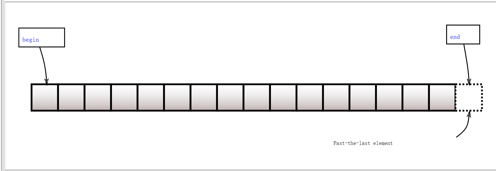

如指针一样，迭代器也有其固定的形式。

```cpp
//某容器的迭代器形式为 容器名::iterator
//此处auto推导出来it的类型为string::iterator
//string::iterator itBegin = str.begin();
//string::iterator itEnd = str.end();
//使用auto来简化操作
auto it = str.begin();
while(it != str.end()){
    cout << *it << " ";
	++it;
}
cout << endl;
```

## `C++动态数组`

C++ 中，`std::vector`（向量）是一个动态数组容器，能存放同一种类型的多个元素。

其动态性体现在以下几个方面：

1. 动态大小：`std::vector` 可以根据需要自动调整自身的大小。它在内部管理一个动态分配的数组，可以根据元素的数量进行自动扩容或缩减。当元素数量超过当前容量时，`std::vector` 会重新分配内存，并将元素复制到新的内存位置。这使得 `std::vector` 能够根据需要动态地增长或缩小容量，而无需手动管理内存。
2. 动态插入和删除：`std::vector` 允许在任意位置插入或删除元素，但插入或删除位置之后的元素通常需要移动。尾部插入效率最高，中间或头部插入删除成本较高。
3. 动态访问：`std::vector` 提供了随机访问元素的能力。可以通过索引直接访问容器中的元素，而不需要遍历整个容器。这使得对元素的访问具有常数时间复杂度（O(1)），无论容器的大小如何。

### vector的构造

`vector` 常用的几种构造形式：

（1）无参构造，仅指明 `vector` 存放元素的类型，初始没有元素；

```cpp
vector<int> numbers;
```

（2）传入一个参数，指明 `vector` 存放元素的数量，每个元素的值为该类型对应的默认值；

```cpp
vector<long> numbers2(10); //存放10个0
```

（3）传入两个参数，第一个参数为 `vector` 存放元素的数量，第二个参数为每个元素的值；

```cpp
vector<long> numbers2(10, 20); //存放10个20
```

（4）通过列表初始化 `vector`，直接指明存放的所有元素的值；

```cpp
vector<int> number3{1,2,3,4,5,6,7};
```

（5）迭代器方式初始化 `vector`，传入两个迭代器作为参数，第一个为首迭代器，第二个为尾后迭代器。

```cpp
vector<int> number3{1,2,3,4,5,6,7};
vector<int> number4(number3.begin(),number3.end() - 3);//推测一下，number4中存了哪些元素
```

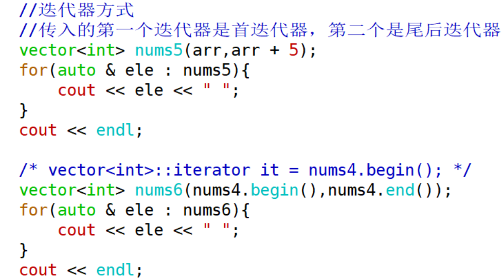

### vector的常用操作

```cpp
iterator begin();  //返回首位迭代器
iterator end();  //返回尾后迭代器
bool empty() const; //判空
size_type size() const; //返回容器中存放的元素个数
size_type capacity() const; //返回容器容量（最多可以存放元素的个数）
void push_back(const T& value); //在最后一个元素的后面再存放元素
void pop_back(); //删除最后一个元素
void clear(); //清空所有元素，但不释放空间
void shrink_to_fit();  //释放多余的空间（可以存放元素但没有存放元素的空间 capacity-size）
void reserve(size_type new_cap);//申请空间，不存放元素(不初始化元素)
```

补充：`vector` 的遍历

```cpp
vector<int> nums{1,2,3,4,5,6,7};
// 增强for循环
for(auto & element : nums){
    cout << element << " ";
}
cout << endl;

// 下标方式
for(size_t i = 0; i < nums.size(); ++i){
    cout << nums[i] << " ";
}
cout << endl;

// 迭代器方式
auto it = nums.begin();
while(it != nums.end()){
    cout << *it << " ";
    ++it;
}
cout << endl;

```

**vector 不仅能够存放内置类型变量，也能存放自定义类型对象和其他容器。**

试着完成一下：

- vector中存放string对象并遍历

  ```cpp
  void test3(){
      // vector store string
      vector<string> strs{"aa","bb","cc"};
      for(auto & element : strs){
          cout << element << " ";
      }
      cout << endl;
  }
  ```

- vector中存放Student对象并遍历. 现需要Student类有完整定义，创建vector时 ： vector< Student> students;

  ```cpp
  class Student
  {
  public:
      Student(const string & name, int age)
          : m_name(name)
          , m_age(age)
      {
          /* cout << "2 args constructor" << endl; */
      }
      void print()
      {
          cout << m_name << " " << m_age << endl;
      }
  private:
      string m_name;
      int m_age;
  };

  void test()
  {
	Student s1("zs", 20);
      Student s2("ls", 22);
      Student s3("ww", 21);
      vector<Student> students{s1, s2, s3};
      for(auto & s : students){
          s.print();
      }
  }
  ```

- vector中存放vector (vector嵌套)

  ```cpp
  vector<vector<int>> nums{{1,2,3} ,{2,3,4} ,{4,5,6}};

  for(auto & num : nums){
      for(auto & n : num){
          cout << n << " ";
      }
      cout << endl;
  }
  ```

### vector的动态扩容

当vector存放满后，仍然追加存放元素，vector会进行自动扩容。

````cpp
vector<int> numbers;
cout << numbers.size() << endl;
cout << numbers.capacity() << endl;

numbers.push_back(1);
cout << numbers.size() << endl;
cout << numbers.capacity() << endl;

numbers.push_back(1);
cout << numbers.size() << endl;
cout << numbers.capacity() << endl;

numbers.push_back(1);
cout << numbers.size() << endl;
cout << numbers.capacity() << endl;
//...
````

多追加一些元素，看看元素数量和容器容量的关系，思考一下vector的容量是如何增长的呢？

在常见 GCC 实现中，`vector` 经常按约 2 倍容量扩容：当 `vector` 存满后再添加新元素，会申请更大的连续空间，把旧元素移动或复制过去，再添加新元素。

VS 上常见的是约 1.5 倍扩容。

—— 很多技术细节在不同平台上实现不同。C++ 标准规定行为和复杂度要求，不强制规定具体扩容倍数。

其工作步骤如下：

（1）开辟空间

（2）Allocator分配（后面STL阶段学习）

（3）复制，再添加新元素

（4）回收原空间

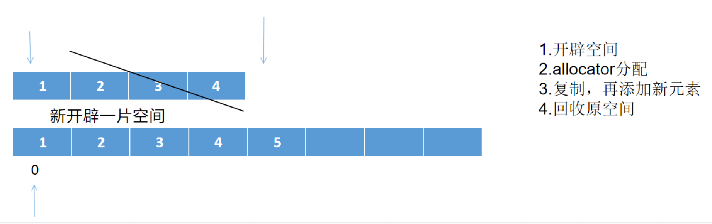

### vector的底层实现（重点）

利用 `sizeof` 查看 `vector` 对象的大小时，在常见 64 位 libstdc++ 实现中，无论存放的元素类型、数量如何，其大小通常为 24 字节。

这是因为该实现中的 `vector` 对象由三个指针组成。

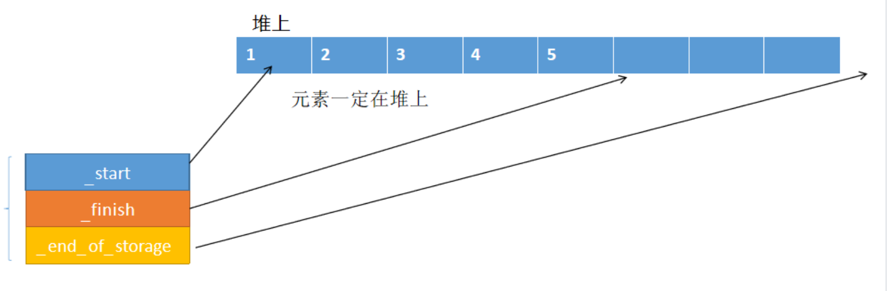

<span style=color:red;background:yellow>**_start指向当前数组中第一个元素存放的位置**</span>

<span style=color:red;background:yellow>**_finish指向当前数组中最后一个元素存放的下一个位置**</span>

<span style=color:red;background:yellow>**_end_of_storage指向当前数组能够存放元素的最后一个空间的下一个位置**</span>

可以推导出

size():  _finish - _start

capacity():  _end_of_storage - _start

> [!CAUTION]
> `vector` 扩容会重新分配底层数组，原来指向元素的指针、引用、迭代器可能失效。向 `vector` 中追加元素后，如果继续使用旧迭代器，要特别小心。
