# 第三章 C++输入输出流

## 输入输出流概述

以前所用到的输入和输出，主要以终端为对象：从键盘输入数据，将运行结果输出到显示器屏幕。从操作系统的角度看，很多输入输出设备都可以抽象成**文件**。除了终端，也可以把磁盘文件作为输入或输出对象，磁盘文件既可以作为**输入文件**，也可以作为**输出文件**。

在程序语境中，**输入**指数据从外部设备或文件进入程序内存，**输出**指数据从程序内存写到外部设备或文件。

### C++输入输出流机制

C++ 的 I/O 发生在流中，流是字节序列。如果字节流是从设备（如键盘、磁盘驱动器、网络连接等）流向内存，这叫做输入操作。如果字节流是从内存流向设备（如显示屏、打印机、磁盘驱动器、网络连接等），这叫做输出操作。

就 C++ 程序而言， I/O 操作可以简单地看作是从程序移进或移出字节，程序只需要关心是否正确地输出了字节数据，以及是否正确地输入了要读取字节数据，特定 I/O 设备的细节对程序员是隐藏的。

### C++常用流类型

C++ 的输入与输出包括以下 3 方面的内容：

（1）对系统指定的标准设备的输入和输出。即从键盘输入数据，输出到显示器屏幕。这种输入输出称为标准输入输出，简称**标准 I/O**。

（2）以外存磁盘文件为对象进行输入和输出，即从磁盘文件读取数据，或把数据输出到磁盘文件。这称为文件输入输出，简称**文件 I/O**。

（3）以内存中的字符串对象为对象进行输入和输出。这种输入输出称为字符串输入输出，简称**字符串 I/O**。

常用的输入输出流如下：

| 类名              | 作用             | 头文件       |
| ----------------- | ---------------- | ------------ |
| **istream**       | **通用输入流**   | **iostream** |
| **ostream**       | **通用输出流**   | **iostream** |
| iostream          | 通用输入输出流   | iostream     |
| **ifstream**      | **文件输入流**   | **fstream**  |
| **ofstream**      | **文件输出流**   | **fstream**  |
| fstream           | 文件输入输出流   | fstream      |
| **istringstream** | **字符串输入流** | **sstream**  |
| **ostringstream** | **字符串输出流** | **sstream**  |
| stringstream      | 字符串输入输出流 | sstream      |

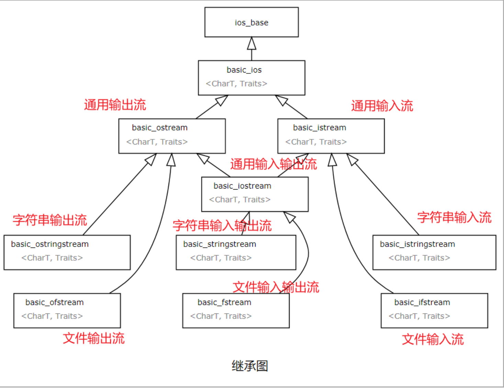

> [!NOTE]
> “流”可以理解为程序和外部数据源之间的管道。输入流把数据送入程序，输出流把数据送出程序。

## 流的四种状态（重点）

I/O 操作与生俱来的一个问题是可能会发生错误，一些错误可以恢复，另一些则不可恢复。在 C++ 标准库中，用 `iostate` 表示流的状态。不同编译器的 `iostate` 实现可能不一样，但都包含以下四种状态：

- <span style=color:red;background:yellow>**badbit**</span> 表示发生**系统级错误**，如不可恢复的读写错误。通常情况下，一旦 `badbit` 被置位，流就无法继续可靠使用。

- <span style=color:red;background:yellow>**failbit**</span> 表示发生**格式错误或操作失败**，如期望读取一个 `int`，却读到字符串。清理错误状态和缓冲区后，流通常可以继续使用。

- <span style=color:red;background:yellow>**eofbit**</span> 表示**到达流结尾位置**。读取文件或输入结束时，可能会被置为 `eofbit`。

- <span style=color:red;background:yellow>**goodbit**</span> 表示流处于**有效状态**。如果 `badbit`、`failbit` 和 `eofbit` 中任何一个被置位，`good()` 都会返回 `false`。

这四种状态都定义在类 `ios_base` 中。在 GNU GCC 7.4 的源码中，流状态的实现如下：

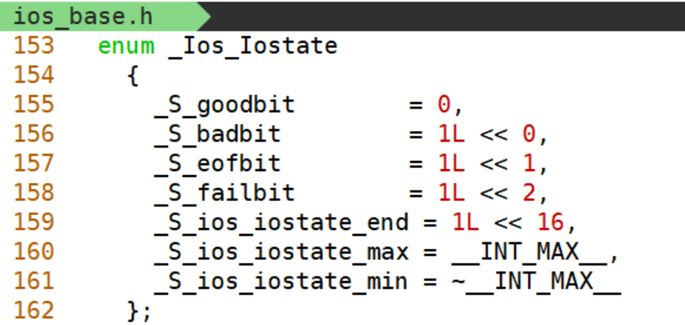

可以通过下面这些成员函数检查流状态：

```cpp
bool good() const      // 流是 goodbit 状态，返回 true，否则返回 false
bool bad() const       // 流是 badbit 状态，返回 true，否则返回 false
bool fail() const      // 流是 failbit 状态，返回 true，否则返回 false
bool eof() const       // 流是 eofbit 状态，返回 true，否则返回 false
```

> [!IMPORTANT]
> 流对象可以直接放到条件中判断，例如 `while (ifs >> word)`。这比先判断 `eof()` 更可靠，因为读取失败不一定只由文件结束导致。

## 标准输入输出流

标准输入输出指对系统指定的标准设备进行输入和输出，例如从键盘输入数据，将结果输出到显示器屏幕，简称**标准 I/O**。

C++ 标准库定义了几个预定义的标准输入输出流对象：

- **标准输入流 (`std::cin`)**：从键盘（或其他输入设备）读取数据。
- **标准输出流 (`std::cout`)**：向标准输出设备（通常是屏幕）输出数据。
- **标准错误流 (`std::cerr`)**：用于输出错误信息，通常不缓冲。
- **标准日志流 (`std::clog`)**：也用于输出诊断信息，通常带缓冲。

标准输入、输出相关对象定义在头文件 `<iostream>` 中。

有时候会看到通用输入输出流的说法，这是一个更广泛的概念，可以与各种类型的输入输出设备进行交互，包括标准输入输出设备、文件、网络等。

### 标准输入流

`istream` 类定义了一个全局输入流对象 `cin`，代表**标准输入**。它从标准输入设备（通常是键盘）获取数据，程序中的变量通过流提取符 `>>` 从流中提取数据。

流提取符 `>>` 从流中提取数据时，通常会跳过空格、Tab、换行符等空白字符，并把这些**空白字符作为分隔符**。在终端中，用户输入完数据并按回车后，该行数据才进入键盘<font color=red>**缓冲区**</font>，随后 `>>` 才能从中提取数据。

下面来看一个例子：从 `cin` 中读取一个整数，并观察读取前后的流状态。

```cpp
void printStreamStatus(std::istream & is){
    cout << "is's goodbit:" << is.good() << endl;
    cout << "is's badbit:" << is.bad() << endl;
    cout << "is's failbit:" << is.fail() << endl;
    cout << "is's eofbit:" << is.eof() << endl;
}

void test0(){
    printStreamStatus(cin);  //goodbit状态
    int num = 0;
    cin >> num;
    cout << "num:" << num << endl;
    printStreamStatus(cin);  //进行一次输入后再检查cin的状态
}
```

如果没有进行正确输入，输入流会进入 `failbit` 状态，后续读取无法正常工作，需要恢复流状态。

查看 C++ 参考文档，需要配合使用 <span style=color:red;background:yellow>**clear 和 ignore**</span> 函数实现这个过程：

```cpp
if(!cin.good()){
    // 恢复流的状态
    cin.clear();
    // 清空缓冲区，才能继续使用
    cin.ignore(std::numeric_limits<std::streamsize>::max(), '\n');
    cout << endl;
    printStreamStatus(cin);
}
```

```cpp
void test()
{
    int num = 10;
    cout << "执行输入操作前流的状态:" << endl;
    printStreamStatus(cin);

    cin >> num;
    cout << "执行输入操作后流的状态:" << endl;
    printStreamStatus(cin);

    if(!cin.good()){
        // 恢复流的状态
        cin.clear();
        // 清空缓冲区后才能继续读取
        // 忽略当前输入流中的所有字符，直到遇到换行符为止
        cin.ignore(std::numeric_limits<std::streamsize>::max(), '\n');
        printStreamStatus(cin);
    }
    // 如果没有正常输入，num的值不应继续使用
    cout << "num=" << num << endl;
    string line;
    cin >> line;
    cout << "line:" << line << endl;
}
```

> 思考，如何完成一个输入整型数据的实现（如果是非法输入则继续要求输入）
>
> ```cpp
> bool readInt(int & num)
> {
>     cout << "input a num:" << endl;
>
>     while(!(cin >> num)){
>         if(cin.bad()){
>             cout << "cin has broken!" << endl;
>             return false;
>         }
>
>         cin.clear();
>         cin.ignore(std::numeric_limits<std::streamsize>::max(), '\n');
>         cout << "input a num again:" << endl;
>     }
>
>     cout << "num: " << num << endl;
>     return true;
> }
>
> void test()
> {
>     int num = 0;
>     if(!readInt(num)){
>         return;
>     }
> }
> ```

补充：也可以把“循环读取直到成功”写成下面这种形式：

```cpp
void inputInteger(int & num)
{
    cout << "input a num:" << endl;

    while(!(cin >> num)){
        if(cin.bad()){
            cout << "cin has broken!" << endl;
            return;
        }

        cin.clear();
        cin.ignore(std::numeric_limits<std::streamsize>::max(), '\n');
        cout << "input a num again:" << endl;
    }

    cout << "num: " << num << endl;
}
```

补充：注意 `cin` 表达式的返回值：

- `cin` 对象作为条件时，会根据流状态隐式转换为布尔值；
- `cin >> num` 完成一次输入后，返回值仍是流对象本身，因此可以进行连续链式输入。

> [!CAUTION]
> `clear()` 只负责清除流状态，不会清空已经留在输入缓冲区中的错误内容。处理非法输入时，通常需要 `clear()` 和 `ignore()` 配合使用。

```cpp
void test1()
{
    int num;
    cout << "input a num: " << endl;
    cin >> num;
    /* if(cin.good()){ */
    // cin 的状态是 goodbit 状态，在作为判断条件时会隐式转换为 true
    if(cin){
        cout << "num = " << num;
        cout << endl;
    }
}

void test2()
{
    int num;
    cout << "input a num: " << endl;
    // cout << &cin << endl;
    cin >> num;
    // cout << &cin << endl;
    // 输入前后 cin 地址相同，是同一对象

    // 连续输入
    int num1, num2;
    cin >> num1 >> num2;
    cout << num1 << ", " << num2 << endl;
}
```

### 缓冲机制

在标准输入输出流的测试中发现，流有着缓冲机制。**缓冲区**又称为缓存，它是内存空间的一部分。也就是说，在内存空间中预留了一定的存储空间，这些存储空间用来缓冲输入或输出的数据，这部分预留的空间就叫做缓冲区。缓冲区根据其对应的是输入设备还是输出设备，分为**输入缓冲区**和**输出缓冲区**。

输入或输出的内容会暂存在流对象对应的缓冲区中，并在特定时机刷新到真实设备或文件。

- **为什么要引入缓冲区？**

  比如我们从磁盘里取信息，我们先把读出的数据放在缓冲区，计算机再直接从缓冲区中取数据，等缓冲区的数据取完后再去磁盘中读取，这样就可以减少磁盘的读写次数，再加上计算机对缓冲区的操作大大快于对磁盘的操作，故应用缓冲区可大大提高计算机的运行速度。

  又比如，我们使用打印机打印文档，由于打印机的打印速度相对较慢，我们先把文档输出到打印机相应的缓冲区，打印机再自行逐步打印，这时我们的 CPU 可以处理别的事情。因此缓冲区就是一块内存区，它用在输入输出设备和 CPU 之间，用来缓存数据。它使得低速的输入输出设备和高速的 CPU 能够协调工作，避免低速的输入输出设备长时间占用 CPU。

#### 缓冲区要做哪些工作？

从上面的描述中，不难发现缓冲区向上连接了程序的输入输出请求，向下连接了真实的 I/O 操作。作为中间层，必然需要分别处理好与上下两层之间的接口，以及要处理好上下两层之间的协作。

输入或输出的内容会暂存在流对象对应的缓冲区中，并在特定时机刷新到真实设备或文件。

#### 缓冲机制

缓冲机制通常分为三种类型：<span style=color:red;background:yellow>**全缓冲、行缓冲和不带缓冲**</span>。

全缓冲：填满缓冲区后才进行实际 I/O 操作。全缓冲的典型代表是对磁盘文件的读写。

行缓冲：遇到换行符时执行真正的 I/O 操作。例如终端输入时，输入的字符会先存放在缓冲区，等按下回车键后再交给程序处理。

不带缓冲：不等待缓冲区积累数据，有多少就刷新多少。标准错误输出 `cerr` 是典型代表，这使得出错信息可以尽快显示出来。

### 标准输出流

`ostream` 类定义了全局输出流对象 `cout`，即标准输出。缓冲区刷新时，`cout` 中的数据会被输出到终端。

如下几种情况会导致输出缓冲区内容被刷新。

1. <font color=red>**程序正常结束**</font>

程序结束时刷新缓冲区，因此最终会输出 1025 个 `a`。

```cpp
void test1(){
    for(int i = 0; i < 1025; ++i){
        cout << 'a';
    }
}
```

2. <font color=red>**缓冲区满**</font>

马上输出 1024 个 `a`，等待 2 秒后输出最后一个 `a`。

在当前实验环境中，`cout` 对象的默认缓冲区大小是 1024 个字节。缓冲区满后会先刷新已有内容，剩余的最后一个字符通常要等程序正常结束时再刷新。

```cpp
#include <unistd.h>

void test1(){
    for(int i = 0; i < 1025; ++i){
        cout << 'a';
    }
    sleep(2);
}
```

3. 使用<font color=red>**操纵符**</font>显式刷新输出缓冲区，如 `endl`

加上 `endl` 这种操纵符，会立即输出 5 个 `a`；如果不加 `endl`，通常要等程序结束刷新缓冲区时才会输出。

```cpp
void test()
{
    for(int i = 0; i < 5; ++i){
        //cout << 'a' << endl;
        cout << 'a';
    }
    sleep(2);
}
```

查看 `ostream` 头文件中 `endl` 的定义，可以看到它会同时完成换行和刷新缓冲区。

```shell
cd /usr/include/c++/11
vim ostream
```

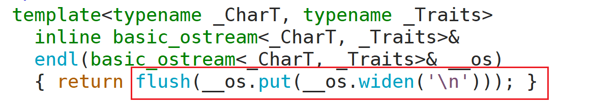

来看一个简单的例子：使用 `cout` 时，如果在输出流语句末尾使用 `endl`，会换行并刷新缓冲区。

```cpp
void test0(){
    for(int i = 0; i < 1025; ++i){
        cout << 'a' << endl;
    }
}
```

如果使用 `cout` 时没有使用 `endl` 或 `flush`，输出内容会先进入输出流对象的缓冲区。当缓冲区满、程序正常结束，或被显式刷新时，内容才会传输到终端显示。可使用 `sleep` 函数观察缓冲效果。

```cpp
#include <unistd.h>
void test0(){
    for(int i = 0; i < 1024; ++i){
        cout << 'a';
    }
    sleep(2);
    cout << 'b';
    sleep(2);
}
```

GCC 中标准输出流的默认缓冲区大小通常是 1024 个字节，具体行为也会受到终端、库实现和同步设置影响。

如果不用 `sleep` 函数，即使没有 `endl` 或换行符，所有内容看起来也可能是“直接输出”的，因为程序结束时会刷新缓冲区。

- **关于操作符**

`endl`：完成换行，并刷新缓冲区。

`flush`：直接刷新缓冲区，不换行，例如 `cout << flush;` 或 `cout.flush();`。

> [!TIP]
> 不需要立即刷新时，优先使用 `'\n'` 换行；需要立刻看到输出时，再使用 `endl` 或 `flush`。频繁使用 `endl` 可能降低输出性能。

- **标准错误流**

`ostream` 类还定义了全局输出流对象 `cerr`，即标准错误流，通常不带缓冲。

试试看如下代码的运行效果：`cerr` 通常会立即输出，`cout` 可能等到缓冲区刷新后再显示。

```cpp
#include <unistd.h>
void test1(){
    cerr << 1;
    cout << 3;
    sleep(2);
}
```

## 文件输入输出流（重点）

所谓“文件”，一般指存储在外部介质上的数据集合。操作系统以文件为单位管理数据。要向外部介质存储数据，通常需要先建立一个文件（以文件名标识），才能向其中输出数据。常见外存文件包括磁盘文件、U 盘文件等。

文件流是以外存文件为输入输出对象的数据流。

**文件输入流**是从外存文件流向内存的数据，**文件输出流**是从内存流向外存文件的数据。每一个文件流都有一个内存缓冲区与之对应。**文件流**本身不是文件，而只是以文件为输入输出对象的流。若要对磁盘文件输入输出，就必须通过文件流来实现。

C++ 对文件进行操作的流类型主要有三个：

- `ifstream`：文件输入流。
- `ofstream`：文件输出流。
- `fstream`：文件输入输出流。

它们的构造函数形式都很类似：

```cpp
ifstream();
explicit ifstream(const char* filename, openmode mode = ios_base::in);
explicit ifstream(const string & filename, openmode mode = ios_base::in);

ofstream();
explicit ofstream(const char* filename, openmode mode = ios_base::out);
explicit ofstream(const string & filename, openmode mode = ios_base::out);

fstream();
explicit fstream(const char* filename, openmode mode = ios_base::in | ios_base::out);
explicit fstream(const string & filename, openmode mode = ios_base::in | ios_base::out);
```

**文件模式**

根据不同情况，对文件的读写操作可以采用不同的文件打开模式。文件模式由 `ios_base::openmode` 表示，常见模式如下：

- <font color=red>**in**</font>：以读取模式打开文件（默认用于 `ifstream`）；如果文件不存在，打开失败。
- <font color=red>**out**</font>：以写入模式打开文件（默认用于 `ofstream`）。如果文件存在，默认截断文件内容；如果文件不存在，则创建文件。
- <font color=red>**app**</font>：追加模式，写入始终发生在文件末尾。
- <font color=red>**ate**</font>：打开文件后，将文件位置指针定位到文件末尾。
- `trunc`：截断模式，如果打开的文件存在，其内容将被丢弃，大小被截断为零。
- `binary`：二进制模式，按二进制形式读取或写入文件。

> [!CAUTION]
> `ofstream` 默认使用 `ios::out`，通常会清空已有文件内容。需要保留原内容并追加写入时，必须显式使用 `ios::app`。

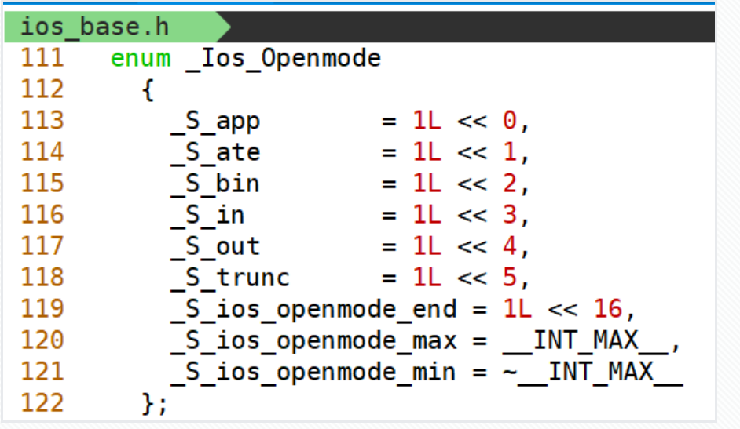

### 文件输入流

**读取数据基本步骤**：

1. 创建 `ifstream` 对象并打开文件。
2. 检查文件是否成功打开。
3. 读取数据。
4. 关闭文件。

#### 文件输入流对象的创建

首先要明确文件输入流的信息传输方向：**文件 -> 文件输入流对象的缓冲区 -> 程序中的数据结构**。

根据上述的说明，我们可以将输入流对象的创建分为两类：

1. 可以使用无参构造创建 `ifstream` 对象，再使用 `open` 函数将文件输入流对象与文件绑定（<font color=red>**若文件不存在，则文件输入流进入 failbit 状态**</font>）；

2. 也可以使用有参构造创建 `ifstream` 对象，在创建时就将流对象与文件绑定，后续操作这个流对象就可以对文件进行相应操作。

通过参考文档中对 `ifstream` 构造函数的描述可知，文件输入流对象的有参构造需要传入文件名，也可以指定打开模式。不指定时默认使用 `in` 模式，即按读取方式打开。

```cpp
#include <fstream>
void test0(){
    ifstream ifs;
    ifs.open("test1.cc");

    ifstream ifs2("test2.cc");

    string filename = "test3.cc";
    ifstream ifs3(filename);
}
```

#### 读取文件数据

##### 逐词读取

使用 `>>` 运算符，默认以空白字符（空格、换行、Tab 等）作为分隔符。

```cpp
// 默认以换行符、空格作为分隔符
// 一次读取一个字符串
string word;
// 只要读取成功，就继续循环
while(ifs >> word){
    cout << word << endl;
}
// 使用完之后关闭流
ifs.close();
```

##### 按行读取

方法一：使用 `ifstream` 类中的成员函数 `getline`，这种方式是兼容 C 的写法。

| std::basic_istream<CharT,Traits>::getline                    |
| ------------------------------------------------------------ |
| basic_istream& getline( char_type* s, std::streamsize count ); |
| basic_istream& getline( char_type* s, std::streamsize count, char_type delim ); |
| s: 指向存储字符的缓冲区  <br />count: 缓冲区可存储的字符数量 <br />delim: 分隔字符，遇到它时停止提取。该分隔符会被提取，但不会存储 |

```cpp
#include <string.h>
ifstream ifs("test.cc");
// 方法一，兼容 C 的写法，使用较少
char buff[100] = {0};
while(ifs.getline(buff, sizeof(buff))){
    cout << buff << endl;
    // 清空缓冲区
    memset(buff, 0, sizeof(buff));
}
```

这种方式需要提前准备一片字符数组来存放一行内容。它的缺点是数组长度固定：如果一行内容超过了设置的长度，本次读取就不能完整取得该行内容，代码也更容易写错。

方法二：使用 `<string>` 提供的 `getline` 函数，**工作中更常用**。

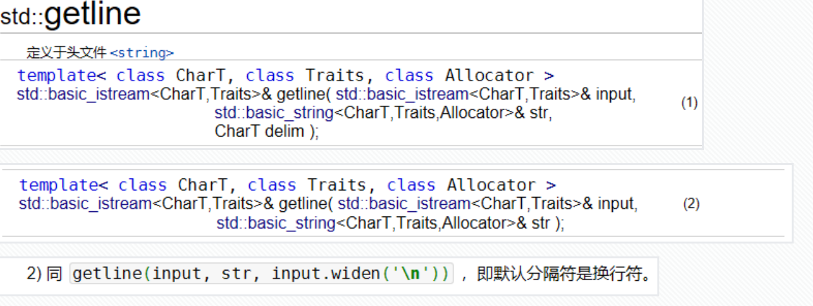

传入输入流对象、`string`、分隔符（默认换行符为分隔符，也可以自己指定）。

```cpp
// 更方便，使用更多
string line;
while(getline(ifs, line)){
    cout << line << endl;
}
```

将一行内容交给一个 `string` 对象存储，不用提前指定字符数组大小。

> [!TIP]
> 需要按“单词”读取时使用 `>>`；需要按“整行”读取时使用 `getline`。如果先用 `>>` 再用 `getline`，要注意缓冲区中可能残留换行符。

```cpp
void test4()
{
    // 使用string中的getline
    using std::string;
    ifstream ifs("aa.txt");
    string line;
    // 读取失败或到达文件结尾时结束循环
    while(std::getline(ifs, line)){
        cout << line << endl;
    }

    // 关闭流
    ifs.close();
}
```

##### 读取指定字节数的内容

这一类操作通常会用到 `read`、`seekg` 和 `tellg` 函数。

`read` 用于按指定字节数读取内容，读取结果会写入字符数组，因此调用时需要同时传入目标缓冲区和要读取的字节数。

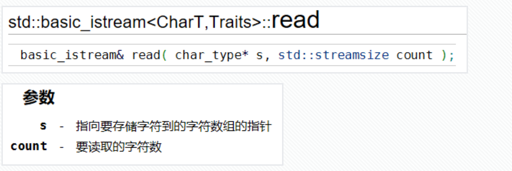

> 要知道文件字节数，可以配合使用 `tellg`。可以这样理解：从文件中读取内容时存在一个文件位置指针，读取会从当前位置开始。`tellg` 用来获取当前位置，`seekg` 用来设置当前位置。
>
> 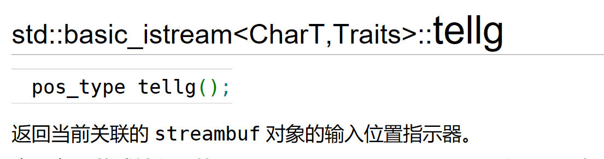

> 调用 `seekg` 时有两种方式：
>
> 一种是绝对位置，例如将位置指针设为流的开始位置，可以直接传参数 `0`；
>
> 另一种是相对位置，需要传入偏移量和基准点。第一个参数表示偏移量，向前偏移传负数，不偏移传 `0`，向后偏移传正数；第二个参数表示基准点，例如 <span style=color:red;background:yellow>**std::ios::beg**</span> 表示以流的开始位置为基准。
>
> 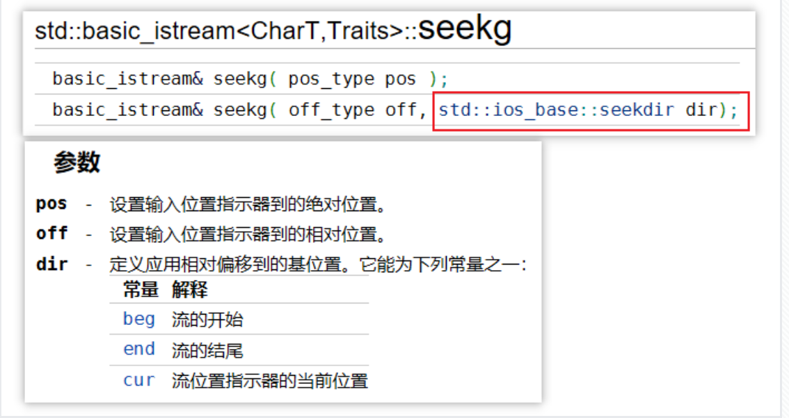

如图示：

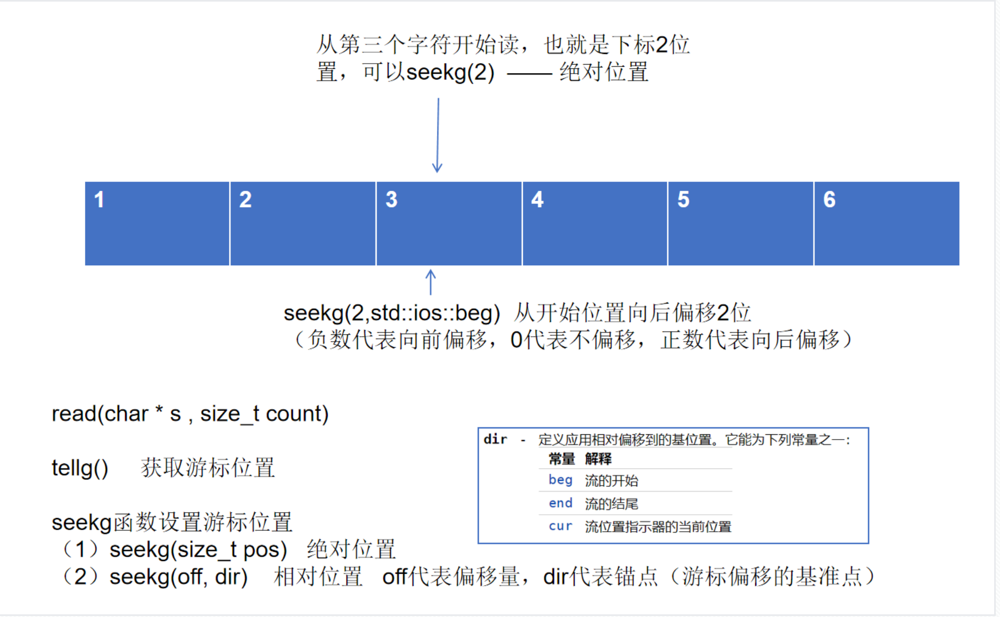

例子：读取一个文件的全部内容

```cpp
void test0(){
    string filename = "test.cc";
    ifstream ifs(filename);

    if(!ifs){
        cerr << "ifs open file fail!";
        return;
    }

    // 读取一个文件的所有内容，先要获取文件大小
    // 将位置指针移动到文件末尾
    ifs.seekg(0, std::ios::end);
    long length = ifs.tellg(); // 获取当前位置，实际就是文件字节数
    cout << length << endl;

    char * pdata = new char[length + 1]();
    // 需要将位置指针再放回文件开头
    ifs.seekg(0, std::ios::beg);
    ifs.read(pdata, length);

    // 还可以使用 string 构造函数根据内容创建 string 对象
    // content 包含了文件的所有内容，包括空格、换行
    string content(pdata, length);
    cout << "content:" << content << endl;
    /* cout << pdata << endl; */

    delete[] pdata;
    pdata = nullptr;

    ifs.close();
}

```

还可以在创建输入流对象时指定 `ate` 模式，省去第一步将位置指针移到流末尾的操作。

> [!CAUTION]
> `tellg()` 返回的是流位置类型，严格来说不一定等同于文本字符数。读取二进制文件或精确按字节处理时，建议使用 `std::ios::binary` 打开文件。

### 文件输出流

文件输出流的作用是将程序中的数据写入文件。

**基本步骤**：

1. 创建 `ofstream` 对象并打开文件。
2. 检查文件是否成功打开。
3. 写入数据。
4. 关闭文件。

#### 文件输出流对象的创建

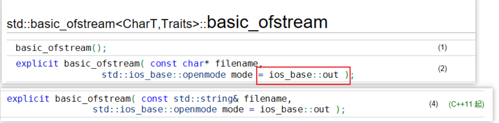

`ofstream` 对象的创建与 `ifstream` 对象的创建类似。

```cpp
#include <fstream>
void test0(){
    ofstream ofs;
    ofs.open("test1.cc");

    ofstream ofs2("test2.cc");

    string filename = "test3.cc";
    ofstream ofs3(filename);
}
```

推测一下，如果文件输出流对象绑定的文件不存在，可以吗？

可以。如果文件不存在，输出流会按写入模式创建文件。

#### 写入数据到文件

##### <font color=red>**通过输出流运算符写内容**</font>

`ofstream` 对象绑定文件后，就可以向该文件写入内容。

```cpp
string filename = "test3.cc";
ofstream ofs(filename);

string line("hello,world!\n");
ofs << line;

ofs.close();
```

内容传输的过程是：`string` 中的内容传给 `ofs` 对象，再由 `ofs` 写入它绑定的文件。

但是进行多次写入时，可能会发现文件没有保留之前的内容。原因是这种创建方式默认使用 `std::ios::out`，<font color=red>**每次打开文件时都会清空原内容**</font>。

为了实现在文件流结尾追加写入内容的效果，可以在创建流对象时指定打开模式为 <span style=color:red;background:yellow>**std::ios::app**</span>（追加模式）。

```cpp
string filename = "test3.cc";
ofstream ofs(filename, std::ios::app);
```

##### 通过 `write` 函数写内容

除了使用输出流运算符 `<<` 将内容写入文件输出流对象，还可以使用 `write` 函数按指定字节数写入。

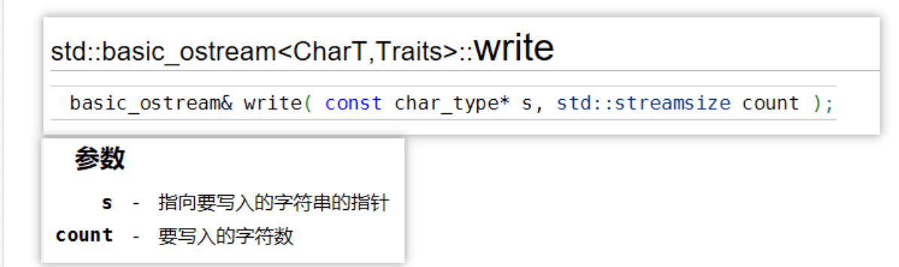

```cpp
char buff[100] = "hello,world!";
ofs.write(buff, strlen(buff));
```

<span style=color:red;background:yellow>**动态查看指令**</span>

为了更方便地查看多次写入的效果，可以使用下面的命令动态查看文件内容。

```shell
tail 文件名 -F   # 动态查看文件内容
```

查看结束后按 `Ctrl + C` 退出。

## 字符串输入输出流

字符串 I/O 是内存中的字符串对象与字符串输入输出流对象之间进行内容传输的数据流，通常用于格式转换、字符串解析和字符串拼接。

C++ 对字符串进行操作的流类型主要有三个：

- `istringstream`：字符串输入流。
- `ostringstream`：字符串输出流。
- `stringstream`：字符串输入输出流。

它们的构造函数形式都很类似：

```cpp
istringstream(): istringstream(ios_base::in) { }
explicit istringstream(openmode mode = ios_base::in);
explicit istringstream(const string& str, openmode mode = ios_base::in);

ostringstream(): ostringstream(ios_base::out) { }
explicit ostringstream(openmode mode = ios_base::out);
explicit ostringstream(const string& str, openmode mode = ios_base::out);

stringstream(): stringstream(ios_base::in | ios_base::out) { }
explicit stringstream(openmode mode = ios_base::in | ios_base::out);
explicit stringstream(const string& str, openmode mode = ios_base::in | ios_base::out);
```

### 字符串输入流

**将字符串内容传输给字符串输入流对象，再通过这个对象进行字符串解析。**

创建字符串输入流对象时传入 C++ 字符串，字符串内容会保存在输入流对象的缓冲区中。之后可以通过输入流运算符 `>>` 将字符串内容提取到不同变量中，起到字符串分隔和类型转换的作用。


如下，将字符串 `s` 的内容解析成两个 `int` 型数据：

```cpp
void test0(){
    string s("123 456");
    int num = 0;
    int num2 = 0;
    // 将字符串内容传递给字符串输入流对象
    istringstream iss(s);
    iss >> num >> num2;
    cout << "num:" << num << endl;
    cout << "num2:" << num2 << endl;
}
```

因为输入流运算符默认以空白字符作为分隔符，字符串 `123 456` 中含有一个空格，那么提取时会将空格前的 `123` 传给 `num`，空格后的 `456` 传给 `num2`。由于 `num` 和 `num2` 是 `int` 类型，流会按整数格式解析这两段内容。

**字符串输入流通常用来处理字符串内容，比如读取配置文件。**

```cpp
// myserver.conf
ip 192.168.0.0
port 8888
dir ~HaiBao/53th/day06

// readConf.cc
void readConfig(const string & filename){
    ifstream ifs(filename);
    if(!ifs.good()){
        cout << "open file fail!" << endl;
        return;
    }

    string line;
    string key, value;
    while(getline(ifs, line)){
        istringstream iss(line);
        iss >> key >> value;
        cout << key << " -----> " << value << endl;
    }
}

void test0(){
    readConfig("myserver.conf");
}
```

### 字符串输出流

字符串输出流通常用于将各种类型的数据格式化成字符串。

```cpp
void test0(){
    int num = 123, num2 = 456;
    ostringstream oss;
    // 把所有的内容都传给字符串输出流对象
    oss << "num = " << num << " , num2 = " << num2 << endl;
    // str() 用于返回构造好的字符串
    cout << oss.str() << endl;
}
```

将字符串、`int` 型数据等内容传给字符串输出流对象后，它们会被格式化到内部缓冲区中。调用 `str()` 函数即可获得最终拼接好的 `string`。

> [!NOTE]
> `istringstream` 适合“从字符串中解析数据”，`ostringstream` 适合“把数据格式化成字符串”，`stringstream` 同时支持输入和输出。
