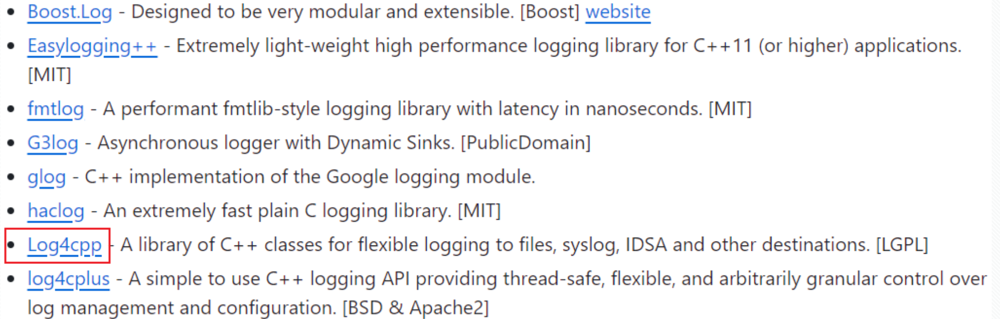
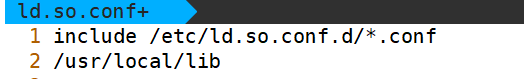
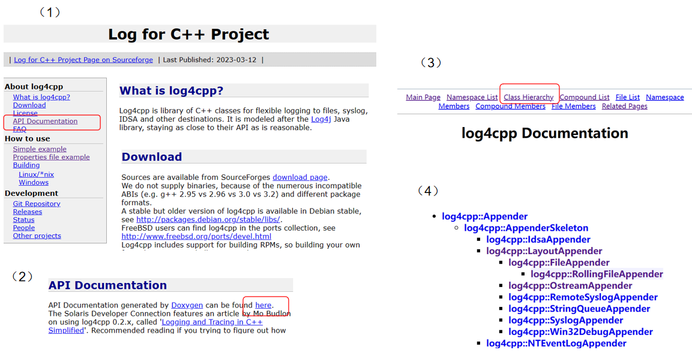
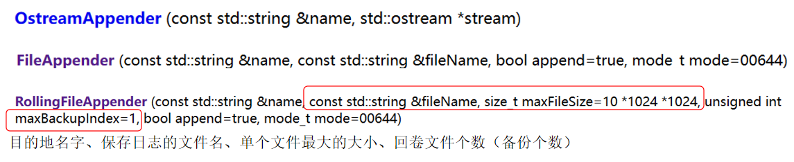
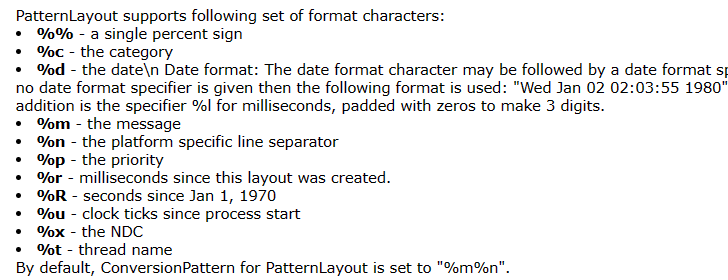
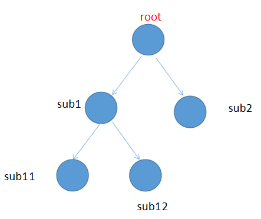
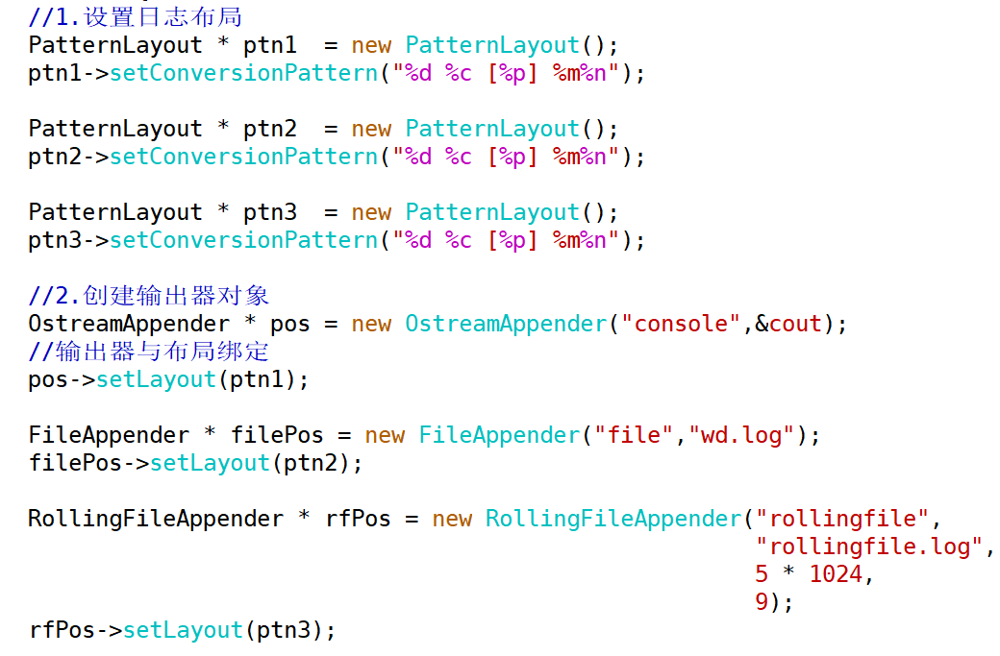
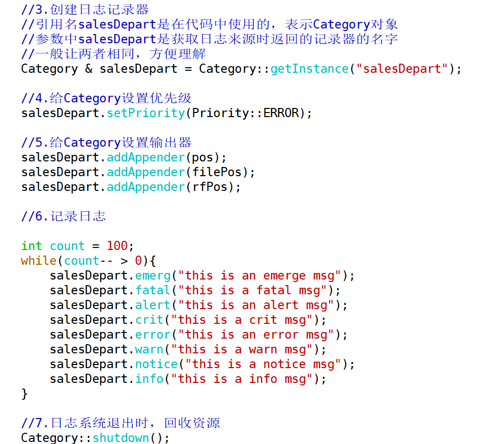

# 第四章 日志系统

日志系统是系统架构中的基础设施，但它经常被忽视。很多人会把日志简单理解成 `printf`，直到程序在线上运行、无法一步一步调试时，才发现只能依靠日志还原系统运行轨迹，定位问题发生的位置。

日志系统主要解决三个问题：记录系统运行轨迹、辅助分析错误、审计系统运行流程。在高可靠系统中，程序通常不能因为局部错误而直接终止，因此会持续运行并产生大量日志。

日志系统的内容可以分为两类：

1. 业务级别的日志，主要供终端用户分析业务过程。
2. 系统级别的日志，供开发者维护系统的稳定。

由于日志系统的数据输出量比较大，设计时必须考虑它对系统性能的影响。另一方面，日志越多不一定越好：大量低价值日志容易掩盖真正的问题线索，也会增加检索和排查成本。因此，日志系统需要选择合适的工具，并设计清楚日志级别、输出位置和格式。

> [!IMPORTANT]
> 日志的价值不在于“打印得多”，而在于关键路径、异常分支和上下文信息是否足够清楚。

GitHub 上有一个项目叫 `awesome-cpp`，其中收录了与 C/C++ 有关的框架、库和资源。在它的 `logging` 分类中，可以看到很多常用的日志系统工具。

本课程学习 `log4cpp`，之后的项目阶段也会使用它。

[fffaraz/awesome-cpp: A curated list of awesome C++ (or C) frameworks, libraries, resources, and shiny things. Inspired by awesome-... stuff. (github.com)](https://github.com/fffaraz/awesome-cpp?tab=readme-ov-file#logging)


## 日志系统的设计

日志系统设计的核心，是理解**日志从产生到到达最终目的地期间的处理流程**。为了让日志库具备灵活、可扩展、可配置的能力，通常会把日志系统拆成四个部分：记录器、过滤器、格式化器、输出器。

**记录器（Logger/Category，日志来源）**：负责产生日志记录的原始信息，比如日志内容、日志优先级、时间、记录位置等。

**过滤器（Filter，日志过滤规则）**：负责按照指定条件过滤掉不需要的日志。最常见的过滤条件就是日志级别。

**格式化器（Layout，日志布局）**：负责把原始日志信息转换成指定格式。

**输出器（Appender，日志目的地）**：负责把经过过滤和格式化后的日志输出到指定位置，例如终端、文件或回卷文件。

下面以一条日志的生命周期为例说明日志库是怎么工作的。

一条日志的生命周期：

1. 产生：`info("log information.")`。
2. 经过记录器，记录器获取日志发生的时间、位置、线程等信息。
3. 经过过滤器，判断这条日志是否需要记录。
4. 经过格式化器，处理成设定格式后传递给输出器。例如输出 `2018-03-22 10:00:00 [INFO] log information.` 到文件中。
5. 日志被写入目标位置后，这条日志的处理流程结束。

> [!NOTE]
> `log4cpp` 中的 `Category` 大致对应记录器，`Layout` 对应格式化器，`Appender` 对应输出器，日志级别则承担常见过滤器的作用。

## log4cpp 的安装

下载压缩包

下载地址：https://sourceforge.net/projects/log4cpp/files/

安装步骤

```shell
$ tar xzvf log4cpp-1.1.4rc3.tar.gz

$ cd log4cpp

$ ./configure  # 进行自动化构建，自动生成 Makefile

$ make

$ sudo make install # 安装，把头文件和库文件拷贝到系统路径下
```

安装完成后，默认路径通常如下：

- 头文件路径：`/usr/local/include/log4cpp`
- 库文件路径：`/usr/local/lib`

打开 log4cpp 官网：[Log for C++ Project](https://log4cpp.sourceforge.net/)

拷贝 `simple example` 的内容，编译运行。

编译指令： `g++ log4cppTest.cc -llog4cpp -lpthread`

<font color=red>**可能报错：找不到动态库**</font>

解决方法：

```shell
cd /etc
```


```shell
sudo vim ld.so.conf
```

将默认的 lib 库路径写入，再重新加载。



```shell
sudo ldconfig
```

`sudo ldconfig` 会更新 `ld.so.cache` 缓存文件，把动态库信息写入缓存。当可执行程序需要加载动态库时，系统会从这里查找。

完成这些操作后，再使用上面的编译指令去编译示例代码。

> [!CAUTION]
> 修改 `/etc/ld.so.conf` 属于系统级配置。也可以临时设置 `LD_LIBRARY_PATH=/usr/local/lib`，但这种方式只对当前 shell 环境生效。

## log4cpp 的核心组件

官网的 `simple example` 中包含了几个核心组件，这段代码需要重点理解其用法。

利用已学过的类与对象的知识对这段示例代码进行解读和推测。

```cpp
// main.cpp

#include "log4cpp/Category.hh"
#include "log4cpp/Appender.hh"
#include "log4cpp/FileAppender.hh"
#include "log4cpp/OstreamAppender.hh"
#include "log4cpp/Layout.hh"
#include "log4cpp/BasicLayout.hh"
#include "log4cpp/Priority.hh"
#include <iostream>
#include <string>

int main(int argc, char** argv) {
    log4cpp::Appender *appender1 = new log4cpp::OstreamAppender("console", &std::cout);
    appender1->setLayout(new log4cpp::BasicLayout());

    log4cpp::Appender *appender2 = new log4cpp::FileAppender("default", "program.log");
    appender2->setLayout(new log4cpp::BasicLayout());

    log4cpp::Category& root = log4cpp::Category::getRoot();
    root.setPriority(log4cpp::Priority::WARN);
    root.addAppender(appender1);

    log4cpp::Category& sub1 = log4cpp::Category::getInstance(std::string("sub1"));
    sub1.addAppender(appender2);

    // use of functions for logging messages
    root.error("root error");
    root.info("root info");
    sub1.error("sub1 error");
    sub1.warn("sub1 warn");

    // printf-style for logging variables
    root.warn("%d + %d == %s ?", 1, 1, "two");

    // use of streams for logging messages
    root << log4cpp::Priority::ERROR << "Streamed root error";
    root << log4cpp::Priority::INFO << "Streamed root info";
    sub1 << log4cpp::Priority::ERROR << "Streamed sub1 error";
    sub1 << log4cpp::Priority::WARN << "Streamed sub1 warn";

    // or this way:
    root.errorStream() << "Another streamed error";

    return 0;
}
```

输出结果:

```cpp
1352973121 ERROR  : root error
1352973121 ERROR sub1 : sub1 error
1352973121 WARN sub1 : sub1 warn
1352973121 WARN  : 1 + 1 == two ?
1352973121 ERROR  : Streamed root error
1352973121 ERROR sub1 : Streamed sub1 error
1352973121 WARN sub1 : Streamed sub1 warn
1352973121 ERROR  : Another streamed error
```

### 日志目的地（Appender）

通过 log4cpp 官网查看常用类的信息。



这里重点关注三个目的地类：

- **OstreamAppender**：输出到 C++ 通用输出流，例如 `cout`。
- **FileAppender**：输出到本地文件。
- **RollingFileAppender**：输出到回卷文件。

> - `OstreamAppender` 的构造函数传入两个参数：目的地名、输出流指针。
>
> - `FileAppender` 的构造函数传入两个主要参数：目的地名、保存日志的文件名。后面两个参数可以使用默认值，分别表示以追加方式保存日志，以及文件权限为当前用户读写、其他用户只读。
>
> 
>
> - `RollingFileAppender` 稍复杂一些。若不使用回卷文件，所有日志都会写入同一个文件。随着系统持续运行，日志文件会越来越大，最终可能大量占用磁盘空间。因此实际项目中通常会使用回卷文件，例如只给日志文件 1 GB 空间，再划分成 10 个文件，每个文件最多 100 MB。
>
> `RollingFileAppender` 构造函数的参数如上图。其中需要注意的是回卷文件个数：如果 `maxBackupIndex` 传入 `9`，那么实际会有 `wd.log` 加上 `wd.log.1` 到 `wd.log.9`，共 10 个文件保存日志。
>
> 回卷机制大致如下：先写入 `wd.log`。当它写满后，旧的 `wd.log` 会改名为 `wd.log.1`，再创建新的 `wd.log` 保存最新日志。下一次写满时，`wd.log.1` 改名为 `wd.log.2`，`wd.log` 改名为 `wd.log.1`，再创建新的 `wd.log`。以此类推，直到 `wd.log.9` 被最早的日志占满后，再写入新日志时，最旧的 `wd.log.9` 会被丢弃。

### 日志布局（Layout）

示例代码中使用的是 `BasicLayout`，也就是默认日志布局。它会把日志产生时距离 `1970-01-01 00:00:00 UTC` 的秒数放在日志开头，阅读起来不够直观。

实际使用时可以用 <span style=color:red;background:yellow>**PatternLayout**</span> 对象定制日志格式，类似 `printf` 的格式化输出。



使用 `new` 创建日志布局对象后，通过指针调用 `setConversionPattern` 函数设置日志格式。


```cpp
PatternLayout * ptn1 = new PatternLayout();
ptn1->setConversionPattern("%d %c [%p] %m%n");
```

`setConversionPattern` 函数接收一个 `string` 作为参数，格式化字符的意义如下：

**%d %c [%p] %m%n**

**时间 模块名 优先级 消息本身 换行符**

> [!CAUTION]
> 当日志系统有多个日志目的地时，每一个 `Appender` 都需要设置一个 `Layout`。`Layout` 和 `Appender` 是一对一关系，不能把同一个 `Layout` 对象复用到多个 `Appender` 上。

### 日志记录器（Category）

创建 `Category` 对象时，可以用 `getRoot` 先创建根模块对象，并对根模块对象设置优先级和目的地。

再用 `getInstance` 创建叶模块对象。叶模块对象会继承根模块对象的优先级和目的地，也可以继续修改自己的优先级和目的地。

补充：如果没有显式创建根对象，直接使用 `getInstance` 创建叶对象，也会先隐式创建一个 `Root` 对象。

**子 `Category` 可以继承父 `Category` 的信息：优先级、目的地。**



官网示例代码中 `Category` 对象的创建方式：先创建根对象，再创建叶对象。

```cpp
log4cpp::Category& root = log4cpp::Category::getRoot();
root.setPriority(log4cpp::Priority::WARN);
root.addAppender(appender1);

log4cpp::Category& sub1 = log4cpp::Category::getInstance(std::string("sub1")); // sub1 会成为日志中记录的日志来源
sub1.addAppender(appender2);
```

也可以一行语句创建叶对象。

```cpp
log4cpp::Category& sub1 = log4cpp::Category::getRoot().getInstance("salesDepart"); // 日志来源会是 salesDepart
sub1.setPriority(log4cpp::Priority::WARN);
sub1.addAppender(appender1);
```

这里需要注意，例子中的 `sub1` 本质上是绑定 `Category` 对象的引用。代码通过 `sub1` 设置优先级、添加目的地、记录日志。

`getInstance` 的参数 `salesDepart` 表示日志信息中记录的 `Category` 名称，也就是日志来源，对应布局中的 `%c`。

因此实际使用时，变量名和 `Category` 名称通常保持一致，这样更容易看出日志来源于哪个模块。

### 日志优先级（Priority）

对于 log4cpp 而言，有两个优先级需要注意：一个是日志记录器的优先级，另一个是某一条日志本身的优先级。`Category` 对象就是日志记录器，使用时需要设置好它的优先级。某一行日志的优先级，是 `Category` 对象调用日志记录函数时指定的级别。例如 `logger.debug("this is a debug message")` 这一条日志的优先级就是 `DEBUG`。

简言之：

**日志记录器有一个优先级 A，日志信息有一个优先级 B。只有 B 高于或等于 A 时，这条日志才会被输出或保存；B 低于 A 时，这条日志会被过滤。**

```cpp
class LOG4CPP_EXPORT Priority {
public:
    typedef enum {
            EMERG = 0,
            FATAL = 0,
            ALERT = 100,
            CRIT = 200,
            ERROR = 300,
            WARN = 400,
            NOTICE = 500,
            INFO = 600,
            DEBUG = 700,
            NOTSET = 800 // 这个不代表可以使用的优先级
    } PriorityLevel;
    //......
};  // 数值越小，优先级越高；数值越大，优先级越低
```

> [!IMPORTANT]
> `DEBUG` 的数值最大，优先级最低；`ERROR`、`FATAL` 的数值更小，优先级更高。设置为 `WARN` 时，`DEBUG` 和 `INFO` 通常会被过滤掉。

## 定制日志系统

模仿示例代码的形式去设计定制化的日志系统





在设计日志系统时多次使用了 `new` 语句。虽然这些核心组件的内部实现细节不需要全部掌握，但可以确定的是，这个过程会申请资源。因此规范写法是在日志系统退出时调用 `shutdown` 回收资源。

## log4cpp 的单例实现

留下一个比较有挑战性的作业：

用所学过的类和对象知识封装 log4cpp，实现一个单例日志类。它需要同时支持输出到终端和保存到文件。为了使用方便，可以再封装一组宏，让调用方式接近 `printf`，并在日志中自动带上文件名、函数名和行号。

代码模板：

```cpp
class Mylogger
{
public:
    static Mylogger * getInstance();
    static void destroyInstance();

    void warn(const char *msg);
    void error(const char *msg);
    void debug(const char *msg);
    void info(const char *msg);
    void fatal(const char *msg);
    void crit(const char *msg);

private:
    Mylogger();
    ~Mylogger();

private:
    // ...
};

void test0()
{
    // 第一步，完成单例模式的写法
    Mylogger *log = Mylogger::getInstance();

    log->info("The log is info message");
    log->error("The log is error message");
    log->fatal("The log is fatal message");
    log->crit("The log is crit message");

    // 更常见的使用方式
    Mylogger::getInstance()->info("The log is info message");
}

void test1()
{
    printf("hello,world\n");
    // 第二步，像使用 printf 一样
    // 这里只要求能输出纯字符串信息，不需要做到格式化输出
    LogInfo("The log is info message");
    LogError("The log is error message");
    LogWarn("The log is warn message");
    LogDebug("The log is debug message");
}

// 最终希望的效果：
// LogDebug("The log is debug message");
// 日期 记录器名字 [优先级] 文件名 函数名 行号 日志信息
```

```cpp
// Mylogger.hpp
#ifndef MYLOGGER_HPP
#define MYLOGGER_HPP

#include <string>
#include <log4cpp/Category.hh>

#define LOG_PREFIX(msg) std::string("[")\
        .append(__FILE__)\
        .append(":")\
        .append(__func__)\
        .append(":")\
        .append(std::to_string(__LINE__))\
        .append("] ")\
        .append(msg)

#define LogWarn(msg) Mylogger::getInstance()->warn(LOG_PREFIX(msg).c_str())
#define LogError(msg) Mylogger::getInstance()->error(LOG_PREFIX(msg).c_str())
#define LogDebug(msg) Mylogger::getInstance()->debug(LOG_PREFIX(msg).c_str())
#define LogInfo(msg) Mylogger::getInstance()->info(LOG_PREFIX(msg).c_str())

class Mylogger
{
public:
    static Mylogger * getInstance();
    static void destroyInstance();

    void warn(const char *msg);
    void error(const char *msg);
    void debug(const char *msg);
    void info(const char *msg);
    void fatal(const char *msg);
    void crit(const char *msg);

    // 删除拷贝构造和赋值
    Mylogger(const Mylogger &) = delete;
    Mylogger & operator=(const Mylogger &) = delete;

private:
    Mylogger();
    ~Mylogger();

private:
    log4cpp::Category & m_category;
    static Mylogger * ms_p;
};

#endif // MYLOGGER_HPP

// Mylogger.cc
#include "Mylogger.hpp"
#include <iostream>
#include <log4cpp/Category.hh>
#include <log4cpp/PatternLayout.hh>
#include <log4cpp/FileAppender.hh>
#include <log4cpp/OstreamAppender.hh>
#include <log4cpp/Priority.hh>

using std::cout;
using std::endl;

Mylogger::Mylogger()
: m_category(log4cpp::Category::getRoot())
{
    cout << "constructor" << endl;

    // 创建输出器
    auto appender1 = new log4cpp::OstreamAppender{"console", &cout};
    auto appender2 = new log4cpp::FileAppender{"default", "mylogger.log"};

    // 创建格式化器
    auto layout1 = new log4cpp::PatternLayout();
    auto layout2 = new log4cpp::PatternLayout();

    // 设置格式
    layout1->setConversionPattern("%c %d [%p] %m%n");
    layout2->setConversionPattern("%c %d [%p] %m%n");

    // 绑定
    appender1->setLayout(layout1);
    appender2->setLayout(layout2);

    // 为记录器添加输出器
    m_category.addAppender(appender1);
    m_category.addAppender(appender2);
    m_category.setPriority(log4cpp::Priority::DEBUG);
}

Mylogger::~Mylogger()
{
    cout << "destructor" << endl;
    // 释放资源
    log4cpp::Category::shutdown();
}

Mylogger * Mylogger::ms_p = nullptr;

Mylogger * Mylogger::getInstance()
{
    if(!ms_p){
        ms_p = new Mylogger{};
    }
    return ms_p;
}

void Mylogger::destroyInstance()
{
    if(ms_p){
        delete ms_p;
        ms_p = nullptr;
    }
}

void Mylogger::warn(const char * msg)
{
    m_category.warn(msg);
}

void Mylogger::error(const char * msg)
{
    m_category.error(msg);
}

void Mylogger::debug(const char * msg)
{
    m_category.debug(msg);
}

void Mylogger::info(const char * msg)
{
    m_category.info(msg);
}

void Mylogger::fatal(const char * msg)
{
    m_category.fatal(msg);
}

void Mylogger::crit(const char * msg)
{
    m_category.crit(msg);
}

// testMylogger.cc 测试文件
#include "Mylogger.hpp"
#include <iostream>

using std::cout;
using std::endl;

void test1()
{
    cout << __FILE__ << endl;
    cout << __LINE__ << endl;
    cout << __func__ << endl;
    cout << LOG_PREFIX("abc") << endl;
}

int main(int argc, char * argv[]){
    /* test1(); */
    cout << &(*Mylogger::getInstance()) << endl;
    cout << &(*Mylogger::getInstance()) << endl;
    cout << &(*Mylogger::getInstance()) << endl;

    LogWarn("warn message");
    LogError("error message");
    LogDebug("debug message");
    LogInfo("info message");

    Mylogger::destroyInstance();
    return 0;
}
```

> [!CAUTION]
> 上面的单例示例用于学习封装思路，当前写法不是线程安全单例。多线程项目中需要考虑初始化竞争、析构时机和日志库本身的线程模型。

## log4cpp 配置文件读取

如果想要更灵活地使用 log4cpp，可以使用读取配置文件的方式。


配置文件示例：

``` properties
# log4cpp.properties
# 根模块记录器：日志级别 DEBUG，关联名为 rootAppender 的输出器
log4cpp.rootCategory=DEBUG, rootAppender

# 子模块记录器 sub1：关联 2 个输出器 A1、A2
log4cpp.category.sub1=DEBUG, A1, A2

# 子模块的子模块记录器 sub1.sub2：关联输出器 A3
log4cpp.category.sub1.sub2=DEBUG, A3

# rootAppender 配置：输出到控制台
log4cpp.appender.rootAppender=ConsoleAppender
log4cpp.appender.rootAppender.layout=PatternLayout
log4cpp.appender.rootAppender.layout.ConversionPattern=%d [%p] %m%n

# A1 配置：输出到 A1.log 文件
log4cpp.appender.A1=FileAppender
log4cpp.appender.A1.fileName=A1.log
log4cpp.appender.A1.layout=BasicLayout

# A2 配置：输出到 A2.log 文件
log4cpp.appender.A2=FileAppender
# 设置 A2 threshold 阈值，WARN 及以上级别保留
log4cpp.appender.A2.threshold=WARN
log4cpp.appender.A2.fileName=A2.log
log4cpp.appender.A2.layout=PatternLayout
log4cpp.appender.A2.layout.ConversionPattern=%d [%p] %m%n

# A3 配置：采用回卷文件方式
log4cpp.appender.A3=RollingFileAppender
log4cpp.appender.A3.fileName=A3.log
log4cpp.appender.A3.maxFileSize=200
log4cpp.appender.A3.maxBackupIndex=1
log4cpp.appender.A3.layout=PatternLayout
log4cpp.appender.A3.layout.ConversionPattern=%d [%p] %m%n
```

读取配置文件的代码：

```cpp
#include <string>
#include <log4cpp/Category.hh>
#include <log4cpp/PropertyConfigurator.hh>

int main(int argc, char* argv[])
{
    std::string initFileName = "log4cpp.properties";
    log4cpp::PropertyConfigurator::configure(initFileName);

    log4cpp::Category& root = log4cpp::Category::getRoot();

    log4cpp::Category& sub1 =
        log4cpp::Category::getInstance(std::string("sub1"));

    log4cpp::Category& sub2 =
        log4cpp::Category::getInstance(std::string("sub1.sub2"));

    root.warn("Storm is coming");

    sub1.debug("Received storm warning");
    sub1.info("Closing all hatches");

    sub2.debug("Hiding solar panels");
    sub2.error("Solar panels are blocked");
    sub2.debug("Applying protective shield");
    sub2.warn("Unfolding protective shield");
    sub2.info("Solar panels are shielded");

    sub1.info("All hatches closed");

    root.info("Ready for storm.");

    log4cpp::Category::shutdown();

    return 0;
}
```

> [!TIP]
> 配置文件方式适合项目代码已经稳定、但日志级别和输出位置需要频繁调整的场景。修改配置文件后通常只需要重启程序，不必重新编译代码。
