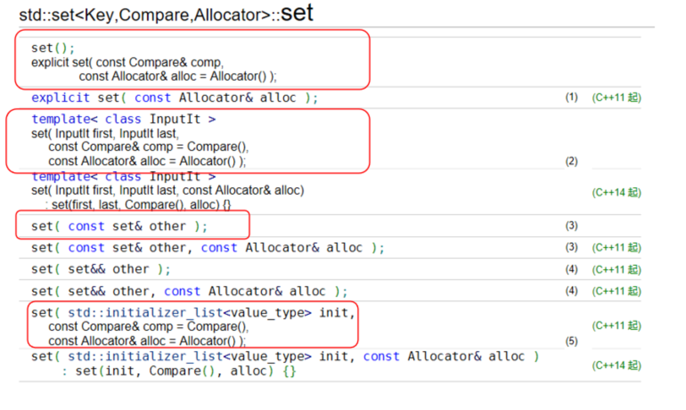
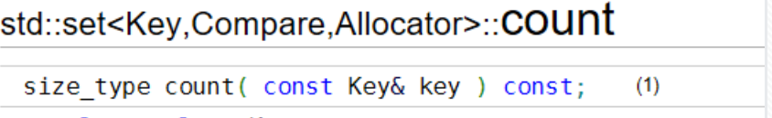
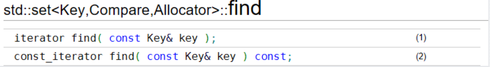
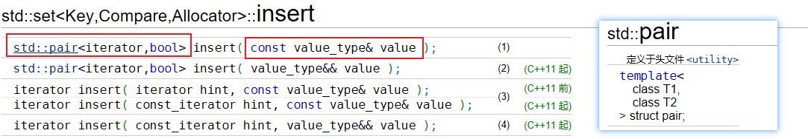
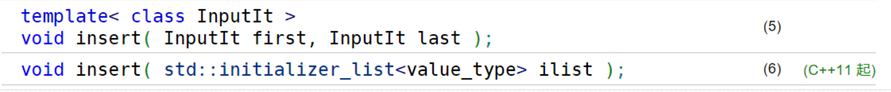
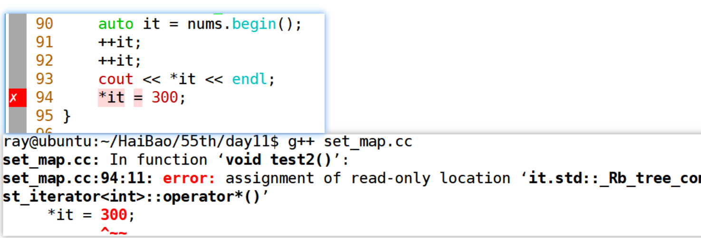
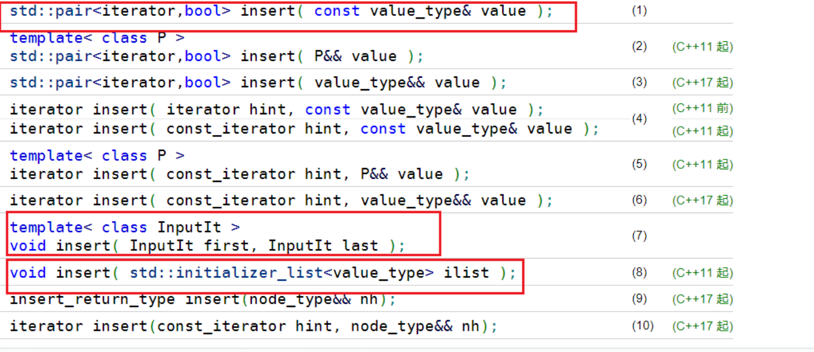

# 第六章 关联式容器

学到这里，可以提前学习一部分 STL 内容，帮助完成后续作业。本章主要介绍两个常用关联式容器：`set` 和 `map`。

关联式容器的核心特点是：元素不是按插入顺序或下标位置组织，而是按**键**组织，适合做查找、去重、排序和键值映射。

> [!NOTE]
> `set` 可以理解为“有序且不重复的集合”；`map` 可以理解为“有序且键不重复的键值表”。

## set

### set 的构造

`set` 定义在头文件 `<set>` 中。打开 C++ 参考文档时，主要关注下面几类构造函数。



1. 无参构造
2. 标准初始化列表（大括号的形式）
3. 拷贝构造
4. 迭代器方式构造，传入一个 `first` 迭代器和一个 `last` 迭代器。

`set` 的创建方式与 `vector` 类似。下面尝试使用四种构造方式创建 `set`，并遍历其中元素。

```cpp
set<int> nums; // 无参
set<int> nums2 = {1, 3, 9, 8, 9}; // 初始化列表
set<int> nums3 = nums2; // 拷贝构造
set<int> nums4(nums2.begin(), nums2.end()); // 迭代器方式

// set 不允许下标访问
/* nums2[0] */

// 增强 for 循环
for(auto & ele: nums2){
    cout << ele << " ";
}
cout << endl;

// 迭代器方式遍历
// 完整类型
// std::set<int>::iterator itBegin = nums2.begin();
auto it = nums2.begin();
for(; it != nums2.end(); ++it){
    cout << *it << " ";
}
cout << endl;
```

<span style=color:red;background:yellow>**set 的特征：**</span>

**（1）`set` 中存放的元素是唯一的，不能重复；**

**（2）默认情况下，会按照元素进行升序排列；**

> [!IMPORTANT]
> `set` 中的元素既是值，也是排序依据。为了维护底层树结构的有序性，不能通过迭代器直接修改元素值。

### set 的查找操作



参数 `key`：要查找的数据元素。

返回值 `size_type`：元素数量。对于 `set`，元素不重复，所以找到返回 `1`，没找到返回 `0`。



参数 `key`：要查找的数据元素。

返回值 `iterator`：如果找到，返回对应元素的迭代器；如果没找到，返回 `end()` 迭代器。

```cpp
std::set<int> example = {1, 2, 3, 4};
auto search = example.find(2);
if (search != example.end()) {
    std::cout << "Found " << (*search) << '\n';
} else {
    std::cout << "Not found\n";
}
```

### set 的插入操作



可以看到 `insert` 函数的第一种形式中，参数是一个 `key`，返回值是一个 `pair` 类型，包含一个迭代器和一个 `bool` 值。

先看 `pair` 是什么。

`pair` 定义在头文件 `<utility>` 中，类似于结构体，可以存储两个不同类型的对象。

可以认为一个特定的 `pair` 是一个类，包含两个对象成员，它们的类型在定义 `pair` 时给出。

重点关注：`pair` 的对象成员如何访问。

```cpp
#include <utility>
void test1(){
    pair<int, string> num{1, "wangdao"};
    cout << num.first << ":" << num.second << endl;
}
```

#### 插入单个元素

`insert` 函数的返回类型是 `pair`，包含两个对象成员：第一个是指向 `set` 元素的迭代器，第二个是 `bool` 值。

如果插入成功，则返回 <span style=color:red;background:yellow>**插入元素对应迭代器**</span> 和 <font color=red>**true**</font>。

如果插入失败，则返回 <span style=color:red;background:yellow>**阻止插入的元素（原本就存在的元素）对应迭代器**</span> 和 <font color=red>**false**</font>。

```cpp
set<int> nums = {1, 2, 3, 4};
// 完整类型
// pair<set<int>::iterator, bool> ret = nums.insert(8);
// 借助auto简化
auto ret = nums.insert(8);
if(ret.second){
    cout << "该元素插入成功:"
        << *(ret.first) << endl;
}else{
    cout << "该元素插入失败，表明该元素已存在" << endl;
}
```

#### 插入多个元素



（1）传入两个迭代器（首迭代器和尾后迭代器），尝试插入这个范围中的元素，区间为 **[first, last)**。

（2）传入大括号列表，尝试插入列表中的元素。

```cpp
void test()
{
    set<int> nums = {1, 3, 5, 2};
    // 通过迭代器插入多个数据
    int arr[3] = {7, 4, 6};
    nums.insert(arr, arr + 3);
    for(auto & n : nums){
        cout << n << " ";
    }
    cout << endl;
    cout << "size: " << nums.size() << endl;
    // 通过初始化列表插入
    nums.insert({100, 200});
    for(auto & n : nums){
        cout << n << " ";
    }
    cout << endl;
    cout << "size: " << nums.size() << endl;
}

```

> [!CAUTION]
> `set` 容器不支持下标访问，因为没有 `operator[]` 重载函数。

> [!CAUTION]
> 不能通过 `set` 的迭代器直接修改元素值。`set` 的底层通常是红黑树，元素值决定节点排序位置，直接修改会破坏结构有序性。



## map

定义于头文件 `<map>`

`std::map` 是 C++ 标准库中的关联容器，存储的是**键值对**（key-value pairs）。每个键（key）都与一个值（value）相关联。它通常用于查找、插入和删除操作，底层通常使用**红黑树**或其他平衡树结构实现，查找、插入、删除的时间复杂度通常是 `O(log n)`。

基本特性：

- **有序容器**：`std::map` 会按照键的大小顺序对元素进行排序，默认是按键的升序排序。如果需要降序排序，可以使用自定义比较函数。
- **唯一的键**：`std::map` 中的每个键必须是唯一的。如果你尝试插入一个已有键的元素，插入操作将不会成功。
- **键和值**：每个键都会关联一个值，类型为 `pair<const Key, T>`，其中 `Key` 是键的类型，`T` 是值的类型。
- **自动排序**：元素会根据键（key）的顺序自动排序，也可以自定义排序规则。
- **支持迭代器**：你可以通过迭代器遍历 `map` 中的元素。

### map 的构造

`map` 中存放的元素类型是 `pair`（键值对）。构造 `map` 时需要关注三种创建 `pair` 的方式，也可以把它们结合使用。

1. 通过初始化列表方式创建 `pair` 对象。
2. 通过构造函数创建 `pair` 对象。
3. 通过 `make_pair` 方法创建 `pair` 对象。

如下：

````cpp
void test0(){
    map<int, string> number = {
        {1, "hello"}, // 通过初始化列表方式创建 pair 对象
        {2, "world"},
        {3, "wangdao"},
        pair<int, string>(4, "hubei"),
        pair<int, string>(5, "wangdao"), // 直接通过构造函数创建 pair 对象
        make_pair(9, "shenzhen"), // 通过 make_pair 方法创建 pair 对象
        make_pair(3, "beijing"),
        make_pair(6, "shanghai")
    };
    // 根据 key 值进行排序（默认升序）和去重
}
````

使用迭代器方式遍历 `map` 时，要注意访问 `pair` 成员的写法。

```cpp
// 完整类型
map<int, string>::iterator it = number.begin();
// 也可以使用 auto 简化
while(it != number.end()){
    cout << (*it).first << " " << it->second << endl;
    ++it;
}
cout << endl;
```

使用增强 `for` 循环遍历 `map`：

```cpp
for(auto & elem : number){
    cout << elem.first << "=" << elem.second << endl;
}
```

<span style=color:red;background:yellow>**map 的特征：**</span>

（1）元素唯一：创建 `map` 对象时，`key` 相同的元素会被舍弃。`key` 不同，即使 `value` 相同也能保留。

（2）默认以 `key` 值为参考进行升序排列。

### map 的查找操作

根据 `key` 值在 `map` 中进行查找。

- `count` 函数的返回值：如果找到返回 `1`，如果没找到返回 `0`（`size_t` 类型）。
- `find` 函数的返回值：如果找到返回相应元素的迭代器，如果没找到返回 `end()` 的结果。

可以实践一下这两个函数的使用。

```cpp
void checkFind(map<int, string> & rhs, int key)
{
    // 完整类型
    // map<int, string>::iterator it = rhs.find(key);
    // auto 简化
    auto it = rhs.find(key);
    if(it != rhs.end()){
        cout << it->first << "=" << it->second << endl;
    }else{
        cout << "not stored" << endl;
    }
}

void test()
{
    map<int, string> numbers = {
        {1, "hello"}, // 通过初始化列表方式创建 pair 对象
        {2, "world"},
        {3, "wangdao"}
    };
    size_t cnt1 = numbers.count(1);
    size_t cnt2 = numbers.count(4);
    cout << cnt1 << endl;
    cout << cnt2 << endl;

    checkFind(numbers, 1);
    checkFind(numbers, 4);
}
```

### map 的插入操作



**插入单个元素**

插入单个元素时，`insert` 函数的返回值是一个 `pair`：第一个对象成员是指向 `map` 元素的迭代器，第二个对象成员是 `bool` 值。

```cpp
pair<map<int, string>::iterator, bool> ret = number.insert(pair<int, string>(7, "nanjing"));

if(ret.second){
    cout << "该元素插入成功" << endl;
    // ret.first 取出来的是指向 map 元素（pair<int, string>）的迭代器
    // 再用箭头运算符访问到 int 和 string 的内容
    cout << ret.first->first << " : " << ret.first->second << endl;
}else{
    cout << "该元素插入失败" << endl;
}
cout << endl;
```

```cpp
void test()
{
    map<int, string> container;
    // insert single pair 对象
    container.insert({1, "zs"});
    container.insert({1, "zs"});
    container.insert({3, "ls"});
    container.insert({2, "ww"});
    container.insert(pair<int, string>{4, "ww"});
    container.insert(std::make_pair(5, "zl"));
}
```

**插入多个元素**

- 初始化列表方式
- 迭代器方式

```cpp
    // 再创建一个 map
    map<int, string> number2 = {{1, "beijing"}, {18, "shanghai"}};

    // 迭代器方式
    number2.insert(number.begin(), number.end());

    // 初始化列表方式
    cout << endl;
    number2.insert({{4, "guangzhou"}, {22, "hello"}});
```

### map 的下标操作（重点）

`map` 支持下标操作：**根据 `key` 获取对应 `value`**。

1. `map` 下标操作返回的是 `map` 中元素（`pair`）的 `value`。
2. 下标访问运算符中的值代表 `key`，不是传统意义上的位置下标。
3. 如果下标操作传入一个不存在的 `key`，会将这个 `key` 和默认构造出来的 `value` 插入到 `map` 中。
4. 下标访问可以进行写操作，但只能修改 `value`，不会修改 `key`，也不会影响排序。

> [!CAUTION]
> 只想查询元素是否存在时，不要直接使用 `m[key]`，因为它可能插入新元素。查询时优先使用 `find` 或 `count`。

```cpp
void test()
{
    // key:int  value:string
    map<int, string> container{
        {1, "zs"},
        {2, "ls"},
        {3, "zs"}
    };

    // 根据 key 返回对应的 value
    // read
    cout << container[1] << endl;
    cout << container[2] << endl;
    // write
    container[3] = "wangdao";
    cout << container[3] << endl;
}

```

`map` 的元素是 `pair`（key-value），`key` 和 `value` 的类型可以自由选择，但要保证 `key` 的类型可以判重和排序。

```cpp
// key: char  value: string
map<char, string> container2{
    {'a', "abc"},
    {'c', "bcd"},
    {'d', "eee"},
    {'b', "fff"}
};
// 根据 key 访问对应 value
cout << container2['a'] << endl;
cout << container2['b'] << endl;
cout << container2['d'] << endl;

```
