# 第七章 继承

## 继承的基本概念

在学习类和对象时，我们知道对象是基础，可以从对象中抽象出类。但现实世界并不是“对象 -> 类”这一层关系就结束了。类与类之间还可以继续抽象，形成更高层次的类型关系。

C++ 中模拟这种类型层次结构的方式就是继承。继承也是代码复用的重要方式之一。通过继承，可以用已有类型定义新类型，新类型既包含已有类型的成员，也可以添加自己的新成员，不需要把已有类型的内容重新写一遍。已有类型称为**基类**或**父类**，在它基础上建立的类型称为**派生类**或**子类**。

> [!NOTE]
> 公有继承通常表达 “is-a” 关系：派生类对象可以被当作基类对象使用。例如“苹果是水果”“狗是动物”。

**基本语法**

```cpp
class DerivedClass : access_specifier BaseClass {
    // Derived class members (fields and methods)
};
```

- **`DerivedClass`**：派生类（子类），继承自基类。
- **`BaseClass`**：基类（父类），提供要继承的属性和方法（即父类中的成员）。
- **`access_specifier`**：访问控制符，决定基类成员在派生类中的访问权限，常见的有 `public`、`protected` 和 `private`。

```cpp
class 基类
{};

class 派生类
: public/protected/private 基类 // 继承方式
{};
```

如上述代码所示，有三种继承方式，其“继承效果”如图：

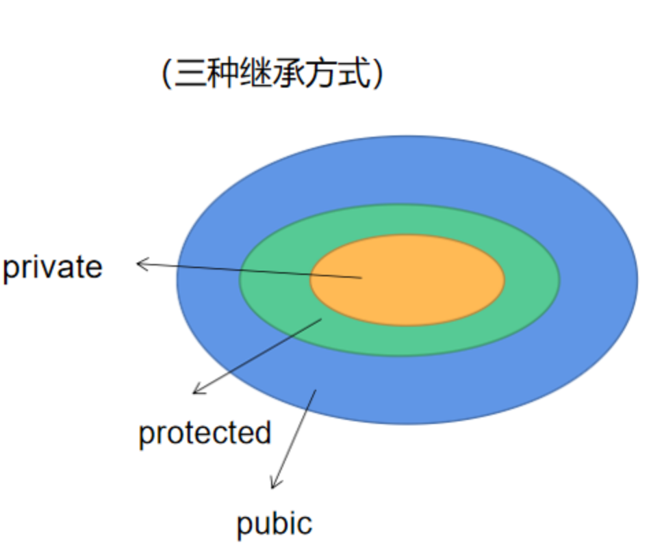

**定义一个派生类的过程：**

1. 吸收基类的成员
2. 添加新的成员（非必须）
3. 隐藏基类的成员（非必须）

例如：定义一个 `Point3D` 类继承之前的 `Point` 类。

```cpp
class Point3D
: public Point
{
public:
    Point3D(int x, int y, int z)
    : Point(x, y)
    , m_z(z)
    {
        cout << "Point3D(int*3)" << endl;
    }

    void display() const{  // 添加新的成员函数
        print();
        cout << m_z << endl;
    }
private:
    int m_z;  // 添加新的数据成员
};
```

如果定义一个派生类时只写继承关系，不写任何自己的成员，它也会吸收基类的成员。这种情况叫做空派生类，常用于在特定场景下建立类型关系，为将来的扩展留出空间。

### 三种继承方式的访问权限

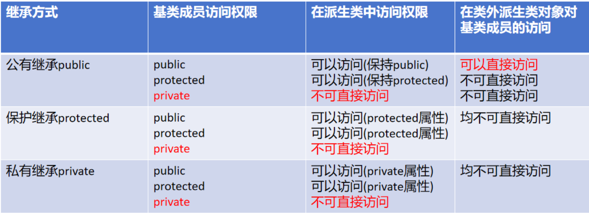

总结：派生类的访问权限如下：

1. 不管采用哪种继承方式，派生类内部都不能直接访问基类的私有成员。
2. 不管采用哪种继承方式，派生类内部都可以访问基类的公有成员和保护成员。
3. 在类外通过派生类对象访问基类成员时，只有公有继承得到的基类公有成员可以直接访问，其他情况都不能直接访问。

根据上面的总结，很容易感受到公有继承和另外两种继承方式的区别。那么，保护继承和私有继承之间有什么区别呢？

可以再往下派生一层，试着在最底层派生类中访问顶层基类的成员，观察效果。

以三层继承为例，如果中间层采用保护继承的方式继承顶层基类，那么在底层派生类中也能访问到顶层基类的公有成员和保护成员。

如果中间层采用私有继承继承顶层基类，那么底层派生类中对顶层基类的任何成员都无法访问了（访问直接基类的非私有成员仍然可以）。

**protected继承 VS private继承**

- `protected`：非私有成员在后续派生层次中仍然可访问。
- `private`：非私有成员在当前派生类中可访问，但继续派生后会被阻断。

> [!CAUTION]
> 如果 `class` 继承时不写继承方式，默认是私有继承；如果 `struct` 继承时不写继承方式，默认是公有继承。

```cpp
class A
{
public:
    int m_a;
};

class B
: private A
{
public:
    int m_b;
};

class C
: private B
{
    void func(){
        m_a; // error，底层派生类无法访问最顶层基类的成员 m_a
        m_b; // OK，底层派生类可以访问直接基类的非 private 成员 m_b
    }
};
```

### 常考题总结

**Q1：派生类在类之外对于基类成员的访问，具有什么限制？**

只有公有继承自基类的公有成员，可以通过派生类对象直接访问，其他情况一律不能直接访问。

**Q2：派生类在类内部对于基类成员的访问，具有什么限制？**

对于基类的私有成员，不管以哪种方式继承，在派生类内部都不能访问；

对于基类的非私有成员，不管以哪种方式继承，在派生类内部都可以访问；

**Q3：保护继承和私有继承的区别？**

如果继承层次中都采用的是保护继承，任意层次都可以访问顶层基类的非私有成员；但如果采用私有继承之后，这种特性会被打断。

公有继承通常被称为接口继承，保护继承、私有继承通常被称为实现继承。

> [!IMPORTANT]
> 初学阶段最常用、最应该掌握的是公有继承。保护继承和私有继承更多用于表达“复用实现但不暴露接口”的设计意图。

### 继承关系的局限性

- 创建、销毁的方式不能被继承 —— 构造、析构

- 复制控制的方式不能被继承 —— 拷贝构造、赋值运算符函数

- 友元不能被继承（友元破坏了封装性，为了降低影响，不允许继承）

## 单继承下派生类对象的创建和销毁

### 简单的单继承结构

思考一个问题：

派生类继承基类后，可以通过派生类对象访问基类中的成员，实现成员复用。成员依赖于对象存在，那么在这个过程中是否有基类对象被创建呢？

基类成员存储在哪里呢？

可以进行简单的测试来获取一下派生类对象的大小

```cpp
class A
{
public:
    int m_num1;
private:
    int m_num2;
};

class B
/* : public A */
: private A
{
public:
    int m_num3;
};
void test1()
{
    B b{};
    cout << "size=" << sizeof(b) << endl; // 12
}

```

由此可以推断出：派生类对象中包含基类数据成员部分，也包含派生类自己定义的数据成员部分。

也就是说，派生类对象的内存结构中存在一个“基类子对象”部分。

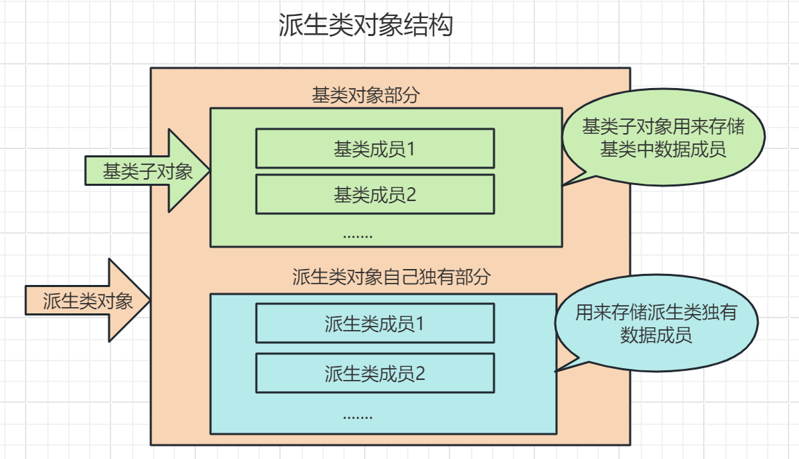

有一种说法：“创建派生类对象时，先调用基类构造函数，再调用派生类构造函数。”这句话准确吗？

更准确的说法是：创建派生类对象时，入口是派生类构造函数；在执行派生类构造函数体之前，会先在初始化阶段调用基类构造函数，完成基类子对象的初始化。

#### 创建派生类对象时调用基类构造的机制

1. 当派生类中没有显式调用基类构造函数时，会自动调用基类的默认无参构造（或者所有参数都有默认值的有参构造）。

2. 如果基类没有默认无参构造，`Derived` 类的构造函数初始化列表中也没有显式调用基类构造函数，编译器会报错。

3. 如果希望派生类对象创建时使用基类的非默认构造函数，必须在派生类构造函数初始化列表中显式写出。

**注意**

- 显式调用基类构造函数，写的是基类类名；
- 显式调用对象成员的构造函数，写的是对象成员的名字。

```cpp
class Base {
public:
    // no args constructor
    Base(){ cout << "Base()" << endl; }
    // arg constructor
    Base(long num)
    : m_base(num)
    {
        cout << "Base arg constructor" << endl;
    }
private:
    long m_base;
};

class Derived
: public Base
{
public:
    Derived(long derived)
    /* : Base()  // 显式调用 Base 的默认无参构造 */
    /* , m_derived(derived) */
    /* : Base(derived) // 显式调用 Base 的有参构造函数 */
    : m_derived(derived) // 默认自动调用 Base 的无参构造函数
    {
        cout << "Derived(long)" << endl;
    }

    long m_derived;
};

void test1(){
    Derived d{1};
}

```

#### 创建派生类对象时构造函数的调用顺序

创建派生类对象会进入派生类构造函数，但在执行派生类构造函数体之前，会先完成基类子对象和对象成员的初始化。

1. 完成派生类对象所占空间的开辟，由系统在调用构造函数时自动完成。
2. 调用基类构造函数，完成基类子对象的初始化。
3. 初始化派生类中的对象成员、`const` 成员或引用数据成员。
4. 执行派生类构造函数的函数体。

#### 派生类对象的销毁

当派生类析构函数执行完毕之后，会自动调用基类析构函数，完成基类部分所需要的销毁，例如回收基类数据成员管理的堆空间资源。**这与构造过程的顺序正好相反。**

考虑对象成员时，继承机制下销毁派生类对象的析构函数调用顺序为：

1. 先调用派生类的析构函数
2. 再调用派生类中对象成员的析构函数
3. 最后调用基类的析构函数

### 对基类成员的隐藏

#### 基类数据成员的隐藏

派生类中声明了与基类数据成员同名的数据成员，就会对基类的这个数据成员形成隐藏，无法通过派生类对象**直接**访问基类中的同名数据成员。

````cpp
class Base{
public:
    Base(long x)
    : m_base(x)
    {
        cout << "Base()" << endl;
    }

    long m_data = 100;
private:
    long m_base;
};

class Derived
: public Base
{
public:
    Derived(long base, long derived)
    : Base(base) // 创建基类子对象
    , m_derived(derived)
    {
        cout << "Derived()" << endl;
    }

    long m_data = 19;
private:
    long m_derived;

};

void test0(){
    Derived dd(1,2);
    cout << dd.m_data << endl; // 直接访问
    // 使用基类类名+作用域限定符进行访问
    cout << dd.Base::m_data << endl; // 间接访问
}
````

> [!NOTE]
> 隐藏不代表改变了基类中的同名数据成员。基类子对象中的成员仍然存在，只是不能通过派生类对象直接访问到它。

从内存的角度上也能验证

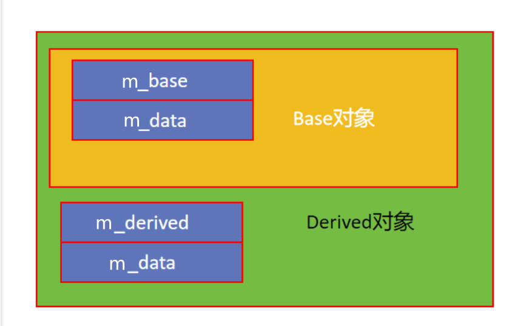

如果一定要访问基类的这个数据成员，需要加上作用域。但是这种写法不符合面向对象的原则，不推荐在实际业务代码中使用。

`派生类对象.基类::同名数据成员`

#### 基类成员函数的隐藏

当派生类声明了与基类同名的成员函数时，只要名字相同，即使参数列表不同，也会隐藏基类中的同名函数。此时无法通过派生类对象**直接调用**基类的同名函数。

测试例子：

1. `Base` 中定义一个不传参的 `print` 函数，`Derived` 类中不定义 `print` 函数，进行测试。

2. `Derived` 类中定义同名 `print` 函数，再进行测试。

3. `Derived` 类中修改 `print` 函数，增加一个参数后，再进行测试。

> [!CAUTION]
> 派生类对基类成员函数构成隐藏，只需要派生类中定义一个与基类成员函数同名的函数即可。返回类型、参数列表不同，依然会隐藏。

如果一定要调用基类的这个成员函数，需要加上作用域，但是这种写法不符合面向对象的原则，不推荐实际使用。

`派生类对象.基类::同名成员函数()`

## 多继承

C++ 除了支持单继承外，还支持多重继承。为什么要引入多重继承？

现实世界中，经常会遇到一个对象同时具有多种身份的情况。例如一个学生可能既是班长，又是某个部门的部长；创业公司中某人可能同时负责技术和财务。类似场景中，单一继承不一定能表达完整关系，就可能需要多继承。

公有继承本质上表达的是“子类 is-a 父类”的关系，也就是可以把子类对象当作父类对象使用。例如苹果是水果，狗是动物；但反过来不成立，不能把所有水果都当作苹果，也不能把所有动物都当作狗。

例如:

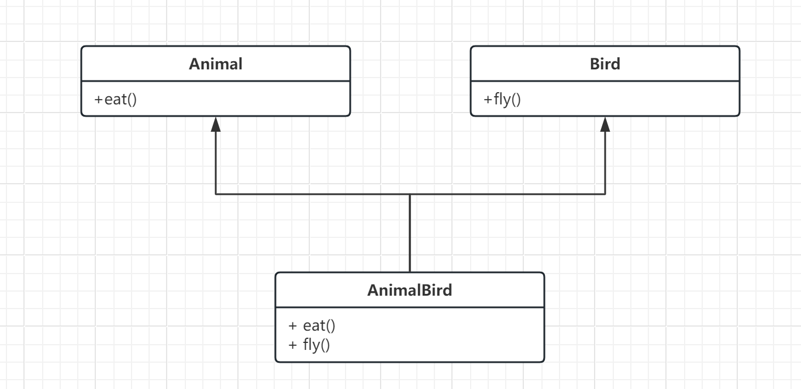

### 多重继承的派生类对象的构造和析构

多继承的定义方式

```cpp
class A
{
public:
    A()
    {
        cout << "A()" << endl;
    }
    ~A()
    {
        cout << "~A()" << endl;
    }
    void print() const
    {
        cout << "A::print()" << endl;
    }
};

class B
{
public:
    B()
    {
        cout << "B()" << endl;
    }
    ~B()
    {
        cout << "~B()" << endl;
    }
    void show() const
    {
        cout << "B::show()" << endl;
    }
};

class C
{
public:
    C()
    {
        cout << "C()" << endl;
    }
    ~C()
    {
        cout << "~C()" << endl;
    }
    void display() const
    {
        cout << "C::display()" << endl;
    }
};

class D
: public A, B, C
{
public:
    D(){ cout << "D()" << endl; }
    ~D(){ cout << "~D()" << endl; }
    //void print() const{
    //    cout << "D::print()" << endl;
    //}
};

void test()
{
    D d;
    d.print();
    //d.show(); //error
    //d.display(); // error
}
```

> [!CAUTION]
> 如果这样定义，那么 `D` 类公有继承了 `A` 类，但对 `B` / `C` 类采用的是默认私有继承。

如果想要公有继承 `A` / `B` / `C` 三个类，需要分别写出继承方式。

```cpp
class D
: public A
, public B
, public C
{
public:
    D(){ cout << "D()" << endl; }
    ~D(){ cout << "~D()" << endl; }
};
```

**此结构下创建 `D` 类对象时，这四个类的构造函数调用顺序如何？**

创建 `D` 类对象时，入口是 `D` 的构造函数；在执行 `D` 构造函数体之前，会按照继承声明顺序依次调用 `A`、`B`、`C` 的构造函数，创建这三个基类子对象。

**`D` 类对象销毁时，这四个类的析构函数调用顺序如何？**

销毁 `D` 类对象时，先执行 `D` 的析构函数体；之后按照继承声明顺序的逆序，依次调用 `C`、`B`、`A` 的析构函数。

> [!IMPORTANT]
> 多继承中基类构造顺序由继承声明顺序决定，不由派生类构造函数初始化列表中的书写顺序决定。

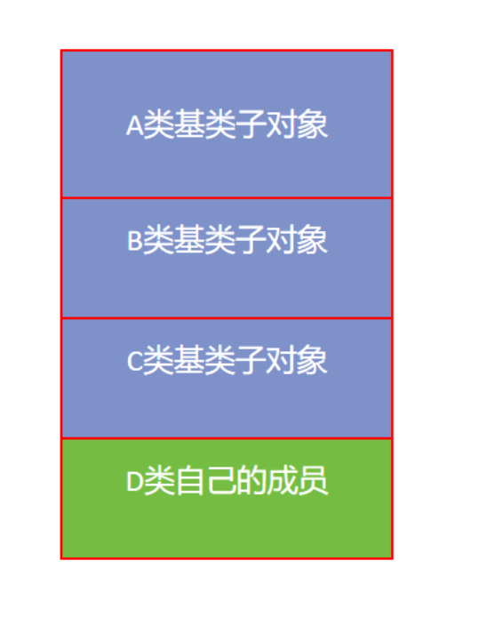

### 多重继承可能引发的问题

#### 成员名访问冲突的二义性

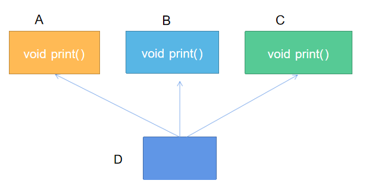

```cpp
class A
{
public:
    A()
    {
        cout << "A Constructor" << endl;
    }
    ~A()
    {
        cout << "A Destructor" << endl;
    }
    void print() const
    {
        cout << "A print()" << endl;
    }
};

class B
{
public:
    B()
    {
        cout << "B Constructor" << endl;
    }
    ~B()
    {
        cout << "B Destructor" << endl;
    }

    void print() const
    {
        cout << "B print()" << endl;
    }
};

class C
{
public:
    C()
    {
        cout << "C Constructor" << endl;
    }
    ~C()
    {
        cout << "C Destructor" << endl;
    }
    void print() const
    {
        cout << "C print()" << endl;
    }
    int m_b;
};

class D
: public A
, public B
, public C
{
public:
    D()
    {
        cout << "D Constructor" << endl;
    }
    ~D()
    {
        cout << "D Destructor" << endl;
    }
    /* void print() const
    {
        cout << "D print()" << endl;
    } */
};

// 多继承的二义性
void test3()
{
    D d{};
    /* d.print(); // 成员名访问冲突*/
    // member 'print' found in multiple base classes of different types
    // 通过类名::作用域方式解决冲突，指明调用哪个基类的方法
    d.A::print();
    d.B::print();
    d.C::print();
}
```

解决成员名访问冲突的方法是加类作用域，但这种方式不推荐作为常规设计，应该尽量避免成员名冲突。

同时，如果 `D` 类中声明了同名成员，可以对基类中的同名成员形成隐藏，这样就可以直接通过成员名访问 `D` 自己的版本。

```cpp
    D d;
    d.A::print();
    d.B::print();
    d.C::print();
    d.print(); //ok
```

#### 存储二义性的问题（重要）

菱形（diamond）继承结构：

```cpp
class A
{
public:
    void print() const
    {
        cout << "A::print()" << endl;
    }
    double m_a;
};

class B
: public A
{
public:
    double m_b;
};

class C
: public A
{
public:
    double m_c;
};

class D
: public B
, public C
{
public:
    double m_d;
};
```

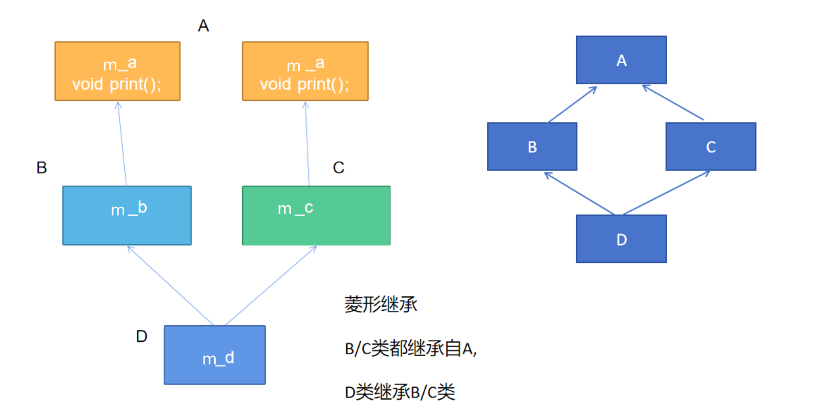

菱形继承下，创建 `D` 类对象时会生成一个 `B` 类子对象，其中包含一个 `A` 类子对象；同时也会生成一个 `C` 类子对象，其中也包含一个 `A` 类子对象。因此 `D` 类对象中有两份 `A` 类子对象，访问继承自 `A` 的成员时会发生二义性。

这种二义性不只出现在数据成员上，单纯调用 `A` 类的成员函数也可能冲突。因为编译器需要先确定通过哪一个 `A` 类子对象调用成员函数，除非使用作用域限定符 `::` 明确指定路径。

常见报错信息：

```text
non-static member 'print' found in multiple base-class subobjects of type 'A'
```

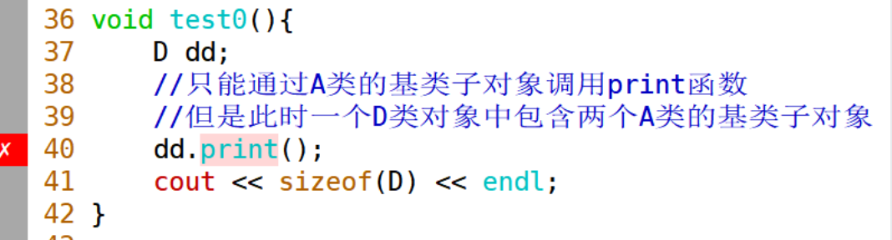

如果 `D` 类重新定义一个同名成员函数，则会隐藏基类中的同名函数。

> [!IMPORTANT]
> 解决菱形继承存储二义性的常用方式：让中间层类虚继承顶层基类，即 `B` 和 `C` 都使用 `virtual public A`。

```cpp
class A
{
public:
    void print() const
    {
        cout << "A::print()" << endl;
    }
    double m_a;
};

class B
: virtual public A
{
public:
    double m_b;
};

class C
: virtual public A
{
public:
    double m_c;
};

class D
: public B
, public C
{
public:
    double m_d;
};
```

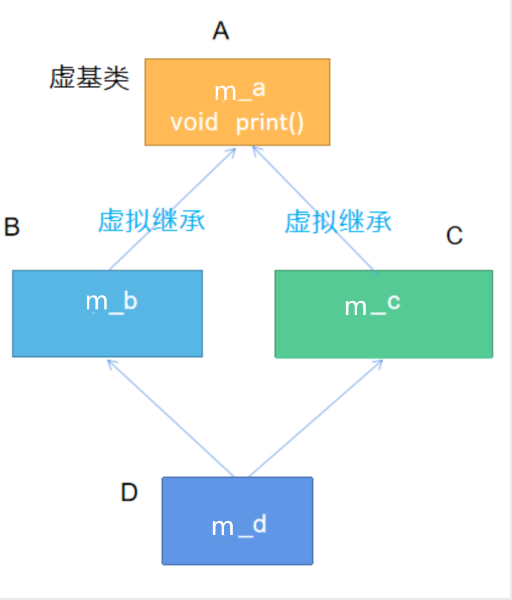

采用虚继承处理菱形继承，本质上会改变派生类对象的内存布局。`B` 类和 `C` 类对象中通常会增加虚基类指针，用来定位共享的虚基类子对象；继承自 `A` 的内容会被统一放在对象布局中的一处。最终 `D` 类对象中只保留一份 `A` 类基类子对象。

> [!NOTE]
> 虚继承和虚函数不是一回事。虚继承解决的是菱形继承中基类子对象重复存储的问题；虚函数解决的是运行时多态调用的问题。

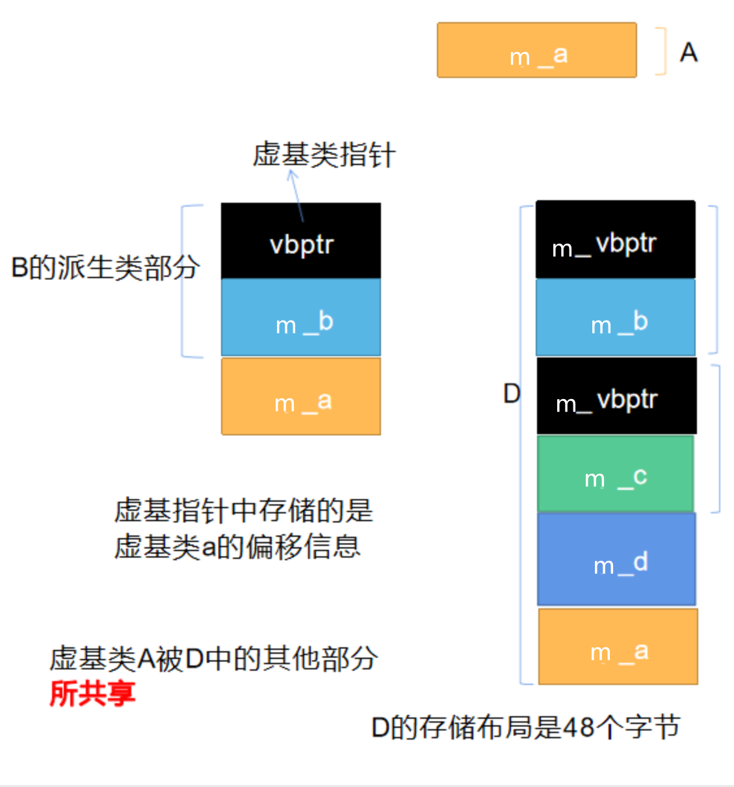

> 通过VS可以验证，查看D类的布局：
>
> 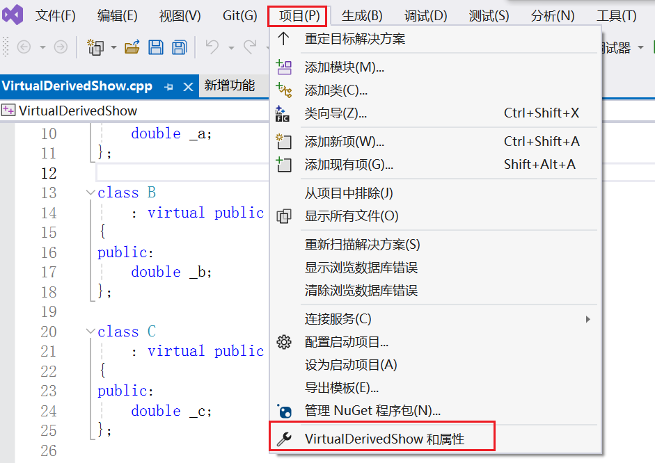
>
> 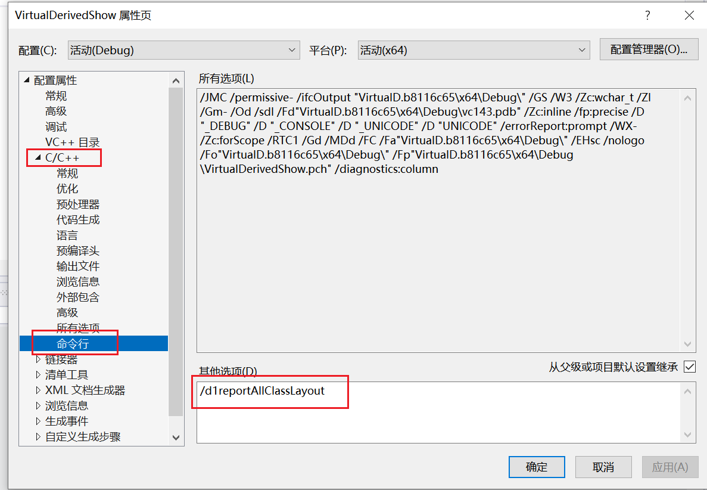
>
> 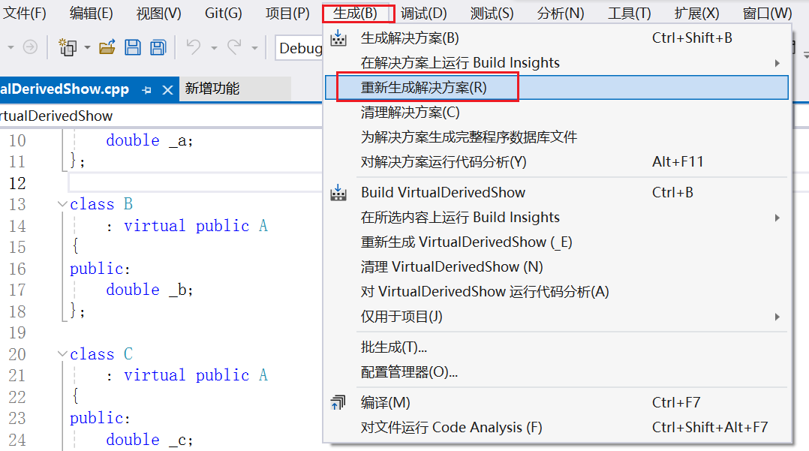
>
> 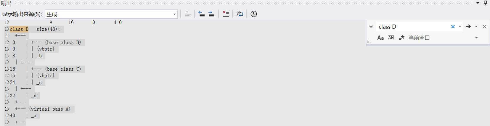
> 验证得到的结果：
>
> 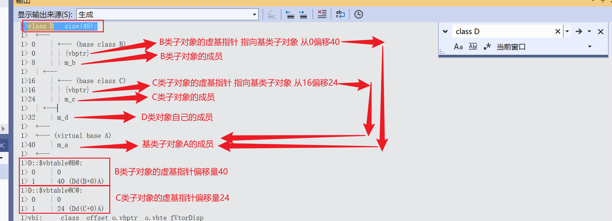
>

## 基类与派生类之间的转换

一般情况下，基类对象占据的空间小于派生类对象；空继承等特殊情况下，两者大小也可能相等。

思考三个问题：

1. 可否把一个基类对象赋值给一个派生类对象？可否把一个派生类对象赋值给一个基类对象？

2. 可否将一个基类指针指向一个派生类对象？可否将一个派生类指针指向一个基类对象？

3. 可否将一个基类引用绑定到一个派生类对象？可否将一个派生类引用绑定到一个基类对象？

```cpp
Base base;
Derived d1;

base = d1; // ok
d1 = base; // error

Base * pbase = &d1; // ok
Derived * pderived = &base; // error

Base & rbase = d1; // ok
Derived & rderived = base; // error
```

以上三个可行的操作都属于向上转型：派生类向基类方向转换。向上转型是类型安全的。

可行的向上转型包括：

- 用基类对象接收派生类对象的赋值；
- 用基类引用绑定派生类对象；
- 用基类指针指向派生类对象。

反过来，从基类向派生类转换称为向下转型。直接向下转型通常是不允许的，因为基类对象不一定真的包含派生类新增的成员。

向下转型的风险如下，以指针为例：

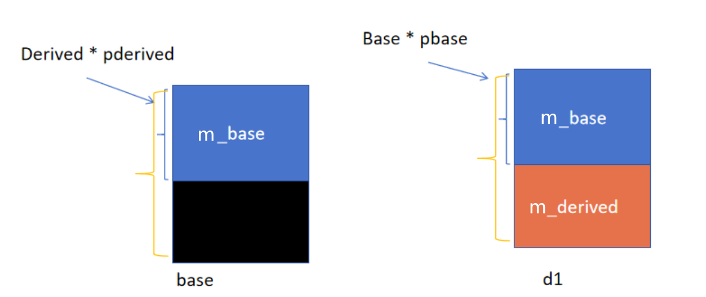

`Base` 类指针指向 `Derived` 类对象时，实际指向的是派生类对象中的基类子对象部分，因此只能操作从 `Base` 继承来的成员。

如果让 `Derived` 类指针指向 `Base` 对象，那么这个指针除了要访问 `Base` 部分，还可能访问派生类新增的那部分空间。但普通 `Base` 对象并没有这部分空间，所以这种转换是不安全的。

```cpp
Base * pBase = &d1;
// pBase 指向派生类对象中的基类子对象部分，只能访问基类部分
pBase->print();
```

> [!IMPORTANT]
> 基类对象和派生类对象之间的直接赋值不是继承学习的重点。真正需要重点掌握的是：基类指针指向派生类对象、基类引用绑定派生类对象，以及它们只能访问基类接口这一事实。

某些场景下，向下转型是合理的。例如：一个基类指针本来就指向派生类对象，只是静态类型被写成了基类指针。此时可以使用 `dynamic_cast` 做运行时检查。

```cpp
Base base;
Derived d1;

Base * pbase = &d1;
Derived * pderived = pbase; // 逻辑上合理，但不能直接转换，会报错
```

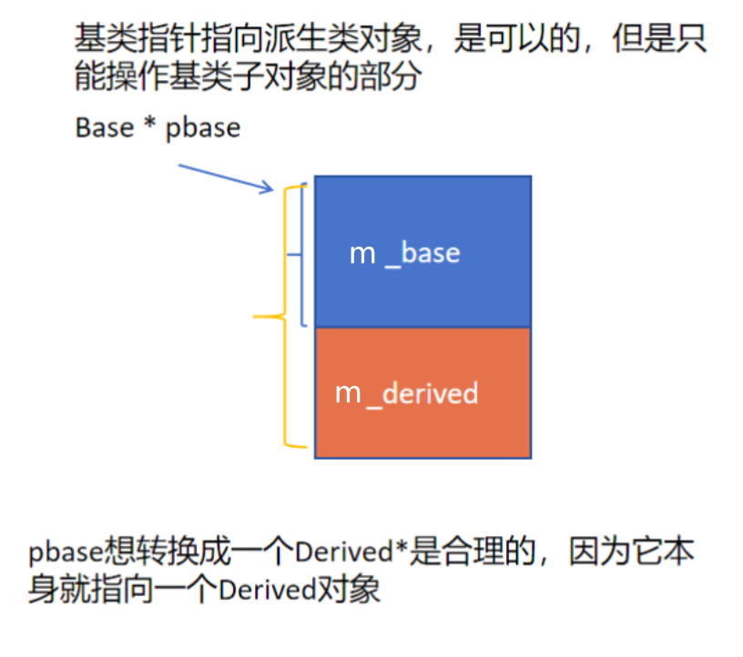

> [!CAUTION]
> 使用 `dynamic_cast` 做基类到派生类的指针或引用转换时，基类必须是多态类型，也就是类中至少要有一个虚函数。

```cpp
class Base
{
public:
    Base(long base)
    : m_base(base)
    {
        cout << "Base()" << endl;
    }

    virtual void display()
    {
        cout << "Base::display()" << endl;
    }

    ~Base()
    {
        cout << "~Base()" << endl;
    }

    long m_base = 10;
};

class Derived
: public Base
{
public:
    Derived(long base, long derived)
    : Base(base)
    , m_derived(derived)
    {
        cout << "Derived(long)" << endl;
    }

    ~Derived()
    {
        cout << "~Derived()" << endl;
    }

    long m_derived;
};
```

下面的转换可以成功，因为 `pbase` 实际指向的是一个 `Derived` 对象：

```cpp
void test0()
{
    Derived d1(1, 2);
    Base * pbase = &d1;

    // 向下转型
    Derived * pd = dynamic_cast<Derived*>(pbase);
    if(pd)
    {
        cout << "转换成功" << endl;
        pd->display();
    }
    else
    {
        cout << "转换失败" << endl;
    }
}
```

下面的转换不合理，因为 `pbase` 实际指向的是一个 `Base` 对象，此时 `dynamic_cast` 会返回空指针：

```cpp
void test1()
{
    Base base(1);
    Derived d1(2, 3);
    Base * pbase = &base;

    Derived * pd = dynamic_cast<Derived*>(pbase);
    if(pd)
    {
        cout << "转换成功" << endl;
        pd->display();
    }
    else
    {
        cout << "转换失败" << endl;
    }
}
```

结论：

- 可以用派生类对象赋值给基类对象；
- 可以用基类指针指向派生类对象；
- 可以用基类引用绑定派生类对象；
- 反方向转换不能直接进行，确实需要时应使用合适的运行时检查。

## 派生类对象间的复制控制

复制控制函数主要包括拷贝构造函数和赋值运算符函数。

派生类对象复制时，需要分别处理基类部分和派生类新增部分。

1. 当派生类没有显式定义复制控制函数时，编译器生成的复制控制函数会自动处理基类部分；

2. 当派生类显式定义复制控制函数时，需要在其中显式调用基类对应的复制控制函数。

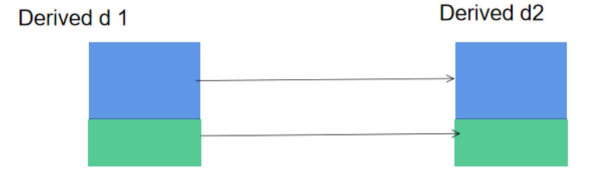

> 对于拷贝构造，如果显式定义了派生类的拷贝构造，却没有在初始化列表中调用基类拷贝构造，那么基类部分不能通过源对象复制初始化，只能尝试调用 `Base` 的无参构造。如果 `Base` 没有无参构造，编译器就会报错。
>
> 对于赋值运算符函数，如果显式定义了派生类的赋值运算符函数，却没有在其中调用基类赋值运算符函数，那么基类部分不会完成赋值。

如下，`Derived` 对象没有指针成员申请堆空间，不需要显式定义拷贝构造函数和赋值运算符函数。编译器会自动完成基类部分的复制工作。

但是如果在 `Derived` 类中显式写出了复制控制函数，就需要显式调用基类的复制控制函数。

```cpp
class Base
{
public:
    Base(long base)
    : m_base(base)
    {}

protected:
    long m_base = 10;
};

class Derived
: public Base
{
public:
    Derived(long base, long derived)
    : Base(base)
    , m_derived(derived)
    {}

    Derived(const Derived & rhs)
    : Base(rhs) // 调用 Base 的拷贝构造
    , m_derived(rhs.m_derived)
    {
        cout << "Derived(const Derived & rhs)" << endl;
    }

    Derived & operator=(const Derived & rhs)
    {
        // 调用 Base 的赋值运算符函数
        Base::operator=(rhs);
        m_derived = rhs.m_derived;
        cout << "Derived& operator=(const Derived &)" << endl;
        return *this;
    }

private:
    long m_derived = 12;
};
```

如果 `Derived` 类的数据成员申请了堆空间，那么必须手动写出 `Derived` 类的复制控制函数，此时也要考虑基类复制控制函数的显式调用。

如果只是 `Base` 类的数据成员申请了堆空间，那么 `Base` 类必须显式定义复制控制函数；`Derived` 类自身的数据成员如果没有申请堆空间，则不一定需要显式定义复制控制函数。

练习：`Base` 类的数据成员为 `char *` 类型时，尝试分析派生类对象的复制过程。

如果派生类中没有指针数据成员，不需要显式写出复制控制函数。编译器会自动完成基类部分的复制控制。

### 派生类的拷贝构造函数

如果给 `Derived` 类添加一个 `char *` 成员，却依然不显式定义 `Derived` 的复制控制函数，那么进行派生类对象复制时，基类部分会完成正确复制，派生类新增的指针成员只能完成浅拷贝，最终对象销毁时可能导致 `double free` 问题。

```cpp
Derived d1("hello", "world");
Derived d2 = d1;
```

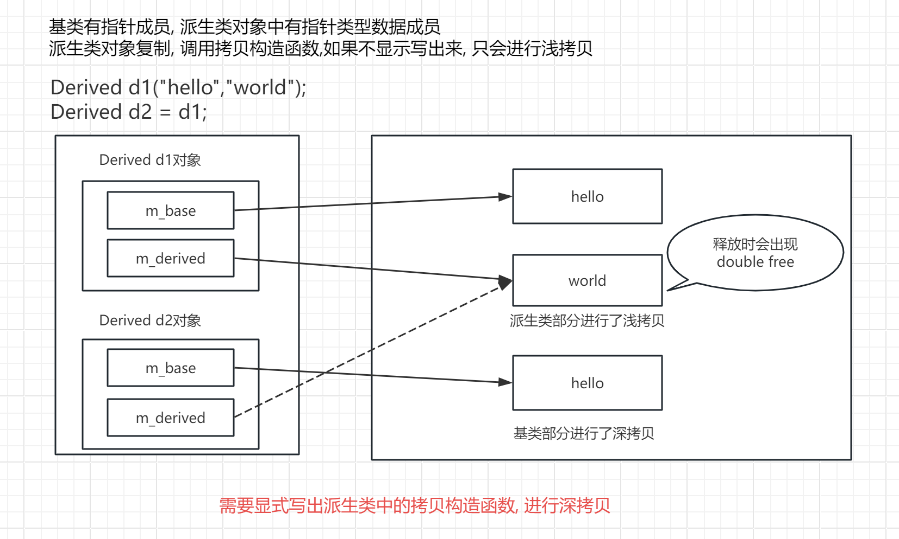

如果接下来给 `Derived` 类显式定义拷贝构造，但没有在这个拷贝构造中显式调用基类拷贝构造，也就是没有在初始化列表中创建基类子对象，那么会直接报错。

原因是：派生类构造函数的初始化列表没有显式调用基类构造函数时，编译器会尝试调用基类的无参构造。如果基类没有无参构造，就无法完成基类子对象初始化。

所以，需要在 `Derived` 的拷贝构造函数中显式调用 `Base` 的拷贝构造。

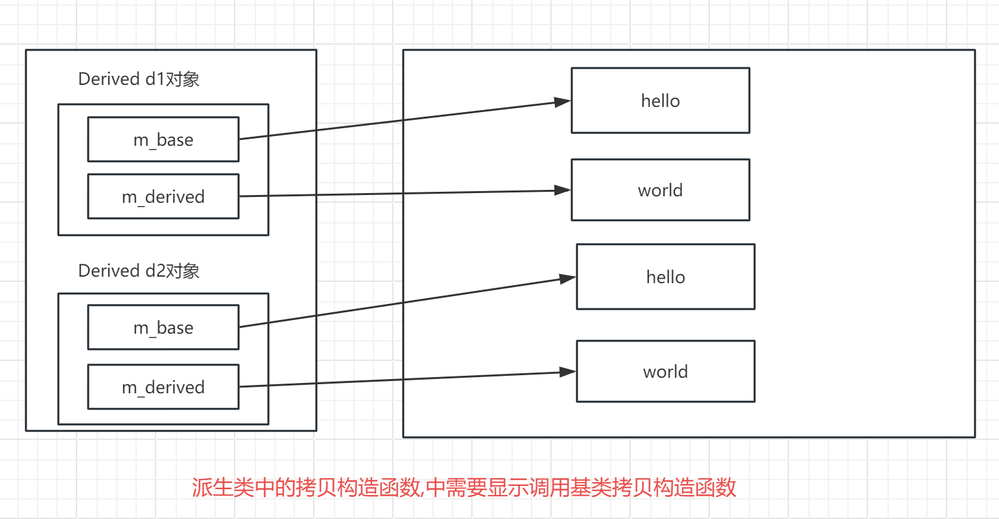

```cpp
    Derived(const Derived & rhs)
    : Base(rhs) // 显式调用 Base 的拷贝构造
    , m_derived(new char[strlen(rhs.m_derived) + 1]{})
    {
        cout << "Derived(const Derived & rhs)" << endl;
        // 深拷贝
        strcpy(m_derived, rhs.m_derived);
    }

```

### 派生类的赋值运算符函数

如果接下来给 `Derived` 显式定义赋值运算符函数，但是没有在其中显式调用基类的赋值运算符函数：

````cpp
Derived d1("hello", "world");
Derived d2("abc", "def");
d2 = d1; // 派生类新增部分完成了复制，但是基类部分没有完成复制
````

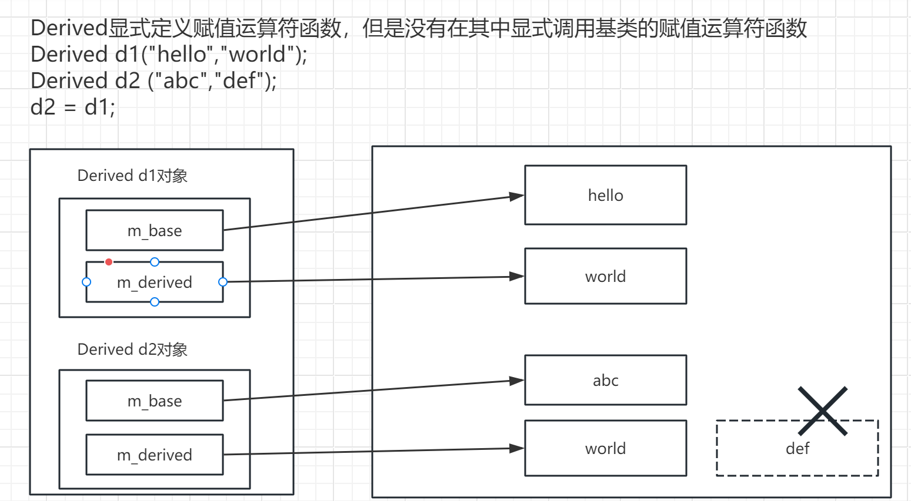

基类部分不会自动完成复制，需要在 `Derived` 的赋值运算符函数中显式调用 `Base` 的赋值运算符函数，才能完成正确复制。

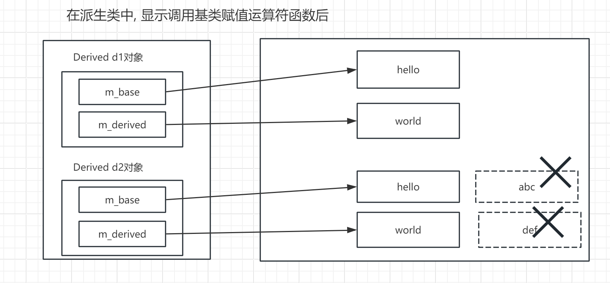

> [!IMPORTANT]
> 只要给 `Derived` 类手动定义复制控制函数，就要同时处理两件事：显式调用相应的基类复制控制函数；正确复制派生类新增成员。新增成员如果管理堆资源，必须做深拷贝。

```cpp
Derived(const Derived & rhs)
    : Base(rhs) // 显式调用基类的拷贝构造
    , m_derived(new char[strlen(rhs.m_derived) + 1]())
    {
        strcpy(m_derived, rhs.m_derived);
        cout << "Derived(const Derived &)" << endl;
    }

Derived & operator=(const Derived & rhs)
{
    cout << "Derived & operator=(const Derived &)" << endl;
    if(this != &rhs)
    {
        // 显式调用基类的赋值运算符函数
        Base::operator=(rhs);
        delete [] m_derived;
        m_derived = new char[strlen(rhs.m_derived) + 1]();
        strcpy(m_derived, rhs.m_derived);
    }
    return *this;
}
```
