# 第八章 多态

## 多态的基本概念

多态（polymorphism）是面向对象的重要特征之一。它强调的是：同一个接口、同一种调用方式，作用在不同对象上时，可以产生不同的行为。

简单理解，多态就是“一个接口，多种实现”。例如同样是“鸣笛”这个行为，不同车辆可以有不同声音；同样是“计算面积”，矩形、圆形、三角形可以各自给出不同算法。

### 为什么需要多态

多态的价值主要体现在以下几个方面：

- **复用**：用基类接口处理不同派生类对象，避免为每种类型单独写一套调用逻辑。
- **扩展**：增加新的派生类时，调用方可以继续使用原有基类接口，减少对既有代码的修改。
- **统一接口**：基类负责规定接口，派生类负责实现细节。
- **解耦**：调用方依赖抽象接口，不直接依赖具体类型，代码更容易维护。

> [!NOTE]
> C++ 支持两类多态：编译时多态和运行时多态。

1. **编译时多态**：也称为静态多态，例如函数重载、运算符重载。编译器在编译阶段就能根据函数名、参数列表等信息确定调用目标，也称为静态联编。
2. **运行时多态**：也称为动态多态。编译阶段无法完全确定调用目标，需要在程序运行时根据对象的实际类型决定调用哪个函数，也称为动态联编。C++ 通过虚函数实现运行时多态。

后文如果没有特别说明，“多态”主要指运行时多态。

## 虚函数

在成员函数前加上 `virtual` 关键字，该成员函数就成为虚函数。

先看一个例子：基类和派生类中都定义了同名的 `display` 函数。

```cpp
class Base
{
public:
    Base()
    {
        cout << "Base()" << endl;
    }

    Base(long num)
    : m_base(num)
    {
        cout << "Base arg constructor" << endl;
    }
    ~Base()
    {
        cout << "Base destructor" << endl;
    }

    void display() const
    {
        cout << "Base::display()" << endl;
    }

private:
    long m_base;
};

class Derived
: public Base
{
public:
    Derived(long base, long derived)
    : Base(base)
    , m_derived(derived)
    {
        cout << "Derived constructor" << endl;
    }

    ~Derived()
    {
        cout << "Derived destructor" << endl;
    }

    void display() const
    {
        cout << "Derived::display()" << endl;
    }

private:
    long m_derived;
};

// 参数为基类指针
void print(Base * pBase)
{
    // 基类指针可以指向基类对象，也可以指向派生类对象
    pBase->display();
}

void test0()
{
    Base base(10);
    Derived dd(1, 2);

    print(&base);
    cout << endl;

    // 用基类指针指向派生类对象
    print(&dd);

    cout << "sizeof(Base): " << sizeof(Base) << endl;
    cout << "sizeof(Derived): " << sizeof(Derived) << endl;
}
```

未使用 `virtual` 时的结果：

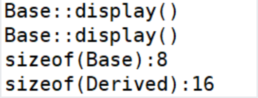

给 `Base::display` 加上 `virtual` 后：

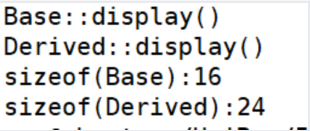

> 从运行结果可以看到，加入 `virtual` 后，用基类指针指向派生类对象，再通过基类指针调用 `display`，实际调用到了派生类版本。
>
> 同时，基类和派生类对象所占空间的大小也发生了变化，说明对象的内存结构发生了改变。

内存结构如下所示：

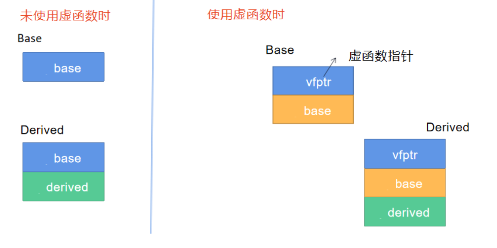

### 虚函数的实现原理

#### 虚函数指针

当 `Base::display` 加上 `virtual` 后，`Base` 对象的存储布局会发生变化。对象中通常会多出一个虚函数指针（vfptr），这个指针指向一张虚函数表（vtable），虚函数表中保存虚函数的入口地址。

`Derived` 继承 `Base` 后，创建 `Derived` 对象时仍然会先形成一个 `Base` 类型的基类子对象。如果 `Derived` 中还没有重新定义 `display`，虚表中记录的仍然是 `Base::display` 的地址。

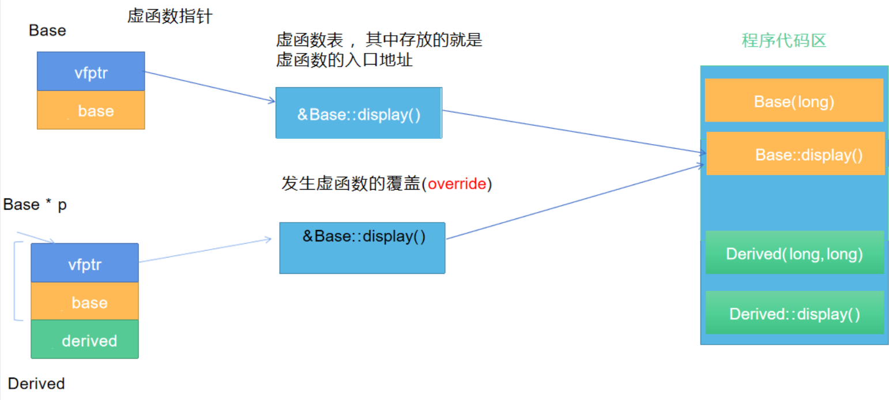

当 `Derived` 类中重新定义 `display`，就发生了虚函数覆盖（override）。这里所谓“覆盖”，不是把基类函数本身删掉，而是让派生类对象对应虚表中的入口地址指向 `Derived::display`。

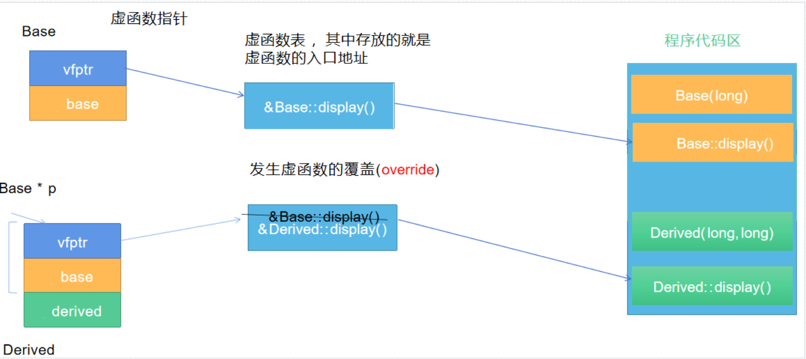

`Base * p` 指向 `Derived` 对象时，静态类型仍然是 `Base *`，所以只能访问基类接口。但当它调用虚函数 `display` 时，会通过对象中的 `vfptr` 找到虚表。此时虚表中保存的是 `Derived::display` 的入口地址，因此最终调用派生类版本。

#### 虚函数的覆盖override

如果基类的成员函数被定义为虚函数，那么它在派生类中仍然保持虚函数属性，即使派生类中省略 `virtual` 关键字也一样。

派生类覆盖基类虚函数时，需要满足以下要求：

- 与基类的虚函数有相同的函数名；
- 与基类的虚函数有相同的参数个数；
- 与基类的虚函数有相同的参数类型；
- 与基类的虚函数有相同的返回类型。协变返回类型是少数例外，这里先按常见情况理解。

也就是说，派生类函数的声明形式要与基类虚函数保持一致。

派生类覆盖虚函数时，很容易把函数名、返回类型或参数列表写错，导致实际没有完成覆盖。为了让编译器帮助检查，C++11 提供了 `override` 关键字。

`override` 的作用是：告诉编译器这个函数必须覆盖基类中的某个虚函数。如果没有成功覆盖，编译器会直接报错。

`override` 写在函数参数列表之后、函数体之前。

```cpp
class Base
{
public:
    virtual void display() const
    {
        cout << "Base::display()" << endl;
    }

private:
    long m_base;
};

class Derived
: public Base
{
public:
    // 如果写成 dispaly，且不加 override，可能不会马上发现错误
    // void dispaly() const { }
    // void dispaly() const override { } // 编译器会报错
    void display() const override
    {
        cout << "Derived::display()" << endl;
    }

private:
    long m_derived;
};
```

覆盖总结：

1. 覆盖是虚函数之间的概念，派生类函数的函数名、参数列表、`const` 限定等必须与基类虚函数匹配；
2. 基类函数是虚函数后，派生类中的覆盖版本即使不写 `virtual`，仍然是虚函数；
3. 覆盖发生在基类与派生类之间，覆盖的是虚表中的入口地址，不是删除或替换基类函数本身。

#### 动态多态被激活的条件

动态多态的触发条件比较严格，通常需要同时满足以下要求：

1. 基类定义虚函数；
2. 派生类覆盖该虚函数；
3. 创建派生类对象；
4. 基类指针指向派生类对象，或基类引用绑定派生类对象；
5. 通过基类指针或基类引用调用虚函数。

最终效果是：基类指针或引用调用到了派生类实现的虚函数。如果没有虚函数机制，基类指针只能调用基类版本。

> [!IMPORTANT]
> 动态多态看的是“对象的实际类型”，但前提是通过基类指针或引用调用虚函数。直接用对象调用时，通常根据对象的静态类型在编译期确定调用目标。

#### 虚函数表

在虚函数机制中，可以从三个角度理解 `virtual`：

1. **存在**：虚函数是真实存在的函数；
2. **间接**：虚函数调用通过虚函数指针和虚函数表间接完成；
3. **共享**：基类指针可以借助虚表调用派生类实现。

如果没有虚函数，通过 `pBase` 指针调用普通成员函数时，编译器会根据指针的静态类型直接确定调用目标；有了虚函数后，调用路径变成了通过 `vfptr` 和虚表间接定位目标函数。

> 对虚函数和虚函数表有了基本认知后，可以思考下面几个常见问题。
>
> **1. 虚表存放在哪里？**
>
> 虚表通常在编译/链接后生成，运行过程中不应该被随意修改，一般放在只读数据区附近。具体位置由编译器和平台实现决定。
>
> **2. 一个类中有几张虚函数表？**
>
> 虚函数表可以理解为存放虚函数入口地址的数组。
>
> 一个类可以没有虚表（没有虚函数时）；也可以有一张虚表（多个虚函数的地址都放在同一张表中）；在多继承等场景下，也可能有多张虚表。
>
> 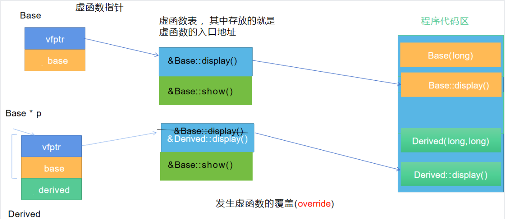
>
>
>
> 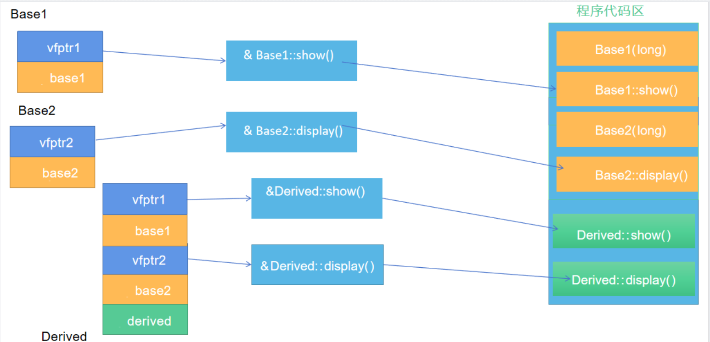
>
>
>
> **3. 虚函数机制的底层实现是怎样的？**
>
> 常见实现是：对象中保存虚函数指针，虚函数指针指向虚函数表，虚函数表中保存虚函数入口地址。调用虚函数时，根据对象实际类型对应的虚表找到最终函数。
>
> **4. 重载、隐藏、覆盖的区别**
>
> 重载（overload）：发生在同一作用域中，函数名相同，形参列表不同。
>
> 隐藏（hide）：发生在基类和派生类之间，派生类中出现同名成员时，会隐藏基类同名成员，即使参数列表不同也会隐藏。
>
> 覆盖（override）：发生在基类和派生类之间，派生类函数覆盖基类虚函数，核心效果是改变虚表中的函数入口地址。

### 虚函数的限制

虚函数机制给C++提供了灵活的用法，但仍然受到了一些约束，以下几种函数不能设为虚函数：

#### 构造函数不能设为虚函数

构造函数的作用是创建对象，完成数据的初始化，而虚函数机制被激活的条件之一就是要先创建对象，有了对象才能表现出动态多态。如果将构造函数设为虚函数，那此时构造未执行完，对象还没创建出来，存在矛盾。

#### 静态成员函数不能设为虚函数

虚函数的典型调用路径是：

```text
this -> vfptr -> vtable -> virtual function
```

静态成员函数没有 `this` 指针，无法通过某个具体对象访问 `vfptr`，因此不能设为虚函数。

#### inline 函数与虚函数

严格来说，虚函数可以在类内写成 `inline` 形式，但当它通过基类指针或引用发生动态绑定时，编译器通常无法按普通内联函数那样在编译期直接替换。也就是说，`inline` 和动态绑定的优化目标存在冲突，最终是否内联由编译器决定。

#### 普通函数不能设为虚函数

虚函数解决的是对象多态问题，必须依赖类对象和 `this` 指针。普通非成员函数不属于某个类对象，因此不能设为虚函数。

### 虚函数的各种访问情况

虚函数机制的触发条件中要求通过基类指针或引用调用虚函数。那么其他调用方式会是什么情况呢？

1. **通过派生类对象直接调用虚函数**

这种调用没有满足动态多态的典型触发条件。对象的静态类型已经明确，编译器可以直接确定调用目标。此时如果 `Derived` 中定义了同名 `display`，它对 `Base` 中的 `display` 形成隐藏。

2. **在构造函数和析构函数中可以访问虚函数**

```cpp
class Grandpa
{
public:
    Grandpa()
    {
        cout << "Grandpa()" << endl;
    }

    ~Grandpa()
    {
        cout << "~Grandpa()" << endl;
    }

    virtual void func1()
    {
        cout << "Grandpa::func1()" << endl;
    }

    virtual void func2()
    {
        cout << "Grandpa::func2()" << endl;
    }
};

class Parent
: public Grandpa
{
public:
    Parent()
    {
        cout << "Parent()" << endl;
        // func1(); // 构造函数中可以调用虚函数
    }

    ~Parent()
    {
        cout << "~Parent()" << endl;
        // func2(); // 析构函数中可以调用虚函数
    }
};

class Son
: public Parent
{
public:
    Son()
    {
        cout << "Son()" << endl;
    }

    ~Son()
    {
        cout << "~Son()" << endl;
    }

    void func1() override
    {
        cout << "Son::func1()" << endl;
    }

    void func2() override
    {
        cout << "Son::func2()" << endl;
    }
};

void test0()
{
    Son ss;
    Grandpa * p = &ss;
    p->func1();
    p->func2();
}
```

用 `Grandpa` 类指针 `p` 指向 `Son` 类对象，再通过 `p` 调用 `func1` / `func2`，结果会调用到 `Son` 类中的版本。

这说明：即使 `Parent` 中没有覆盖 `func1` 和 `func2`，`Son` 中仍然可以继续覆盖从 `Grandpa` 继承来的虚函数。

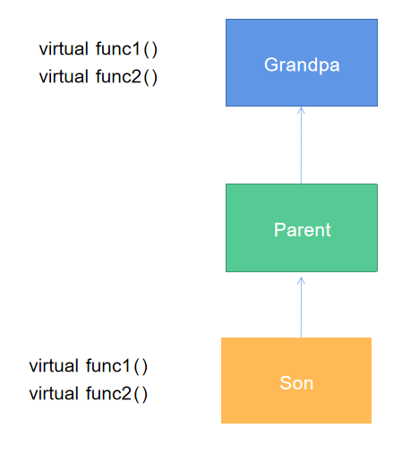

如果在 `Parent` 类的构造函数和析构函数中调用虚函数：

创建一个Son对象

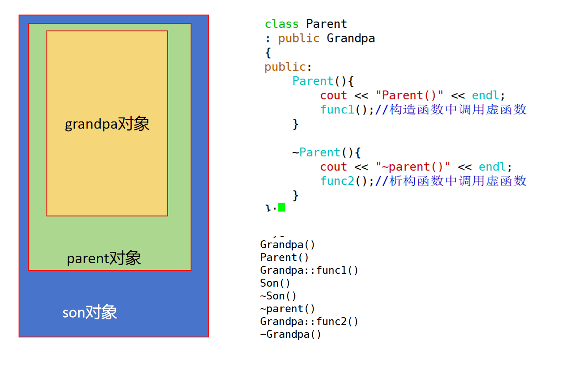

在 `Parent` 构造函数执行时，`Son` 部分还没有构造完成。此时虚函数调用不会分派到 `Son`，只能调用 `Parent` 本层或更上层的版本。

在 `Parent` 析构函数执行时，`Son` 的析构函数已经执行完了，`Son` 部分可以理解为已经失效。因此虚函数调用同样不会分派到 `Son`。

如果 `Parent` 类中也覆盖了 `func1` 和 `func2`，那么在 `Parent` 构造函数或析构函数中调用时，会调用 `Parent` 本层的虚函数。

> [!CAUTION]
> 不推荐在构造函数或析构函数中依赖虚函数实现多态行为。此时虚函数不会按“最终派生类类型”分派，而是解析为当前构造/析构层次中的版本。

C++ 标准规定：在构造函数和析构函数中，通过 `this` 指针隐式或显式调用虚函数时，会被解析为当前构造/析构阶段对应类的版本，而不会分派到更底层的派生类版本。

3. **在普通成员函数中调用虚函数**

```cpp
class Base
{
public:
    Base(long x)
    : m_base(x)
    {}

    virtual void display() const
    {
        cout << "Base::display()" << endl;
    }

    void func1()
    {
        display();
        cout << m_base << endl;
    }

    void func2()
    {
        Base::display();
    }
private:
    long m_base = 10;
};

class Derived
: public Base
{
public:
    Derived(long base, long derived)
    : Base(base)
    , m_derived(derived)
    {}

    void display() const override
    {
        cout << "Derived::display()" << endl;
    }

private:
    long m_derived;
};

void test1()
{
    Base base(10);
    Derived derived(1, 2);

    base.func1();
    base.func2();

    derived.func1();
    derived.func2();
}
```

第 1、2、4 次调用都会调用 `Base::display`。

第 3 次调用比较特殊：

`derived` 对象调用 `func1`，因为 `Derived` 类中没有重新定义自己的 `func1`，所以会调用继承自 `Base` 的 `func1`。

可以理解为：此时 `func1` 内部的 `this` 是 `Base *` 类型，但它实际指向的是 `Derived` 对象。因此在 `func1` 中调用虚函数 `display` 时，会触发动态绑定，最终调用 `Derived::display()`。

> [!NOTE]
> 普通成员函数中调用虚函数时，只要当前对象的实际类型是派生类，并且虚函数被派生类覆盖，就可能触发动态绑定。

### 抽象类

在 C++ 中，抽象类（abstract class）是指不能直接实例化的类。最常见的形成方式是类中含有至少一个纯虚函数。

常见情况有两种：

1. 类中声明了一个或多个纯虚函数；
2. 派生类继承了纯虚函数，但没有把所有纯虚函数都覆盖实现。

#### 纯虚函数

纯虚函数是一种特殊的虚函数。当基类无法给某个行为提供有意义的默认实现，只想规定接口时，可以把它声明为纯虚函数，把具体实现交给派生类。

```cpp
class 类名 {
public:
    virtual 返回类型 函数名(参数 ...) = 0;
};
```

在基类中声明纯虚函数就是在告诉派生类的设计者 —— 你必须提供一个纯虚函数的实现，但我不知道你会怎样实现它。

多个派生类可以对纯虚函数进行多种不同的实现，但是都需要遵循基类给出的接口（纯虚函数的声明）。

> [!IMPORTANT]
> 声明了纯虚函数的类是抽象类，抽象类不能直接创建对象，但可以定义该类型的指针或引用，用来指向或绑定派生类对象。

第一种情况：含有纯虚函数的类是抽象类。

```cpp
// 抽象类
class AbstractClass
{
public:
    virtual void virtualFunc1() = 0;
    virtual void virtualFunc2() = 0;
    // ......
};
```

第二种情况：未经覆盖直接继承纯虚函数的类也是抽象类。

```cpp
// A 类属于第一种情况，是抽象类，有 2 个纯虚函数
class A
{
public:
    virtual void print() = 0;
    virtual void display() = 0;
};

// B 类继承 A 类，但只覆盖了 print，没有覆盖 display
// 所以 B 类仍然是抽象类
class B
: public A
{
public:
    void print() override
    {
        cout << "B::print()" << endl;
    }
};

class C
: public B
{
public:
    void display() override
    {
        cout << "C::display()" << endl;
    }
};

void test0()
{
    // A 类定义了纯虚函数，是抽象类，无法创建对象
    // A a; // error

    // B b; // error
    C c;
    A * pa2 = &c;
    pa2->print();
    pa2->display();
}
```

在 `A` 类中声明纯虚函数，`A` 类就是抽象类，无法创建对象。

`B` 类覆盖 `A` 类中的部分纯虚函数，但没有全部实现，所以 `B` 仍然是抽象类，无法创建对象。

继续派生出 `C` 类，并完成所有纯虚函数的实现后，`C` 类才可以创建对象。

最顶层的抽象基类虽然不能创建对象，但可以定义该类型的指针或引用，指向已经实现接口的派生类对象，再通过虚函数机制调用派生类实现。

> [!NOTE]
> 纯虚函数也是虚函数。通过抽象基类指针调用派生类实现，本质上仍然是动态多态。

纯虚函数使用案例：实现一个图形库，获取图形名称并计算面积。

```cpp
#define PI 3.14

class Figure
{
public:
    virtual string getName() const = 0;
    virtual double getArea() const = 0;
};

void display(const Figure & figure)
{
    cout << figure.getName()
         << "的面积是: "
         << figure.getArea() << endl;
}

class Rectangle // 矩形
: public Figure
{
public:
    Rectangle(double len, double wid)
    : m_length(len)
    , m_width(wid)
    {}

    string getName() const override
    {
        return "矩形";
    }

    double getArea() const override
    {
        return m_length * m_width;
    }
private:
    double m_length;
    double m_width;
};

class Circle
: public Figure
{
public:
    Circle(double r)
    : m_radius(r)
    {}

    string getName() const override
    {
        return "圆形";
    }

    double getArea() const override
    {
        return PI * m_radius * m_radius;
    }
private:
    double m_radius;
};
```

`Figure` 中只规定接口，具体面积算法交给不同图形类实现。调用方只依赖 `Figure` 引用，就可以统一处理不同派生类对象。

> [!TIP]
> 纯虚函数可以理解为“给后续派生类预留的统一接口”。基类负责规定“必须有什么能力”，派生类负责说明“这个能力具体怎么做”。

### 析构函数设为虚函数（重点）

虽然构造函数不能定义为虚函数，但析构函数可以定义为虚函数。一般来说，只要一个类打算作为多态基类使用，就应该把析构函数设为虚函数。

虚析构函数的作用是：通过基类指针删除派生类对象时，能够正确调用派生类析构函数，再调用基类析构函数，避免派生类资源没有释放。

```cpp
class Base
{
public:
    Base()
    : m_base(new int{10})
    {
        cout << "Base constructor" << endl;
    }

    virtual ~Base()
    {
        if(m_base)
        {
            delete m_base;
            m_base = nullptr;
        }
        cout << "Base destructor" << endl;
    }

    virtual void display()
    {
        cout << "m_base " << *m_base << endl;
    }

private:
    int * m_base;
};

class Derived
: public Base
{
public:
    Derived()
    : m_derived(new int{20})
    {
        cout << "Derived constructor" << endl;
    }

    ~Derived() override
    {
        if(m_derived)
        {
            delete m_derived;
            m_derived = nullptr;
        }
        cout << "Derived destructor" << endl;
    }

    void display() override
    {
        cout << "*m_derived = " << *m_derived << endl;
    }

private:
    int * m_derived;
};

void test0()
{
    Base * pbase = new Derived();
    pbase->display();

    delete pbase;
}
```

如果 `Base` 的析构函数不是虚函数，却执行 `delete pbase`，而 `pbase` 实际指向 `Derived` 对象，这在 C++ 中属于未定义行为。常见现象是只调用 `Base` 析构函数，`Derived` 中申请的资源没有被释放。

将 `Base` 的析构函数设为虚函数后，执行 `delete pbase` 时会先动态绑定到 `Derived::~Derived()`，派生类析构函数执行完后，再自动调用 `Base::~Base()`。这个“派生类析构后自动调用基类析构”的过程是析构函数调用序列的一部分。

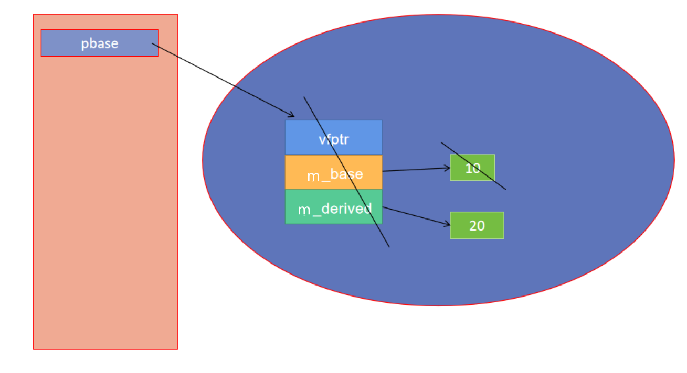

为了让基类指针能够正确触发派生类析构，需要将 `Base` 的析构函数设为虚函数。派生类析构函数会覆盖基类虚析构函数在虚表中的对应入口。

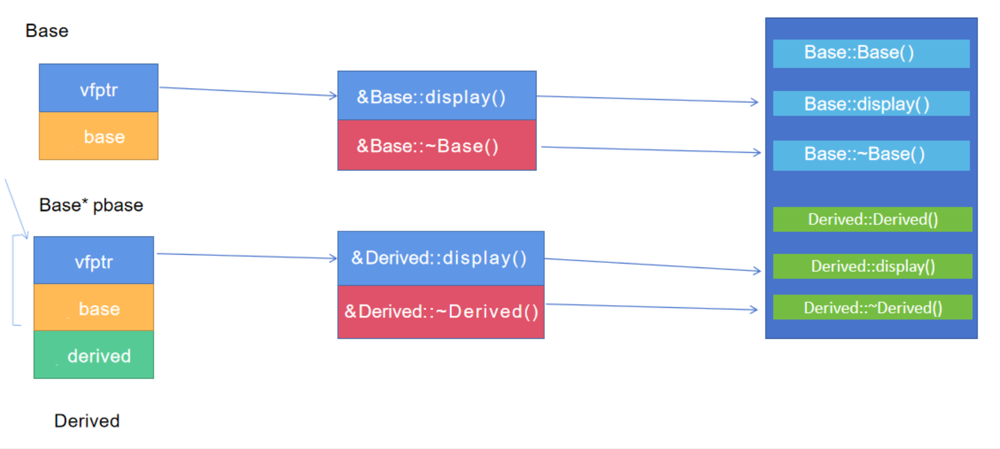

> [!IMPORTANT]
> 只要存在“通过基类指针删除派生类对象”的可能，就必须把基类析构函数设为虚函数。

规范建议：如果一个类定义了虚函数，并且需要作为基类被多态使用，就把析构函数声明为 `virtual`。如果没有特殊清理逻辑，可以写成 `virtual ~Base() = default;`。

### 验证虚表的存在（重点）

前面已经从理论上说明了虚表的存在。下面通过观察对象内存布局的方式，辅助理解虚函数指针和虚表。

> [!CAUTION]
> 下面的做法依赖具体编译器的对象内存布局，只适合理解原理，不是可移植代码，也不应该出现在业务代码中。
>
> ```cpp
> class Base
> {
> public:
>     virtual void print()
>     {
>         cout << "Base::print()" << endl;
>     }
>
>     virtual void display()
>     {
>         cout << "Base::display()" << endl;
>     }
>
>     virtual void show()
>     {
>         cout << "Base::show()" << endl;
>     }
>
> private:
>     long m_base = 10;
> };
>
> class Derived
> : public Base
> {
> public:
>     void print() override
>     {
>         cout << "Derived::print()" << endl;
>     }
>
>     void display() override
>     {
>         cout << "Derived::display()" << endl;
>     }
>
>     void show() override
>     {
>         cout << "Derived::show()" << endl;
>     }
>
> private:
>     long m_derived = 100;
> };
>
> void test1()
> {
>     Derived derived{};
>     long * pDerived = reinterpret_cast<long*>(&derived);
>     cout << pDerived[0] << endl;
>     cout << pDerived[1] << endl;
>     cout << pDerived[2] << endl;
>     cout << "--------" << endl;
>
>     // 将虚函数指针强转为 long 类型指针数组
>     long * pVTable = reinterpret_cast<long*>(pDerived[0]);
>     cout << pVTable[0] << endl;
>     cout << pVTable[1] << endl;
>     cout << pVTable[2] << endl;
>
>     // 强转为void(*)()类型函数指针
>     void (*func1)() = reinterpret_cast<void(*)()>(pVTable[0]);
>     void (*func2)() = reinterpret_cast<void(*)()>(pVTable[1]);
>     void (*func3)() = reinterpret_cast<void(*)()>(pVTable[2]);
>     func1();
>     func2();
>     func3();
>
>     // 或者使用 typedef
>     typedef void (*Function)();
>     Function f = (Function)pVTable[0];
>     f();
>     f = (Function)pVTable[1];
>     f();
>     f = (Function)pVTable[2];
>     f();
> }
> ```

> 创建一个 `Derived` 类对象。这个对象的内存结构可以粗略理解为三部分：起始位置是虚函数指针，后面是 `Base` 子对象中的 `m_base`，再后面是 `Derived` 自己的 `m_derived`。
>
> 第一次强转把 `Derived` 对象视为 `long` 数组，打印其中三个元素。后两个元素本身就是 `long` 数据，第一个元素本质上是地址，只是被当作 `long` 值打印。
>
> 虚函数指针指向虚表，虚表中保存三个虚函数的入口地址。第二次强转把虚表看成 `long` 数组，打印的就是这些函数入口地址的数值形式。
>
> 从观察结果可以辅助理解：虚表中虚函数地址的排列顺序通常与基类中虚函数的声明顺序一致。
>
> 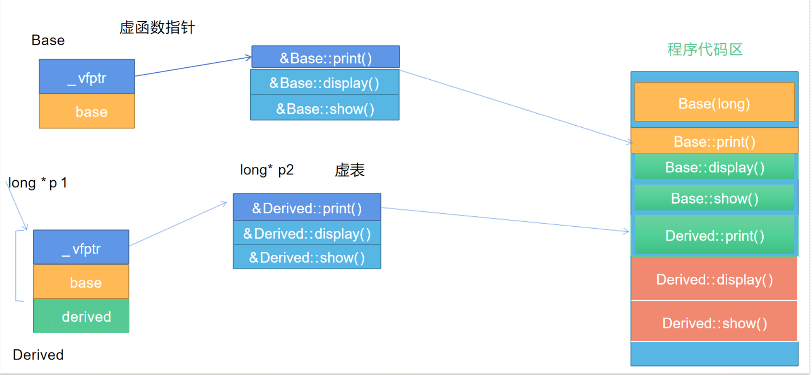
>
> 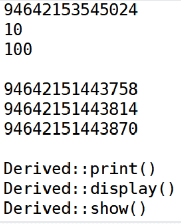

### 带虚函数的多继承

下面的例子中，`Base1`、`Base2`、`Base3` 都拥有虚函数 `f`、`g`、`h`。`Derived` 公有继承这三个类，覆盖虚函数 `f`，并新增一个虚函数 `g1`。四个类各有一个 `double` 数据成员。

```cpp
class Base1
{
public:
    Base1()
    : m_base1(10)
    { cout << "Base1()" << endl; }

    virtual void f()
    {
        cout << "Base1::f()" << endl;
    }

    virtual void g()
    {
        cout << "Base1::g()" << endl;
    }

    virtual void h()
    {
        cout << "Base1::h()" << endl;
    }

    virtual ~Base1() {}
private:
    double m_base1;
};

class Base2
{
    //...
private:
    double m_base2;
};

class Base3
{
public:
    //...
private:
    double m_base3;
};

class Derived
    : public Base1
    , public Base2
    , public Base3
{
public:
    Derived()
    : m_derived(10000)
    { cout << "Derived()" << endl; }

    void f()
    {
        cout << "Derived::f()" << endl;
    }

    virtual void g1()
    {
        cout << "Derived::g1()" << endl;
    }
private:
    double m_derived;
};

int main(void)
{
    cout << sizeof(Derived) << endl;

    Derived d;
    Base1 * pBase1 = &d;
    Base2 * pBase2 = &d;
    Base3 * pBase3 = &d;

    cout << "&Derived = " << &d << endl;
    cout << "pBase1 = " << pBase1 << endl;
    cout << "pBase2 = " << pBase2 << endl;
    cout << "pBase3 = " << pBase3 << endl;

    return 0;
}
```

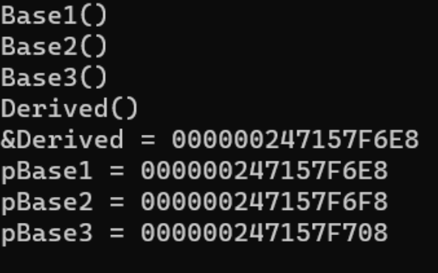

> [!NOTE]
> 三种不同的基类指针指向同一个派生类对象时，实际保存的地址可能不同：它们分别指向派生类对象中对应类型的基类子对象位置。

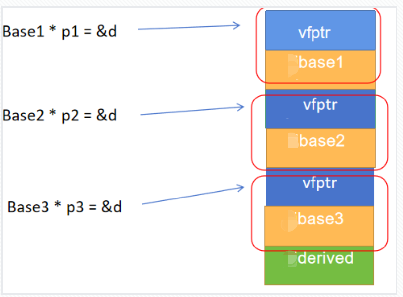

在 VS 中可以继续观察对象布局和虚函数表内容：

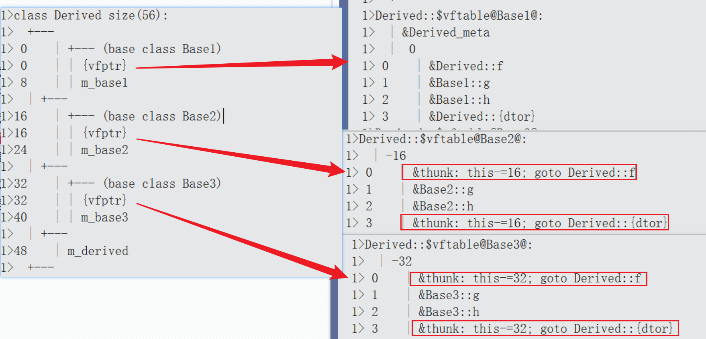

#### 布局规则

通过 VS 平台展示类对象内存布局的功能，可以总结出以下规则：

> 1. 每个有虚函数的基类子对象通常都有自己的虚函数指针，并关联对应的虚表。
>
> 2. 派生类如果新增虚函数，在 VS 的常见布局中会被加入到第一张虚表中。
>
> 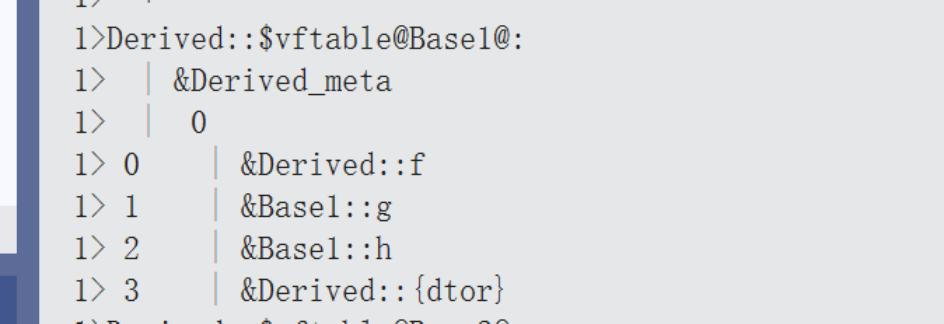
>
> 3. 一般情况下，基类子对象会按照继承声明顺序排列；具体布局仍由编译器实现决定。
>
> 如果继承顺序为 `Base1`、`Base2`、`Base3`，在 `Derived` 对象的内存布局中通常会先是 `Base1` 子对象，然后是 `Base2`、`Base3` 子对象。
>
> 某些编译器会为了虚函数访问效率调整布局，例如把含有虚函数的基类子对象放在更靠前的位置。这属于实现细节。
>
> 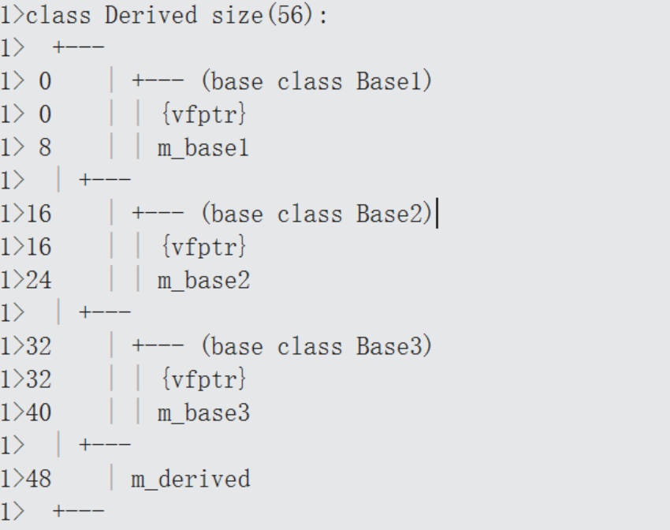
>
> 4. 多继承下派生类覆盖基类虚函数时，不同虚表中可能出现调整 `this` 指针的跳转逻辑，用来保证最终调用到正确的派生类函数。
>
> 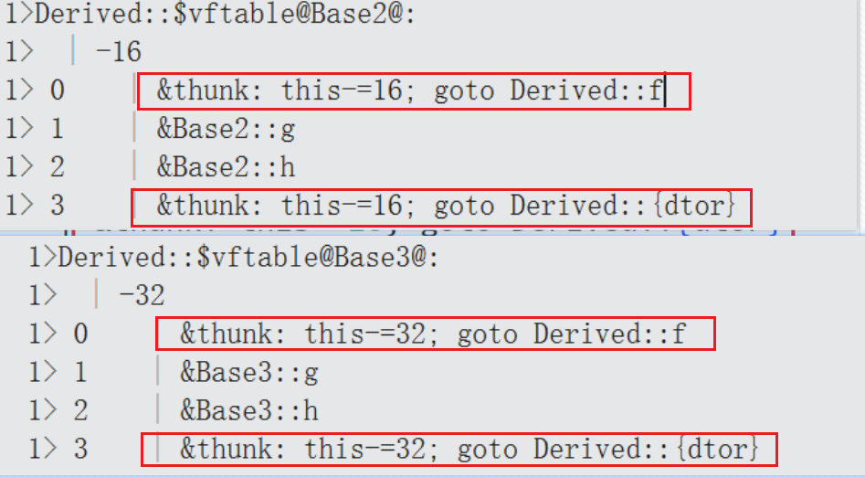

#### 带虚函数的多重继承的二义性

看下面的例子：

```cpp
class A
{
public:
    virtual void a() { cout << "A::a()" << endl; }
    virtual void b() { cout << "A::b()" << endl; }
    virtual void c() { cout << "A::c()" << endl; }
};

class B
{
public:
    virtual void a() { cout << "B::a()" << endl; }
    virtual void b() { cout << "B::b()" << endl; }
    void c() { cout << "B::c()" << endl; }
    void d() { cout << "B::d()" << endl; }
};

class C
: public A
, public B
{
public:
    void a() override { cout << "C::a()" << endl; }
    void c() override { cout << "C::c()" << endl; }
    void d() { cout << "C::d()" << endl; }
};

// 先不看 D 类
class D
: public C
{
public:
    void c() override { cout << "D::c()" << endl; }
};
```

内存结构的示意图：

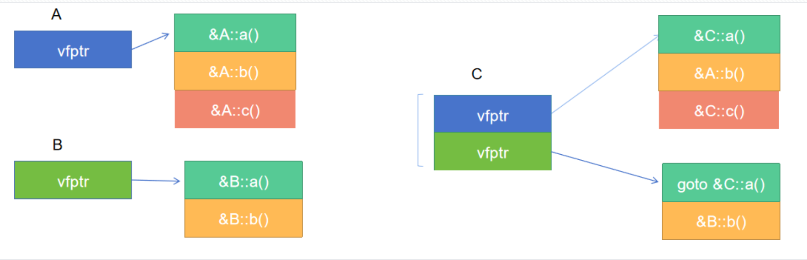

请分析以下各种调用情况的结果：

```cpp
void test0()
{
    C c;
    c.a();
    // c.b(); // error，A::b 和 B::b 发生二义性
    c.c();
    c.d();

    cout << endl;
    A * pa = &c;
    pa->a();
    pa->b();
    pa->c();
    // pa->d(); // error，A 类接口中没有 d

    cout << endl;
    B * pb = &c;
    pb->a();
    pb->b();
    pb->c();
    pb->d();

    cout << endl;
    C * pc = &c;
    pc->a();
    // pc->b(); // error，A::b 和 B::b 发生二义性
    pc->c();
    pc->d();
}
```

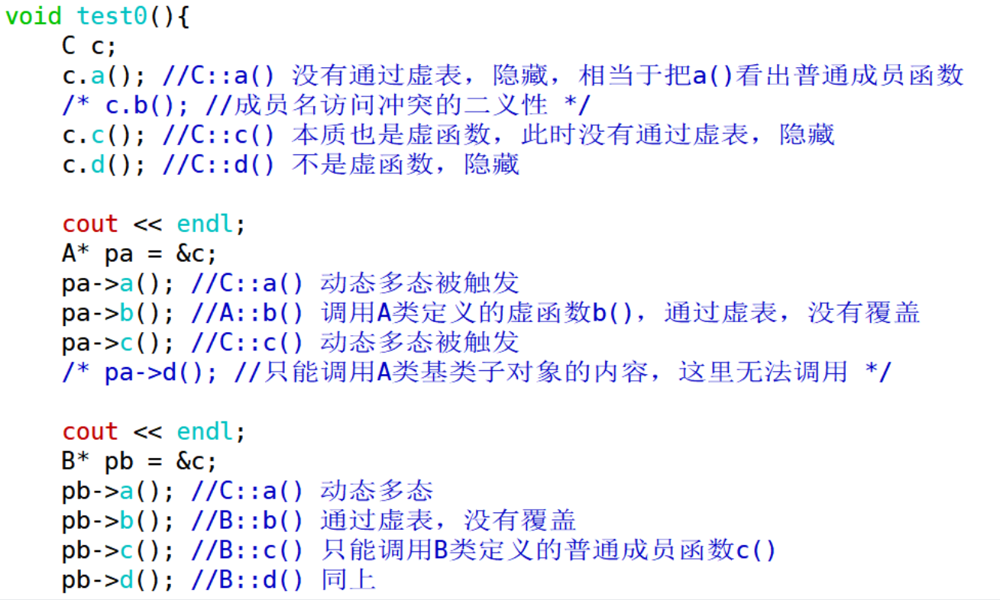

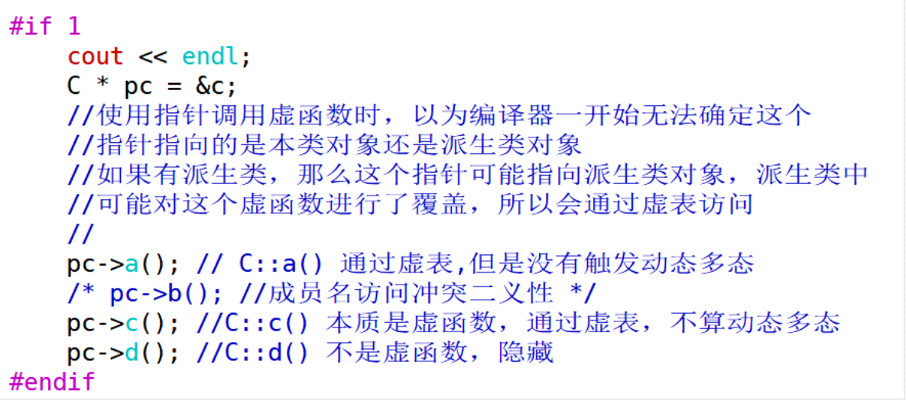

> [!CAUTION]
> `C` 同时继承了 `A::b` 和 `B::b`，但没有在 `C` 中覆盖 `b`，因此通过 `C` 对象或 `C *` 直接调用 `b()` 会发生二义性。可以通过 `c.A::b()`、`c.B::b()` 明确调用路径，或者在 `C` 中重新定义 `b()` 消除二义性。

思考：`pc->c()` 中的 `c` 函数是不是虚函数？

从继承关系看，`A::c()` 是虚函数，`C::c()` 与它签名一致，因此 `C::c()` 覆盖了 `A::c()`。即使 `C::c()` 前面没有再写 `virtual`，它仍然是虚函数。

可以用 `D` 类继续继承 `C` 类并重新定义 `c()` 来验证：用 `C` 类指针指向 `D` 类对象，再调用 `c()`，如果能调用到 `D::c()`，说明 `C::c()` 仍然处在虚函数机制中。

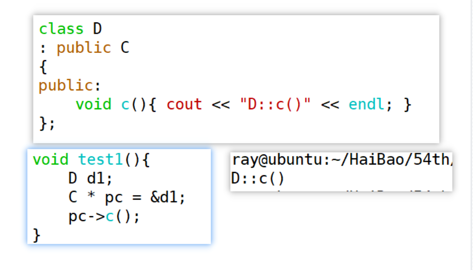

如果去掉 `A::c` 前面的 `virtual`，那么 `C::c` 就只是普通函数，对基类同名函数形成隐藏，不再产生动态绑定。

> 总结：
>
> - 通过对象直接调用函数时，不管函数是否为虚函数，通常都根据对象的静态类型确定调用目标。
> - 基类指针指向派生类对象，并通过基类指针调用虚函数时，如果派生类覆盖了该虚函数，就会触发动态多态，最终调用派生类版本。
> - 如果通过基类指针调用非虚函数，则调用目标由指针或引用的静态类型决定。
> - 派生类指针指向本类对象时，调用虚函数也会经过虚函数机制；如果本类覆盖了虚函数，就调用本类版本，否则调用继承来的基类版本。

## 虚拟继承

### 虚函数 vs 虚拟继承

虚函数和虚拟继承都使用 `virtual` 关键字，但解决的问题完全不同。

在虚函数机制中，可以从三个角度理解：

1. **存在**：虚函数确实存在；
2. **间接**：通过虚函数指针和虚表间接访问；
3. **共享**：基类指针可以借助虚表调用派生类的方法。

虚拟继承同样可以从这三个角度理解：

1. **存在**：虚继承体系和虚基类真实存在；
2. **间接**：访问虚基类成员时，需要通过某种间接机制定位虚基类子对象，常见实现中会借助虚基表；
3. **共享**：虚基类子对象会在继承体系中被共享，避免菱形继承中出现多份顶层基类子对象。

> [!IMPORTANT]
> 虚函数解决“调用哪个函数”的问题；虚拟继承解决“顶层基类子对象是否重复存储”的问题。二者都用 `virtual`，但语义不同。

如果 `B` 类虚拟继承了 `A` 类，那么 `A` 是 `B` 的虚基类。`A` 也可以被其他类以非虚拟方式继承，所以“虚基类”是相对于某条继承关系来说的。

```cpp
class A
{
    void func() {}

    void run()
    {
        cout << "A::run()" << endl;
    }
    void run1()
    {
        cout << "A::run1()" << endl;
    }
    void run2()
    {
        cout << "A::run2()" << endl;
    }
    double a = 10;
};

class B
: virtual public A // B 虚拟继承 A 类
{
    void run()
    {
        cout << "B::run()" << endl;
    }
    void run1()
    {
        cout << "B::run1()" << endl;
    }
    double b = 1;
};

```

补充：

1. 虚拟继承的内存结构：

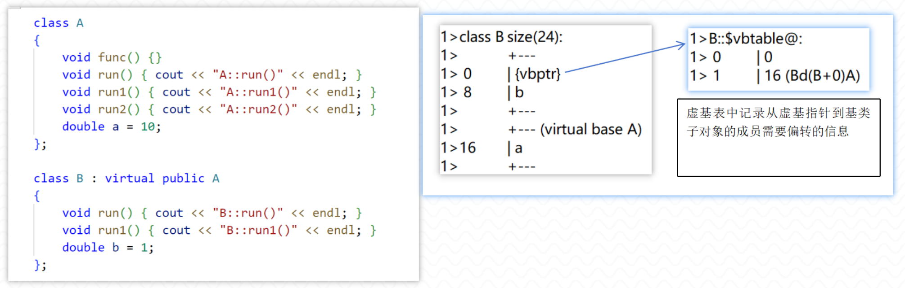

2. 如果虚基类中包含虚函数，将 `A` 中的 3 个 `run` 函数增加 `virtual` 关键字修饰：

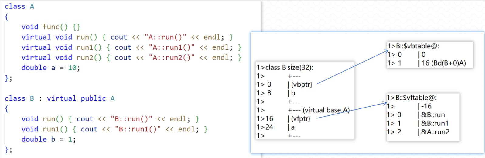

3. 如果派生类中又定义了新的虚函数，在 VS 的实现中，内存中可能多出一个属于派生类的虚函数指针，指向新的虚表。

```cpp
// C 虚拟继承 A
// 派生类 C 中增加一个虚函数 run3()
class A
{
    void func() {}

    virtual void run()
    {
        cout << "A::run()" << endl;
    }
    virtual void run1()
    {
        cout << "A::run1()" << endl;
    }
    virtual void run2()
    {
        cout << "A::run2()" << endl;
    }
    double a = 10;
};

class C
: virtual public A // C 虚拟继承 A 类
{
    void run() override
    {
        cout << "c::run()" << endl;
    }

    void run1() override
    {
        cout << "c::run1()" << endl;
    }

    virtual void run3()
    {
        cout << "c::run3()" << endl;
    }
};
```

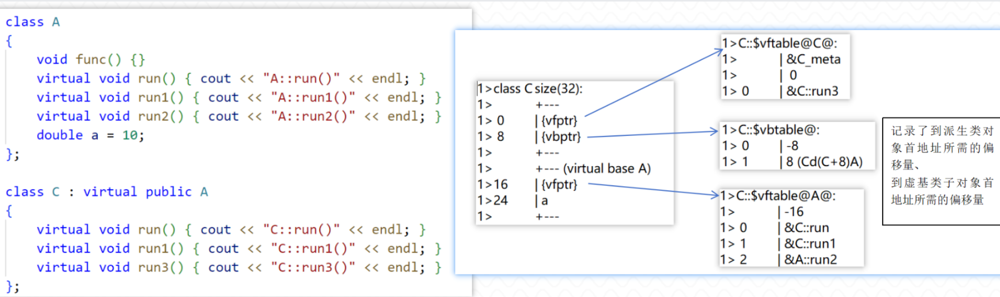

4. 带虚函数的菱形继承：虚拟继承方式（拔高内容，不要求一开始完全掌握）。

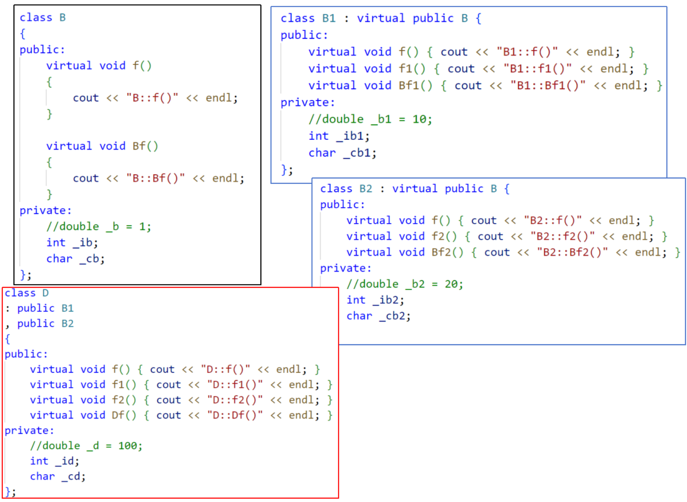

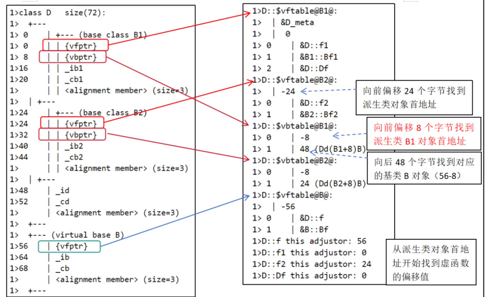

### 虚拟继承时派生类对象的构造和析构

如下菱形继承结构中，中间层基类 `B`、`C` 虚拟继承顶层基类 `A`。注意底层派生类 `D` 的构造函数写法。

```cpp
class A
{
public:
    A(double a)
    : m_a(a)
    {
        cout << "A(double)" << endl;
    }

    ~A()
    {
        cout << "~A()" << endl;
    }

private:
    double m_a = 10;
};

class B
: virtual public A
{
public:
    B(double a, double b)
    : A(a)
    , m_b(b)
    {
        cout << "B(double,double)" << endl;
    }

    ~B()
    {
        cout << "~B()" << endl;
    }

private:
    double m_b;
};

class C
: virtual public A
{
public:
    C(double a, double c)
    : A(a)
    , m_c(c)
    {
        cout << "C(double,double)" << endl;
    }

    ~C()
    {
        cout << "~C()" << endl;
    }

private:
    double m_c;
};

class D
: public B
, public C
{
public:
    D(double a, double b, double c, double d)
    : A(a)
    , B(a, b)
    , C(a, c)
    , m_d(d)
    {
        cout << "D(double * 4)" << endl;
    }

    ~D()
    {
        cout << "~D()" << endl;
    }

private:
    double m_d;
};
```

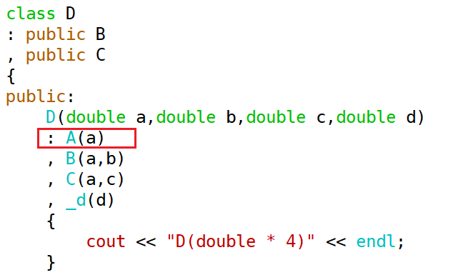

> [!IMPORTANT]
> 在虚拟继承结构中，最底层派生类负责构造虚基类。因此 `D` 不仅要显式调用 `B`、`C` 的构造函数，还要显式调用顶层虚基类 `A` 的构造函数。

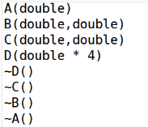

那么 `A` 类构造函数会不会调用 3 次？

不会。创建 `D` 对象时，`A` 这个虚基类子对象只会由最底层派生类 `D` 负责构造一次。`B`、`C` 构造函数初始化列表中对 `A(a)` 的调用，在构造完整 `D` 对象时不会再次构造 `A`。可以对照菱形继承的内存模型理解：`D` 对象中只有一份 `A` 类子对象。

析构顺序也与此对应：`D` 析构函数执行完后，按照继承声明顺序的逆序调用 `C`、`B` 的析构函数，最后再调用虚基类 `A` 的析构函数。`A` 同样只析构一次。

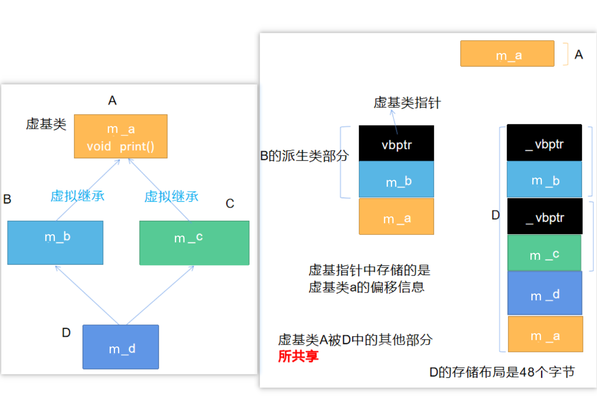
