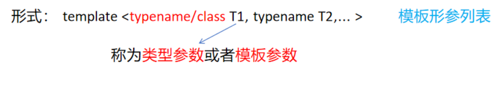
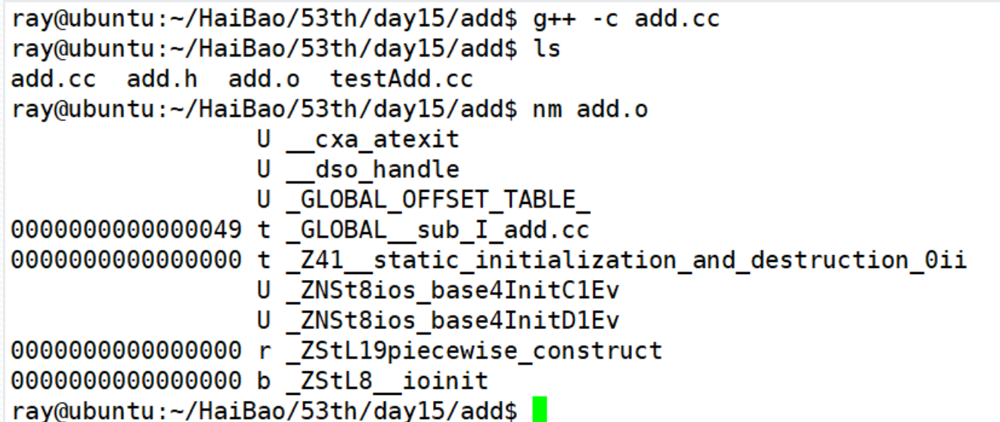
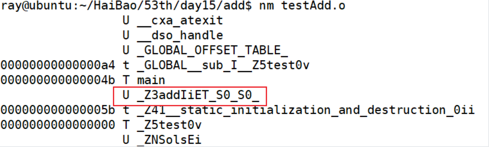
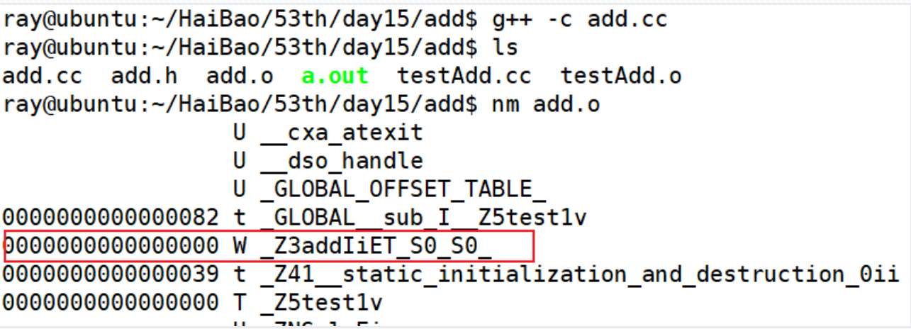
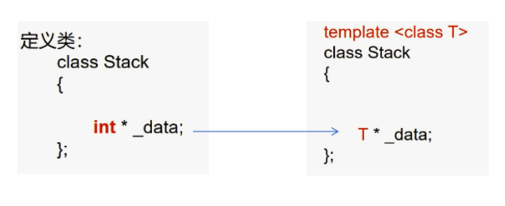
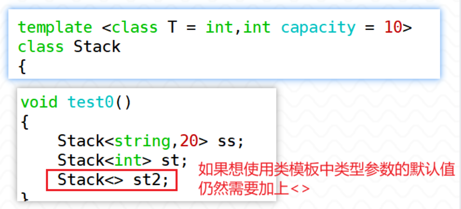

# 第九章 模板

## 模板引入

模板是一种通用代码描述机制。通过模板，可以先用“类型参数”写出函数或类的通用形式，等到使用时再由具体类型替换这些类型参数，例如 `int`、`double` 或自定义类型。

模板带来的编程方式称为泛型编程。它可以减少重复代码，并且模板实例化发生在编译期，类型检查也在编译期完成。

### 引例

如果想实现一个可以处理多种类型参数的加法函数，过去需要写多个重载版本：

```cpp
int add(int x, int y)
{
    return x + y;
}

double add(double x, double y)
{
    return x + y;
}

long add(long x, long y)
{
    return x + y;
}

string add(string x, string y)
{
    return x + y;
}
```

调用时看起来都叫 `add`，但程序员需要为不同类型分别写函数。使用函数模板后，可以把类型也参数化：

```cpp
// 使用 class 或 typename 都可以声明类型参数
template <class T>
T add(T x, T y)
{
    return x + y;
}

int main()
{
    cout << add(1, 2) << endl;
    cout << add(1.2, 3.4) << endl;
    return 0;
}
```

> [!IMPORTANT]
> 模板发生作用的时机是编译期。模板本质上可以理解为“代码生成器”：编译器根据实际使用的类型，从函数模板生成具体的模板函数，从类模板生成具体的模板类。

## 模板的定义

模板可以实现类型参数化，也就是把类型当作参数使用，从而让一套代码适配多种类型。

模板主要分为两类：

1. **函数模板**；
2. **类模板**。

通过模板参数实例化出来的具体函数或具体类，称为模板函数或模板类。

模板的形式如下：



`T1` / `T2` 可以是任何合法的 C++ 类型，如 `int`、`double`、自定义类等。

## 函数模板

基本语法：

```cpp
template <typename T>
T functionName(T param1, T param2)
{
    // 函数体
}
```

`template`：关键字，表明这是一个模板。

`<typename T>`：模板参数列表，`T` 是一个占位符，代表一个类型。

`T` 可以是任何合法的 C++ 类型，如 `int`、`double`、自定义类等。

示例:

```cpp
// 函数模板定义
template <typename T>
T add(T a, T b)
{
    return a + b;
}
```

### 函数模板的实例化

由函数模板生成具体模板函数的过程称为实例化。可以简单理解为：

```text
函数模板 -> 生成对应的模板函数 -> 编译 -> 链接 -> 可执行文件
```

函数模板调用时确定模板参数的方式有两种常见写法：

- **隐式实例化**：调用模板时，编译器根据实参类型自动推导模板参数；
- **显式指定模板实参**：调用时在函数名后写出模板实参，明确告诉编译器使用什么类型。

**隐式实例化**

函数模板生成模板函数时，可以通过传入实参的类型推导出模板参数。

下面代码中实际上可以理解为生成了四个模板函数

```cpp
template <class T>
T add(T t1, T t2)
{
    return t1 + t2;
}

void test0()
{
    short s1 = 1, s2 = 2;
    int i1 = 3, i2 = 4;
    long l1 = 5, l2 = 6;
    double d1 = 1.1, d2 = 2.2;
    // 自动推导
    cout << "add(s1,s2): " << add(s1, s2) << endl;
    cout << "add(i1,i2): " << add(i1, i2) << endl;
    cout << "add(l1,l2): " << add(l1, l2) << endl;
    cout << "add(d1,d2): " << add(d1, d2) << endl;
}
```

**显式指定模板实参**

使用函数模板时，也可以在函数名后的 `<>` 中直接写出模板实参。

```cpp
template <class T>
T add(T t1, T t2)
{
    return t1 + t2;
}

void test0()
{
    int i1 = 3, i2 = 4;
    cout << "add(i1,i2): " << add<int>(i1, i2) << endl;
}
```

### 函数模板的重载

函数模板也可以重载。函数模板重载指的是：在同一个作用域内定义多个同名函数模板，但它们的模板参数列表或函数参数列表不同。

函数模板的重载分为：

1. 函数模板与函数模板重载；
2. 函数模板与普通函数重载。

#### 函数模板与函数模板重载

如果只有下面这个函数模板，传入两个不同类型的参数会出错，因为模板参数 `T` 只能推导成一个确定类型。

```cpp
template <class T>
T add(T t1, T t2)
{
    return t1 + t2;
}

void test0()
{
    short s1 = 1;
    int i2 = 4;
    cout << add(s1, i2) << endl;      // error，T 无法同时推导为 short 和 int
    cout << add<int>(s1, i2) << endl; // ok，显式指定 T 为 int
}
```

显式指定模板参数可以让代码通过，但也可能引入类型转换和精度损失：

```cpp
int i1 = 4;
double d2 = 5.3;
cout << add<int>(i1, d2) << endl; // 可以通过，但 d2 会转换成 int，损失精度
```

> [!CAUTION]
> 不要为了“让代码编译通过”而随意显式指定模板参数。显式指定类型会影响实参转换，可能造成精度损失或语义变化。

如果一个函数模板无法自然处理某类调用，可以再定义另一个函数模板形成重载。

下面这种“只交换模板参数位置”的重载不推荐，因为很容易产生二义性：

```cpp
template <class T1, class T2>
T1 add(T1 t1, T2 t2)
{
    cout << "模板一" << endl;
    return t1 + t2;
}

template <class T1, class T2>
T1 add(T2 t2, T1 t1)
{
    cout << "模板二" << endl;
    return t1 + t2;
}

int a = 10;
double b = 1.2;
cout << add(a, b) << endl;         // error，ambiguous
cout << add<int>(a, b) << endl;    // 模板一
cout << add<double>(a, b) << endl; // 模板二
```

模板参数个数或函数参数个数不同，也可以构成重载，这种情况相对更常见：

>   ```cpp
>   template <class T>
>   T add(T t1, T t2)
>   {
>       return t1 + t2;
>   }
>
>   template <class T1, class T2>
>   T1 add(T1 t1, T2 t2)
>   {
>       return t1 + t2;
>   }
>
>   template <class T1, class T2, class T3>
>   T1 add(T1 t1, T2 t2, T3 t3)
>   {
>       return t1 + t2 + t3;
>   }
>   ```

#### 函数模板与普通函数重载

当普通函数和函数模板都能匹配一次调用时，如果匹配程度相同，编译器通常优先选择普通函数。

```cpp
template <class T1, class T2>
T1 add(T1 t1, T2 t2)
{
    return t1 + t2;
}

short add(short s1, short s2)
{
    cout << "add(short, short)" << endl;
    return s1 + s2;
}

void test1()
{
    short s1 = 1, s2 = 2;
    cout << add(s1, s2) << endl; // 调用普通函数
}
```

如果没有普通函数，就会调用函数模板，实例化出对应的模板函数。`T1` / `T2` 不一定非得是不同类型，只要能推导出来即可。

如果采用 `add<short, short>(s1, s2)` 这种方式显式指定模板实参，就会调用函数模板。

#### 函数模板匹配优先级

匹配优先级可以粗略理解为：

- 匹配程度相同的情况下，普通函数优先于函数模板；
- 多个函数模板都能匹配时，匹配更精确、约束更强的模板优先；
- 如果多个候选函数无法分出优先级，就会产生二义性。

```cpp
template <class T> //模板一
T add(T t1, T t2)
{
    return t1 + t2;
}

template <class T1, class T2>  //模板二
T1 add(T1 t1, T2 t2)
{
    return t1 + t2;
}

double x = 9.1;
int y = 10;
cout << add<int, int>(x, y) << endl; // 模板二（1）
cout << add<int>(x, y) << endl;      // 模板一（2）
cout << add<int>(y, x) << endl;      // 模板二（3）
```

第（1）次调用指定了 2 个模板参数类型，只能匹配模板二。

第（2）次调用只指定了一个模板参数 `int`。模板一可以把 `T` 确定为 `int`，两个函数参数都变成 `int`，所以 `x` 会转换为 `int`。模板二也可能参与匹配，但模板一在这种调用形式下更匹配。

第（3）次调用中，模板二可以让 `T1 = int`、`T2 = double`，两个实参都不需要转换，因此优先匹配模板二。

> [!TIP]
> 多个模板都能匹配时，推导规则会变复杂。实际写代码时应尽量让模板接口清晰，避免让调用点依赖复杂的重载决议。

### 头文件与实现文件形式（重要）

为什么 C++ 标准库头文件大多没有 `.h` 后缀？理解模板的组织方式后，就更容易理解这个问题。

在同一个源文件中，函数模板的声明与定义可以分离。只要编译器在实例化时能看到模板定义即可。

```cpp
// 函数模板的声明
template <class T>
T add(T t1, T t2);

void test1()
{
    int i1 = 1, i2 = 2;
    cout << add(i1, i2) << endl;
}

// 函数模板的实现
template <class T>
T add(T t1, T t2)
{
    return t1 + t2;
}
```

> **如果在不同文件中进行分离**
>
> 如果像普通函数一样拆成头文件、实现文件、测试文件，编译时可能出现未定义错误。
>
> ```cpp
> // add.h
> template <class T>
> T add(T t1, T t2);
>
> // add.cc
> #include "add.h"
> template <class T>
> T add(T t1, T t2)
> {
>     return t1 + t2;
> }
>
> // testAdd.cc
> #include "add.h"
> void test0()
> {
>     int i1 = 1, i2 = 2;
>     cout << add(i1, i2) << endl;
> }
> ```
>

> - 单独编译实现文件，使之生成目标文件，查看目标文件，会发现没有生成与 `add` 名称相关的具体函数。
>
> 

> - 单独编译测试文件，发现有与 `add` 名称相关的符号，但是没有定义地址，这表示当前翻译单元只有声明，没有可实例化的完整定义。
>
> 

看起来和普通函数的情况有些不一样。

从原理上看，函数模板定义好后并不会直接产生具体函数。只有在某个翻译单元中发生调用，并且编译器能看到完整模板定义时，才会实例化出具体模板函数。

> 一种能解释原理但不推荐的做法：在实现文件中主动调用模板，让该翻译单元实例化出具体函数。
>
> ```cpp
> // add.cc
> template <class T>
> T add(T t1, T t2)
> {
>     return t1 + t2;
> }
>
> // 如果在这个文件中只写函数模板定义，没有调用，就不会实例化出模板函数
> void test1()
> {
>     cout << add(1, 2) << endl;
> }
> ```

> 此时单独编译实现文件，发现生成了对应的函数
>
> 

但这种做法不通用：你必须提前知道所有要实例化的类型，而且使用者新增类型时还要回来改实现文件。

更常见的做法是：让调用模板的源文件能看到完整模板定义。

```cpp
// add.h
template <class T>
T add(T t1, T t2)
{
    return t1 + t2;
}
```

也可以把实现放在单独的模板实现文件中，再由头文件包含它：

```cpp
// add.h
template <class T>
T add(T t1, T t2);

#include "add.tcc"
```

> [!IMPORTANT]
> 使用模板时，调用点所在的翻译单元通常必须能看到模板的完整定义。只有声明不够，因为编译器需要根据实际类型实例化代码。

C++ 标准库大量使用模板，因此标准库通常把模板完整实现放在头文件或头文件包含的内部实现文件中。很多实现会使用 `.tcc`、`.ipp` 等扩展名保存模板实现细节。

### 模板的特化

模板特化允许为特定模板参数提供不同于通用模板的实现。当通用模板无法满足某些特殊类型的需求时，可以使用特化。

模板特化主要分为两种类型：

- **全特化（Full Specialization）**：为特定的模板参数提供完全不同的实现。
- **偏特化（Partial Specialization）**：为部分模板参数提供特殊实现，仅适用于类模板，函数模板不支持偏特化。

> [!CAUTION]
> C++ 不支持函数模板偏特化，函数模板只能做全特化。偏特化主要用于类模板。

函数模板全特化语法:

1. `template` 后直接跟 `<>`，里面不写类型；
2. 函数名后跟 `<>`，其中写出要特化的类型。

```cpp
// 通用函数模板
template <typename T1, typename T2>
ReturnType functionName(T1 t1, T2 t2) {
    // 通用实现
}

// 全特化函数模板
template <>
ReturnType functionName<SpecificType1, SpecificType2>(SpecificType1 t1, SpecificType2 t2) {
    // 特化实现
}
```

比如，`add` 函数模板处理 C 风格字符串时会遇到问题。如果直接对两个 `const char *` 做 `+` 运算，会报错。

可以利用特化模板解决：

````cpp
// 通用模板
template <typename T1, typename T2>
T1 add(T1 t1, T2 t2)
{
    return t1 + t2;
}

// 特化模板
template <>
const char * add<const char *>(const char * p1, const char * p2)
{
    char * ptmp = new char[strlen(p1) + strlen(p2) + 1]();
    strcpy(ptmp, p1);
    strcat(ptmp, p2);
    return ptmp;
}

void test0()
{
    // 通用模板无法应对如下调用
    const char * p = add<const char *>("hello", ",world");
    cout << p << endl;
    delete [] p;
}
````

> [!IMPORTANT]
> 使用模板特化时，必须先有基础模板。没有通用模板，就无法定义它的特化版本。

特化版本的函数名、参数列表要和原基础模板匹配，避免出现“看起来像特化，实际不是特化”的问题。

> [!CAUTION]
> 上面的例子为了说明特化而手动 `new[]` 字符串，真实项目中更推荐使用 `std::string`，避免手动管理内存。

### 使用模板的规则（重要）

1. **在一个模块中定义多个通用模板的写法应该谨慎使用；**
2. **调用函数模板时尽量使用隐式调用，让编译器推导出类型；**
3. **无法使用隐式调用的场景只指定必须要指定的类型；**
4. **需要使用特化模板的场景就根据特化模板将类型指定清楚。**

### 模板的参数类型

模板参数主要有两类：

1. **类型参数**：例如 `T`、`T1`、`T2`，代表某种类型；
2. **非类型参数**：代表某个编译期常量值，常见类型包括整型、枚举、指针、引用、`std::nullptr_t` 等。

> [!NOTE]
> 在本阶段可以先重点掌握整型非类型参数，例如 `int`、`size_t`。浮点数作为非类型模板参数是 C++20 之后才逐步支持的内容，基础阶段先按“不使用浮点非类型参数”理解即可。

定义模板时，模板参数列表中除了类型参数，也可以加入非类型参数：

```cpp
template <class T, int kBase>
T multiply(T x, T y)
{
    return x * y * kBase;
}

void test0()
{
    int i1 = 3, i2 = 4;

    // kBase 无法从函数实参中推导出来
    // cout << multiply(i1, i2) << endl; // error

    cout << multiply<int, 10>(i1, i2) << endl; // ok
}
```

可以给非类型参数设置默认值。有默认值后，调用模板时就可以不显式传入这个非类型参数：

```cpp
template <class T, int kBase = 10>
T multiply(T x, T y)
{
    return x * y * kBase;
}

void test0()
{
    int i1 = 3, i2 = 4;
    cout << multiply<int, 10>(i1, i2) << endl;
    cout << multiply<int>(i1, i2) << endl;
    cout << multiply(i1, i2) << endl;
}
```

函数模板的模板参数也可以设置默认值。默认模板参数通常从右往左设置：

```cpp
template <class T = int, int kBase = 10>
T multiply(T x, T y)
{
    return x * y * kBase;
}

void test0()
{
    double d1 = 1.2, d2 = 1.2;
    cout << multiply<int>(d1, d2) << endl; // T 被显式指定为 int
    cout << multiply(d1, d2) << endl;      // T 由实参推导为 double
}
```

第二次调用时，`T` 不会使用默认值 `int`，因为实参已经能把 `T` 推导为 `double`。

我们可以得出结论

```text
显式指定的模板实参 > 由函数实参推导出的类型 > 模板参数默认值
```

什么时候才会用上类型参数的默认值？答案是：既没有显式指定，又无法从函数实参中推导出来时。

```cpp
template <class T1, class T2 = double, int kBase = 10>
T1 multiply(T2 t1, T2 t2)
{
    return t1 * t2 * kBase;
}

// cout << multiply(1.2, 1.2) << endl;         // error，T1 推导不出来
cout << multiply<double>(1.2, 1.2) << endl; // ok
```

如果给 `T1` 也设置默认值，就可以直接调用：

```cpp
template <class T1 = double, class T2 = double, int kBase = 10>
T1 multiply(T2 t1, T2 t2)
{
    return t1 * t2 * kBase;
}

cout << multiply(1.2, 1.2) << endl; // ok
```

> [!IMPORTANT]
> 模板参数默认值只有在“没有显式指定、也无法推导”时才起作用。只要能从函数实参推导出来，编译器优先使用推导结果。

### 成员函数模板

普通类中也可以定义成员函数模板：

````cpp
class Point
{
public:
    Point(double x, double y)
    : m_x(x)
    , m_y(y)
    {}

    // 定义成员函数模板，将 m_x 转换成目标类型
    template <class T>
    T convert()
    {
        return static_cast<T>(m_x);
    }

private:
    double m_x;
    double m_y;
};

void test0()
{
    Point pt(1.1, 2.2);
    cout << pt.convert<int>() << endl;
    // cout << pt.convert() << endl; // error，T 无法推导
}
````

此时不能省略 `<int>`，因为函数参数列表中没有任何信息可以推导 `T`。

可以给成员函数模板的类型参数设置默认值：

```cpp
template <class T = int>
T convert()
{
    return static_cast<T>(m_x);
}

cout << pt.convert() << endl; // ok，T 使用默认值 int
```

在 `Point` 类中定义一个 `add` 成员函数模板：

```cpp
class Point
{
public:
    Point(double x, double y)
    : m_x(x)
    , m_y(y)
    {}

    template <class T>
    T add(T t1)
    {
        return m_x + m_y + t1;
    }

private:
    double m_x;
    double m_y;
};

void test0()
{
    Point pt(1.5, 3.8);
    cout << pt.add(8.8) << endl;
}
```

`add` 中可以访问 `Point` 的数据成员，说明成员函数模板实例化出来后也是成员函数，也有隐含的 `this` 指针。如果定义的是 `static` 成员函数模板，就不能访问非静态数据成员。

> [!CAUTION]
> 成员函数模板不能声明为 `virtual`。函数模板需要在编译期实例化，而虚函数表需要确定可调用的函数入口，二者机制不匹配。

如果要把成员函数模板放到类外实现，需要带上模板声明：

```cpp
class Point
{
public:
    Point(double x, double y)
    : m_x(x)
    , m_y(y)
    {}

    template <class T>
    T add(T t1);

private:
    double m_x;
    double m_y;
};

template <class T>
T Point::add(T t1)
{
    return m_x + m_y + t1;
}
```

## 可变参数模板

可变参数模板（variadic templates）是 C++11 引入的特性，可以表示 0 到任意个、任意类型的模板参数。

关键点：

- 参数数量不固定；
- 参数类型可以不同；
- 常见用途是实现通用转发、日志、格式化、递归处理参数等。

可变参数模板和普通模板的语义类似，只是声明模板参数时需要使用省略号 `...`：

```cpp
template <class ...Args>
void func(Args ...args);

// 普通函数模板做对比
template <class T1, class T2>
void func(T1 t1, T2 t2);
```

`Args` 叫做模板参数包，相当于把 `T1`、`T2`、`T3` 等类型参数打包。`args` 叫做函数参数包，相当于把 `t1`、`t2`、`t3` 等函数参数打包。

> [!NOTE]
> 省略号写在参数包左侧或声明处，通常表示“打包”；写在参数包右侧用于调用展开时，通常表示“解包”。

例如，我们在定义一个函数时，可能有很多个不同类型的参数，不适合一一写出，就可以使用可变参数模板的方法。

利用可变参数模板输出参数包中参数的个数

```cpp
template <class ...Args> // Args 模板参数包
void display(Args ...args) // args 函数参数包
{
    // 输出模板参数包中类型参数个数
    cout << "sizeof...(Args) = " << sizeof...(Args) << endl;
    // 输出函数参数包中参数个数
    cout << "sizeof...(args) = " << sizeof...(args) << endl;
}

void test0()
{
    display();
    display(1, "hello", 3.3, true, 5);
}
```

如果希望打印出传入的不同类型参数，可以通过递归模板展开参数包。

实现思路：

1. 定义递归出口：当没有参数时结束递归；
2. 定义递归模板：处理第一个参数，然后递归处理剩余参数。

```cpp
// 递归出口
void print()
{
    cout << endl;
}

// 至少接收一个参数
template <class T, class ...Args>
void print(T x, Args ...args)
{
    cout << x << " ";
    print(args...); // 省略号在参数包右边，表示解包
}
```

调用过程可以理解为：

```cpp
void test1()
{
    print();
    print(2.3);
    print(1, "hello", 3.6, true);
}
```

> [!CAUTION]
> 如果没有递归出口，可变参数模板解包到最后会尝试调用 `print()`，但模板版本至少需要一个参数，此时会找不到合适的函数。

也可以设置不同的递归出口：

```cpp
void print()
{
    cout << endl;
}

void print(int x)
{
    cout << x << endl;
}

template <class T, class... Args>
void print(T x, Args... args)
{
    cout << x << " ";
    print(args...);
}

print(1, "hello", 3.6, true, 100);
```

当最后只剩一个 `int` 参数时，会调用普通函数 `print(int)`，而不是继续调用函数模板。

## 类模板

类模板用于定义一类通用类。如果类中的数据成员类型、成员函数参数类型或返回值类型不能提前确定，就可以把类定义为模板。

类模板本身不是一个具体类型，只有指定模板实参后，才会实例化出具体类型。例如 `vector<int>` 和 `vector<double>` 是两个不同的具体类型。

### 类模板定义与使用

类模板的定义形式如下：

```cpp
template <class T>
class 类名
{
    // 类定义
};
```

实际上，前面已经多次见到类模板，例如 `vector`、`set`、`map` 都是类模板。

需求：定义一个 `Box` 类型容器，存放不同类型的数据，对比不使用模板和使用模板的区别。

不使用模板

```cpp
// 存放int类型数据
class Box
{
private:
    int m_data;
};
// 存放double类型的数据
class Box2
{
private:
    double m_data;
};
// 存放string类型数据
class Box3
{
private:
    string m_data;
};
// ........
```

使用类模板

```cpp
// 使用模板
template <typename T>
class Box
{
public:
    Box(T data)
    : m_data(data)
    {
        cout << "store data" << endl;
    }

    // 成员函数定义在类内部
    void display()
    {
        cout << "data = " << m_data << endl;
    }

    // 成员函数声明和实现分开，实现在类外部
    void show();

private:
    T m_data;
};

template <typename T>
void Box<T>::show()
{
    cout << "data is = " << m_data << endl;
}

void test1()
{
    Box<int> box{100}; // 存放 int 数据
    box.display();

    Box<double> box2{3.14}; // 存放 double 数据
    box2.display();

    string s = "abc";
    Box<string> box3{s}; // 存放 string 数据
    box3.display();

    box.show();
}
```

类模板的成员函数如果放在类模板定义之外进行实现，需要注意

1. 需要带上 `template` 模板形参列表；如果有默认参数，类外实现处不要再写默认参数；

2. 添加作用域限定时，需要写完整的类名和模板实参列表。

```cpp
template <typename T>
void Box<T>::show()
{
    cout << "data is = " << m_data << endl;
}
```

需求：用类模板实现一个 `Stack` 类，可以存放任意类型的数据，并模拟栈的基本操作。



```cpp
// 类模板：模拟栈
template <typename T, size_t capacity = 10>
class Stack
{
public:
    Stack()
    : m_data(new T[capacity]{})
    , m_top(-1)
    {
        cout << "init stack" << endl;
    }

    ~Stack()
    {
        if(m_data)
        {
            delete [] m_data;
            m_data = nullptr;
        }
    }

    void push(const T & value);
    void pop();
    bool empty() const;
    bool full() const;
    T top() const;

private:
    T * m_data;
    int m_top;
};

// 类外实现成员函数
template <typename T, size_t capacity>
bool Stack<T, capacity>::empty() const
{
    return m_top == -1;
}

template <typename T, size_t capacity>
bool Stack<T, capacity>::full() const
{
    return m_top == capacity - 1;
}

template <typename T, size_t capacity>
void Stack<T, capacity>::push(const T & value)
{
    if(full())
    {
        cout << "stack is full" << endl;
        return;
    }
    else
    {
        m_data[++m_top] = value;
    }
}

// 弹栈
template <typename T, size_t capacity>
void Stack<T, capacity>::pop()
{
    if(empty())
    {
        cout << "stack is empty" << endl;
        return;
    }
    else
    {
        --m_top;
    }
}

// 获取栈顶元素
template <typename T, size_t capacity>
T Stack<T, capacity>::top() const
{
    if(!empty())
    {
        return m_data[m_top];
    }
    else
    {
        throw "stack is empty";
    }
}
```

定义了这样一个类模板后，就可以去创建存放各种类型元素的栈



> [!CAUTION]
> 这个 `Stack` 示例手动管理堆内存，只用于演示类模板。真实代码中还需要考虑拷贝构造、赋值运算符、移动语义等复制控制问题，或者直接使用 `std::vector` / `std::array` 管理底层存储。
