# 第十章 移动语义与资源管理

## 移动语义

为什么需要移动语义？

先回顾之前模拟的 `String` 类：

```cpp
#include <string.h>
#include <iostream>

using std::cout;
using std::endl;

class String
{
public:
    String()
    : m_pstr(new char[1]())
    {
        cout << "String()" << endl;
    }

    String(const char * pstr)
    : m_pstr(new char[strlen(pstr) + 1]())
    {
        cout << "String(const char *)" << endl;
        strcpy(m_pstr, pstr);
    }

    String(const String & rhs)
    : m_pstr(new char[strlen(rhs.m_pstr) + 1]())
    {
        cout << "String(const String &)" << endl;
        strcpy(m_pstr, rhs.m_pstr);
    }

    String & operator=(const String & rhs)
    {
        cout << "String &operator=(const String &)" << endl;
        if(this != &rhs)
        {
            if(m_pstr)
            {
                delete [] m_pstr;
            }
            m_pstr = new char[strlen(rhs.m_pstr) + 1]();
            strcpy(m_pstr, rhs.m_pstr);
        }
        return *this;
    }

    size_t length() const
    {
        size_t len = 0;
        if(m_pstr)
        {
            len = strlen(m_pstr);
        }

        return len;
    }

    const char * c_str() const
    {
        if(m_pstr)
        {
            return m_pstr;
        }
        else
        {
            return nullptr;
        }
    }

    ~String()
    {
        cout << "~String()" << endl;
        if(m_pstr)
        {
            delete [] m_pstr;
            m_pstr = nullptr;
        }
    }

    void print() const
    {
        if(m_pstr)
        {
            cout << "m_pstr = " << m_pstr << endl;
        }
        else
        {
            cout << endl;
        }
    }

private:
    char * m_pstr;
};

void test0()
{
    String s1("hello");
    // 拷贝构造
    String s2 = s1;

    // 先构造临时对象，再拷贝构造 s3
    // 观察这个过程时可加编译选项：-fno-elide-constructors --std=c++11
    String s3 = "hello";
}
```

创建 `s3` 的过程中会先创建一个临时 `String` 对象。这个临时对象会在堆上申请空间并保存字符串内容，然后再把内容拷贝给 `s3`。当前语句结束后，临时对象生命周期结束，它申请的堆空间又被释放。

这意味着：临时对象的资源刚申请出来，马上又被释放。如果能直接把临时对象已经申请好的资源交给 `s3`，就可以少一次堆内存申请和字符串拷贝。这就是移动语义要解决的问题。

> [!NOTE]
> 移动语义允许资源所有权从一个对象转移到另一个对象，避免不必要的深拷贝。它常用于管理堆内存、文件句柄、锁、socket 等资源的类型。

### 左值与右值

左值和右值是针对表达式而言的。

- **左值**：表达式结束后仍然存在、通常有名字、可以继续使用的对象；
- **右值**：临时结果或即将被销毁的对象，通常不能取地址。

一个简单判断方法是：能对表达式取地址的，通常是左值；不能取地址的，通常是右值。

字面值常量，如 `10`、`20`，属于右值，不能取地址。临时对象、匿名对象也通常是右值。

字符串字面值如 `"world"` 比较特殊，它是左值，通常位于只读存储区。

> [!NOTE]
> 右值具体存放在内存还是寄存器中属于编译器实现细节。学习移动语义时，重点关注表达式类别和生命周期即可。

试试看下面这些取址操作和引用绑定操作是否可行：

```cpp
void test1()
{
    int a = 1, b = 2;
    &a;             // ok
    &b;             // ok
    // &(a + b);    // error
    // &10;         // error
    // &String("hello"); // error

    // 非 const 左值引用
    int & r1 = a;
    // int & r2 = 1; // error

    // const 左值引用
    const int & r3 = 1;
    const int & r4 = a;

    String s1("hello");
    String s2("wangdao");
    &s1;          // ok
    &s2;          // ok
    // &(s1 + s2); // error，表达式结果是临时对象
}
```

`int & r1` 是左值引用，`const int & r3` 是 const 左值引用。

- 非 const 左值引用只能绑定左值；
- const 左值引用既可以绑定左值，也可以绑定右值；
- 右值引用用于识别并绑定右值，为移动语义提供基础。

### 右值引用

右值引用是 C++11 引入的特性，使用 `&&` 表示。它可以绑定右值，帮助程序识别“即将被销毁、资源可以被接管”的对象。

```cpp
int a = 10;

int & r1 = a;        // ok，左值引用绑定左值
// int & r2 = 1;     // error，非 const 左值引用不能绑定右值

const int & r3 = 1;  // ok，const 左值引用可以绑定右值
const int & r4 = a;  // ok

int && rRef = 10;    // ok，右值引用绑定右值
// int && rRef2 = a; // error，右值引用不能直接绑定左值
```

> [!IMPORTANT]
> 有名字的右值引用变量本身是左值。例如 `int && rRef = 10;` 中，`rRef` 这个表达式是左值，因为它有名字，可以取地址。
### 移动构造函数

有了右值引用后，实际上再接收临时对象作为参数时就可以分辨出来。

之前 `String str1 = String("hello");` 这类操作只能调用拷贝构造函数。拷贝构造函数的参数是 `const String &`，既能绑定左值，也能绑定右值，但它无法区分资源是否可以被接管。

为了保证左值拷贝安全，拷贝构造通常会重新开辟空间并复制内容。

有了右值引用后，就可以定义移动构造函数，专门接收即将销毁的右值对象，并接管它的资源。

基本语法

```cpp
class MyClass
{
public:
    MyClass(MyClass && other)
    {
        // 接管 other 的资源
    }
};
```

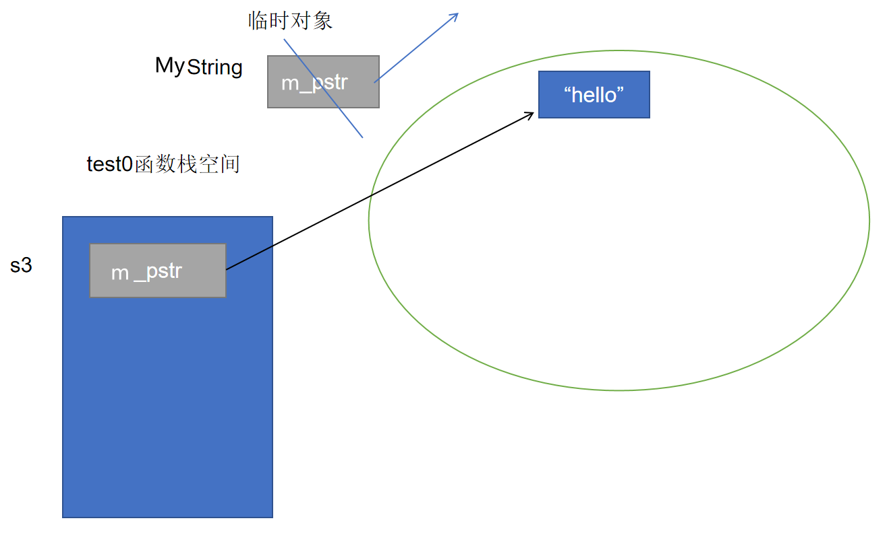

给 `String` 类加上移动构造函数，在初始化列表中接管 `rhs.m_pstr`，使新对象直接复用临时对象的堆空间。随后必须把 `rhs.m_pstr` 置空，避免临时对象析构时释放这块已经移交出去的空间。

```cpp
    String(String && rhs)
    : m_pstr(rhs.m_pstr)
    {
        cout << "String(String&&)" << endl;
        rhs.m_pstr = nullptr;
    }
```

再运行 `String s3 = "hello";`。

观察构造过程时，可以加上编译器选项 `-fno-elide-constructors` 关闭拷贝省略优化。

发现没有再调用拷贝构造函数，而是调用了移动构造函数。

> 对比函数形参的三种写法：
>
> 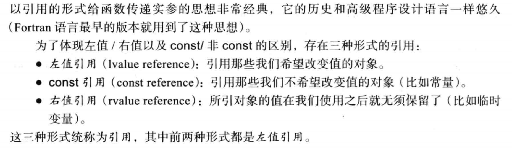
>

移动构造函数的特点：

1. 如果类没有显式定义拷贝构造、拷贝赋值、移动构造、移动赋值、析构函数，编译器可能自动生成移动构造；
2. 如果显式定义了拷贝构造但没有定义移动构造，用右值创建对象时会退回调用拷贝构造；
3. 如果同时定义了拷贝构造和移动构造，用右值创建对象时优先调用移动构造。

> [!IMPORTANT]
> 移动构造不是“复制内容”，而是“接管资源”。移动完成后，源对象必须处于可析构、可赋值的有效状态。

### 移动赋值函数

有了移动构造函数的成功经验，很容易想到原本的赋值运算符函数。

比如，我们进行如下操作时

```cpp
String s3("hello");
s3 = String("wangdao");
```

原本拷贝赋值运算符的做法是重新申请空间并复制内容：

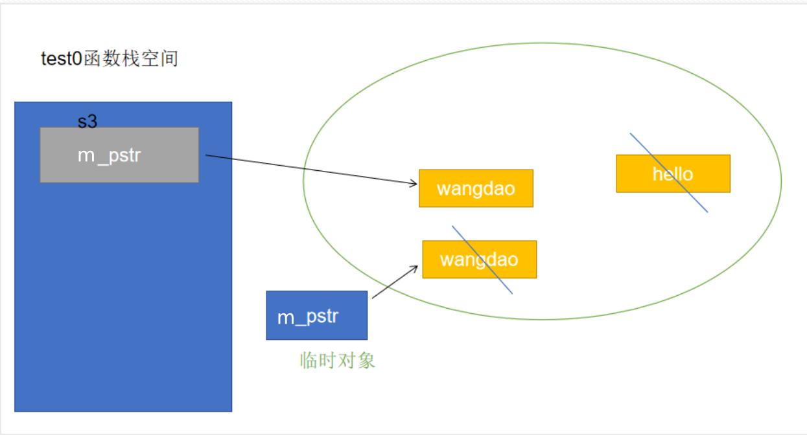

如果希望复用临时对象申请的空间，赋值运算符也需要区分右操作数是左值还是右值。此时可以定义移动赋值运算符函数。

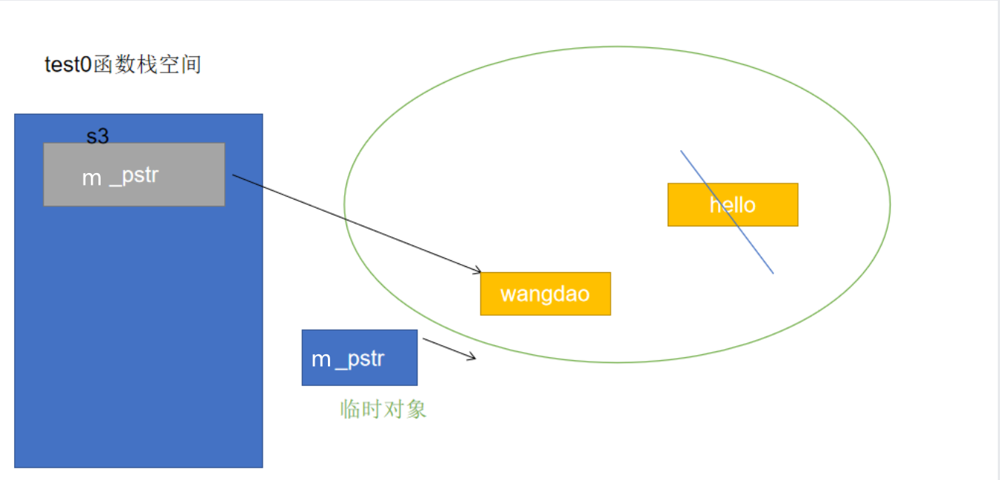

```cpp
String & operator=(String && rhs)
{
    cout << "String& operator=(String&&)" << endl;
    if(this != &rhs)
    {
        delete [] m_pstr;
        m_pstr = rhs.m_pstr;
        rhs.m_pstr = nullptr;
    }
    return *this;
}
```

移动赋值函数的特点：

1. 如果类满足条件，编译器可能自动生成移动赋值函数；
2. 如果显式定义了拷贝赋值但没有定义移动赋值，使用右值赋值时会退回调用拷贝赋值；
3. 如果同时定义了移动赋值和拷贝赋值，右值赋值时优先调用移动赋值。

总结：

- 拷贝构造函数和拷贝赋值运算符具有复制控制语义；
- 移动构造函数和移动赋值运算符具有移动语义，本质是移交资源控制权；
- 当实参是右值且移动函数可用时，移动语义通常优先于复制控制语义。

思考：移动赋值函数中的自赋值判断是否还有必要？

````cpp
String s1("hello");
//右值给左值赋值，肯定不是同一个对象
s1 = String("world");
//创建了两个内容相同的临时对象，也不是同一对象
String("wangdao") = String("wangdao");
````

看起来这些场景中去掉自赋值判断也不会出问题。但 C++11 提供了 `std::move`，可以把左值显式转换成右值引用，因此仍然可能出现“自己移动给自己”的情况。

### std::move 函数

在一些使用移动语义的场景下，有时需要将左值转为右值。

`std::move` 的作用是把一个表达式强制转换为右值引用。它本身不移动任何资源，只是为调用移动构造或移动赋值创造条件。

当一个左值被 `std::move` 转换后，如果后续移动操作接管了它的资源，原对象会进入“有效但状态未指定”的状态。它仍然可以析构，也可以被重新赋值，但不应该再假设它还保留原来的内容。

```cpp
void test()
{
    int a = 1;
    // &(std::move(a)); // error，转换后是右值

    String s1("hello");
    s1.print();

    // 仅调用 std::move 但不使用返回值，不会移动任何资源
    std::move(s1);
    s1.print();

    String s2("abc");
    s2 = std::move(s1);
    // s1 已经被移动，不应再假设它仍然保存 "hello"
    s1.print();
    s2.print();
}
```

如果将移动赋值函数的自赋值判断去除，如下情况依然会调用移动赋值函数，但是s1的pstr所指向的空间被回收，且被设为了空指针，会出错

```cpp
String s1("hello");
s1 = std::move(s1);
s1.print();
```

`std::move()` 的关键作用是告诉编译器：“我不再依赖这个对象原来的资源，你可以把它当作可移动对象处理。”

```cpp
String & operator=(String && rhs)
{
    if(this == &rhs)
    {
        return *this;
    }

    delete [] m_pstr;
    m_pstr = new char[1]();
    rhs.m_pstr = nullptr;
    cout << "String& operator=(String&&)" << endl;
    return *this;
}
```

> [!CAUTION]
> 移动赋值函数中的自赋值判断不应该省略。`s1 = std::move(s1);` 这种写法虽然少见，但合法；没有自赋值保护时可能把自己的资源释放掉。

### 右值引用本身的性质

我们来定义一个返回值是右值引用的函数

```cpp
int gNum = 10;

int && func(){
    return std::move(gNum);
}

void test1(){
    // &func();  //无法取址，说明返回的右值引用本身也是一个右值
    int && ref = func();
    &ref;  //可以取址，此时ref是一个右值引用，其本身是左值
}
```

**右值引用本身是左值还是右值，取决于是否有名字，有名字就是左值，没名字就是右值。**

如果写出下面的代码，`func` 返回的是右值引用，但它引用的是函数内部表达式 `a + b` 产生的临时对象。函数返回后临时对象已经销毁，因此返回值会变成悬空引用，任何访问行为都是未定义行为。

```cpp
int && func(int a, int b)
{
    return a + b;
}

void test1()
{
    // &func(1, 2);  // 无法取址
    int && ref = func(1, 2);
    &ref;
    // cout << ref << endl; // error
}
```

> [!CAUTION]
> 不要返回指向局部对象或临时对象的右值引用。右值引用也会悬空。

### 对拷贝构造调用时机的补充

```cpp
String func2(){
    String str1("wangdao");
    str1.print();
    // 这里返回的是对象而非引用
    return str1;
}

void test2(){
    func2();
    //&func2(); //error,右值
       String && ref = func2(); // 这个ref跟func2中的str1没有关系
    &ref;  //右值引用本身为左值
}
```

这里 `func2` 的调用按以前的理解可能会调用拷贝构造，但实际可能调用移动构造，也可能被编译器直接做返回值优化。

当返回的局部对象生命周期即将结束时，如果不能被直接省略构造，编译器可以优先使用移动构造。

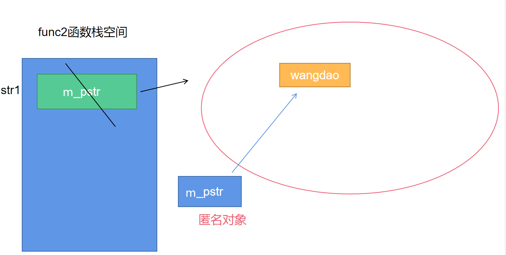

如果返回对象的生命周期大于函数本身，例如返回全局对象，执行 `return` 时不能移动局部资源，通常会调用拷贝构造。

```cpp
String s10("beijing");
String func3(){
    s10.print();
    return s10;
}

void test3(){
    func3();   //调用拷贝构造函数
}
```

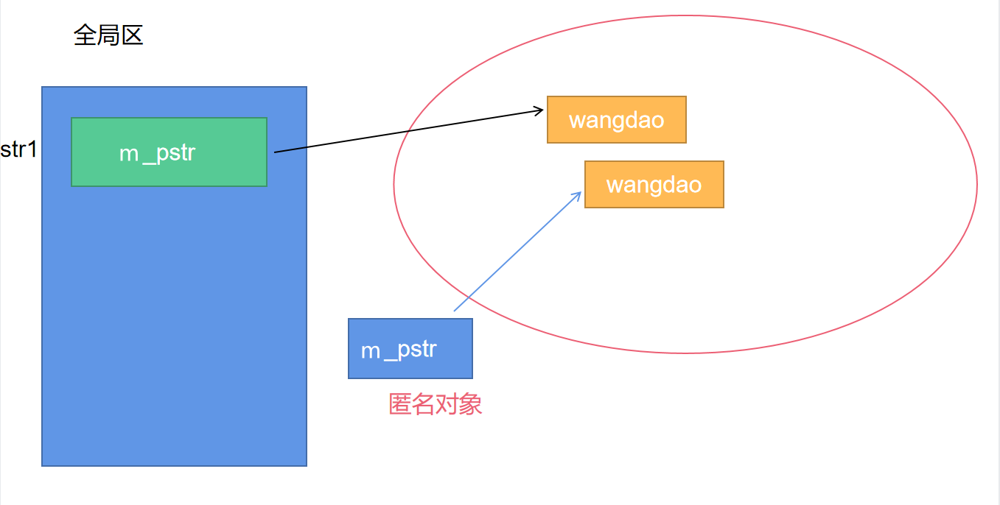

总结：当类中同时定义移动构造函数和拷贝构造函数时，返回对象时调用哪个函数取决于返回表达式的值类别、对象生命周期以及编译器是否进行拷贝省略。

## 资源管理

C 语言进行资源管理时，常常需要手动释放资源。以文件指针为例，如果函数中分支很多，就很容易漏掉某条路径上的 `fclose`。

```C
void UseFile(char const * fn)
{
    FILE * f = fopen(fn, "r"); // 1. 获取资源
    // 2. 使用资源
    if(!g())
    {
        fclose(f);
        return;
    }
    // ...
    if(!h())
    {
        fclose(f);
        return;
    }
    // ...
    fclose(f); // 释放资源
}
```

在 C++ 中，可以利用对象生命周期管理资源。对象创建时接管资源，对象销毁时自动释放资源。

```cpp
class SafeFile
{
public:
    SafeFile(FILE * fp)
    : m_fp(fp)
    {
        cout << "SafeFile(FILE*) " << endl;
    }

    void write(const string & msg)
    {
        fwrite(msg.c_str(), 1, msg.size(), m_fp);
    }

    ~SafeFile()
    {
        cout << "~SafeFile()" << endl;
        if(m_fp)
        {
            fclose(m_fp);
            cout << "fclose(m_fp)" << endl;
        }
    }

private:
    FILE * m_fp;
};

void test0()
{
    string msg = "hello,world";
    SafeFile sf(fopen("wd.txt", "a+"));
    sf.write(msg);
}
```

### RAII 技术

上面的例子已经用到了 RAII 技术。RAII 是 Resource Acquisition Is Initialization 的缩写，意思是“资源获取即初始化”。

它的本质是利用对象生命周期管理资源。构造函数中获取资源，析构函数中释放资源。适用的资源包括内存、文件、文件描述符、锁、socket 等。

#### RAII 类的常见特征

RAII 类通常具备以下特征：

- 构造函数中接管资源；
- 析构函数中释放资源；
- 通常禁止拷贝和赋值，避免多个对象管理同一份资源；
- 提供访问资源的方法。

值语义表示对象可以复制或赋值，例如：

```cpp
int a = 10;
int b = a;
int c = 20;
c = a;
```

对象语义表示对象不允许复制或赋值，常用于资源管理类。常见做法是删除拷贝构造和拷贝赋值：

```cpp
RAII(const RAII &) = delete;
RAII & operator=(const RAII &) = delete;
```

#### RAII 类的模拟

我们可以实现以下的一个类模板，模拟RAII的思想

```cpp
template <class T>
class RAII
{
public:
    RAII(T * data)
    : m_data(data)
    {
        cout << "RAII(T*)" << endl;
    }

    ~RAII()
    {
        cout << "~RAII()" << endl;
        if(m_data)
        {
            delete m_data;
            m_data = nullptr;
        }
    }

    T * operator->()
    {
        return m_data;
    }

    T & operator*()
    {
        return *m_data;
    }

    T * get() const
    {
        return m_data;
    }

    void set(T * data)
    {
        if(m_data)
        {
            delete m_data;
            m_data = nullptr;
        }
        m_data = data;
    }

    RAII(const RAII &) = delete;
    RAII & operator=(const RAII &) = delete;

private:
    T * m_data;
};
```

如下，`raii` 不是指针，而是对象。但是它重载了 `operator->` 和 `operator*`，使用起来接近指针。它负责托管堆上的 `Point` 对象，离开作用域时自动释放。

```cpp
void test0() {
    Point * pt = new Point(1, 2);
    // 智能指针的雏形
    RAII<Point> raii(pt);
    raii->print();
    (*raii).print();
}
```

> [!IMPORTANT]
> RAII 的本质：利用对象生命周期管理资源。局部对象离开作用域时会自动调用析构函数，因此资源释放逻辑可以集中写在析构函数中。

### 智能指针

C++11 提供了几种常用智能指针，位于头文件 `<memory>`，它们都是类模板。

```cpp
// std::auto_ptr   C++98/03，C++17 已移除
// std::unique_ptr C++11
// std::shared_ptr C++11
// std::weak_ptr   C++11
```

#### auto_ptr 的使用

`auto_ptr` 是早期标准库提供的智能指针，使用上存在严重缺陷，C++11 起被弃用，C++17 已移除。这里了解它主要是为了理解为什么后来需要 `unique_ptr`。

auto_ptr是有复制、赋值函数的。

```cpp
void test0()
{
    int * pInt = new int(10);
    // 创建 auto_ptr 对象接管资源
    auto_ptr<int> ap(pInt);
    cout << "*pInt:" << *pInt << endl;
    cout << "*ap:" << *ap << endl;
}
```

尽管会有 warning 提示，代码仍可能通过。`ap` 接管资源后，离开作用域时会自动释放堆内存。

`auto_ptr` 可以进行复制，但复制并不是真正共享或深拷贝，而是转移所有权，因此非常危险。

当ap2复制了ap后，对ap2管理的资源进行访问没有问题，但是对ap解引用会导致段错误。

```cpp
auto_ptr<int> ap2(ap);
cout << "*ap2:" << *ap2 << endl; //ok
cout << "*ap:" << *ap << endl;  //error
// auto_ptr 底层会移交管理权，ap 底层指针已经被置空
```

通过阅读auto_ptr源码的实现，ap的指针被置为了空指针。

```cpp
template <class _Tp>
class auto_ptr {
public:
    //拷贝构造
   auto_ptr(auto_ptr& __a) __STL_NOTHROW
   //ap2的_M_ptr 被赋值为 ap调用release函数的返回值
   : _M_ptr(__a.release())
   {}

    //ap调用release函数
   _Tp* release() __STL_NOTHROW
   {
     //用局部的指针__tmp接管ap的指针所指向的资源
    _Tp* __tmp = _M_ptr;
    _M_ptr = nullptr; //将ap底层的指针设为空指针
    return __tmp;//返回的就是原本ap管理的资源的地址
  }

private:
  _Tp* _M_ptr;
};
```

也就是说，`auto_ptr<int> ap2(ap);` 表面上是拷贝，底层却把 `ap` 托管资源的控制权交给了 `ap2`，并把 `ap` 置空。这种“拷贝后原对象失效”的行为很容易出错，所以 `auto_ptr` 被弃用。

#### unique_ptr 的使用（重要）

`unique_ptr` 对 `auto_ptr` 的问题进行了改进。

**特点1：不允许复制或赋值**

具备对象语义。

**特点2：独享所有权**

```cpp
void test0()
{
    unique_ptr<int> up(new int(10));
    cout << "*up:" << *up << endl;
    // get() 返回被管理对象的裸指针
    cout << "up.get(): " << up.get() << endl;

    cout << endl;
    // unique_ptr 独享所有权，拷贝构造被删除
    // unique_ptr<int> up2 = up; // error

    // 拷贝赋值也被删除
    unique_ptr<int> up3(new int(20));
    // up3 = up; // error
}
```

将auto_ptr的缺陷摒弃了，具有对象语义，语法层面不允许复制、赋值。

**特点3：作为容器元素**

要利用**移动语义**的特点，可以直接传递右值属性的unique_ptr作为容器的元素。如果传入左值形态的unique_ptr，会进行复制操作，而unique_ptr是不能复制的。

构建右值的方式有：

1. 使用 `std::move`；

2. 直接创建临时 `unique_ptr` 对象。

```cpp
vector<unique_ptr<Point>> vec;
unique_ptr<Point> up4(new Point(10, 20));
// up4 是左值，不能直接拷贝进容器
// vec.push_back(up4); // error

vec.push_back(std::move(up4)); // ok，移动所有权
vec.push_back(unique_ptr<Point>(new Point(1, 3))); // ok，传入临时对象
```

> 说明：根据我们对vector的了解，vector的元素一定在堆上，而up4是在栈上的智能指针对象，这里是发生了复制吗？
>
> 这里不是复制，`unique_ptr` 的拷贝构造已经被删除。`std::move(up4)` 表示把 `up4` 管理的 `Point` 对象所有权移交给 `vector` 中的元素。
>
> ```cpp
> // up4->print(); // error，up4 已经不再拥有资源
> vec[0]->print(); //ok
> ```
>

```cpp
// 将 unique_ptr 作为容器元素时，只能传入右值
std::vector<unique_ptr<int>> vec;
unique_ptr<int> up{new int{10}};
// vec.push_back(up); // error，不能拷贝 unique_ptr

vec.push_back(unique_ptr<int>{new int{100}});
vec.push_back(std::move(up));

cout << &up << endl;     // up 变量本身的地址
cout << &vec[1] << endl; // vector 内部 unique_ptr 元素的地址
```

#### shared_ptr 的使用（重要）

智能指针独享资源的控制权固然是一种需求，但有些场景下也需要允许共享控制权。

`shared_ptr` 是共享所有权的智能指针，可以复制或赋值。复制或赋值时，并不会拷贝被管理对象本身，而是让多个 `shared_ptr` 共同管理同一对象，并增加引用计数。

**特征1：共享所有权的智能指针**

可以使用**引用计数**记录对象的个数。

**特征2：可以进行复制或者赋值**

表明具备值语义。

**特征3：也可以作为容器的元素**

作为容器元素的时候，即可以传递左值，也可以传递右值。（区别于unique_ptr只能传右值）

**特征4：也具备移动语义**

表明也有移动构造函数与移动赋值函数。

```cpp
shared_ptr<int> sp(new int(10));
cout << "sp.use_count(): " << sp.use_count() << endl;

cout << endl;
cout << "执行复制操作" << endl;
shared_ptr<int> sp2 = sp;
cout << "sp.use_count(): " << sp.use_count() << endl;
cout << "sp2.use_count(): " << sp2.use_count() << endl;

cout << endl;
cout << "再创建一个对象sp3" << endl;
shared_ptr<int> sp3(new int(30));
cout << "sp.use_count(): " << sp.use_count() << endl;
cout << "sp2.use_count(): " << sp2.use_count() << endl;
cout << "sp3.use_count(): " << sp3.use_count() << endl;

cout << endl;
cout << "执行赋值操作" << endl;
sp3 = sp;
cout << "sp.use_count(): " << sp.use_count() << endl;
cout << "sp2.use_count(): " << sp2.use_count() << endl;
cout << "sp3.use_count(): " << sp3.use_count() << endl;

cout << endl;
cout << "作为容器元素" << endl;
vector<shared_ptr<int>> vec;
vec.push_back(sp);
vec.push_back(std::move(sp2));
```

#### shared_ptr 的循环引用

`shared_ptr` 还存在一个问题：循环引用。

> 我们建立一个Parent和Child类的一个结构
>
> ```cpp
> class Child;
>
> class Parent
> {
> public:
>     Parent()
>     { cout << "Parent()" << endl; }
>     ~Parent()
>     { cout << "~Parent()" << endl; }
>     //只需要Child类型的指针，不需要类的完整定义
>     shared_ptr<Child> m_spChild;
> };
>
> class Child
> {
> public:
>     Child()
>     { cout << "child()" << endl; }
>     ~Child()
>     { cout << "~child()" << endl; }
>     shared_ptr<Parent> m_spParent;
> };
> ```
>

> 由于shared_ptr的实现使用了引用计数，那么如果进行如下的创建
>
> ```cpp
>shared_ptr<Parent> parentPtr(new Parent());
> shared_ptr<Child> childPtr(new Child());
> //获取到的引用计数都是1
> cout << "parentPtr.use_count():" << parentPtr.use_count() << endl;
> cout << "childPtr.use_count():" << childPtr.use_count() << endl;
> ```
>
> 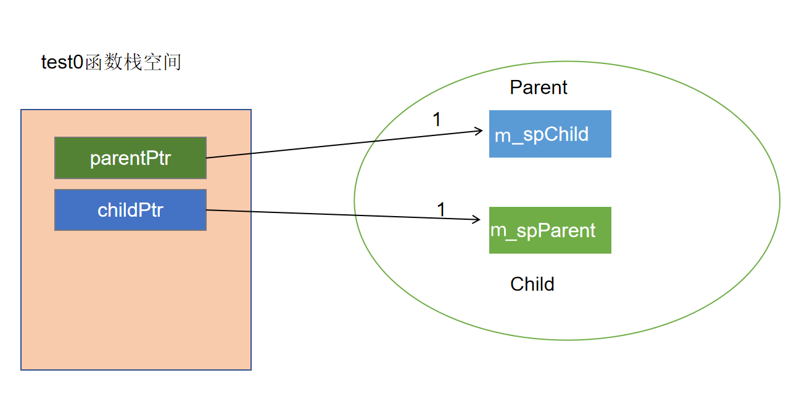
>

> ```cpp
> parentPtr->spChild = childPtr;
> childPtr->spParent = parentPtr;
> //获取到的引用计数都是2
> cout << "parentPtr.use_count():" << parentPtr.use_count() << endl;
> cout << "childPtr.use_count():" << childPtr.use_count() << endl;
> ```
>

这会形成如下结构：

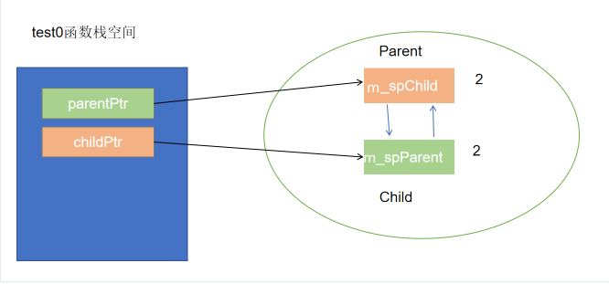
程序结束时，会发现 `Parent` 和 `Child` 的析构函数都没有被调用。

原因是：`childPtr` 和 `parentPtr` 销毁后，堆上的 `Parent` 对象和 `Child` 对象仍然互相持有对方的 `shared_ptr`，引用计数都无法减到 0，因此对象无法释放。

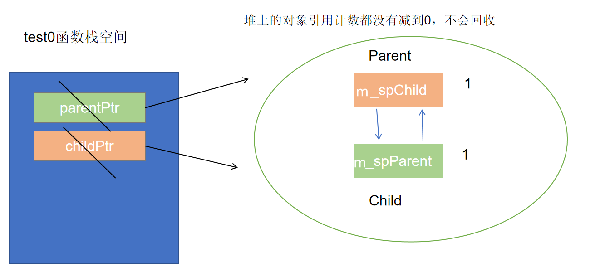

解决思路：

——希望某一个指针指向一片空间，能够指向，但是不会使引用计数加1，那么堆上的Parent对象和Child对象必然有一个的引用计数是1，栈对象再销毁的时候，就可以使引用计数减为0

`shared_ptr` 无法表达“不拥有，只观察”的关系，所以引入了 `weak_ptr`。

> weak_ptr是一个弱引用的智能指针，不会增加引用计数。
>
> shared_ptr是一个强引用的智能指针。
>
> 强引用，指向一定会增加引用计数，只要有一个引用存在，对象就不能释放；
>
> 弱引用并不增加对象的引用计数，但是它知道所托管的对象是否还存活。

循环引用的解法：将 `Parent` 或 `Child` 中任意一方的 `shared_ptr` 换成 `weak_ptr`。

比如：将Parent类中的shared_ptr类型指针换成weak_ptr

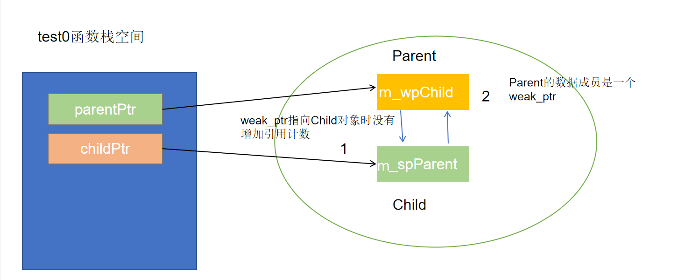

栈上的childPtr对象销毁，会使堆上的Child对象的引用计数减1，因为这个Child对象的引用计数本来就是1，所以减为了0，回收这个Child对象，造成堆上的Parent对象的引用计数也减1

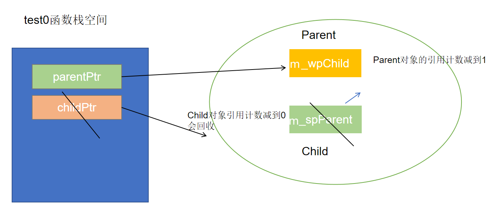

再当parentPtr销毁时，会再让堆上的Parent对象的引用计数减1，所以也能够回收。

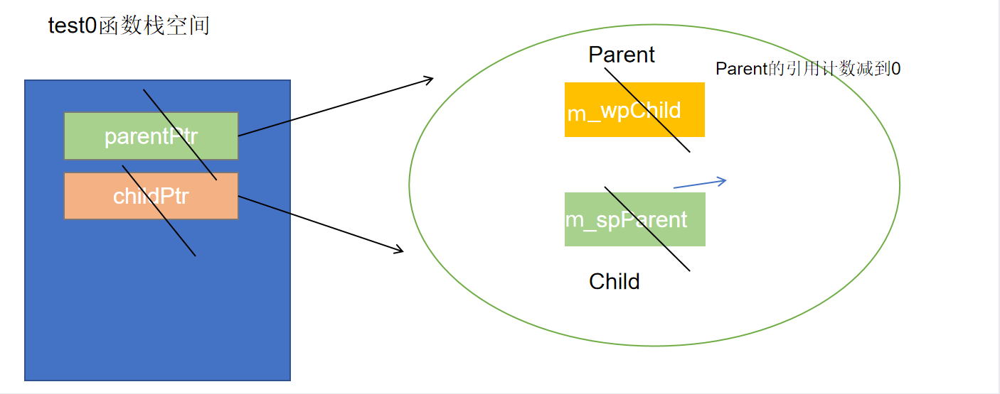

#### weak_ptr 的使用

`weak_ptr` 是弱引用智能指针，是 `shared_ptr` 的补充。它指向由 `shared_ptr` 管理的对象，但不会增加引用计数，常用于解决循环引用。

`weak_ptr` 可以判断对象是否还存活。如果要访问资源，必须先通过 `lock()` 提升为 `shared_ptr`，不能直接解引用。

> **初始化**
>
> ```cpp
> weak_ptr<int> wp;//无参的方式创建weak_ptr
>
> //也可以利用shared_ptr创建weak_ptr
> weak_ptr<int> wp2(sp);
> ```
>

> **判断关联的空间是否还在**
>
> **1.可以直接使用use_count函数**
>
> 如果use_count的返回值大于0，表明关联的空间还在
>
>
>
> **2.将weak_ptr提升为shared_ptr**
>
> ```cpp
> shared_ptr<int> sp(new int(10));
> weak_ptr<int> wp;//无参的方式创建weak_ptr
> wp = sp;//赋值
> ```
>
> 这种赋值操作可以让wp也能够托管这片空间，但是它作为一个weak_ptr仍不能够去管理，甚至连访问都不允许（weak_ptr不支持直接解引用）
>
> 想要真正地去进行管理需要使用lock函数将weak_ptr提升为shared_ptr
>
> ```cpp
> shared_ptr<int> sp2 = wp.lock();
> if(sp2){
>   cout << "提升成功" << endl;
>   cout << *sp2 << endl;
> }else{
>   cout << "提升失败，托管的空间已经被销毁" << endl;
> }
> ```
>
> 如果托管资源还没有被销毁，就可以成功提升为 `shared_ptr`；否则返回空的 `shared_ptr`。
>
>
>
> **——查看lock函数的说明**
>
> ````cpp
> std::shared_ptr<T> lock() const noexcept;
> //将weak_ptr提升成一个shared_ptr，然后再来判断shared_ptr,进而知道weak_ptr指向的空间还在不在
> ````

> 3.**可以使用expired函数**
>
> > ```cpp
> > bool expired() const noexcept;
> > //weak_ptr去判断托管的资源有没有被回收
> > ```
> >
> > 该函数返回true等价于use_count() == 0.
> >
> >
> >
> > ```cpp
> > bool flag = wp.expired();
> > if(flag){
> > cout << "托管的空间已经被销毁" << endl;
> > }else{
> > cout << "托管的空间还在" << endl;
> > }
> > ```
> >

### 删除器

很多时候我们都用new来申请空间，用delete来释放。库中实现的各种智能指针，默认也都是用delete来释放空间。

但如果资源不是用 `new` 获取的，例如用 `fopen` 打开的文件，默认删除器就不合适了。此时必须为智能指针定制删除器，也就是定制资源释放方式。

#### unique_ptr 对应的删除器

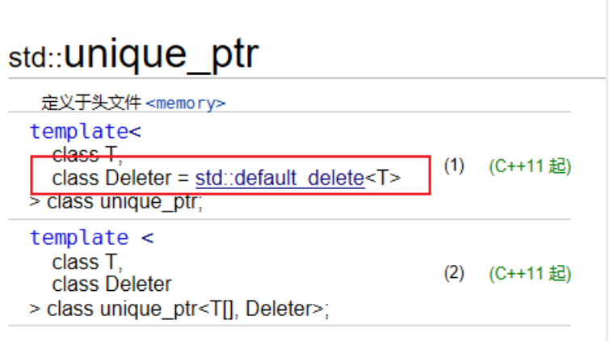

定义unique_ptr时，如果没有指定删除器参数，就会使用默认的删除器。点开std::default_delete的说明

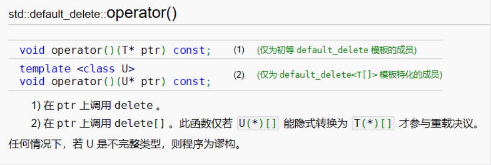

默认删除器类型重载了函数调用运算符，底层是利用函数对象实现资源回收。

根据参考文档的说明，无论接管的是什么类型的资源，回收时都是会执行delete语句或delete [ ]

> 看下面这个例子
>
> ```cpp
> //文件指针原本的用法，ok
> void test0(){
> string msg = "hello,world\n";
> FILE * fp = fopen("res1.txt","a+");
> fwrite(msg.c_str(),1,msg.size(),fp);
> fclose(fp);
> }
> ```
>
>
>
> 如果使用unique_ptr托管文件资源
>
> ```cpp
> //用unique_ptr托管文件资源，回收时有问题
> void test1(){
> string msg = "hello,world\n";
> unique_ptr<FILE> up(fopen("res2.txt","a+"));
> //get函数可以从智能指针中获取到裸指针
> fwrite(msg.c_str(),1,msg.size(),up.get());
> //fclose(up.get()); // double free
> }
> ```
>
>
>
> 一般地，智能指针的特点就是可以自动回收托管的资源，所以在接管资源后应该可以不用手动fclose
>
> 但是这样做会有一个问题：`msg` 可能没有正确写入文件。
>
> 回顾一下fclose函数，如果没有fclose的调用，msg的内容存在缓冲区中，并不会刷新到文件流中。
>
> 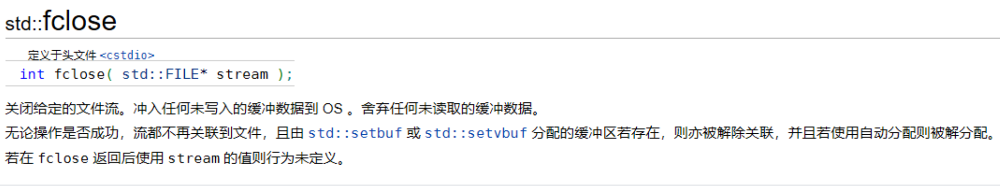
>
> —— 如果显式进行fclose，则会出现double free的问题。
>
> 已回收的文件资源，由默认的删除器又会尝试进行一次回收。

> 根本原因：`unique_ptr<FILE>` 的默认删除器会使用 `delete` 回收资源，但 `FILE *` 必须使用 `fclose` 回收。
>
> ——需要自定义删除器
>
> 仿照参考文档上默认删除器的示例，创建一个代表删除器的struct，定义operator()函数
>
> ```cpp
> struct FILECloser
> {
>     void operator()(FILE * fp) const
>     {
>         if(fp)
>         {
>             fclose(fp);
>             cout << "fclose(fp)" << endl;
>         }
>     }
> };
> ```
>

> 创建unique_ptr接管文件资源时，删除器参数使用我们自定义的删除器
>
> ```cpp
> void test1(){
>  string msg = "hello,world\n";
>  unique_ptr<FILE, FILECloser> up(fopen("res2.txt","a+"));
>  //get函数可以从智能指针中获取到裸指针
>  fwrite(msg.c_str(),1,msg.size(),up.get());
> }
> ```
>
>
>
> [!IMPORTANT]
> 管理 `new` 创建的普通对象时，默认删除器通常足够；管理 `FILE *`、socket、数据库连接等非 `new` 资源时，需要提供匹配的删除器。

#### shared_ptr 对应的删除器

> `unique_ptr` 和 `shared_ptr` 设置删除器的位置不同：
>
> 对于unique_ptr，删除器是模板参数
>
> 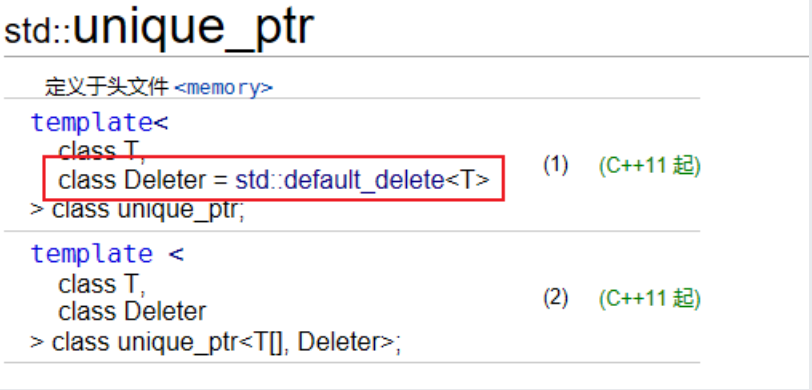
>

> 对于shared_ptr，删除器是构造函数参数
>
> 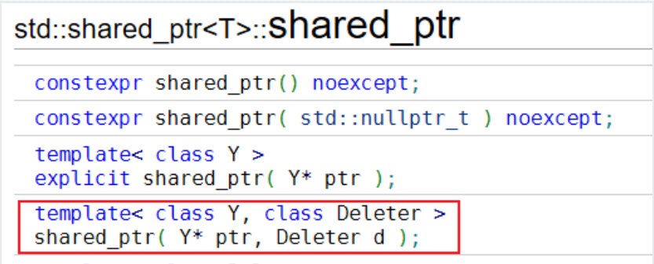
>

所以传入删除器参数的位置不同

```cpp
void test1(){
    string msg = "hello,world\n";
    //在unique_ptr的模板参数中加入删除器类
    unique_ptr<FILE, FILECloser> up(fopen("res2.txt","a+"));
    fwrite(msg.c_str(),1,msg.size(),up.get());
}

void test2(){
    string msg = "hello,world\n";
    FILECloser fc;
    //在shared_ptr的构造函数参数中加入删除器对象
    shared_ptr<FILE> sp(fopen("res3.txt","a+"),fc);
    fwrite(msg.c_str(),1,msg.size(),sp.get());
}
```

### 智能指针的误用

智能指针最常见的误用，是把同一个裸指针交给多个彼此独立的智能指针托管，最终导致同一对象被释放多次。

对于shared_ptr与unique_ptr都会产生这个问题。

> —— unique_ptr要注意的误用
>
> ```cpp
>void test0(){
> //需要人为注意避免
> Point * pt = new Point(1,2);
> unique_ptr<Point> up(pt);
> unique_ptr<Point> up2(pt);
> }
>
> void test1(){
> unique_ptr<Point> up(new Point(1,2));
> unique_ptr<Point> up2(new Point(1,2));
> //让两个unique_ptr对象托管了同一片空间
> up.reset(up2.get());
> }
> ```
>

> ——shared_ptr要注意的误用
>
> 使用不同的智能指针托管同一片堆空间,只能通过shared_ptr开放的接口——拷贝构造、赋值运算符函数
>
> 如果是用裸指针的形式将一片资源交给不同的智能指针对象管理，即使是shared_ptr也是不行的。
>
> [!CAUTION]
> 多个 `shared_ptr` 共享同一对象时，必须通过已有 `shared_ptr` 复制或赋值，不能重复使用同一个裸指针构造多个独立的 `shared_ptr`。
>
>
>
> ```cpp
> void test2(){
> Point * pt = new Point(10,20);
> shared_ptr<Point> sp(pt);
> shared_ptr<Point> sp2(pt);
> }
>
> void test3(){
> //使用不同的智能指针托管同一片堆空间
> shared_ptr<Point> sp(new Point(1,2));
> shared_ptr<Point> sp2(new Point(1,2));
> sp.reset(sp2.get());
> }
> ```
>

> —— 还有一种误用
>
> 给Point类加入了这样的成员函数
>
> ```cpp
> Point * addPoint(Point * pt)
> {
>     m_x += pt->m_x;
>     m_y += pt->m_y;
>     return this;
> }
> ```
>
>
>
> 使用时，这样还是使得sp3和sp同时托管了同一个堆对象
>
> ````cpp
> shared_ptr<Point> sp(new Point(1, 2));
> shared_ptr<Point> sp2(new Point(3, 4));
>
> //创建sp3的参数实际上是sp所对应的裸指针
> //效果还是多个智能指针托管了同一块空间
> shared_ptr<Point> sp3(sp->addPoint(sp2.get()));
> cout << "sp3 = ";
> sp3->print();
> ````
>
> ——需要给sp3的构造函数传入`shared_ptr<Point>` 对象，而不是裸指针

> 解决思路：通过 `this` 指针获取共享当前对象所有权的 `shared_ptr`。
>
> 可以修改Point中的addPoint函数
>
> ```cpp
> shared_ptr<Point> addPoint(Point * pt)
> {
>     m_ix += pt->m_ix;
>     m_iy += pt->m_iy;
>     return shared_ptr<Point>(this);
> }
> ```
>
>
>
> 但是这样写，在addPoint函数中创建的匿名智能指针对象接收的还是sp对应的裸指针，那么这个匿名对象和sp所托管的空间还是同一片空间。匿名对象销毁时会delete一次，sp销毁时又会delete一次。
>
> ```cpp
> //注意!!
> //addPoint的返回值与sp共用了同一个裸指针,返回值在当前行结束后销毁,会回收掉第一个Point对象
> //sp管理的空间实际上已经被回收了
> //验证如下
> sp->addPoint(sp2.get());
> delete sp.get();
> cout << "over" << endl;
> ```
>

> ——使用智能指针辅助类enable_shared_from_this的成员函数shared_from_this
>
> 
>
> 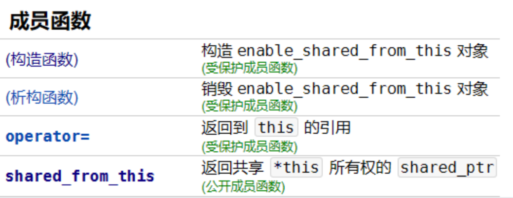
>
> 在 `Point::addPoint` 中需要使用 `shared_from_this()` 返回的 `shared_ptr` 作为返回值。要在 `Point` 类中调用这个函数，可以让 `Point` 继承 `std::enable_shared_from_this<Point>`。
>
> 这样修改addPoint函数后，问题解决。
>
> ```cpp
> class Point
> : public std::enable_shared_from_this<Point>
> {
> public:
>     //...
>     shared_ptr<Point> addPoint(Point & pt)
>     {
>         m_ix += pt.m_ix;
>         m_iy += pt.m_iy;
>         // 返回共享 *this 所有权的 shared_ptr
>         return shared_from_this();
>     }
> };
> ```
>
>
>
> [!IMPORTANT]
> 智能指针误用的核心问题：不要让多个彼此独立的智能指针托管同一个裸指针。共享所有权要复制已有的 `shared_ptr`，独占所有权要移动 `unique_ptr`。
