# 第十一章 STL 标准模板库

标准模板库（Standard Template Library，STL）是 C++ 标准库的重要组成部分，提供了常用的数据结构、算法和相关工具。它的核心价值是复用：用统一的接口操作不同类型的数据结构，并通过泛型编程减少重复代码。

STL 采用泛型编程思想。它把数据类型抽象成模板参数，让同一套容器和算法可以适配不同类型。本章重点是理解 STL 的基本组件、常用容器、迭代器、算法和适配器的使用方式。

## STL 六大组件

1. **容器**：用于存储数据，本质上是各种数据结构。

- 序列式容器：`vector`、`list`、`deque` 等;
- 关联式容器：`set`、`map` 等;
- 无序关联式容器：`unordered_set`、`unordered_map` 等。

2. **迭代器**：用于访问容器中的元素，可以理解为泛型指针。

```cpp
vector<int> nums = {1,2,3};
vector<int>::iterator it = nums.begin();
```

3. **算法**：用于处理容器区间中的元素，通常是普通函数模板。

```cpp
std::sort(vec.begin(),vec.end());
```

4. **适配器**：对已有接口进行包装，让它适配新的使用场景。

- 容器适配器：`stack`、`queue`、`priority_queue`;
- 迭代器适配器;
- 函数适配器：`bind`、`function` 等。

5. **函数对象**：通过重载 `operator()` 定制算法或容器行为。

6. **空间配置器**：负责容器底层内存申请与释放。

> [!NOTE]
> STL 的核心关系可以理解为：容器保存数据，迭代器连接容器和算法，函数对象定制算法行为，适配器包装接口，空间配置器为容器管理内存。

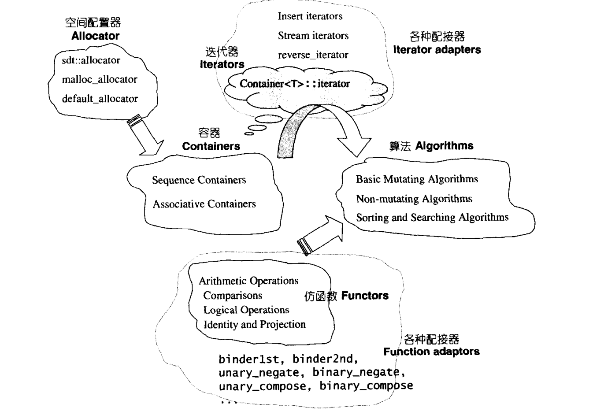
六者之间的关系：

1. 容器是 STL 的主体，提供不同数据结构;
2. 分配器为容器分配底层空间;
3. 泛型算法处理容器中的数据;
4. 迭代器是算法和容器之间的桥梁;
5. 函数对象让算法具备更灵活的定制能力;
6. 适配器让已有组件以新的接口形式使用。

## 容器

### 容器分类

1. **序列式容器**：元素按线性顺序组织。

   - array

   - **vector**
   - **deque**
   - forward_list
   - **list**

2. **关联式容器**：底层通常采用红黑树。

   - set

   - multiset
   - map
   - multimap

3. **无序关联式容器**：底层通常采用哈希表。

   - unordered_set

   - unordered_map
   - unordered_multiset
   - unordered_multimap

### 序列式容器

序列式容器包括：静态数组 `array`、动态数组 `vector`、双端队列 `deque`、单链表 `forward_list`、双链表 `list`。本节重点学习 `vector`、`deque`、`list` 的初始化、遍历和基本操作，另外补充 `list` 的特殊成员函数。

在之后的工作中，这些容器都是很常用的工具。在面试中，对容器的底层原理也可能会有一定的考察。

#### 基本操作

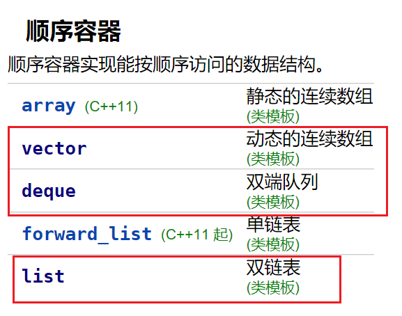
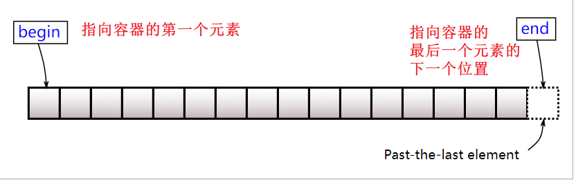
##### 初始化

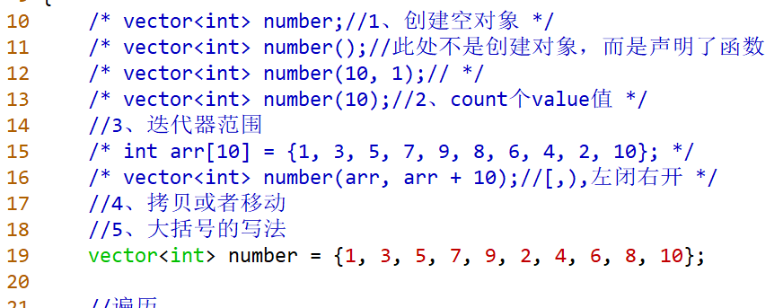
> [!NOTE]
> `vector`、`deque`、`list` 都支持常见初始化方式：无参构造、`count` 个 `value`、迭代器范围、拷贝/移动构造、初始化列表。

##### 遍历

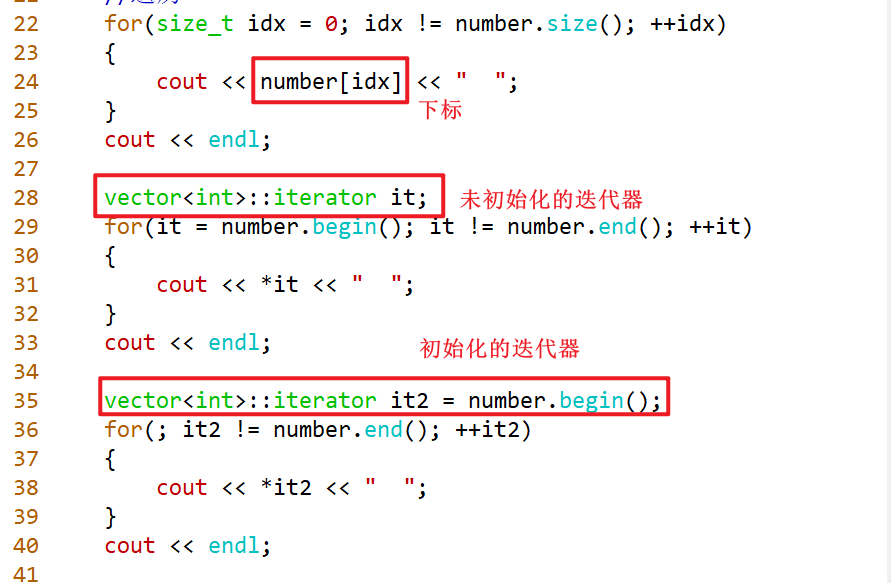
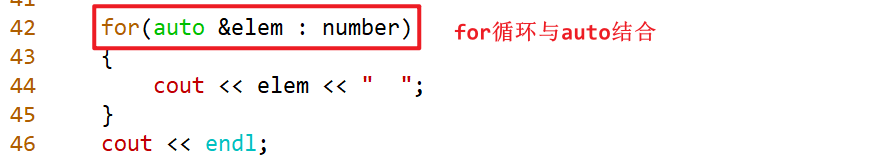
> [!NOTE]
> `vector`、`deque`、`list` 都支持迭代器和范围 `for` 遍历。`list` 不支持下标访问，所以不能用下标遍历;`vector` 和 `deque` 支持下标访问。

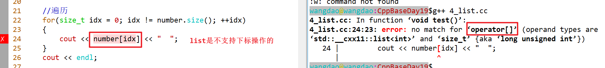

##### 在尾部进行插入与删除

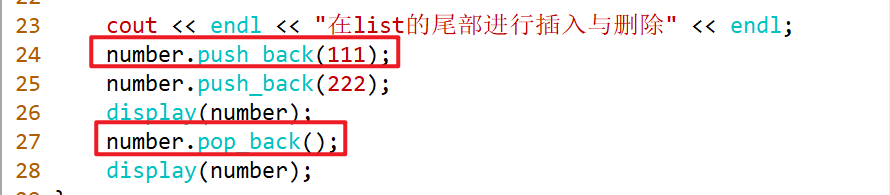
> [!NOTE]
> `vector`、`deque`、`list` 都支持在尾部插入和删除。

##### 在头部进行插入与删除

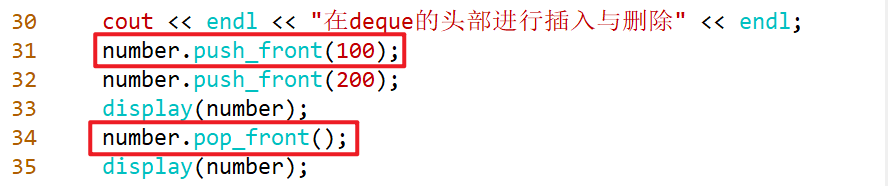
> [!NOTE]
> `deque` 和 `list` 支持在头部插入与删除，`vector` 不适合也不提供 `push_front` / `pop_front`。

##### 模型理解

**vector**

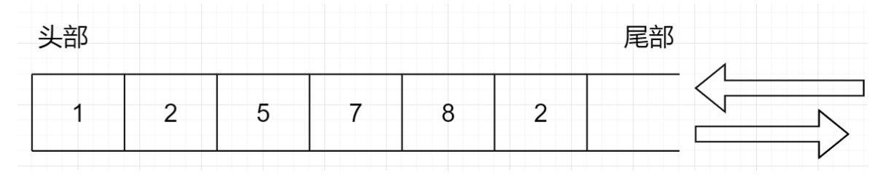
`vector` 的元素连续存储，适合尾部插入和随机访问。如果在头部或中间插入/删除，后续元素需要整体移动，时间复杂度为 `O(N)`。

**deque**

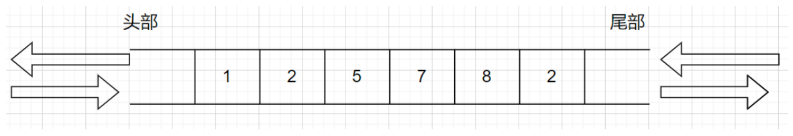
`deque` 表现为双端队列，支持头部和尾部的插入删除。

**list**

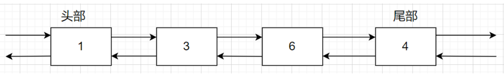
`list` 实现的是双向链表，适合已知位置处的插入和删除，但不支持随机访问。

##### 源码阅读

想要对这几种容器有更清晰的认知，还可以结合源码来进行理解

**vector的源码（了解）**

> 继承图
>
> 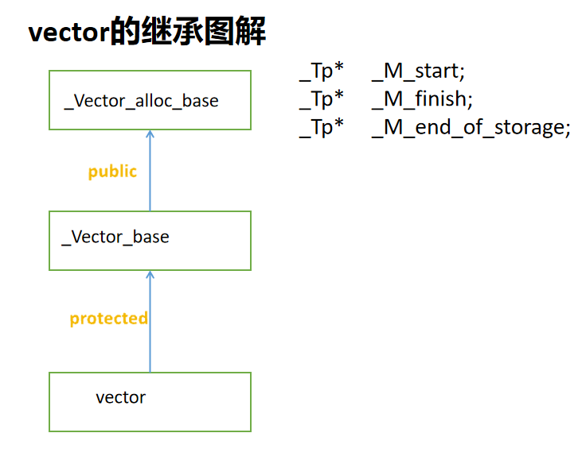
>
> 源码
>
> ```cpp
>template <class _Tp, class _Alloc = __STL_DEFAULT_ALLOCATOR(_Tp) >
> class vector
> {
> public:
> typedef _Tp value_type;
> typedef value_type* pointer;
>   typedef const value_type* const_pointer;
>   typedef value_type* iterator;   //typedef _Tp* iterator;
>   typedef const value_type* const_iterator;
>   typedef value_type& reference;
>   typedef const value_type& const_reference;
>   typedef size_t size_type;
>   typedef ptrdiff_t difference_type;
>   };
>
> //iterator相当于vector的内部类
> vector<int>::iterator it;
> ```
>
> 除了vector的数据成员，还可以看到一些成员函数的实现，比如push_back有可能发生的动态扩容（2倍扩容的机制就写在源码中）

> **思考：**获取vector的第一个元素的首地址，应该怎么做
>
> 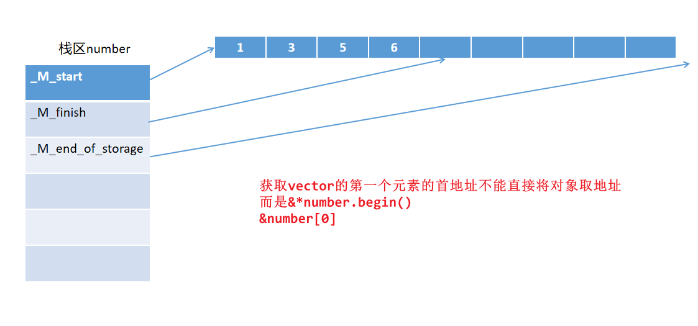
>
> 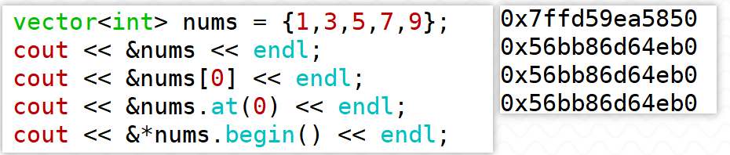
>
> vector中at与operator[]都具备随机访问的含义，但是operator[]会有越界的风险，也就是不安全，但是at具备范围限制，更加安全一些。
>
> 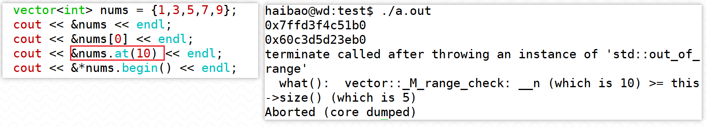
**deque的源码（了解）**

deque的实现原理比vector复杂得多

> 继承图
>
> 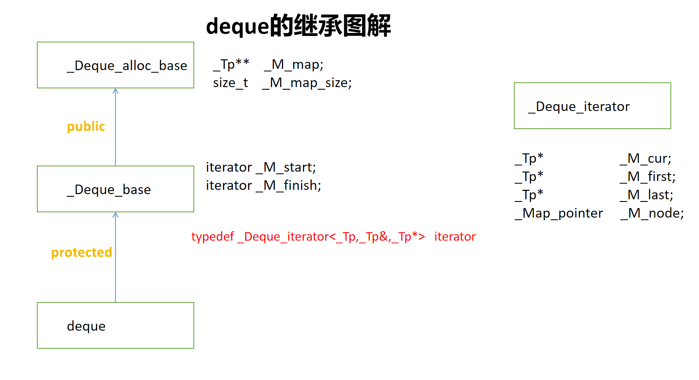
> **原理**
>
> `deque` 由多个缓冲区片段组成。片段内部连续，但片段之间不一定连续。这些片段由一个中控器管理，中控器也常被称为 `map` 指针数组，但它不是 `std::map`。
>
> 因此，`deque` 在物理上不完全连续，但逻辑上连续。
>
>
>
> 初始化deque时，根据元素的个数分配一些缓冲区片段
>
> 在缓冲区片段中存放实际的元素，这里以int型元素为例。通常情况下，在初始化时第一个元素会被放置在第一个缓冲区中相对靠前的位置（而非第一个缓冲区的首地址，这样方便在头部添加元素）。
>
> 前后相邻的两个元素在逻辑上是连续的，但是物理层面上可能并不是连续的。
>
> 同时还会生成一个数组中控器（map），存放每个缓冲区片段的首地址。
>
> 通常情况下，第一个缓冲区片段的首地址被放在中控器map的居中位置。
>
>
>
> deque初始化完成后，进行添加元素的操作：
>
> **如果在尾部添加元素value**
>
> 找到最后一个存放着元素的缓冲区片段，在其中最后一个元素的后面添加元素value。
>
> 如果此时最后的缓冲区片段是满的，那么就再申请一个新的缓冲区片段，将要添加的元素value存放在新片段的首个位置。同时中控器也加上一个元素（新片段的首地址），让中控器与新片段联系起来。
>
>
>
> **如果是在deque的头部添加元素value**
>
> 找到已经存储的第一个元素的位置，在它的前面存放新元素value。
>
> 经过若干次头部添加元素之后，如果第一个缓冲区片段满了，还要继续在头部添加元素，则新开辟一个缓冲区片段（作为第一个片段），将value存在这个片段中的最后一个位置。同时在中控器的相应位置存放新的缓冲片段的首地址。
>
>
>
> **那么这里会有一个小小的问题：**
>
> 如果一直往deque头部添加元素，中控器的前半部分已经满了，后半部分还没满，会怎么样呢？
>
> 这种情况会通过一个reallocate_map函数来管理中控器的设置，先做一个判断，我们可以简单理解为如果中控器后半部分的空位较多，那么就将中控器中记录的地址全都后移若干位，这样中控器的前半部分就有空位了。如果中控器后半部分的空位较少，就再开辟新的更大的空间作为中控器，将原本中控器中记录的地址复制到新的中控器中。
>
> 同理，如果一直往deque尾部添加元素，中控器的后半部分已经满了，前半部分还没满，也是一样的处理流程。
>
>
>
> **注意**
>
> 在 `deque` 头部或尾部添加元素时，已有元素通常不需要像 `vector` 扩容那样整体搬迁。这是 `deque` 和 `vector` 的重要区别。
>
> 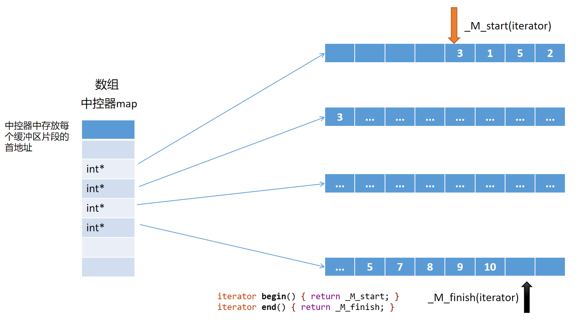
>
>

—— 每个缓冲区片段的大小是多大？

> 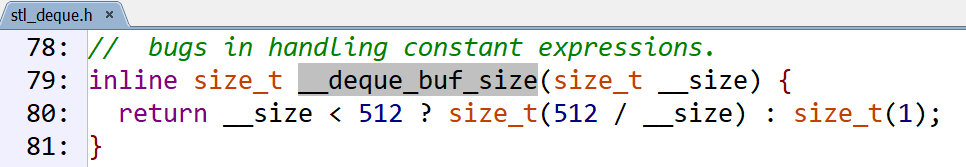
>
> 如果deque存放的元素类型的大小小于 512 字节。每个缓冲区片段的大小为 512 字节，512 除以元素类型的大小，就可以得到每个缓冲区片段能够存放的元素数量。
> 例如元素类型是 int，在 64 位系统中，sizeof(int)= 4 字节。**那么 deque_buf_size(4) 的结果就是 512 / 4 = 128，即每个缓冲区片段可以存放 128 个 int 类型的元素。**
> 这种设计的好处是，对于较小的元素类型，每个缓冲区可以存放较多的元素，减少了缓冲区的数量，从而降低了中控器（用于管理缓冲区的数组）的管理开销。
>
> 如果元素类型大小大于等于 512 字节，函数返回 1。这表示每个缓冲区片段只存放一个元素。
> 比如自定义类型A的对象作为deque的元素，单个元素的大小超过了 512 字节，那么 __deque_buf_size(sizeof(A)) 的结果就是 1，每个缓冲区片段只会存放一个 A类型的元素。

—— deque的迭代器底层是和vector一样吗？

> deque的迭代器比vector的迭代器复杂得多，`vector<T>`的迭代器实际是对T*的包装，但deque的迭代器实际应该视为对象，数据成员包含四个指针，并且进行了一系列的运算符重载，使得迭代器能够像指针一样被使用。
>
> 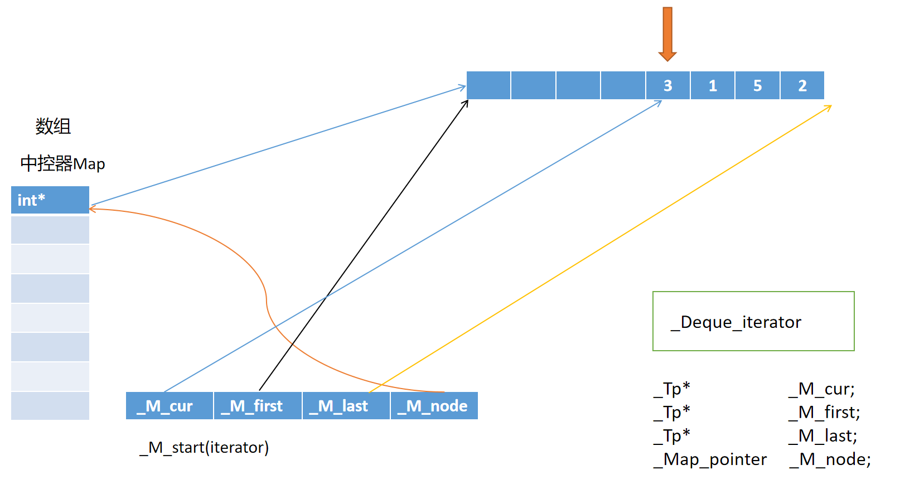
>
> 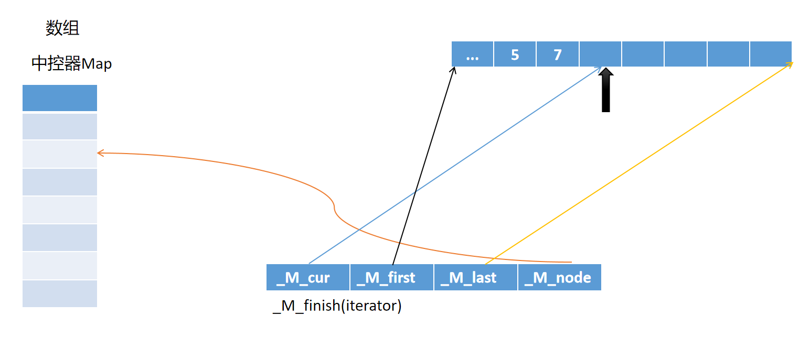
##### insert操作（重要）

之前的push_back和push_front尽管可以插入元素，但是插入的位置都比较固定。

实际上三种序列式容器都允许在任意位置插入元素，使用insert函数即可，它们都具备以下四种插入的功能。

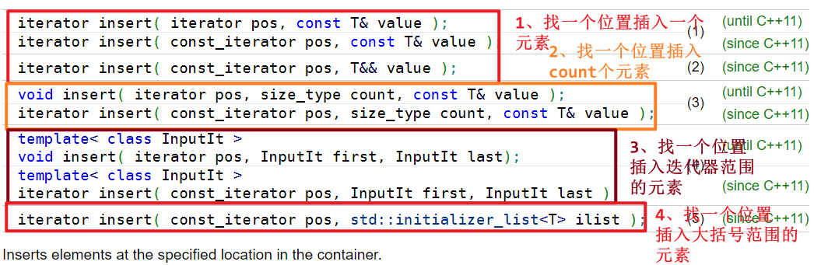

> 以list为例，双向链表由于其底层结构的原因，插入是非常方便的。
>
> 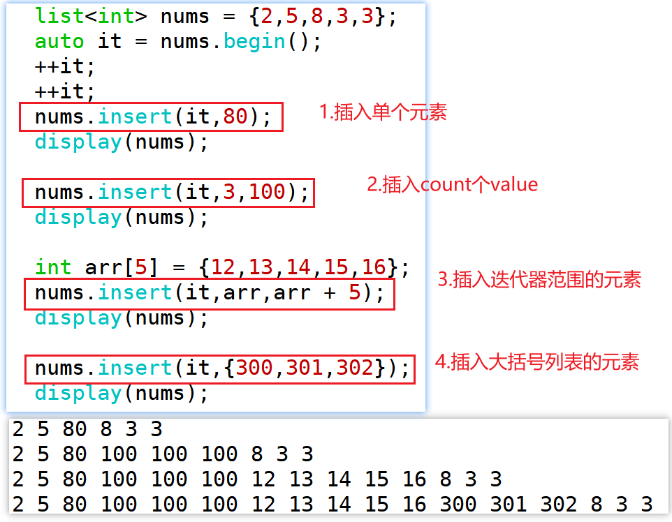
从参考文档可以看到，三种序列式容器都支持 `insert`，但不同底层结构的细节不同。

> 对于list
>
> 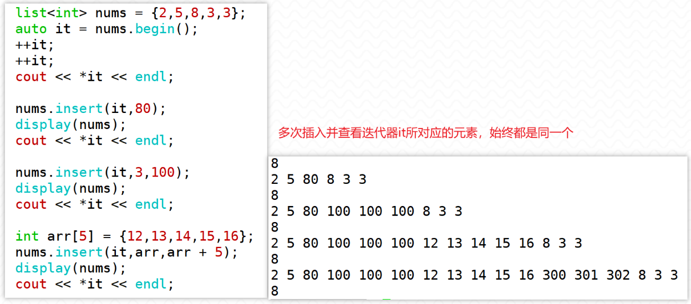
> 如果把list换成deque，情况会有所不同
>
> 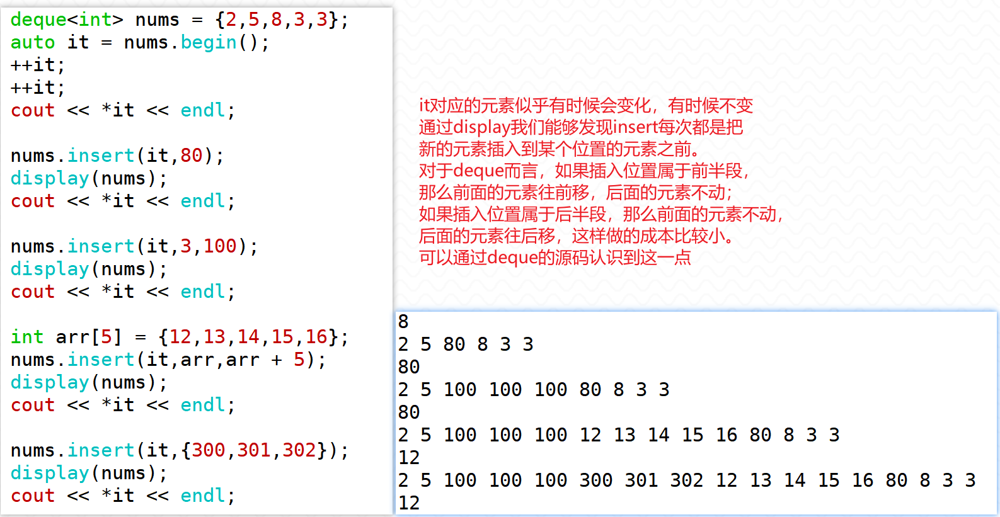
>
>
>
> 使用迭代器遍历容器并进行插入处理时，往往需要更新迭代器。
>
> `insert` 有多种重载形式，返回值通常是指向第一个被插入元素的迭代器。
>
> 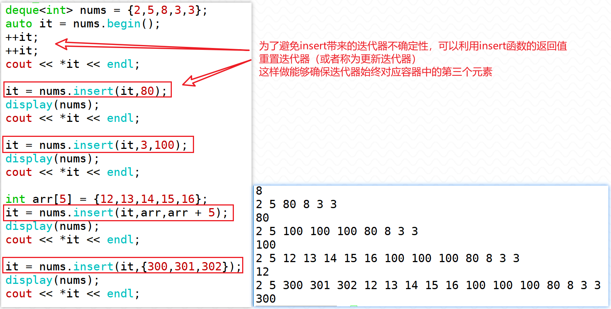
>
> **—— list进行insert操作时，同样可以使用这样的方式更新迭代器。可自行试验，查看效果。**

对于 `vector`，`insert` 过程中存在更大的隐患：可能导致迭代器失效。

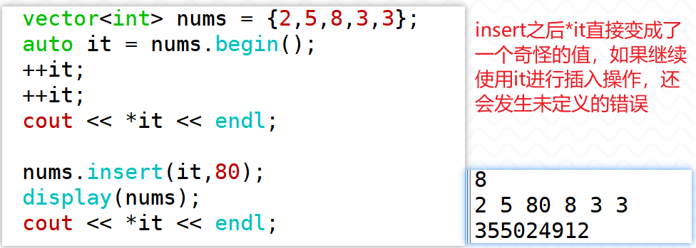
为什么会发生这样的情况呢？

当 `vector` 使用 `insert` 插入元素时，可能触发动态扩容。例如 `nums` 已经处于“存满”状态，`size()` 与 `capacity()` 相等，此时继续插入元素就需要扩容。

扩容时会申请新空间，将旧空间中的元素迁移到新空间，然后释放旧空间。如果继续使用原来的迭代器，本质上就是继续使用旧空间地址，会产生迭代器失效问题。

> [!CAUTION]
> 对 `vector` 执行可能导致扩容的插入操作后，不要继续使用旧迭代器。应使用 `insert` 的返回值或重新获取迭代器。

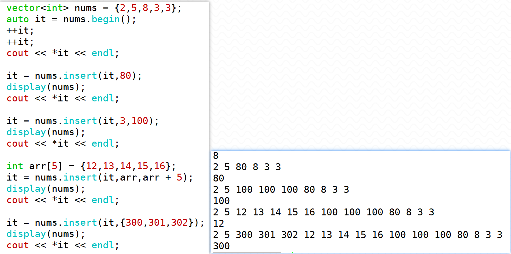
> [!NOTE]
> `vector` 的 `insert` 扩容规则比 `push_back` 更复杂，下面只作了解。

之前在学习vector的push_back操作时，我们了解了2倍扩容机制。而insert导致的扩容，规则更复杂一些。

**vector的insert扩容（仅作了解）**

```cpp
nums.size() = m
nums.capacity() = n;
//要插入的元素的个数为t
//(1) t < n - m       不会扩容
//(2) n - m < t < m   按照2*size()进行扩容
//(3) n - m < t, m < t 按照t + m进行扩容
```

##### erase操作(重要)

三种序列式容器都支持 `erase`，用于删除单个元素或一段元素。

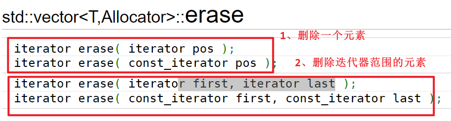
> list的erase操作
>
> 由于list的原理，list中的元素无论是插入还是删除都非常的方便。
>
> `erase` 后，原迭代器 `it` 指向的节点已经被删除，不能继续使用。想继续遍历，需要使用 `erase` 的返回值更新迭代器。
>
> `erase` 的返回值是被删除元素后一位元素对应的迭代器。
>
> 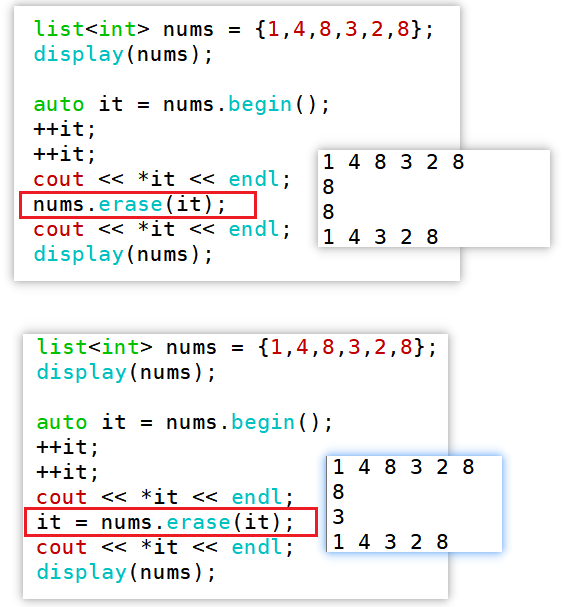

> deque的erase操作
>
> deque的erase操作后，迭代器it仍然指向原本的位置。但是原本的位置上存放的是什么，**同样需要取决于删除的元素属于前半段还是后半段。**
>
> 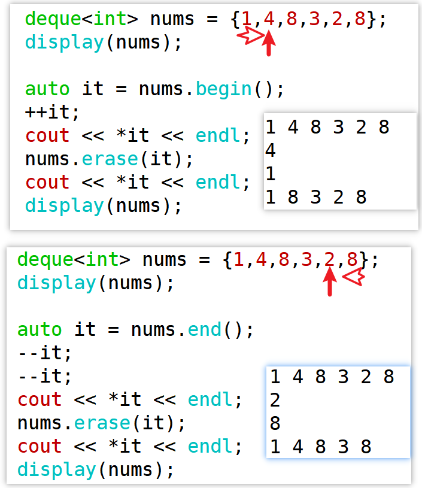
>
>
>
> 如果想要一个明确的效果，以便erase之后继续正常使用it这个迭代器，那么同样建议进行迭代器更新
>
> 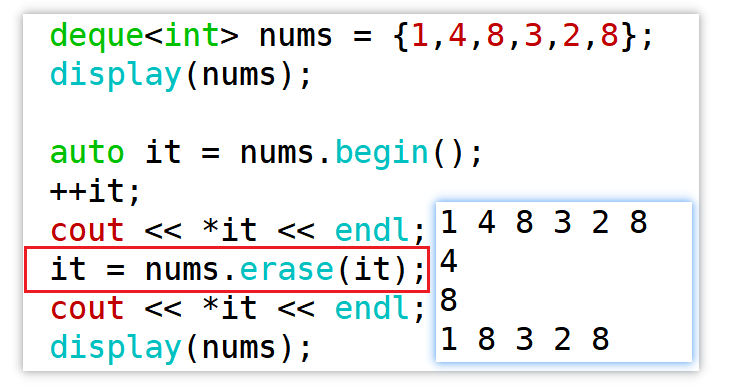
如果将上述例子中的容器换成vector，似乎不会出现问题。

删除一个元素后，后面的元素会前移。如果不更新迭代器，迭代器仍指向原本位置，而这个位置现在对应被删除元素的后一位元素。

如果更新迭代器，迭代器指向也能够确保是后一位的元素。

也就是说，对于vector而言，使用erase删除单个元素时，是否更新迭代器效果是一样的。

> 但在删除连续重复元素时，vector的erase操作也可能导致迭代器失效问题。
>
> 如下，我们在使用vector时很可能写出这样的代码，但结果并没有实现想要的效果：
>
> 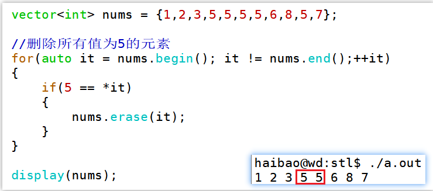
>
> 此时通过it = nums.erase(it)这样简单更新迭代器并不能解决问题（效果一样）。问题的根本在于，无论是对于该删除的元素还是不该删除的元素，迭代器的偏移采取的是统一的方式。
>
> 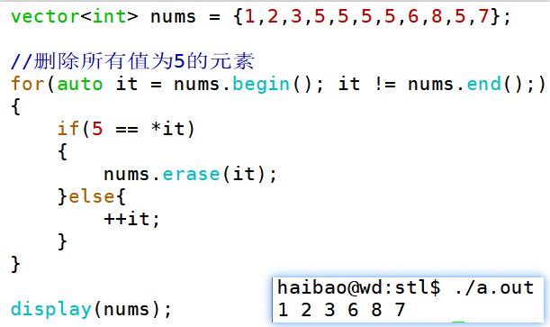
>
> 因为在vector中元素是连续的，如果删掉某个元素，后面的元素前移，如果此时迭代器依然往后移动，有可能漏掉一些元素。
>
> **解决方式：在删除元素时，就不移动迭代器，从逻辑的角度上来说，对应的元素已经变成了被删元素的下一位**。

> —— 试一试对list完成上述操作，看看会有什么结果？
>
> **list进行erase时，还需要更新迭代器**
>
> 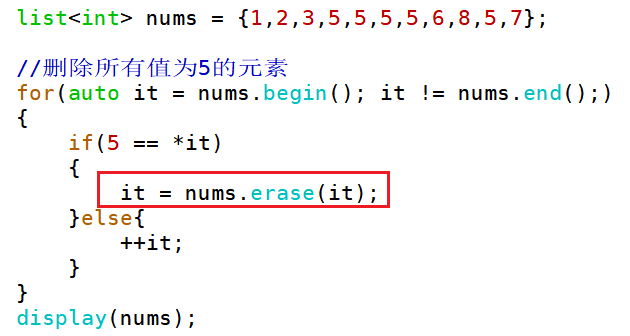

##### 元素的清空

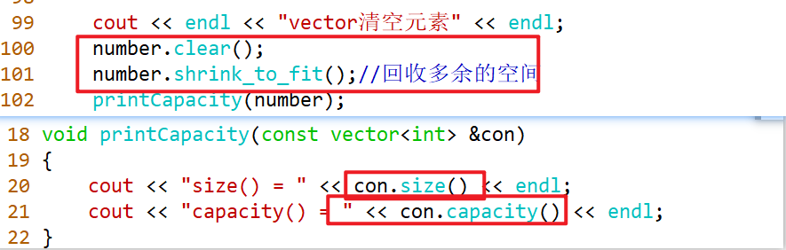

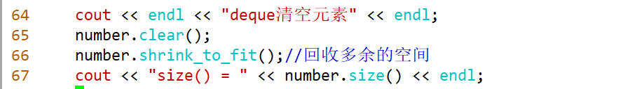

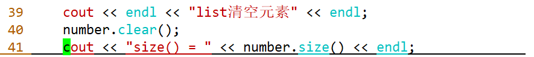

> [!NOTE]
> `vector`、`deque`、`list` 都有 `clear` 和 `size`；`vector`、`deque` 还有 `shrink_to_fit`；`vector` 额外提供 `capacity` 查看当前容量。

##### 其他成员函数

```cpp
//三种序列式容器都具备交换的函数
void swap( list& other );//此处的list可以改为vector或者deque
//vector与vector交换，deque与deque交换，list与list交换

//三种序列式容器都具备改变元素个数的函数
void resize( size_type count, T value = T() );
void resize( size_type count );
void resize( size_type count, const value_type& value )

//获取容器的第一个元素与最后一个元素(三种都有)
reference front();
const_reference front() const;

reference back();
const_reference back() const;
```

##### emplace_back函数

这三种序列式容器还有两个值得关注的函数：emplace和emplace_back

`emplace` 与 `insert` 对比：前者是在指定位置直接构造对象，后者通常是把已有对象复制或移动到容器中。

`emplace_back` 与 `push_back` 对比：前者是在容器尾部直接构造对象，后者是把已有对象复制或移动到容器末尾。

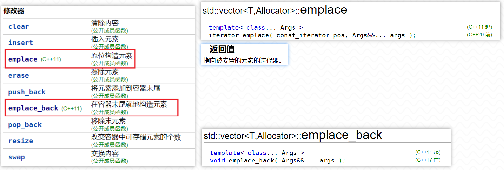

> 查看emplace_back的效果
>
> 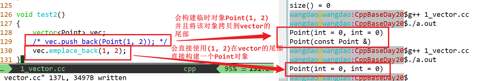
>
>
>
> 同理可以查看emplace的效果
>
> 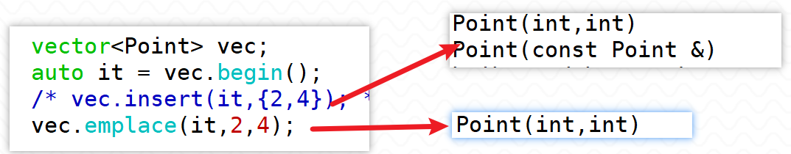
#### list的特殊操作（重要）

list还具有一些vector与deque没有的函数。

注意，这里说的特殊操作也是属于list的成员函数，在使用时仍然是成员函数的使用方式。

##### sort函数

将list中的元素排序

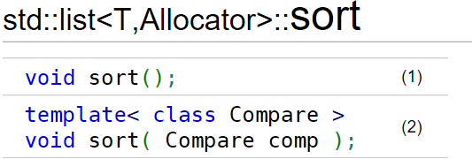
简单示例：

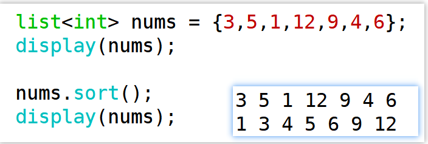
如果使用无参版本的sort函数，则list中的元素默认以升序排列。

> 第二个版本的sort函数有一个参数，参数为Compare类型的对象。关于Compare，第一次见到应该是在set类模板声明中
>
> 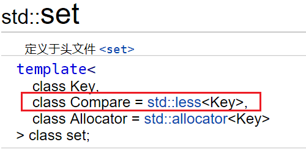
>
> 之前在简单使用set时我们知道元素会默认按照升序排序，这里就是使用了`std::less<key>`的效果。做个测试：
>
> 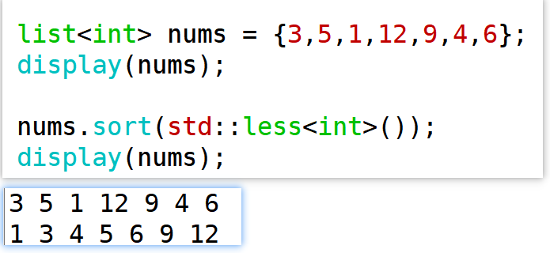
>
> 效果和无参的sort版本是一样的，同样采用升序排序。

**这里对std::less的使用与之前unique_ptr的默认删除器的使用是很相似的。**

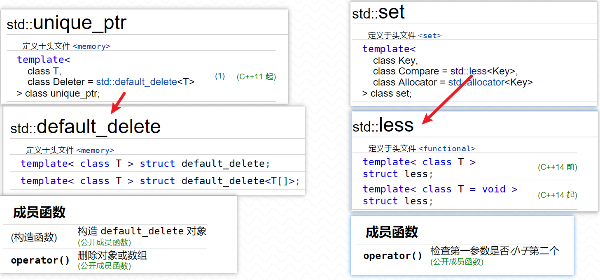
> 通过cpp参考文档能够了解到std::less进行了函数调用运算符的重载，在operator()函数中接受两个参数，代表两个元素，在函数定义中对两个元素进行了比较。
>
> 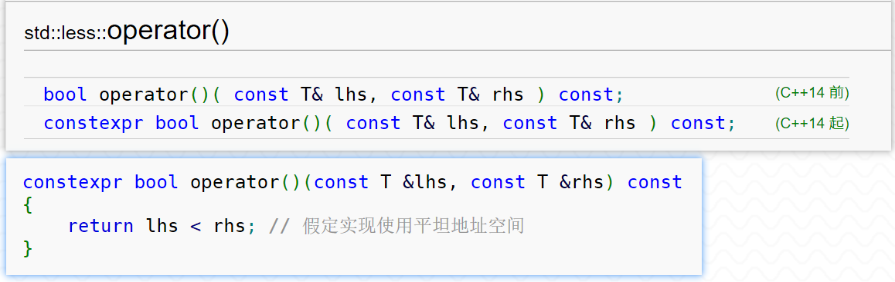
> —— 如果想要按照降序排列，对应位置可以换成std::greater
>
> 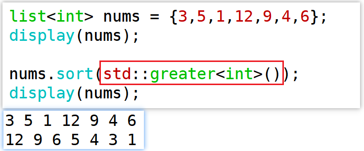
当然，针对需要排序的各种元素类型，可能需要更灵活的Compare，那么我们可以像定制化删除器一样定制化Compare

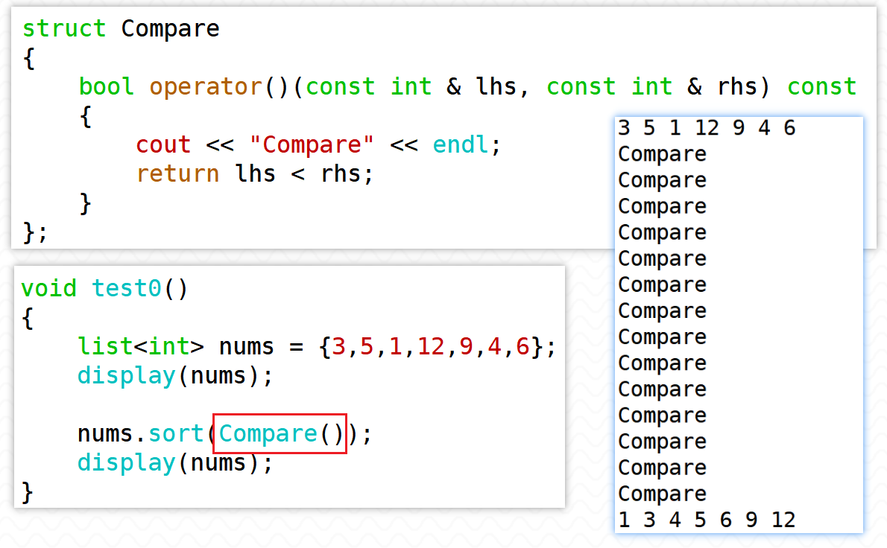
会发现自定义的Compare对象被当成函数调用了很多次，可以简单阅读list的sort函数源码

其底层实现实际是一种基于归并排序的做法

```cpp
template <class _Tp, class _Alloc> template <class _StrictWeakOrdering>
void list<_Tp, _Alloc>::sort(_StrictWeakOrdering __comp)
{
  // Do nothing if the list has length 0 or 1.
  if (_M_node->_M_next != _M_node && _M_node->_M_next->_M_next != _M_node) {
    list<_Tp, _Alloc> __carry;
    list<_Tp, _Alloc> __counter[64];
    int __fill = 0;
    while (!empty()) {
      __carry.splice(__carry.begin(), *this, begin());
      int __i = 0;
      while(__i < __fill && !__counter[__i].empty()) {
        __counter[__i].merge(__carry, __comp);
        __carry.swap(__counter[__i++]);
      }
      __carry.swap(__counter[__i]);
      if (__i == __fill) ++__fill;
    }

    for (int __i = 1; __i < __fill; ++__i)
      __counter[__i].merge(__counter[__i-1], __comp);
    swap(__counter[__fill-1]);
  }
}

template <class _Tp, class _Alloc> template <class _StrictWeakOrdering>
void list<_Tp, _Alloc>::merge(list<_Tp, _Alloc>& __x,
                              _StrictWeakOrdering __comp)
{
  iterator __first1 = begin();
  iterator __last1 = end();
  iterator __first2 = __x.begin();
  iterator __last2 = __x.end();
  while (__first1 != __last1 && __first2 != __last2)
    if (__comp(*__first2, *__first1)) {
      iterator __next = __first2;
      transfer(__first1, __first2, ++__next);
      __first2 = __next;
    }
    else
      ++__first1;
  if (__first2 != __last2) transfer(__last1, __first2, __last2);
}
```

—— 那么vector和deque没有这样的成员函数，该怎样对容器内元素排序呢？

std::sort(vec.begin(),vec.end());

##### reverse函数

将list的所有元素顺序反转

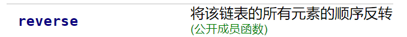
> [!CAUTION]
> `list::reverse` 是反转链表顺序，`vector::reserve` 是预留容量，二者拼写相似但语义完全不同。

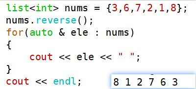

##### unique函数

去重list中重复的元素

`unique` 只会移除连续重复元素。因此通常需要先排序，才能达到整体去重效果。

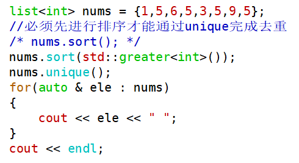

##### merge函数

将一个list合并到当前list中

> [!CAUTION]
> `merge` 要求两个 `list` 在合并前已经按相同规则排好序。否则合并后的整体顺序也无法保证。

想要合并后的 `list` 保持有序，需要两个 `list` 在合并前就已经有序。

如果使用如下版本的merge，那么必须先进行升序排列

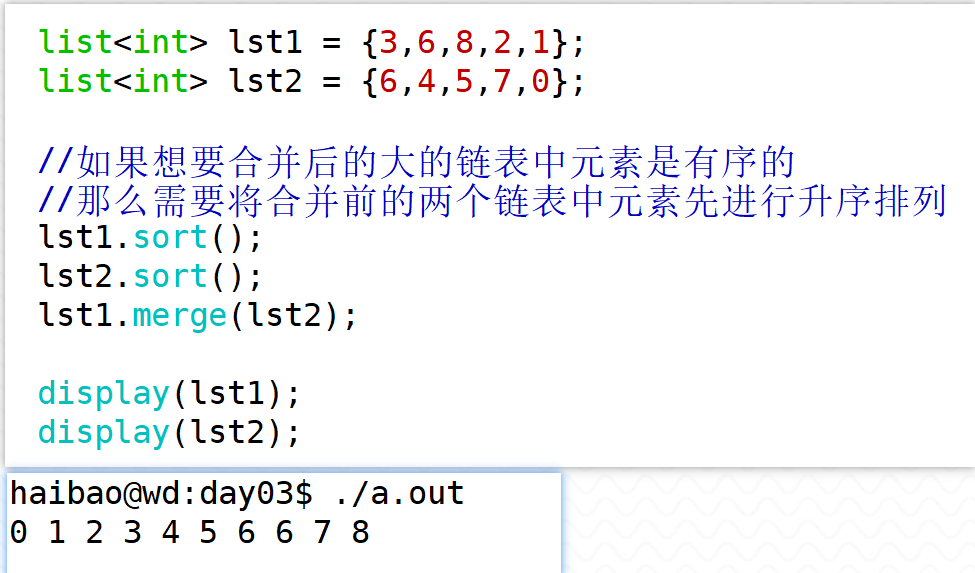
如果相应更灵活的排序方式，需要使用如下版本的merge

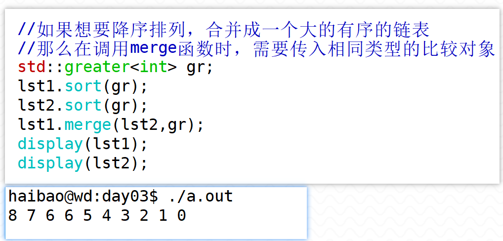
结果：

lst2中的元素已经合并到lst1中了，lst2的元素被清空了。

##### remove/remove_if函数

remove函数能够移除所有等于 value 的元素;

remove_if函数能够移除所有符合条件的元素，需要传入一个一元谓词（返回值为bool的一元函数）—— 如果某元素作为函数参数能够返回true，则判定为应该删除的元素。

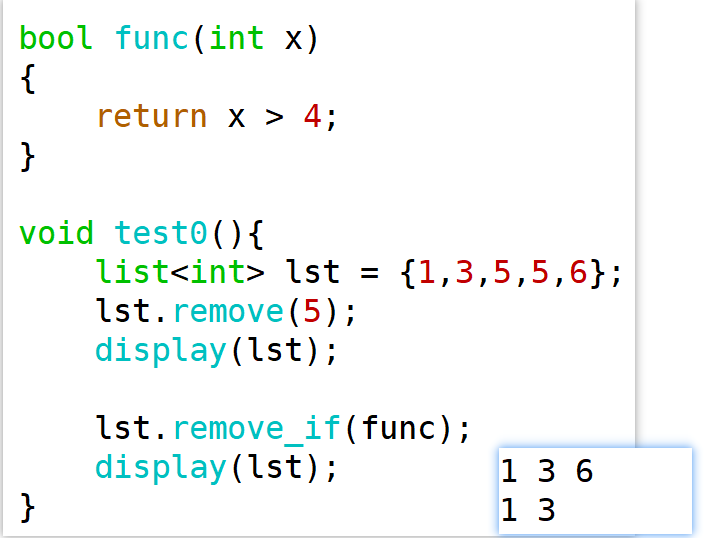
##### splice函数

还有一个稍稍复杂的特殊操作splice

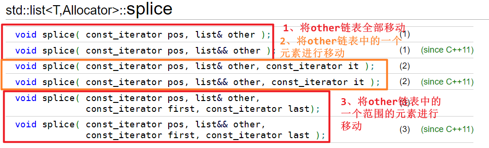

第一个参数相当于是移动的目的地

> 简单示例：
>
> 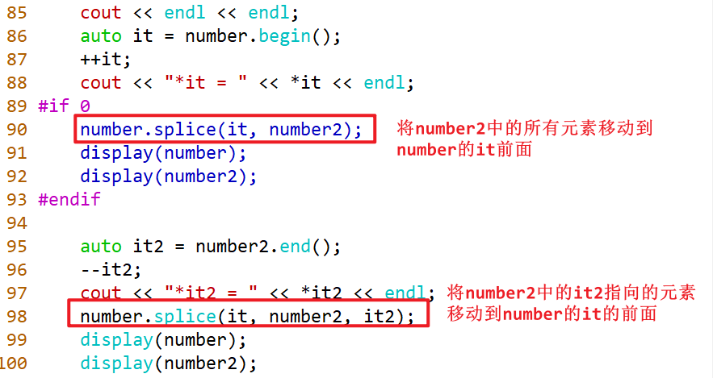
>
> 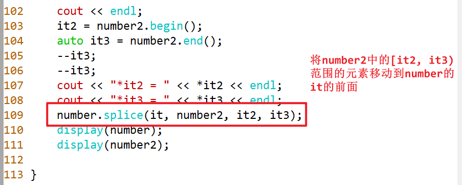

> [!CAUTION]
> 如果在同一个链表中进行 `splice`，要避免源范围和目标位置发生不合理交叉。

如果在同一个链表中进行 `splice` 操作：

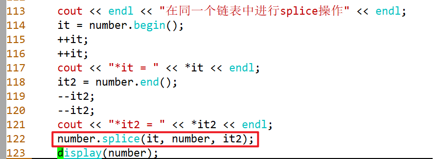

**但是也可能会出现问题（取决于范围有没有交叉）**

可以类比 `strcpy` / `memcpy`：源范围和目标范围不应发生会破坏语义的交叉。

> 补充：
>
> splice函数可以帮助我们很方便地实现LRU(Least Recently used)
>
> **LRU:最近最少使用算法**
>
> 一种常用的页面置换算法，用于在有限的内存空间中管理数据缓存，以提高系统性能。
>
> LRU 算法基于一个假设：如果一个数据在最近一段时间内没有被访问，那么在未来它被访问的概率也相对较低。因此，当内存空间不足时，LRU 算法会选择淘汰最近最少使用的数据，为新的数据腾出空间。
>
>
>
> ```cpp
> 思想：新元素放在前面，老的元素放在后面
> 比如现在有 1 2 3 4 四个元素逐一存到容器中，限制容量为4
>
> 刚存放完       插入元素3      插入元素5      插入元素4
> 4 3 2 1 ----> 3 4 2 1 ----> 5 3 4 2  ---> 4 5 3 2
>
> //假设现在插入元素2
> int number = tmp.back();
> tmp.pop_back();
> tmp.push_front(number);
>
>
> //如果明确了是用list存储，可以使用splice函数，
> tmp.splice(tmp.begin(), tmp, --tmp.end());
> ```
>

### 关联式容器

关联式容器包括：set、multiset、map、multimap四种。它们的底层使用的数据结构都是红黑树。要学习它们的使用，可以从：初始化、遍历、查找、插入、删除、针对自定义类型等方面进行学习。

> - set特征
>   存放的是key类型，key值是唯一的，不能重复
>   默认按照key值进行升序排列
> - multiset特征
>   存放的是key类型，key值不一定唯一，可以重复
>   默认按照key值进行升序排列
> - map的特征
>   存放的是key-value类型，key值是唯一的，不能重复，value没有要求是否唯一
>   默认按照关键字key进行升序排列
> - multimap的特征
>   存放的是key-value类型，key值不一定唯一，可以重复，value没有要求是否唯一
>   默认按照关键字key进行升序排列

#### set的使用

##### 构造

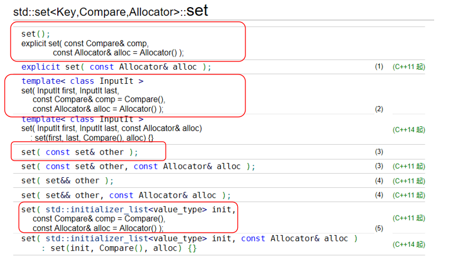

1. 无参构造

2. 迭代器方式进行构造，传入一个first迭代器，传入一个last迭代器

3. 拷贝构造

4. 标准初始化列表（大括号的形式）

##### 基本特征

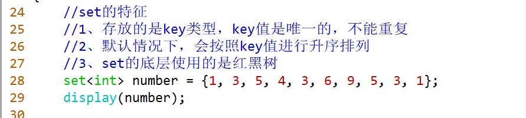

##### 查找

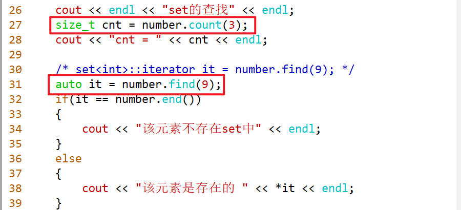

##### insert操作

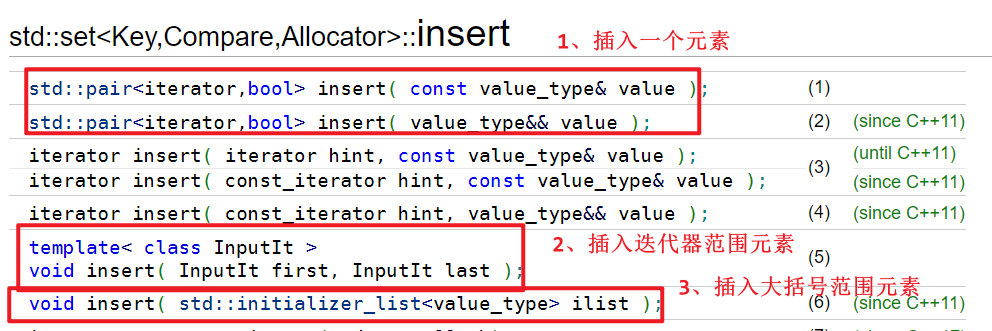

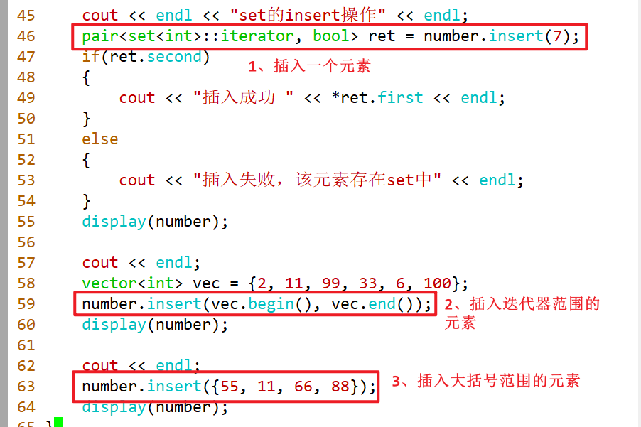

> [!NOTE]
> 关联式容器按键值组织元素，没有头部/尾部的概念，因此也没有头部插入/删除或尾部插入/删除函数。

##### erase操作

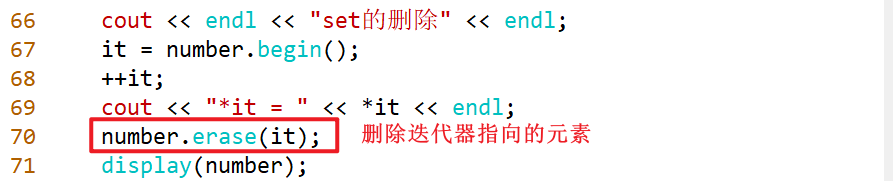

> [!CAUTION]
> `set` 不支持下标操作，因为没有 `operator[]`。

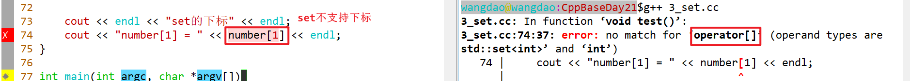

访问 `set` 元素只能通过迭代器方式，并且通过迭代器访问到的元素只能读，不能直接修改。

`set` 的元素不支持直接修改，因为修改后可能破坏红黑树中的排序关系。

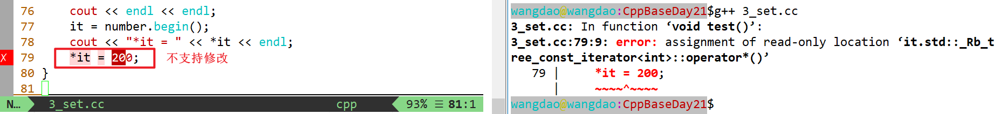

##### 针对自定义类型的写法（重要）

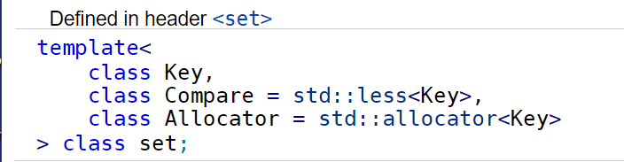

对于 `set` 而言，当 `Key` 是类类型时，第二个模板参数 `Compare` 默认采用 `std::less`。如果 `std::less` 不知道如何比较该类型，就需要提供比较规则。

常见方式有三种：特化比较模板、重载 `operator<`、提供自定义函数对象。

直接定义一个存放Point的set，编译一定会报错，根本原因在于默认的std::less针对Point对象并不知道该如何比较大小

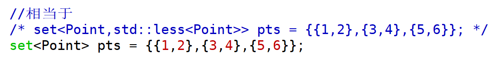
> std::less是一个通用模板类，针对解决不了的特殊类型，可以想到**特化模板**
>
> 为std::less准备一个特化版本，这个特化模板类中定义函数调用运算符重载函数，定义一套Point对象的比较规则
>
> 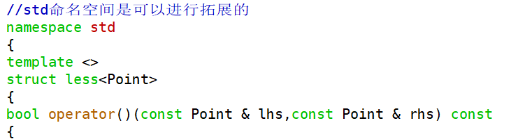

> 自定义对象的比较规则当然也是自定义的，例如：
>
> 定义getDistance获取点到原点的距离，先比较到原点的距离，如果相同再比较横坐标，如果相同再比较纵坐标。
>
> 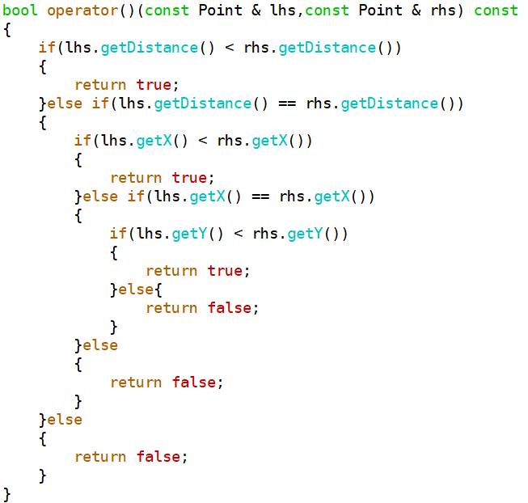

> [!CAUTION]
>
> 在 `operator()` 中需要访问 `Point` 的私有成员时，可以有两个思路：
>
> 1. 在自定义类中作相应的友元声明；
>
> 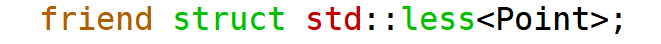
>
> 2. 给 `Point` 提供公有的 `get` 系列函数，间接访问私有数据成员。
>

> 函数调用运算符重载函数最好设为 `const` 成员函数。
>
> 因为在 C++17 中，std::set 要求比较对象必须是 **常量可调用** 的。模板参数列表中的class Compare在set的底层实现中会创建出对象，并作为函数对象使用，也就是调用operator()函数，这个函数需要是const成员函数。
>
> 这涉及了set的内部实现的版本演变，此处不做探究。
>
> 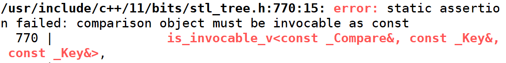
>
> 参考std::less的operator()函数
>
> 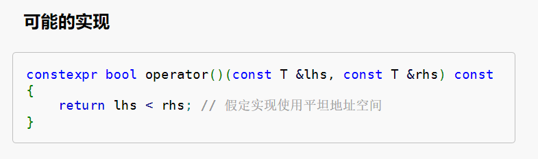

> 当然，如果让std::less通用模板知道Point对象该怎么比较大小可以做到吗？当然可以，使用**运算符重载**就行。
>
> operator<以友元方式重载
>
> 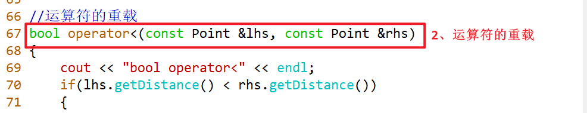

> [!NOTE]
> 在这个场景下，如果 `std::less` 特化和 `operator<` 同时存在，`std::less` 特化会优先被使用。

> 上面两种方法都是围绕着std::less想办法，我们也可以自己准备Compare类（类似于智能指针的删除器，也可以理解为自定义比较器）
>
> Compare类重载函数调用运算符，set的底层实现中使用Compare类对象作为**函数对象**，以此指示元素的排序。
>
> 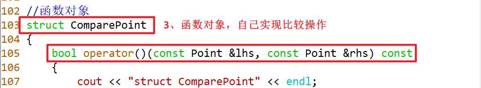

#### multiset的使用

##### 基本特征

包含于`<set>`头文件

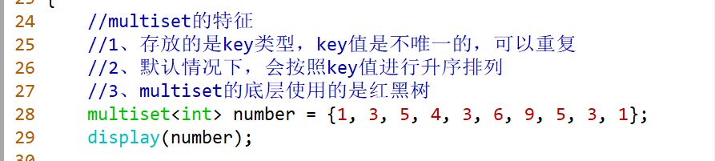

##### 其他功能

multiset的查找功能（count、find）、插入功能（insert）、删除功能（erase）与set是一样的。

multiset也没有下标操作，也同样不支持使用迭代器修改元素。

##### bound系列函数

> [!NOTE]
> `equal_range` 返回的范围仍然是前闭后开区间 `[first, last)`。

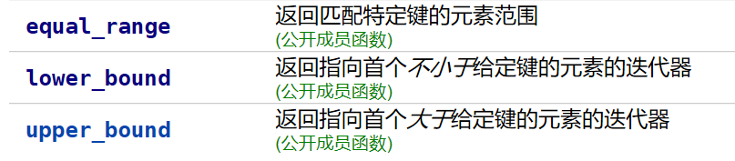
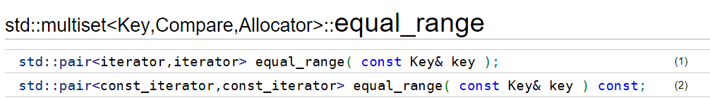
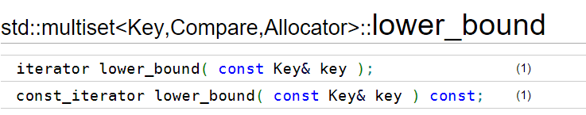
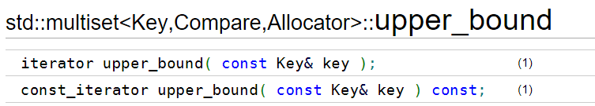
> 如下，可以用两种方式找出multiset中所有等于key的元素
>
> 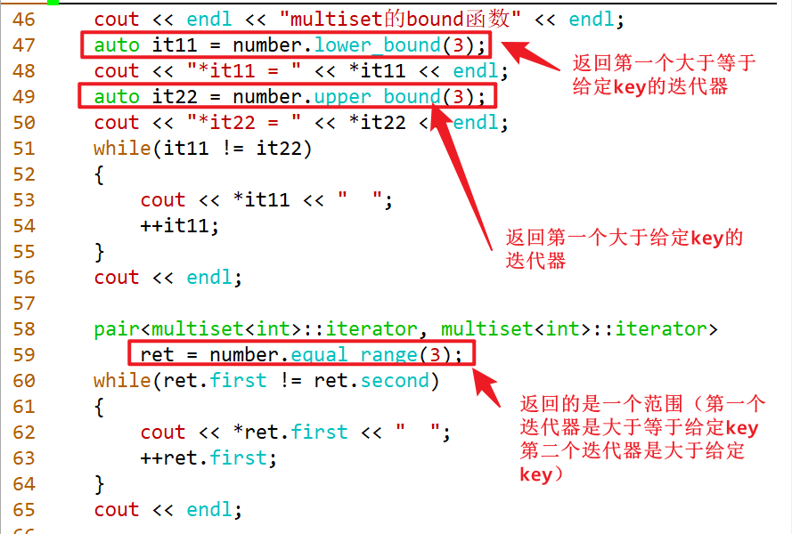

##### 针对自定义类型

multiset针对自定义类型的用法与set完全一样，也有三种形式：模板的特化、函数对象的形式、运算符重载。

#### map的使用

##### 基本特征

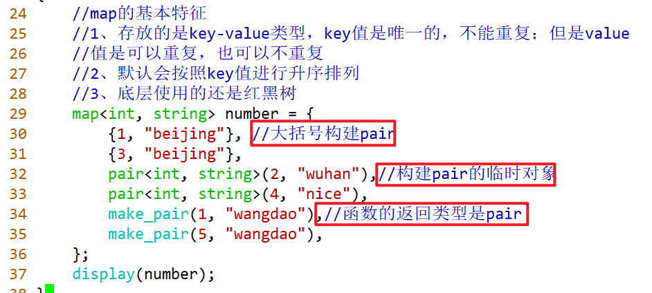

##### 查找

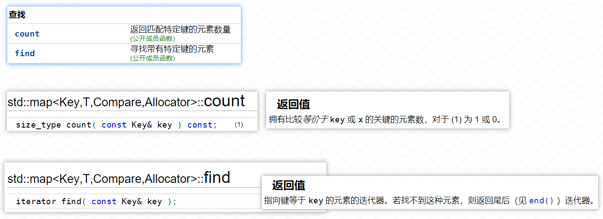
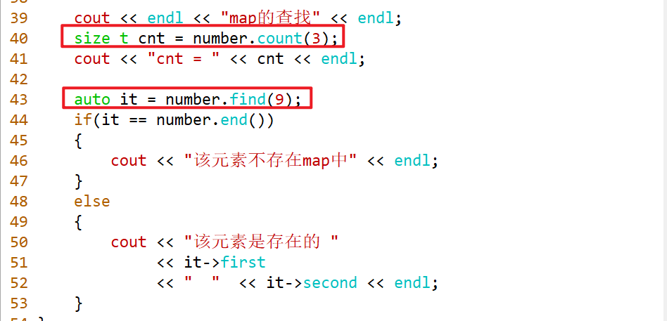

##### insert操作

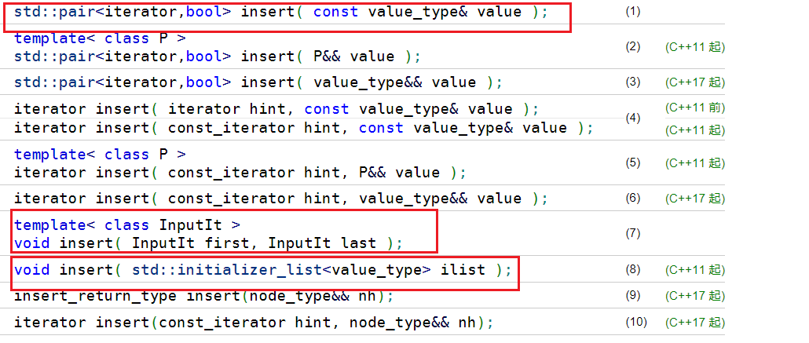

map也有三种插入的方式，插入一个元素、插入迭代器范围的元素、插入大括号范围的元素。

> [!NOTE]
>
> `map` 插入的是一个或多个 `pair`，不是单独插入 `key` 或 `value`。
>
> 插入单个元素可能失败，例如对应 `key` 已经存在。
>
> 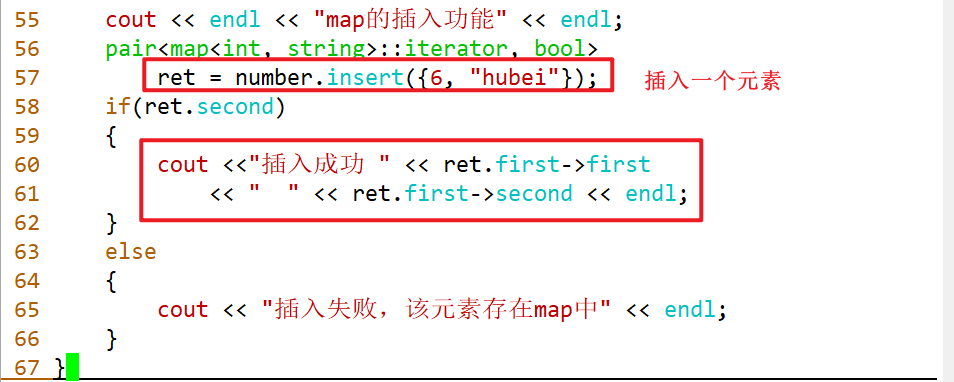

##### erase操作

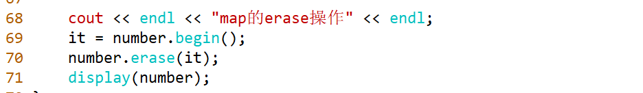

`map` 可以按 `key` 删除，也可以删除迭代器指向的元素或迭代器范围内的元素。

##### 下标操作（重要）

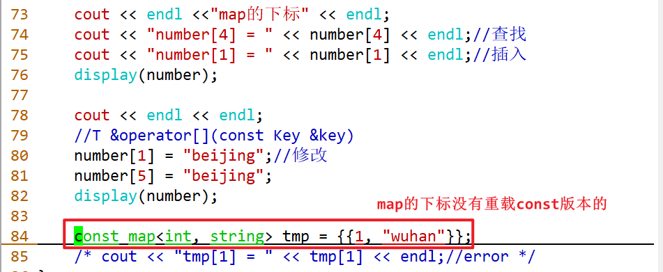

##### 针对自定义类型

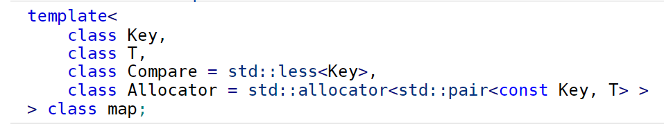

> 如果key本身是可比较类型，value是自定义类型，其实不需要额外的操作，map可以正常进行遍历。
>
> 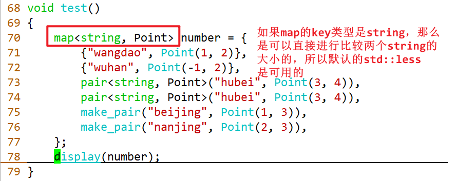

> [!CAUTION]
> 使用 `map` 下标操作时，如果传入不存在的 `key`，会把这个新 `key` 和 `value` 的默认值组合成 `pair` 插入到 `map` 中。

这要求 `value` 对应的类型能够产生默认值。

> 如果Key对应的是自定义类型
>
> 之前写的函数模板可以遍历前面五种容器的元素，但是map不行
>
> 因为map的元素都是pair，而pair不能直接用输出流运算符进行输出。
>
> 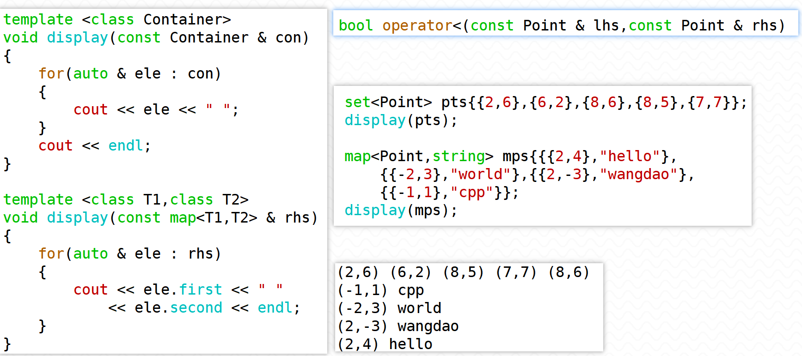
>
> 此时有两个display构成函数模板的重载，第一个适用于任意的容器类型，第二个专门用于map类型;
>
> 在调用display时会首先尝试调用第二个，如果能匹配则使用，如上图的`mps`是一个map对象，正好可以使用;
>
> 如果不能匹配则尝试调用其他的display模板，如上图的`pts`显然是无法匹配map<T1,T2>的，所以无法使用第二个模板，当然如果想要使用第一个函数模板，还需要为Point重载输出流运算符。

上述讨论仅仅是解决map元素的遍历问题，想要成功完成创建，仍然要让编译器能够根据key值给map的元素排序。

给Point重载<运算符，或者针对Point特化std::less，代码都可以直接通过。

> 但如果用的是函数对象的方法，在遍历时还需要一点改动。
>
> 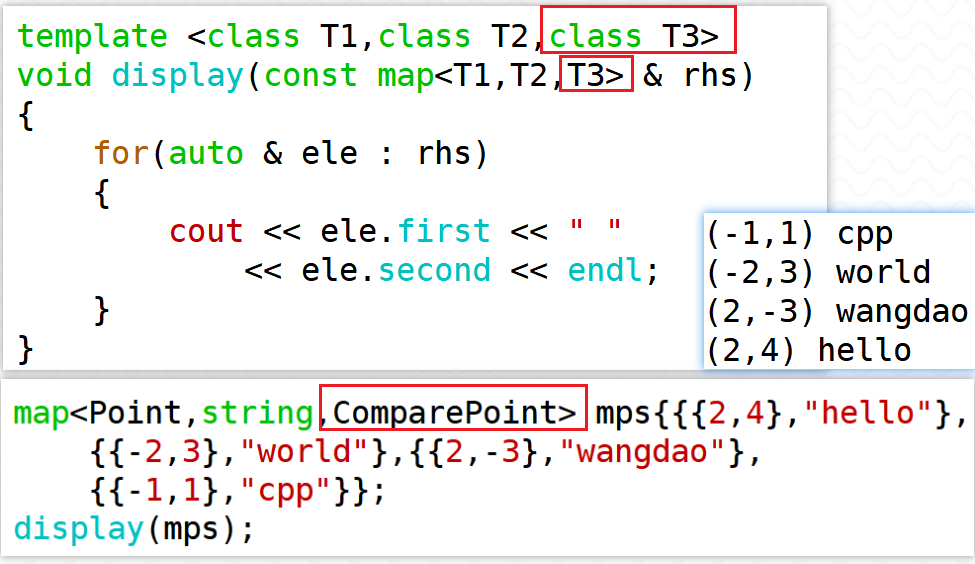
#### multimap的使用

##### 基本特征

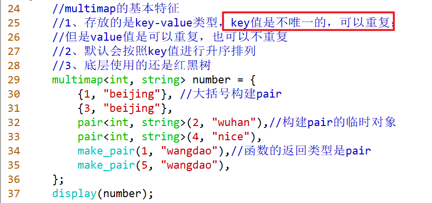

##### 其他操作

multimap的查找功能（count、find）、插入功能（insert）、删除功能（erase）与map是一样的。

##### 不支持下标

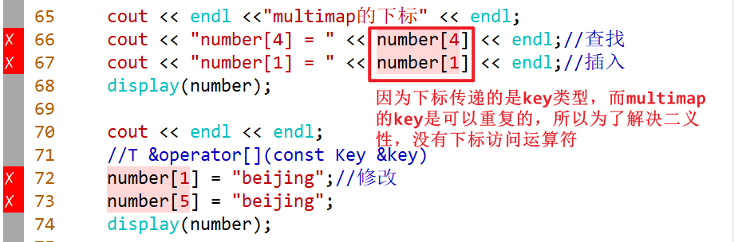

##### 针对自定义类型

使用方式与map完全一样。

#### 总结

1. 关联式容器中的元素会按照 `key` 排序。

2. 关联式容器底层通常使用红黑树。

3. `map` 支持下标操作，其他三种关联式容器没有下标操作。

### 无序关联式容器

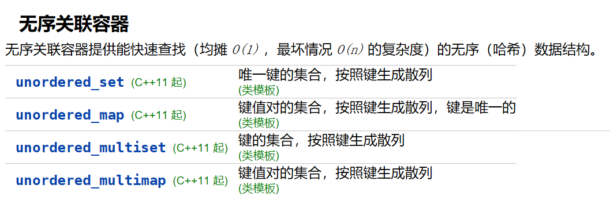
无序关联式容器底层是哈希表实现的。

首先来回顾一下哈希表

#### 哈希相关的概念

哈希(过程)：

1. 哈希是一种可以接受各种类型、大小的输入，输出一个固定长度整数的过程。
2. 你可以将哈希理解成一种特殊的映射，将一个理论无限的集合A映射到有限整数集合B上。

**哈希函数**：哈希函数是哈希过程的核心，它决定了哈希映射过程的规则。

**哈希冲突**：哈希是一种“化无限为有限”的映射。理想情况下，不同输入应该得到不同输出，相同输入必须得到相同输出。但由于输出范围有限，实际中允许出现多对一，也就是不同输入得到相同输出；绝不能出现一对多，也就是相同输入得到不同输出。

若映射中出现多对一，就是哈希冲突。哈希冲突可以减少，但绝不可能没有。

可以通过key找到在表中的位置

```cpp
index = H(key)
```

> **如何构建哈希函数**
>
> 定址法： H(key) = a * key + b
> **平方取中法**： key^2 = 1234^2 = 1522756 ------>227
> 数字分析法：H(key) = key % 10000;
> 除留取余法：H(key) = key mod p (p <= m, m为表长)

哈希函数之所以要设计得这么复杂，就是为了尽量减少哈希冲突

不同的key值所对应的位置一样，这就是哈希冲突

```cpp
key1 != key2
H(key1) = H(key2)
```

##### 如何解决哈希冲突

开放定址法
**链地址法**（STL 常见实现使用这种方式）
再散列法
建立公共溢出区

链地址法：

如下，假设有19 1 23 37 68 55 11  14 86这些元素，表长为11

19 mod 11 = 8，挂载在下标8位置

1 mod 11 = 1，挂载在下标1位置;23 mod 11 = 1，用链表的形式挂在元素1的后面

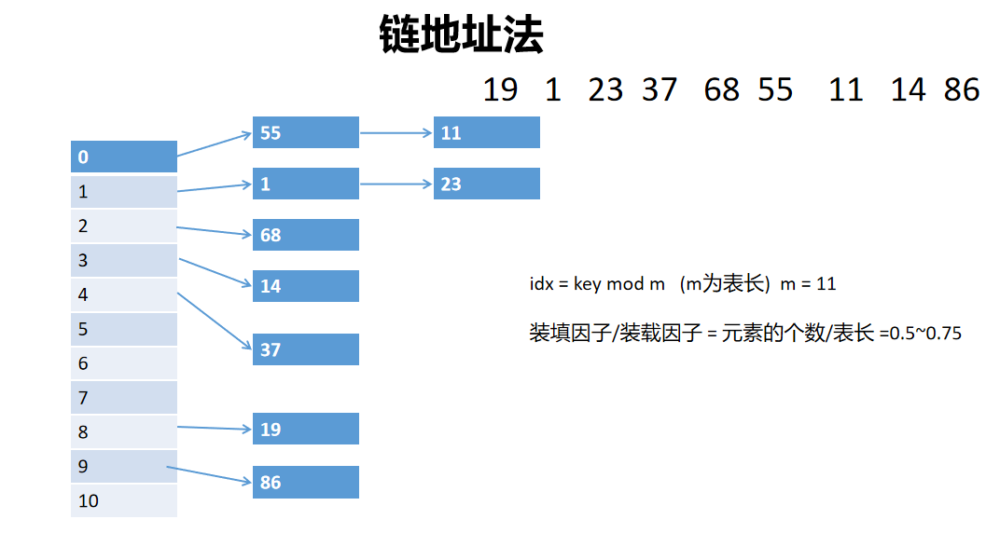

那么表长应该如何设计比较合理？比如说针对上面这点元素，我准备一个容量为1000的表，选择一种哈希函数，能够让出现冲突的概率很低，但是又显得没有必要（为10个元素准备长度为1000的表，太浪费了）

这里还涉及一个概念：装载因子，也叫装填因子。

装载因子a = 元素的个数/表长，一般是一个小于1的小数。（因为如果大于1，代表着元素个数大于表长，那肯定会有哈希冲突，太小的表长显然不够）

装载因子越大，空间利用率越高，但冲突概率也越大；装载因子越小，冲突概率越低，但空间利用率也越低。实际使用中需要权衡。

#### unordered_set的使用

unordered_set在使用时除了元素的类型，还需要关注几个模板参数

`Hash` 决定使用什么哈希函数，通过 `Hash` 类的 `operator()` 确定；哈希冲突的解决方式由容器内部实现机制决定。

`KeyEqual` 决定元素判等方式，同样通过 `operator()` 确定。

对于内置类型和指针类型，可以直接使用这一容器，如果是自定义类型对象作为元素，则需要为其准备这些模板参数。

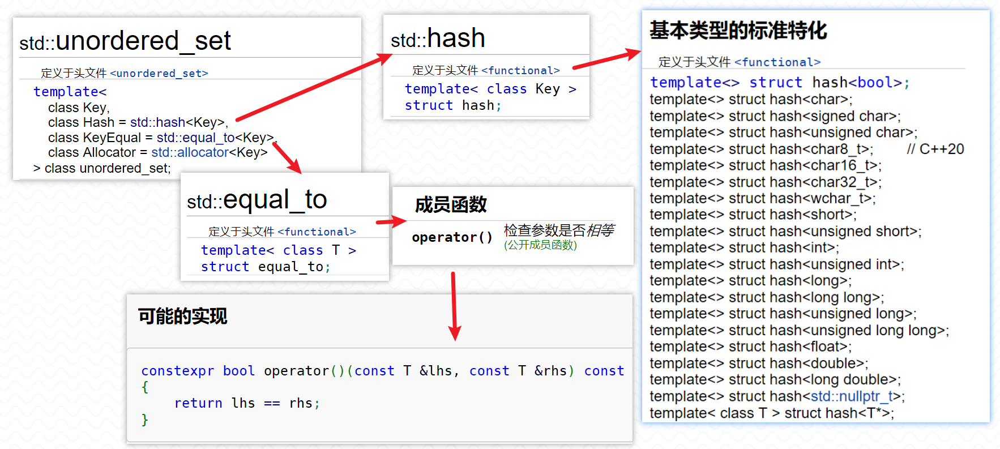
##### 基本特征

创建unorder_set的方式和之前的容器没有多大区别。

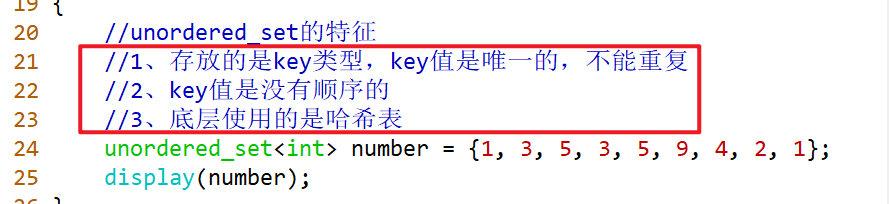

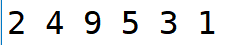
无序 + 去重的效果

##### 其他操作

unordered_set的查找（count、find）、插入（insert）、删除（erase）等常用操作与set完全一样。也不支持下标。

##### 针对自定义类型（重要）

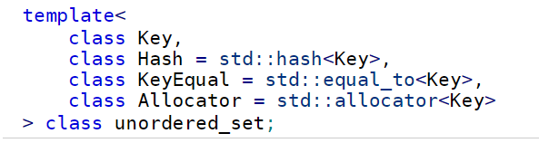

针对自定义类型而言，可能需要改写第二个模板参数Hash与第三个模板参数KeyEqual。

> Hash的默认采用的是std::hash，所以可以改写的方案有两种：模板的特化、函数对象的形式，与运算符重载没有什么关系。
>
> 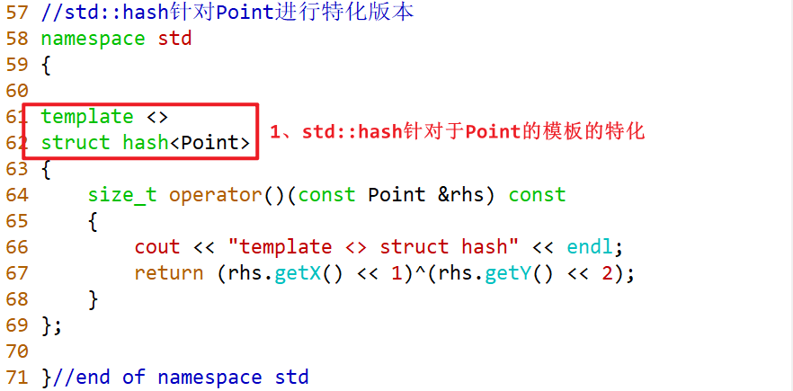
>
> **如图，对横纵坐标分别进行左移再异或，其本质实际就是任意设计出一套哈希函数。**
>
>
>
> 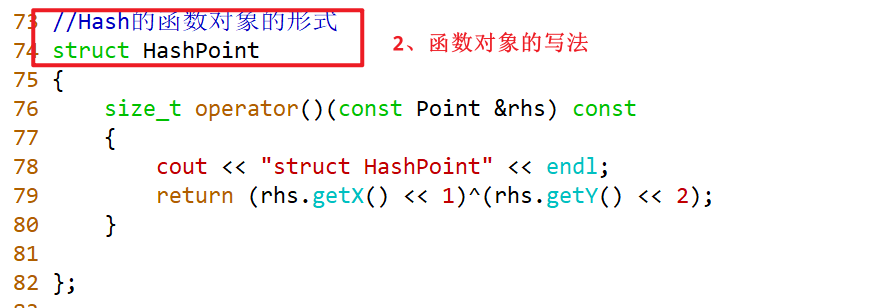

> 第三个模板参数KeyEqual的传参有三种方式：模板的特化、函数对象的形式、运算符重载。
>
> [!TIP]
> 在 `operator()` 中加打印语句，可以观察哈希函数和判等函数的调用次数，从而理解什么时候会用上 `equal_to` 函数对象。
>
> 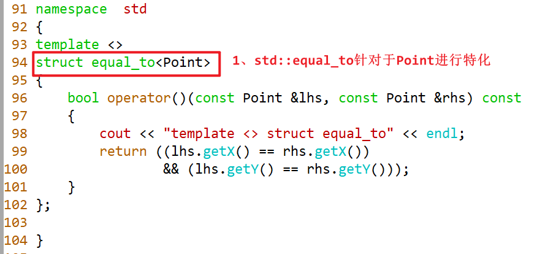
>
> 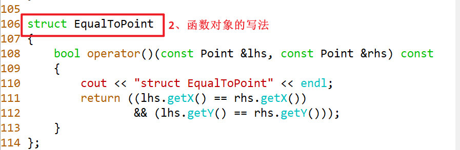
>
> 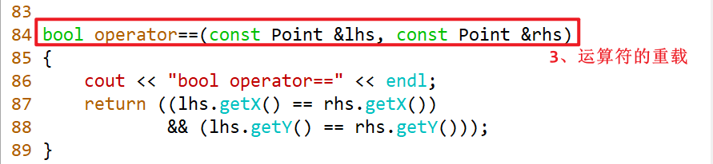

#### unordered_multiset的使用

##### 基本特征

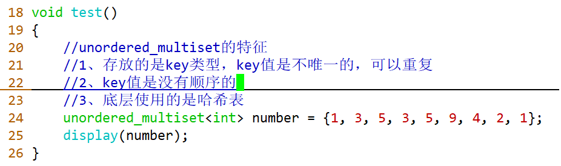

##### 其他操作

unordered_multiset的查找（count、find）、插入（insert）、删除（erase）与multiset完全一样。也不支持下标。

##### 针对自定义类型

unordered_multiset针对自定义类型的写法与unordered_set的用法一样，需要改写第二个参数Hash与第三个参数KeyEqual。

#### unordered_map的使用

##### 基本特征

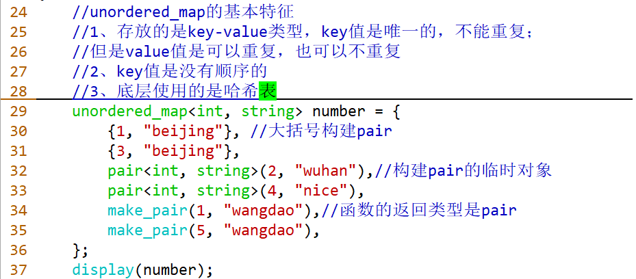

##### 其他操作

unordered_map的查找（count、find）、插入（insert）、删除（erase）与map是完全一样的。

##### 支持下标（重要）

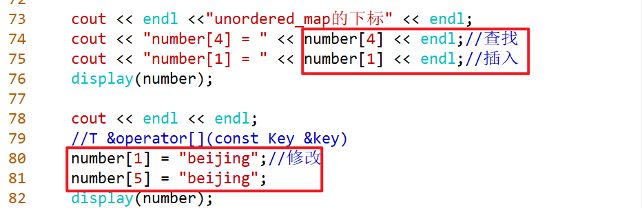

#### unordered_multimap的使用

##### 基本特征

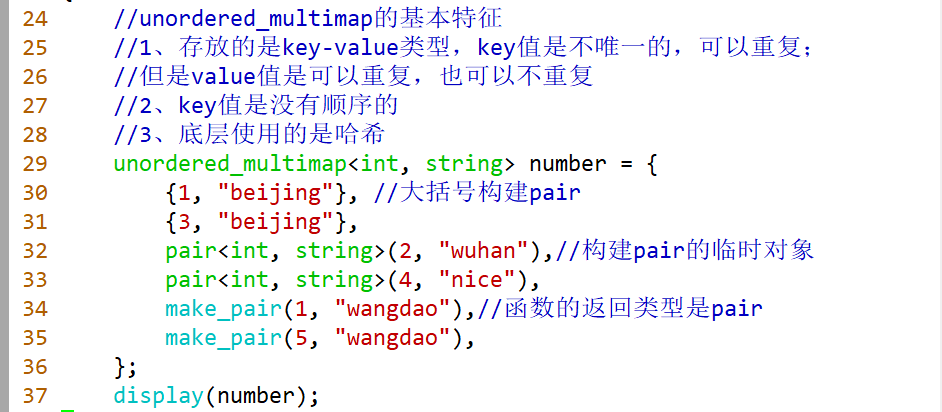

##### 其他操作

unordered_multimap的查找（count、find）、插入（insert）、删除（erase）与multimap是完全一样的。

##### 不支持下标

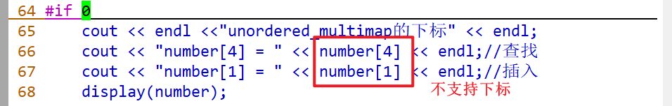

#### 总结

1. 无序关联式容器中的元素没有稳定排序顺序。

2. 底层通常使用哈希表。

3. `unordered_map` 支持下标操作，其他三种无序关联式容器不支持下标操作。

### 容器的选择（重要）

**元素是不是有顺序的**

如果元素是有顺序的，首选的是关联式容器，不应该选择的是无序关联式容器。其次可以选择序列式容器。

序列式容器中的元素也可以排序，list中是有sort函数的，对于vector与deque可以借鉴算法库中的sort函数进行排序。

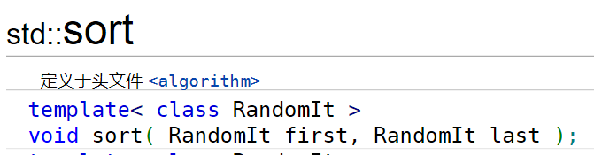
**迭代器的类型**

随机访问迭代器：vector、deque

双向迭代器：list、关联式容器

前向迭代器：无序关联式容器

**查找的时间复杂度**

序列式容器：时间复杂度O(N)

关联式容器：时间复杂度O(logN)

无序关联式容器：时间复杂度O(1)

**是否支持下标**

序列式容器：vector、deque

关联式容器：map

无序关联式容器：unordered_map

### 容器适配器

容器适配器的作用其实可以理解为是对序列式容器进行封装，使其表现出特定的行为和接口，以满足不同的应用需求。

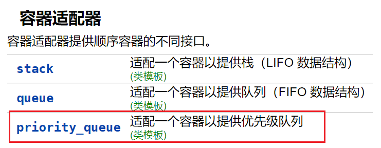
栈(stack)

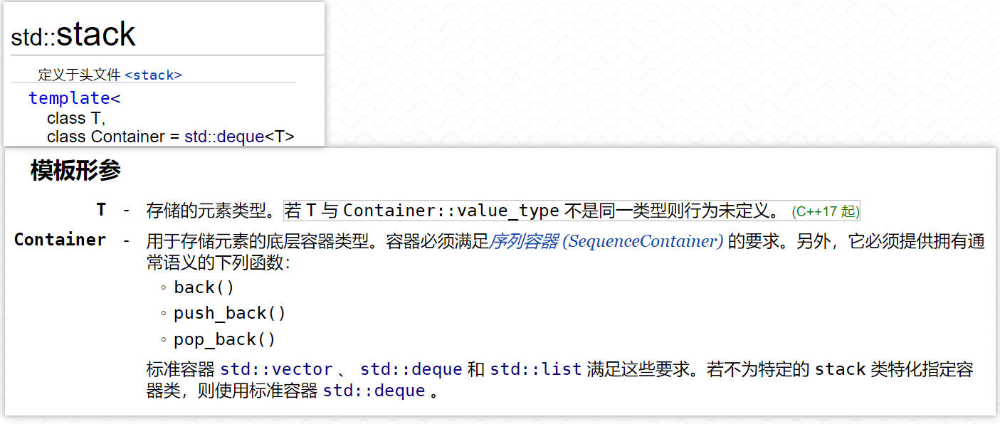
队列(queue)

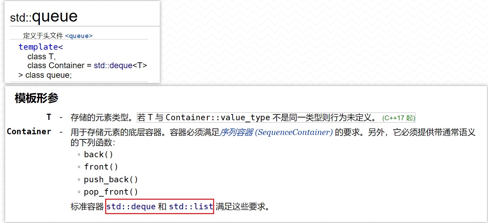
#### 优先级队列

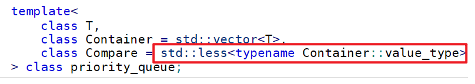

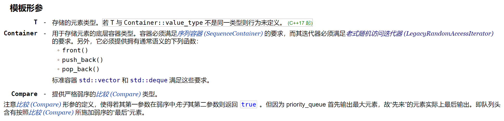

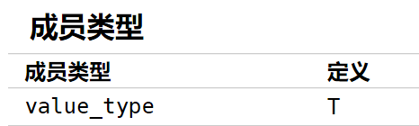
对于vector或者deque，value_type就是T，即priority_queue的Compare要提供的是对容器中元素的比较方式。

##### 基本使用方法

对优先级队列的元素进行遍历，以前常用的几种方式都不支持（下标、迭代器、增强for循环）

参考C语言中对栈或者队列中元素遍历的方式

以下的遍历实际上是清空式的遍历，遍历完后优先级队列实际上没有元素了。如果不想进行清空式的遍历，可以在遍历之前先复制一次priority_queue

> 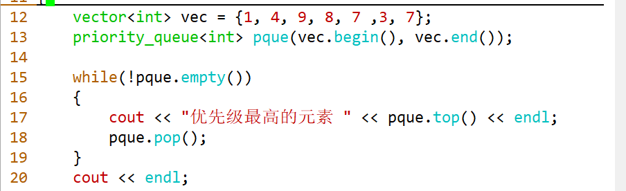
>
> 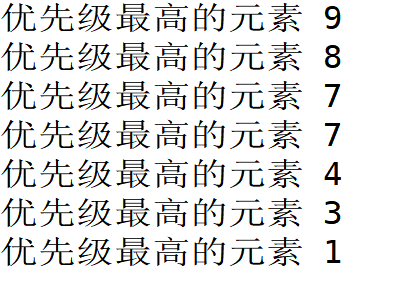
> 默认的compare是std::less，最终呈现的效果为什么是从大到小，而不是从小到大呢？
>
> 稍微修改一下代码，往空的优先级队列添加元素，观察填充过程
>
> 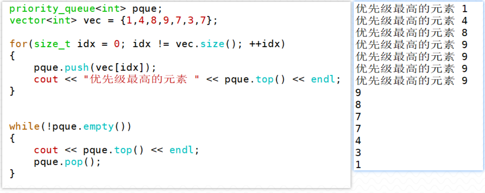
优先级队列使用了大根堆，其过程：

当有元素插入的时候，会将该元素与堆顶进行比较（细节上实际是一级一级比较），如果堆顶比新插入的元素要小，就会满足std::less，会将新插入的元素作为新的堆顶;

如果新插入的元素与堆顶进行比较，堆顶比新插入的元素要大，那么就不满足std::less，就不会进行置换，上一次的堆顶仍然是堆顶。

##### 使用函数总结

判空：empty;
元素的个数:size;
插入:push;
删除：pop;
获取top元素:top;
交换函数:swap;
注意，没有迭代器的概念。

##### 针对自定义类型

因为优先级队列的第三个模板参数使用的是Compare，默认值是std::less,所以如果自定义类型不能进行比较，就需要进行改写，改写的方案与set针对Compare的改写方式完全一样，有三种：模板的特化、函数对象的形式、运算符重载。

请尝试实现一下使用优先级队列存放Point对象。

## 迭代器

### 概念

可以把迭代器理解成“像指针一样访问元素的对象”。它不一定真的是指针，有些迭代器是类类型，只是重载了指针相关操作。

为什么 C++ 要设计迭代器？

迭代器是 C++ 中非常重要的抽象概念，意义在于：

- 为访问容器元素提供统一方式。例如 `vector`、`deque`、`list` 的底层结构完全不同，但都可以通过迭代器遍历。
- 让算法独立于容器实现。例如 `std::sort` 只要求传入随机访问迭代器，而不关心具体容器类型。

也就是说，C++ 通过迭代器把不同容器的访问逻辑抽象了出来。

### 迭代器的类型

输入迭代器(InputIterator)、输出迭代器(OutputIterator)、前向迭代器(ForwardIterator)、双向迭代器(BidirectionIterator)、随机访问迭代器(RandomAccessIterator)

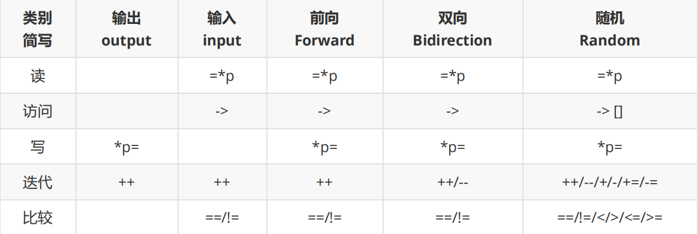
五种迭代器之间的关系（逻辑层面上近似于继承关系）

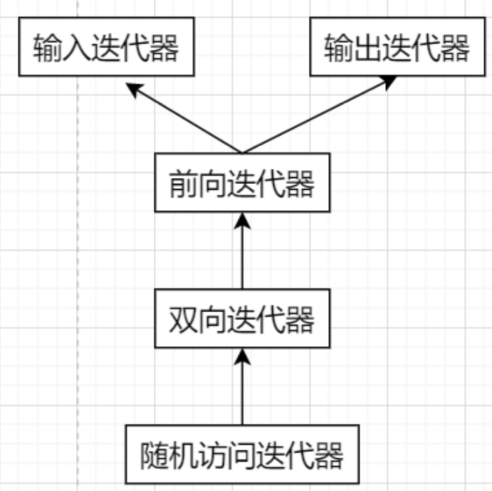
> 举个简单的例子，根据我们对继承关系的了解，我们可以推测出：
>
> 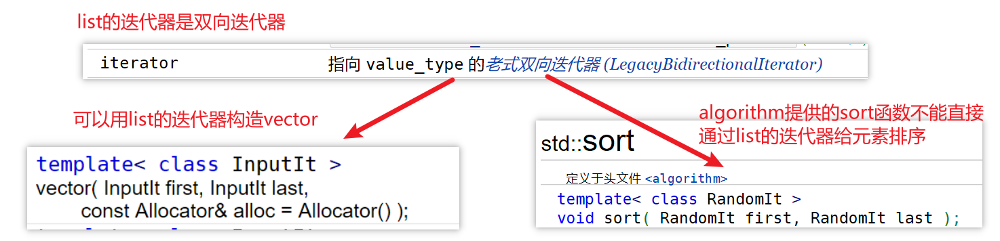

为什么要定义这么多种迭代器呢？

为了物尽其用，使得具体的操作使用具体类型的迭代器，避免迭代器的功能太大或者太小，导致使用起来不方便。每个容器及其对应的迭代器的类型图表如下：

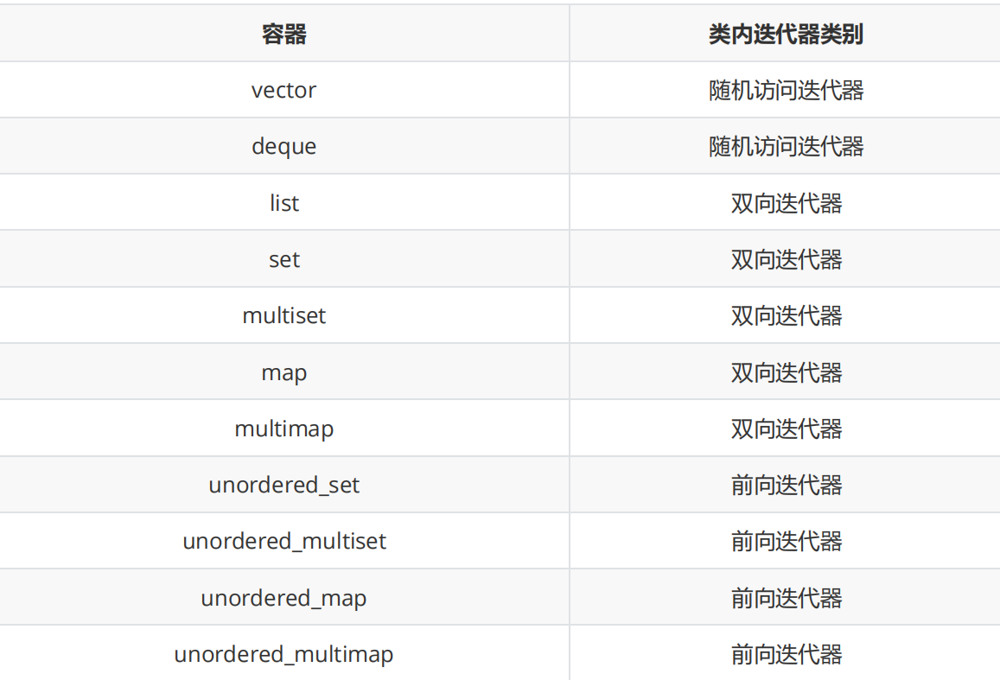
> **输入迭代器**（Input Iterator）
>
> - **特点**：用于读取容器中的元素，只能向前移动，支持自增操作（`++`）来指向下一个元素，可进行解引用（`*`）操作来访问当前元素的值，还能进行相等（`==`）和不等（`!=`）比较以判断两个迭代器是否指向同一位置。
> - **应用场景**：常用于只读算法，如 `std::find`、`std::count` 等，这些算法只需要从容器中读取元素，不需要修改元素的值。
>
>
>
> **输出迭代器**（Output Iterator）
>
> - **特点**：用于向容器中写入元素，只能向前移动，支持自增操作（`++`），可通过解引用（`*`）操作来修改元素的值，但不能读取元素的值。输出迭代器不支持比较操作。
> - **应用场景**：常用于输出算法，如 `std::copy` 算法可以将一个范围的元素复制到另一个由输出迭代器指定的位置。
>
>
>
> **前向迭代器**（Forward Iterator）
>
> - **特点**：结合了输入迭代器和输出迭代器的功能，既能读取又能写入元素，并且可以多次读取同一个元素。它可以向前移动，支持自增操作（`++`），也支持解引用（`*`）操作，还能进行相等（`==`）和不等（`!=`）比较。
> - **应用场景**：适用于需要对容器元素进行读写操作，且只需要单向遍历容器的场景，例如对单链表的遍历和操作。
>
>
>
> **双向迭代器**（Bidirectional Iterator）
>
> - **特点**：在向前迭代器的基础上，增加了向后移动的功能，支持自减操作（`--`），可以方便地在容器中前后移动，进行元素的访问和修改。
> - **应用场景**：常用于需要双向遍历容器的算法，如 `std::reverse` 算法用于反转容器中元素的顺序，就需要双向迭代器来从两端向中间进行元素交换。
>
>
>
> **随机访问迭代器**（Random Access Iterator）
>
> - **特点**：具有最强的功能，除了支持双向迭代器的所有操作外，还支持随机访问元素，就像数组下标访问一样，可以通过偏移量直接访问容器中的任意元素。支持加法（`+`）、减法（`-`）操作来计算迭代器之间的距离，也支持比较操作（`<`、`>`、`<=`、`>=`）来判断两个迭代器的相对位置。
> - **应用场景**：适用于需要快速随机访问元素的算法，如 `std::sort` 算法对容器中的元素进行排序，通常要求迭代器具有随机访问能力，以便高效地进行元素的比较和交换。

> [!IMPORTANT]
> 迭代器是访问容器元素的统一手段。大多数时候不需要研究具体实现，只需要知道当前容器支持哪种迭代器能力。

### 流迭代器

#### 输出流迭代器

流迭代器是特殊的迭代器，其作用有：

（1）可以将输入/输出流作为**容器**看待(因为输入输出流都有**缓冲区**的概念，也可以视为存一些数据)，流迭代器可以用来访问输入输出流这种"容器"中的数据。

（2）STL 中有许多算法都是基于迭代器设计的，输入流迭代器和输出流迭代器使得这些算法能够直接应用于输入输出流。因此任何接受迭代器参数的算法都可以和流一起工作。

先通过cpp参考文档看到输出流迭代器构造函数的说明：

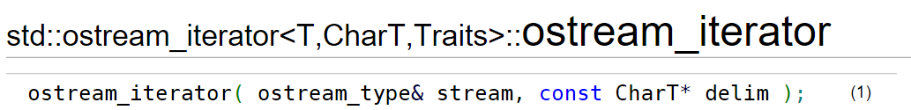
> 尝试使用一下输出流迭代器，如下（使用了algorithm提供的copy函数）
>
> 最常用的一种使用方式：使用 `std::copy` 算法通过输入流迭代器从文件中读取数据，然后通过输出流迭代器将数据输出到控制台，就像操作普通容器一样。
>
> 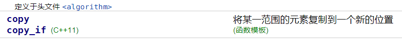
>
> 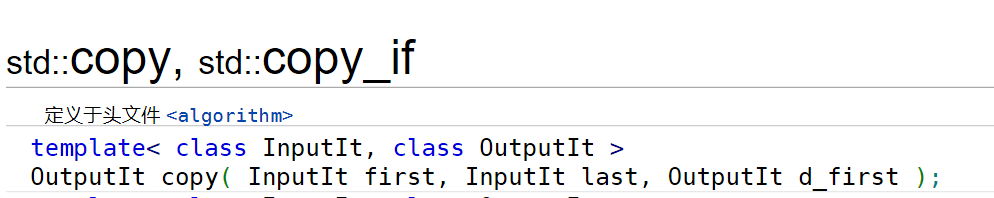
>
>
>
> 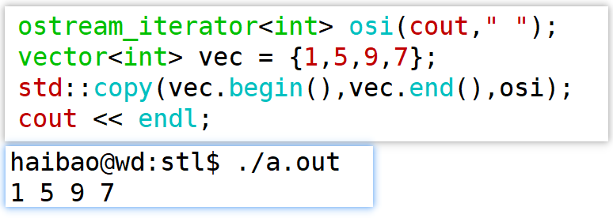
>
> 其实结果很容易推测出来。至此，我们发现又多了一种遍历容器元素的方式，那么这个输出的效果是怎么实现的呢？
>

—— 通过源码来认识。

输出流迭代器的类模板形式：

```cpp
template <class _Tp,
          class _CharT = char, class _Traits = char_traits<_CharT> >
class ostream_iterator
{
    //根据上述例子中的构造方式
    //__s = cout;
    // __c = " ";
    //_M_stream = &cout;
    //_M_string = "  "
    ostream_iterator(ostream_type& __s, const _CharT* __c)
    : _M_stream(&__s)
    , _M_string(__c)
    {}

    ostream_iterator<_Tp>& operator*() { return *this; }
    ostream_iterator<_Tp>& operator++() { return *this; }
    ostream_iterator<_Tp>& operator++(int) { return *this; }

    ostream_iterator<_Tp>& operator=(const _Tp& __value)
    {
        *_M_stream << __value;//cout << 1
        if (_M_string) *_M_stream << _M_string;//cout << "  "
        return *this;
    }

private:
  ostream_type* _M_stream;
  const _CharT* _M_string
};
```

copy函数的实现（cpp参考文档相关页直接给出）

```cpp
template<class InputIt, class OutputIt>
OutputIt copy(InputIt first, InputIt last, OutputIt d_first)
{
    while (first != last) {
        *d_first++ = *first++;
    }
    return d_first;
}
```

以上述例子为参考进行分析

```cpp
//copy(vec.begin(), vec.end(), osi);
//first = vec.begin();
//last = vec.end()
//d_first = osi
OutputIt copy(InputIt first, InputIt last, OutputIt d_first)
{
    while (first != last) {
        //需要查看ostream_iterator的后置++与解引用（相应的运算符重载函数）
        *d_first++ = *first++;//++优先级高于解引用
    }
    return d_first;
}

//******分析过程**********
osi = 1 //ostream_iterator调用operator=函数
        last
1 5 9 7
f ------> f
```

#### 输入流迭代器

有了输出流迭代器的基本认知后，我们再来看看输入流迭代器

首先是它的构造函数

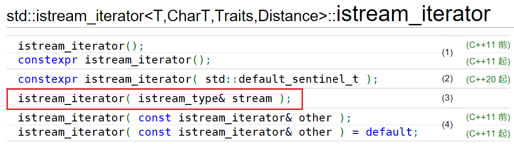
可以利用一个通用输入流对象初始化istream_iterator

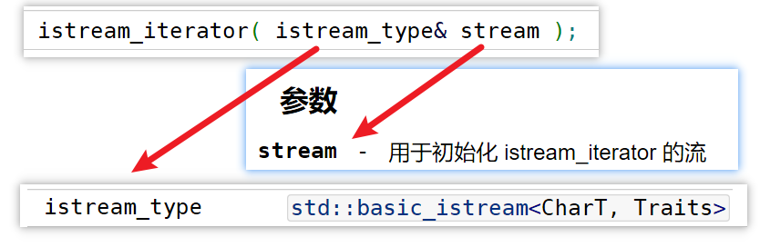
根据推测可能写出这样的代码，但是会出现段错误

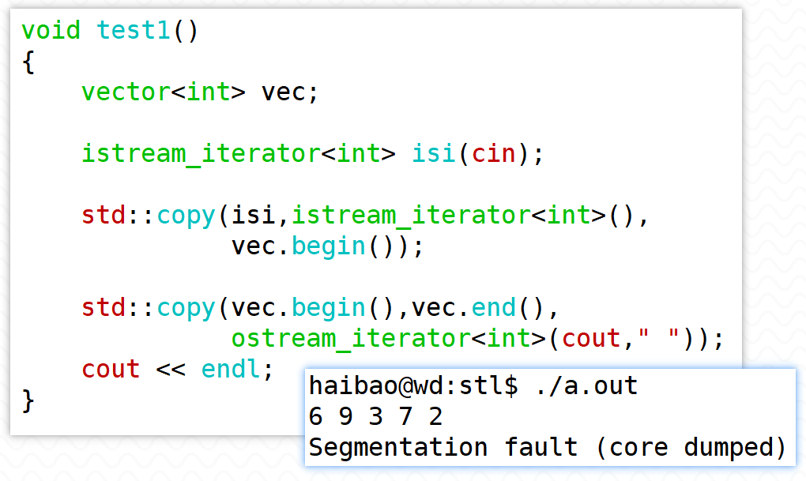
正确使用（用到了一个函数back_inserter）

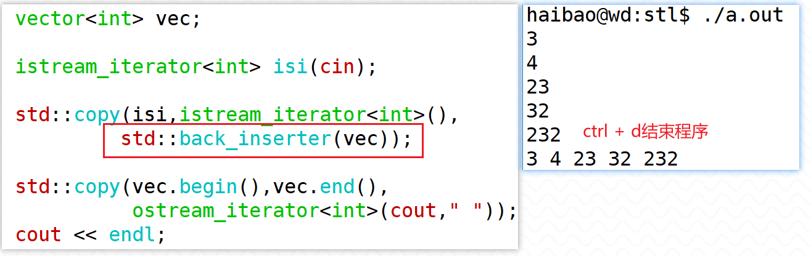
通过源码进行理解

```cpp
template <class _Tp,
          class _CharT = char, class _Traits = char_traits<_CharT>,
          class _Dist = ptrdiff_t>
class istream_iterator
{
    //无参构造
    istream_iterator()
    : _M_stream(nullptr)
    , _M_ok(false) {}

    //接收一个输入流对象的构造函数
    //__s = cin;
    //_M_stream = &cin;
    istream_iterator(istream_type& __s)
    : _M_stream(&__s)
    {
        _M_read();
    }

    void _M_read()
    {
        _M_ok = (_M_stream && *_M_stream) ? true : false;
        if (_M_ok)
        {
            *_M_stream >> _M_value;//cin >> _M_value;
            //输入流的状态为goodbit，则_M_ok = true
            _M_ok = *_M_stream ? true : false;
        }
    }

    bool _M_equal(const istream_iterator& __y) const
    {
        return (_M_ok == __y._M_ok) && (!_M_ok || _M_stream == __y._M_stream);
    }

    istream_iterator operator++(int)
    {
        istream_iterator __tmp = *this;
        _M_read();
        return __tmp;
    }

    reference operator*() const { return _M_value; }
private:
  istream_type* _M_stream;
  _Tp _M_value;
  bool _M_ok;
};

//isi._M_equal(__y);
inline bool operator!=(const istream_iterator& __x, const istream_iterator& __y)
{
  return !__x._M_equal(__y);
}

//例子中使用copy函数的语句
//std::copy(isi, istream_iterator<int>(), std::back_inserter(vec));

// first = isi;
//last = istream_iterator<int>()
//d_first = std::back_inserter(vec)
OutputIt copy(InputIt first, InputIt last, OutputIt d_first)
{
    while (first != last) { //两个输入流迭代器对象进行!=比较，其必然对!=符号进行了重载
        //*d_first++ = 上一次输入的值
        //d_first是back_inserter函数返回值，跳转查看back_inserter函数
        *d_first++ = *first++;   //first每次进行++操作，会进行一次输入，如果输入过程使得流对象状态进入非goodbit状态，就可以影响到_M_ok
    }
    return d_first;
}

template <class _Container>
inline back_insert_iterator<_Container> back_inserter(_Container& __x) {
  return back_insert_iterator<_Container>(__x);
}
```

back_insert_iterator的实现

```cpp
template <class _Container>
class back_insert_iterator {
protected:
  _Container* container;

    //container = &vec;
    explicit
    back_insert_iterator(_Container& __x)
   : container(&__x)
   {}

   back_insert_iterator<_Container>& operator=(const typename _Container::value_type& __value)
   {
    container->push_back(__value);
    return *this;
  }

    back_insert_iterator<_Container>& operator*() { return *this; }
  back_insert_iterator<_Container>& operator++() { return *this; }
  back_insert_iterator<_Container>& operator++(int) { return *this; }
};
```

### 迭代器适配器

#### 三组插入迭代器适配器（掌握）

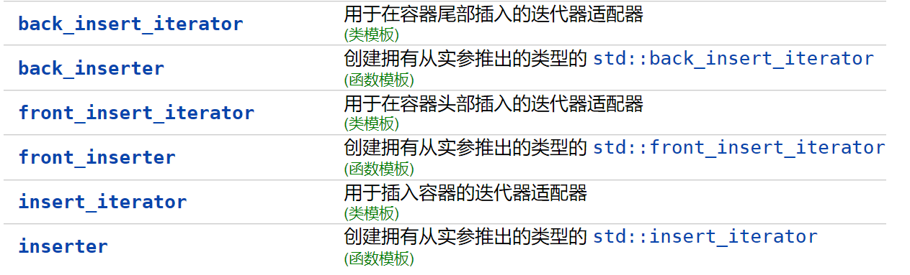
back_inserter是函数，该函数的返回类型是back_insert_iterator，它们的底层会调用容器的push_back。

front_inserter是函数，该函数的返回类型是front_insert_iterator，它们的底层会调用容器的push_front。

inserter是函数，该函数的返回类型是insert_iterator，它们的底层会调用容器的insert。

看一个简单的例子

要将list的元素插入到vector尾部，除了以往的常规方式（遍历list的元素，再使用vector的push_back函数添加这些元素），还可以使用上迭代器。

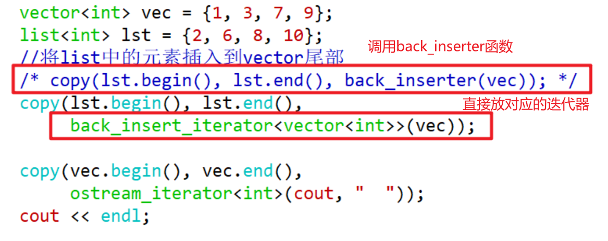
—— 再将vector的元素插入到list头部

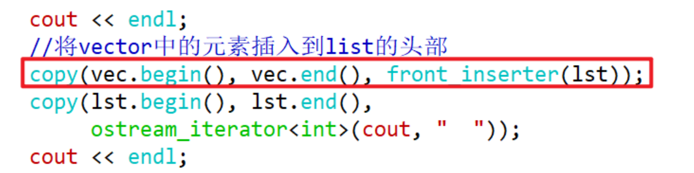
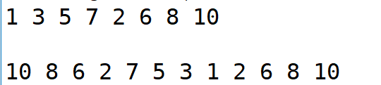
从得到的结果可以想到，执行的过程是从头到尾遍历vector的元素，然后一次次执行了push_front函数。、

那么，可不可以将list元素插入到vector头部呢？

```cpp
//std::copy(vec.begin(),vec.end(),front_inserter(lst));
//first = vec.begin()
//last = vec.end()
//d_first = front_insert_iterator<_Container>(lst)
template<class InputIt, class OutputIt>
OutputIt copy(InputIt first, InputIt last, OutputIt d_first)
{
    while (first != last) {
        *d_first++ = *first++;
    }
    return d_first;
}

template <class _Container>
inline front_insert_iterator<_Container> front_inserter(_Container& __x) {
  return front_insert_iterator<_Container>(__x);
}

template <class _Container>
class front_insert_iterator {
protected:
  _Container* container;
public:
  typedef _Container          container_type;
  typedef output_iterator_tag iterator_category;
  typedef void                value_type;
  typedef void                difference_type;
  typedef void                pointer;
  typedef void                reference;

  explicit front_insert_iterator(_Container& __x) : container(&__x) {}

  front_insert_iterator<_Container>& operator=(const typename _Container::value_type& __value) {
    container->push_front(__value);
    return *this;
  }
  front_insert_iterator<_Container>& operator*() { return *this; }
  front_insert_iterator<_Container>& operator++() { return *this; }
  front_insert_iterator<_Container>& operator++(int) { return *this; }
};
```

—— 将list的元素插入到set中

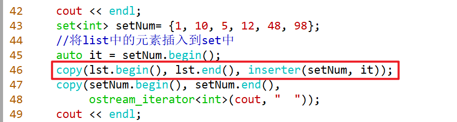

> [!CAUTION]
> 使用插入迭代器时，容器必须具备对应插入函数。例如 `back_inserter` 需要容器支持 `push_back`。

#### 反向迭代器适配器

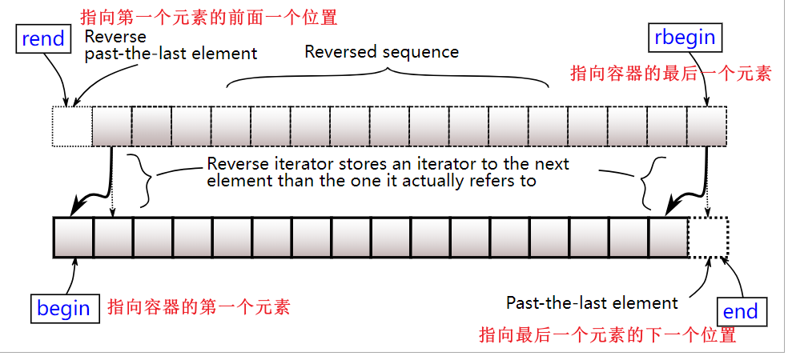

注意遍历时偏移的方式，仍然是自增

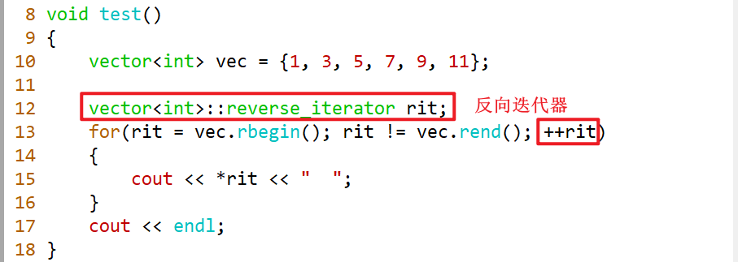

## 算法

### 特点

STL 算法库中的函数都是普通函数模板，不是某个容器类的成员函数。

### 分类

- 非修改式的序列算法 **for_each**、count、find
- 修改式的序列算法  **copy**、**remove_if**、remove、replace、fill
- 排序函数  **sort**
- 二分搜索的算法  lower_bound、upper_bound、equal_range
- 集合操作 **set_intersection**（取交集）
- 堆相关的函数  make_heap、push_heap
- 取最值  max、min
- 数值操作 iota
- 未初始化的内存操作  **uninitialized_copy**

### for_each函数的使用

首先看看cpp参考文档的描述

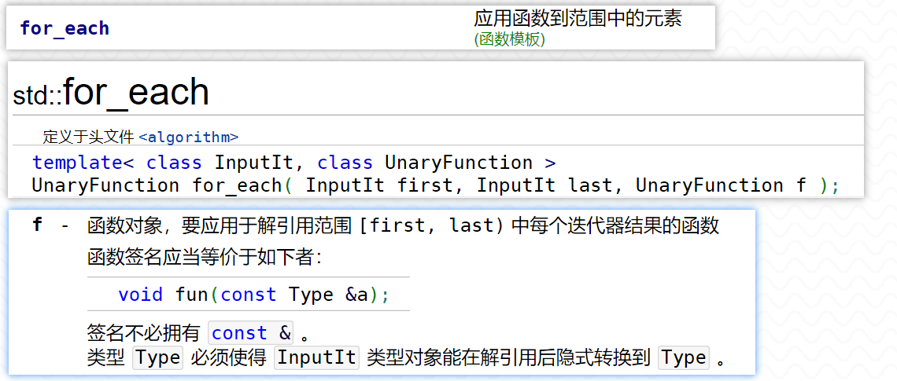
第三个参数需要传一个一元函数（或者仿函数），其函数形参只有一个（不一定要有const或者&）

一元函数：函数参数只有一个。

二元函数：函数的参数只有两个。

来看一个简单的应用

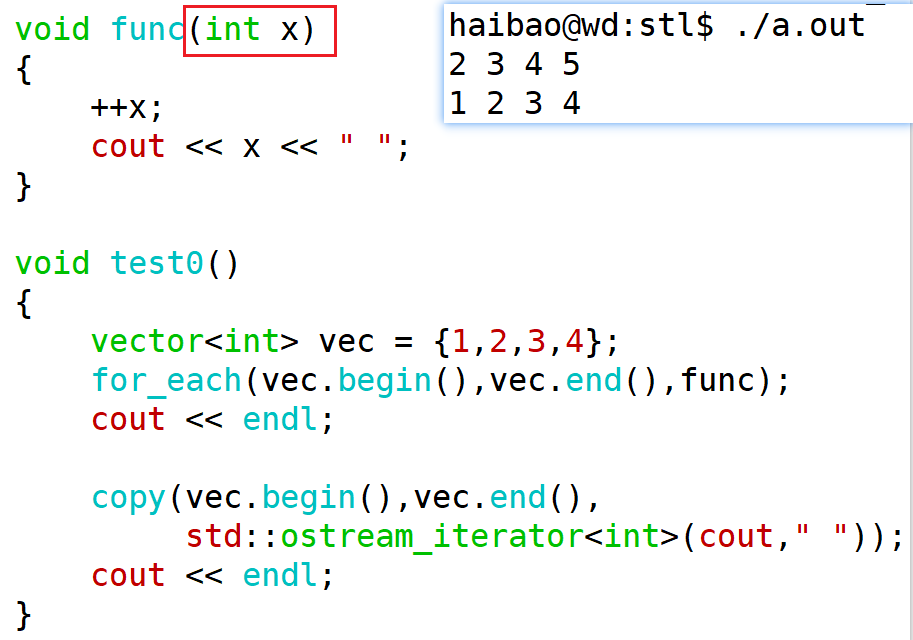
想要通过for_each改变vector中元素的内容，就得在func函数上做文章，可以给func函数形参改成引用。

> [!NOTE]
> `for_each` 本身不限制函数是否修改元素。能否修改取决于传给函数的参数形式，例如传引用就可以修改容器元素。

参考for_each的源码

```cpp
template<class InputIt, class UnaryFunction>
constexpr UnaryFunction for_each(InputIt first, InputIt last, UnaryFunction f)
{
    for (; first != last; ++first) {
        f(*first);
    }
    return f;
}
```

### lambda表达式(重要)

以for_each的使用为例，有时为了使用一些简单的函数，会经常使用到lambda表达式

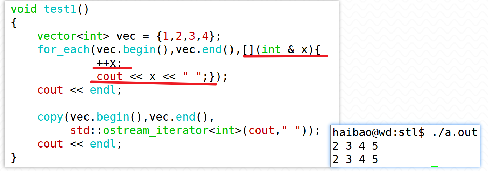
#### 语法结构

lambda 表达式也称为匿名函数，基本语法结构如下：

```cpp
[capture](params) opt -> returnType
{
    body;
}
```

其中 `capture` 是捕获列表，`params` 是参数列表，`opt` 是函数选项，`returnType` 是返回值类型，`body` 是函数体。

如下的lambda表达式中

`[]` 捕获列表：捕获 lambda 表达式函数体外的局部变量；

() 函数的参数列表

{} 函数的函数体

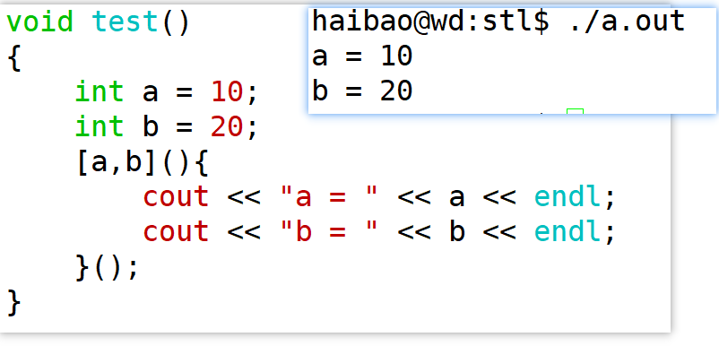
如果没有在[]中捕获a、b，那么在匿名函数的函数体中无法访问它们

进一步的，还可以给匿名函数增加函数参数，以及指定函数返回类型

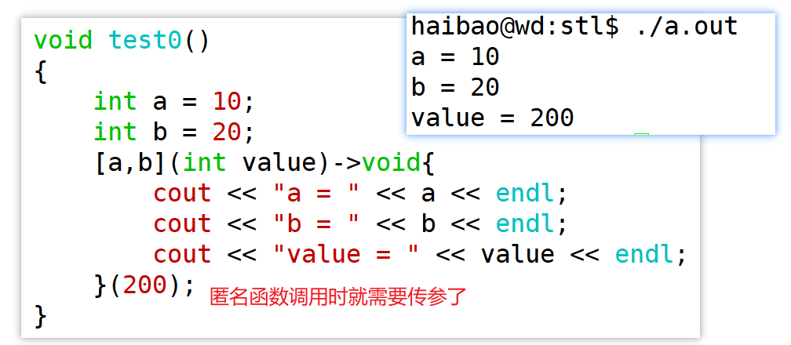
> [!NOTE]
> 捕获列表捕获的是局部变量。全局变量不需要捕获，也不应该写在捕获列表中。

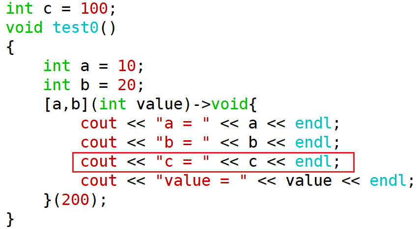
#### 引用捕获与值捕获的区别

如果想要通过捕获列表改变局部变量的值

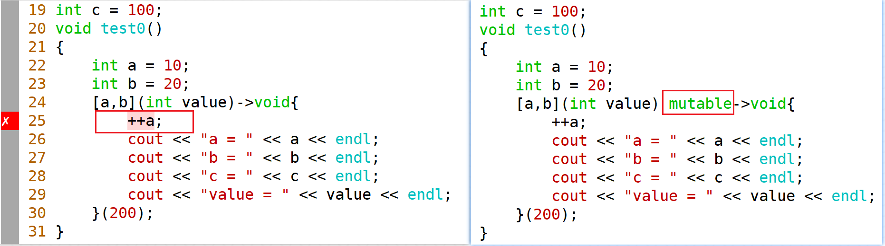
函数选项的位置加上mutable关键字才能对局部变量a/b进行修改操作，但这样做也并不能修改a和b实际的值

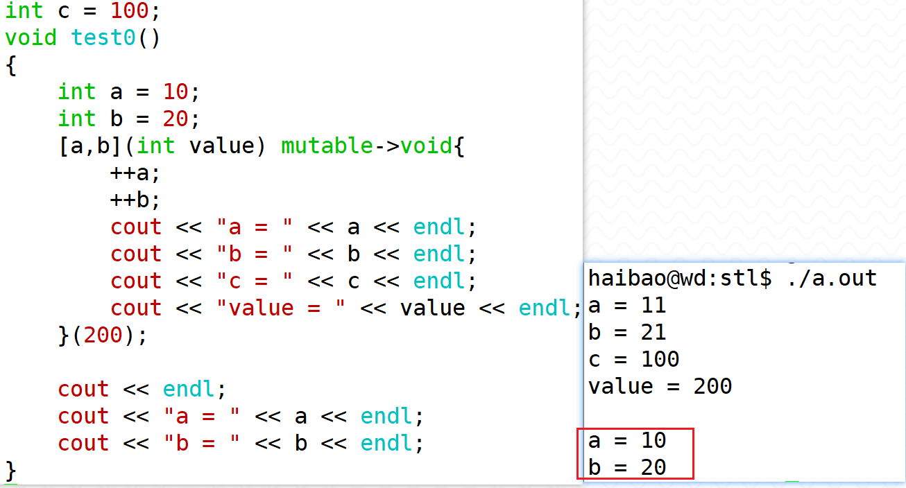
看到上述的结果，应该能联想到常规函数的值传递场景，想要真正通过形参改变实参，形参需要写成引用形式。

因此，如果想在 lambda 中修改外部局部变量本身，应使用引用捕获。

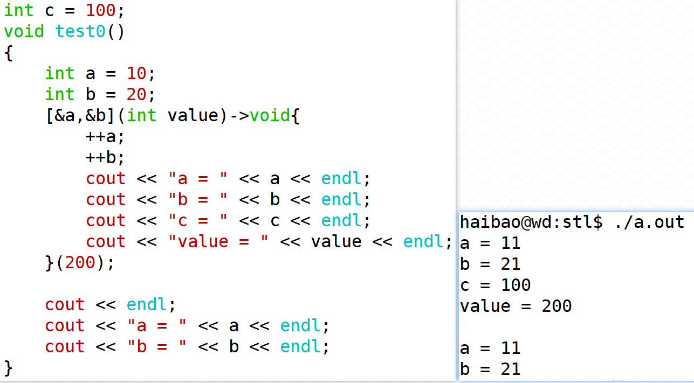
**另外，对于全局变量和函数参数，匿名函数中可以直接完成修改。**

如果需要捕获的内容太多，有一些比较方便的写法：

- 如果想将外部局部变量全部捕获，可以在捕获列表中使用 `=` 表示默认值捕获，或使用 `&` 表示默认引用捕获。

- 如果某一个变量是值捕获，其他变量默认引用捕获，可以写 `[&, num]`。

- 如果某一个变量是引用捕获，其他变量默认值捕获，可以写 `[=, &num]`。

- 最简单的方式是，将每个变量的捕获形式单独写出来，理解起来更简单。

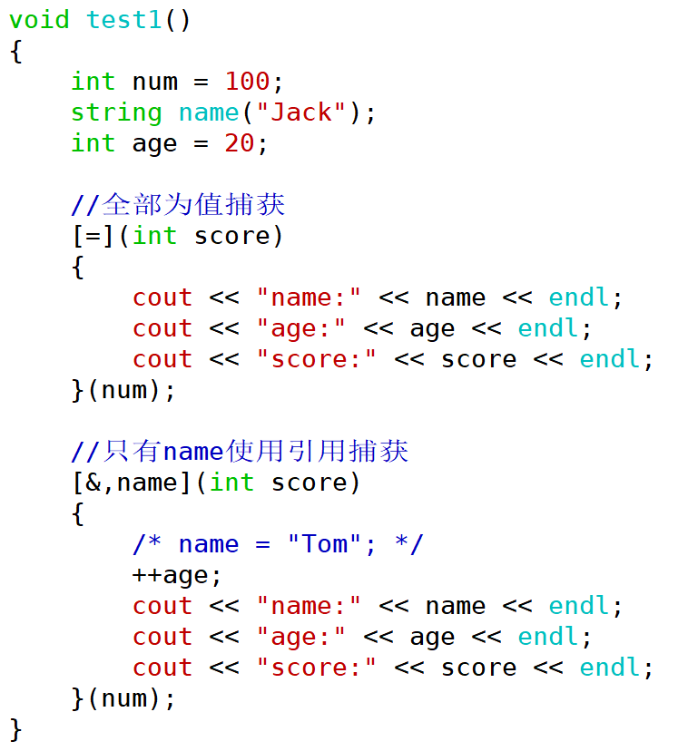
#### lambda表达式可以被接收

现在考虑到一个问题，在前面的例子中，匿名函数每次都是当场定义当场调用的，那么匿名函数是否可以像普通的函数一样去复用呢？

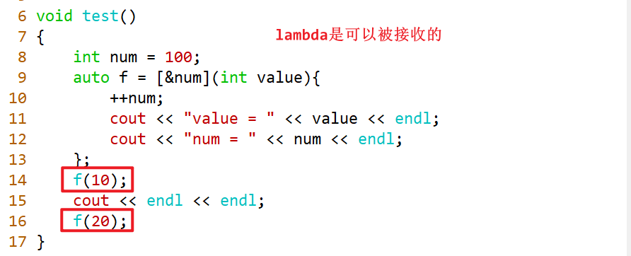

对lambda表达式有了一定了解之后，我们可以看看这个小练习

以下的写法哪些是对的，哪些是有问题的？

（1）

````cpp
class Example
{
public:
    void print(int x, int y)
    {
        auto x1 = [] {return _number; };
        auto x2 = [this] {return _number; };
        auto x3 = [this] {return _number + x + y; };
        auto x4 = [this, x, y] {return _number + x + y; };
        auto x5 = [this] {return _number++; };
        auto x6 = [=] {return _number + x + y; };
        auto x7 = [&] {return _number + x + y; };
    }
    int _number = 100;
};
````

——答案：

```cpp
class Example
{
public:
    void print(int x, int y)
    {
        auto x1 = [] {return _number; };  //error
        auto x2 = [this] {return _number; };  //通过this才能访问_number
        auto x3 = [this] {return _number + x + y; };  //error
        auto x4 = [this, x, y] {return _number + x + y; };
        auto x5 = [this] {return _number++; };  //并没有修改this，只是通过this修改其指向的对象的内容
        auto x6 = [=] {return _number + x + y; };
        auto x7 = [&] {return _number + x + y; };
    }
    int _number = 100;
};
```

（2）

```cpp
void test()
{
    int a = 10, b = 20;
    auto f1 = [] {return a; };
    auto f2 = [&] {return a++; };
    auto f3 = [=] {return a; };
    auto f4 = [=] {return a++; };
    auto f5 = [a] {return a + b; };
    auto f6 = [a, &b] {return a + (b++); };
    auto f7 = [=, &b] {return a + (b++); };
}
```

——答案：

```cpp
void test()
{
    int a = 10, b = 20;
    auto f1 = [] {return a; };  //error
    auto f2 = [&] {return a++; };
    auto f3 = [=] {return a; };
    auto f4 = [=] {return a++; }; //值捕获不能进行写操作
    auto f5 = [a] {return a + b; };  //error
    auto f6 = [a, &b] {return a + (b++); };
    auto f7 = [=, &b] {return a + (b++); };
}
```

> [!IMPORTANT]
> lambda 表达式常见规则：
>
> 1. 参数列表与普通函数参数列表类似；没有参数时，参数列表可以省略。
> 2. 没有需要捕获的内容时，也必须写 `[]`。
> 3. `mutable` 可以修改按值捕获进来的副本，不会修改外部变量本身。
> 4. `noexcept` 表示承诺函数不会抛异常。
> 5. 返回类型通常可以省略，由编译器根据 `return` 语句推导；但不能通过列表初始化自动推导返回值类型。

```cpp
//ok，可以自动推导出返回值类型
auto f = [](int i)
{
return i;
}

// error，不能推导出返回值类型
auto f1 = []()
{
return {1, 2}; // 基于列表初始化推导返回值，错误
}
```

（5）函数体不能省略，但可以为空。

```cpp
auto f = []{};
[]{}(); //极致省略的匿名函数调用
```

#### lambda表达式的类型

至此仍然存在一个问题auto推导出来的类型究竟是什么呢？

lambda 表达式的类型与匿名函数的返回类型不是同一件事。

lambda 表达式在 C++ 中会被看作一个带 `operator()` 的匿名类对象，也就是函数对象。按照标准，lambda 的 `operator()` 默认是 `const` 的，`mutable` 的作用是取消这个 `const` 限定，让按值捕获的副本可以在函数体内被修改。

这里附上一个网站：https://cppinsights.io/

可以通过它查看编译器是如何处理代码的。

因为lambda表达式在C++中会被看做是一个仿函数，因此可以使用std::function和std::bind来存储和操作lambda表达式（算法适配器的使用）

关于这一部分，到1.4.6这一节再来进行演示说明。

### remove_if函数

#### 基本使用

首先还是通过cpp参考文档出发

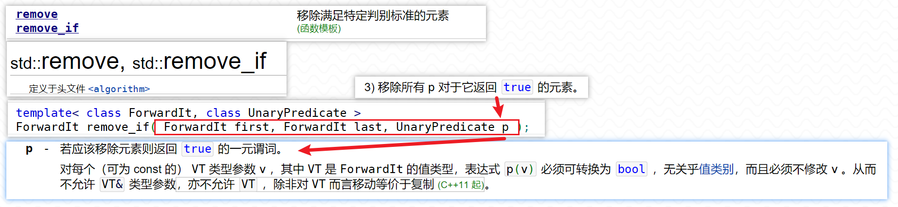

第三个参数p是一个一元谓词。

一元函数：函数的参数只有一个。二元函数：函数的参数只有两个。

一元断言/谓词：函数的参数只有一个，并且返回类型是bool。二元断言/谓词：函数的参数只有两个，并且返回类型是bool

根据函数的说明，能够理解它的作用，那么可以简单尝试着使用一下，如下想要移除vector中大于5的元素：

如果直接调用后发现没有得到想要的结果，可以从源码逻辑理解 `remove_if` 的真实行为。

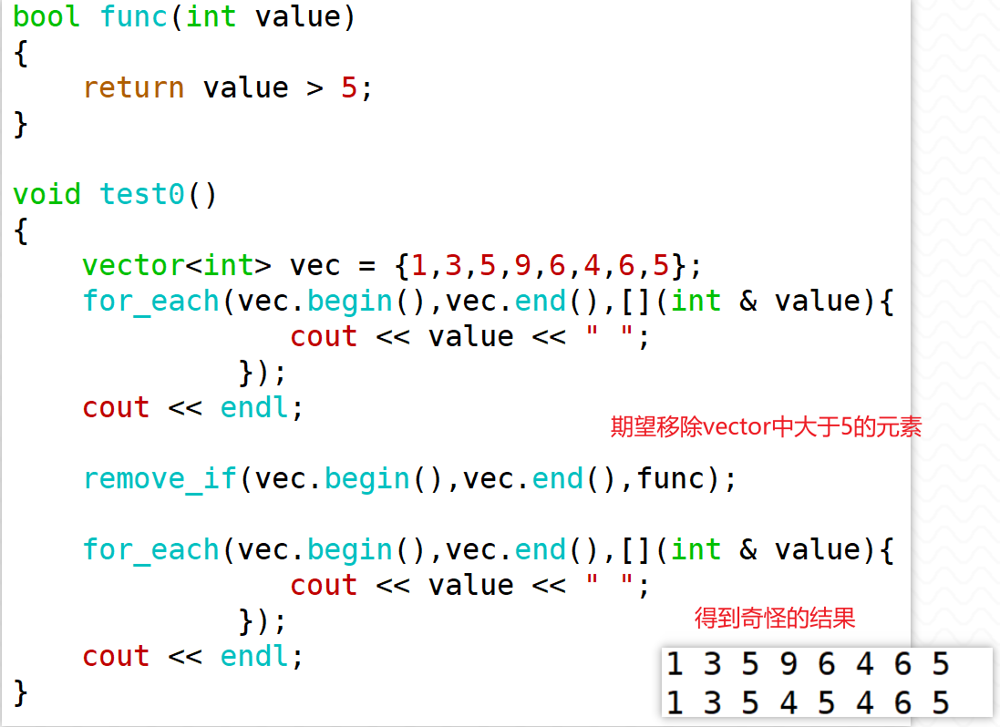
#### 源码

```cpp
//first = vec.begin()
//last = vec.end()
//p = func
template<class ForwardIt, class UnaryPredicate>
ForwardIt remove_if(ForwardIt first, ForwardIt last, UnaryPredicate p)
{
    first = std::find_if(first, last, p);
    if (first != last)
        for(ForwardIt i = first; ++i != last; )
            if (!p(*i))
                *first++ = std::move(*i);
    return first;
}
```

跳转到find_if函数查看

```cpp
//first = vec.begin()
//last = vec.end()
//p = func
template<class InputIt, class UnaryPredicate>
constexpr InputIt find_if(InputIt first, InputIt last, UnaryPredicate p)
{
    for (; first != last; ++first) {
        if (p(*first)) {
            return first;
        }
    }
    return last;
}

//分析一下过程，其实就是找到第一个大于5的元素，返回相应迭代器
                       last
1, 3, 5, 9, 6, 4, 6, 5
         f
```

接着往下看

```cpp
//使用的代码
remove_if(vec.begin(), vec.end(), func);
//first = vec.begin()
//last =  vec.end()
//p = func
ForwardIt remove_if(ForwardIt first, ForwardIt last, UnaryPredicate p)
{
    first = std::find_if(first, last, p);
    if (first != last){
        for(ForwardIt i = first; ++i != last; )
        {
            if (!p(*i))
            {
                *first++ = std::move(*i);
            }
        }
    }
    return first;
}

         f             last
1, 3, 5, 9, 6, 4, 6, 5
               i

            f          last
1, 3, 5, 4, 6, 4, 6, 5
                  i

            f          last
1, 3, 5, 4, 6, 4, 6, 5
                     i

               f       last
1, 3, 5, 4, 5, 4, 6, 5
                     i
//最终返回4这个元素对应的迭代器
```

还有一件有意思的事，期待的最终结果是{1,3,5,4,5}，而这样的理想结果实际上已经是vector的前五个元素了。

`remove_if` 的返回值是“逻辑上应该被删除的元素范围”的首迭代器。

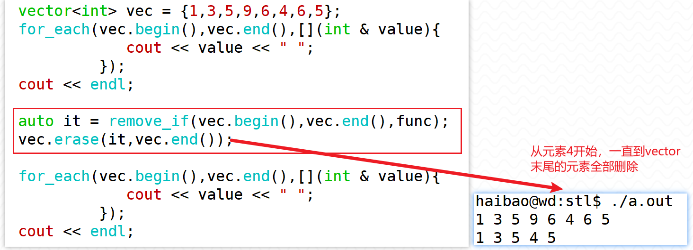
> 思维拓展：
>
> remove_if实际上最终的效果是同时做了两件事，更改了容器中特定位置的元素，并且返回了待删除元素的首迭代器。
>
> 在我们以往的认知中，同时干两件事总是比较容易出问题。比如多线程环境下，一个线程对某个数据进行写操作，一个线程对它进行读操作，如果不加锁的话，没法确定执行的先后，可能会出现预期之外的值。可以通过下面的例子来理解一下：
>
> 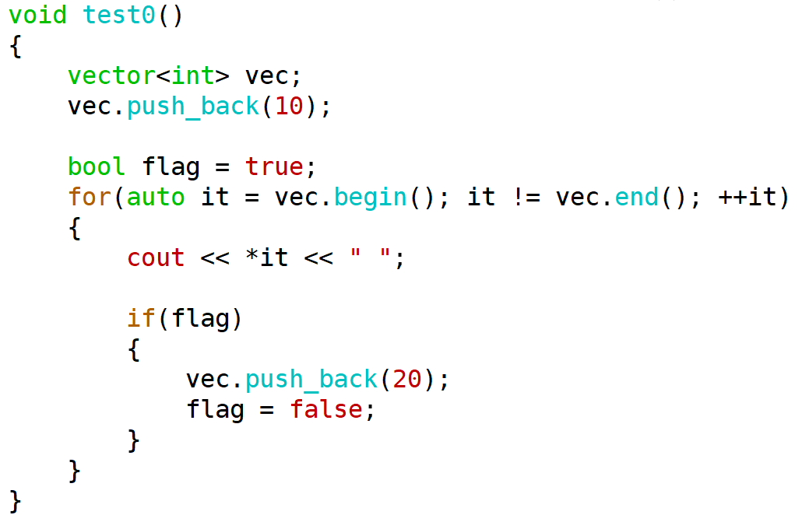
>
> 大家认为这样一串代码会有什么样的结果呢？运行一下，可能会大跌眼镜。
>
> 回顾vector迭代器失效的原理，试试该怎样解决。

> —— 更新迭代器的方法
>
> 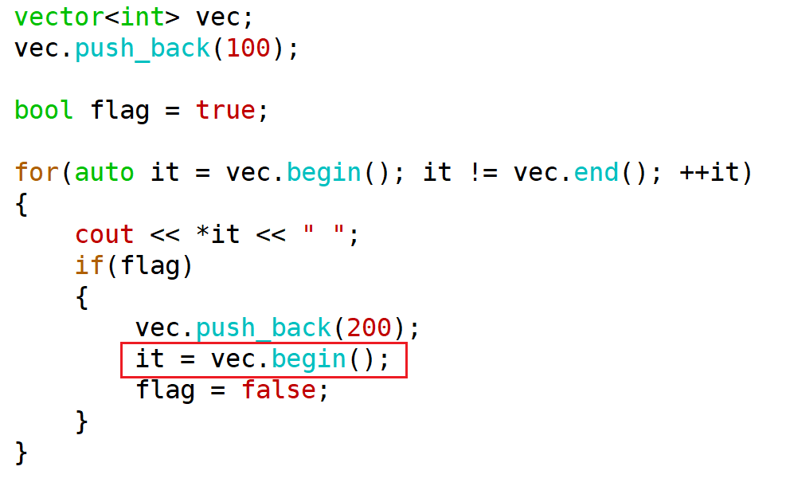
>
> 小心迭代器失效，如果有扩容，记得更新迭代器！

因此，`remove_if` 通常要配合 `erase` 使用，也就是常说的 erase-remove 惯用法：

```cpp
bool func(int value)
{
    return value > 5;
}

void test0()
{
    vector<int> vec = {1,3,5,9,6,4,6,5};
    for_each(vec.begin(),vec.end(),[](int & value){
                cout << value << " ";
             });
    cout << endl;

auto it = remove_if(vec.begin(), vec.end(), func);
vec.erase(it, vec.end());

    for_each(vec.begin(),vec.end(),[](int & value){
                cout << value << " ";
             });
    cout << endl;
}
```

当然也可以用lambda表达式替代

```cpp
    vector<int> vec = {1,3,5,9,6,4,6,5};
    for_each(vec.begin(),vec.end(),[](int & value){
                cout << value << " ";
             });
    cout << endl;

auto it = remove_if(vec.begin(), vec.end(), [](int & value){
    return value > 5;
});
vec.erase(it, vec.end());

    for_each(vec.begin(),vec.end(),[](int & value){
                cout << value << " ";
             });
    cout << endl;
```

既然是比较两个数的大小，我们很容易联想到之前已经多次使用的std::less和std::greater，尝试使用会发现一个问题

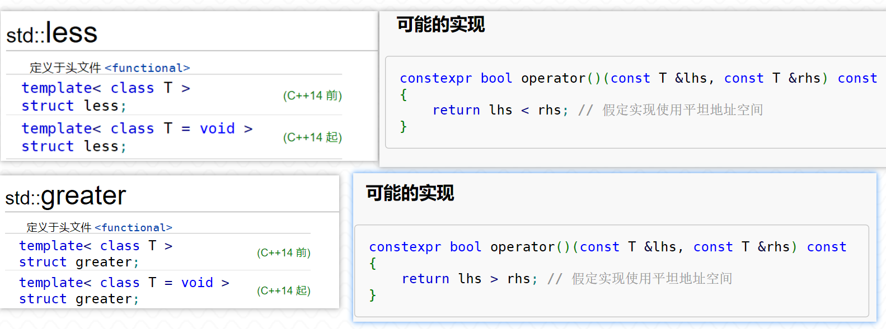
```cpp
//std::less对象作为函数对象，其底层的operator()函数需要两个参数
//一个参数由vector提供（remove_if会遍历迭代器范围的元素）
//另一个参数呢，按照需求应该提供一个5，但是如何传参呢？
auto it = remove_if(vec.begin(), vec.end(), std::less<int>());  // error
vec.erase(it, vec.end());
```

实际上，可以利用算法适配器实现这一效果，如下。

### 算法适配器

算法适配器也称为函数适配器

#### bind1st、bind2nd

函数绑定器

如下模板形式中，两个函数绑定器的第一个参数就是一个函数，第二个参数就是一个数字，如果F是一个二元函数(普通二元函数或者二元谓词)，我们可以绑定F的第一个参数(bind1st)或者第二个参数(bind2nd)，达到我们想要的效果(使用二元谓词的效果)

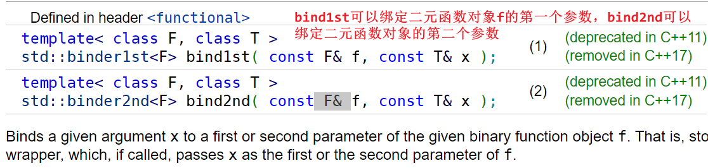

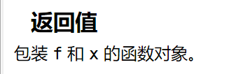
那么我们可以写出这样的代码

```cpp
void test0()
{
    vector<int> vec = {1,3,5,9,6,4,6,5};
    for_each(vec.begin(),vec.end(),[](int & value){
                cout << value << " ";
             });
    cout << endl;

    auto it = remove_if(vec.begin(),vec.end(),
                        bind1st(std::less<int>(),5));  //这样相当于将std::less的operator()函数的第一个参数固定为5
    vec.erase(it,vec.end());

    for_each(vec.begin(),vec.end(),[](int & value){
                cout << value << " ";
             });
    cout << endl;
}
```

—— 那么这样做的结果是删除所有大于5的元素还是所有小于5的元素呢？

—— 还可以利用上bind2nd（固定第二个参数），以及std::greater（其底层的operator()函数逻辑不同），分别试试搭配使用的效果并分析

#### bind（非常重要）

`bind1st`、`bind2nd` 属于较旧的写法，对被绑定的函数对象要求较严格，现代 C++ 中更推荐使用 `std::bind` 或 lambda 表达式。

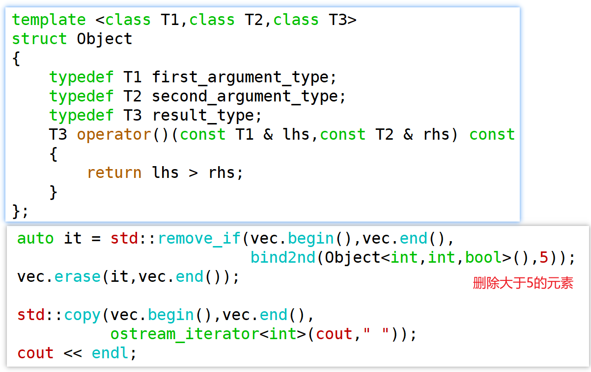
更通用的手段是 `std::bind`。

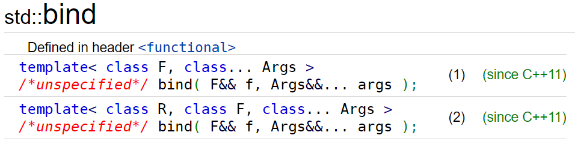
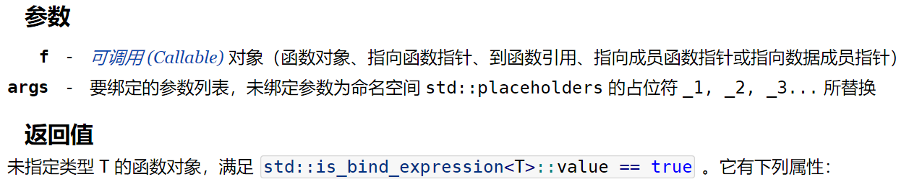
##### 基本使用

如下，bind可以绑定N元函数，并用统一的方式进行使用。

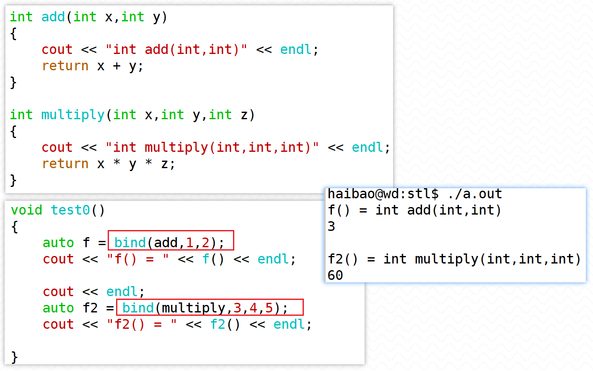
根据cpp参考文档的解释，第一个参数可以是函数对象、函数指针、函数引用(比较少见)、指向成员函数指针或指向数据成员指针。如上将函数名直接作为参数，相当于是传入函数指针。其他的几种情况也可以试试：

函数对象

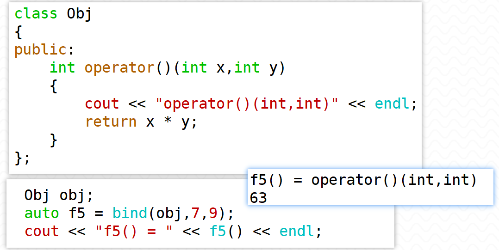
函数引用

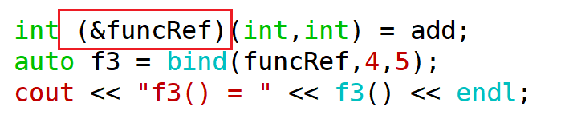
成员函数指针稍稍复杂

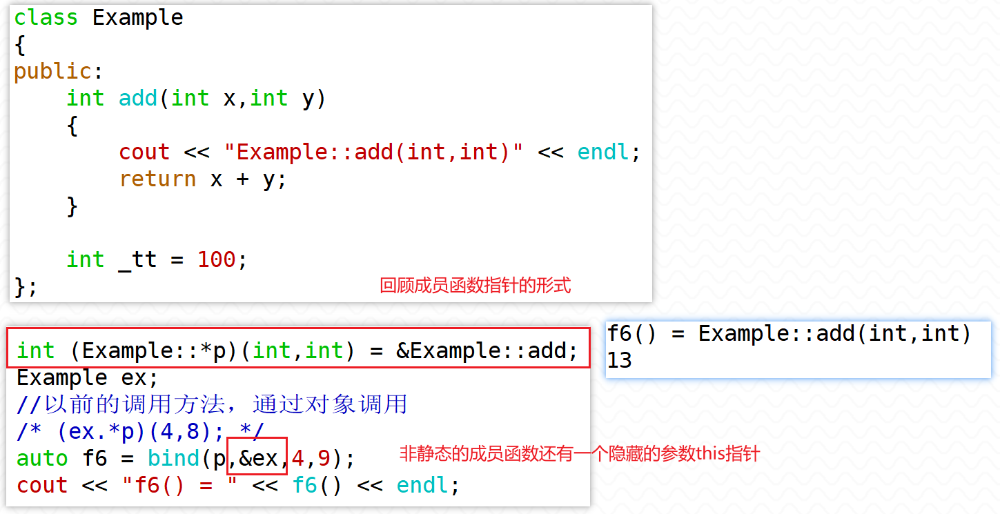
指向数据成员的指针（当然这种写法比较奇特，仅作了解）

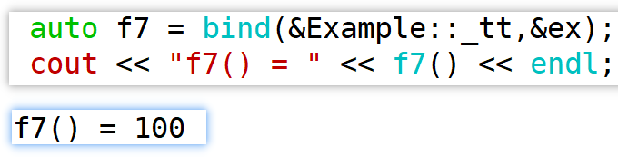
用这种方式访问Example类的成员还有一个前提 —— 这些成员都是public权限的。

##### 引用折叠

补充思考：

看回bind的声明形式，第一个参数看起来是一个右值引用，为什么在真正使用过程中，传入一些左值也可以呢？

这涉及到模板中的引用折叠

如下代码修改成模板后是可以正常运行的：

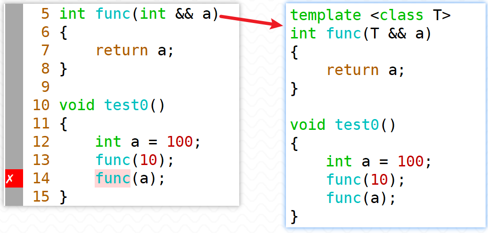
在调用 `func` 时，如果传入的实参是左值，`T` 会被推导成左值引用；如果实参是右值，`T` 会被推导成非引用类型，再配合 `T&&` 形成右值引用。这类参数常称为万能引用或转发引用。

```cpp
template <typename T>
int func(T &&a)
{
    return a;
}

int a = 10;
func(10);//T = int &&
func(a);// T = int &
```

模板中a为T&&类型，那么会造成多个引用符号写到一起。我们自己在写代码时不能将两个以上的引用符号写到一起，但是模板推导时会遵循一套引用折叠的机制

```cpp
//T &&有两种情况
& &&---->&
&& &&---->&&

//如果模板的函数参数为T&形式
//也有两种情况
& & ---->&
&& &----->&
```

根据引用折叠规则可知，模板参数写成 `T&&` 且 `T` 需要推导时，实参既可以传左值，也可以传右值；如果写成 `T&`，实参只能传左值。

##### 占位符

> 回到bind的基本使用，似乎每次都需要将被绑定的函数的所有参数都一起传入。
>
> 除此之外，还有一种占位符的写法。
>
> 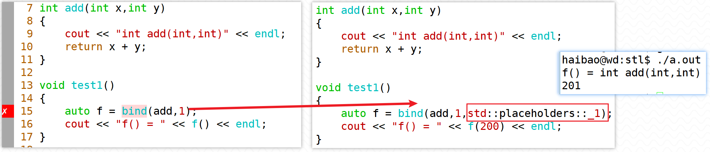
>
>
>
> 除了bind中指定的1，还使用占位符占据了一个函数参数位置，那么这个std::placeholders::_1占据的是add函数的参数x的位置，还是参数y的位置呢？
>
> 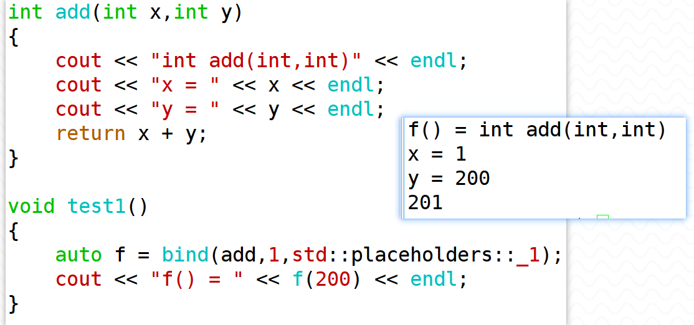
>
> 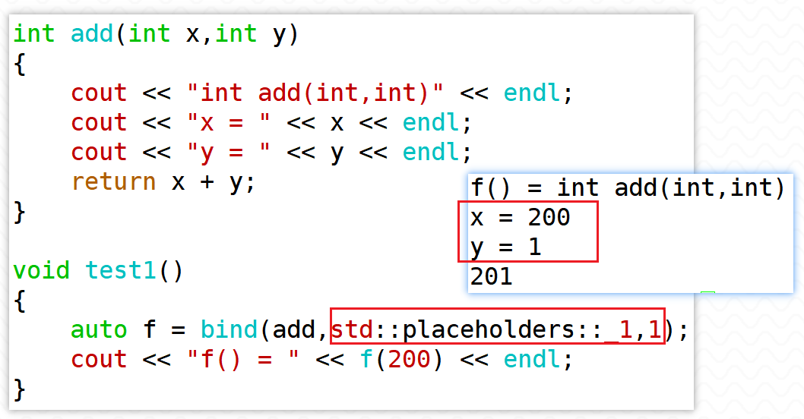
>
> 根据上面的结果可以发现，占位符占据的是bind所绑定的函数的参数列表中的哪个参数位置，取决于占位符在bind参数列表中出现的位置。

还可以进一步地：

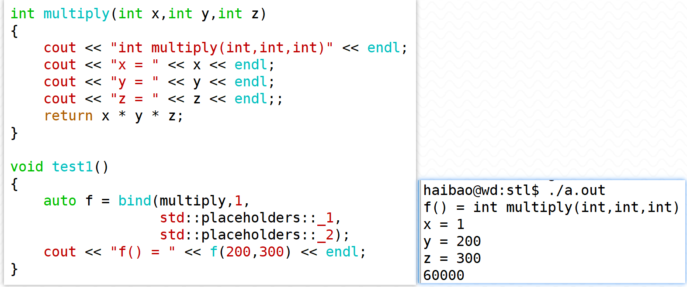
> 这里的使用实际上非常容易出错，看看更多参数的情况：
>
> 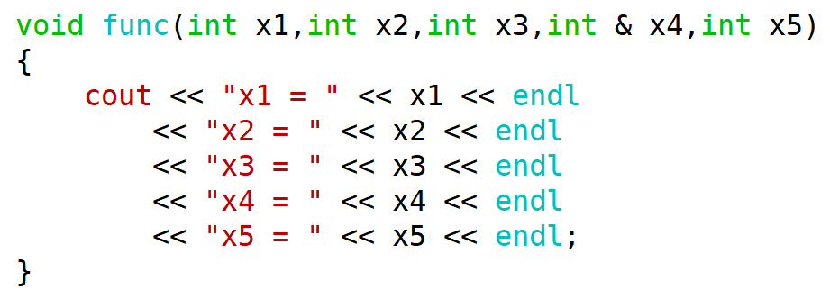
>
> 这样写自然没有问题
>
> 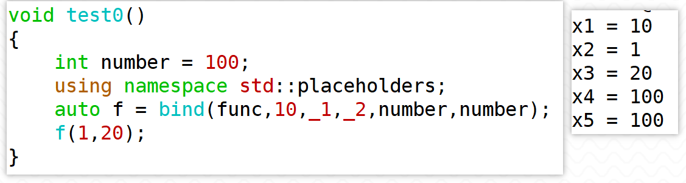
> [!CAUTION]
> 占位符中的数字代表调用绑定对象时传入的第几个实参。使用 `_4` 就意味着调用时至少要传入 4 个实参，多余实参会被忽略。

> 如果将占位符改换一下，可能会出错。
>
> 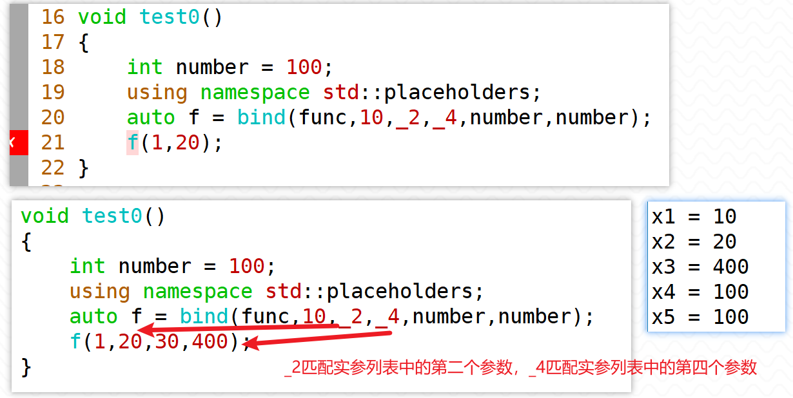
>
> 也就是说，使用了 `_4` 这个占位符，调用时至少要传入 4 个参数。
>
> 对于func函数，第一个参数是传入的10，第二个参数是占位符匹配到的20，第三个参数是占位符匹配到的400，第四个和第五个则是传入的number
>
> **可以理解为占位符整体代表的是形参的位置，占位符中的数字代表的是实参的位置。**

##### 引用包装器

—— 再看一个有意思的事情

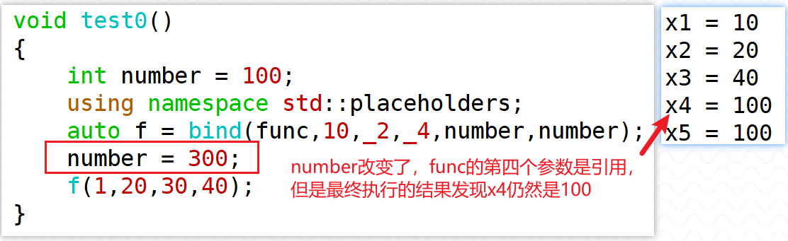
`bind` 默认按值保存绑定参数。如果希望绑定引用，需要使用引用包装器。

>  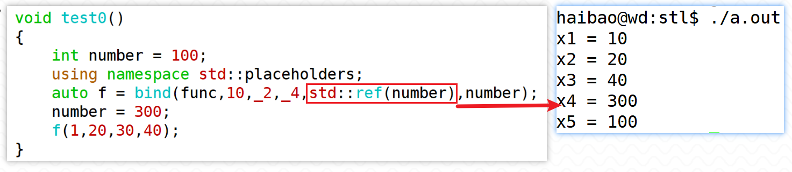
在 `bind` 传参时可以使用引用包装器 `std::ref`。

如果函数形参是 const 引用，可以使用常引用包装器 `std::cref`。

>  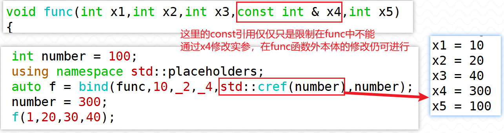
**引用包装器也属于函数适配器。**

##### 函数指针

上面的例子中我们每次都使用了auto f的形式接收了bind函数的返回值，那么auto究竟推导出什么类型？

看到某一个变量后加上括号，起到调用函数的作用，应该会联想到以前学习过的函数指针，先类比着进行理解。

假设有相同类型的函数

```cpp
int func()
{
    return 10;
}

int func2()
{
    return 20;
}
```

func和func2的返回类型与参数情况一致，可以使用同种函数指针进行调用。为了方便使用，可以给这种函数指针类型起别名。

函数指针被初始化为函数的地址(函数指针指向函数)相当于是函数的注册;

使用函数指针调用函数时才会执行函数。

这就对应了一种延迟调用的思想（先注册，后执行），可以用来作回调函数。与之理念相似的还有C++的多态思想：基类指针调用虚函数时，只有到运行时（根据基类指针究竟指向的是哪个派生类对象）才能确定具体执行哪个虚函数。

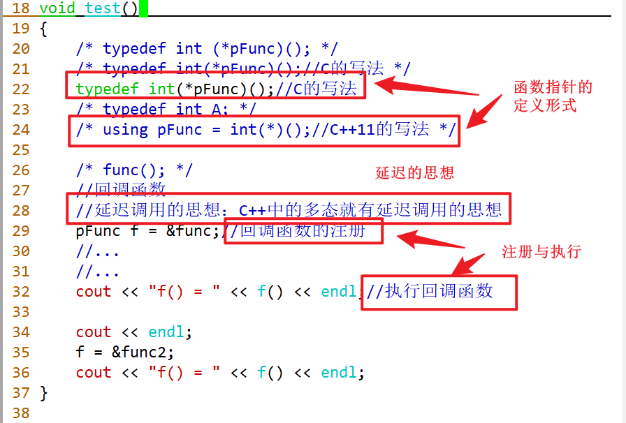

```cpp
int func(){}

//逻辑层面
int()//函数类型
int(*)()//函数指针类型
typedef int(*Function)()

using Function = int(*)()

int (*p)() = &func;
Function f = &func;

function<int()> f;

```

**不过，如果直接根据bind所绑定的函数的类型定义函数指针，是不能直接接收bind返回值的。**

#### function

##### function接收bind的返回值

对于函数而言，函数的类型包含了两个信息：函数返回类型 + 函数参数列表（包含了函数参数的类型、个数、顺序）

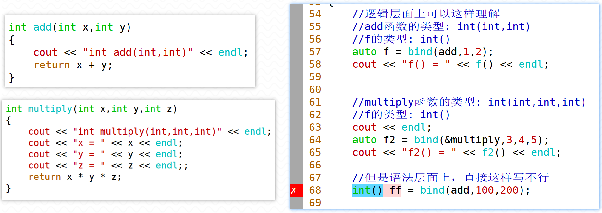
很多时候，逻辑层面上很好理解，但是原生的语法却并不支持这种表达，STL则提供了一种方式可以支持这种表达。

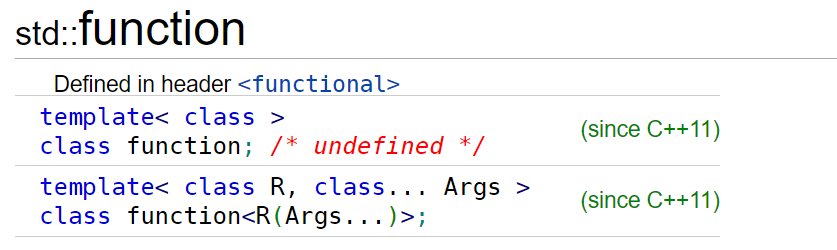
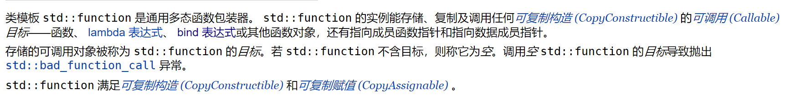

**体现了万物皆对象的思想**

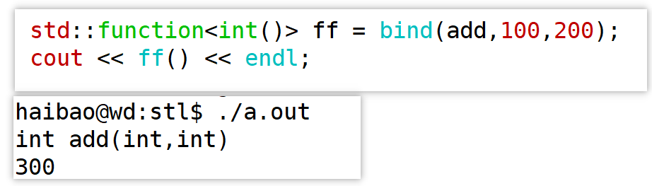
同理，逻辑类型应该为int(int)时，可以写成：

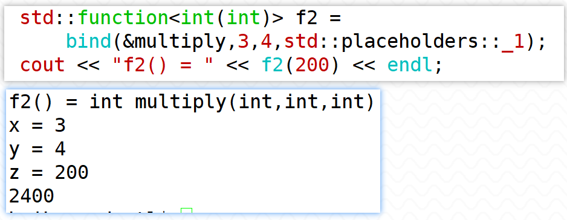
##### 绑定成员函数的传参

- **给成员函数绑定参数**

> 对于bind绑定成员函数的结果，也是一样的形式，非常简单
>
> 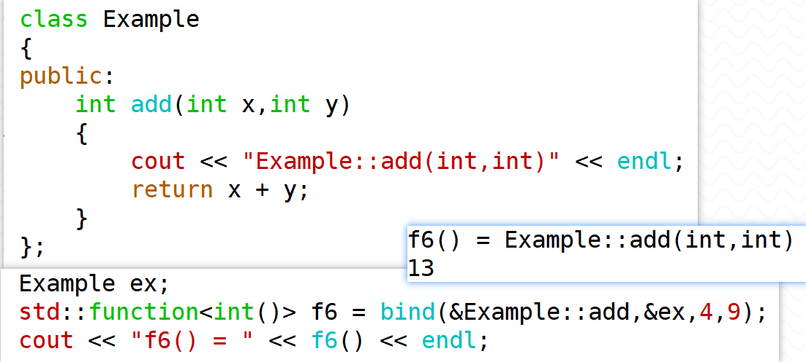
>
> **使用function接收bind绑定成员函数的返回值，function对象在初始化与使用时不需要顾及类的信息。**

> 如果结合占位符，其形式就更加多种多样了
>
> 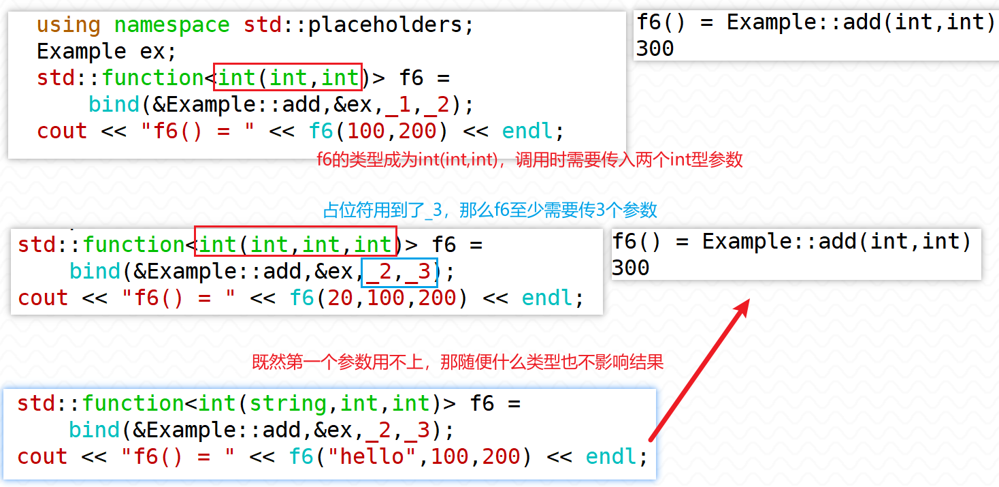
>
> **当然，自己写代码的时候不建议写成这种带"炮灰"的形式，没有必要，还很容易混淆。**
>
>
>
> 这里可以引申出一个思考——bind的返回值究竟是什么类型，为什么能够用不同类型的function对象来接这个返回值

- **绑定成员函数的第一个参数**

> 回到 `function` 接收 `bind` 返回值的例子。当 `bind` 绑定类的成员函数时，需要传入对象地址以对应 `this` 指针这个参数，实际上还有另一种写法。
>
> 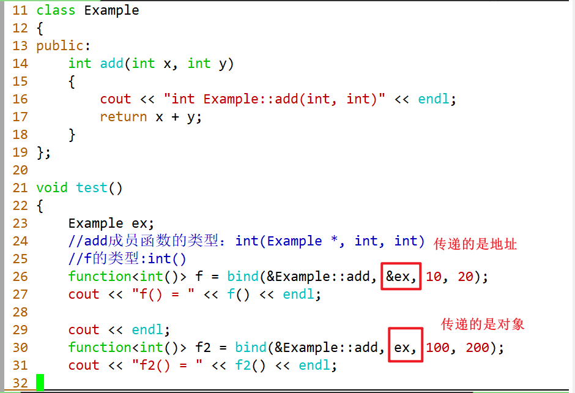
>
> bind绑定成员函数的时候，有两种传递的方式，**第一种：直接传递对象的地址，第二种，将对象拷贝进来。**
>
> —— 如果使用的是第一种，那么会传递的是地址值，那么就只会有一个指针大小的开销;但是如果是传递对象，就会拷贝对象，如果对象占据的空间比较大，那么开销也会比较大。
>
>
>
> 那传递对象的写法有什么意义呢？
>
> —— 如果使用的是第一种，传递的是地址值，如果对象本身已经销毁了，那么有可能会有野指针的情况。
>
> 比如对象ex的创建是A线程，bind的绑定是B线程，在bind绑定时传对象的地址值，但A线程已经销毁了，就会出现这样的问题。
>
> 但是如果使用第二种形式，传递的是对象，那么就不会出现野指针的问题。
>
> **所以在多线程环境下，更建议传对象，而不是传地址。**

##### function表示lambda表达式返回值

在1.4.4这一节有一个遗留的问题，lambda表达式的返回值是什么？

我们也可以利用std::function进行相应的表示

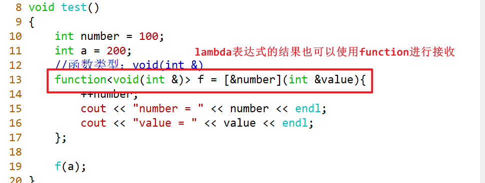

> [!NOTE]
> `std::function` 称为函数包装器，可以保存满足指定函数签名的可调用对象，例如普通函数、函数对象、lambda、`bind` 的返回值等。

##### function使用的误区

使用 `std::function` 管理 lambda 表达式时，要特别注意捕获生命周期。

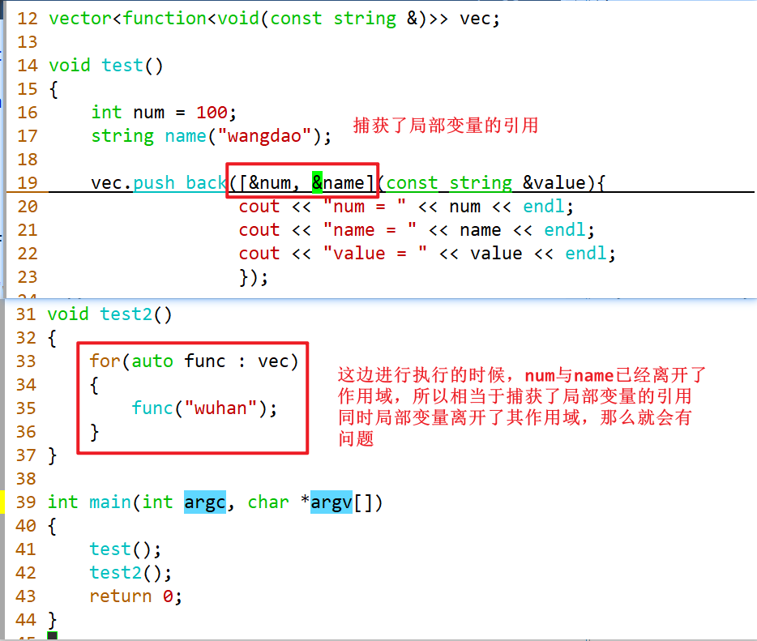

> [!CAUTION]
> 不要让返回出去或长期保存的 lambda 捕获局部变量引用。局部变量销毁后，lambda 内部保存的引用会悬空。

##### bind与function的结合使用（重要）

我们了解了std::bind和std::function各自的基本使用，再来看看它们的结合使用，这是一种**非常非常非常**强大的用法，因为bind具备改变函数形态的功能，只要函数的返回类型相同，任何参数类型的函数都可以被bind绑定之后，变成函数类型完全一致的函数对象，然后都可以被function进行接收。

来看一个std::function与std::bind结合使用体现出多态性的例子，也就是注册回调函数与执行回调函数。

在学习多态时，我们学过一段计算图形面积的例子

```cpp
#include <math.h>
#include <iostream>
#include <string>
using std::cout;
using std::endl;
using std::string;

class Figure{
public:
    virtual string getName() const = 0;
    virtual double getArea() const = 0;
};

void display(Figure & fig){
    cout << fig.getName();
    cout << "的面积：";
    cout << fig.getArea() << endl;
}

class Rectangle
: public Figure
{
public:
    Rectangle(double len,double wid)
    : _length(len)
    , _width(wid)
    {}

    string getName() const override{
        return "矩形";
    }

    double getArea() const override{
        return _length * _width;
    }
private:
    double _length;
    double _width;
};
//...

void test0(){
    Rectangle rt(2,5);
    display(rt);
    //...
}

int main(void){
    test0();
    return 0;
}
```

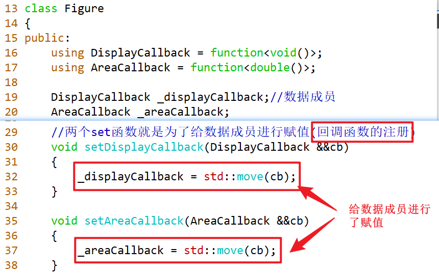

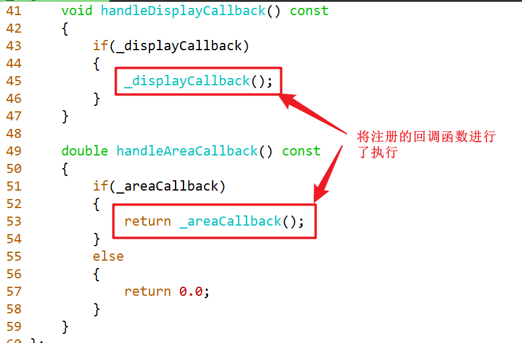

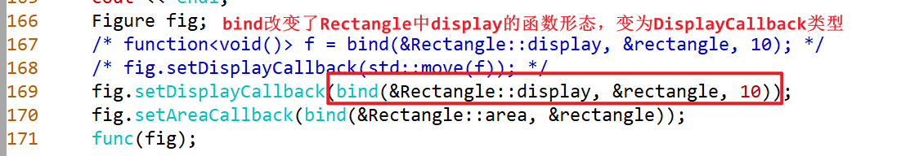

—— 如上，思考一下为什么要使用移动语义呢？请回顾复制与移动的区别。

面向对象的写法：继承 + 纯虚函数(或者普通的虚函数)，具有一定的局限性：必须建立继承关系，派生类对基类的虚函数进行覆盖时必须要函数名和函数形式完全一致等;

**基于对象**的写法：`std::function + std::bind` 可以弱化继承关系带来的限制，同样能体现多态性，而且更加灵活。

#### mem_fn成员函数适配器

因为成员函数与算法库中的算法不能直接很好的适配，所以二者结合使用的时候，需要使用成员函数适配器进行适配。

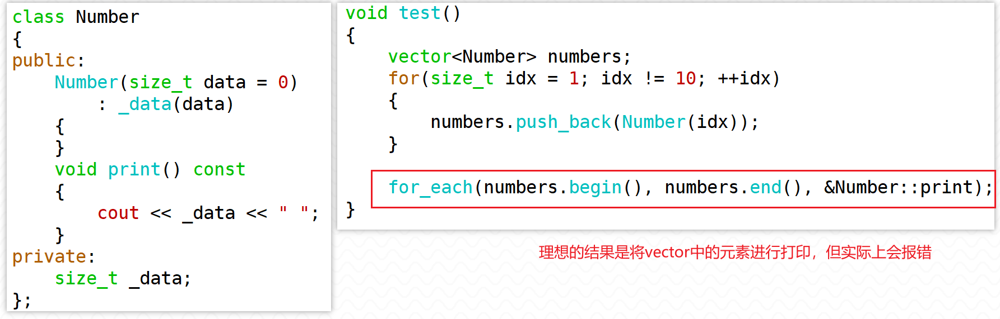
使用成员函数适配器mem_fn进行简单的包装即可

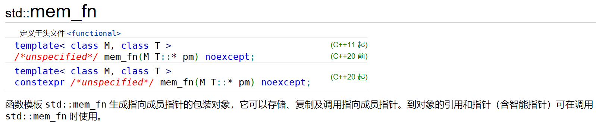

> 完成遍历后可以顺带回顾一下remove_if的使用，多练习一下

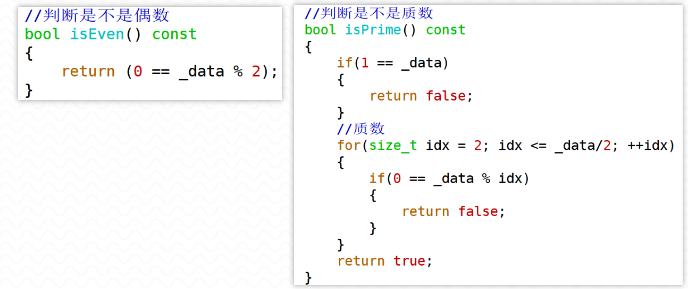
> 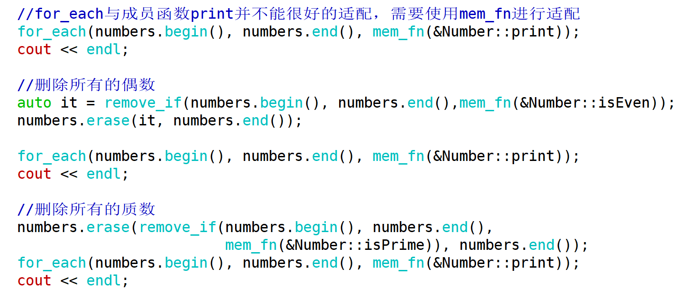
>
> 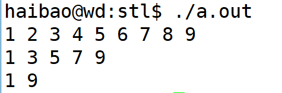
——思考：上述例子中使用for_each遍历vector时，使用了mem_fn为成员函数print做适配。根据以前学过的知识，还有没有什么方法实现同样效果呢？

for_each的第三个参数要求是一个一元函数，成员函数print看起来无参，实际上有隐含的this指针作为参数，它的确是一个一元函数。

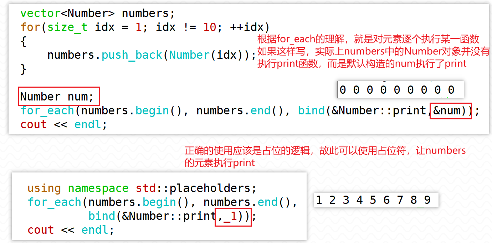
或者我们也可以用function接一下bind绑定成员函数的结果

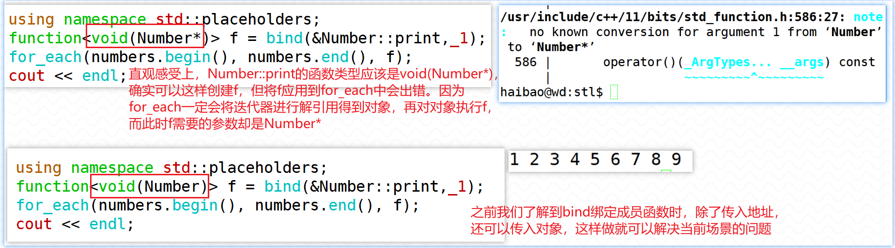

## 适配器

适配器就是Interface(接口)，对容器、迭代器和算法进行包装，但其实质还是容器、迭代器和算法，只是不依赖于具体的标准容器、迭代器和算法类型，容器适配器可以理解为容器的模板，迭代器适配器可理解为迭代器的模板，算法适配器可理解为算法的模板。

## 函数对象

**函数对象也称为仿函数**，严格意义上说函数对象仅仅指重载了函数调用运算符的类的对象。

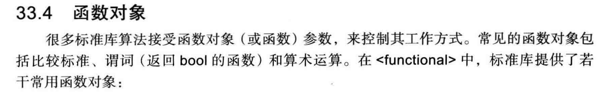
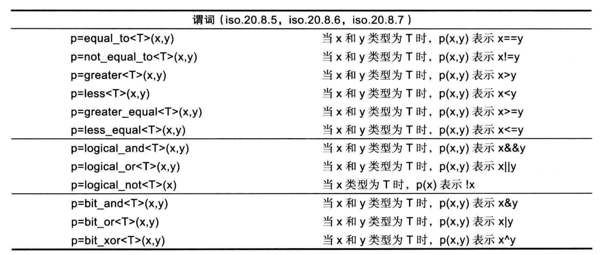
还有一个概念—— 只要可以与小括号进行结合展示出函数含义都可以称为**可调用对象**。很多资料中模糊了函数对象和可调用对象的概念说明。上图出自C++之父的书——《C++程序设计语言-第4卷》

> 可调用对象包含了：
>
> - 函数对象
> - 函数指针、函数引用
> - 函数名
> - lambda表达式（可视为一个匿名的函数对象，可以直接在定义后调用，也可以给function函数对象赋值）

还有一个更大范围的概念 —— **可调用实体**，它在可调用对象的基础上还增加了成员函数、成员函数指针（这两者的共同特点是也可以调用，**但不能仅凭自己完成调用**）

## 空间配置器

在 C++ 中，STL 容器的空间分配通常由 `std::allocator` 或与之兼容的分配器完成。

`std::allocator` 是能感知类型的空间分配器，它把空间申请与对象构造、对象析构与空间释放分开处理。

以前我们知道使用new创建单个对象的时候，空间的申请与对象的构造实际也是分开的（可以回顾new表达式的工作步骤）。

> 那么为什么要将空间的申请与对象的构建分开呢？
>
> 1. **减少不必要的对象构造和析构**：容器有时只需要预留空间，并不需要立刻构造对象。例如 `std::vector::reserve` 只预留内存空间，不构造元素。
>
> 2. **方便实现复杂容器操作**：插入、删除、扩容时，容器可以先申请新空间，再移动旧元素，最后在合适位置构造新对象。

### 函数使用

`std::allocator` 常见成员函数：

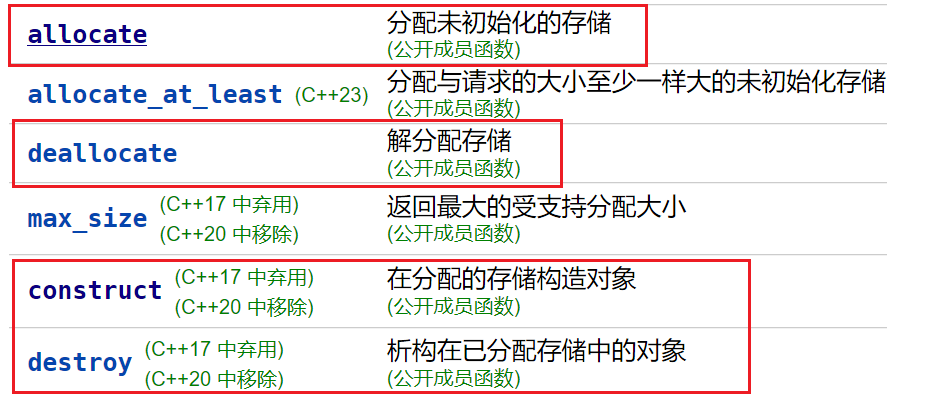
```cpp
// 申请空间
T* allocate( std::size_t n );

// 释放空间
void deallocate( T* p, std::size_t n );

// 构建对象
void construct( pointer p, const_reference val );

// 执行析构
void destroy( pointer p );  //p->~T()
```

来尝试完成一个任务，实现自定义的vector，首先给出如下的代码接口

```cpp
template <class T>
class MyVector
{
public:
    MyVector();
    ~MyVector();

    void push_back(const T &);
    void pop_back();
    int size() const;
    int capacity() const;
private:
    //重新分配内存，动态扩容要用的
    void reallocate();

    //空间的申请与对象的构建分开
    static std::allocator<T> _alloc;

    T * _start;
    T * _finish;
    T * _end_of_storage;
};
```

（1）先完成比较简单的

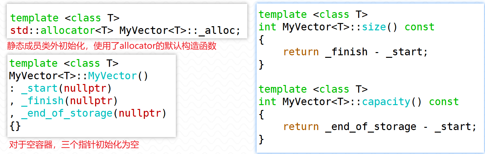
（2）尾部插入元素、删除元素，模拟vector的核心问题就是动态扩容

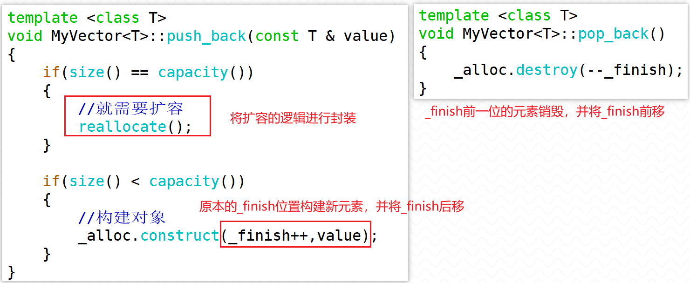
（3）完成动态扩容的功能

```cpp
template <class T>
void MyVector<T>::reallocate()
{
    //1.申请两倍的新的空间
    int oldCapacity = size();
    int newCapacity = oldCapacity > 0 ? 2 * oldCapacity : 1;

    T * ptmp = _alloc.allocate(newCapacity);

    if(_start)
    {
        //2.使用算法库的函数将老的空间上的元素拷贝到新的空间
        std::uninitialized_copy(_start,_finish,ptmp);

        //3.老的空间上的元素需要销毁，
        //同时老的空间也要回收
        while(_start != _finish)
        {
            /* _alloc.destroy(_start++); */
            //注意一下边界问题，这样写是完善的
            _alloc.destroy(--_finish);
        }

        //参数为指针(T*)和偏移量(size_t)
        //如果从_finish开始，偏移量为负数，而size_t不好表达
        //如果从_start开始,偏移量为正数，更方便
        //所以选择_start固定，移动_finish;
        _alloc.deallocate(_start,oldCapacity);
    }

    //4.三个指针与新的空间之间产生联系
    _start = ptmp;
    _finish = ptmp + oldCapacity;
    _end_of_storage = ptmp + newCapacity;
}

```

析构函数的逻辑类似，也是销毁元素、回收空间

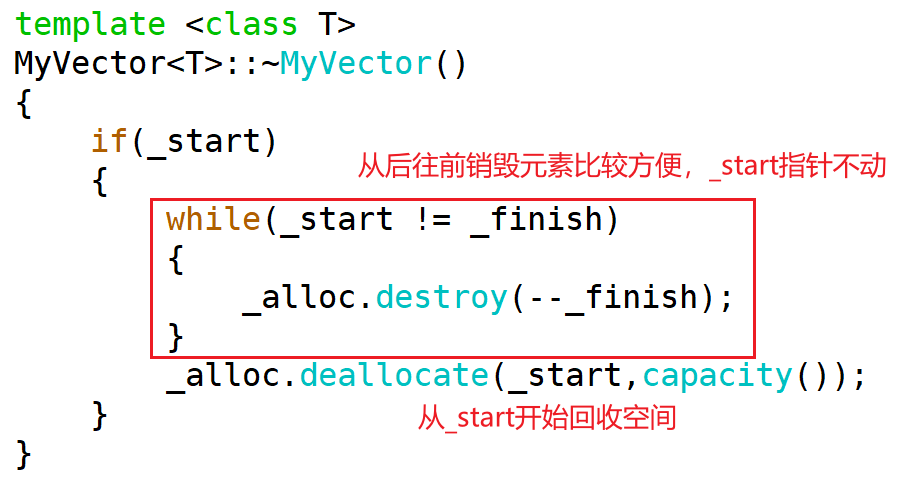
(4)测试效果

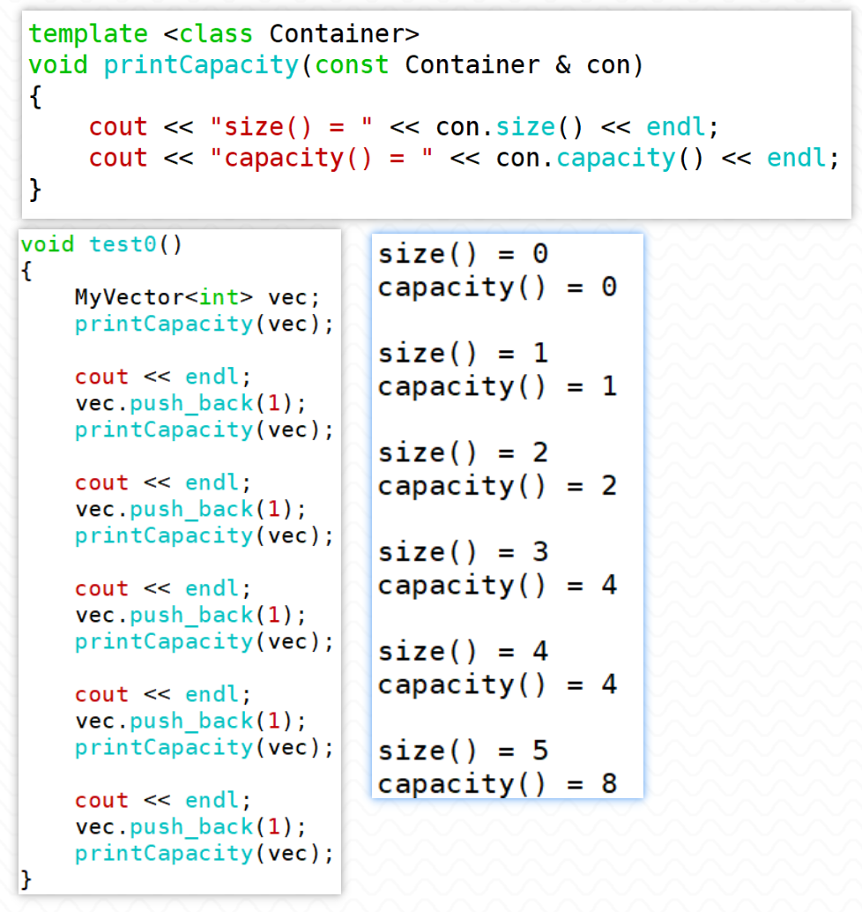
如果想遍历容器中的元素，首先想到的肯定是增强for循环方式（没有实现取下标，也没有实现迭代器相关的函数）

但仍然出现错误，说明增强for循环的底层实际上也是通过迭代器实现的

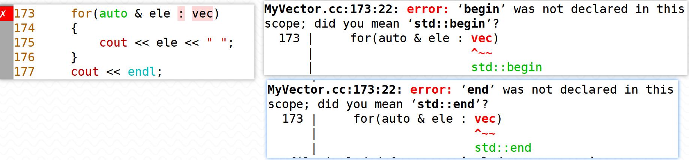

（5）完成迭代器相关函数

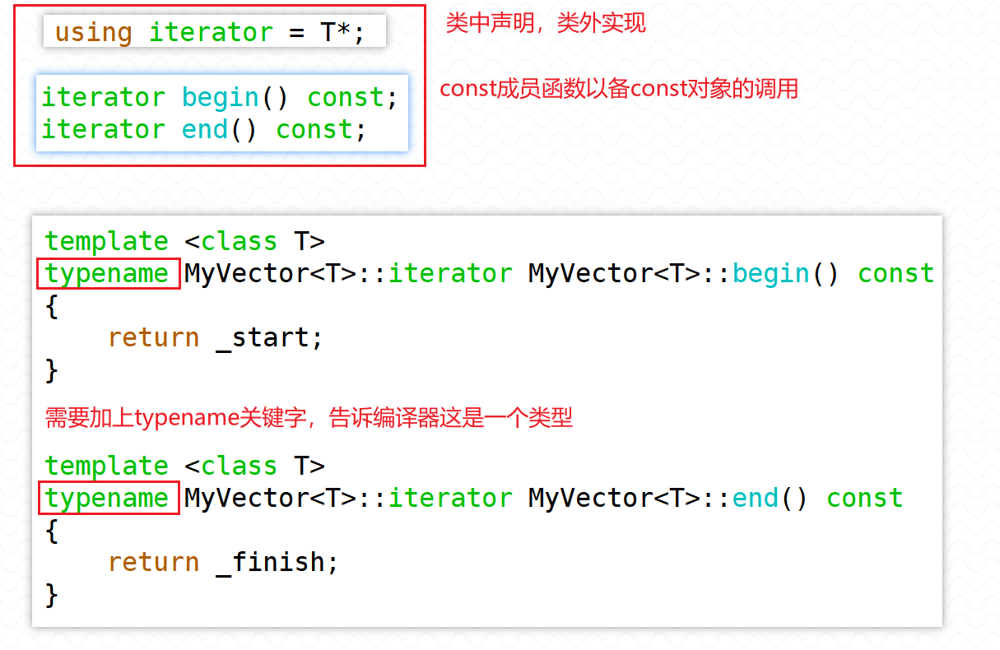
测试

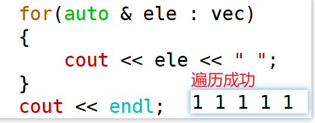
完成了简单的模拟后，其实还有很多可以完善的地方，比如取下标、比如insert，可以自行完善。

本章主要借此展示 `allocator` 空间配置器的基本使用。

### 原理

空间配置器会分为两级：

一级空间配置器使用类模板 `malloc_alloc_template`，底层使用 `malloc/free` 申请与释放空间。

二级空间配置器使用类模板 `default_alloc_template`。当申请空间大于 128 字节时，仍然走一级空间配置器；当申请空间小于或等于 128 字节时，使用内存池和自由链表管理。

> [!NOTE]
> 这里提到的自由链表实际是一个容量为 16 的指针数组，源码中名称类似 `_S_free_list`。

有一个容量为16的指针数组，每个元素（指针）指向一个链表 ，用于管理不同大小的内存块。这 16 个指针所指向的链表，分别对应 8、16、24、32、40、48、56、64、72、80、88、96、104、112、120、128 字节的内存块。

每当程序申请小于 128 字节的内存时，二级空间配置器会先将申请的内存大小上调为 8 的倍数，再根据上调后的大小（8的整数倍）找到对应的链表。

> 比如：
>
> 数组中下标为3的指针，代表着会按照8 * (3 + 1) = 32字节为基本单位申请空间。
>
> 第一次申请32个字节空间的时候，一次性申请很大一片空间（比如32 * 20 = 640个字节），然后按照32字节为一个等分，分成多个等分，然后挂接在下标为3的指针下面，形成链表形式。
>
> 以后需要32字节的时候，直接在下标为3的下面取出一个节点即可，就是32个字节的内存空间。
>
>
>
> 如果申请64字节空间，第一次申请时也申请很大一片空间，同样按照64字节为一个等分，分成多个等分，挂载在数组中下标为7的指针之下。
>
> 以后如果需要申请64字节时，就在下标为7的下面取出一个节点即可。
>
> 其他下标的处理方式完全一致。

自由链表的工作示意图如下

第一次申请空间时比较麻烦，后续再此申请同等大小的空间可以以O(1)的时间复杂度完成申请。

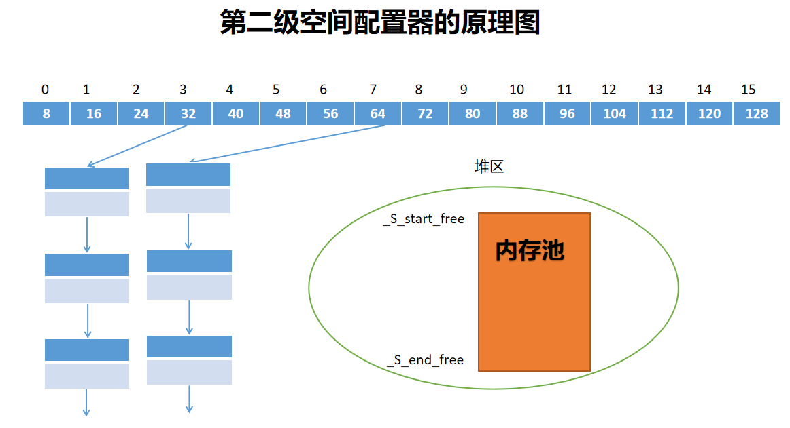

—— 这么干有什么意义呢，为什么不每次直接申请相应大小的空间？

如果频繁申请小片空间，容易产生内存碎片，导致空间利用率下降。空间配置器通过批量申请和自由链表复用，减少小块内存频繁申请释放带来的开销。

 会在内核态与用户态之间进行频繁的切换，时间消耗也比较大。
