# 第五章 运算符重载

## 友元

- 什么叫友元？

一般来说，类的私有成员只能在类的内部访问，类之外是不能访问它们的。但如果将其他类/函数设置为类的友元，那么友元类/函数就可以在前一个类的类定义之外访问其私有成员了。<span style=color:red;background:yellow>**用friend关键字声明友元**</span>。

将类比作一个家庭，类的private 成员相当于家庭的秘密，一般的外人当然不允许探听这些秘密的，只有 friend 才有资格探听这些秘密。


友元的三种形式：**普通函数、成员函数、友元类**

### 友元之普通函数形式

在类中将普通函数设置为友元, 通过该普通函数访问类中私有成员

``` c++
class MyClass
{
public:
    MyClass(){}
    MyClass(int data)
    :m_data(data)
    {}
    // 声明友元函数
    friend void friendFunc(const MyClass & cls);

private:
    int m_data;
    void privateFunc(){
        cout << "privateFunc" << endl;
    }
    // const函数由const对象访问
    void privateFunc() const{
        cout << "const privateFunc" << endl;
    }
};

// 使用了const
void friendFunc(const MyClass & cls)
{
    // 友元函数访问类中私有成员
    cout << cls.m_data << endl;
    cls.privateFunc();
}

void test1(){
    const MyClass cls2 {1};
    friendFunc(cls2);
}
```

### 友元之成员函数形式

假设类A有一个成员函数，该成员函数想去访问另一个类B类中的私有成员变量。这时候则可以在第二个类B中，声明第一个类A的那个成员函数为类B的友元函数，这样第一个类A的某个成员函数就可以访问第二个类B的私有成员变量了。

注意:

1. 需要把B类前向声明,否则在A类中不知道B类的存在
2. 需要在A类中给出成员函数的声明,函数的定义即具体实现写在类外,此时编译器只知道B类的存在,但是不知道具体实现.

``` c++
//前向声明 : 让编译器认识MyClass类
class MyClass;

class FriendClass
{
public:
    void display(MyClass & cls); 
};

class MyClass
{
public:
    MyClass(){}
    MyClass(int data)
    :m_data(data)
    {}
    // 成员函数作为友元声明
    friend void FriendClass::display(MyClass & cls);

private:
    int m_data;
    void privateFunc(){
        cout << "privateFunc" << endl;
    }
};

void FriendClass::display(MyClass & cls)
{
    cout << cls.m_data << endl;
    cls.privateFunc();
}

void test1()
{
    FriendClass cls {};
    MyClass myClass {20};
    cls.display(myClass);
}

int main(int argc, char *argv[])
{
    test1();
    return 0;
}

```


补充：

前向声明的用处：进行了前向声明的类，可以以引用或指针的形式作为函数的参数，只要不涉及到对该类对象具体成员的访问，编译器可以通过。

（让编译器认识这个类，但是注意如果只进行前向声明，这个类的具体实现没有的话，无法使用这个类的对象，无法创建）

<span style=color:red;background:yellow>**注意：友元的声明要注意和函数的形式完全对应上。**</span>

### 友元类

如上的例子，假设类 A中不止有一个 成员函数，还有其他成员函数，它们都需要访问B类 的私有成员，如果还像上面的方式一个一个设置友元，就比较繁琐了，可以直接将 A类设置为 B 的友元类，在工作中这也是更常见的方法。

``` c++
class B {
	//...
	friend class A;
	//...
};
```

在B类中声明A类是本类的友元类，那么A类中的所有成员函数中都可以访问B类的私有成员。一次声明，全部解决。

```c++
// B类
class MyClass
{
public:
    MyClass(){}
    MyClass(int data)
        :m_data(data)
    {}
    // FriendClass类作为友元声明
    friend class FriendClass; 
private:
    int m_data;
    void privateFunc(){
        cout << "privateFunc" << endl;
    }
};
// A类
class FriendClass
{
public:
    void display(MyClass & cls)
    {
        cout << cls.m_data << endl;
        cls.privateFunc();
    }
    
    void display2(MyClass & cls)
    {
        cout << cls.m_data << endl;
        cls.privateFunc();
    }

};

void test1()
{
    FriendClass cls {};
    MyClass myClass {20};
    cls.display(myClass);
    cls.display2(myClass);
}

int main(int argc, char *argv[])
{
    test1();
    return 0;
}
```


不可否认，友元将类的私有成员暴露出来，在一定程度上破坏了信息隐藏机制，似乎是种“副作用很大的药”，但俗话说“良药苦口”。好工具总是要付出点代价的，拿把锋利的刀砍瓜切菜，总是要注意不要割到手指的。

友元的存在，使得类的接口扩展更为灵活，使用友元进行运算符重载从概念上也更容易理解一些，而且， C++ 规则已经极力地将友元的使用限制在了一定范围内。


### 友元的特点

1. **友元不受类中访问权限的限制**——可访问私有成员
2. **友元破坏了类的封装性**
3. **不能滥用友元 ，友元的使用受到限制**
4. **友元是单向的**——A类是B类的友元类(B中声明A为friend class)，则A类成员函数中可以访问B类私有成员；但并不代表B类是A类的友元类，如果A类中没有声明B类为友元类，此时B类的成员函数中并不能访问A类私有成员
5. **友元不具备传递性**——A是B的友元类，B是C的友元类，无法推断出A是C的友元类
6. **友元不能被继承**——因为友元破坏了类的封装性，为了降低影响，设计层面上友元不能被继承

## 运算符重载

### 运算符重载的介绍

C++ 预定义中的运算符的操作对象只局限于基本的内置数据类型，但是对于自定义的类型是没有办法操作的。当然我们可以定义一些函数来实现这些操作，但考虑到用运算符表达含义的方式很简洁易懂，当定义了自定义类型时，也希望这些运算符能被自定义类类型使用，以此提高开发效率，增加代码的可复用性。为了实现这个需求，C++提供了运算符重载。其指导思想是：<span style=color:red;background:yellow>**希望自定义类类型在操作时与内置类型保持一致**</span>。


能够重载的运算符有42个

| +    | -    | *    | /      | %     | ^        |
| ---- | ---- | ---- | ------ | ----- | -------- |
| &    | \|   | ~    | !      | =     | <        |
| >    | +=   | -=   | *=     | /=    | %=       |
| ^=   | &=   | \|=  | >>     | <<    | >>=      |
| <<=  | ==   | !=   | >=     | <=    | &&       |
| \|\| | ++   | --   | ->*    | ->    | ,        |
| []   | ()   | new  | delete | new[] | delete[] |

不能重载的运算符包括

- `.` 成员访问运算符
- `.*`成员指针访问运算符
- `?:`三目运算符
- `::`作用域限定符
- `sizeof `长度运算符

记法：**带点的运算符不能重载，加上sizeof**


### 运算符重载的规则与形式（重点）

- **运算符重载有以下规则**

1. 运算符重载时 ，<font color=red>**其操作数类型必须要有自定义类类型或枚举类型**</font> ——不能全都是内置类型

2. 运算符重载的本质是函数重载, 其优先级和结合性还是固定不变的       a ==   b + c

3. <font color=red>**操作符的操作数个数是保持不变的**</font>

4. <font color=red>**运算符重载时 ，不能设置默认参数**</font>     ——如果设置了默认值，其实也就是改变了操作数的个数

5. 逻辑与 && 逻辑或 || 就不再具备短路求值特性 ，进入函数体之前必须完成所有函数参数的计算, 不推荐重载

6. 不能臆造一个并不存在的运算符         @ $ 、

   

- **运算符重载的形式**

运算符重载的形式有三种：

1. <span style=color:red;background:yellow>**采用友元函数的重载形式**</span>
2. 采用普通函数的重载形式
3. <span style=color:red;background:yellow>**采用成员函数的重载形式**</span>

以加法运算符为例，认识这三种形式。

### +运算符重载

需求：实现一个复数类，复数分为实部和虚部，重载+运算符，使其能够处理两个复数之间的加法运算（实部加实部，虚部加虚部）

#### 友元函数实现

我们可以定义一个普通函数，接收两个复数类对象，在这个函数中定义计算逻辑。因为要在类外访问Complex的私有成员，故可以将这个普通函数设为Complex的友元函数

``` c++
class Complex{
    //...
    friend Complex add(const Complex & lhs, const Complex & rhs);
    //...
};

Complex add(const Complex & lhs, const Complex & rhs){
    //...
}

void test0(){
    Complex cx(1,2);
    Complex cx2(3,4);
    Complex cx3 = add(cx,cx2); //这样就可以计算两个Complex对象的加法了
}
```


还想要更直观、更简洁一些，那么可以定义一个相应的运算符重载函数（operator+），就可以直接使用+完成这两个对象的加法运算了

``` c++
class Complex{
    //...
    friend Complex operator+(const Complex & lhs, const Complex & rhs);
    //...
};

Complex operator+(const Complex & lhs, const Complex & rhs){
    //...
}

void test0(){
    Complex cx(1,2);
    Complex cx2(3,4);
    Complex cx3 = cx + cx2; //看上去和内置类型的计算一样了
    //Complex cx3 = operator(cx,cx2);   //本质上是调用了operator+函数
}
```


> **运算符重载的本质是定义一个运算符重载函数，定义的步骤如下**
>
> 1. 先确定这个函数的返回值是什么类型（加法运算返回值应该是一个临时的Complex对象，所以此处返回类型为Complex）
> 2. 再写上函数名（operator + 运算符，此处就是**operator+**）
> 3. 再补充参数列表（考虑这个运算符有几个操作数，此处加法运算应该有两个操作数，分别是两个Complex对象，因为加法操作不改变操作数的值，可以用const引用作为形参）
> 4. 最后完成函数体的内容（此处直接调用Complex构造函数创建一个新的对象作为返回值）。
>
> 
>
> ——在定义的operator+函数中需要访问Complex类的私有成员，要进行友元声明
>
> <span style=color:red;background:yellow>**像加号这一类不会修改操作数的值的运算符，倾向于采用友元函数的方式重载。**</span>


#### 普通函数实现

在一个普通函数中想要访问一个类的私有成员，也可以给这个类添加一些公有的get系列函数，因为这些成员函数是可以访问私有成员的，而在类外可以通过对象直接调用这些成员函数，也就能获取到私有成员了。

**实际工作中不推荐使用，因为这样做几乎完全失去了对私有成员的保护。**

``` c++
class Complex {
public:
	//...
	double getReal() const { return m_real; }
	double getImage() const { return m_image; }
	//...
};

Complex operator+(const Complex & lhs, const Complex & rhs)
{
	return Complex(lhs.getReal() + rhs.getReal(),
			lhs.getImage() + rhs.getImage());
}

void test0()
{
	Complex c1(1, 2), c2(3, 4);
	Complex c3 = c1 + c2;//ok
}
```

#### 成员函数实现

还可以将运算符重载函数定义为Complex类的成员函数

``` c++
class Complex{
public:
	//...
	Complex operator+(const Complex & rhs)
	{
		return Complex(m_real + rhs.m_real, m_image + rhs.m_image);
	}
};
```


**这种写法要注意的是，加法运算符的左操作数实际上就是this指针所指向的对象，在参数列表中只需要写上右操作数**

```C++
Complex cp1(1,2);
Complex cp2(3,4);
Complex cp = cp1 + cp2;  //本质是Complex cp = cp1.operator+(cp2)  
```


——思考，如果我们写出了这样的代码，是否可以通过呢？ —— 可以通过，但是要避免

``` c++
class Complex{
public:
	//...
	Complex operator+(const Complex & rhs)
	{
		return Complex(m_real - rhs.m_real, m_image - rhs.m_image);
	}
};
```

明明是加操作符，但函数内却进行的是减法运算，这是合乎语法规则的，不过却有悖于人们的直觉思维，会引起不必要的混乱。

因此，除非有特别的理由，**尽量使重载的运算符与其内置的、广为接受的语义保持一致**。


### +=运算符重载

如果要让Complex对象能够使用+=运算符进行计算，需要对+=运算符进行重载。

<span style=color:red;background:yellow>**像+=这一类会修改操作数的值的运算符，倾向于采用成员函数的方式重载。**</span>

同样按照上述步骤来定义运算符重载函数，请尝试实现

> - 确定用什么方式重载
> - 确定函数的返回值
> - 再写上函数名（operator运算符）
> - 再补充参数列表（友元的普通函数——运算需要多少操作数就准备多少个参数；成员函数——考虑第一个操作数是this指针所指向的对象）
> - 最后完成函数体的内容（结合实际）。
>
> ```c++
> class Complex
> {
> public:
>     Complex(int real, int image)
>     : m_real(real)
>     , m_image(image)
>     {}        
> 
>     Complex & operator+=(const Complex & com)
>     {
>         this->m_real = this->m_real + com.m_real;
>         this->m_image = this->m_image+ com.m_image;
>         return *this;
>     }
>     void print()
>     {
>         cout << m_real << "+" << m_image << "i" << endl;
>     }
> 
> private:
>     int m_real;
>     int m_image;
> };
> 
> ```
>
> 


### 重载形式的选择（重要）

**友元函数方式重载适用场景**

* 不会修改操作数的值的运算符
* 具有对称性的运算符可能转换任意一端的运算对象，例如相等性、位运算符等

**成员函数方式重载适用场景**

* 会修改操作数的值的运算符
* **赋值=、下标[ ]、调用()、成员访问->、成员指针访问->* 运算符必须是成员函数形式重载**
* 与给定类型密切相关的运算符，如递增、递减和解引用运算符


### ++运算符重载

自增运算符有前置++和后置++两种形式，依然按照内置类型先分析计算逻辑，再类比这个计算逻辑去定义运算符重载函数

int a = 5; 

 a++的操作是使a的值增为6，但是这个表达式的返回值却是一个临时变量（a的值改变前的副本，即5）

++a则是使a的值增加到6，直接返回变量a本身

类比Complex，写出++运算符重载函数。按照我们目前的认知，前置++和后置++都应该选择成员函数的形式进行重载。

但是前置形式和后置形式都是只有一个操作数（本对象），参数完全相同的情况下，只有返回类型不同不能构成重载。前置形式和后置形式的区分只能通过设计层面人为地加上区分。

``` c++
void test0()
{
    // 以内置类型为参考
    int a = 1;
    &(++a); // OK 左值
    /* &(a++); error 右值 是个临时变量*/
}

//前置++的形式
Complex& operator++()
{
    cout << "Complex & operator++()" << endl;
    ++m_real;
    ++m_image;
    return *this;
}

//后置++的形式
//参数列表中要多加一个int
//与前置形式进行区分
Complex operator++(int)
{
    cout << "Complex operator++(int)" << endl;
    //通过拷贝构造 把当前对象的数据成员初始化一个新对象
    Complex tmp(*this);
    ++m_real;
    ++m_image;
    // 返回新对象
    return tmp;
    }


void test1()
{
    Complex c1 = Complex{1,1};
    /* Complex c2 = ++c1; */
    Complex c2 = c1++;
    c2.print();
    c1.print();
}

```

后置++中参数列表中的 `int` 并不需要一个具体的变量名，它只是用来区分前置和后置运算符的。这个 `int` 参数的存在是为了符合运算符重载的语法要求，而它实际上并不被使用,这个参数的实际作用是作为一个占位符，告诉编译器这是后置版本的自增


### [ ]运算符重载

在 C++ 中，`[]` 运算符重载通常用于实现类似数组访问的功能，可以让自定义类型的对象支持数组下标操作重载 

`[]` 运算符的基本形式如下：

```c++
Type & operator[](size_t index); // size_t无符号
```

- **参数**：`index`：下标，用于指定访问的元素位置。
- **返回值**：通常是返回某个元素的引用，可以是常量引用（`const Type&`）或非常量引用（`Type&`），以便支持修改元素的值或只读访问。


需求：定义一个CharArray类，模拟char数组，需要通过下标访问运算符能够对对应下标位置字符进行访问。

- 分析[ ]运算符重载函数的返回类型，因为通过下标取出字符后可能进行写操作，需要改变CharArray对象的内容，所以应该用char引用；

- [ ]运算符的操作数有两个，一个是CharArray对象，一个是下标数据，ch[0]的本质是ch.operator[] (0)；

函数体实现需要考虑下标访问越界情况，若未越界则返回对应下标位置的字符，若越界返回终止符。

``` c++
class CharArray
{
public:
    //constructor
    CharArray(const char * str)
    : m_capacity(strlen(str))
    , m_data(new char[strlen(str) + 1]{})
    {
        strcpy(m_data, str);
    }
    //destructor
    ~CharArray()
    {
        if(m_data)
        {
            delete [] m_data;
            m_data = nullptr;
        }
    }
    // operator []  重载
    char & operator[](size_t index)
    {
        // 判断下标是否越界
        if(index >= m_capacity)
        {
            cout << "index out of range" << endl;
            static char nullChar = '\0';
            return nullChar;
        }else{
            // 返回下标位置的字符
            return m_data[index];
        }
    }
    void print()
    {
        cout << m_data << endl;
    }
private:
    int m_capacity;// 数组容量
    char * m_data;// 数组指针
};

void test1()
{
    CharArray ch {"hello"};
    cout << ch[0] << endl;
    ch[0] = 'H';
    cout << ch[0] << endl;
    ch.print();
}
```


思考，如果要禁止CharArray对象通过下标访问修改字符数组中的元素，应该怎么办？


```c++
//const对象使用下标访问会调用 const版本的operator[]函数指的是后面那个const
//const版本的重载
const char & operator[](size_t idx) const
{
    // 判断下标是否越界
    if(index >= m_capacity)
    {
        cout << "index out of range" << endl;
        static char nullChar = '\0';
        return nullChar;
    }else{
        // 返回下标位置的字符
        return m_data[index];
    }
}
```


### 输入输出流运算符重载（重要）

#### 输出流运算符 <<

`<<` 输出运算符重载的基本形式如下：

```c++
std::ostream & operator<<(std::ostream & os, const MyClass & obj);
```

**返回类型**

-  `std::ostream &`，这样可以使输出支持链式调用。

**参数**

- 第一个参数 `std::ostream & os`，表示输出流。
- 第二个参数 `const MyClass & obj`，表示我们要输出的自定义类对象。

在之前的例子中，我们如果想打印一个对象时，常用的方法是通过定义一个 print 成员函数来完成，但使用起来不太方便。我们希望打印一个对象，与打印一个整型数据在形式上没有差别(如下例子)，那就必须要重载 << 运算符。

需求：

对于Complex对象，希望像内置类型数据一样，使用输出流运算符可以对其进行输出

分析：

- 输出流运算符有两个操作数，左操作数是输出流对象，右操作数是Complex对象。如果将输出流运算符函数写成Complex的成员函数，会带来一个问题，成员函数的第一个参数必然是this指针，也就是说Complex对象必须要作为左操作数。这种方式完成重载函数后，只能cx << cout这样来使用，与内置类型的使用方法不同，所以<span style=color:red;background:yellow>**输出流运算符的重载采用友元形式。**</span>

- cout << cx这个语句的返回值是`cout`对象，为了不必要的拷贝与支持链式调用，返回类型为`ostream &`；

- 参数列表中第一个是左操作数（`cout`对象），写出类型并给出形参名；第二个是右操作数（`Complex`对象），因为不会在输出流函数中修改它的值，采用`const Complex &`；

- 将Complex的信息通过连续输出语句全部输出给os，最终返回os（注意，使用cout输出流时通常会带上endl，那么在函数定义中就不加endl，以免多余换行）


``` c++

class Complex
{
public:
    Complex(int real, int image)
    : m_real(real)
    , m_image(image)
    {}        

    // 利用友元函数实现<< 重载
    friend std::ostream& operator<<(std::ostream& os, const Complex & com);

private:
    int m_real;
    int m_image;
};

// 利用友元函数实现<< 重载
// std::ostream不支持拷贝构造 需要使用引用
std::ostream& operator<<(std::ostream& os, const Complex & com)
{
    os << com.m_real << "+" << com.m_image << "i" ;
    return os;
}

void test1(){
    Complex com = Complex {1,2};
    cout << com << endl;
    // 本质形式
    operator<<(cout, com);
    
}


```

——为了和内置类型的使用方式保持一致，输出流	符重载采用友元形式

#### 输入流运算符 >>

`>>` 输入运算符重载的基本形式如下：

```c++
std::istream & operator>>(std::istream & is, MyClass & obj);
```

**参数**：

- `std::istream & is`：输入流对象（如 `std::cin`）。
- `MyClass & obj`：要将流中的数据存储到的对象, 要修改对象中数据成员 不能加const限定

**返回值**：返回输入流对象 `std::istream &`，这样可以支持链式调用


需求：对于Complex对象，希望像内置类型数据一样，使用输入流运算符可以对其进行输入

实现过程与输出流类似

```` C++
class Complex {
public:
	//...
	friend istream & operator>>(istream & is, Complex & rhs);
private:
	int m_real;
	int m_image;
};

istream & operator>>(istream & is, Complex & rhs)
{
	is >> rhs.m_real;
	is >> rhs.m_image;
	return is;
}
````

——如果不想分开输出实部和虚部，也可以直接连续输入，空格符、换行符都能作为分隔符

``` c++
istream & operator>>(istream & is, Complex & rhs)
{
	is >> rhs.m_real >> rhs.m_image;
	return is;
}
```


但是还有个问题需要考虑，使用输入流时需要判断是否是合法输入

——可以封装一个函数判断接收到的是合法的int数据，在>>运算符重载函数中调用，请结合前面输入流的知识试着实现


```c++
// 输入并验证是否为整数
std::istream & judgeInt(std::istream & is, int & number) {
    cout << "input a number: ";
    while (true) {
        if (is >> number) {
            break;
        } else {
            // 清除流状态
            is.clear();
            is.ignore(std::numeric_limits<std::streamsize>::max(), '\n');
            cout << "Invalid input, please input again: ";
        }
    }
    return is;
}
```


### 成员访问运算符

**成员访问运算符包括`.`和`->`，其中`.`这个运算符是不能重载的，`->`运算符是可以重载的。**

箭头访问运算符 -> 和解引用运算符 * ，它们是指针操作最常用的两个运算符。我们先来看箭头运算符 -> 

箭头运算符只能以成员函数的形式重载，其返回值必须是一个指针或者重载了箭头运算符的对象。来看下例子：

#### 两层结构下的使用

例子：建立一个双层的结构，MiddleLayer含有一个Data*型的数据成员


``` c++
class Data
{
public:
    Data(){}
    ~Data(){}

    int getData() const{ return m_data; }
private:
    int m_data = 10;
};

class MiddleLayer
{
public:
    MiddleLayer(Data * p)
    : m_pData(p)
    {}

    ~MiddleLayer(){
        if(m_pData){
            delete m_pData;
            m_pData = nullptr;
        }
    }
private:
    Data * m_pData;
};

```


Data*原生指针的用法如下，需要关注堆空间资源的回收

``` c++
Data * p = new Data();
p->getData();
(*p).getData();
delete p;
p = nullptr;
```

> 
>
> 如果用这种方式创建MiddleLayer对象，我们发现不需要手动delet pdata，并没有发生内存泄露，反而手动delet pdata后会有double free的问题
>
> ```c++
> void test(){
>  Data *p_data = new Data();
>  MiddleLayer obj = MiddleLayer{p_data};
>  delete p_data;
>  p_data = nullptr; 
> }
> ```
>
> 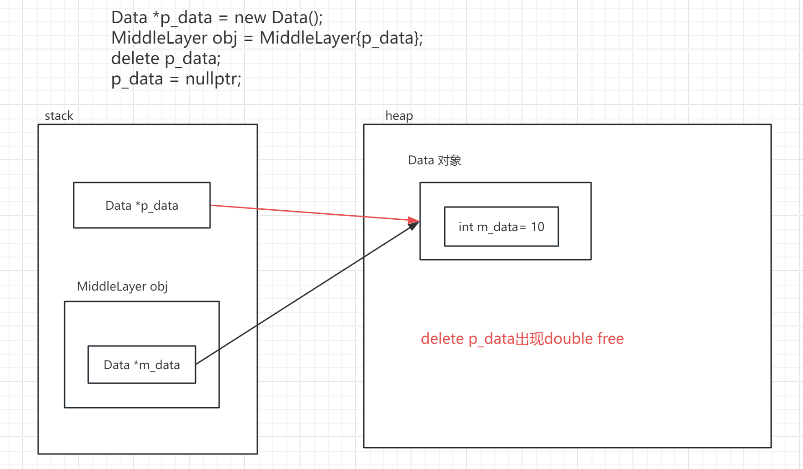
>
> 因为MiddleLayer对象实际上对堆上Data对象形成了接管。


当然，也可以让Middlelayer对象自己管理一个Data对象

> ```c++
> Data *p_data = new Data();
> // MiddleLayer 对象自己管理一个Data对象
> MiddleLayer obj = MiddleLayer{new Data()};
> delete p_data;
> p_data = nullptr;
> ```
>
> 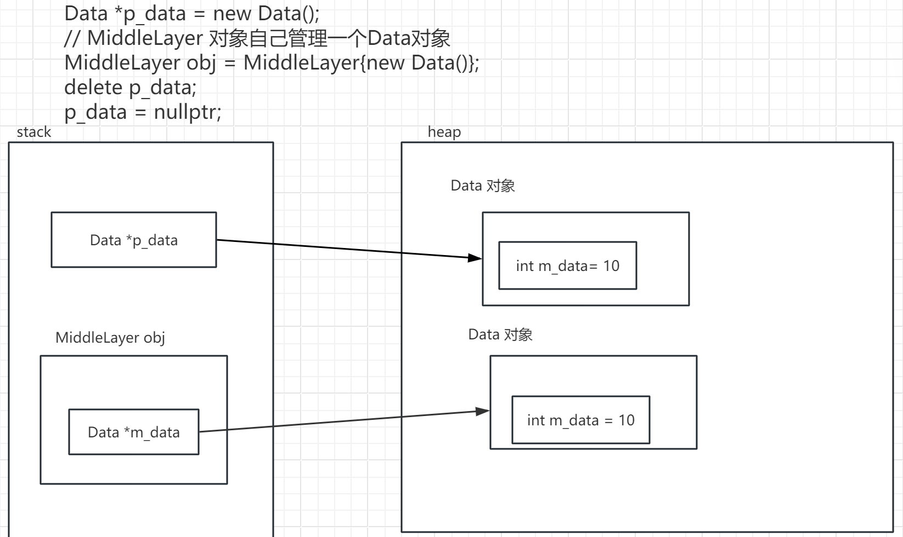
>
> 


> 需求：希望实现一个这样的效果，创建MiddleLayer对象ml，让ml对象可以使用箭头运算符去调用Data类的成员函数getData
>
> ``` c++
> MiddleLayer ml(new Data);
> cout << ml->getData() << endl;
> ```
>
> 这个需求很合理，因为MiddleLayer的数据成员只有一个Data*类型的指针


箭头运算符无法应对MiddleLayer对象，那么可以定义箭头运算符重载函数。

要重载 `->` 运算符，需要在类中定义 `operator->` 成员函数。这个成员函数的返回值通常是一个**指针**，该指针指向内部对象或封装的其他类的对象。

基本语法:

```c++
Type * operator->();
```

**返回类型**：`operator->` 必须返回一个指针，因为 `->` 运算符会继续对返回的指针进行成员访问, 编译器会自动递归调用`operator->()`直到得到原生指针。

即:

``` c++
Data * operator->(){
    return m_pData;
}
```

```c++
void test(){
    MiddleLayer obj = MiddleLayer{new Data()};
    // 通过MiddleLayer对象访问Data对象成员,使用->运算符重载
    cout << obj.operator->()->getData() << endl;
    // 上下等价
    cout << obj->getData() << endl;
}

```


思考，解引用运算符应该如何重载能够实现同样的效果呢？直接使用MiddleLayer对象模仿Data*指针去访问getData函数

要重载解引用运算符 `*`，需要在类中定义 `operator*` 成员函数。通常返回一个对内部封装对象的引用，这样用户就可以像使用普通指针一样访问内部对象的成员。

```c++
Type & operator*();
```

- **返回类型**：通常是一个引用 (`Type &`)，这样可以允许对对象的直接修改。
- 如果要确保支持 `const` 对象，可以提供一个常量版本的 `operator*()`。


```c++
// *解引用重载
Data & operator*()
{
    return *m_pData;
}

```

```c++
void test4(){
    MiddleLayer obj = MiddleLayer{new Data()};
    // 通过MiddleLayer对象访问Data对象成员
    // 利用重载的->得到Data* 再利用基本的->访问Data成员
    cout << (obj.operator->())->getData()<< endl;
    // 利用重载的*得到Data对象, 同过Data对象访问成员
    cout << obj.operator*().getData() << endl;
    // 上下等价
    cout << (*obj).getData() << endl;
    
    // 智能指针的雏形: 利用局部对象的生命周期来回收资源
}

```

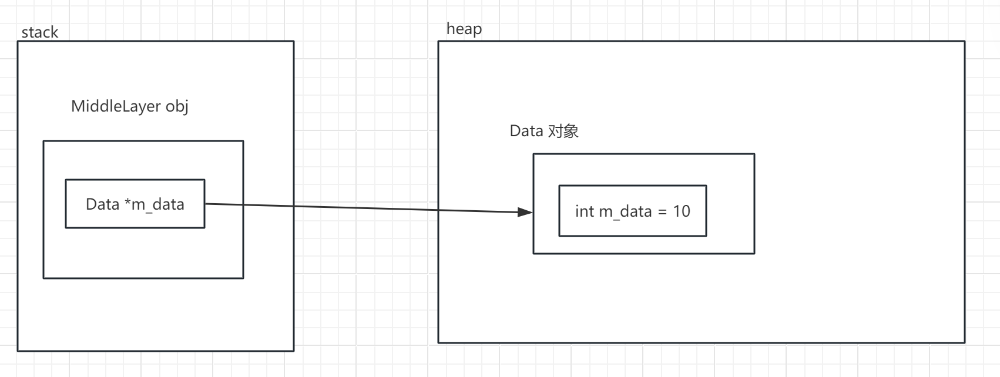


小结:

- 重载 `*` 解引用运算符的目的是使类对象可以表现得像指针一样，通过解引用访问封装的对象。
- 重载 `*` 通常用于实现类似智能指针的类，返回内部封装对象的引用。


当我们完成了以上的需求后，还有一件“神奇”的事情，使用的语句中有new没有delete，但是检查发现并没有内存泄漏

**原因：obj本身是一个局部对象，因为重载了箭头运算符和解引用运算符，所以看起来像个指针，也可以像指针一样进行使用，但是这个对象在栈帧结束时会自动销毁，自动调用析构函数回收了它的数据成员所申请的堆空间**

**实际上，这就是智能指针的雏形：其思想就是通过对象的生命周期来管理资源。**


#### 三层结构下的使用（难点）

- **拓展思考：那么如果结构再加一层，引入一个ThirdLayer类**

```c++
class ThirdLayer
{
public:
    ThirdLayer(MiddleLayer *ml)
    :m_pml(ml)
    {
        cout << "ThirdLayer constructor" << endl;
    }
    ~ThirdLayer()
    {
        cout << "ThirdLayer destructor" << endl;
        if(m_pml){
            delete m_pml;
            m_pml = nullptr;
        }
    }
private:
    MiddleLayer *m_pml;
};

```


创建ThirdLayer对象时注意避免这样的错误

```c++
// 错误的创建方式,让tl对象接管了栈上的MiddleLayer对象 在执行析构时会发生错误
Data *p_data = new Data{  };
MiddleLayer ml = MiddleLayer{ p_data };
ThirdLayer tl = ThirdLayer{ &ml };
```

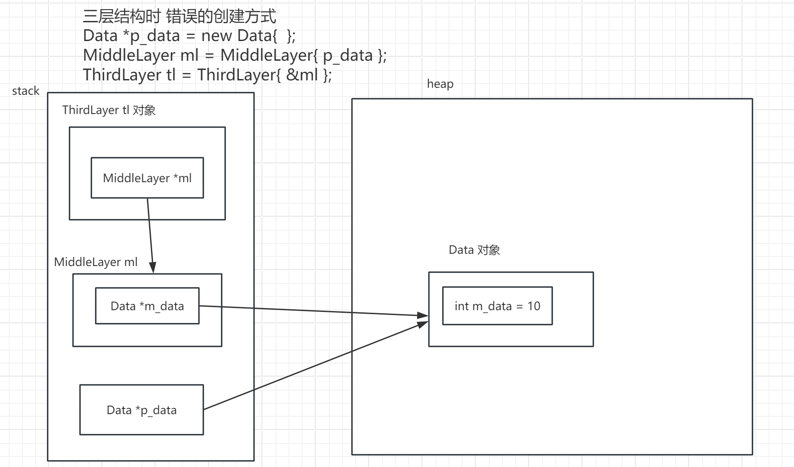

<span style=color:red;background:yellow>**注意：应该让ThirdLayer底层的指针管理一个堆上的MiddleLayer对象**</span>

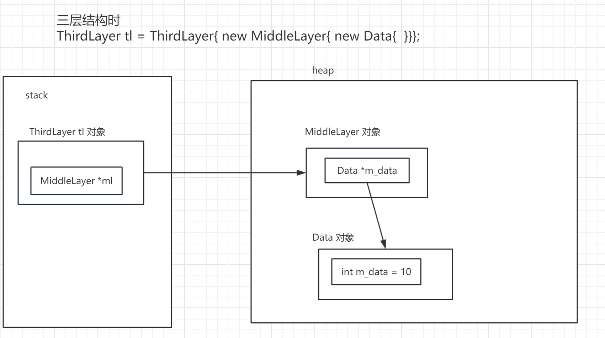

希望实现如下使用方式，思考一下应该如何对ThirdLayer进行对应的运算符重载

``` c++
ThirdLayer tl(new MiddleLayer(new Data));
cout << tl->getData() << endl;
cout << (*(*tl)).getData() << endl;
```


> 在ThirdLayer类中定义这两个成员函数
>
> ```c++
> // 在MiddleLayer重载的operator->函数作为铺垫
> // 只需要返回MiddleLayer对象即可
> // ->重载
> MiddleLayer & operator->()
> {
>     return *m_pml;
> }
> // *重载
> MiddleLayer & operator*()
> {
>     return *m_pml;
> }
> ```
>
> 
>
> —— 在使用时就可以这样用
>
> 箭头运算符 / 解引用运算符的使用：
>
> ```c++
> ThirdLayer tl = ThirdLayer{new MiddleLayer{new Data{  } } };
> // 解引用使用
> cout << (*(*tl)).getData() << endl;
> // 本质 同过*重载得到MiddleLayer对象后再解引用得到Data对象
> cout << tl.operator*().operator*().getData() << endl;
> 
> // ->使用
> cout << tl->getData() << endl;
> // 本质 链式调用
> cout << tl.operator->().operator->()->getData() << endl;
> ```

- 拓展思考：如果解引用的使用也希望和箭头运算符一样，一步到位，又该如何实现

``` c++
ThirdLayer tl(new MiddleLayer(new Data));
cout << (*tl).getData() << endl;
```

<font color=red>**如下return的形式都可以实现。**</font>

```c++

Data & operator*()
{
    return *(*m_pml);
    // 本质 *m_pml得到MiddleLayer对象 再利用重载的*得到Data对象
    // return (*m_pml).operator*();
    // return *((*m_pml).m_pData); // 借助友元, 使得可以在ThirdLayer中访问MiddleLayer中私有成员
}
```

#### 内存分析

三层的结构比较复杂，我们可以通过内存图的方式进行分析。

ThirdLayer对象的创建

``` c++
ThirdLayer tl(new MiddleLayer(new Data));
```

实际上的内存结构如图


> <span style=color:red;background:yellow>**创建和销毁的过程：**</span>
>
> 创建tl对象时，调用ThirdLayer的构造函数，在ThirdLayer构造函数的参数初始化过程中调用MiddleLayer的构造函数，在ThirdLayer构造函数的参数初始化过程调用Data的构造。
>
> Data构造完才能完成MiddleLayer的指针数据成员初始化，MiddleLayer创建完毕，才能完成ThirdLayer的指针数据成员初始化。
>
> tl销毁时，马上调用ThirdLayer的析构，执行delete m_pml时，第一步调用MiddleLayer的析构，在这个过程中，会delete m_pdata，会调用Data的析构函数。
>
> <font color=red>**由于构造函数打印信息语句只能在函数体中，所以呈现出如下结果**</font>
>
> 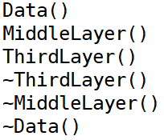

##  可调用实体

讲到调用这个词，我们首先能够想到**普通函数**和**函数指针**，在学习了类与对象的基础知识后，还增加了**成员函数**，那么它们都被称为<font color=red>**可调用实体**</font>。事实上，根据其他的一些不同的场景需求，C++还提供了一些可调用实体，它们都是通过运算符重载来实现的。

普通函数执行时，有一个特点就是无记忆性。一个普通函数执行完毕，它所在的函数栈空间就会被销毁，所以普通函数执行时的状态信息，是无法保存下来的，这就让它无法应用在那些需要对每次的执行状态信息进行维护的场景。大家知道，我们学习了类与对象以后，有了对象的存在，对象执行某些操作之后，只要对象没有销毁，其状态就是可以保留下来的。

### 函数对象

将重载了函数调用运算符的类创建的对象称为函数对象

一个行为类似于函数的对象, 它的作用是在代码中能够像函数一样调用，但是它其实是一个类的实例

``` c++
class FunctionObject{
    //...
    // 重载函数调用运算符
    ReturnType operator()(ParameterList)
    {
        // do something....
    }
};

void test0(){
    FunctionObject fo{ };
    fo();  //让对象像一个函数一样被调用
}
```


上面的代码看起来很奇怪，如果我们从运算符的视角出发，就是函数调用运算符()要处理FunctionObject对象，只需要实现一个<font color=red>**函数调用运算符重载**</font>函数即可。

**函数调用运算符重载**，是一种允许对象像函数一样被调用的技术。它通过重载 `operator()` 运算符来实现，使得类的实例能够表现得像函数

基本语法 :

- **`ReturnType`**：函数调用返回的类型。
- **`ParameterList`**：可以是零个或多个参数，类似于普通函数。
- 函数调用运算符必须以成员函数的形式进行重载

```c++
ReturnType operator()(ParameterList);
```


例如:

``` c++
class FunctionObject{
    void operator()(){
        cout << "void operator()()" << endl;
    }
};

void test0(){
    FunctionObject fo;
    fo();  //ok
    // 本质如下
    fo.operator()();
}
```


<span style=color:red;background:yellow>**重载了函数调用运算符的类的对象称为函数对象**</span>，由于参数列表可以随意扩展 ，所以可以有很多重载形式（对应了普通函数的多种重载形式）

```c++
class FunctionObject{
public:
    void operator()()
    {
        cout << "operator()" << endl;
    }
    int operator()(int x, int y)
    {
        cout << "operator(int, int)" << endl;
        return  x + y;
    }
    double operator()(double x, double y, double z)
    {
        cout << "operator(double, double, double)" << endl;
        return  x + y + z;
    }

};

void test1(){
    FunctionObject fo = FunctionObject{};
    // 函数调用运算符来处理fo对象的使用
    fo();
    cout << fo(1,2) << endl;
    cout << fo(1.1, 2, 3.3) << endl;
}

```


> 函数对象相比普通函数的优点：
>
> 可以携带状态（函数对象可以封装自己的数据成员、成员函数，具有更好的面向对象的特性）
>
> 可以记录函数对象被调用的次数，而普通函数只能通过全局变量做到（全局变量不够安全）。

> 除此之外，函数对象作为STL的六大组件之一而存在，可以做很多定制化的行为。后面的章节中会学到。

``` c++
class FunctionObject{
public:
    void operator()(){
        cout << "FunctionObject operator()()" << endl;
        ++ m_count;
    }

    int operator()(int x, int y){
        cout <<"operator()(int,int)" << endl;
        ++ m_count;
        return x + y;
    }
    
    int m_count = 0;//携带状态
};

void test0(){
    FunctionObject fo;
  
    cout << fo() << endl;
    cout << fo.operator()() << endl;//本质

    cout << fo(5,6) << endl;
    cout << fo.operator()(5,6) << endl;//本质

    cout << "fo.m_count:" << fo.m_count << endl;//记录这个函数对象被调用的次数
}


```


### 函数指针

既然对象可以像一个函数一样去调用，那函数可不可以像一个对象一样去组织？

如果可以，那函数类型由什么决定呢，也就是说，如果把函数看作对象，如何从这些“对象”抽象出类来？       

在C的阶段就学习过函数指针，定义函数指针时要明确使用这个指针指向一个什么类型的函数（返回类型、参数类型都要确定）

声明函数指针:

```c++
返回类型 (*指针名称)(参数类型列表)
```

例如:

``` c++
void print(int x){
    cout << "print:" << x << endl;
}

void display(int x){
    cout << "display:" << x << endl;
}

int main(void){
    //省略形式
    void (*p)(int) = print;
    p(4);
    p = display;
    p(9);
    
    //完整形式
    void (*p2)(int) = &print;
    (*p2)(4);
    p2 = &display;
    (*p2)(9);
}
```


定义函数指针p后，可以指向print函数，也可以再指向display函数，并通过函数指针调用函数（两种方式——完整/省略）；

——那么其实可以抽象出一个函数指针类，这个类的对象就是这个特定类型的函数指针

p和p2可以抽象出一个函数指针类型**void(*)(int)**  —— <font color=red>**逻辑类型，不能在代码中直接以这种形式写出**</font>


以前我们使用typedef可以定义类型别名，这段程序中函数指针p、p2的类型是void (*) (int)，但是C++中是没有这个类的（我们可以这样理解，但是代码不能这么写）

可以使用typedef定义这样的一个新类型

可以理解为是给void ( * ) (int) 取类型别名为Function

``` c++
typedef void(*Function)(int);
```


Function类的“对象”可以这样使用，这个类的“对象”都是特定类型的函数指针，只能指向一种函数（这种函数的类型在定义函数指针类时就决定了）

``` c++
Function f;
// 指向print函数
f = print;
// 调用print函数
f(19);
// 指向display函数
f = display;
// 调用display函数
f(27);
```


### 成员函数指针

函数指针的用法熟悉后，顺势思考一个问题：成员函数能否也使用这种形式？如果可以，应该怎样定义一个成员函数指针

比如有这样一个类FFF，包含两个成员函数

```` c++
class FFF
{
public:
    void print(int x){
        cout << "FFF::print:" << x << endl;
    }

    void display(int x){
        cout << "FFF::display:" << x << endl;
    }
};
````

定义一个函数指针要明确指针指向的函数的返回类型、参数类型，那么<span style=color:red;background:yellow>**定义一个成员函数指针还需要确定的是这个成员函数是哪个类的成员函数（类的作用域）**</span>

```c++
// 声明成员函数指针:
返回类型 (类名::*指针名称)(参数列表);

//将成员函数指针指向特定的成员函数：
指针名称 = &类名::成员函数;
```

解释说明:

- **返回类型**：成员函数的返回类型。
- **类名**：成员函数所属的类。
- **指针名称**：成员函数指针的名称。
- **参数列表**：成员函数的参数类型。

与普通函数指针不一样的是，<font color=red>**成员函数指针的定义和使用都需要使用完整写法**</font>，不能使用省略写法，定义时要完整写出指针声明，使用时要完整写出解引用（解出成员函数后接受参数进行调用）。

另外，成员函数需要通过对象来调用，<font color=red>**成员函数指针也需要通过对象来调用**</font>。

```c++
(对象.*指针名称)(参数);     // 对于具体对象
(对象指针->*指针名称)(参数); // 对于对象指针(指向堆上的对象)
```

例如:

```` c++
void (FFF::*p)(int) = &FFF::print;
FFF ff;
(ff.*p)(4);
````


> 类比来写，也可以使用typedef来定义这种成员函数指针类,使用这个成员函数指针类的”对象“调用FFF类的成员函数print
>
> <font color=red>**这里有一个要求 —— 成员函数指针指向的成员函数需要是FFF类的公有成员函数**</font>
>
> ``` c++
> typedef void (FFF::*MemberFunction)(int); //定义成员函数类型MemberFunction
> MemberFunction mf = &FFF::print; //定义成员函数指针
> FFF fff;  
> (fff.*mf)(15);//通过对象调用成员函数指针
> ```
> 
>此时就出现了一个新的运算符 **".*"** —— <span style=color:red;background:yellow>**成员指针运算符的第一种形式。**</span>


> FFF类对象还可以是一个堆上的对象
>
> 例如:
>
> ``` c++
> typedef void (FFF::*MemberFunction)(int); //定义成员函数类型MemberFunction
> MemberFunction mf = &FFF::print; //定义成员函数指针
> FFF * fp = new FFF{};
> (fp->*mf)(65);//通过指针调用成员函数指针
> ```
>
> 又引出了新的运算符 **"->*"** —— <span style=color:red;background:yellow>**成员指针运算符的第二种形式。**</span>


**成员函数指针的意义：**

1. 回调函数：<font color=red>**将成员函数指针作为参数传递给其他函数**</font>，使其他函数能够在特定条件下调用该成员函数；
2. 事件处理：将成员函数指针存储事件处理程序中，以便在特定事件发生时调用相应的成员函数；
3. 多态性：通过将成员函数指针存储在基类指针中，可以实现多态性，在运行时能够去调用相应的成员函数。


### 空指针的使用（了解）

接着上面的例子，我们来看一段比较奇怪的代码 Class类型的指针指向nullptr 通过该指针->调用该类型的成员函数

``` c++
typedef void (FFF::*MemberFunction)(int); //定义成员函数类型MemberFunction
MemberFunction mf = &FFF::print; //定义成员函数指针
FFF * fp = nullptr;
(fp->*mf)(34);
```

发现竟然是可以通过的并输出了正常的结果。难道空指针去调用成员函数指针没有问题吗？

事实上，空指针去调用成员函数也好、成员函数指针也好，只要不涉及到访问该类数据成员，都是可以的。

``` c++
class Bar{
public:
    void test0(){ cout << "Bar::test0()" << endl; }
    void test1(int x){ cout << "Bar::test1(): " << x << endl; }
    void test2(){ cout << "Bar::test2(): " << m_data << endl; }

    int m_data = 10;
};

void test0(){
    Bar * fp = nullptr;
    fp->test0();//ok
    fp->test1(3);//ok
    fp->test2(); //error
}
```


结合内存图来分析

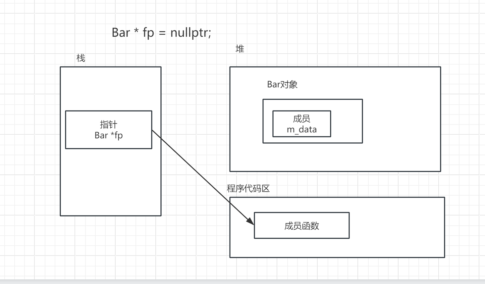

空指针没有指向有效的对象。对于不涉及数据成员的成员函数，不需要实际的对象上下文，因此就算是空指针也可以调用成功。对于涉及数据成员的成员函数，空指针无法提供有效的对象上下文，因此导致错误。

自己写代码别这么写，看到这样的代码知道为什么不报错就行了。


**总结：**

<span style=color:red;background:yellow>**C++中普通函数、函数指针、成员函数、成员函数指针、函数对象，可以将它们概括为可调用实体。**</span>


## 类型转换函数

以前我们认识了普通变量的类型转换，比如说 int 型转换为 long 型， double 型转换为 int 型，接下来我们要讨论下类对象与其他类型的转换。转换的方向有:

由其他类型向自定义类型转换

由自定义类型向其他类型转换


- **由其他类型向自定义类型转换**

由其他类型向自定义类型转换是由构造函数来实现的，只有当类中定义了合适的构造函数时，转换才能通过。这种转换，一般称为**隐式转换**。

例如:

``` c++
class A
{
public:
    // explicit //禁止隐式转换
    A(int num)
    : m_num(num)
    {
        cout << "A constructor" << endl;
    }
private:
    int m_num;
};

void test(){
    // 隐式转换 使用int数据创建出了一个A类型对象
    A a = 1;
}
```

这种隐式转换是比较奇怪的，一般情况下，不希望这种转换成立，所以可以在相应的构造函数之前加上`explicit`关键字，禁止这种隐式转换。


而有些隐式转换使用起来很自然，比如：

``` c++
string s1("hello,world");
string s1 = "hello,world";
```

这行语句其实也是隐式转换，利用C风格字符串构造一个临时的string对象，再调用string的拷贝构造函数创建s1


> - **由自定义类型向其他类型转换——类型转换函数**
>
> 类型转换函数的形式是固定的：`operator 目标类型(){ }`
>
> 它有着如下的特征：
>
> **1.必须是成员函数**
>
> **2.没有返回类型**
>
> **3.没有参数**
>
> **4.在函数执行体中必须要返回目标类型的变量**


> <font color=red>**(1)自定义类型向内置类型转换**</font>
>
> 在Point类中定义这样的类型转换函数
>
> ``` c++
> class Point{
> public:
> //...
>  operator int(){
>      cout << "operator int()" << endl;
>      return m_x + m_y;
>  }
> 	//...
> };
> ```
>
> 使用时就可以写出这样的语句（与隐式转换的方向相反）
>
> ``` c++
> Point pt(1,2);
> int a = 10;
> //将Point类型对象转换成int型数据
> a = pt;
> cout << a << endl;
> ```
>

> 
>

> <font color=red>**（2）自定义类型向自定义类型转换**</font>
>
> 自定义类型可以向内置类型转换，还可以向自定义类型转换，但要<span style=color:red;background:yellow>**注意将类型转换函数设为谁的成员函数**</span>
>
> 
>
> ``` c++
> Point pt(1,2);
> Complex cx(3,4);
> pt = cx;
> cx.print();
> ```
>
> 如上，想要让Complex对象转换成Point对象，并对pt赋值，应该在Complex类中添加目标类型的类型转换函数
>
> ```` c++
> class Complex
> {
>  //...
>  operator Point(){
>      cout << "operator Complex()" << endl;
>      return Point(m_real,m_image);
>  }
> };
> 
> pt = cx;
> ````
>
> 


思考，可否用隐式转换的思路（即调用特定形式的构造函数），实现这种转换？

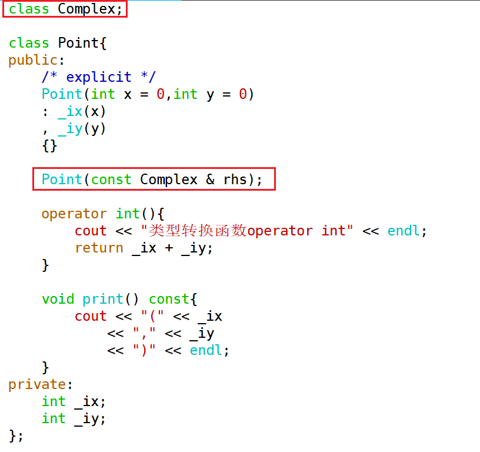

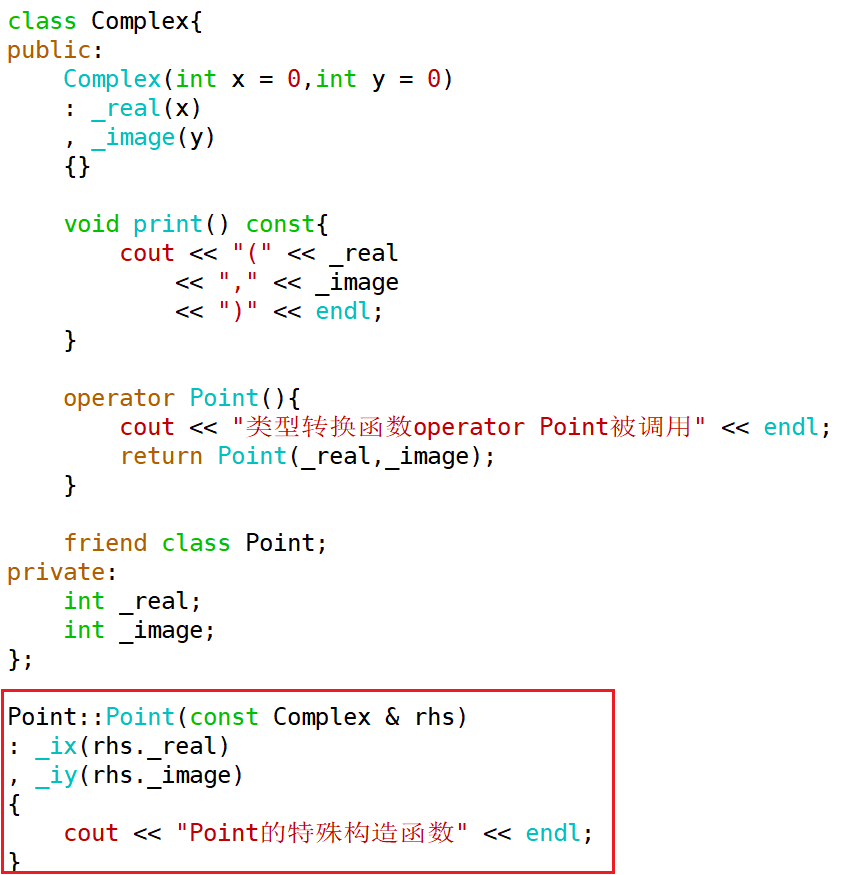

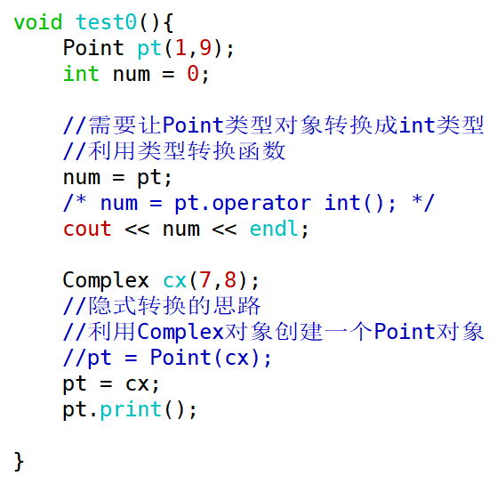

总结：使用类型转换函数（Complex的成员函数operator Point）和特殊的构造函数(Point的构造函数)都可以实现上述的需求。

还可以给Point类添加特殊的赋值运算符函数，当三种方式同时存在时，会优先调用赋值运算符函数（**赋值操作本身就支持**），其次类型转换的优先级高于隐式转换。

**—— 重点掌握类型转换函数。**

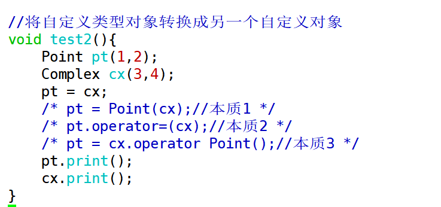

<span style=color:red;background:yellow>**优先级： 2 > 3 > 1**</span>

用一个Complex对象给Point对象赋值

编译器会先到Point类中找有没有合适的赋值运算符函数（Point& operator=(const Complex & rhs)），如果有的话，编译器就知道了怎样去进行赋值操作，不需要任何的转换；如果没有，编译器再到Complex类中找有没有合适的类型转换函数（operator Point()），如果有的话，就可以让cx对象调用类型转换函数，返回一个临时的Point对象，然后再用这个临时的Point对象给pt赋值。

如果前两种方式都行不通，编译器再会到Point类中找有没有合适的构造函数，可以利用一个Complex对象创建出一个Point对象（隐式转换的途径）。


## 附录：C++运算符优先级排序与结合性


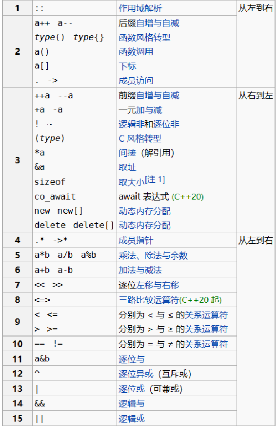

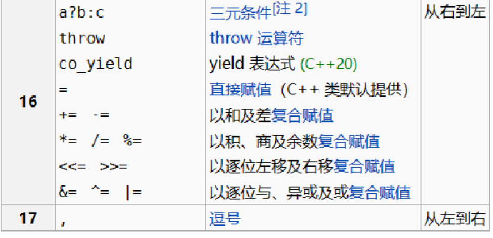

## 嵌套类	

### 嵌套类的定义

首先介绍两个概念：

- 类作用域（Class Scope）

类作用域是指在类定义内部的范围。在这个作用域内定义的成员（包括变量、函数、类型别名等）可以被该类的所有成员函数访问。类作用域开始于类定义的左花括号，结束于类定义的右花括号。**在类作用域内，成员可以相互访问，无论它们在类定义中的声明顺序如何。**

```c++
class A
{
    // 类作用域
}
```


- 类名作用域（Class Name Scope）

类名作用域指的是可以通过类名访问的作用域。

这主要用于访问类的**静态成员**、**嵌套类型**。类名必须用于访问静态成员或嵌套类型，除非在类的成员函数内部，因为它们不依赖于类的任何特定对象。以静态成员为例：

``` c++
class MyClass
{
public:
    void func(){
        m_b = 100;//类的成员函数内访问_b
    }
    static int m_a;
    int m_b;
};
int MyClass::m_a = 0;

void test0(){
    MyClass::m_a = 200;//类外部访问_a
}
```


在函数和其他类定义的外部定义的类称为**全局类(即定义在全局作用域中的类)**，绝大多数的 C++ 类都是全局类。我们在前面定义的所有类都在全局作用域中，全局类具有全局作用域。

与之对应的，一个类A还可以定义在另一类B的定义中，这就是<span style=color:red;background:yellow>**嵌套类**</span>结构。A类被称为B类的<font color=red>**内部类**</font>，B类被称为A类的<font color=red>**外部类**</font>。

```c++
class Global
{
    
};

// 外部类
class Outer
{
  // 内部类
  class Nested{
       
  };
};

void test()
{
    
}
```


以Point类和Line类为例

``` c++
// 外部类
class Line
{
public:
    // 内部类
    class Point{
    public:
        Point(int x,int y)
        : m_ix(x)
        , m_iy(y)
        {}
    private:
        int m_ix;
        int m_iy;
    };
public:
    Line(int x1, int y1, int x2, int y2)
    : m_pt1(x1,y1)
    , m_pt2(x2,y2)
    {}
private: 
    Point m_pt1;
    Point m_pt2;
    double length = 10;
};
```


Point类是定义在Line类中的内部类，无法直接创建Point对象，需要在Line类名作用域中才能创建

``` c++
Point pt(1,2);//error
Line::Point pt2(3,4);//ok
```

> Point类是Line类的内部类，并不代表Point类的数据成员会占据Line类对象的内存空间，<span style=color:red;background:yellow>**在存储关系上并不是嵌套的结构**</span>。
>
> 只有当Line类有Point类类型的对象成员时，Line类对象的内存布局中才会包含Point类对象（成员子对象）。
>
> （1）如果Line类中没有Point类的对象成员，sizeof(Line) = 8;
>
> （2）如果Line类中有两个Point类的对象成员，sizeof(Line) = 24;
>
> 


> 思考，如果想要使用输出流运算符输出Line对象，应该怎么实现？**（重要）**
>
> ```c++
> // 为了使用<<输出Line对象,其中访问了Line中私有数据成员m_p1, m_p2  需要将重载函数设置为友元
> std::ostream & operator<<(std::ostream& os,const Line & line)
> {
>     os << line.m_p1 << "---" << line.m_p2 << endl;
>     return os;
> }
> 
> ```
>
> 
>
> 最直观的实现方式是定义一个运算符重载函数，但在函数体中需要让输出流运算符处理Point类型对象，所以还需要为Point类准备一个输出流运算符重载函数。
>
> —— 如果Point定义在Line的私有区域
>
> 那么还需要将operator<<函数声明为Line的友元函数
>
> ```c++
> // Point中同理, 将重载函数设置为友元 同时还需要加上Line的类名作用域
> // 如果Point为Line中私有成员, 则还需要将重载函数声明为Line的友元
> std::ostream & operator<<(std::ostream & os,const Line::Point & p)
> {
>     os << p.m_x << "," << p.m_y;
>     return os;
> }
> 
> ```
>
> 

### 嵌套类结构的访问权限

- 外部类对内部类的成员进行访问

- 内部类对外部类的成员进行访问


**内部类相当于是定义在外部类中的外部类的友元类**

类A定义在类B中，那么类A访问类B的成员时，就相当于默认的是类B的友元类。


### pimpl模式（了解）

Pimpl（Pointer to Implementation）模式是一种常用的 C++ 编程技巧，用于**隐藏类的实现细节**，提高编译时间效率，并帮助维护代码的封装性。在 Pimpl 模式中，类的接口（即公共部分）与其实现（即私有成员）是分开的。

通常做法是将类的实现（数据成员、私有成员函数等）放到一个单独的内部类中，并通过指针将其与外部类关联。

**Pimpl 模式的结构**

1. **外部类（接口类）**：只包含公有的接口（方法声明），不包含实现细节（即不包含私有成员的定义）。
2. **内部类（实现类）**：该类定义了所有的实现细节（私有数据成员、私有成员函数等）。它通常是一个封装类，且通常在 `.cpp` 文件中定义，不在头文件中暴露。
3. **指针**：外部类通过一个指向内部实现类的指针来访问实现细节。


实际项目的需求：希望Line的实现全部隐藏，在源文件中实现，再将其打包成库文件，交给第三方使用。

（1）头文件只给出接口：

``` c++
//Line.hpp
class Line{
public:
    Line(int x1, int y1, int x2, int y2);
    ~Line();
    void printLine() const;//打印Line对象的信息
private:
    class LineImpl;//类的前向声明
    LineImpl * m_pimpl;
};
```


（2）在实现文件中进行具体实现，使用嵌套类的结构（LineImpl是Line的内部类，Point是LineImpl的内部类），Line类对外公布的接口都是使用LineImpl进行具体实现的

在测试文件中创建Line对象（最外层），使用Line对外提供的接口，但是不知道具体的实现

``` c++
//LineImpl.cc
//内部类实现
class Line::LineImpl
{
    class Point{
    public:
        Point(int x,int y)
        : m_ix(x)
        , m_iy(y)
        {
            cout << "Point constructor" << endl;
        }
        ~Point()
        {
            cout << "Point destructor" << endl;
        }
		void print() const
        {
            cout << m_ix << "," << m_iy << endl;
        }
    private:
        int m_ix;
        int m_iy;
    };
    //...
};


//testLine.cc
void test0(){
    Line line(10,20,30,40);
    line.printLine();
}
```


具体实现

```c++
// LineImpl.cc
include "Line.hpp"
#include <iostream>

using std::cout;
using std::endl;

// 内部实现类
class Line::LineImpl
{
    // 给出具体实现类 使用内部类
    class Point
    {
    public:
        Point(int x, int y)
        : m_x(x)
        , m_y(y)
        {}
        void print() const
        {
            cout << m_x << " " << m_y;
        }
    private:
        int m_x;
        int m_y;
    };
public:
    LineImpl(int x1, int y1, int x2, int y2)
    : m_pt1(x1,y1)
    , m_pt2(x2,y2)
    {}
    void print() const
    {
        m_pt1.print();
        cout << endl;
        m_pt2.print();
        cout << endl;
    }
private:
    Point m_pt1;
    Point m_pt2;
};


Line::Line(int x1 ,int y1, int x2, int y2)
: m_pimpl(new LineImpl(x1,y1,x2,y2))
{

}

Line::~Line()
{
    if(m_pimpl){
        delete m_pimpl;
        m_pimpl = nullptr;
    }
}

void Line::printLine() const
{
    m_pimpl->print();
}

```


（3）打包库文件，将库文件和头文件交给第三方

```C++
sudo apt install build-essential
g++ -c LineImpl.cc
ar rcs libLine.a LineImpl.o

生成libLine.a库文件
编译：g++ Test.cc(测试文件) -L(加上库文件地址) -lLine(就是库文件名中的lib缩写为l，不带后缀)
此时的编译指令为 g++ Test.cc -L. -lLine
```


内存结构

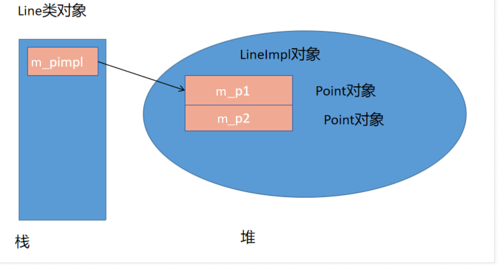


**pimpl模式是一种减少代码依赖和编译时间的C++编程技巧，其基本思想是将一个外部可见类的实现细节（一般是通过私有的非虚成员）放在一个单独的实现类中，在可见类中通过一个私有指针来间接访问该类型。**

好处：

1. 实现信息隐藏；
2. 只要头文件中的接口不变，实现文件可以随意修改，修改完毕只需要将新生成的库文件交给第三方即可；
3. 可以实现库的平滑升级。


##  单例对象自动释放（重点）

在类与对象的章节，我们学习了单例模式。单例对象由静态指针ms_instance保存，最终通过手动调用destroy函数进行释放。

现实工作中，单例对象是需要进行自动释放。程序在执行的过程中 ，需要判断有哪些地方发生了内存泄漏 ，此时需要工具valgrind的使用来确定。假设单例对象没有进行自动释放 ，那么valgrind工具会认为单例对象是内存泄漏。程序员接下来还得再次去确认到底是不是内存泄漏 ，增加了程序员的额外的工作。

那么如何实现单例对象的自动释放呢？

—— 看到自动就应该想到当对象被销毁时，析构函数会被自动调用。

### 方式一：利用另一个对象的生命周期管理资源


利用对象的生命周期管理资源——析构函数（在析构函数中会执行delete m_p），当对象被销毁时会自动调用。

> 要注意：
>
> (1)如果还手动调用了Singleton类的destroy函数，会导致double free问题，所以可以删掉destroy函数，将回收堆上的单例对象的工作完全交给AutoRelease对象
>
> (2)不能用多个AutoRelease对象托管同一个堆上的单例对象。
>
> (3)需要将控制类AutoRelease设置为所托管的单例类的友元类, 这样可以调用单例类中的private权限的析构函数.


``` c++
class AutoRelease{
public:
    AutoRelease(Singleton * p)
    : m_p(p)
    { 
        cout << "AutoRelease(Singleton*)" << endl; 
    }

    ~AutoRelease(){
        cout << "~AutoRelease()" << endl;
        if(m_p){
            // 调用单例对象的析构 需要权限
            // 需要在Singleton类中将AutoReleas类声明友元类
            delete m_p;
            m_p = nullptr;
        }
    }
private:
    Singleton * m_p; 
};

void test0(){
    AutoRelease ar(Singleton::getInstance());
    Singleton::getInstance()->print();
}
```


### 方式二：嵌套类 + 静态对象（重点）


AutoRelease类对象m_ar是Singleton类的对象成员，创建Singleton对象，就会自动创建一个AutoRelease对象（静态区），它的成员函数可以直接访问 ms_pInstance 或者通过类名作用域访问

``` c++
class Singleton
{
    class AutoRelease{
    public:
        AutoRelease()
        {}
        ~AutoRelease(){
          if(ms_pInstance){
              delete ms_pInstance;
              ms_pInstance = nullptr;
          }
        }
    };
    //...
private:
   //...
    int m_x;
    int m_y;
    static Singleton * ms_pInstance;
    static AutoRelease ms_ar;
};
Singleton* Singleton::ms_pInstance = nullptr;
//使用AutoReleas类的无参构造对ms_ar进行初始化
Singleton::AutoRelease Singleton::ms_ar;


void test1(){
    Singleton::getInstance()->init(10,80);
    Singleton::getInstance()->print();
}
```

程序结束时会自动销毁全局静态区上的ms_ar，调用AutoRelease的析构函数，在这个析构函数执行delete ms_pInstance的语句，这样又会调用Singleton的析构函数，再调用operator delete，回收掉堆上的单例对象。

我们利用嵌套类实现了一个比较完美的方案，不用担心手动调用了destroy函数。


### 方式三：atexit + destroy

很多时候我们需要在程序退出的时候做一些诸如释放资源的操作，但程序退出的方式有很多种，比如main()函数运行结束、在程序的某个地方用exit()结束程序、用户通过Ctrl+C操作来终止程序等等，因此需要有一种与程序退出方式无关的方法来进行程序退出时的必要处理。

方法就是用atexit函数来注册程序正常终止时要被调用的函数（C/C++通用）。

**注册函数的调用顺序:** 如果注册了多个函数，先注册的后执行。

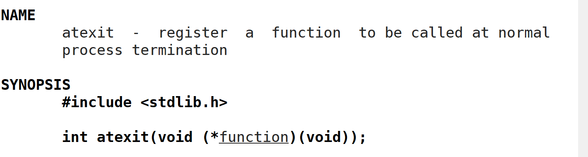

```c++
void display(){
    cout << "display()" << endl;
}

void print(){
    cout << "print()" << endl;
}

void test0(){
    //(1)同一个函数注册几次，在程序结束时就会调用几次
    //(2)先注册的函数会后调用
    atexit(&display);
    atexit(&display);
    atexit(print);
}

int main(void){
    test0();
    cout << "over" << endl;
    return 0;
}
```


向atexti函数中注册Singleton中的destroy函数

``` c++
class Singleton
{
public:
    static Singleton * getInstance(){
        if(ms_pInstance == nullptr){
            atexit(destroy);  
            ms_pInstance = new Singleton(1,2);
        }
        return ms_pInstance;
    }
    //...
}；
```

atexit注册了destroy函数，相当于有了一次必然会进行的destroy（程序结束时），即使手动调用了destroy，因为安全回收的机制，也不会有问题。


> 但是还遗留了一个问题，就是以上几种方式都无法解决<font color=red>**多线程安全**</font>问题。以方式三为例，当多个线程同时进入if语句时，会造成单例对象被创建出多个，但是最终只有一个地址值会由ms_pInstance指针保存，因此造成内存泄漏。
>
> 可以使用<font color=red>**饿汉式解决**</font>，但同时也可能带来内存压力（即使不用单例对象，也会被创建）
>
> ``` c++
> //对于ms_pInstance的初始化有两种方式
> 
> //饱汉式（懒汉式）—— 懒加载，不使用到该对象，就不会创建
> Singleton* Singleton::ms_pInstance = nullptr; 
> 
> //饿汉式 —— 最开始就创建（即使不使用这个单例对象）
> Singleton* Singleton::ms_pInstance = Singleton::getInstance();
> ```
>
> 饿汉式可以确保getInstance函数的第一次调用一定是在ms_pInstance的初始化时，之后再调用getInstance函数的时候,都不会进入if分支创建出对象。
>
> 同时，还有一个要考虑的问题——如果多线程环境下手动调用了destroy函数，那么又会让ms_pInstance变为空指针，之后再调用getInstance函数还是有可能造成内存泄露，
>
> 故而应该将destroy函数私有。


### 方式四：atexit + pthread_once + destroy

Linux平台可以使用的方法（能够保证创建单例对象时的多线程安全）

pthread_once函数可以确保初始化代码只会执行一次, 无论在多少个线程中调用它。

传给pthread_once函数的第一个参数比较特殊，形式固定；第二个参数需要是一个`静态函数指针`，pthread_once可以确保这个函数只会执行一次。

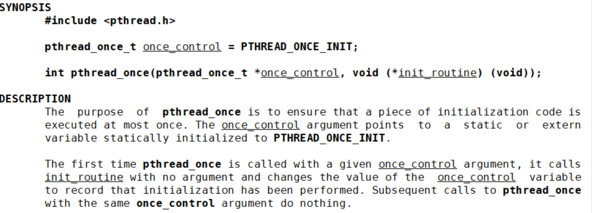


``` c++
class Singleton
{
public:
    // static return singleton object
    static Singleton * getInstance()
    {
        pthread_once(&ms_onceControl, &initRoutine); 
        return ms_pInstance;
    }


    void init(int x, int y)
    {
        m_x = x;
        m_y = y;
    }
    void print() const
    {
        cout << m_x << " " << m_y << endl;
    }

private:
    Singleton() = default;
    Singleton(const Singleton &) = delete;
    Singleton & operator=(const Singleton &) = delete;
    static void initRoutine()
    {
        ms_pInstance = new Singleton{};
        atexit(&destroy);
    }

    static void destroy()
    {
        if(ms_pInstance){
            delete ms_pInstance;
            ms_pInstance = nullptr;
        }
    }
    static Singleton * ms_pInstance;
    static pthread_once_t ms_onceControl;
    int m_x;
    int m_y;
};

Singleton * Singleton::ms_pInstance = nullptr;
pthread_once_t Singleton::ms_onceControl = PTHREAD_ONCE_INIT;

void test1()
{
    Singleton::getInstance()->init(1,1);
    Singleton::getInstance()->print();
    cout << Singleton::getInstance() << endl;
    cout << Singleton::getInstance() << endl;

}
```

> <font color=red>**注意：**</font>
>
> (1)如果手动调用initRoutine创建对象，没有通过getInstance创建对象，实际上绕开了pthread_once的控制，必然造成内存泄露 —— <span style=color:red;background:yellow>**需要将initRoutine私有**</span>
>
> (2)如果手动调用了destroy函数，之后再使用getInstance来尝试创建对象，因为pthread_once的控制效果，不会再执行init函数，所以无法再创建出单例对象。所以不能允许手动调用destroy函数。
>
> 同时因为会使用atexit注册destroy函数实现资源回收，所以也不能将destroy删掉，应该<span style=color:red;background:yellow>**将destroy私有**</span>，避免在类外手动调用。
>

##  `std::string`的底层实现

我们都知道， std::string的一些基本功能和用法了，但它底层到底是如何实现的呢? 其实在std::string的历史中，出现过几种不同的方式。

我们可以从一个简单的问题来探索，一个std::string对象占据的内存空间有多大，即sizeof(std::string)的值为多大？如果我们在不同的编译器（VC++, GCC, Clang++）上去测试，可能会发现其值并不相同；即使是GCC，不同的版本，获取的值也是不同的。

虽然历史上的实现有多种，但基本上有三种方式：


- Eager Copy(立即深拷贝)

- COW（Copy-On-Write 写时复制）

- SSO(Short String Optimization 短字符串优化)

  <font color=red>**std::string的底层实现是一个高频考点**</font>，虽然目前std::string是根据SSO的思想实现的，但是我们最好能够掌握其发展过程中的不同设计思想，在回答时会是一个非常精彩的加分项。

  

  首先，最简单的就是深拷贝。无论什么情况，都是采用拷贝字符串内容的方式解决，这也是我们之前已经实现过的方式。这种实现方式，在不需要改变字符串内容时，对字符串进行频繁复制，效率比较低下。所以需要对其实现进行优化，之后便出现了下面的COW的实现方式。

  ``` c++
  //如果string的实现直接用深拷贝
  string str1("hello,world");
  string str2 = str1;
  ```

  如上，str2保存的字符串内容与str1完全相同，但是根据深拷贝的思想，一定要重新申请空间、复制内容，这样效率较低、开销较大。


### 写时复制原理探究

**COW 的基本原理**

- 共享数据：当多个对象（如字符串变量）引用同一份数据时，它们共享底层内存，而非立即复制。
- 延迟复制：只有在某个对象尝试修改数据时，系统才会创建该数据的独立副本，确保修改不影响其他共享对象。


**Q1: 当字符串对象进行复制时，可以优化为指向同一个堆空间的字符串，接下来的问题就是何时回收堆空间的字符串内容呢？**  

-  引用计数refCount, 当字符串对象进行复制操作时，引用计数+1；
- 当字符串对象被销毁时，引用计数-1；
- 只有当引用计数减为0时，才真正回收堆空间上字符串   


``` c++
string str1("hello");
// string对象复制 --> 拷贝构造
string str2 = str1;
```

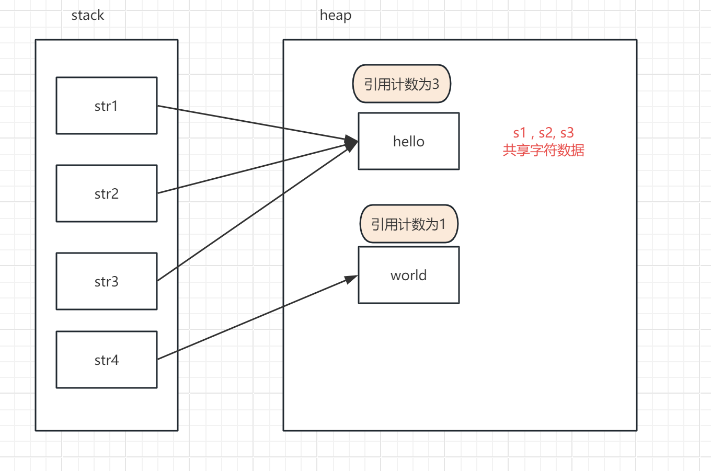


补充：如果是如下创建对象，能不能共用空间，存放"hello"

``` c++
string s1("hello");
//在创建s2之前可能有很多String对象
//不可能遍历这些对象
//看看哪个对象保存的内容是hello
//s2再去共用空间 —— 只有确保内容一致时，才能共用空间 —— 复制或赋值时
string s2("hello");
```

—— 单独创建对象没有优化的空间，每一个string对象需要一片独立的空间存放自己的字符串


**Q2: 引用计数应该放到哪里？**

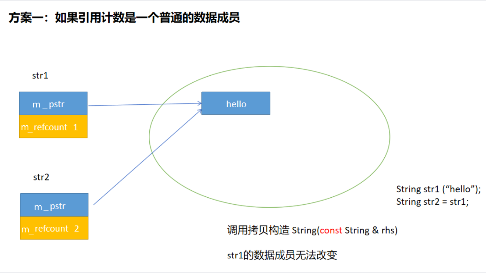

—— 需要改变str1的数据成员，不合理


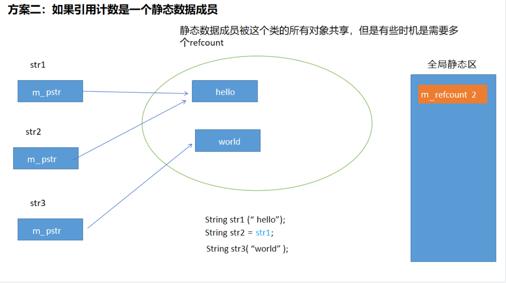

—— 静态数据成员被该类所有对象共享，但此时str1和str2的引用计数应该都是2，但是str3的引用计数应该是1.


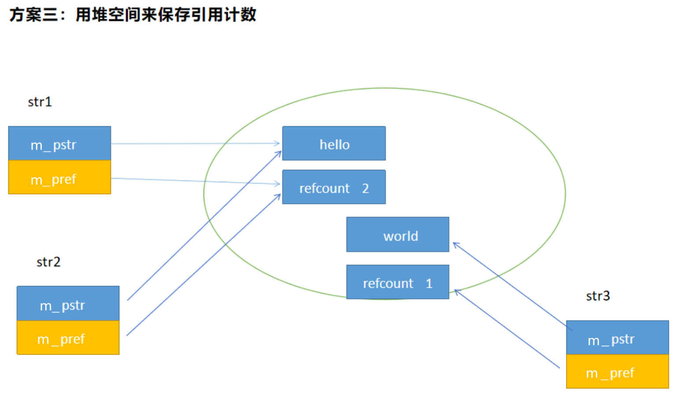

方案三可行，还可以优化一下

按常规的思路，需要使用两次new表达式（字符串、引用计数）；可以优化成只用一次new表达式，因为申请堆空间的行为一定会涉及系统调用，程序员要尽量少使用系统调用，提高程序的执行效率。

—— 优化方向：把引用计数和字符串内容保存到一起。


> <font color=red>**引用计数保存到字符串内容的前面，方便访问。**</font>

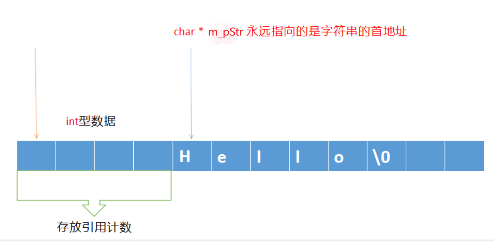


### CowString代码初步实现

首先得到CowString的基础结构

```c++
class CowString
{
public:
    // no arg constructor
    CowString();
    // arg constructor
    CowString(const char * pStr);
    // destructor
    ~CowString();
    // copy constructor
    CowString(const CowString & rhs);
    // operator << 
    friend
    ostream & operator<<(ostream & os, const CowString & rhs);
    // operator =
    CowString & operator=(const CowString & rhs);
    // operator []
    char & operator[](int index);
    // 用于获取字符串长度的方法
    int size()
    {
        return strlen(m_pStr);
    }
    // 返回C风格字符串
    char * c_str()
    {
        return m_pStr;
    }

private:
    // pointer to char array
    char * m_pStr;
};


```


如上所示, CowString对象初始化时,为字符数组指针分配空间时, 前部分用来存储int类型的引用计数, 后部分用来存储实际的字符数据, 通过指针移动进行操作

#### 对象创建

- 无参构造函数
  1. 构造函数初始化列表中对字符数组指针进行初始化, 4字节存储引用计数, 1字节存字符串结束字符
  2. 并将字符数组指针移动到实际的字符数据位置
  3. 通过强转与解引用,将引用计数初始化为1
- C风格字符串构造
  1. 构造函数初始化列表中对字符数组指针进行初始化,4字节存储引用计数,1字节存储字符串结束字符以及C风格字符串的长度
  2. 通过强转与解引用,将引用计数初始化为1
  3. 字符数据复制

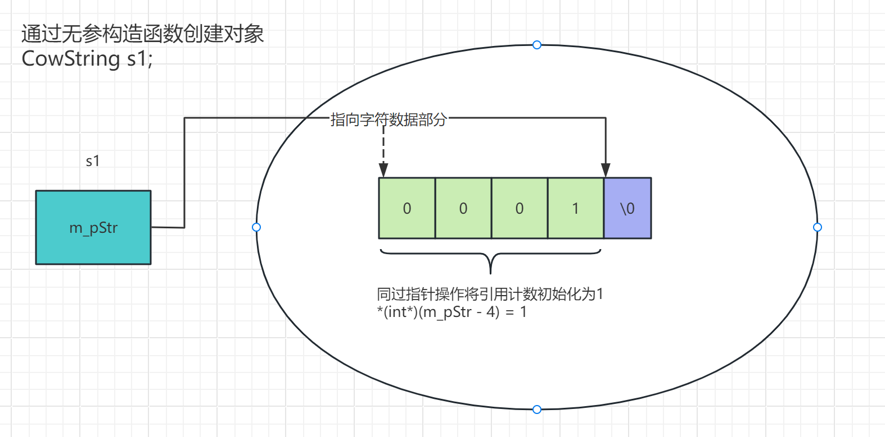

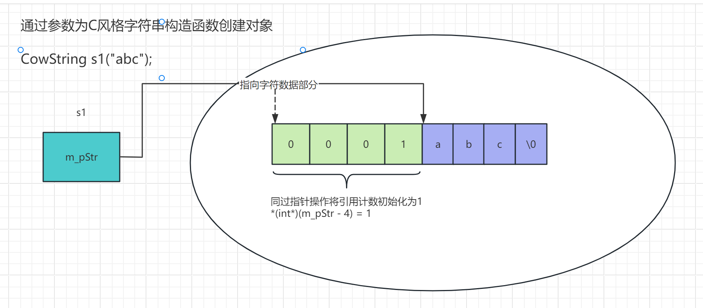

```c++
// no arg constructor
CowString::CowString()
: m_pStr(new char[4+1]{} + 4)
{
    // 操作指针初始化引用计数为1
    *(int *)(m_pStr - 4) = 1;
}

// arg constructor
CowString::CowString(const char * pStr)
: m_pStr(new char[4 + strlen(pStr) + 1]{} + 4)
{
    //操作指针初始化引用计数为1
    *(int *)(m_pStr - 4) = 1;
    // 字符数据copy
    strcpy(m_pStr, pStr);
}

```


为了方便操作与使用, 代码复用, 可以将重复代码抽取到方法中, 封装一些操作

1.  获取引用计数 : int getRefCount()
2. 初始化引用计数 : void initRefCount()
3.  引用计数+1 : int incrementRefCount() 
4.  引用计数-1 : int decrementRefCount()
5. 初始化列表中分配字符数组指针空间 : char * allocate(const char* pStr = nullptr)

```c++
// 引用计数相关操作
// 获取引用计数
int getRefCount()
{
    return  *(int *)(m_pStr - 4);
}
// 初始化引用计数
void initRefCount()
{
    *(int *)(m_pStr - 4) = 1;
}
// 引用计数+1
int incrementRefCount()
{
    return ++*(int *)(m_pStr - 4);
}
// 引用计数-1
int decrementRefCount()
{
    return --*(int *)(m_pStr - 4);
}
// 初始化列表中分配字符数组指针空间
char * allocate(const char * pStr = nullptr)
{
    if(!pStr){ //无参构造中使用
        return new char[4 + 1]{} + 4;
    }else{
        // C风格字符串构造中使用
        return new char[4+ strlen(pStr) + 1]{} + 4;
    }
}

```


#### 对象复制

1. 调用拷贝构造函数, 在初始化列表中进行浅拷贝, 共享字符数组
2. 引用计数+1

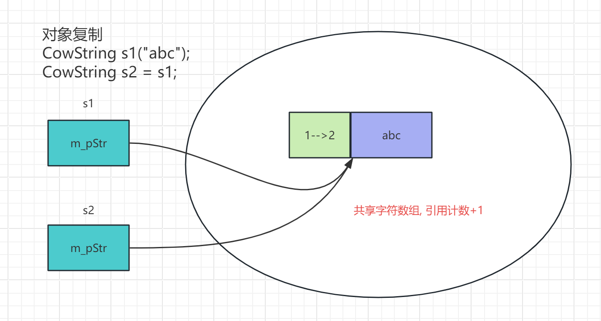

```c++
// copy constructor
CowString::CowString(const CowString & cowSting)
: m_pStr(cowSting.m_pStr)
{
    cout << "copy constructor" << endl;
    // 引用计数+1
    incrementRefCount();
}

```


#### 对象销毁

1. 调用析构函数 
2. 引用计数-1
3.  只有当引用计数为0的时候进行空间的释放

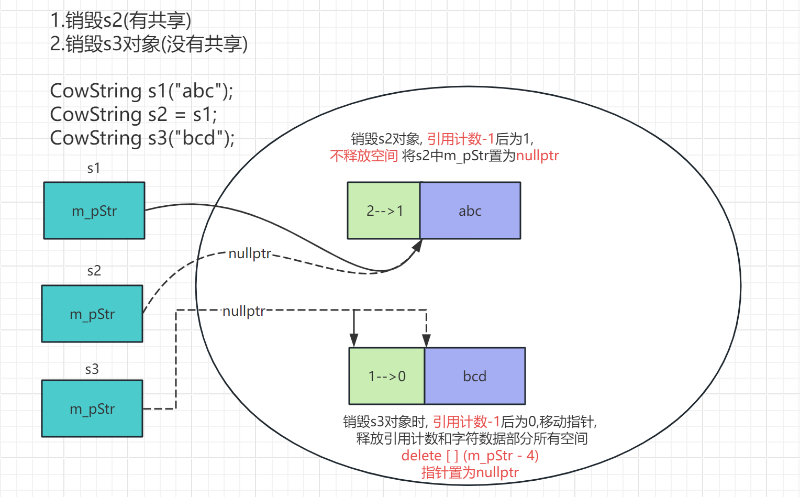

```c++
// destructor
CowString::~CowString()
{
    cout << "destructor" << endl;
    // 引用计数-1
    decrementRefCount();
    // 如果引用计数为0 说明没有共享 回收空间
    if(getRefCount() == 0){
        // 回收引用计数+字符数据部分空间
        delete [] (m_pStr - 4);
        cout << "==>release heap" << endl;
    }
    m_pStr = nullptr;
}

// 可以将析构函数中内容抽取到CowString类的release方法中 进行复用
void release()
{
    // 引用计数-1
    decrementRefCount();
    if(getRefCount() == 0){
        // 引用计数为0 删除空间 
        delete [] (m_pStr - 4);
        cout << "release heap" << endl;
    }
    m_pStr = nullptr;

}

```


#### 对象赋值

除了复制操作，赋值操作也可以确定两个string对象保存的字符串内容是相同的，也可以复用空间，引用计数随之改变。

但相比复制操作，还需要考虑string对象原本用来保存字符串的堆空间是否需要回收。

（1）原本空间的引用计数-1，引用计数减到0，才真正回收堆空间

（2）让自己的指针指向新的空间，并将新空间的引用计数+1

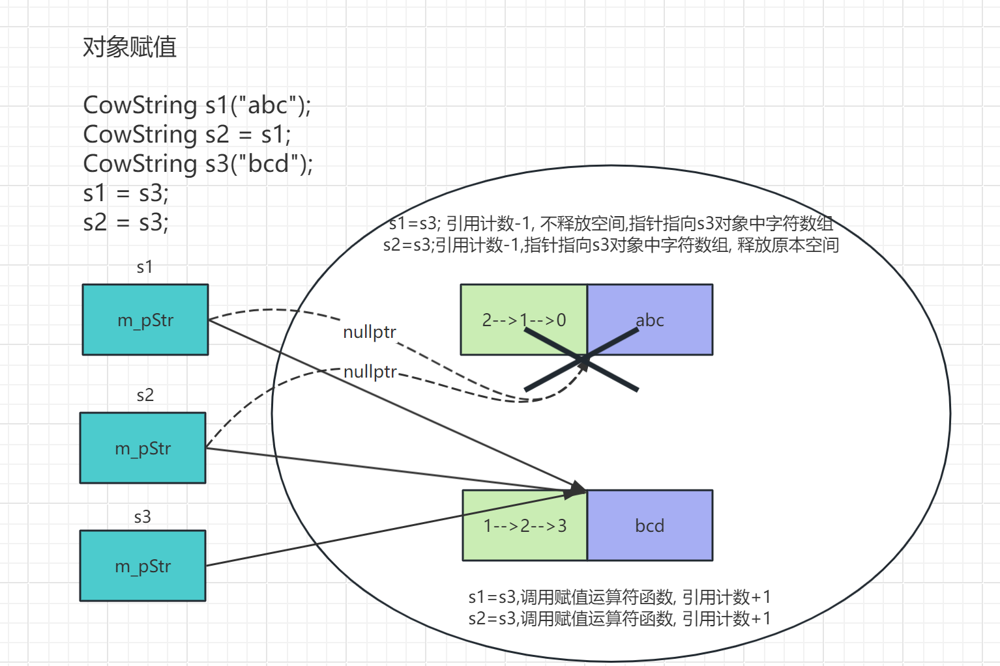

```c++
// operator =
CowString & CowString::operator=(const CowString & cowSting)
{
    // 自赋值判断
    if(this != &cowSting){
        // 引用计数-1
        decrementRefCount();
        // 判断引用计数是否为0
        if(getRefCount() == 0){
            // 释放原本空间
            delete [] (m_pStr - 4);
            cout << "release heap" << endl;
        }
        m_pStr = nullptr;
        // 指针指向新空间
        m_pStr = cowSting.m_pStr;
        // 新空间引用计数+1
        incrementRefCount();
    }
    // 返回自身对象
    return *this;
}

```


#### operator[]重载实现

> 如下 重载operator[]时 如果直接返回对应位置的字符
>
> ```c++
> // operator []
> char & CowString::operator[](size_t index)
> {
>     // 判断index合法
>     if(index >= size()){
>         cout << "illegal index" << endl;
>         static char  nullChar = '\0';
>         return nullChar;
>     }else{
>         return m_pStr[index];
>     }
> }
> 
> void test()
> {
>     CowString s1("abc");
>     CowString s2 = s1;
>     s1[0] = 'A'
> }
> // 因为s1,s2共享底层字符数据, 此时s1 s2中的内容都变成了Abc
> ```

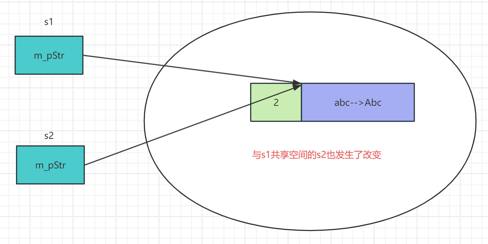

如果多个对象共享了同一片空间, 一个对象通过下标访问运算符修改了字符串中的某个字符, 不应该影响到其他使用这片空间的string对象, 所以应当进行深拷贝操作, 在新分配的空间中进行修改而不影响其他对象.

**多个对象共享空间,某个对象通过下标修改字符**

1. 判断引用计数是否大于1, 大于1说明共享
2. 原空间的引用计数-1
3. 深拷贝
4. 修改指针指向新空间
5. 初始化新空间的引用计数

> ```c++
> char & CowString::operator[](size_t index)
> {
>     // 判断index
>     if(index >= size()){
>         cout << "index is illegal!" <<endl;
>         static char nullChar = '\0';
>         return nullChar;
>     }else{
>         // 判断引用计数是否大于1
>         if(getRefCount() > 1){
>             // 说明共享了 需要开辟新空间
>             // 原来的引用计数-1
>             decrementRefCount();
>             char * temp = new char[4 + strlen(m_pStr)+1]() + 4;
>             // 复制
>             strcpy(temp, m_pStr);
>             // 更改指向
>             m_pStr = temp;
>             // 初始化新空间引用计数
>             initRefCount();
>         }
>         // 返回下标对应字符
>         return m_pStr[index];
>     }
> }
> 
> ```
>
> 

在我们建立了基本的写时复制字符串类的框架后，发现了一个<span style=color:red;background:yellow>**新的问题。**</span>

经过对下标访问运算符operator[]的修改, 当多个对象共享同一空间, 某个对象通过下标修改字符时, 不会影响到其他对象了, 但是产生了一个新的问题, 下标访问进行读操作会产生影响 

```c++
CowString s1{"abc"};
CowString s2 = s1;
CowString s3 = s1;
//下标访问
cout << "========" << endl;
cout << "s2[0]: " << s2[0] << endl;
cout << "s1 cout: " << s1.getRefCount() << endl; // 2
cout << "s2 cout: " << s2.getRefCount() << endl; // 1
cout << "s3 cout: " << s3.getRefCount() << endl; // 2
printf("s1 address: %p\n", s1.c_str()); // s1 address: 0x58a0d31aeeb4
printf("s2 address: %p\n", s2.c_str()); // s2 address: 0x58a0d31af2e4
printf("s3 address: %p\n", s3.c_str()); // s3 address: 0x58a0d31aeeb4

// 1.引用计数发生了修改  2.地址发生了改变
```

**下标访问**: 读操作  `cout << str1[0] << endl; cout << char字符`, 只返回相应下标位置的字符即可, 不需要复制, 不改变引用计数

**下标修改**: 写操作 `str1[0] = 'A'; char字符 = char字符`, 需要进行申请新空间进行深拷贝, 修改引用计数, 修改字符

需要一种更好的方案去区分读写操作?

> -->想到运算符重载, **但是**
>
> 无论是输出流运算符还是赋值运算符，操作数中都是基本类型, 没有自定义类型对象，不符合重载的要求(**class类型或枚举**), 无法重载。
>
> 而CowString的下标访问运算符的操作数是`CowString`对象和`size_t`类型的下标，也没办法判断取出来的内容接下来要进行读操作还是写操作。
> 
> —— 思路：
>
> 1. 创建一个CowString类的内部类
>2. 让CowString的operator[]函数返回是这个新类型的对象
> 3. 然后在这个新类型中对<<和=进行重载，让这两个运算符能够处理新类型对象，从而分开了处理逻辑，区分读写操作
>
> 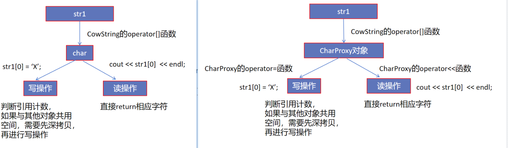

**CowString中operator[]重载**

根据分析过程, 修改CowString中下标访问运算符operator[] , 返回内部类对象CharProxy

为了能够在内部类对象CharProxy中处理字符数组中字符的读写操作, 需要2个参数

1. 下标index, 用于操作字符数组中具体字符
2. CowString对象, 通过this获取, 用于访问字符数组指针

```c++
// operator[] -->返回内部类对象CharProxy
CowString::CharProxy CowString::operator[](size_t index)
{
    // 无论是读还是写都需要下标index
    // 还需能访问到外部类CowString中的字符数组指针成员-->CowString对象
    // 如何传递CowString对象?---->this
    // 将参数通过构造函数传递 才能在内部类对象中进行处理
    return CharProxy(*this, index);
	// 返回CharProxy对象副本
}

```


**内部类CharProxy定义**

1. 根据operator[]推导出内部类CharProxy中需要2参构造函数, CowString对象以及下标index
2. 进行推导出CharProxy中需要2个数据成员, `CowString & m_self `, `size_t m_index`
3. 重载operator<< 用于处理读操作
4. 重载operator= 用于处理写操作

```c++
// CharProxy定义
class CowString
{
private:
    // 内部类--->处理下标访问运算符的读写逻辑
    class CharProxy{
    public:
        CharProxy(CowString & cowString, size_t index)
        : m_self(cowString)
        , m_index(index)
        {}
        //operator<< 读操作 cout << s1[0] --> charProxy-->CowString-->m_pStr-->char
        //友元函数方式进行重载
        friend
        ostream & operator<<(ostream & os ,const CharProxy & proxy);

        //operator= 写操作 s[0]='A' char = char
        // []-->proxy-->cowString-->m_pStr-->char   =  char
        // 成员函数重载
        char & operator=(const char & ch);
    private:
        CowString & m_self;
        size_t m_index;
    };
    
    //......
}
```


#### operator<<重载实现

因为定义的是私有的内部类CharProxy, 为了让输出流运算符能够处理CharProxy对象,所以需要将operator<< 分别 声明在CharProxy和CowString进行两次友元声明

```c++
// operator<< 友元函数重载 可以访问私有成员
ostream & operator<<(ostream & os, const CowString::CharProxy & proxy){
    if(proxy.m_index < 0 || proxy.m_index >= proxy.m_self.size()){
        os << "index is illegal" << endl;
    }else{
        os << proxy.m_self.m_pStr[proxy.m_index];
    }
    return os;
}


```


#### operator=重载实现

```c++
// operator= CharProxy的成员函数重载 存在this指向当前CharProxy对象
char & CowString::CharProxy::operator=(const char & ch)
{
    // index判断
    if(m_index < 0 || m_index >= m_self.size()){
        cout << "index is illegal" << endl;
        static char nullChar = '\0';
        return nullChar;
    }else{
        // index合法 进行写操作
        // 判断引用计数是否大于1
        if(m_self.getRefCount() > 1){
            // 说明存在共享 需要开辟空间进行深拷贝
            // 原空间引用计数-1
            m_self.decrementRefCount();
            // 开辟新空间
            char * temp = new char[4 + m_self.size() + 1]() + 4;
            // 深拷贝
            strcpy(temp, m_self.m_pStr);
            // 修改指针指向新空间
            m_self.m_pStr = temp;
            // 初始化新空间引用计数
            m_self.initRefCount();
        }
        // 修改字符内容
        m_self.m_pStr[m_index] = ch;
        // 返回目标index位置的char
        return m_self.m_pStr[m_index];
    }

```


> 对于读操作，还可以给CharProxy类定义类型转换函数来进行处理 —— CharProxy-->char
>
> 在CowString中的operator[]中直接将返回的CharProxy对象转换为对应下标的char
>
> 稍稍实现了一定的简化, 可以避免双友元(可以去掉双友元)
>
> ```c++
> class CowString{
>  class CharProxy{
>      public:
>      	// 类型转换函数: charProxy ---> char
>      	operator char() const
>          {
>              cout << "operator cast" << endl;
>              return m_self.m_pStr[m_index];
>          }
>      private:
>      	CowString & m_self;
>      	size_t m_index;
>  }
>  // ......
> }
> ```
>
> 
>

总结：当运算符需要处理自定义类型对象时，先看一看这个自定义类型有没有相应的运算符重载函数，如果有，那么这个运算符就可以处理这个自定义类型对象；

如果没有运算符重载，就无法直接处理，需要进行转换。先看看这个自定义类型中有没有类型转换函数，转换成一个该运算符可以直接处理的类型的数据。如果没有类型转换函数，会再看看有没有隐式转换的途径。（一般，大多数情况谨慎使用隐式转换）


### 短字符串优化（SSO）

当字符串的字符数小于等于15时，  buffer直接存放整个字符串；当字符串的字符数大于15时，  buffer 存放的就是一个指针，指向堆空间的区域。这样做的好处是，当字符串较小时，直接拷贝字符串，放在 string内部，不用获取堆空间，开销小。

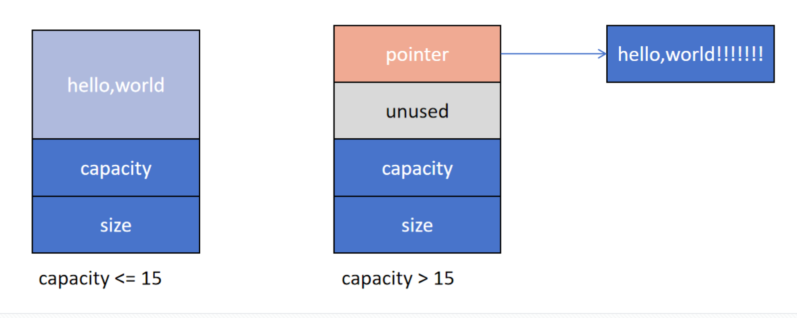


union表示共用体，允许在同一内存空间中存储不同类型的数据。共用体的所有成员共享一块内存，但是每次只能使用一个成员。

```C++
class string {
	union Buffer{
		char * _pointer;
		char _local[16];
	};
	
	size_t _size;
	size_t _capacity;
    Buffer _buffer;
};
```


### 最佳策略

Facebook提出的最佳策略，将三者进行结合：

因为以上三种方式，都不能解决所有可能遇到的字符串的情况，各有所长，又各有缺陷。综合考虑所有情况之后，facebook开源的folly库中，实现了一个fbstring, 它根据字符串的不同长度使用不同的拷贝策略， 最终每个fbstring对象占据的空间大小都是24字节。

1. 很短的（0~22）字符串用SSO，23字节表示字符串（包括'\0'）,1字节表示长度

2. 中等长度的（23~255）字符串用eager copy，8字节字符串指针，8字节size，8字节capacity.
3. 很长的(大于255)字符串用COW, 8字节指针（字符串和引用计数），8字节size，8字节capacity.


