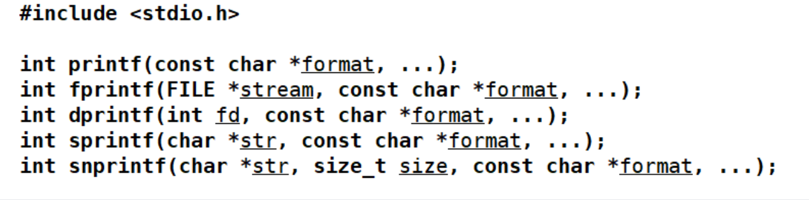

# 第九章 模板

## 模板引入

模板是一种通用的描述机制，使用模板允许使用通用类型来定义**函数**或**类**。在使用时，通用类型可被具体的类型，如 int、double 甚至是用户自定义的类型来代替。通过模板，开发者可以编写不同数据类型的相同操作，而无需为每种类型重复编写相似的代码。这不仅**减少了代码冗余**，提高了开发效率，还增强了类型安全性，因为模板在编译时进行类型检查，避免了运行时错误。

模板引入一种全新的编程思维方式，称为“**泛型编程**”或“**通用编程**”。


**引例，想要实现能够处理各种类型参数的加法函数**

> 以前我们需要进行函数重载（函数名相同，函数参数不同）
>
> ``` c++
>int add(int x, int y)
> {
>  return x + y;
> }
>    
> double add(double x, double y)
> {
>  return x + y;
> }
>    
> long add(long x, long y)
> {
>  return x + y;
> }
>    
> string add(string x, string y)
> {
>  return x + y;
> }
>    ```
> 
> 在使用时看起来只需要调用add函数，传入不同类型的参数就可以进行相应的计算了，很方便。
>
> 但是程序员为了这种方便，实际上要定义很多个函数来处理各种情况的参数。


>  <span style=color:red;background:yellow>**模板（将数据类型作为参数）**</span>
>
>  上面的问题用函数模板的方式就可以轻松解决：
>
>  ```C++
>  //希望将类型参数化
>  //使用class关键字或typename关键字都可以
>  template <class T>
>  T add(T x, T y)
>  {
>  	return x + y;
>  }
>  
>  int main(void){
>      // 处理int数据
>  	cout << add(1,2) << endl;
>  	// 处理double数据
>      cout << add(1.2,3.4) << endl;
>  	return 0;
>  }
>  ```
>
>  函数模板的优点：
>
>  不需要程序员定义出大量的函数，在调用时实例化出对应的模板函数，更“智能”

<span style=color:red;background:yellow>**模板发生的时机是在编译时**</span>

模板本质上就是一个代码生成器，它的作用就是让编译器根据实际调用来生成代码。

编译器去处理时，实际上由函数模板生成了多个模板函数，或者由类模板生成了多个模板类。


## 模板的定义

模板作为实现代码重用机制的一种工具，**它可以实现类型参数化，也就是把类型定义为参数**，从而实现了真正的代码可重用性。

模板可以分为两类，

1. 一个是**函数模版**，
2. 另外一个是**类模板**。

通过参数实例化定义出具体的函数或类，称为**模板函数**或**模板类**。

模板的形式如下：


T1/T2可以是任何合法的C++类型，如`int`、`double`、自定义类等

## 函数模板

基本语法

```c++
template <typename T>
T functionName(T param1, T param2) {
    // 函数体
}
```

`template`：关键字，表明这是一个模板。

`<typename T>`：模板参数列表，`T` 是一个占位符，代表一个类型。

`T` 可以是任何合法的C++类型，如 `int`、`double`、自定义类等。


示例: 

```c++
// 函数模板定义
template <typename T>
T add(T a, T b) {
    return a + b;
}
```


### 函数模板的实例化

> 由函数模板到模板函数的过程称之为<span style=color:red;background:yellow>**实例化**</span>, 即根据模板参数生成具体类型或函数的过程
>
> **函数模板 --》 生成相应的模板函数 --》编译 ---》链接 --》可执行文件** 
>
> 
>
> **实例化的两种方式**
>
> - **隐式实例化**: 当模板被使用时，编译器根据传入的模板参数自动生成相应的实例(自动推导)
> - **显示实例化**: 开发者可以显式指示编译器生成特定类型的模板实例 (显式指定)


**隐式实例化**

函数模板在生成模板函数时通过传入的参数类型确定出（推导出）模板类型

下面代码中实际上可以理解为生成了四个模板函数

``` c++
template <class T>
T add(T t1,T t2)
{ return t1 + t2; }

void test0(){
    short s1 = 1, s2 = 2;
    int i1 = 3, i2 = 4;
    long l1 = 5, l2 = 6;
    double d1 = 1.1, d2 = 2.2;
    // 自动推导
    cout << "add(s1,s2): " << add(s1,s2) << endl;
    cout << "add(i1,i2): " << add(i1,i2) << endl;
    cout << "add(l1,l2): " << add(l1,l2) << endl;
    cout << "add(d1,d2): " << add(d1,d2) << endl;  
}
```


**显式实例化**

我们在使用函数模板时还可以在函数名之后<>内直接写上模板的类型参数列表，指定类型

``` c++
template <class T>
T add(T t1,T t2)
{ return t1 + t2; }

void test0(){
    int i1 = 3, i2 = 4;
    cout << "add(i1,i2): " << add<int>(i1,i2) << endl;  //显式实例化 指定参数类型
}
```


### 函数模板的重载

**函数模板的重载（Function Template Overloading）**指的是在同一个作用域内定义多个**具有相同名称**但**不同模板参数列表**或**函数参数列表**的函数模板。通过重载，开发者可以为不同的参数类型或数量提供不同的模板实现，以适应多种使用场景。

函数模板的重载分为：

（1）函数模板与函数模板重载**（谨慎使用）**

（2）函数模板与普通函数重载


#### 函数模板与函数模板重载

> 如果源文件中只有某个函数模板，在使用函数模板时传入两个不同类型的参数，会出错，因为该函数模板要求两个参数是同类型的数据。
>
> <span style=color:red;background:yellow>**此时可以进行显式实例化**</span>。
>
> 如下，指定了类型T为int型，虽然s1是short型数据，但会发生类型转换。这个转换没有问题，因为int肯定能存放short型数据的所有内容。
>
> ``` c++
> template <class T>
>    T add(T t1,T t2)
> { return t1 + t2; }    
> 
> void test0(){
>        short s1 = 1;
> 	int i2 = 4;
> 	cout << "add(s1,s2): " << add(s1,i2) << endl;//error
> 	cout << "add(s1,s2): " << add<int>(s1,i2) << endl;//ok
> }
> ```
> 
>
> 
>但如果是以下这种转换，实际上就会损失数据精度。此时的d2会转换成int型。
> 
>``` c++
> int i1 = 4；
> double d2 = 5.3;
> cout << "add(i1,d2): " << add<int>(i1,d2) << endl;//可以通过，但损失了精度
> ```


>   如果一个函数模板无法实例化出合适的模板函数（去进行显式实例化也有一些问题）的时候，可以再给出另一个函数模板进行重载
>
>   **函数模板重载条件:**

> （1）首先，名称必须相同（显然）

> （2）模板参数列表中的模板参数在函数中所处位置不同 —— <span style=color:red;background:yellow>**但不建议进行这样的重载**</span>。
>
> ```c++
> template <class T1, class T2>  
> T1 add(T1 t1, T2 t2)
> {
> 	cout << "模板一" << endl;
> 	return t1 + t2;
> } 
> 
> template <class T1, class T2>  
> T1 add(T2 t2, T1 t1)
> {
> 	cout << "模板二" << endl;
> 	return t1 + t2;
> }
> 
> int a = 10;
> double b = 1.2;
> cout << add(a,b) << endl; //error ambiguous
> cout << add<int>(a,b) << endl; //模板一
> cout << add<double>(a,b) << endl;  //模板二
> ```
>
> （3）模板参数的个数不一样时，可以构成重载（相对常见）

>   ``` c++
>   //函数模板与函数模板重载
>   //模板参数个数不同,ok
>   template <class T> //模板一
>   T add(T t1,T t2)
>   { 
>   return t1 + t2;
>   }
>   
>   template <class T1, class T2>  //模板二
>   T1 add(T1 t1, T2 t2)
>   {
>   return t1 + t2;
>   }
>   
>   template <class T1, class T2, class T3> // 模板三
>   T1 add(T1 t1, T2 t2, T3 t3)
>   {
>   return t1 + t2 + t3;
>   }
>   ```
>   


#### 函数模板与普通函数重载

> <span style=color:red;background:yellow>**普通函数优先于函数模板执行——因为普通函数更快**</span>
>
> 编译器扫描到函数模板的实现时并没有生成函数，只有扫描到下面调用add函数的语句时，给add传参，知道了参数的类型，这才生成一个相应类型的模板函数——模板参数推导。所以使用函数模板一定会增加编译的时间。
>
> 此处，就直接调用了普通函数，而不去采用函数模板，因为更直接，效率更高。
>
> 
>
> ``` c++
> //函数模板与普通函数重载
> template <class T1, class T2>
> T1 add(T1 t1, T2 t2)
> {
> return t1 + t2;
> }
> 
> short add(short s1, short s2){
> cout << "add(short,short)" << endl;
> return s1 + s2;
> }
> 
> void test1(){
> short s1 = 1, s2 = 2;
> cout << add(s1,s2) << endl;   //调用普通函数
> }
> ```
>
> 如果没有普通函数，就会调用上面的函数模板，实例化出相应的模板函数。尽管s1/s2的类型相同，也是可以使用该模板的。
>
> <font color=red>**—— T1/T2并不一定非得是不同类型，能推导出即可。**</font>
>
> 当然，如果采用显示实例化的方式调用，肯定是调用函数模板。


#### 函数模板匹配优先级

**匹配优先级**：

- **非模板函数优先于模板函数**：如果存在一个非模板函数与调用匹配，编译器优先选择非模板函数。
- **更具体的模板优先**：在模板函数中，匹配程度更高（**需要更少类型转换/参数约束更严格**）的模板优先级更高。

```c++
template <class T> //模板一
T add(T t1,T t2)
{ 
return t1 + t2;
}

template <class T1, class T2>  //模板二
T1 add(T1 t1, T2 t2)
{
return t1 + t2;
}
double x = 9.1;
int y = 10;
cout << add<int,int>(x,y) << endl; //模板二  （1）
cout << add<int>(x,y) << endl; //模板一   （2）
cout << add<int>(y,x) << endl; //模板二   （3）
```

第(1)次调用是, 指定了2个模板参数类型, 直接匹配模板二

第(2)次调用时，指定了返回类型和第一个参数类型为int，那么x会经历一次类型转换变成int型，而y本身就是int，可以匹配模板一,**模板一要求2个参数必须不同(更严格),模板二要求2个参数可以相同(更宽松), 所以匹配模板一**

第(3)次调用时，同样指定了返回类型和第一个参数类型为int，y本身就是int，x是double类型，匹配模板二，可以不需要进行任何类型转换，所以优先匹配模板二。

**多个模板都匹配的情况, 尽量避免,不要写**


### 头文件与实现文件形式（重要）

为什么C++标准头文件没有所谓的.h后缀？

在一个源文件中，函数模板的声明与定义分离是可以的，即使把函数模板的实现放在调用之下也是ok的，与普通函数一致。

``` c++
//函数模板的声明
template <class T>
T add(T t1, T t2)；


void test1(){ 
    int i1 = 1, i2 = 2;
	cout << add(i1,i2) << endl;
}

//函数模板的实现
template <class T>
T add(T t1, T t2)
{
    return t1 + t2;
}
```


> **如果在不同文件中进行分离**
>
> 如果像普通函数一样去写出了头文件、实现文件、测试文件，编译时会出现未定义报错
>
> ``` c++
> //add.h
> template <class T>
> T add(T t1, T t2);
> 
> //add.cc
> #include "add.h"
> template <class T>
> T add(T t1, T t2)
> {
> return t1 + t2;
> }
> 
> //testAdd.cc
> #include "add.h"
> void test0(){
> int i1 = 1, i2 = 2;
> cout << add(i1,i2) << endl;
> }
> ```
>


> - 单独编译“实现文件”，使之生成目标文件，查看目标文件，会发现没有生成与add名称相关的函数。
>
> 
>
> 

> - 单独编译测试文件，发现有与add名称相关的函数，但是没有地址，这就表示只有声明。
>
> 


看起来和普通函数的情况有些不一样。

从原理上进行分析，函数模板定义好之后并不会直接产生一个具体的模板函数，只有在调用时才会实例化出具体的模板函数。

> 解决方法 ——  **在”实现文件“中要进行调用，因为有了调用才有推导，才能由函数模板生成需要的函数**
>
> ``` c++
> //add.cc
> template <class T>
> T add(T t1, T t2)
> {
> return t1 + t2;
> }
> 
> //在这个文件中如果只是写出了函数模板的实现
> //并没有调用的话，就不会实例化出模板函数
> void test1(){ 
> cout << add(1,2) << endl;
> }
> ```
>
> 
>
> 此时单独编译实现文件，发现生成了对应的函数
>
> 

但是在“实现文件”中对函数模板进行了调用，这种做法不优雅 。


设想：如果在测试文件调用时，在推导的过程中，<font color=red>**看到的是完整的模板的代码**</font>，那么应该可以解决问题

``` c++
//add.h
template <class T>
T add(T t1, T t2);

#include "add.cc"
```

可以在头文件中加上#include "add.cc"，即使实现文件中没有调用函数模板，单独编译testAdd.cc，也可以发现问题已经解决。

因为本质上相当于把函数模板的定义写到了头文件中。

> <span style=color:red;background:yellow>**总结：**</span>
>
> **对模板的使用，必须要拿到模板的全部实现，如果只有一部分，那么推导也只能推导出一部分，无法满足需求。**
>
> **换句话说，就是模板的使用过程中，其实没有了头文件和实现文件的区别，在头文件中也需要获取模板的完整代码，不能只有一部分。(声明和实现要放在一起)**

C++的标准库都是由模板开发的，所以经过标准委员会的商讨，<font color=red>**将这些头文件取消了后缀名，与C的头文件形成了区分；这些实现文件的后缀名设为了tcc**</font>


### 模板的特化

**模板特化（Template Specialization）**允许为特定的模板参数提供不同于通用模板的实现。当通用模板无法满足某些特定类型的需求，模板特化就显得尤为重要。

模板特化主要分为两种类型：

- **全特化（Full Specialization）**：为特定的模板参数提供完全不同的实现。
- **偏特化（Partial Specialization）**：为部分模板参数提供特殊实现，仅适用于类模板，函数模板不支持偏特化。

**注意**：C++不支持函数模板的偏特化，只能进行全特化。


函数模板全特化语法:

1. template后直接跟 <> ，里面不写类型
2. 在函数名后跟 <> ，其中写出要特化的类型

```c++
// 通用函数模板
template <typename T1, typename T2>
ReturnType functionName(T1 t1, T2 t2) {
    // 通用实现
}

// 全特化函数模板
template <>
ReturnType functionName<SpecificType1, SpecificType2>(SpecificType1 t1, SpecificType2 t2) {
    // 特化实现
}
```


比如，add函数模板在处理C风格字符串相加时遇到问题，如果只是简单地让两个C风格字符串进行+操作，会报错。

可以利用特化模板解决：

```` c++
// 通用模板
template <typename T1, typename T2>
T1 add(T1 t1, T2 t2)
{
    return t1 + t2;
}

//特化模板 这里就是告诉编译器这里是一个模板
template <>
const char * add<const char *>(const char * p1,const char * p2){
    //先开空间
    char * ptmp = new char[strlen(p1) + strlen(p2) + 1]();
    strcpy(ptmp,p1);
    strcat(ptmp,p2);
    return ptmp;
}

void test0(){
    //通用模板无法应对如下的调用
    const char * p = add<const char *>("hello",",world");
    cout << p << endl;
    delete [] p;
}
````

**注意:**

> <font color=red>**使用模板特化时，必须要先有基础的函数模板**</font>
>
> 如果没有模板的通用形式，无法定义模板的特化形式。因为特化模板就是为了解决通用模板无法处理的特殊类型的操作。
>
> 特化版本的函数名、参数列表要和原基础的函数模板相同，避免不必要的错误。


### 使用模板的规则（重要）

1. **在一个模块中定义多个通用模板的写法应该谨慎使用；**
2. **调用函数模板时尽量使用隐式调用，让编译器推导出类型；**
3. **无法使用隐式调用的场景只指定必须要指定的类型；**
4. **需要使用特化模板的场景就根据特化模板将类型指定清楚。**


### 模板的参数类型

> 1. 类型参数
>
>    之前的T/T1/T2等等称为模板参数，也称为类型参数，类型参数T可以写成任何类型
>
> 2. 非类型参数       
>
>    **需要是整型数据， char/short/int/long/size_t等**
>
>    不能是浮点型，float/double不可以


> 定义模板时，在模板参数列表中除了类型参数还可以加入非类型参数。
>
> 此时，<font color=red>**调用模板时需要传入非类型参数的值**</font>
>
> ``` c++
> template <class T,int kBase>
> T multiply(T x, T y){
> 	return x * y * kBase;
> }
> 
> void test0(){
> int i1 = 3,i2 = 4;
> //此时想要进行隐式实例化就不允许了，因为kBase无法推导
> cout << multiply(i1,i2) << endl;  //error
> cout << multiply<int,10>(i1,i2) << endl;   //ok
> }
> ```
>
> 
>
> 可以给非类型参数赋默认值，有了默认值后调用模板时就可以不用传入这个非类型参数的值
>
> ``` c++
> template <class T,int kBase = 10>
> T multiply(T x, T y){
> 	return x * y * kBase;
> }
> 
> void test0(){
> 	int i1 = 3,i2 = 4;
> 	cout << multiply<int,10>(i1,i2) << endl;
> 	cout << multiply<int>(i1,i2) << endl;
> 	cout << multiply(i1,i2) << endl;
> }
> ```
>


> 函数模板的模板参数赋默认值与普通函数相似，从右到左，右边的非类型参数赋了默认值，左边的类型参数也可以赋默认值
>
> ``` c++
> template <class T = int,int kBase = 10>
> T multiply(T x, T y){
> return x * y * kBase;
> }
> 
> void test0(){
> 	double d1 = 1.2, d2 = 1.2;
> 	cout << multiply<int>(d1,d2) << endl;    //ok
> 	cout << multiply(d1,d2) << endl;        //ok
> }
> ```
>
> 第一次的调用T代表了int，这个很好理解，因为使用模板时指定了类型参数。那么第二次也会代表int吗？
>
> —— 结果发现返回的结果是double型的。

我们可以得出结论

**优先级：指定的类型  >  推导出的类型  > 类型的默认参数**


> 那么什么时候才会用上类型参数的默认值呢？—— 既没有指定，又推导不出来的类型
>
> 比如
>
> ``` c++
> template <class T1,class T2 = double,int kBase = 10>
> T1 multiply(T2 t1, T2 t2){
> 	return t1 * t2 * kBase;
> }
> ```
>
> 上面的T1类型无法根据传入的参数推导而出，如果不通过显式实例化进行指定，这个函数模板就无法使用
>
> 
>
> ``` c++
> cout << multiply(1.2,1.2) << endl;         //没匹配上
> cout << multiply<double>(1.2,1.2) << endl; //ok
> ```
>
> 如果给T1也赋予默认值，那么就可以进行隐式实例化
>
> 
>
> ``` c++
> template <class T1 = double,class T2 = double,class kBase = 10>
> T1 multiply(T2 t1, T2 t2){
> return t1 * t2 * kBase;
> }
> 
> cout << multiply(1.2,1.2) << endl; //ok
> ```
>
> 总结：在没有指定类型时，模板参数的默认值（不管是类型参数还是非类型参数）只有在没有足够的信息用于推导时起作用。当存在足够的信息时，编译器会按照实际参数的类型去调用，不会受到默认值的影响。


### 成员函数模板

> 上面我们认识了普通的函数模板，实际上，在一个普通类中也可以定义成员函数模板，如下：
>
> ```` c++
> class Point
> {
> public:
> 	Point(double x,double y)
> 	: m_x(x)
> 	, m_y(y)
> 	{}
> 
> 	//定义一个成员函数模板
> 	//将m_x转换成目标类型
> 	template <class T>
> 	T convert()
> 	{
> 		return (T)m_x;
> 	}
> private:
> 	double m_x;
> 	double m_y;
> };
> 
> 
> void test0(){
> 	Point pt(1.1,2.2);
> 	cout << pt.convert<int>() << endl;
> 	cout << pt.convert() << endl;  //error
> }
> ````
>
> ——此时调用这个成员函数模板，不能采用隐式实例化的方式，不知道要将pt.m_x转换成什么类型

> ——可以给成员函数模板中类型参数赋默认值，有了默认值后才可以进行隐式实例化
>
> ``` c++
> //定义一个成员函数模板
> //将m_x转换成目标类型
> template <class T = int>
> T convert()
> {
> 	return (T)m_x;
> }
> 
> cout << pt.convert() << endl;//ok
> ```
>


> 在Point类中定义一个add函数模板
>
> ``` c++
> class Point
> {
> public:
> 	Point(double x,double y)
> 	: m_x(x)
> 	, m_y(y)
> 	{}
> 
> 	template <class T>
> 	T add(T t1)
> 	{
> 		return m_x + m_y + t1;
> 	}
> private:
> 	double m_x;
> 	double m_y;
> };
> 
> void test0(){
> Point pt(1.5,3.8);
> cout << pt.add(8.8) << endl;
> }
> ```

> 在add函数模板中可以访问Point的数据成员，说明成员函数模板的使用原理同普通函数模板一样，在调用时会实例化出一个模板成员函数。普通的成员函数会有隐含的this指针作为参数，这里生成的模板成员函数中也会有。如果定义一个static的成员函数模板，那么在其中就不能访问非静态数据成员。
>
> 但是要注意：<span style=color:red;background:yellow>**成员函数模板不能加上virtual修饰**</span>，否则编译器报错。
>
> 因为函数模板是在编译时生成函数，而虚函数机制起作用的时机是在运行时。

> —— 如果要将成员函数模板在类之外进行实现，需要<span style=color:red;background:yellow>**注意带上模板的声明**</span>
>
> 
>
> ``` c++
> class Point
> {
> public:
> 	Point(double x,double y)
> 	: m_x(x) 
> 
> template <class T>
> T Point::add(T t1)
> {
> 	return m_x + m_y + t1;
> }
> ```
> 


##  可变参数模板

> 可变参数模板(variadic templates)是 C++11 新增的最强大的特性之一，它对参数进行了高度泛化，它能表示0到任意个数、任意类型的参数。由于可变参数模板比较抽象，使用起来需要一定的技巧，所以它也是 C++11 中最难理解和掌握的特性之一。
>
> **关键点**：
>
> - **参数数量不固定**：模板可以接受任意数量的参数。
> - **参数类型多样**：参数可以是不同类型的，甚至是混合类型。
>
> 回想一下C语言中的printf函数，其实是比较特殊的。printf函数的参数个数可能有很多个，用...表示，参数的个数、类型、顺序可以随意，可以写0到任意多个参数。
>
> 


> 可变参数模板和普通模板的语义是一样的，只是写法上稍有区别，声明可变参数模板时需要在typename 或 class 后面带上省略号 “...” 
>
> 基本语法:
>
> ``` c++
> template <class ...Args>  
> void func(Args ...args);
> 
> //普通函数模板做对比
> template <class T1,class T2>
> void func(T1 t1, T2 t2);
> ```
>
> Args叫做模板参数包，相当于将 T1/T2/T3/...等类型参数打了包
>
> args叫做函数参数包，相当于将 t1/t2/t3/...等函数参数打了包
>
> <span style=color:red;background:yellow>**省略号写在参数包的左边，代表打包**</span>


例如，我们在定义一个函数时，可能有很多个不同类型的参数，不适合一一写出，就可以使用可变参数模板的方法。

利用可变参数模板输出参数包中参数的个数

```` c++
template <class ...Args>//Args 模板参数包
void display(Args ...args)//args 函数参数包
{
    //输出模板参数包中类型参数个数
    cout << "sizeof...(Args) = " << sizeof...(Args) << endl;
    //输出函数参数包中参数的个数
    cout << "sizeof...(args) = " << sizeof...(args) << endl;
}

void test0(){
    display();
    display(1,"hello",3.3,true,5);
}
````


> 需求：希望打印出传入的不同类型参数的内容
>
> 对于可变参数模板的处理, 主要通过**递归模板**来解包(展开参数包)。
>
> 这种递归方法需要定义一个递归基例和一个递归模板，以逐步处理每个参数，直到<span style=color:red;background:yellow>**递归出口**</span>
>
> **实现方法**：
>
> 1. **定义一个递归基例**：当没有参数时，什么也不做，作为递归出口。
> 2. **定义一个递归模板**：处理第一个参数，并递归处理剩余参数。
>
> ```` c++
> //递归的出口
> void print(){
> 	cout << endl;
> }
> 
> //重新定义一个可变参数模板，至少得有一个参数
> template <class T,class ...Args>
> void print(T x, Args ...args)
> {
> 	cout << x << " ";
> 	print(args...);  //省略号在参数包右边
> }
> ````
>
> <span style=color:red;background:yellow>**省略号写在参数包的右边，代表解包**</span>
>
> 
>
> 如下所示，各种调用的步骤：
>
> ```` c++
> void test1(){
> //调用普通函数
> //不会调用函数模板，因为函数模板至少有一个参数
> print();
> 
> //cout << 2.3 << " ";
> //cout << endl;
> print(2.3);
> 
> //cout << 1 << " ";
> //print("hello",3.6,true);
> //  cout << "hello" << " ";
> //  print(3.6,true);
> //    ...
> print(1,"hello",3.6,true);
> }
> ````
>
> <font color=red>**如果没有准备递归的出口，那么在可变参数模板中解包解到print()时，不知道该调用什么，因为这个模板至少需要一个参数。**</font>


**——还可以设置不同的递归出口**

``` c++
void print(){
    cout << endl;
}

void print(int x){
    cout << x << endl;
}

template <class T,class... Args>
void print(T x, Args... args)
{
    cout << x << " ";
    print(args...);
}

print(1,"hello",3.6,true,100);
```

只剩下一个int型参数的时候，也不会使用函数模板，而是通过普通函数结束了递归。


##  类模板

> 一个类模板允许用户为类定义个一种模式，使得类中的某些数据成员、默认成员函数的参数，某些成员函数的返回值，能够取任意类型(包括内置类型和自定义类型)。
>
> 如果一个类中的数据成员的数据类型不能确定，或者是某个成员函数的参数或返回值的类型不能确定，就需要将此类声明为模板，它的存在不是代表一个具体的、实际的类，而是代表一类类(一个通用的类，该类可以处理不同的数据类型。通过参数化类型，您可以避免为每种数据类型编写重复的代码)。
>

### 类模板定义与使用

**类模板**的定义形式如下：

```c++
template <class/typename T, ...>
class 类名{
//类定义．．．．．．
};
```

实际上，我们之前已经多次见到了类模板，打开c++参考文档，发现vector、set、map等等都是使用类模板定义的。


需求: 不使用/使用类模板, 定义一个Box类型的容器, 可以存放不同类型的数据,体会一下差别.

不使用模板

```c++
// 存放int类型数据
class Box
{
private:
    int m_data;
};
// 存放double类型的数据
class Box2
{
private:
    double m_data;
};
// 存放string类型数据
class Box2
{
private:
    string m_data;
};
// ........
```


使用类模板

```c++
// 使用模板
template <typename T>
class Box
{
public:
    Box(T data)
    : m_data(data)
    {
        cout << "store data" << endl;
    }

    //成员函数定义在类内部
    void display()
    {
        cout << "data = " << m_data << endl;
    }

    //成员函数声明和实现分开 实现在类外部
    void show();
private:
    T m_data;
};

template <typename T>
void Box<T>::show()
{
    cout << "data is = " << m_data << endl;
}

void test1(){
    // 类模板使用跟普通类一样,只需要指定模板参数
    // 实例化类模板
    Box<int> box{100};//存放int数据
    box.display();
    Box<double> box2{3.14};//存放double数据
    box2.display();
    string s = "abc";
    Box<string> box3{s};//存放string数据
    box3.display();
    box.show();
}


```

类模板的成员函数如果放在类模板定义之外进行实现，需要注意

（1）需要带上template模板形参列表（如果有默认参数，此处不要写，写在声明时就够了）

（2）在添加作用域限定时需要写上完整的类名和模板实参列表

```c++
template <typename T>
void Box<T>::show()
{
    cout << "data is = " << m_data << endl;
}
```


需求: 用类模板的方式实现一个Stack类，可以存放任意类型的数据, 模拟栈的相关操作


``` c++
// 类模板 模拟栈
template <typename T, size_t capacity = 10>
class Stack
{
public:
    // constructor
    Stack()
    : m_data(new T[capacity]{})
    , m_top(-1)
    {
        cout << "init stack" << endl;
    }
    // destructor
    ~Stack()
    {
      if(m_data)
      {
          delete [] m_data;
          m_data = nullptr;
      }
    }
    // 栈中相关操作
    //push
    void push(const T & value);
    //pop
    void pop();
    //empty
    bool empty() const;
    //full
    bool full() const;
    //top
    T top() const;
private:
    T * m_data;
    int m_top;
};

// 类外实现成员函数
template <typename T, size_t capacity>
bool Stack<T,capacity>::empty() const
{
    return m_top == -1;
}

template <typename T, size_t capacity>
bool Stack<T,capacity>::full() const
{
    return m_top == capacity - 1;
}

template <typename T, size_t capacity>
void Stack<T,capacity>::push(const T & value) 
{
    if(full())
    {
        cout << "stack is full" << endl;
        return;
    }else{
        // 元素入栈
        m_data[++m_top] = value;
    }
}
// 弹栈
template <typename T, size_t capacity>
void Stack<T,capacity>::pop()
{
    if(empty()){
        
        cout << "stack is empty" << endl;
        return;
    }else{
        --m_top;
    }
}
//获取栈顶元素
template <typename T, size_t capacity>
T Stack<T,capacity>::top() const
{
    if(!empty()){
        return m_data[m_top];
    }else{
        /* cout << "stack is empty" << endl; */

        throw "stack is empty";
    }
}

```


定义了这样一个类模板后，就可以去创建存放各种类型元素的栈


