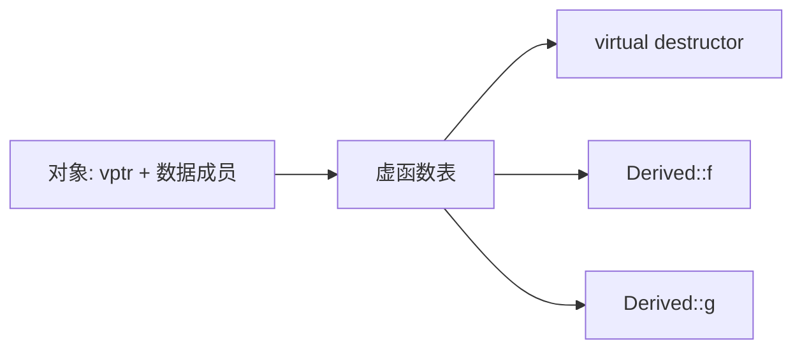

# 面向对象

## 封装、继承与多态

### 1. 面向过程和面向对象的区别？

#### 面试回答

面向过程以过程、函数和执行步骤为核心，强调“先做什么、后做什么”；面向对象以对象、职责和协作为核心，强调“谁来做、对象之间如何交互”。面向过程通常把数据和操作分开，适合流程明确、状态简单的问题；面向对象把数据和操作封装在对象内部，适合状态复杂、需要扩展、复用和维护的系统。C++ 同时支持面向过程和面向对象，两种思想可以在同一个项目中结合使用。

#### 1. 面向过程

面向过程编程把问题拆成一系列步骤，每个步骤用函数实现，程序执行就是按流程调用函数。

特点：

- 抽象单位主要是函数。
- 数据和处理数据的函数通常分离。
- 关注算法流程和执行顺序。
- 对简单任务直接、高效、容易理解。
- 当系统状态复杂、需求频繁变化时，函数之间容易耦合。

```cpp
struct UserData {
    std::string name;
    int age;
};

void printUser(const UserData& user) {
    std::cout << user.name << " " << user.age << "\n";
}
```

#### 2. 面向对象

面向对象编程把数据和操作数据的方法封装成对象，对外暴露稳定接口，对内维护状态和不变量。

特点：

- 抽象单位主要是类和对象。
- 数据和行为封装在一起。
- 通过封装隐藏实现细节。
- 通过继承和组合实现复用。
- 通过多态实现接口统一和行为扩展。

```cpp
class User {
public:
    User(std::string name, int age) : name_(std::move(name)), age_(age) {}
    void print() const {
        std::cout << name_ << " " << age_ << "\n";
    }
private:
    std::string name_;
    int age_{};
};
```

#### 对比表

| 对比项 | 面向过程 | 面向对象 |
| --- | --- | --- |
| 核心抽象 | 函数、过程 | 类、对象 |
| 关注点 | 流程和算法 | 责任和协作 |
| 数据与行为 | 通常分离 | 封装在对象中 |
| 复用方式 | 函数调用 | 组合、继承、多态 |
| 扩展方式 | 修改流程或增加函数 | 增加类、扩展接口实现 |
| 适合场景 | 小工具、算法、流程稳定任务 | 复杂业务、状态多、需求变化频繁系统 |

#### 常见追问

- **面向对象一定比面向过程好吗？**  
  不一定。算法题、简单脚本、底层小函数用面向过程更直接；复杂业务模型、GUI、框架、插件系统更适合面向对象。

- **C++ 是面向对象语言吗？**  
  C++ 是多范式语言，支持面向过程、面向对象、泛型编程、函数式风格和模板元编程。

### 2. 面向对象的三大特性有哪些？

#### 面试回答

面向对象三大特性是封装、继承、多态。封装把数据和操作绑定在一起，隐藏内部实现，通过接口维护对象状态；继承表达类之间的层次关系，派生类可以复用和扩展基类；多态允许同一接口在不同对象上表现出不同行为，提高扩展性和解耦能力。

#### 1. 封装

封装是把对象的状态和操作状态的函数放在类内部，并通过访问控制隐藏实现细节。

```cpp
class Account {
public:
    explicit Account(double balance) : balance_(balance) {}

    bool withdraw(double amount) {
        if (amount < 0 || amount > balance_) return false;
        balance_ -= amount;
        return true;
    }

    double balance() const { return balance_; }

private:
    double balance_{};
};
```

封装的价值：

- 防止外部随意破坏对象状态。
- 把实现细节和接口隔离。
- 便于维护不变量，例如余额不能为负。
- 降低模块之间的耦合。

#### 2. 继承

继承让派生类获得基类接口和实现，并在此基础上扩展或改写行为。

```cpp
struct Animal {
    virtual ~Animal() = default;
    virtual void speak() const = 0;
};

struct Dog : Animal {
    void speak() const override {
        std::cout << "wang\n";
    }
};
```

继承适合表达稳定的 `is-a` 关系。若只是“拥有某个能力”或“由某对象实现”，通常优先使用组合。

#### 3. 多态

多态表示同一接口可以对应不同实现。C++ 中既有运行期多态，也有编译期多态。

```cpp
void makeSound(const Animal& a) {
    a.speak(); // 根据实际对象类型调用不同 speak
}
```

多态的价值：

- 调用端依赖抽象接口，不依赖具体类型。
- 新增派生类时，调用端代码通常不用修改。
- 适合框架回调、插件、策略、业务扩展点。

#### 常见追问

- **抽象、封装、继承、多态之间关系？**  
  抽象是提炼共同特征；封装是隐藏实现；继承是复用和扩展；多态是通过统一接口调用不同实现。

- **继承是不是代码复用的首选？**  
  不是。现代 C++ 更强调组合优于继承，只有明确 `is-a` 关系时才使用公有继承。

### 3. 什么是多态？多态分为哪几种，应用场景有哪些？

#### 面试回答

多态是指同一接口对不同类型对象表现出不同的行为。C++ 中常见多态分为静态多态和动态多态：静态多态在编译期确定调用目标，如函数重载、运算符重载、模板、CRTP；动态多态在运行期确定调用目标，通常通过继承、虚函数、基类指针或引用实现。多态常用于插件系统、策略模式、图形对象绘制、网络协议处理、框架回调等场景。

#### 1. 静态多态

静态多态也叫编译期多态，调用目标在编译期间确定。

形式包括：

- 函数重载。
- 运算符重载。
- 函数模板和类模板。
- CRTP。

```cpp
void print(int x);
void print(const std::string& s);

template <class T>
T maxValue(const T& a, const T& b) {
    return a < b ? b : a;
}
```

优点：

- 无虚函数运行期开销。
- 容易被编译器内联优化。
- 类型错误在编译期暴露。

缺点：

- 编译依赖和模板错误可能复杂。
- 不适合运行期才知道对象真实类型的场景。

#### 2. 动态多态

动态多态也叫运行期多态，调用目标在运行时根据对象真实类型确定。

```cpp
struct Shape {
    virtual ~Shape() = default;
    virtual double area() const = 0;
};

struct Circle : Shape {
    double r{};
    double area() const override { return 3.14 * r * r; }
};

double getArea(const Shape& s) {
    return s.area();
}
```

动态多态实现条件：

- 基类中有虚函数。
- 派生类重写虚函数。
- 通过基类指针或引用调用。
- 对象没有被切片。

底层通常依赖虚函数表和虚指针。

#### 3. 应用场景

- 框架定义基类接口，业务派生类实现具体行为。
- 图形系统中 `Shape::draw()` 对圆、矩形、三角形分别绘制。
- 网络服务中不同消息类型使用统一处理接口。
- 策略模式中不同压缩、加密、排序算法挂到同一接口下。
- 插件系统运行时加载不同实现。

#### 常见追问

- **多态和重载是什么关系？**  
  重载是静态多态的一种，编译期根据参数选择函数。

- **动态多态一定要用指针吗？**  
  不一定，基类引用也可以。但按值传递会发生对象切片，失去多态。

### 4. 空类里有什么函数？

#### 面试回答

空类虽然没有用户显式声明的成员变量和成员函数，但编译器会按需隐式声明或生成一些特殊成员函数，包括默认构造函数、析构函数、拷贝构造函数、拷贝赋值运算符；C++11 以后还可能有移动构造函数和移动赋值运算符。空类对象大小通常不是 0，而是 1 字节，以保证不同对象有不同地址。

#### 1. 编译器可能生成的特殊成员函数

```cpp
class Empty {};
```

可近似理解为编译器可能提供：

```cpp
class Empty {
public:
    Empty();
    Empty(const Empty&);
    Empty& operator=(const Empty&);
    ~Empty();

    Empty(Empty&&);             // C++11 后，满足条件时生成
    Empty& operator=(Empty&&);  // C++11 后，满足条件时生成
};
```

注意“隐式声明”和“真正生成代码”不是一回事，编译器通常在 ODR-use 或需要时才生成。

#### 2. 空类大小为什么通常是 1？

C++ 要求不同对象具有不同地址。如果空类对象大小为 0，那么数组中多个空对象会有相同地址，无法区分。因此：

```cpp
class Empty {};
sizeof(Empty); // 通常为 1
```

空类数组也要能按元素寻址：

```cpp
Empty arr[10];
```

#### 3. 空基类优化 EBO

空类作为基类时，编译器可以进行空基类优化，让空基类子对象不额外占用空间。

```cpp
struct Empty {};
struct Holder : Empty {
    int x;
};

// sizeof(Holder) 通常为 sizeof(int)，而不是 sizeof(int)+1
```

但如果同一类型的空基类子对象需要有不同地址，优化会受到限制。

#### 常见追问

- **空类有虚函数时大小还是 1 吗？**  
  不是。含虚函数的类对象通常有虚指针，大小至少是一个指针大小再考虑对齐。

- **空类没有构造函数吗？**  
  用户没有写，但编译器会隐式声明默认构造函数等特殊成员函数。

### 5. A 继承 B、C 两个空类，对 A 强转成 B、C，地址空间有什么变化？

#### 面试回答

多继承下，一个派生类对象中包含多个基类子对象。把 `A*` 转成第一个基类 `B*` 时，地址通常不变；转成第二个基类 `C*` 时，理论上可能发生指针偏移调整。由于 B、C 是空类，编译器可能进行空基类优化，使它们不额外占空间，但不同基类子对象仍要满足 C++ 对对象地址和类型身份的规则。具体地址变化依赖 ABI 和编译器实现，不能一概而论。

#### 示例

```cpp
struct B {};
struct C {};
struct A : B, C {
    int x;
};

A a;
B* pb = &a;
C* pc = &a;
std::cout << &a << "\n";
std::cout << pb << "\n";
std::cout << pc << "\n";
```

在一些实现中，`&a`、`pb`、`pc` 打印值可能相同；在更复杂的多继承或非空基类场景中，第二个基类指针常常会有偏移。

#### 非空多继承更容易看出偏移

```cpp
struct B { int b; };
struct C { int c; };
struct A : B, C { int a; };
```

典型布局可能是：

```text
A object:
+---------+---------+---------+
| B::b    | C::c    | A::a    |
+---------+---------+---------+
^         ^
A*/B*     C*
```

此时 `A*` 转 `B*` 通常不变，转 `C*` 通常加上 `B` 子对象大小的偏移。

#### 常见误区

- 不能说“空类大小是 0”。完整对象的空类大小通常是 1。
- 不能说“强转一定不改变地址”。多继承下基类子对象可能不在对象起始位置。
- 不建议用 C 风格强转分析对象布局，应使用 `static_cast<B*>(&a)` 这样的类型安全转换。

### 6. `public/private` 继承的关系。

#### 面试回答

继承方式决定基类的 `public/protected` 成员在派生类中的访问级别，也决定外部能否把派生类当作基类使用。`public` 继承表达 `is-a`，基类 public 成员在派生类中仍是 public；`private` 继承表达“用基类实现自己”，基类 public/protected 成员在派生类中都变成 private。无论哪种继承，基类 private 成员都不能被派生类直接访问。

#### 访问权限变化

| 基类成员权限 | public 继承后 | protected 继承后 | private 继承后 |
| --- | --- | --- | --- |
| public | public | protected | private |
| protected | protected | protected | private |
| private | 派生类不可直接访问 | 派生类不可直接访问 | 派生类不可直接访问 |

```cpp
class Base {
public:
    void pub();
protected:
    void pro();
private:
    void pri();
};

class D1 : public Base {};
class D2 : private Base {};
```

对于 `D1`，外部可以调用 `D1` 对象的 `pub()`；对于 `D2`，`Base::pub()` 变成 `D2` 的 private 成员，外部不能直接调用。

#### 类型转换关系

```cpp
D1 d1;
Base* b1 = &d1; // public 继承：外部可做向上转型

D2 d2;
// Base* b2 = &d2; // private 继承：外部不可做这种转换
```

private 继承并不表示派生类不能使用基类功能，而是表示这种“是一个 Base”的关系不对外公开。

#### 常见追问

- **继承方式会不会影响基类 private 成员是否存在？**  
  不会。基类 private 成员仍然存在于基类子对象中，只是派生类代码不能直接访问。

- **struct 默认是什么继承？**  
  `struct` 默认 public 继承，`class` 默认 private 继承。

### 7. 公有继承和私有继承的应用场景？

#### 面试回答

公有继承适合表达稳定的 `is-a` 关系，派生类对象可以当作基类对象使用，例如 `Dog` 是一种 `Animal`。私有继承适合表达 `implemented-in-terms-of`，也就是派生类借用基类实现，但不把基类接口暴露给外部。现代 C++ 中，如果只是复用实现，通常优先使用组合；只有需要访问 protected 成员或重写基类虚函数时，私有继承才更有意义。

#### 1. 公有继承场景

```cpp
struct Shape {
    virtual ~Shape() = default;
    virtual void draw() const = 0;
};

struct Circle : public Shape {
    void draw() const override {}
};

void render(const Shape& s) {
    s.draw();
}
```

使用条件：

- 派生类确实是基类的一种。
- 基类接口对派生类仍然成立。
- 可以安全使用里氏替换原则：需要基类的地方可以传派生类。
- 常与虚函数、多态接口配合。

#### 2. 私有继承场景

```cpp
class TimerImpl {
protected:
    void startImpl();
    void stopImpl();
};

class Timer : private TimerImpl {
public:
    void start() { startImpl(); }
    void stop() { stopImpl(); }
};
```

使用条件：

- 不希望外部把派生类当作基类使用。
- 只是想复用基类实现。
- 需要访问基类 protected 成员。
- 需要重写基类虚函数，但不想公开基类接口。

#### 3. 为什么组合通常更好？

```cpp
class Timer {
public:
    void start() { impl_.start(); }
private:
    TimerImpl impl_;
};
```

组合的优点：

- 耦合更低。
- 可以更容易替换实现对象。
- 不暴露继承层次。
- 避免误用 `is-a` 关系。
- 对测试和维护更友好。

#### 常见追问

- **私有继承是不是多态？**  
  私有继承也能重写虚函数，但外部不能把派生类隐式转成基类来使用。它更多是实现继承，不是接口继承。

- **protected 继承常用吗？**  
  相对少用。它介于 public 和 private 之间，通常只有设计基类给进一步派生类使用时才考虑。

### 8. C++ 的多态如何实现？

#### 面试回答

C++ 动态多态主要通过虚函数表和虚指针实现。含虚函数的类通常有虚函数表，表中保存虚函数入口地址；对象中通常有虚指针 `vptr` 指向当前动态类型对应的虚表。通过基类指针或引用调用虚函数时，运行时根据对象的 `vptr` 找到虚表，再跳转到实际函数入口。



#### 实现条件

```cpp
struct Base {
    virtual ~Base() = default;
    virtual void f() { std::cout << "Base\n"; }
};

struct Derived : Base {
    void f() override { std::cout << "Derived\n"; }
};

void call(Base& b) {
    b.f();
}
```

要表现出动态多态，需要：

- 基类函数声明为 `virtual`。
- 派生类重写虚函数。
- 通过基类指针或引用调用。
- 对象真实类型是派生类。

#### 调用过程

典型虚调用过程：

1. 通过基类引用或指针拿到对象地址。
2. 从对象内取出 `vptr`。
3. 通过 `vptr` 找到虚表。
4. 根据虚函数槽位找到实际函数地址。
5. 间接调用实际函数。

#### 构造和析构中的虚调用

构造函数和析构函数中调用虚函数，不会分派到尚未构造或已经析构的派生类部分。

```cpp
struct Base {
    Base() { f(); }
    virtual void f() { std::cout << "Base\n"; }
};

struct Derived : Base {
    void f() override { std::cout << "Derived\n"; }
};

Derived d; // Base 构造阶段调用 Base::f
```

#### 常见追问

- **虚函数开销是什么？**  
  对象多一个虚指针，调用时多一次间接跳转，并可能影响内联。

- **虚表存在哪里？**  
  通常是编译器生成的静态只读数据，放在只读数据段；标准不强制规定具体实现。

### 9. 重载和覆盖的使用？

#### 面试回答

重载用于在同一作用域中提供多个同名但参数列表不同的函数，目的是让同一语义支持不同输入形式；覆盖也叫重写，是派生类重新实现基类虚函数，用于运行期多态。重载发生在编译期，覆盖发生在继承体系中并依赖虚函数动态绑定。

#### 1. 重载的使用

```cpp
class Printer {
public:
    void print(int x);
    void print(double x);
    void print(const std::string& s);
};
```

适合场景：

- 构造函数支持不同参数。
- 同一操作支持不同类型。
- 运算符重载。
- 提供更自然的接口。

注意点：

- 仅返回值不同不能构成重载。
- 默认参数可能导致调用二义性。
- 派生类同名函数可能隐藏基类重载集合。

#### 2. 覆盖的使用

```cpp
struct Task {
    virtual ~Task() = default;
    virtual void run() = 0;
};

struct DownloadTask : Task {
    void run() override {
        // download
    }
};
```

适合场景：

- 基类定义统一接口。
- 派生类提供不同实现。
- 调用端只依赖抽象基类。
- 运行期根据对象类型决定行为。

#### 3. `override` 的价值

```cpp
struct Base {
    virtual void f(int) const;
};

struct Derived : Base {
    // void f(int); // 少了 const，不是覆盖
    void f(int) const override; // 编译器检查
};
```

`override` 可以防止由于参数、`const`、引用限定、返回类型等不匹配导致的“本来想覆盖，实际变隐藏”。

#### 常见追问

- **覆盖和隐藏有什么区别？**  
  覆盖要求基类函数是虚函数且签名匹配；隐藏只要派生类有同名函数即可，参数不同也会隐藏。

- **重载是否体现多态？**  
  是静态多态，编译期根据参数选择函数。

### 10. 基类和派生类的构造函数和析构函数的执行顺序？

#### 面试回答

构造时先构造基类，再构造成员对象，最后执行派生类构造函数体；析构顺序完全相反，先执行派生类析构函数体，再析构成员对象，最后析构基类。若涉及虚继承，虚基类由最派生类负责构造，并且虚基类通常最先构造、最后析构。

#### 普通继承构造顺序

```cpp
struct Base {
    Base() { std::cout << "Base\n"; }
    ~Base() { std::cout << "~Base\n"; }
};

struct Member {
    Member() { std::cout << "Member\n"; }
    ~Member() { std::cout << "~Member\n"; }
};

struct Derived : Base {
    Member m;
    Derived() { std::cout << "Derived\n"; }
    ~Derived() { std::cout << "~Derived\n"; }
};
```

创建 `Derived d;` 输出顺序：

```text
Base
Member
Derived
~Derived
~Member
~Base
```

#### 详细规则

构造顺序：

1. 虚基类，若存在。
2. 直接基类，按继承列表声明顺序。
3. 成员对象，按类中成员声明顺序。
4. 当前类构造函数体。

析构顺序：

1. 当前类析构函数体。
2. 成员对象，按声明逆序。
3. 直接基类，按继承列表逆序。
4. 虚基类最后析构。

#### 常见误区

- 成员初始化顺序由成员声明顺序决定，不由初始化列表书写顺序决定。
- 构造函数中调用虚函数不会分派到派生类实现。
- 析构基类指针指向的派生对象时，基类析构函数应为虚函数。

### 11. 谈谈深拷贝和浅拷贝，以及如何实现？

#### 面试回答

浅拷贝只复制对象成员的值，如果成员里有裸指针，那么拷贝后两个对象会指向同一块资源，容易导致互相影响、重复释放或悬空指针。深拷贝会为新对象重新分配资源，并复制资源内容，使两个对象拥有独立资源。C++ 中如果类直接管理资源，需要自定义拷贝构造函数、拷贝赋值运算符和析构函数；现代 C++ 更推荐使用 RAII 成员，让编译器自动生成正确拷贝或禁用拷贝。

#### 1. 浅拷贝问题

```cpp
class Buffer {
public:
    Buffer(size_t n) : data_(new char[n]), size_(n) {}
    ~Buffer() { delete[] data_; }
private:
    char* data_{};
    size_t size_{};
};
```

如果使用默认拷贝构造：

```cpp
Buffer a(10);
Buffer b = a; // 默认浅拷贝，a.data_ 和 b.data_ 指向同一块内存
```

程序结束时 `a` 和 `b` 都会 `delete[]` 同一块内存，产生 double free。

#### 2. 深拷贝实现

```cpp
class Buffer {
public:
    explicit Buffer(size_t n) : data_(new char[n]{}), size_(n) {}

    ~Buffer() {
        delete[] data_;
    }

    Buffer(const Buffer& other)
        : data_(new char[other.size_]), size_(other.size_) {
        std::copy(other.data_, other.data_ + size_, data_);
    }

    Buffer& operator=(const Buffer& other) {
        if (this == &other) return *this;
        char* newData = new char[other.size_];
        std::copy(other.data_, other.data_ + other.size_, newData);
        delete[] data_;
        data_ = newData;
        size_ = other.size_;
        return *this;
    }

private:
    char* data_{};
    size_t size_{};
};
```

赋值运算符中先分配新资源，再释放旧资源，可以提高异常安全性。

#### 3. 现代 C++ 写法

如果用标准库资源管理类，通常不需要手写拷贝控制：

```cpp
class Buffer {
private:
    std::vector<char> data_;
};
```

`std::vector` 自己负责深拷贝、移动和释放资源，这符合 Rule of Zero。

#### 常见追问

- **什么时候必须自己写深拷贝？**  
  类直接拥有裸资源，如裸指针、文件描述符、socket、互斥锁等，并且需要可拷贝语义时。

- **如果资源不能复制怎么办？**  
  删除拷贝构造和拷贝赋值，只允许移动，例如 `std::unique_ptr`。

### 12. `string` 的赋值操作是深拷贝还是浅拷贝？

#### 面试回答

现代 C++ 标准库中的 `std::string` 赋值表现为值语义，赋值后两个字符串逻辑上相互独立，修改一个不会影响另一个，因此可以按深拷贝或等价的独立所有权来理解。早期某些实现使用过写时复制 COW，但 C++11 后由于迭代器、引用、线程安全等语义要求，主流标准库实现已经不再使用 COW string。

#### 示例

```cpp
std::string s1 = "hello";
std::string s2 = s1;
s2[0] = 'H';

std::cout << s1 << "\n"; // hello
std::cout << s2 << "\n"; // Hello
```

如果是浅拷贝，`s2` 修改会影响 `s1`；但标准字符串表现为独立值语义。

#### 深拷贝与 SSO

短字符串可能触发 SSO，即字符串内容直接存在 `std::string` 对象内部，不分配堆内存。此时“深拷贝”不是重新分配堆内存，而是复制对象内的小缓冲区。对使用者来说，关键语义是两个字符串独立。

#### 常见追问

- **C++11 前的 COW string 为什么不主流了？**  
  写时复制在多线程和迭代器引用语义下很难高效且正确，修改一个字符串时还要检查共享状态，会带来复杂性。

- **`std::string` 拷贝一定会分配内存吗？**  
  不一定。短字符串可能用 SSO；长字符串通常需要分配新缓冲区。

### 13. 什么时候重载赋值运算符与拷贝构造函数？

#### 面试回答

当类直接管理资源并且需要自定义拷贝语义时，需要重载拷贝构造函数和拷贝赋值运算符。拷贝构造用于“用已有对象初始化新对象”，赋值运算符用于“两个已经存在的对象之间赋值”。如果类定义了析构函数、拷贝构造或拷贝赋值中的任意一个，通常要考虑 Rule of Three；C++11 后还要考虑移动构造和移动赋值，也就是 Rule of Five。更好的设计是 Rule of Zero：用标准库 RAII 成员管理资源，避免手写特殊成员函数。

#### 拷贝构造和赋值的区别

```cpp
Buffer a(10);
Buffer b = a; // 拷贝构造：b 是新对象

Buffer c(20);
c = a;        // 拷贝赋值：c 已经存在
```

拷贝赋值需要处理：

- 自赋值。
- 释放旧资源。
- 分配新资源。
- 异常安全。
- 返回 `*this` 以支持链式赋值。

#### 什么时候需要自定义？

需要自定义的典型情况：

- 类持有裸指针并拥有其生命周期。
- 类持有文件描述符、socket、数据库连接等系统资源。
- 类中有互斥锁或不可复制资源，需要禁用拷贝。
- 默认逐成员拷贝不符合业务语义。

不需要自定义的情况：

- 成员都是 `std::string`、`std::vector`、智能指针等 RAII 类型，并且默认语义正确。

#### 常见写法

```cpp
class Resource {
public:
    Resource(const Resource& other);
    Resource& operator=(const Resource& other);
    Resource(Resource&& other) noexcept;
    Resource& operator=(Resource&& other) noexcept;
    ~Resource();
};
```

#### 常见追问

- **为什么赋值运算符要返回引用？**  
  为了支持链式赋值，如 `a = b = c;`，也避免返回临时对象。

- **什么是 copy-and-swap？**  
  先按值构造一个临时副本，再与当前对象交换资源，利用临时对象析构释放旧资源，写法简洁且异常安全。

### 14. 什么地方需要用到拷贝构造函数？

#### 面试回答

拷贝构造函数用于用一个已有对象初始化一个新对象。常见触发场景包括：定义对象时用同类型对象初始化、函数按值传参、函数按值返回、容器插入或扩容时复制元素、抛出或捕获异常对象等。现代 C++ 中移动语义和返回值优化会减少实际拷贝，但理解这些场景仍然很重要。

#### 典型调用时机

```cpp
class A {
public:
    A() = default;
    A(const A&) { std::cout << "copy\n"; }
};

A a;
A b(a);      // 1. 直接初始化
A c = a;     // 2. 拷贝初始化

void f(A x); // 3. 按值传参
f(a);

A make() {
    A t;
    return t; // 4. 按值返回，可能被 NRVO 消除
}
```

#### 容器场景

```cpp
std::vector<A> v;
v.push_back(a); // 可能拷贝
```

如果提供移动构造，传右值时容器可能移动而不是拷贝：

```cpp
v.push_back(A{}); // 可能移动或直接构造
```

#### 常见追问

- **拷贝构造和移动构造区别？**  
  拷贝构造复制资源，源对象保持不变；移动构造转移资源，源对象仍有效但值通常不再有业务意义。

- **为什么有时看不到拷贝构造输出？**  
  因为编译器可能进行 RVO/NRVO，C++17 起某些返回值场景强制消除拷贝。

### 15. `virtual() = 0` 是什么意思？

#### 面试回答

准确写法不是 `virtual() = 0`，而是类似 `virtual void f() = 0;`，表示纯虚函数。包含纯虚函数的类是抽象类，不能直接实例化；派生类必须实现所有纯虚函数后才能成为具体类。纯虚函数常用于定义接口，要求派生类提供具体行为。

#### 纯虚函数示例

```cpp
class IReader {
public:
    virtual ~IReader() = default;
    virtual std::string read() = 0;
};

class FileReader : public IReader {
public:
    std::string read() override {
        return "file data";
    }
};
```

`IReader` 不能直接创建对象：

```cpp
// IReader r; // 错误：抽象类
FileReader fr; // 正确
```

#### 纯虚函数是否能有函数体？

可以。纯虚函数即使有定义，类仍然是抽象类。纯虚析构函数尤其必须有定义。

```cpp
class Base {
public:
    virtual ~Base() = 0;
};

Base::~Base() = default;
```

#### 常见追问

- **抽象类能有构造函数吗？**  
  可以。抽象类不能实例化，但派生类构造时仍要先构造基类部分。

- **纯虚函数和虚函数区别？**  
  虚函数可有默认实现，派生类可重写；纯虚函数表示接口约束，使类成为抽象类。

### 16. 虚函数和虚继承是怎么实现？

#### 面试回答

虚函数用于实现动态多态，典型实现是对象中保存虚指针 `vptr`，虚指针指向虚函数表 `vtable`，虚表中保存虚函数入口地址。虚继承用于解决菱形继承中同一个基类被多份继承的问题，保证最派生类对象中只有一份虚基类子对象；实现上通常通过虚基类指针、虚基类表或偏移信息在运行时定位虚基类子对象。二者名字都带“虚”，但解决的问题完全不同。

#### 1. 虚函数实现

```cpp
struct Base {
    virtual ~Base() = default;
    virtual void f();
};

struct Derived : Base {
    void f() override;
};
```

典型实现：

- 编译器为 `Base`、`Derived` 生成虚表。
- 对象中有 `vptr` 指向对应动态类型的虚表。
- 调用虚函数时通过虚表找到实际函数地址。

```text
Derived object:
+------+---------+
| vptr | data... |
+------+---------+
   |
   v
Derived vtable -> Derived::f
```

#### 2. 虚继承要解决的问题

菱形继承：

```cpp
struct A { int x; };
struct B : A {};
struct C : A {};
struct D : B, C {};
```

此时 `D` 中有两份 `A` 子对象：一份来自 `B`，一份来自 `C`。访问 `D::x` 会产生二义性。

使用虚继承：

```cpp
struct A { int x; };
struct B : virtual A {};
struct C : virtual A {};
struct D : B, C {};
```

此时 `D` 中只有一份共享的 `A` 虚基类子对象。

#### 3. 虚继承的实现思路

虚继承对象布局比普通继承复杂。编译器需要让 `B`、`C` 在不知道最派生类具体布局的情况下，仍能找到共享的 `A` 子对象。因此实现中常见：

- 虚基类表 vbtable。
- 虚基类指针 vbptr。
- 虚基类偏移量。

对象访问虚基类成员时，可能需要通过表或偏移计算虚基类子对象地址。

#### 4. 构造规则

虚基类由最派生类负责构造：

```cpp
struct A {
    A(int) {}
};
struct B : virtual A {
    B() : A(1) {}
};
struct C : virtual A {
    C() : A(2) {}
};
struct D : B, C {
    D() : A(3), B(), C() {}
};
```

构造 `D` 时，最终由 `D` 的初始化列表中的 `A(3)` 构造唯一的虚基类 `A`。

#### 常见追问

- **虚函数和虚继承有什么关系？**  
  没有必然关系。虚函数解决运行期多态；虚继承解决多继承中基类子对象重复。

- **虚继承有什么代价？**  
  对象布局更复杂，可能增加指针或表，访问虚基类成员可能多一次间接寻址。

### 17. 如果我有一块地址空间，怎么在这个地址空间内调用构造函数？

#### 面试回答

使用定位 new，也叫 placement new。它允许在一块已经分配好的原始内存上构造对象，不负责分配内存。对象使用完后需要显式调用析构函数，原始内存如何释放由外部决定。常见场景是内存池、对象池、共享内存、预分配缓冲区。

```cpp
alignas(std::string) unsigned char buf[sizeof(std::string)];
auto* p = new (buf) std::string("hello");
p->~basic_string();
```

#### 1. 为什么需要 `alignas`？

原始内存必须满足目标类型的对齐要求。`unsigned char buf[sizeof(T)]` 只保证字节大小，不一定保证适合 `T` 的对齐。使用 `alignas(T)` 可以让缓冲区满足 `T` 的对齐。

```cpp
alignas(MyType) std::byte storage[sizeof(MyType)];
MyType* obj = new (storage) MyType(args);
```

#### 2. placement new 的生命周期

```cpp
void* raw = operator new(sizeof(std::string));
auto* s = new (raw) std::string("abc"); // 构造
s->~basic_string();                     // 析构
operator delete(raw);                   // 释放原始内存
```

要区分三件事：

- 分配原始内存。
- 在原始内存上构造对象。
- 析构对象并释放原始内存。

placement new 只做第二件事。

#### 3. 常见误区

- placement new 构造的对象不能直接 `delete p`，除非原始内存本来就是通过匹配的普通 `operator new` 获得并且语义清晰。
- 析构函数需要手动调用。
- 同一块内存重复构造对象前，要先结束旧对象生命周期。
- 对齐不满足会导致未定义行为。

#### 常见追问

- **placement new 会不会分配内存？**  
  不会，它只在给定地址上构造对象。

- **什么时候用？**  
  内存池、对象池、高性能容器实现、共享内存对象构造等。

### 18. `sizeof(A)` 是多少？

```cpp
class A {
    int a;
    short b;
    double c;
    virtual void fun() {}
    static int d;
};
```

#### 面试回答

这个题不能脱离平台直接给唯一答案。`static int d` 不属于对象本身，不计入 `sizeof(A)`；虚函数通常会让对象中增加一个虚指针；普通非静态成员 `int a`、`short b`、`double c` 要按对齐规则布局。典型 64 位平台上，虚指针 8 字节，`int` 4 字节，`short` 2 字节，`double` 8 字节对齐，常见结果是 24 字节；典型 32 位平台上虚指针 4 字节，整体也常见为 24 字节。但实际结果依赖 ABI、编译器和对齐设置。

#### 1. 哪些成员计入对象大小？

计入：

- 非静态数据成员。
- 虚指针，若实现使用 vptr。
- 对齐填充字节。
- 空基类优化失败时的基类子对象空间。

不计入：

- 普通成员函数。
- 静态成员函数。
- 静态数据成员。
- 虚函数表本身。

#### 2. 典型 64 位布局分析

假设虚指针在对象起始位置，指针 8 字节，`double` 需要 8 字节对齐：

```text
offset 0:  vptr       8 bytes
offset 8:  int a      4 bytes
offset 12: short b    2 bytes
offset 14: padding    2 bytes
offset 16: double c   8 bytes
total: 24 bytes
```

所以常见 `sizeof(A) == 24`。

#### 3. 如果没有虚函数？

没有虚函数时，不需要虚指针。典型布局：

```text
offset 0: int a      4 bytes
offset 4: short b    2 bytes
offset 6: padding    2 bytes
offset 8: double c   8 bytes
total: 16 bytes
```

#### 4. 常见追问

- **静态成员变量为什么不算入对象大小？**  
  因为静态成员属于类，所有对象共享一份，有独立存储，不在每个对象内部。

- **虚函数为什么影响对象大小？**  
  虚函数表不在对象内部，但对象通常需要一个虚指针指向虚表。

- **能不能用固定答案？**  
  面试应先说明平台假设，再给典型结果。脱离平台说死是不严谨的。

> [!CAUTION]
> `sizeof` 题必须说明平台、编译器 ABI、对齐规则，否则固定答案不严谨。

## 自检

- 已覆盖面向对象 18 题。
- 每题已按“面试回答 + 定义/特点/原理 + 示例 + 误区/追问”的复习密度扩展。
- 对空类、多继承地址调整、虚继承、`sizeof(A)` 等依赖 ABI 的问题均注明了边界条件。
