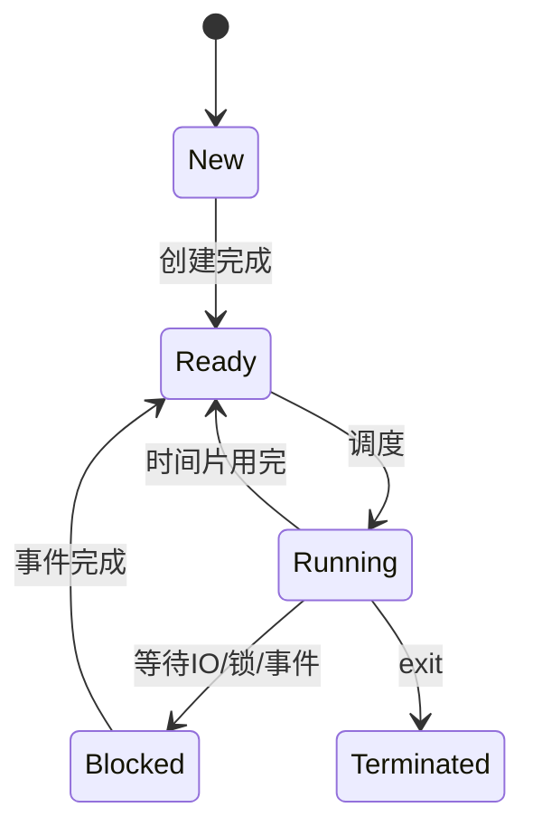

# Linux

## Linux 基础与系统工具

### 1. 说说 Linux 中常用的命令？

#### 面试回答

Linux 常用命令可以按场景分类回答：文件和目录操作、文本处理、权限管理、进程线程、网络、磁盘、内存、性能排查、压缩归档和调试工具。面试时不要只罗列命令，最好结合排障流程说明，例如“先用 `top` 看资源，再用 `ps/pidstat` 定位进程或线程，再用 `strace/gdb/perf` 深入分析”。

#### 1. 文件和目录

| 命令 | 作用 | 示例 |
| --- | --- | --- |
| `ls` | 查看目录内容 | `ls -lh` |
| `cd/pwd` | 切换/显示目录 | `pwd` |
| `cp/mv/rm` | 复制、移动、删除 | `rm -rf dir` |
| `mkdir/rmdir` | 创建/删除目录 | `mkdir -p a/b` |
| `find` | 按条件查找文件 | `find . -name "*.log"` |
| `stat` | 查看文件元信息 | `stat file` |

#### 2. 文本处理

```bash
cat file
less file
head -n 100 file
tail -f app.log
grep -n "error" app.log
awk '{print $1}' access.log
sed 's/foo/bar/g' file
sort file | uniq -c
```

`grep/awk/sed` 是日志分析高频组合。`tail -f` 常用于实时看日志。

#### 3. 权限和用户

```bash
chmod 755 app
chown user:group file
id
whoami
sudo command
```

权限位中 `r/w/x` 对文件表示读、写、执行；对目录，`x` 表示能进入或访问目录项。

#### 4. 进程、线程和资源

```bash
ps aux
top
top -H -p <pid>
pidstat -p <pid> 1
kill -TERM <pid>
kill -9 <pid>
```

`SIGTERM` 是优雅退出请求，`SIGKILL` 是强制杀死，不能被捕获或忽略。

#### 5. 网络

```bash
ss -lntup
curl -v http://example.com
ping host
traceroute host
tcpdump -i eth0 port 80
lsof -i :8080
```

现代 Linux 推荐用 `ss` 替代老的 `netstat`。

#### 6. 磁盘和内存

```bash
df -h
du -sh *
lsblk
iostat -x 1
free -h
vmstat 1
pmap -x <pid>
```

#### 常见追问

- **如何排查 CPU 高？**  
  `top` 找进程，`top -H -p PID` 找线程，`printf "%x\n" TID` 转十六进制，再用 `jstack` 或 `gdb/perf` 看栈。

- **如何排查端口占用？**  
  `ss -lntup | grep 8080` 或 `lsof -i :8080`。

### 2. 创建软连接的命令是什么？

#### 面试回答

创建软链接使用 `ln -s 源路径 链接路径`。软链接保存的是路径名，类似快捷方式，可以跨文件系统，也可以指向目录；如果源文件被删除，软链接会变成悬空链接。硬链接则是同一个 inode 的多个目录项，通常不能跨文件系统，也不能随意对目录创建硬链接。

```bash
ln -s /opt/app/bin/server /usr/local/bin/server
```

#### 软链接和硬链接区别

| 对比项 | 软链接 | 硬链接 |
| --- | --- | --- |
| 本质 | 独立文件，内容是路径 | 同一个 inode 的多个名字 |
| 是否跨文件系统 | 可以 | 通常不可以 |
| 是否可链接目录 | 可以 | 一般不允许 |
| 源文件删除后 | 链接失效 | 仍可访问文件内容 |
| inode | 与源不同 | 与源相同 |

```bash
ls -li file hard_link soft_link
```

`-i` 可查看 inode，硬链接 inode 相同，软链接 inode 不同。

### 3. `/proc` 文件夹下放的是什么？

#### 面试回答

`/proc` 是 Linux 的伪文件系统，不是真实磁盘目录，而是内核把系统状态和进程信息以文件形式暴露给用户态的接口。`/proc/PID` 保存某个进程的运行信息，如命令行、环境变量、文件描述符、内存映射、状态等；`/proc/cpuinfo`、`/proc/meminfo`、`/proc/net` 等保存系统级信息。

#### 常见内容

| 路径 | 含义 |
| --- | --- |
| `/proc/cpuinfo` | CPU 信息 |
| `/proc/meminfo` | 内存信息 |
| `/proc/loadavg` | 系统负载 |
| `/proc/uptime` | 系统运行时间 |
| `/proc/version` | 内核版本 |
| `/proc/PID/status` | 进程状态 |
| `/proc/PID/cmdline` | 启动命令 |
| `/proc/PID/fd` | 打开的文件描述符 |
| `/proc/PID/maps` | 进程内存映射 |
| `/proc/PID/smaps` | 更详细的内存映射统计 |

#### 示例

```bash
cat /proc/meminfo
ls -l /proc/$(pidof nginx)/fd
cat /proc/<pid>/status
cat /proc/<pid>/maps
```

#### 常见追问

- **为什么说 `/proc` 是伪文件系统？**  
  因为这些文件内容不是存储在磁盘上，而是读取时由内核动态生成。

- **如何通过 `/proc` 看进程打开了哪些文件？**  
  查看 `/proc/PID/fd`。

### 4. Linux 下有哪些文件类型？

#### 面试回答

Linux 中“一切皆文件”，常见文件类型包括普通文件、目录、字符设备、块设备、管道 FIFO、套接字 socket、符号链接。可以通过 `ls -l` 输出第一列的第一个字符判断类型。

| 类型字符 | 类型 | 说明 |
| --- | --- | --- |
| `-` | 普通文件 | 文本、二进制、日志等 |
| `d` | 目录 | 保存目录项 |
| `l` | 符号链接 | 保存目标路径 |
| `c` | 字符设备 | 按字符流访问，如终端 |
| `b` | 块设备 | 按块访问，如磁盘 |
| `p` | FIFO 管道 | 进程间通信 |
| `s` | socket | 本机进程或网络通信 |

```bash
ls -l /dev/null
ls -l /tmp
file app
```

#### 补充

设备文件通常在 `/dev` 下。字符设备适合顺序字符流，块设备适合随机块访问。FIFO 和 Unix Domain Socket 都可用于本机 IPC。

### 5. Linux 查看内存、磁盘、端口、进程、线程命令有哪些？

#### 面试回答

内存常用 `free/top/vmstat/pmap`；磁盘常用 `df/du/lsblk/iostat`；端口常用 `ss/lsof`；进程常用 `ps/top/pidstat`；线程常用 `top -H`、`ps -T`、`ps -eLf`。排障时要根据问题类型组合使用，而不是单独依赖某一个命令。

#### 命令速查

| 场景 | 命令 |
| --- | --- |
| 内存总览 | `free -h`、`cat /proc/meminfo` |
| 进程内存 | `pmap -x PID`、`cat /proc/PID/smaps` |
| CPU/内存实时 | `top`、`htop` |
| 磁盘空间 | `df -h` |
| 目录大小 | `du -sh *` |
| 块设备 | `lsblk` |
| 磁盘 I/O | `iostat -x 1` |
| 端口监听 | `ss -lntup` |
| 端口对应进程 | `lsof -i :PORT` |
| 进程列表 | `ps aux` |
| 线程列表 | `ps -T -p PID`、`top -H -p PID` |

#### 示例排障

```bash
free -h
df -h
ss -lntup | grep 8080
ps aux | grep app
top -H -p <pid>
```

#### 常见追问

- **`df` 和 `du` 为什么结果不一致？**  
  `df` 看文件系统整体空间；`du` 统计目录中文件占用。被删除但仍被进程打开的文件会占用磁盘，`du` 看不到，`df` 能看到。

- **如何查某端口被谁占用？**  
  `ss -lntup | grep :8080` 或 `lsof -i :8080`。

### 6. gdb 的基本使用。

#### 面试回答

gdb 是 Linux 下常用 C/C++ 调试器，可用于运行调试、断点、单步、查看变量、查看调用栈、调试 core dump、多线程调试和反汇编分析。基本流程是带 `-g` 编译程序，用 `gdb ./app` 启动，设置断点，运行，崩溃或断点处查看栈和变量。

#### 编译和启动

```bash
g++ -g -O0 main.cpp -o app
gdb ./app
```

带参数运行：

```gdb
set args arg1 arg2
run
```

调试 core：

```bash
gdb ./app core
```

#### 常用命令

| 命令 | 作用 |
| --- | --- |
| `run/r` | 运行程序 |
| `break/b file:line` | 设置断点 |
| `break func` | 在函数处断点 |
| `condition N expr` | 条件断点 |
| `next/n` | 单步越过函数 |
| `step/s` | 单步进入函数 |
| `continue/c` | 继续运行 |
| `finish` | 执行到当前函数返回 |
| `backtrace/bt` | 查看调用栈 |
| `frame N` | 切换栈帧 |
| `print/p expr` | 打印表达式 |
| `info locals` | 查看局部变量 |
| `info threads` | 查看线程 |
| `thread N` | 切换线程 |
| `thread apply all bt` | 打印所有线程栈 |
| `x/16x addr` | 查看内存 |
| `disassemble` | 反汇编 |

#### 常见追问

- **如何调试段错误？**  
  开 core，崩溃后 `gdb ./app core`，先 `bt` 找崩溃栈，再 `frame` 切换，`p` 查看变量。

- **如何看多线程死锁？**  
  `thread apply all bt` 看所有线程栈，观察是否卡在锁、条件变量或 join。

### 7. 是否用过 gdb 或其他调试工具？gdb 用过哪些功能？

#### 面试回答

可以按实战经验回答：gdb 用来定位 core dump、设置普通断点和条件断点、查看多线程调用栈、打印变量和内存、查看寄存器、反汇编、捕获异常。其他工具包括 `strace` 查看系统调用，`ltrace` 查看库调用，ASan/Valgrind 检查内存问题，TSan 检查数据竞争，`perf` 分析 CPU 热点，`tcpdump` 分析网络包。

#### gdb 实用功能

```gdb
b main
b worker.cpp:120 if id == 10
watch global_var
catch throw
thread apply all bt
info registers
x/32xb buffer
disassemble /m func
```

#### 其他工具

| 工具 | 作用 |
| --- | --- |
| `strace` | 跟踪系统调用，如文件、网络、信号 |
| `ltrace` | 跟踪动态库函数调用 |
| `valgrind` | 检测内存泄漏、越界、未初始化读 |
| ASan | 快速检测越界、UAF、double free |
| TSan | 检测数据竞争 |
| `perf` | CPU 采样、火焰图、热点分析 |
| `tcpdump` | 抓包分析网络问题 |

#### 示例

```bash
strace -f -p <pid>
perf top -p <pid>
valgrind --leak-check=full ./app
```

### 8. gdb 堆栈信息不准怎么办，可能哪里出问题？

#### 面试回答

gdb 堆栈不准常见原因有：程序没有调试符号、符号文件和二进制不匹配、编译优化过高、帧指针被省略、栈内存被破坏、尾调用优化、core 文件和可执行文件版本不一致、动态库符号缺失。处理思路是确认二进制和 core 匹配，加载正确符号，尽量使用 `-g -Og/-O0 -fno-omit-frame-pointer` 重新编译复现；如果不能重跑，只能结合寄存器、反汇编、内存映射和日志分析。

#### 常见原因

| 原因 | 表现 | 处理 |
| --- | --- | --- |
| 无 `-g` | 看不到源码和变量 | 使用带符号版本 |
| strip 符号 | 函数名缺失 | 加载 debuginfo |
| 优化过高 | 变量 optimized out，栈帧怪 | 使用 `-Og` 或 `-O0` |
| 省略帧指针 | 回溯不完整 | `-fno-omit-frame-pointer` |
| 栈破坏 | bt 出现异常地址 | 查越界写、UAF |
| 版本不匹配 | 行号和函数对不上 | 确认 build-id |

#### 不能运行、不能改代码时怎么办？

1. 确认 core、可执行文件、动态库版本一致。
2. `info files`、`info sharedlibrary` 查看加载信息。
3. `bt full` 查看尽可能多的局部信息。
4. `info registers` 查看崩溃寄存器。
5. `x/i $pc`、`disassemble` 看崩溃指令。
6. `info proc mappings` 或 `/proc/PID/maps` 对照地址属于哪个库。
7. 结合日志、输入数据、最近变更定位。

### 9. 模块偶发崩溃如何定位并解决？

#### 面试回答

偶发崩溃通常和内存越界、use-after-free、数据竞争、未初始化变量、空指针、生命周期错误有关。定位思路是先保留现场：开启 core dump、保存符号和版本、记录日志和请求上下文；再提高复现概率：压力测试、开启 ASan/TSan/Valgrind、增加断言和关键日志；最后根据栈、内存检查结果和代码审查定位根因。

#### 排查步骤

1. **保存现场**
   ```bash
   ulimit -c unlimited
   coredumpctl list
   coredumpctl gdb <pid-or-exe>
   ```

2. **确认版本**
   - 可执行文件和 core 是否同一次构建。
   - 动态库是否匹配。
   - 是否有调试符号。

3. **看崩溃栈**
   ```gdb
   bt full
   thread apply all bt
   info locals
   ```

4. **使用工具**
   ```bash
   ASAN_OPTIONS=abort_on_error=1 ./app
   valgrind --tool=memcheck ./app
   ```

5. **压测复现**
   - 增加并发。
   - 固定随机种子。
   - 记录输入和请求 ID。
   - 对共享对象加日志和断言。

#### 常见根因

- 多线程数据竞争。
- 对象已析构但回调仍访问。
- vector 扩容后保存的指针失效。
- 写越界破坏堆或栈。
- 第三方库 ABI 不兼容。

### 10. 循环内出现问题，gdb 调试需要等待很长时间怎么办？

#### 面试回答

循环里出问题不应靠手动单步等很久，可以使用条件断点、忽略次数、观察点、命中计数和日志缩小范围。例如在第 100000 次循环或某个变量满足条件时停下；也可以对变量设置 watchpoint，等它被修改时自动中断。

#### 常用方法

条件断点：

```gdb
break file.cpp:100 if i == 100000
```

忽略前 N 次断点：

```gdb
break file.cpp:100
ignore 1 99999
```

观察变量变化：

```gdb
watch value
rwatch value
awatch value
```

打印后继续：

```gdb
commands 1
print i
continue
end
```

#### 其他策略

- 在代码中临时加日志或断言缩小范围。
- 使用二分法定位第几次迭代开始异常。
- 如果数据量固定，保存输入后离线复现。
- 若是性能问题，优先用 `perf` 而不是 gdb 单步。

### 11. 内存泄漏怎么检查，怎么避免？

#### 面试回答

内存泄漏是程序申请资源后不再使用却没有释放，导致进程占用持续增长。检查工具包括 ASan、Valgrind、LSan、heaptrack、tcmalloc/jemalloc profiler、`pmap`、`smem`。避免方式是 RAII、智能指针、标准容器、明确所有权、异常安全、资源成对管理和长时间压测。C++ 中最重要的原则是不要裸 `new/delete` 分散在业务代码里。

#### 检查方法

```bash
valgrind --leak-check=full --show-leak-kinds=all ./app
```

ASan/LSan：

```bash
g++ -fsanitize=address -g app.cpp -o app
./app
```

进程级观察：

```bash
pmap -x <pid>
cat /proc/<pid>/smaps
top -p <pid>
```

#### 常见泄漏场景

- `new/malloc` 后异常路径忘记释放。
- 容器或全局缓存只增不删。
- `shared_ptr` 循环引用。
- 线程、文件描述符、socket、数据库连接未关闭。
- 回调持有对象导致生命周期被意外延长。

#### 避免方式

```cpp
auto p = std::make_unique<T>();
std::vector<int> v;
using FilePtr = std::unique_ptr<FILE, decltype(&fclose)>;
```

原则：

- 用对象生命周期管理资源，即 RAII。
- 独占资源用 `unique_ptr`。
- 共享资源谨慎用 `shared_ptr`，避免循环引用。
- C 资源包装自定义 deleter。
- 代码评审关注所有权和异常路径。

### 12. 什么是 coredump 文件？怎么调试？

#### 面试回答

core dump 是进程异常终止时，内核保存的进程运行现场快照，通常包含内存、寄存器、线程状态、栈等信息。它用于事后分析崩溃原因。调试时使用与 core 匹配的可执行文件和动态库，执行 `gdb ./program core`，再用 `bt full`、`info threads`、`frame`、`print` 等命令分析。

#### 开启 core

```bash
ulimit -c unlimited
cat /proc/sys/kernel/core_pattern
```

systemd 系统：

```bash
coredumpctl list
coredumpctl gdb <exe-or-pid>
```

临时设置 core 文件名：

```bash
sudo sysctl -w kernel.core_pattern=core.%e.%p.%t
```

#### gdb 调试

```bash
gdb ./app core.app.1234
```

常用命令：

```gdb
bt
bt full
info threads
thread apply all bt
frame 2
info locals
p variable
info registers
```

#### 常见追问

- **为什么没有生成 core？**  
  `ulimit -c` 为 0、core_pattern 被 systemd 接管、权限不足、工作目录不可写、进程设置了 dumpable 限制。

- **core 很大怎么办？**  
  core 包含进程内存映像，大内存进程 core 会很大；可调整 `/proc/PID/coredump_filter` 控制 dump 哪些映射。

### 13. 什么时候用静态库和动态库，两者有何区别？

#### 面试回答

静态库 `.a` 在链接阶段把需要的目标代码合入可执行文件，部署简单、运行时依赖少，但可执行文件大、多个程序无法共享同一份库代码，库更新需要重新链接。动态库 `.so` 在运行时由动态链接器加载，多个进程可共享代码段，升级和插件化方便，但需要处理库搜索路径、版本兼容和 ABI 问题。

#### 对比表

| 对比项 | 静态库 `.a` | 动态库 `.so` |
| --- | --- | --- |
| 链接时机 | 编译链接阶段 | 运行加载阶段 |
| 是否合入可执行文件 | 是 | 否，只记录依赖 |
| 文件体积 | 可执行文件更大 | 可执行文件较小 |
| 部署依赖 | 少 | 需要 `.so` 路径正确 |
| 升级 | 需重新链接/发布 | 可替换动态库，需 ABI 兼容 |
| 内存共享 | 差 | 多进程可共享代码段 |
| 适用 | 小工具、独立部署 | 插件、共享基础库、大型系统 |

#### 常用命令

创建静态库：

```bash
ar rcs libfoo.a foo.o
```

创建动态库：

```bash
g++ -fPIC -shared foo.cpp -o libfoo.so
```

查看动态依赖：

```bash
ldd ./app
```

#### 常见追问

- **动态库找不到怎么办？**  
  配置 `LD_LIBRARY_PATH`、`/etc/ld.so.conf` + `ldconfig`、或链接时设置 rpath。

- **动态库是不是一定慢？**  
  首次加载和符号解析有成本，调用本身通常不是主要瓶颈。动态库带来的部署和 ABI 问题更常见。

### 14. 零拷贝技术有哪些？

#### 面试回答

零拷贝的目标是减少数据在用户态和内核态之间的复制次数，降低 CPU 消耗和内存带宽压力。Linux 常见零拷贝技术包括 `mmap`、`sendfile`、`splice`、`tee`、`vmsplice`、DMA、网卡 scatter-gather、页引用转移等。典型场景是文件到网络的传输，例如静态文件服务器使用 `sendfile` 可以避免把文件内容拷贝到用户态再写回内核。

#### 普通 read/write 路径

文件发送到 socket 的传统路径：

```text
磁盘 -> 内核页缓存 -> 用户缓冲区 -> socket 内核缓冲区 -> 网卡
```

这里至少有内核到用户、用户到内核两次 CPU 拷贝。

#### `sendfile`

```cpp
sendfile(sockfd, filefd, &offset, count);
```

路径近似：

```text
磁盘 -> 内核页缓存 -> socket 缓冲区/网卡
```

减少用户态参与，适合静态文件发送。

#### `mmap + write`

`mmap` 把文件映射到用户地址空间，应用像访问内存一样访问文件，减少 `read` 到用户缓冲区的复制，但写 socket 时仍可能需要从映射区复制到 socket 缓冲区。

#### `splice`

`splice` 可在两个文件描述符之间移动数据，常用于 pipe 和 socket/file 之间，尽量避免用户态拷贝。

#### 常见追问

- **零拷贝是不是完全没有拷贝？**  
  不是。通常指减少 CPU 参与的数据拷贝，DMA 到内存、页表映射、描述符传递仍然存在。

- **零拷贝适合什么场景？**  
  大文件传输、静态资源服务、代理转发、日志传输等数据不需要用户态修改的场景。

### 15. `mmap` 的应用场景有哪些？

#### 面试回答

`mmap` 是把文件或匿名内存映射到进程虚拟地址空间的系统调用。应用可以像访问内存一样访问文件内容。常见场景包括大文件随机访问、文件映射 I/O、进程间共享内存、内存数据库、动态库加载、匿名大块内存分配和高性能日志/索引读取。它的优点是减少拷贝、按需分页；缺点是页对齐、缺页异常、写回时机和崩溃一致性需要处理。

#### 基本用法

```cpp
int fd = open("data.bin", O_RDONLY);
void* p = mmap(nullptr, length, PROT_READ, MAP_PRIVATE, fd, 0);
// 使用 p 访问文件内容
munmap(p, length);
close(fd);
```

#### 典型场景

| 场景 | 说明 |
| --- | --- |
| 大文件随机读 | 避免手动 `lseek/read` 管理缓冲 |
| 多进程共享内存 | `MAP_SHARED` 映射同一文件或 shm |
| 数据库/搜索引擎 | 映射索引文件，提高随机访问便利性 |
| 动态库加载 | loader 将 `.so` 映射到进程地址空间 |
| 匿名映射 | `MAP_ANONYMOUS` 分配大块内存 |

#### 注意事项

- 映射偏移通常要求页对齐。
- 首次访问页面会触发缺页异常。
- `MAP_SHARED` 写入最终同步到文件，必要时用 `msync`。
- 文件被截断后访问映射区可能触发 `SIGBUS`。
- `mmap` 不一定比 `read` 快，顺序读小文件时差异可能不明显。

### 16. Linux 文件系统读入文件的过程。

#### 面试回答

应用调用 `read(fd, buf, size)` 后，内核根据文件描述符找到打开文件对象，再通过 dentry、inode 找到文件元数据和地址空间，先查询页缓存。若页缓存命中，就把页缓存中的数据复制到用户缓冲区；若未命中，就发起磁盘 I/O 把数据读入页缓存，再复制给用户。`mmap` 方式则是在访问映射地址时通过缺页异常把文件页映射进进程地址空间。

#### read 路径

```text
用户 read()
  -> 系统调用进入内核
  -> fdtable 找 file
  -> file 找 inode/address_space
  -> 查 page cache
  -> 命中：copy_to_user
  -> 未命中：磁盘 I/O -> page cache -> copy_to_user
```

#### 关键概念

- **文件描述符 fd**：进程打开文件表中的索引。
- **file 对象**：保存文件偏移、打开模式等。
- **dentry**：目录项缓存，名字到 inode 的映射。
- **inode**：文件元数据，如大小、权限、块映射。
- **page cache**：内核缓存文件内容的页缓存。

#### 常见追问

- **为什么第二次读同一文件更快？**  
  因为数据可能已经在页缓存中，不需要访问磁盘。

- **`read` 和 `mmap` 的区别？**  
  `read` 主动把数据从内核页缓存复制到用户缓冲区；`mmap` 建立虚拟地址映射，访问时通过缺页加载文件页。

# 进程和线程

## 进程、线程、同步与并发

### 1. 线程和进程区别？

#### 面试回答

进程是资源分配和隔离的基本单位，拥有独立虚拟地址空间、文件描述符表、信号处理、进程 ID 等资源；线程是 CPU 调度的基本执行流，同一进程内的多个线程共享地址空间、全局变量、堆和打开文件等资源，但每个线程有自己的栈、寄存器上下文和线程 ID。进程隔离性好但通信和切换成本高；线程共享方便且轻量，但需要处理数据竞争和线程安全。

#### 对比表

| 对比项 | 进程 | 线程 |
| --- | --- | --- |
| 地址空间 | 独立 | 同进程线程共享 |
| 资源拥有 | 拥有资源 | 共享进程资源 |
| 调度 | 可调度实体 | 可调度实体 |
| 创建销毁 | 成本较高 | 成本较低 |
| 通信 | IPC，成本较高 | 共享内存，成本低 |
| 崩溃影响 | 通常影响本进程 | 可能导致整个进程崩溃 |
| 同步需求 | IPC 同步 | 锁、原子、条件变量 |

#### 共享与私有

线程共享：

- 代码段。
- 全局变量和静态变量。
- 堆。
- 文件描述符。
- 当前工作目录等进程级资源。

线程私有：

- 栈。
- 寄存器上下文。
- 线程局部存储 TLS。
- 调度状态。

#### 常见追问

- **Linux 中线程和进程底层是否完全不同？**  
  Linux 内核用 `task_struct` 描述调度实体，线程可看作共享部分资源的轻量级进程，通过 `clone` 创建。

### 2. 中断和异常的区别。

#### 面试回答

中断通常来自 CPU 外部，是异步事件，例如网卡收到数据、磁盘 I/O 完成、定时器中断；异常来自 CPU 执行当前指令时发生的同步事件，例如缺页、除零、非法指令、断点、系统调用。二者都会让 CPU 从用户态或当前上下文转入内核态，由内核保存现场并执行对应处理程序。

#### 对比表

| 对比项 | 中断 interrupt | 异常 exception |
| --- | --- | --- |
| 来源 | 外部设备或硬件事件 | 当前指令执行产生 |
| 是否同步 | 异步 | 同步 |
| 示例 | 时钟、网卡、键盘 | 缺页、除零、非法指令 |
| 与当前指令关系 | 通常无直接关系 | 由当前指令触发 |

#### 异常分类

- Fault：可修复，修复后重新执行当前指令，如缺页异常。
- Trap：执行完当前指令后报告，如断点。
- Abort：严重错误，通常无法恢复。

#### 常见追问

- **系统调用算什么？**  
  系统调用可看作一种受控陷入，通过特定指令从用户态进入内核态。

### 3. 进程和线程的本质区别。

#### 面试回答

本质区别在资源边界。进程定义资源拥有和隔离边界，线程定义执行和调度边界。一个进程至少有一个线程，进程中的线程共享进程资源；线程本身只保存执行所需的最小上下文，如栈、寄存器和调度信息。在 Linux 中，进程和线程都由 `task_struct` 表示，区别主要在创建时共享了哪些资源。

#### Linux 视角

Linux `clone` 可通过 flags 决定共享哪些资源：

- `CLONE_VM`：共享地址空间。
- `CLONE_FILES`：共享文件描述符表。
- `CLONE_FS`：共享文件系统信息。
- `CLONE_SIGHAND`：共享信号处理。
- `CLONE_THREAD`：同一线程组。

传统 `fork` 创建的是资源相对独立的新进程；创建线程时会共享更多资源。

#### 面试总结句

进程更强调“资源隔离”，线程更强调“执行调度”。多进程程序更稳定但通信复杂，多线程程序通信方便但同步复杂。

### 4. 多进程和多线程的区别是什么？什么时候用多线程，什么时候用多进程？

#### 面试回答

多进程隔离性强，一个子进程崩溃通常不会破坏其他进程，适合高可靠、权限隔离、模块隔离、CPU 密集型并行和多语言服务组合；多线程共享数据方便，创建和切换开销较低，适合 I/O 并发、共享缓存、任务队列、连接处理等场景。选择时要权衡隔离性、通信成本、共享数据复杂度、崩溃影响和部署模型。

#### 多进程适合

- 服务隔离：worker 崩溃不影响 master。
- 安全隔离：不同权限或不可信任务。
- CPU 密集任务：多核并行，避免共享状态复杂化。
- 需要独立地址空间，降低内存破坏影响。
- 多语言或多模块松耦合架构。

例子：Nginx master-worker、多进程浏览器、任务执行沙箱。

#### 多线程适合

- 大量 I/O 任务，线程等待期间释放 CPU。
- 共享内存缓存或共享连接池。
- 一个进程内任务队列和线程池。
- GUI 主线程 + 后台工作线程。
- 低延迟共享数据处理。

#### 对比表

| 对比项 | 多进程 | 多线程 |
| --- | --- | --- |
| 隔离性 | 强 | 弱 |
| 通信成本 | 高，需要 IPC | 低，共享内存 |
| 崩溃影响 | 局部 | 可能整个进程 |
| 创建/切换 | 较重 | 较轻 |
| 编程难点 | IPC、进程管理 | 锁、数据竞争、死锁 |

### 5. 进程间通信方式？

#### 面试回答

常见进程间通信 IPC 包括匿名管道、命名管道 FIFO、消息队列、共享内存、信号量、信号、Unix Domain Socket、TCP/UDP Socket、内存映射文件等。选择时看数据量、是否有亲缘关系、是否跨主机、是否需要高性能、是否需要消息边界和同步机制。共享内存最快但需要额外同步；socket 通用性最好；管道适合简单流式通信。

#### IPC 对比

| 方式 | 特点 | 适用场景 |
| --- | --- | --- |
| 匿名管道 | 半双工，常用于父子进程 | shell 管道、父子通信 |
| FIFO | 有路径名，可无亲缘关系 | 本机简单通信 |
| 消息队列 | 有消息边界和类型 | 小消息、异步通信 |
| 共享内存 | 数据不复制，最快 | 大数据交换 |
| 信号量 | 同步，不传输业务数据 | 互斥、同步 |
| 信号 | 异步通知 | 退出、重载配置 |
| Unix Socket | 本机 socket，支持双向通信 | 本机服务间 RPC |
| TCP/UDP Socket | 可跨主机 | 网络服务 |
| mmap 文件 | 文件映射共享 | 共享数据、持久化映射 |

#### 共享内存为什么快？

共享内存把同一块物理内存映射到多个进程地址空间，进程读写时不需要内核在进程之间复制数据。但多个进程同时访问会有竞争，必须配合信号量、互斥锁、futex 等同步机制。

### 6. 线程间通信的方式？

#### 面试回答

同一进程内线程共享地址空间，因此线程间通信本质上通常是共享内存加同步。常见方式包括互斥锁、读写锁、条件变量、信号量、原子变量、线程安全队列、future/promise、barrier、thread_local 和消息队列。关键问题不是线程能不能共享数据，而是如何保证互斥、同步、可见性和生命周期安全。

#### 常用方式

| 方式 | 作用 |
| --- | --- |
| mutex | 保护临界区 |
| condition_variable | 等待某条件成立 |
| shared_mutex | 读多写少 |
| semaphore | 控制资源数量 |
| atomic | 简单无锁计数/状态 |
| thread-safe queue | 生产者消费者 |
| future/promise | 一次性结果传递 |
| thread_local | 每线程私有数据 |

#### 条件变量示例

```cpp
std::mutex m;
std::condition_variable cv;
std::queue<int> q;

void consumer() {
    std::unique_lock<std::mutex> lk(m);
    cv.wait(lk, [] { return !q.empty(); });
    int x = q.front();
    q.pop();
}
```

#### 常见追问

- **条件变量为什么要和锁一起用？**  
  条件检查和等待必须原子化，避免错过通知；被唤醒后还要重新检查条件，防止虚假唤醒。

### 7. Linux 程序运行找不到动态库 `.so` 文件的三种解决办法。

#### 面试回答

程序运行找不到 `.so`，本质是动态链接器在搜索路径中找不到依赖库。常见解决方法有三种：把库路径加入系统动态库配置 `/etc/ld.so.conf` 后执行 `ldconfig`；运行前设置 `LD_LIBRARY_PATH`；链接时设置 rpath/runpath，如 `-Wl,-rpath,/path/to/lib`。也可以把库安装到系统默认路径，但要注意版本冲突。

#### 查看依赖

```bash
ldd ./app
```

如果看到：

```text
libfoo.so => not found
```

说明运行时找不到该库。

#### 方法 1：系统配置

```bash
echo "/opt/foo/lib" | sudo tee /etc/ld.so.conf.d/foo.conf
sudo ldconfig
```

适合系统级安装。

#### 方法 2：环境变量

```bash
export LD_LIBRARY_PATH=/opt/foo/lib:$LD_LIBRARY_PATH
./app
```

适合临时调试，但生产环境滥用可能导致库版本混乱。

#### 方法 3：rpath/runpath

```bash
g++ main.o -L/opt/foo/lib -lfoo -Wl,-rpath,/opt/foo/lib -o app
```

适合随程序固定查找特定路径。

#### 常见追问

- **编译时找不到库和运行时找不到库区别？**  
  编译/链接时找不到通常是 `-L/-l` 问题；运行时找不到是动态链接器搜索路径问题。

- **如何查看 rpath？**  
  `readelf -d ./app | grep -i path`。

### 8. Linux 进程同步的机制。

#### 面试回答

进程同步用于协调多个进程对共享资源的访问，避免竞争条件。常见机制包括信号量、文件锁、共享内存中的进程共享互斥锁/条件变量、futex、管道或消息队列同步、System V IPC、POSIX semaphore 等。同步机制本身不一定传输大量数据，更多是控制访问顺序和互斥。

#### 常见机制

| 机制 | 特点 | 场景 |
| --- | --- | --- |
| 信号量 | 计数资源，可跨进程 | 控制共享资源数量 |
| 文件锁 | 基于文件描述符 | 多进程写文件 |
| 共享内存 + mutex | 高性能 | 多进程共享数据结构 |
| futex | 用户态快速路径，内核阻塞慢路径 | pthread 锁底层常用 |
| 管道/消息队列 | 可传数据也可同步 | 生产消费 |
| 信号 | 异步通知 | 退出、重载 |

#### 进程共享 mutex

POSIX mutex 默认用于线程间同步，若要跨进程，需要设置 `PTHREAD_PROCESS_SHARED` 并放在共享内存中。

```cpp
pthread_mutexattr_t attr;
pthread_mutexattr_init(&attr);
pthread_mutexattr_setpshared(&attr, PTHREAD_PROCESS_SHARED);
```

#### 常见追问

- **共享内存为什么还需要同步？**  
  因为多个进程可能同时读写同一数据结构，必须保护一致性。

### 9. 什么是同步、异步？什么是阻塞、非阻塞？

#### 面试回答

同步/异步描述“结果如何被获得”：同步是调用方主动等待或轮询结果，异步是提交请求后由系统或回调通知完成。阻塞/非阻塞描述“调用是否会让当前线程挂起等待”：阻塞调用在资源未就绪时睡眠，非阻塞调用立即返回错误或状态。同步不等于阻塞，异步也不等于非阻塞，它们是两个维度。

#### 两个维度

| 概念 | 关注点 | 示例 |
| --- | --- | --- |
| 同步 | 调用方自己获取结果 | 普通 `read`、非阻塞轮询 |
| 异步 | 完成后通知调用方 | io_uring completion、回调 |
| 阻塞 | 调用期间线程睡眠等待 | 阻塞 socket `recv` |
| 非阻塞 | 未就绪立即返回 | `O_NONBLOCK` socket |

#### 组合示例

- 同步阻塞：阻塞 `read`，直到数据到达。
- 同步非阻塞：非阻塞 `read` 返回 `EAGAIN`，应用稍后再试。
- I/O 多路复用：`select/poll/epoll` 等待就绪，然后应用自己读写，通常仍属于同步 I/O。
- 异步 I/O：提交操作，内核完成实际 I/O 后通知应用。

#### 常见误区

> [!CAUTION]
> epoll 常被说成“异步”，但严格说 epoll 是 I/O 多路复用，通知的是“就绪”，真正的读写仍由应用线程同步调用完成。

### 10. 进程间通信的方式有哪些？

与第 5 题重复。复习时可按以下口径快速回答：

#### 快速回答

进程间通信方式包括管道、命名管道、消息队列、共享内存、信号量、信号、Unix Domain Socket、TCP/UDP Socket、mmap 文件映射等。小数据、简单父子进程通信可用管道；大数据高性能传输用共享内存；本机服务间通信用 Unix Domain Socket；跨主机通信使用 TCP/UDP Socket；同步互斥用信号量或进程共享锁。

#### 选择建议

- 只需要通知：信号。
- 需要简单字节流：管道/FIFO。
- 需要结构化消息：消息队列。
- 需要最高吞吐：共享内存 + 同步机制。
- 需要通用 RPC：Unix Socket 或 TCP Socket。

### 11. 进程的六种状态。

#### 面试回答

教材常见进程状态有新建、就绪、运行、阻塞、终止等；Linux 中 `ps/top` 常见状态包括 `R` 运行或可运行、`S` 可中断睡眠、`D` 不可中断睡眠、`T` 停止、`Z` 僵尸、`X` 死亡。面试时要区分操作系统教材模型和 Linux 实际状态字符。



#### Linux 常见状态

| 状态 | 含义 |
| --- | --- |
| `R` | Running/Runnable，运行或就绪 |
| `S` | Interruptible Sleep，可中断睡眠 |
| `D` | Uninterruptible Sleep，不可中断睡眠，常见于 I/O |
| `T` | stopped，被暂停或 ptrace |
| `Z` | zombie，僵尸进程 |
| `X` | dead，死亡状态 |

#### 查看状态

```bash
ps -o pid,ppid,stat,cmd -p <pid>
top
```

#### 常见追问

- **`D` 状态为什么 kill 不掉？**  
  `D` 是不可中断睡眠，通常等待内核 I/O，信号要等它返回可中断点后才处理。

### 12. 什么是孤儿进程？什么是僵尸进程？怎么避免僵尸进程？

#### 面试回答

孤儿进程是父进程先退出而子进程仍在运行的进程，它会被 `init/systemd` 接管，通常不是问题。僵尸进程是子进程已经退出，但父进程没有调用 `wait/waitpid` 回收其退出状态，导致内核保留进程表项。避免僵尸进程的关键是父进程及时回收子进程，可以处理 `SIGCHLD`、循环 `waitpid`，或使用 double fork/进程管理器。

#### 僵尸进程产生过程

```text
child exit
  -> 内核保存退出码和少量进程信息
  -> 进程状态变 Z
  -> 父进程 wait/waitpid
  -> 内核释放进程表项
```

#### 查看僵尸

```bash
ps aux | grep Z
ps -o pid,ppid,stat,cmd
```

#### 回收示例

```cpp
void on_sigchld(int) {
    while (waitpid(-1, nullptr, WNOHANG) > 0) {
    }
}
```

#### 常见追问

- **僵尸进程占 CPU 吗？**  
  不占 CPU，也不占大量内存，但占用 PID 和进程表项。

- **孤儿进程需要避免吗？**  
  一般不需要，系统会接管；真正需要避免的是大量僵尸。

### 13. 结束进程的方式有哪些？

#### 面试回答

进程可以正常结束，也可以被信号终止。正常结束包括 `main` 返回、调用 `exit()`、调用 `_exit()`；异常结束包括收到 `SIGTERM`、`SIGKILL`、`SIGSEGV`、`SIGABRT` 等信号。服务程序通常应处理 `SIGTERM/SIGINT` 做优雅退出，释放资源、停止接收请求、等待任务完成。

#### 正常退出

```cpp
return 0;       // main 返回，等价于 exit(0)
std::exit(0);   // 刷新 stdio，调用 atexit 处理
_exit(0);       // 直接系统调用退出，不刷新用户态缓冲
```

#### 信号终止

```bash
kill -TERM <pid>  # 请求优雅退出
kill -INT <pid>   # 类似 Ctrl+C
kill -KILL <pid>  # 强制杀死
kill -ABRT <pid>  # abort，可能产生 core
```

`SIGKILL` 和 `SIGSTOP` 不能被捕获、阻塞或忽略。

#### 常见追问

- **`exit` 和 `_exit` 区别？**  
  `exit` 会执行 C 库清理、刷新缓冲、调用 `atexit` 注册函数；`_exit` 直接进入内核退出。

- **服务为什么不要上来就 `kill -9`？**  
  `SIGKILL` 无法清理资源，可能导致临时文件、锁、状态不一致。

### 14. 什么是会话 session？

#### 面试回答

会话是一个或多个进程组的集合，通常对应一次用户登录或一个守护进程运行环境。会话可以有一个控制终端，控制终端产生的信号会发送给前台进程组。调用 `setsid()` 可以创建新会话，使进程脱离原控制终端，这是守护进程化的重要步骤。

#### 关系

```text
session
  ├── process group 1
  │     ├── process A
  │     └── process B
  └── process group 2
        └── process C
```

#### 相关概念

- 进程组：一组相关进程，shell 管道中的多个进程常在同一进程组。
- 前台进程组：当前可从终端读取输入的进程组。
- 控制终端：与会话关联的终端。
- `setsid()`：创建新会话、新进程组，并脱离控制终端。

#### 常见追问

- **为什么守护进程要 `setsid`？**  
  为了脱离登录 shell 和控制终端，避免终端关闭时收到 SIGHUP，也避免意外读写终端。

### 15. 守护进程与后台进程的区别。

#### 面试回答

后台进程只是由 shell 启动后放到后台运行的进程，通常仍属于当前会话，可能仍关联控制终端；守护进程是长期运行的服务进程，通常脱离控制终端、创建新会话、关闭或重定向标准输入输出、重设工作目录和 umask，并由系统服务管理。后台进程不等于守护进程。

#### 后台进程

```bash
./app &
nohup ./app &
```

特点：

- 不占用前台命令行。
- 可能仍与当前 shell/session 有关系。
- shell 退出时可能受影响，除非 `nohup/disown`。

#### 守护进程

典型步骤：

1. `fork`，父进程退出。
2. 子进程 `setsid()` 创建新会话。
3. 可再次 `fork`，避免重新获得控制终端。
4. `chdir("/")`。
5. `umask(0)` 或合适值。
6. 关闭标准输入输出错误，重定向到 `/dev/null` 或日志。
7. 写 pid 文件，进入主循环。

#### 常见追问

- **现在还需要手写 daemon 吗？**  
  很多服务由 systemd 管理，不一定需要传统 double fork，但理解守护进程原理仍有价值。

### 16. 写时拷贝。

#### 面试回答

写时拷贝 COW 是一种延迟复制技术。`fork` 创建子进程时，内核不会立刻复制父进程全部物理内存，而是让父子进程共享相同物理页，并把页表标记为只读；当某一方尝试写共享页时触发缺页异常，内核再复制该页，让写入方获得私有副本。这样可以显著降低 `fork` 成本，尤其适合 `fork` 后马上 `exec` 的场景。

#### 过程

```text
fork 前:
parent -> page A

fork 后:
parent -> page A readonly
child  -> page A readonly

child 写:
缺页异常 -> 复制 page A 为 page B
child -> page B writable
parent -> page A
```

#### 优点

- 避免不必要的整块内存复制。
- 加快 `fork`。
- 节省物理内存。
- 只有真正写入的页才复制。

#### 常见场景

- Linux `fork`。
- 某些语言运行时或数据结构快照。
- 文件系统快照。

#### 常见追问

- **COW 后父子进程变量是否互相影响？**  
  不会。写入时会复制页面，父子拥有各自副本。

- **多线程程序 fork 有什么注意？**  
  子进程只保留调用 fork 的线程，其他线程持有的锁状态可能遗留，通常 fork 后尽快 exec。

### 17. 自旋锁。

#### 面试回答

自旋锁是一种忙等锁。线程获取锁失败时不会睡眠阻塞，而是在 CPU 上循环检查锁是否释放。它适合锁持有时间极短、临界区很小、不能睡眠的场景，如内核低层代码。用户态如果锁等待时间较长，自旋会浪费 CPU，通常应使用互斥锁或条件变量。

#### 特点

优点：

- 避免线程睡眠和唤醒的上下文切换开销。
- 锁很快释放时延迟低。
- 可用于不能睡眠的内核上下文。

缺点：

- 等待期间持续占用 CPU。
- 单核上若持锁线程不能运行，自旋可能毫无意义。
- 临界区长时性能很差。
- 可能造成优先级反转。

#### 和互斥锁区别

| 对比项 | 自旋锁 | 互斥锁 |
| --- | --- | --- |
| 等待方式 | 忙等 | 睡眠/阻塞 |
| CPU 占用 | 等待时占 CPU | 等待时让出 CPU |
| 适合场景 | 极短临界区 | 一般临界区 |
| 上下文切换 | 少 | 可能发生 |

#### 常见追问

- **自旋锁适合用户态吗？**  
  只适合非常短的临界区和低竞争场景。一般业务代码优先用 `std::mutex`。

### 18. 谈一下对多线程的理解，如生产者-消费者问题。

#### 面试回答

多线程是在同一进程中创建多个执行流并发运行，可提高 I/O 并发能力和多核利用率。多线程的核心难点是共享数据同步、生命周期管理和死锁避免。生产者-消费者模型是经典多线程模型：生产者生成任务放入队列，消费者从队列取任务处理，队列为空时消费者等待，队列满时生产者等待，通常用互斥锁和条件变量实现。

#### 生产者消费者代码

```cpp
std::mutex m;
std::condition_variable notEmpty;
std::condition_variable notFull;
std::queue<int> q;
const size_t maxSize = 100;

void producer(int x) {
    std::unique_lock<std::mutex> lk(m);
    notFull.wait(lk, [] { return q.size() < maxSize; });
    q.push(x);
    lk.unlock();
    notEmpty.notify_one();
}

int consumer() {
    std::unique_lock<std::mutex> lk(m);
    notEmpty.wait(lk, [] { return !q.empty(); });
    int x = q.front();
    q.pop();
    lk.unlock();
    notFull.notify_one();
    return x;
}
```

#### 关键点

- 用 mutex 保护队列。
- 用 condition_variable 避免空转。
- wait 必须放在循环或谓词中，防止虚假唤醒。
- notify 前后都可以，但要避免长时间持锁执行耗时任务。

#### 常见追问

- **为什么不用 while 空转检查队列？**  
  空转会浪费 CPU；条件变量能让线程睡眠等待。

- **多线程一定更快吗？**  
  不一定。CPU 密集任务受核心数限制，锁竞争和上下文切换也会带来开销。

### 19. 什么是死锁？死锁产生的条件？怎么解决死锁问题？

#### 面试回答

死锁是多个线程或进程互相等待对方持有的资源，导致所有相关执行流永久阻塞。死锁产生有四个必要条件：互斥、占有且等待、不可抢占、循环等待。解决方法包括破坏任一条件，例如固定加锁顺序、一次性申请资源、加锁超时回退、使用 `std::lock` 同时加多把锁、死锁检测和资源分级。

#### 四个必要条件

| 条件 | 含义 |
| --- | --- |
| 互斥 | 资源一次只能被一个线程占有 |
| 占有且等待 | 已持有资源时继续等待其他资源 |
| 不可抢占 | 资源不能被强制夺走 |
| 循环等待 | A 等 B，B 等 C，C 等 A |

#### 死锁示例

```cpp
std::mutex m1, m2;

void t1() {
    std::lock_guard<std::mutex> a(m1);
    std::lock_guard<std::mutex> b(m2);
}

void t2() {
    std::lock_guard<std::mutex> b(m2);
    std::lock_guard<std::mutex> a(m1);
}
```

#### 解决方式

固定加锁顺序：

```cpp
// 所有线程都先锁 m1 再锁 m2
```

使用 `std::lock`：

```cpp
std::lock(m1, m2);
std::lock_guard<std::mutex> lk1(m1, std::adopt_lock);
std::lock_guard<std::mutex> lk2(m2, std::adopt_lock);
```

使用超时锁：

```cpp
std::timed_mutex m;
if (m.try_lock_for(std::chrono::milliseconds(10))) {
    m.unlock();
}
```

#### 常见追问

- **死锁和饥饿区别？**  
  死锁是互相等待导致无法推进；饥饿是某些线程长期得不到资源，但系统整体仍在推进。

### 20. 信号量处理耗费多长时间，信号量同步会有什么问题？

#### 面试回答

信号量操作耗时没有固定值，取决于实现、是否竞争、是否进入内核、是否发生线程调度。无竞争时可能只是用户态原子操作或很少的开销；竞争导致阻塞时需要系统调用和上下文切换，成本会明显增加。信号量同步可能出现死锁、饥饿、优先级反转、忘记释放、计数错误、惊群和调试困难等问题。

#### 信号量是什么？

信号量是一个计数器，用于控制可用资源数量。

- `wait/P/down`：计数减一，若计数不足则阻塞。
- `post/V/up`：计数加一，唤醒等待者。

```cpp
sem_t sem;
sem_init(&sem, 0, 3); // 最多允许 3 个线程同时进入
sem_wait(&sem);
// access resource
sem_post(&sem);
```

#### 常见问题

- `wait` 后异常路径忘记 `post`，资源永久减少。
- 多个信号量获取顺序不一致导致死锁。
- 高优先级线程等待低优先级线程释放资源，产生优先级反转。
- 计数初值设计错误导致并发数超限或全部阻塞。
- 信号量表达力较低，复杂条件同步不如条件变量清晰。

#### 常见追问

- **信号量和互斥锁区别？**  
  互斥锁通常保护一个临界区，一次只允许一个线程进入；信号量可允许 N 个线程同时访问某类资源。

### 21. 登录 shell 进程如何启动？shell 如何调用系统调用？

#### 面试回答

本地登录时，系统服务如 `getty` 在终端上等待用户输入，认证通过后启动用户的登录 shell；远程登录时通常由 `sshd` 完成认证后 fork/exec 用户 shell。shell 读取命令并解析，外部命令通常通过 `fork` 创建子进程，在子进程中 `execve` 执行程序，父进程用 `waitpid` 等待。shell 调用系统功能时通常通过 libc 封装函数进入系统调用。

#### 命令执行流程

```text
shell 读取命令
  -> 解析参数、重定向、管道
  -> fork 子进程
  -> 子进程 dup2 设置重定向
  -> 子进程 execve 加载程序
  -> 父进程 waitpid 等待
```

#### 示例

执行：

```bash
ls -l > out.txt
```

shell 大致会：

1. `fork()`。
2. 子进程 `open("out.txt")`。
3. 子进程 `dup2(fd, STDOUT_FILENO)`。
4. 子进程 `execve("/bin/ls", ...)`。
5. 父进程 `waitpid()`。

#### 常见追问

- **内建命令如 `cd` 是否 fork？**  
  通常不 fork，因为 `cd` 必须改变当前 shell 进程的工作目录。

### 22. `sleep()` 调用后进程有哪些过程，占用 CPU 吗？

#### 面试回答

`sleep()` 会让当前线程进入睡眠状态，内核设置定时器并把该线程从运行队列移出，调度其他可运行任务。睡眠期间该线程不占用 CPU。定时器到期或收到信号后，线程被唤醒进入就绪状态，等待调度器再次分配 CPU。`sleep` 可能被信号打断，并返回剩余秒数。

#### 过程

```text
调用 sleep
  -> 进入内核
  -> 设置定时器
  -> 当前线程进入可中断睡眠 S
  -> 调度其他线程运行
  -> 定时器到期/信号到达
  -> 回到就绪队列
  -> 被调度后继续执行
```

#### 查看状态

```bash
ps -o pid,stat,cmd -p <pid>
```

睡眠期间常见状态是 `S`。

#### 常见追问

- **sleep 会释放锁吗？**  
  不会。线程如果持有互斥锁后 sleep，锁仍被持有，这是常见性能和死锁风险。

- **sleep 精度一定准确吗？**  
  不一定。实际唤醒时间受调度延迟、系统负载和定时器精度影响。

### 23. 线程池有什么好处？

#### 面试回答

线程池预先创建一定数量的工作线程，通过任务队列复用线程处理任务。好处是减少频繁创建和销毁线程的开销，限制并发线程数保护系统资源，任务排队削峰填谷，便于统一监控、超时、拒绝策略和优雅关闭。它适合大量短任务、I/O 任务、请求处理和后台异步任务。

#### 优点

- 线程复用，降低创建销毁成本。
- 控制最大并发，避免线程过多拖垮系统。
- 任务队列缓冲突发流量。
- 统一管理线程生命周期。
- 可统计队列长度、执行时间、失败次数。
- 支持优雅停机。

#### 不适合场景

- 任务极少，没必要引入复杂度。
- 任务长期阻塞且线程数配置过少。
- CPU 密集任务线程数远大于核心数，反而上下文切换严重。

#### 常见追问

- **线程数怎么设置？**  
  CPU 密集型接近 CPU 核数；I/O 密集型可适当多于核数，但要结合阻塞比例、内存、数据库连接数和下游容量。

### 24. 讲一下线程池？

#### 面试回答

线程池通常由任务队列、工作线程集合、互斥锁、条件变量、停止标志和拒绝策略组成。提交任务时把任务放入队列并通知工作线程；工作线程循环等待任务，取出任务后执行；关闭时设置停止标志，唤醒所有线程，选择等待任务执行完或立即丢弃任务。高级线程池还会支持动态扩缩容、任务优先级、future 返回值、超时和监控指标。

#### 基本结构

```text
submit task -> task queue -> worker threads -> execute
```

#### 简化代码

```cpp
class ThreadPool {
public:
    void submit(std::function<void()> task) {
        {
            std::lock_guard<std::mutex> lk(m_);
            tasks_.push(std::move(task));
        }
        cv_.notify_one();
    }

private:
    void worker() {
        while (true) {
            std::function<void()> task;
            {
                std::unique_lock<std::mutex> lk(m_);
                cv_.wait(lk, [&] { return stop_ || !tasks_.empty(); });
                if (stop_ && tasks_.empty()) return;
                task = std::move(tasks_.front());
                tasks_.pop();
            }
            task();
        }
    }

    std::mutex m_;
    std::condition_variable cv_;
    std::queue<std::function<void()>> tasks_;
    bool stop_{false};
};
```

#### 设计点

- 队列是否有界。
- 队列满时拒绝、阻塞还是丢弃。
- 线程数固定还是动态。
- 任务异常如何处理。
- 停机时等待任务完成还是立即停止。
- 是否返回 `future`。

### 25. 什么是线程安全？

#### 面试回答

线程安全是指多个线程并发访问同一段代码、对象或数据结构时，不会产生数据竞争，不会破坏对象不变量，也不会得到错误结果。线程安全可以通过不可变对象、互斥锁、读写锁、原子操作、线程局部存储、消息传递等方式实现。线程安全只说明并发访问正确，不代表性能一定好。

#### 线程不安全示例

```cpp
int counter = 0;

void inc() {
    ++counter; // 读-改-写不是原子操作
}
```

修正：

```cpp
std::atomic<int> counter{0};
void inc() {
    ++counter;
}
```

或：

```cpp
std::mutex m;
int counter = 0;
void inc() {
    std::lock_guard<std::mutex> lk(m);
    ++counter;
}
```

#### 常见追问

- **局部变量是否线程安全？**  
  普通栈上局部变量每个线程各有一份，通常安全；但局部静态变量是共享的，需要注意。

- **`shared_ptr` 是线程安全吗？**  
  引用计数操作线程安全，但多个线程同时读写被管理对象仍需同步。

### 26. 多线程间共享数据，用什么方式保证安全？

#### 面试回答

多线程共享数据可以用互斥锁、读写锁、原子变量、条件变量、信号量、线程安全队列、不可变对象、线程局部存储和消息传递等方式保证安全。选择取决于共享数据复杂度、读写比例、性能要求和一致性要求。核心原则是尽量减少共享，明确所有权，缩小临界区，固定加锁顺序。

#### 常用方式

| 方式 | 适用场景 |
| --- | --- |
| `std::mutex` | 一般共享数据保护 |
| `std::shared_mutex` | 读多写少 |
| `std::atomic` | 简单计数、状态标志 |
| `condition_variable` | 等待条件变化 |
| `semaphore` | 控制资源数量 |
| `thread_local` | 每线程独立数据 |
| 消息队列 | 避免共享，线程间传消息 |

#### 实践建议

- 能不共享就不共享。
- 用 RAII 锁，如 `lock_guard/unique_lock`。
- 临界区只放必要操作。
- 不要持锁执行耗时 I/O。
- 多把锁固定顺序。
- 用 TSan 检查数据竞争。

### 27. 什么是线程安全函数，工作中如何保证线程安全？

#### 面试回答

线程安全函数是指多个线程同时调用时仍能得到正确结果，不会破坏共享状态或产生数据竞争的函数。保证线程安全的方法包括：不使用共享可变状态；只使用局部变量；共享数据加锁或使用原子操作；避免返回静态内部缓冲区；把状态放到对象实例或线程局部存储；明确调用者和被调用者的同步责任。工作中还要通过代码审查、并发测试、TSan、压测和锁规范保证。

#### 线程不安全例子

```cpp
char* formatTime() {
    static char buf[64];
    // 多线程同时写 buf，不安全
    return buf;
}
```

改进：

```cpp
std::string formatTime();
void formatTime(char* buf, size_t len);
thread_local char buf[64];
```

#### 保证方法

- 无共享状态：纯函数天然线程安全。
- 共享状态加锁。
- 简单状态用原子变量。
- 每线程独立数据用 `thread_local`。
- 使用不可变数据结构。
- 文档明确对象是否可并发访问。

#### 常见追问

- **可重入和线程安全一样吗？**  
  不一样。可重入通常要求更强，尤其要求在信号中断后再次进入也安全。

### 28. 可重入函数是什么意思，为什么一定是线程安全的？

#### 面试回答

可重入函数是指函数在执行过程中被中断，然后再次进入执行，仍然能得到正确结果。可重入函数通常不依赖共享可变状态，不使用静态可变数据，不返回静态内部缓冲区，不调用不可重入函数。可重入通常比线程安全要求更强，因此可重入函数一般是线程安全的；但“为什么一定”这个说法过强，还要看外部资源、信号上下文和调用环境。

#### 可重入函数特点

- 只使用栈上局部变量。
- 不修改全局或静态可变状态。
- 如果访问共享资源，必须使用可重入安全机制。
- 不调用不可重入函数。
- 不依赖调用过程中的外部状态变化。

#### 不可重入例子

```cpp
char* strtok(char* str, const char* delim); // 使用内部静态状态，不可重入
```

可重入版本：

```cpp
char* strtok_r(char* str, const char* delim, char** saveptr);
```

#### 线程安全但不一定可重入

一个函数内部使用 mutex 保护全局数据，可能是线程安全的；但如果它在持锁期间被信号中断，信号处理函数再次调用它，可能死锁，因此不一定可重入。

> [!CAUTION]
> 原题“为什么一定是线程安全的”表述过强。更严谨说法是：可重入通常比线程安全要求更强，满足可重入通常意味着线程安全，但线程安全不一定可重入。

## 自检

- 已覆盖 Linux 16 题、进程和线程 28 题。
- Linux 工具题已补充具体命令、使用场景和排障路径。
- 进程线程题已补充底层机制、状态图、代码示例、同步方式和常见误区。
- 第 10 题 IPC 与第 5 题重复，保留题号并给出快速复习版。
