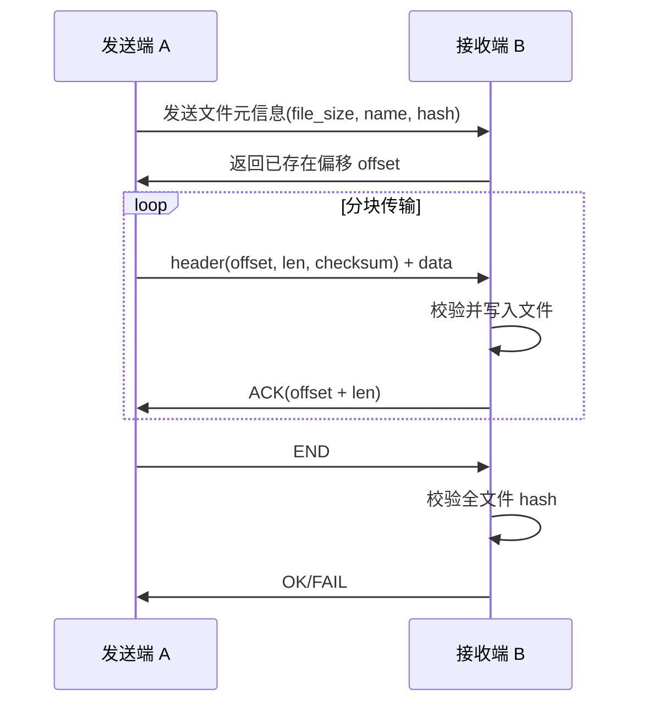
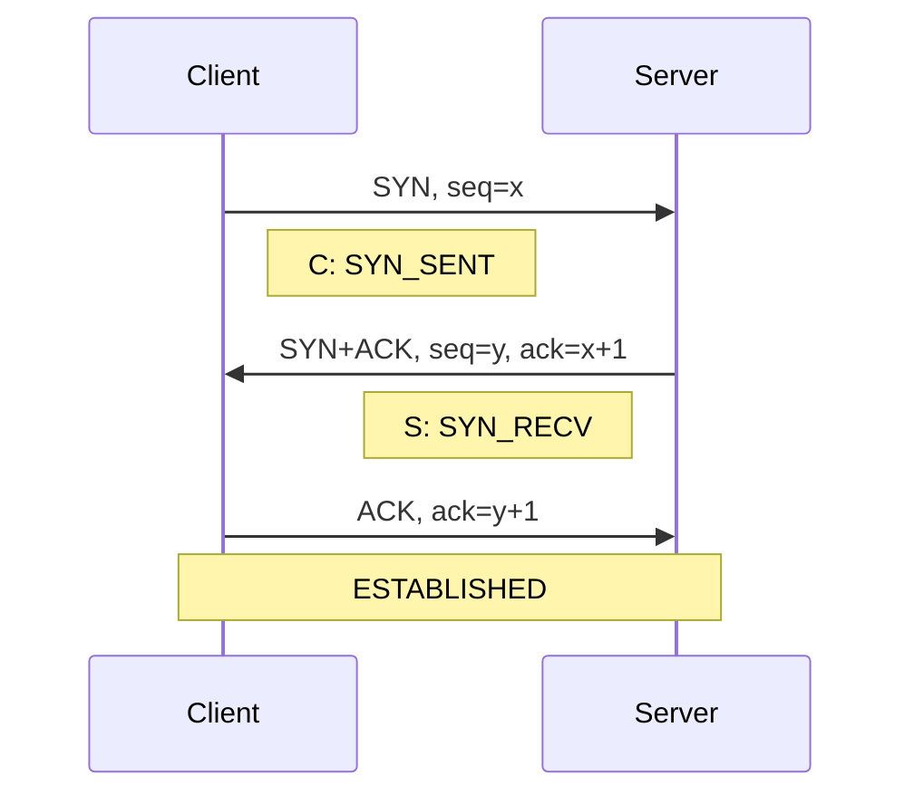
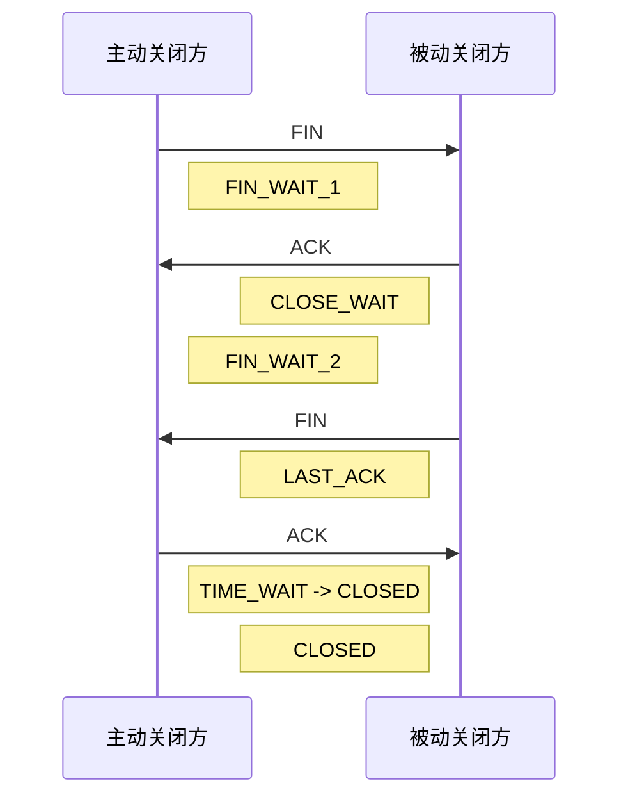
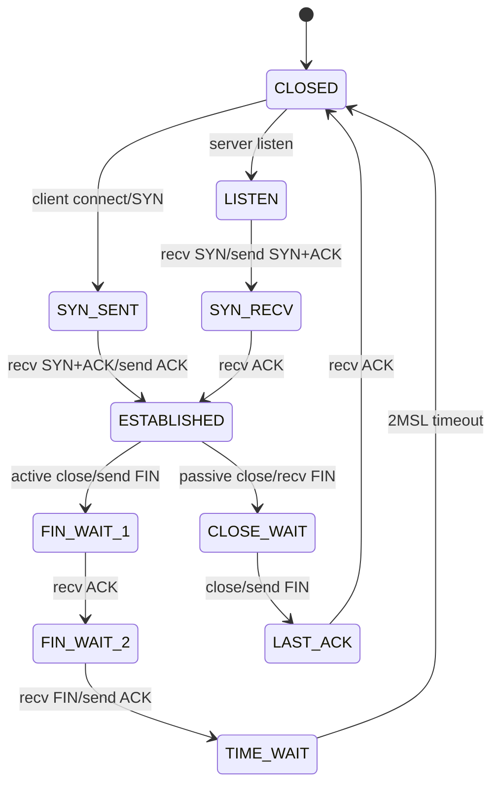
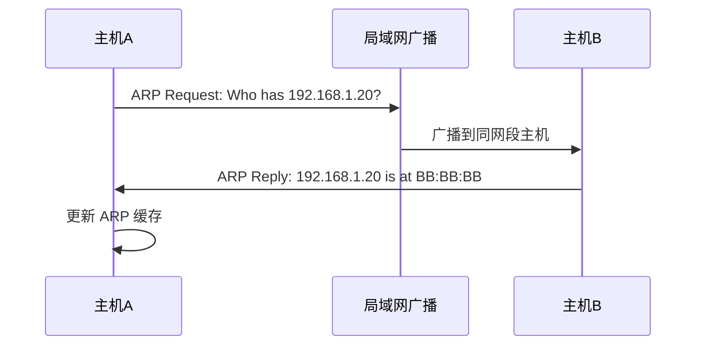
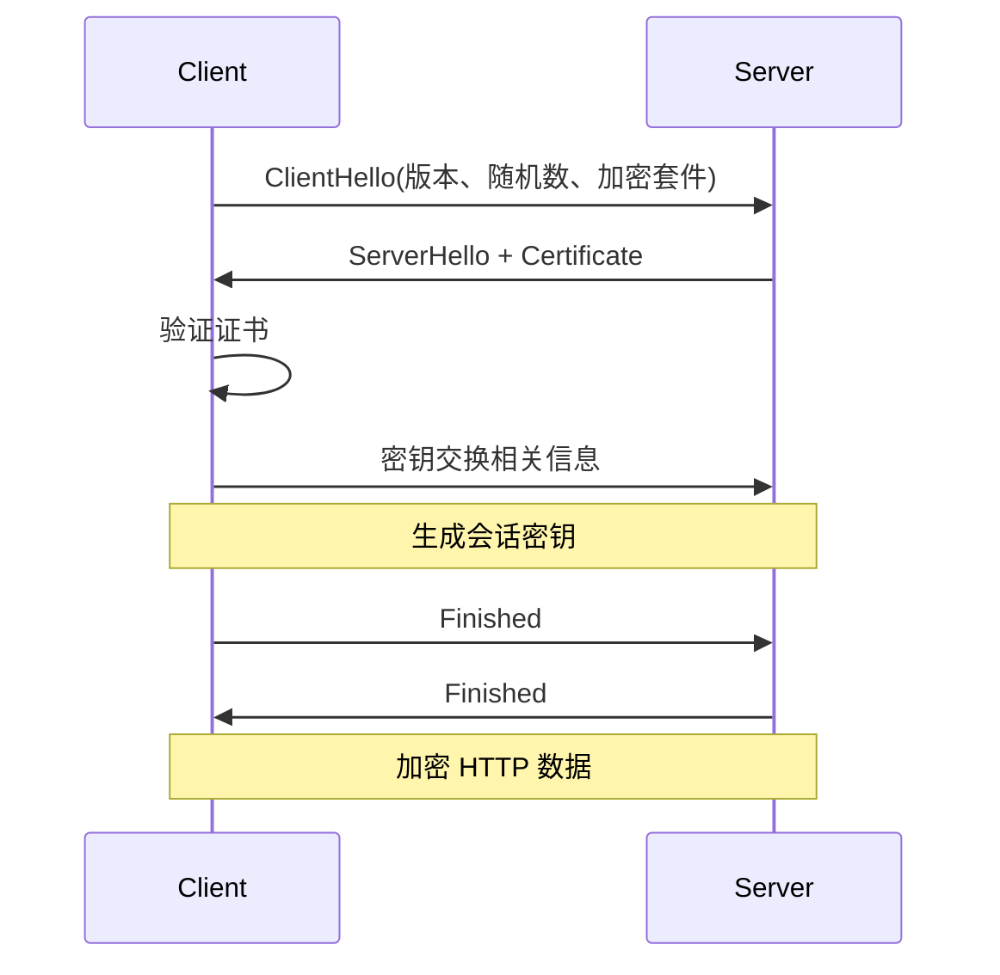

# 网络

## 网络模型、Socket 与 I/O 多路复用

### 1. 简述七层模型和四层模型。

#### 面试回答

OSI 七层模型从下到上是物理层、数据链路层、网络层、传输层、会话层、表示层、应用层。TCP/IP 四层模型通常是网络接口层、网络层、传输层、应用层，也有人把网络接口层拆成物理层和数据链路层，形成五层模型。面试中重点不是死记层数，而是知道每层解决什么问题：链路层解决同一链路内传输，网络层解决跨网络寻址和路由，传输层解决端到端进程通信，应用层定义具体业务协议。

#### OSI 七层模型

| 层级 | 名称 | 作用 | 常见协议/概念 |
| --- | --- | --- | --- |
| 7 | 应用层 | 面向用户应用，定义应用协议 | HTTP、DNS、FTP、SMTP、SSH |
| 6 | 表示层 | 数据格式、编码、压缩、加密 | TLS、JPEG、JSON 编码可类比理解 |
| 5 | 会话层 | 会话建立、维护、恢复 | RPC 会话、检查点等概念 |
| 4 | 传输层 | 端到端传输，区分进程 | TCP、UDP、端口 |
| 3 | 网络层 | 跨网络寻址和路由 | IP、ICMP、路由 |
| 2 | 数据链路层 | 同一链路内帧传输 | Ethernet、MAC、ARP、VLAN |
| 1 | 物理层 | 比特在介质上传输 | 网线、光纤、无线电信号 |

#### TCP/IP 四层模型

| TCP/IP 层 | 对应 OSI | 作用 | 典型协议 |
| --- | --- | --- | --- |
| 应用层 | 应用层、表示层、会话层 | 具体应用协议 | HTTP、DNS、SSH、SMTP |
| 传输层 | 传输层 | 端到端进程通信 | TCP、UDP |
| 网络层 | 网络层 | IP 寻址、路由转发 | IP、ICMP |
| 网络接口层 | 数据链路层、物理层 | 局域网传输和物理传输 | Ethernet、Wi-Fi、ARP |

#### 数据封装过程

发送数据时，应用层数据逐层向下封装：

```text
应用数据
  -> TCP/UDP 头 + 应用数据            段 segment / 数据报 datagram
  -> IP 头 + TCP/UDP 头 + 应用数据    包 packet
  -> Ethernet 头尾 + IP 包            帧 frame
  -> 物理比特流
```

接收时反向解封装。每层只关心本层头部，向上交付净荷。

#### 常见追问

- **ARP 属于哪一层？**  
  ARP 用 IP 查 MAC，工作在网络层和数据链路层之间。面试中说“常归到链路层或网络接口层”更严谨。

- **TLS 属于哪一层？**  
  严格 OSI 可放表示层，实际 TCP/IP 中通常认为位于应用层和传输层之间，服务于 HTTPS 等应用协议。

> [!TIP]
> 面试时可以用一句话收尾：四层模型是互联网工程实践中的常用划分，七层模型更适合解释概念和定位问题。

### 2. 从输入 URL 到显示页面的全过程。

#### 面试回答

浏览器输入 URL 后，会先解析 URL，检查浏览器缓存和 HSTS 等策略；如果需要访问网络，会进行 DNS 解析得到服务器 IP，然后建立 TCP 连接，HTTPS 还要进行 TLS 握手。连接建立后浏览器发送 HTTP 请求，服务器处理请求并返回响应。浏览器收到 HTML 后解析 DOM，加载 CSS、JS、图片等资源，构建 DOM 树和 CSSOM，生成渲染树，经过布局、绘制、合成后显示页面。过程中还可能涉及代理、CDN、重定向、HTTP 缓存、连接复用和服务端负载均衡。

#### 详细流程

1. 解析 URL。
   - 协议：`http` 或 `https`。
   - 主机名：如 `www.example.com`。
   - 端口：HTTP 默认 80，HTTPS 默认 443。
   - 路径、查询参数、fragment。

2. 检查本地策略和缓存。
   - 是否命中强缓存：`Cache-Control`、`Expires`。
   - 是否需要协商缓存：`ETag/If-None-Match`、`Last-Modified/If-Modified-Since`。
   - HTTPS 站点是否命中 HSTS，强制改用 HTTPS。

3. DNS 解析。
   - 浏览器 DNS 缓存。
   - 操作系统 DNS 缓存。
   - hosts 文件。
   - 本地 DNS 服务器。
   - 递归/迭代查询根域、顶级域、权威 DNS。
   - 可能返回 CDN 就近节点 IP。

4. 建立传输连接。
   - TCP 三次握手。
   - HTTPS 还要 TLS 握手：协商 TLS 版本、加密套件、验证证书、生成会话密钥。
   - HTTP/2 可在一个 TCP/TLS 连接上多路复用多个请求。
   - HTTP/3 使用 QUIC，底层基于 UDP。

5. 发送 HTTP 请求。

```http
GET /index.html HTTP/1.1
Host: www.example.com
User-Agent: ...
Accept: text/html
Connection: keep-alive
```

6. 服务端处理。
   - Web Server 接收连接，如 Nginx。
   - 反向代理到应用服务。
   - 业务处理、读缓存、查数据库、访问对象存储。
   - 返回状态码、响应头、响应体。

7. 浏览器渲染。
   - 解析 HTML 构建 DOM。
   - 解析 CSS 构建 CSSOM。
   - DOM + CSSOM 生成渲染树。
   - Layout 计算盒模型位置和尺寸。
   - Paint 绘制。
   - Composite 合成图层并显示。
   - JS 可能阻塞 HTML 解析，CSS 可能阻塞渲染。

#### 常见状态码

| 状态码 | 含义 |
| --- | --- |
| 200 | 请求成功 |
| 301/302 | 重定向 |
| 304 | 协商缓存命中 |
| 400 | 请求格式错误 |
| 401/403 | 未认证/无权限 |
| 404 | 资源不存在 |
| 500 | 服务端内部错误 |
| 502/504 | 网关错误/网关超时 |

#### 常见追问

- **DNS 查询一定会发生吗？**  
  不一定。IP 直连、DNS 缓存命中、浏览器预解析都可能避免实时 DNS 查询。

- **HTTPS 比 HTTP 多什么？**  
  多 TLS 握手、证书校验、密钥协商和加密传输。

### 3. 简述 socket 编程流程。

#### 面试回答

TCP 服务端通常依次调用 `socket`、`bind`、`listen`、`accept`，然后对已连接套接字 `read/write` 或 `recv/send`，最后 `close`。TCP 客户端调用 `socket`、`connect`，连接成功后收发数据。UDP 是无连接协议，通常 `socket` 后服务端 `bind` 端口，使用 `sendto/recvfrom` 收发报文。

#### TCP 服务端流程

```text
socket()
  -> setsockopt(SO_REUSEADDR)
  -> bind()
  -> listen()
  -> accept()
  -> recv()/send()
  -> close()
```

示例代码：

```cpp
#include <arpa/inet.h>
#include <netinet/in.h>
#include <sys/socket.h>
#include <unistd.h>

#include <cstring>
#include <iostream>

int main() {
    int listen_fd = socket(AF_INET, SOCK_STREAM, 0);
    if (listen_fd < 0) return 1;

    int opt = 1;
    setsockopt(listen_fd, SOL_SOCKET, SO_REUSEADDR, &opt, sizeof(opt));

    sockaddr_in addr{};
    addr.sin_family = AF_INET;
    addr.sin_addr.s_addr = htonl(INADDR_ANY);
    addr.sin_port = htons(8080);

    if (bind(listen_fd, reinterpret_cast<sockaddr*>(&addr), sizeof(addr)) < 0) return 1;
    if (listen(listen_fd, SOMAXCONN) < 0) return 1;

    int conn_fd = accept(listen_fd, nullptr, nullptr);
    if (conn_fd >= 0) {
        char buf[1024];
        ssize_t n = recv(conn_fd, buf, sizeof(buf), 0);
        if (n > 0) send(conn_fd, buf, static_cast<size_t>(n), 0);
        close(conn_fd);
    }
    close(listen_fd);
}
```

#### TCP 客户端流程

```text
socket()
  -> connect()
  -> send()/recv()
  -> close()
```

#### UDP 流程

UDP 服务端：

```text
socket(AF_INET, SOCK_DGRAM)
  -> bind()
  -> recvfrom()/sendto()
  -> close()
```

UDP 客户端可不显式 `bind`，系统会自动分配临时端口。

#### 关键参数

| 参数/函数 | 说明 |
| --- | --- |
| `AF_INET` | IPv4 |
| `AF_INET6` | IPv6 |
| `SOCK_STREAM` | TCP 字节流 |
| `SOCK_DGRAM` | UDP 数据报 |
| `bind` | 绑定本地 IP 和端口 |
| `listen` | 把 socket 转为监听状态 |
| `accept` | 从全连接队列取出已完成握手连接 |
| `connect` | 客户端发起连接 |

#### 常见追问

- **`listen` 的 backlog 是什么？**  
  它影响已完成连接队列的长度上限。Linux 中半连接队列和全连接队列还受内核参数影响。

- **`close` 和 `shutdown` 区别？**  
  `close` 关闭文件描述符，引用计数为 0 时触发 TCP 关闭；`shutdown` 可单独关闭读方向、写方向或双向通信。

### 4. `write` 阻塞的原因有哪些？

#### 面试回答

对于阻塞 socket，`write/send` 阻塞最常见原因是内核发送缓冲区没有足够空间。发送缓冲区满通常是因为对端接收慢、对端应用不读、TCP 接收窗口变小或为 0、网络拥塞、链路带宽不足等。对于文件写入，`write` 也可能因为脏页过多、磁盘 I/O 压力、同步写入、文件系统阻塞而变慢或阻塞。

#### socket 写阻塞原因

1. 发送缓冲区满。
   - 用户态调用 `send`，数据需要先复制到内核 socket send buffer。
   - 如果 buffer 空间不足，阻塞 socket 会睡眠等待空间。

2. 对端接收窗口太小。
   - TCP 流量控制由接收方通告窗口 `rwnd`。
   - 对端应用不及时 `read`，接收缓冲区满，窗口可能变成 0。

3. 网络拥塞。
   - 拥塞窗口 `cwnd` 变小。
   - 丢包、重传、RTO 退避导致可发送数据减少。

4. 对端异常。
   - 对端关闭可能导致 `send` 返回错误或触发 `SIGPIPE`。
   - 半关闭、RST、网络断开都需要处理。

5. 应用发送太快。
   - 生产速度大于网络发送能力。
   - 常见于大文件传输、日志推送、消息广播。

#### 文件写阻塞原因

| 原因 | 说明 |
| --- | --- |
| 脏页太多 | 内核需要回写磁盘，写调用可能被限速 |
| 同步写 | `O_SYNC`、`fsync` 要等待落盘 |
| 磁盘繁忙 | I/O 队列拥堵 |
| 网络文件系统 | NFS 等可能受网络影响 |

#### 解决思路

- 设置非阻塞：`fcntl(fd, F_SETFL, O_NONBLOCK)`。
- 用 `epoll` 监听 `EPOLLOUT`，可写时继续发送。
- 应用层维护发送队列和偏移。
- 设置发送超时：`SO_SNDTIMEO`。
- 做限流、背压和断开慢连接。
- 对大文件使用 `sendfile`、分块发送、零拷贝。

> [!CAUTION]
> 可写事件并不表示“一定能一次写完所有数据”，只表示当前有一定发送缓冲区空间，仍然要处理短写和 `EAGAIN`。

### 5. select、poll、epoll 的区别？epoll 底层如何实现？

#### 面试回答

`select`、`poll`、`epoll` 都是 I/O 多路复用机制，用一个线程同时监听多个 fd。`select` 使用固定大小的 fd 集合，每次调用都要从用户态拷贝到内核态，并线性扫描，fd 数量通常受 `FD_SETSIZE` 限制。`poll` 用数组描述 fd，突破了固定大小限制，但仍然每次拷贝和线性扫描。`epoll` 把关注的 fd 通过 `epoll_ctl` 注册到内核，事件就绪后放到就绪队列，`epoll_wait` 只返回就绪事件，适合大量连接、少量活跃的高并发场景。

#### 对比表

| 对比项 | select | poll | epoll |
| --- | --- | --- | --- |
| fd 集合 | 位图 `fd_set` | `pollfd` 数组 | 内核维护事件表 |
| 数量限制 | 通常受 `FD_SETSIZE` 限制 | 理论上无固定小上限 | 受系统资源限制 |
| 每次调用 | 重新传入集合 | 重新传入数组 | 注册一次，多次等待 |
| 就绪查找 | 线性扫描全部 fd | 线性扫描全部 fd | 返回就绪列表 |
| 复杂度 | O(n) | O(n) | 接近 O(ready) |
| 触发模式 | LT | LT | LT/ET |
| 跨平台 | 较好 | 较好 | Linux 特有 |

#### epoll 使用流程

```cpp
int epfd = epoll_create1(0);

epoll_event ev{};
ev.events = EPOLLIN;
ev.data.fd = listen_fd;
epoll_ctl(epfd, EPOLL_CTL_ADD, listen_fd, &ev);

epoll_event events[1024];
while (true) {
    int n = epoll_wait(epfd, events, 1024, -1);
    for (int i = 0; i < n; ++i) {
        if (events[i].data.fd == listen_fd) {
            // accept new connections
        } else if (events[i].events & EPOLLIN) {
            // read available data
        }
    }
}
```

#### epoll 底层实现

面试常见口径：

- `epoll_create` 创建一个 epoll 实例。
- `epoll_ctl` 把 fd 和事件注册到内核。
- 内核通常用红黑树或类似结构管理注册的 fd，便于增删改查。
- 当设备或 socket 状态就绪时，内核回调把对应事件加入就绪链表。
- `epoll_wait` 从就绪链表取事件并拷贝给用户态。

```text
用户态
  epoll_ctl ADD/MOD/DEL
      |
      v
内核 epoll 实例
  + 注册 fd 集合：红黑树/索引结构
  + 就绪事件队列：ready list
      ^
      |
socket 状态变化时回调加入 ready list
```

#### epoll 的优势和局限

优势：

- 避免每次重复传入全部 fd。
- 不需要线性扫描所有 fd。
- 支持边沿触发 ET。
- 适合 C10K/C100K 这类大量连接场景。

局限：

- Linux 专有。
- 活跃 fd 很多时优势变小。
- 编程复杂度高，必须正确处理非阻塞、短读短写、关闭事件。
- 不能把普通磁盘文件当作网络 socket 一样获得有意义的 readiness。

#### 常见追问

- **epoll 是异步 I/O 吗？**  
  不是严格意义上的异步 I/O。epoll 通知的是“就绪”，真正读写仍由应用线程调用 `read/write` 完成，所以属于同步 I/O 多路复用。

- **为什么 epoll 适合高并发？**  
  因为连接数很多但同时活跃的连接相对少时，`epoll_wait` 只返回就绪事件，减少无效扫描。

### 6. epoll 边沿触发具体实现方式。

#### 面试回答

epoll 边沿触发 ET 指 fd 状态从不可读变为可读、不可写变为可写时通知一次，而不是只要仍然可读可写就反复通知。使用 ET 必须把 fd 设置为非阻塞，并在收到可读事件后循环读取，直到 `read/recv` 返回 `-1` 且 `errno` 为 `EAGAIN` 或 `EWOULDBLOCK`；写事件也要循环写到发送队列为空或返回 `EAGAIN`。如果只读一部分数据就退出，剩余数据可能不会再次触发事件。

#### LT 与 ET 的触发差异

假设 socket 接收缓冲区已有 100 字节：

- LT：只要缓冲区还有数据，每次 `epoll_wait` 都可能返回可读。
- ET：只在数据从无到有、或新数据到达导致状态变化时通知；如果一次只读 10 字节，剩下 90 字节可能不会重复通知。

#### ET 正确读法

```cpp
void handle_read_et(int fd) {
    char buf[4096];
    while (true) {
        ssize_t n = recv(fd, buf, sizeof(buf), 0);
        if (n > 0) {
            // append buf[0..n) to application buffer and parse messages
        } else if (n == 0) {
            // peer closed
            close(fd);
            return;
        } else {
            if (errno == EINTR) {
                continue;
            }
            if (errno == EAGAIN || errno == EWOULDBLOCK) {
                break; // data drained
            }
            close(fd);
            return;
        }
    }
}
```

设置非阻塞：

```cpp
#include <fcntl.h>

void set_nonblock(int fd) {
    int flags = fcntl(fd, F_GETFL, 0);
    fcntl(fd, F_SETFL, flags | O_NONBLOCK);
}
```

注册 ET：

```cpp
epoll_event ev{};
ev.events = EPOLLIN | EPOLLET;
ev.data.fd = fd;
epoll_ctl(epfd, EPOLL_CTL_ADD, fd, &ev);
```

#### ET 写事件处理

写事件不能长期无脑关注，否则 fd 大多数时候都可写，会造成事件风暴。常见做法：

1. 平时只监听 `EPOLLIN`。
2. 发送时先直接 `send`。
3. 如果没发完，把剩余数据放入输出缓冲区。
4. `epoll_ctl MOD` 增加 `EPOLLOUT`。
5. 可写时继续发送。
6. 发送队列为空后取消 `EPOLLOUT`。

#### 常见错误

- ET 模式使用阻塞 fd，可能把事件循环卡死。
- 收到事件后只读一次，没有读到 `EAGAIN`。
- 忽略 `EINTR`。
- 没有处理 `EPOLLHUP`、`EPOLLERR`、`EPOLLRDHUP`。
- 发送队列为空仍监听 `EPOLLOUT`。

### 7. LT 和 ET 的区别、应用场景？

#### 面试回答

LT 是水平触发，fd 只要处于可读或可写状态，`epoll_wait` 就会持续返回事件，编程简单、不容易漏事件，是 epoll 默认模式。ET 是边沿触发，只有状态发生变化时通知一次，事件数量少，适合高性能网络服务，但要求 fd 非阻塞并且读写到 `EAGAIN`。一般业务服务优先用 LT；追求极致性能、代码框架成熟、能正确处理缓冲区时使用 ET。

#### 对比表

| 对比项 | LT 水平触发 | ET 边沿触发 |
| --- | --- | --- |
| 通知条件 | 只要仍可读/写就通知 | 状态变化时通知 |
| 是否默认 | epoll 默认 | 需要 `EPOLLET` |
| 是否必须非阻塞 | 不强制，但建议 | 必须 |
| 编程难度 | 低 | 高 |
| 漏事件风险 | 低 | 高 |
| 事件数量 | 可能较多 | 较少 |

#### 应用场景

LT 适合：

- 普通业务服务器。
- 初学或代码路径复杂的网络程序。
- 更重视正确性和维护性。
- 活跃连接数不极端。

ET 适合：

- 高并发网络框架。
- 连接多、事件频繁，希望减少重复通知。
- 已有完善的非阻塞读写缓冲区。
- 熟悉短读、短写、半关闭和错误处理。

> [!IMPORTANT]
> ET 的性能优势来自减少重复通知，不是因为一次系统调用能读更多数据。真正关键仍然是非阻塞循环读写、批处理和减少系统调用。

### 8. 说说同步、异步、阻塞、非阻塞。

#### 面试回答

同步和异步关注“结果由谁来完成、如何通知”：同步是调用方发起操作后自己等待或轮询结果；异步是调用方提交操作后立即返回，完成后由系统通过回调、事件、信号或完成队列通知。阻塞和非阻塞关注“调用时线程是否被挂起”：阻塞调用在条件不满足时睡眠等待，非阻塞调用立即返回，可能返回 `EAGAIN`。epoll 是同步 I/O 多路复用，因为它只通知 fd 就绪，真正读写仍由应用线程同步调用。

#### 四个概念的维度

| 概念 | 关注点 | 例子 |
| --- | --- | --- |
| 阻塞 | 调用线程是否睡眠 | 阻塞 `read` 等到数据到来 |
| 非阻塞 | 条件不满足是否立即返回 | 非阻塞 `recv` 返回 `EAGAIN` |
| 同步 | I/O 操作是否由调用线程完成 | `read`、`recv`、epoll 后自己读 |
| 异步 | I/O 完成后通知调用方 | IOCP、Linux AIO、io_uring 某些模式 |

#### 常见组合

| 模型 | 描述 | 示例 |
| --- | --- | --- |
| 同步阻塞 | 调用后线程睡眠直到完成 | 阻塞 socket `recv` |
| 同步非阻塞 | 调用立即返回，应用轮询/等待就绪后再读写 | non-blocking socket + epoll |
| I/O 多路复用 | 一个线程等待多个 fd 就绪 | select/poll/epoll |
| 异步 I/O | 提交 I/O，内核完成后通知 | Windows IOCP、Linux io_uring |

#### 五种 I/O 模型

1. 阻塞 I/O：用户线程阻塞等待数据准备和数据拷贝。
2. 非阻塞 I/O：用户线程不断尝试，数据未准备好立即返回。
3. I/O 多路复用：阻塞在 `select/poll/epoll_wait`，某个 fd 就绪后再读写。
4. 信号驱动 I/O：内核通过信号通知 fd 就绪。
5. 异步 I/O：内核完成整个 I/O 操作后通知用户。

> [!CAUTION]
> “非阻塞”不等于“异步”。非阻塞只是调用立即返回；异步强调 I/O 操作本身由内核或系统异步完成。

### 9. 调用 `send` 函数发送数据不全怎么办？

#### 面试回答

TCP 是字节流协议，`send` 返回值只表示本次成功写入内核发送缓冲区的字节数，可能小于请求发送的长度。处理方式是应用层维护发送缓冲区和当前偏移，循环发送直到全部完成；非阻塞 socket 遇到 `EAGAIN/EWOULDBLOCK` 时停止发送，等待 `EPOLLOUT` 可写事件后继续。还要处理 `EINTR`、`SIGPIPE`、对端关闭、短写和应用层消息边界。

#### 为什么会发送不全

- socket 是非阻塞，发送缓冲区空间不够。
- 阻塞 socket 被信号中断。
- 发送数据量大于当前可用 buffer。
- 对端接收慢，TCP 窗口缩小。
- 网络拥塞导致发送能力下降。

#### 阻塞模式循环发送

```cpp
#include <cerrno>
#include <cstddef>
#include <sys/socket.h>
#include <unistd.h>

bool send_all(int fd, const char* data, size_t len) {
    size_t sent = 0;
    while (sent < len) {
        ssize_t n = send(fd, data + sent, len - sent, MSG_NOSIGNAL);
        if (n > 0) {
            sent += static_cast<size_t>(n);
        } else if (n < 0 && errno == EINTR) {
            continue;
        } else {
            return false;
        }
    }
    return true;
}
```

#### 非阻塞模式处理

```cpp
enum class SendResult { Done, NeedWait, Error };

SendResult try_send(int fd, std::string& out, size_t& offset) {
    while (offset < out.size()) {
        ssize_t n = send(fd, out.data() + offset, out.size() - offset, MSG_NOSIGNAL);
        if (n > 0) {
            offset += static_cast<size_t>(n);
        } else if (n < 0 && errno == EINTR) {
            continue;
        } else if (n < 0 && (errno == EAGAIN || errno == EWOULDBLOCK)) {
            return SendResult::NeedWait;
        } else {
            return SendResult::Error;
        }
    }
    return SendResult::Done;
}
```

#### 还要注意消息边界

即使 `send_all` 把一条消息全部放进内核缓冲区，对端也不一定一次 `recv` 得到完整消息。TCP 没有应用层边界，接收端仍需要根据协议解析。

#### 常见追问

- **`send` 成功是否表示对端收到了？**  
  不是。只表示数据进入本机内核发送缓冲区。对端是否收到、应用是否处理，需要 TCP ACK 和应用层协议确认。

- **如何避免 `SIGPIPE`？**  
  Linux 可使用 `send(..., MSG_NOSIGNAL)`，或忽略 `SIGPIPE`，并处理 `EPIPE` 错误。

### 10. 1G 文件从 A 机器发送到 B 机器，怎么发？

#### 面试回答

工程上要把 1G 文件按块传输，协议中携带文件名、文件大小、偏移、分块长度、校验信息和结束标记。发送端循环读取文件并处理 `send` 短写，接收端按协议解析后写入文件，支持断点续传和哈希校验。性能方面可以使用大缓冲、连接复用、`sendfile` 零拷贝、并行分块、压缩可压缩数据和合理的 TCP 参数；可靠性方面要处理断线重连、重复块、乱序块、磁盘不足和完整性校验。

#### 基本协议设计

一个简单文件传输协议可以包含：

| 字段 | 说明 |
| --- | --- |
| magic/version | 协议标识和版本 |
| file_name_len | 文件名长度 |
| file_name | 文件名 |
| file_size | 总大小 |
| offset | 当前块偏移 |
| chunk_len | 当前块长度 |
| checksum | 当前块或全文件校验 |
| payload | 文件数据 |

#### 传输流程



#### 普通 read + send 实现要点

```cpp
bool send_file(int sock, int file_fd) {
    char buf[1 << 20]; // 1 MiB
    while (true) {
        ssize_t n = read(file_fd, buf, sizeof(buf));
        if (n > 0) {
            size_t off = 0;
            while (off < static_cast<size_t>(n)) {
                ssize_t m = send(sock, buf + off, static_cast<size_t>(n) - off, MSG_NOSIGNAL);
                if (m > 0) off += static_cast<size_t>(m);
                else if (m < 0 && errno == EINTR) continue;
                else if (m < 0 && (errno == EAGAIN || errno == EWOULDBLOCK)) {
                    // wait for writable and continue
                } else {
                    return false;
                }
            }
        } else if (n == 0) {
            return true;
        } else if (errno == EINTR) {
            continue;
        } else {
            return false;
        }
    }
}
```

#### 零拷贝方案

Linux 下文件到 socket 可用 `sendfile`：

```cpp
#include <sys/sendfile.h>

off_t offset = 0;
while (offset < file_size) {
    ssize_t n = sendfile(sock, file_fd, &offset, file_size - offset);
    if (n > 0) continue;
    if (n < 0 && errno == EINTR) continue;
    if (n < 0 && (errno == EAGAIN || errno == EWOULDBLOCK)) {
        // wait EPOLLOUT
        continue;
    }
    break;
}
```

`sendfile` 减少用户态和内核态之间的数据拷贝，适合静态文件传输。

#### 断点续传

1. 接收端保存临时文件和已完成偏移。
2. 断线后发送端重新连接，询问接收端已接收长度。
3. 发送端 `lseek` 到偏移继续发送。
4. 每块校验，最后全文件校验。

#### 性能优化

- 增大 socket buffer：`SO_SNDBUF`、`SO_RCVBUF`。
- 使用 `sendfile` 或 `mmap` 减少拷贝。
- 批量读写，避免小包。
- 可压缩内容先压缩，已压缩文件不要重复压缩。
- 多连接分块传输，但要注意公平性和服务端压力。
- 跨地域传输可用 CDN、对象存储、多节点。

### 11. 什么是 TCP 的粘包问题？怎么解决？

#### 面试回答

TCP 是面向字节流的协议，不保留应用层消息边界。发送端多次 `send` 的数据，接收端可能一次 `recv` 全部读到；发送端一次 `send` 的数据，接收端也可能分多次读到。应用层如果按“一次 recv 就是一条消息”处理，就会出现所谓粘包和拆包问题。解决方法是在应用层设计明确的消息边界，例如固定长度、分隔符、长度字段、TLV、HTTP chunk 等。

#### 为什么 TCP 会粘包/拆包

- TCP 只保证字节流有序可靠，不保证消息边界。
- Nagle 算法可能把小包合并发送。
- TCP 分段、MSS、路径 MTU 会拆分数据。
- 接收端缓冲区和应用读取大小不固定。
- 发送端多次写入可能在内核缓冲区中连续排列。

#### UDP 有没有粘包

UDP 是面向数据报的协议，一次 `sendto` 对应一个 UDP datagram，接收端一次 `recvfrom` 读取一个报文。如果用户缓冲区太小，UDP 报文会被截断，不会像 TCP 一样形成连续字节流。因此通常说 UDP 没有 TCP 意义上的粘包问题。

#### 解决方案

| 方案 | 做法 | 优点 | 缺点 |
| --- | --- | --- | --- |
| 固定长度 | 每条消息固定 N 字节 | 简单 | 浪费空间，不灵活 |
| 分隔符 | 用 `\n`、`\r\n` 等分隔 | 适合文本协议 | 内容需转义 |
| 长度字段 | 头部携带 body 长度 | 通用高效 | 需要处理半包 |
| TLV | Type-Length-Value | 可扩展 | 协议稍复杂 |
| HTTP chunk | 分块传输编码 | 标准化 | 适合 HTTP 场景 |

#### 长度字段协议示例

```text
+----------------+------------------+
| uint32 length  | payload bytes    |
+----------------+------------------+
```

解析思路：

```cpp
void on_data(std::string& inbuf, const char* data, size_t n) {
    inbuf.append(data, n);
    while (inbuf.size() >= 4) {
        uint32_t net_len;
        std::memcpy(&net_len, inbuf.data(), 4);
        uint32_t len = ntohl(net_len);
        if (inbuf.size() < 4 + len) break;

        std::string msg = inbuf.substr(4, len);
        // handle msg
        inbuf.erase(0, 4 + len);
    }
}
```

> [!CAUTION]
> 粘包不是 TCP 的错误，而是应用层协议没有定义边界。正确说法是“TCP 字节流需要应用层自己做拆包”。

## TCP/IP 与应用协议

### 12. TCP 和 UDP 的区别？

#### 面试回答

TCP 是面向连接、可靠、有序、面向字节流的传输协议，提供确认应答、超时重传、流量控制和拥塞控制，适合文件传输、HTTP、数据库连接等要求可靠性的场景。UDP 是无连接、不保证可靠、不保证顺序、面向数据报的协议，头部开销小、延迟低，适合 DNS、实时音视频、游戏、QUIC 等场景。UDP 不可靠不代表不能可靠，应用层可以基于 UDP 自己实现重传、排序、拥塞控制。

#### 对比表

| 对比项 | TCP | UDP |
| --- | --- | --- |
| 连接 | 面向连接 | 无连接 |
| 可靠性 | 可靠传输 | 尽力而为 |
| 顺序 | 保证有序 | 不保证 |
| 数据边界 | 字节流，无边界 | 数据报，有边界 |
| 头部 | 至少 20 字节 | 8 字节 |
| 控制机制 | 重传、流控、拥塞控制 | 协议本身没有 |
| 速度/延迟 | 开销较大 | 开销小、延迟低 |
| 广播/组播 | 不支持广播 | 支持广播/组播 |
| 典型应用 | HTTP、SSH、FTP | DNS、DHCP、音视频、QUIC |

#### TCP 为什么可靠

- 序列号：标识字节流位置。
- ACK：确认接收。
- 超时重传：丢包后重发。
- 快速重传：重复 ACK 触发重传。
- 滑动窗口：控制未确认数据量。
- 校验和：检测传输错误。
- 有序交付：乱序包会缓存重排。

#### UDP 适合什么

- 对延迟敏感，允许少量丢包：实时音视频、语音通话。
- 一问一答短请求：DNS。
- 应用层自定义可靠性：QUIC、游戏状态同步。
- 广播、组播。

### 13. TCP 三次握手建立连接的过程和双方状态。

#### 面试回答

TCP 三次握手用于建立连接、确认双方收发能力、同步初始序列号并协商 TCP 选项。第一次客户端发送 SYN，进入 `SYN_SENT`；第二次服务端收到 SYN 后回复 SYN+ACK，进入 `SYN_RECV`；第三次客户端收到后发送 ACK，客户端进入 `ESTABLISHED`，服务端收到 ACK 后也进入 `ESTABLISHED`。

#### 过程图



#### 每次握手的意义

1. 第一次：客户端告诉服务端“我要建立连接”，并发送客户端初始序列号 `ISN = x`。
2. 第二次：服务端确认收到客户端 SYN，同时发送自己的 `ISN = y`。
3. 第三次：客户端确认收到服务端 SYN，让服务端知道客户端接收能力正常。

#### TCP 选项协商

握手中还可能协商：

- MSS：最大报文段大小。
- Window Scale：窗口扩大因子。
- SACK Permitted：选择性确认。
- Timestamp：时间戳，用于 RTT 估计和 PAWS。

#### 常见追问

- **为什么不是两次握手？**  
  两次握手无法让服务端确认客户端收到了服务端的 SYN，也容易因历史重复 SYN 建立错误连接。

- **为什么不是四次？**  
  第三次 ACK 已经能完成双方收发能力确认和序列号同步，第四次没有必要。

### 14. TCP 四次挥手过程和双方状态。

#### 面试回答

TCP 是全双工连接，两个方向需要分别关闭，所以通常需要四次挥手。主动关闭方发送 FIN 后进入 `FIN_WAIT_1`，被动关闭方回复 ACK 后进入 `CLOSE_WAIT`，主动方收到 ACK 后进入 `FIN_WAIT_2`。当被动方应用也关闭连接时发送 FIN，进入 `LAST_ACK`；主动方收到 FIN 后回复 ACK，进入 `TIME_WAIT`，等待 2MSL 后关闭；被动方收到 ACK 后进入 `CLOSED`。

#### 过程图



#### 为什么通常是四次

收到 FIN 表示对方不再发送数据，但自己可能还有数据要发送，所以 ACK 和自己的 FIN 往往不能合并。只有被动方也正好没有数据要发并立即关闭时，第二次 ACK 和第三次 FIN 可能合并，表现为三次报文。

#### `CLOSE_WAIT` 过多说明什么

`CLOSE_WAIT` 在被动关闭方出现，表示对端已经关闭写方向，本端也 ACK 了，但本端应用迟迟没有调用 `close`。大量 `CLOSE_WAIT` 通常是程序 bug，例如连接未释放、线程卡住、忘记关闭 fd。

#### `TIME_WAIT` 在谁身上

主动关闭连接的一方进入 `TIME_WAIT`。客户端主动关闭时客户端进入；服务端主动关闭短连接时服务端也会进入。

### 15. 简述 TCP 的超时机制。

#### 面试回答

TCP 通过 RTT 估算重传超时时间 RTO。发送数据后，如果在 RTO 内没有收到对应 ACK，就认为报文或 ACK 可能丢失并重传，同时通常进行指数退避。TCP 还支持快速重传：当发送方收到多个重复 ACK 时，可以不等超时直接重传疑似丢失的报文。超时会被视为严重拥塞信号，拥塞窗口通常会大幅下降。

#### RTT 和 RTO

- RTT：一个报文从发出到收到 ACK 的往返时间。
- SRTT：平滑 RTT，避免瞬时波动。
- RTTVAR：RTT 偏差估计。
- RTO：重传超时时间，会根据 RTT 动态计算。

RTO 不能太小，否则会误重传；也不能太大，否则丢包恢复慢。

#### 超时重传过程

```text
发送 segment(seq=100)
  -> 启动重传定时器
  -> RTO 内收到 ACK：取消定时器
  -> RTO 到期未收到 ACK：重传 segment，RTO 退避
```

#### 快速重传

如果接收方收到乱序包，会重复确认期望的下一个序列号。发送方收到多个重复 ACK，说明中间某段可能丢了，可以快速重传，而不用等 RTO。

```text
发送：1 2 3 4 5
丢失：3
接收方收到 4、5 时重复 ACK=3
发送方收到多个 ACK=3 后快速重传 3
```

#### 与拥塞控制的关系

超时通常意味着网络拥塞更严重，TCP 会降低拥塞窗口。快速重传/快速恢复则认为网络仍有一定传输能力，降窗相对温和。

#### 常见追问

- **TCP keepalive 是超时重传吗？**  
  不是。keepalive 用于检测长时间空闲连接是否仍可用；重传超时用于保证已发送数据可靠到达。

### 16. TCP 通信过程的状态如何变化？

#### 面试回答

TCP 状态机描述连接从创建、建立、传输到关闭的全过程。服务端通常从 `CLOSED` 到 `LISTEN`，收到 SYN 后进入 `SYN_RECV`，握手完成进入 `ESTABLISHED`。客户端主动连接时从 `CLOSED` 到 `SYN_SENT`，收到 SYN+ACK 并回复 ACK 后进入 `ESTABLISHED`。关闭时主动方经历 `FIN_WAIT_1`、`FIN_WAIT_2`、`TIME_WAIT`，被动方经历 `CLOSE_WAIT`、`LAST_ACK`。

#### 常见状态含义

| 状态 | 含义 |
| --- | --- |
| `CLOSED` | 无连接 |
| `LISTEN` | 服务端监听连接 |
| `SYN_SENT` | 客户端已发送 SYN |
| `SYN_RECV` | 服务端收到 SYN 并回复 SYN+ACK |
| `ESTABLISHED` | 连接已建立 |
| `FIN_WAIT_1` | 主动方已发送 FIN，等待 ACK |
| `FIN_WAIT_2` | 主动方 FIN 已被确认，等待对端 FIN |
| `CLOSE_WAIT` | 被动方收到 FIN，等待应用关闭 |
| `LAST_ACK` | 被动方已发送 FIN，等待最后 ACK |
| `TIME_WAIT` | 主动方等待 2MSL |
| `CLOSING` | 双方几乎同时关闭 |

#### 状态转换图



#### 排查状态的命令

```bash
ss -ant
ss -ant state time-wait
ss -ant state close-wait
ss -lntp
```

#### 常见追问

- **大量 `SYN_RECV` 说明什么？**  
  可能是 SYN flood、服务端 accept 不及时或半连接队列压力大。

- **大量 `FIN_WAIT_2` 说明什么？**  
  主动方 FIN 被 ACK，但对端迟迟不发 FIN，可能是对端应用不关闭。

### 17. 三次握手的真实目的是什么？

#### 面试回答

三次握手的真实目的不是简单“打招呼”，而是确认双方的发送和接收能力、同步双方初始序列号、建立连接状态，并防止历史重复连接请求造成错误连接。第一次 SYN 让服务端知道客户端能发送；第二次 SYN+ACK 让客户端知道服务端能接收也能发送；第三次 ACK 让服务端知道客户端能接收。握手还会协商 MSS、窗口扩大、SACK、时间戳等 TCP 选项。

#### 从能力确认角度

| 报文 | 确认了什么 |
| --- | --- |
| C -> S: SYN | 服务端知道客户端发送能力正常 |
| S -> C: SYN+ACK | 客户端知道自己发送/接收正常，服务端接收/发送正常 |
| C -> S: ACK | 服务端知道客户端接收能力正常 |

#### 从序列号角度

TCP 是可靠字节流，每个方向都需要初始序列号 ISN：

- 客户端通过 SYN 告诉服务端自己的 ISN。
- 服务端通过 SYN 告诉客户端自己的 ISN。
- ACK 确认对方 ISN，后续数据按序列号确认和重排。

#### 防止历史 SYN

如果网络中残留了一个旧 SYN，两次握手可能让服务端误以为新连接成立。三次握手中客户端收到服务端响应后，如果发现不是自己当前想建立的连接，可以发送 RST 拒绝，避免历史报文建立错误连接。

#### 常见追问

- **第三次握手可以携带数据吗？**  
  协议上第三次 ACK 可以携带数据，但普通接口和实现中通常不这么依赖；TCP Fast Open 则允许在握手阶段携带数据。

### 18. 网络七层模型每一层的协议？

#### 面试回答

物理层负责比特传输，数据链路层负责同一链路内帧传输，网络层负责 IP 寻址和路由，传输层负责端到端进程通信，会话层、表示层、应用层在 TCP/IP 实践中常合并为应用层。常见协议中，Ethernet、PPP 属于链路层，IP、ICMP 属于网络层，TCP、UDP 属于传输层，HTTP、DNS、FTP、SMTP、SSH 属于应用层。ARP 处在 IP 和 MAC 之间，常被归入链路层或网络接口层。

#### 分层协议表

| OSI 层 | 常见协议/技术 |
| --- | --- |
| 应用层 | HTTP、HTTPS、DNS、FTP、SMTP、POP3、IMAP、SSH、Telnet、NTP、SNMP |
| 表示层 | TLS/SSL、数据编码、压缩、加密 |
| 会话层 | RPC 会话、NetBIOS Session Service 等 |
| 传输层 | TCP、UDP、SCTP |
| 网络层 | IPv4、IPv6、ICMP、IGMP、IPsec、路由协议相关概念 |
| 数据链路层 | Ethernet、PPP、ARP、VLAN、MAC、Wi-Fi MAC |
| 物理层 | 双绞线、光纤、无线、比特流 |

#### 常见协议说明

- ARP：根据 IP 查询 MAC，用于同一局域网通信。
- ICMP：网络控制消息，如 `ping` 使用 ICMP Echo。
- DNS：域名解析，通常 UDP 53，大响应或区域传输可用 TCP。
- HTTP：Web 应用层协议，基于 TCP；HTTP/3 基于 QUIC/UDP。
- TLS：为应用协议提供加密、认证和完整性保护。

#### 常见追问

- **ping 用 TCP 还是 UDP？**  
  常见 `ping` 使用 ICMP，不是 TCP/UDP。

- **DNS 一定是 UDP 吗？**  
  不一定。普通查询多用 UDP 53，但区域传输、大响应、DNS over TCP 等会用 TCP。

### 19. 为什么 TIME_WAIT 需要经过 2MSL 才能回到 CLOSE？

#### 面试回答

`TIME_WAIT` 等待 2MSL 主要有两个目的：第一，确保本连接中的旧报文在网络中自然消失，避免影响后续相同四元组的新连接；第二，保证最后一个 ACK 如果丢失，主动关闭方还能收到对端重发的 FIN 并再次发送 ACK。MSL 是报文在网络中的最大生存时间，2MSL 覆盖一个报文往返的最大时间。

#### 为什么是主动关闭方进入 TIME_WAIT

主动关闭方发送最后一个 ACK 后，并不知道对方是否收到。如果这个 ACK 丢失，被动方会重发 FIN。主动方保留 `TIME_WAIT` 状态，才能识别这个 FIN 并重发 ACK。

#### 2MSL 的两个作用

1. 可靠终止连接。
   - 最后 ACK 丢失时，对端会重发 FIN。
   - 主动方在 `TIME_WAIT` 内能再次 ACK。

2. 避免旧报文干扰新连接。
   - TCP 连接由四元组标识：源 IP、源端口、目的 IP、目的端口。
   - 等待旧报文消失后，相同四元组的新连接更安全。

#### TIME_WAIT 的代价

- 占用端口。
- 占用少量内核连接状态资源。
- 短连接高并发时可能造成临时端口耗尽。

#### 常见追问

- **能不能直接把 TIME_WAIT 调得很短？**  
  不建议粗暴缩短。应优先使用连接复用、连接池、keep-alive、调整端口范围等方式处理。

### 20. TCP 利用滑动窗口实现流量控制的机制？

#### 面试回答

TCP 通过滑动窗口限制发送方未确认数据量。接收方在 ACK 中通告自己的接收窗口 `rwnd`，表示还能接收多少数据；发送方根据 `rwnd` 控制发送，避免把接收方缓冲区打满。应用读取数据后接收缓冲区释放，接收窗口变大；如果接收缓冲区满，接收方可通告零窗口，发送方停止发送并进行窗口探测。流量控制解决接收方处理能力问题，拥塞控制解决网络承载能力问题。

#### 滑动窗口基本概念

发送方数据可分为四段：

```text
已发送且已确认 | 已发送未确认 | 可发送未发送 | 暂不可发送
               <------ 发送窗口 ------>
```

接收方通过 ACK 携带窗口大小：

```text
ACK = 下一个期望收到的字节序号
Window = 当前接收缓冲区剩余空间
```

#### 流量控制过程

1. 接收方分配接收缓冲区。
2. 发送方发送数据。
3. 接收方收到数据后放入缓冲区并 ACK。
4. ACK 中通告剩余窗口。
5. 发送方未确认数据量不能超过窗口。
6. 应用读取缓冲区后，窗口变大。

#### 零窗口和窗口探测

当接收窗口为 0：

- 发送方停止发送普通数据。
- 启动 persist timer。
- 定期发送窗口探测报文，询问窗口是否打开。
- 防止窗口更新 ACK 丢失后双方永久等待。

#### 与拥塞控制区别

| 机制 | 控制对象 | 依据 | 目的 |
| --- | --- | --- | --- |
| 流量控制 | 接收方 | `rwnd` 接收窗口 | 不压垮接收端 |
| 拥塞控制 | 网络 | 丢包、RTT、ACK | 不压垮网络 |

实际发送窗口通常受二者共同限制：

```text
send_window = min(rwnd, cwnd)
```

### 21. 如何根据 IP 获取对方 MAC 地址？ARP 协议了解一下。

#### 面试回答

在同一局域网中，主机根据目标 IP 查询 MAC 地址时会先查 ARP 缓存；如果没有命中，就广播 ARP Request，内容类似“谁是这个 IP，请告诉我”。目标主机收到后单播 ARP Reply，返回自己的 MAC 地址，发送方把映射关系写入 ARP 缓存。跨网段通信时，主机不会查询远端主机的 MAC，而是查询默认网关的 MAC，把帧发给网关转发。

#### ARP 工作流程



#### 同网段与跨网段

同网段：

```text
A 想发给 B
A 查询 B 的 MAC
以太网帧目的 MAC = B 的 MAC
IP 包目的 IP = B 的 IP
```

跨网段：

```text
A 想发给公网服务器 S
A 查询默认网关 G 的 MAC
以太网帧目的 MAC = G 的 MAC
IP 包目的 IP = S 的 IP
```

#### 常用命令

```bash
ip neigh
arp -n
ping 192.168.1.20
tcpdump -n -e arp
```

#### ARP 安全问题

ARP 没有认证机制，容易被 ARP 欺骗攻击。攻击者伪造 ARP Reply，把网关 IP 映射到自己的 MAC，可能实现中间人攻击。防护方式包括静态 ARP、交换机 DHCP Snooping、Dynamic ARP Inspection、网络隔离等。

### 22. Proactor 和 Reactor 的区别和特点。

#### 面试回答

Reactor 是“就绪事件通知”模型：内核通知应用某个 fd 可读或可写，应用线程再自己执行 `read/write`。select、poll、epoll 常用于 Reactor。Proactor 是“完成事件通知”模型：应用提交异步 I/O 操作，内核或系统完成实际读写后通知应用，应用处理完成结果。Windows IOCP 是典型 Proactor，Linux 的 io_uring 在一些用法上也接近 Proactor。

#### Reactor 模型

```text
事件循环等待 fd 就绪
  -> 分发给 handler
  -> handler 执行 read/write
  -> 处理业务
```

特点：

- 通知的是“可以读/可以写”。
- I/O 操作由应用线程完成。
- 实现成熟，Linux 网络服务常用。
- 常见组合：epoll + nonblocking socket + 线程池。

#### Proactor 模型

```text
应用提交异步读写
  -> 内核/系统执行 I/O
  -> 完成后投递 completion event
  -> handler 处理结果
```

特点：

- 通知的是“I/O 已完成”。
- 应用不需要在通知后再执行真正读写。
- 编程模型适合高并发异步 I/O。
- 依赖操作系统异步 I/O 能力。

#### 对比表

| 对比项 | Reactor | Proactor |
| --- | --- | --- |
| 通知内容 | fd 就绪 | I/O 完成 |
| 谁执行 I/O | 应用线程 | 内核/系统 |
| 典型机制 | epoll/select/poll | IOCP、io_uring |
| 编程重点 | 非阻塞读写、事件分发 | 提交请求、处理完成事件 |
| Linux 常见度 | 非常常见 | 新系统逐渐增多 |

#### 常见架构

```text
单 Reactor 单线程：事件监听和业务处理都在一个线程
单 Reactor 多线程：Reactor 收发 I/O，业务交给线程池
主从 Reactor：主 Reactor accept，从 Reactor 处理连接 I/O
```

#### 常见追问

- **epoll + 线程池是 Reactor 还是 Proactor？**  
  通常是 Reactor，因为 epoll 只通知就绪，读写仍由应用完成。

### 23. 怎样加快大文件网络传输？

#### 面试回答

加快大文件传输要从协议、系统、网络和应用层一起考虑。协议上减少小包、支持分块和断点续传；系统上使用 `sendfile`、`mmap`、零拷贝、增大 socket buffer；TCP 上关注窗口大小、拥塞控制、丢包率和 RTT；应用上可以并行分块、压缩可压缩数据、校验去重、限流和重试。瓶颈可能不在网络，也可能在磁盘、CPU、内存拷贝或接收端写入速度。

#### 优化方向

| 方向 | 方法 |
| --- | --- |
| 减少拷贝 | `sendfile`、零拷贝、splice |
| 减少系统调用 | 大块读写、批处理 |
| 提高链路利用率 | 合理窗口、并行连接、拥塞控制 |
| 降低数据量 | 压缩、去重、增量传输 |
| 提高可靠性 | 断点续传、块校验、重试 |
| 避免接收端瓶颈 | 异步落盘、写缓冲、磁盘并发 |

#### 从滑动窗口看

长肥网络，即高带宽高 RTT 链路，需要足够大的窗口才能跑满带宽：

```text
带宽时延积 BDP = bandwidth * RTT
```

如果窗口小于 BDP，链路无法被填满。可以通过窗口扩大选项和调大 socket buffer 改善。

#### 从拥塞控制看

- 丢包会降低拥塞窗口，吞吐下降。
- RTT 大时慢启动增长需要更久。
- 可根据系统支持选择合适拥塞控制算法，如 CUBIC、BBR。
- 不要盲目多连接抢占带宽，可能伤害公平性。

#### 工程实现建议

- 文件分块，块大小如 1MB 到 8MB 视场景调整。
- 每块带 offset 和 checksum。
- 使用连接池或长连接，避免频繁握手。
- 开启 TCP keepalive 或应用心跳检测断线。
- 使用 `sendfile` 传静态文件。
- 对跨地域传输使用 CDN、对象存储、就近上传节点。

> [!CAUTION]
> “多开线程/多开连接”不一定更快。如果瓶颈是出口带宽、磁盘或接收端写入，多并发只会增加竞争和重传。

### 24. HTTP 和 HTTPS 的区别？

#### 面试回答

HTTP 是明文的应用层协议，默认端口 80；HTTPS 是 HTTP over TLS，默认端口 443。HTTPS 在 HTTP 和 TCP 之间加入 TLS，提供身份认证、加密传输和完整性保护，可以防止窃听、篡改和中间人攻击。HTTPS 的代价是 TLS 握手、证书校验和加解密开销，但 TLS 1.3、会话复用、硬件加速和连接复用已经显著降低开销。

#### 对比表

| 对比项 | HTTP | HTTPS |
| --- | --- | --- |
| 安全性 | 明文，不防窃听篡改 | 加密、认证、完整性保护 |
| 默认端口 | 80 | 443 |
| 底层 | TCP | TCP + TLS |
| 证书 | 不需要 | 需要 CA 证书 |
| 性能 | 握手简单 | 多 TLS 握手和加解密 |
| SEO/现代浏览器 | 不推荐敏感业务 | 主流标准 |

#### HTTPS 提供什么

1. 机密性：内容加密，防止被窃听。
2. 完整性：消息认证码或 AEAD 防止篡改。
3. 身份认证：证书链验证服务器身份。

#### TLS 握手简化过程



#### 常见追问

- **HTTPS 一定安全吗？**  
  不一定。证书错误、私钥泄露、弱 TLS 配置、应用漏洞、用户信任恶意根证书都会破坏安全。

- **HTTPS 能防 DNS 劫持吗？**  
  HTTPS 不能阻止 DNS 返回错误 IP，但证书校验能防止攻击者伪造目标站点身份。DoH/DoT 可保护 DNS 查询过程。

### 25. HTTP 有哪些常用方法？HTTP 端口号？

#### 面试回答

HTTP 常用方法包括 `GET`、`POST`、`PUT`、`DELETE`、`PATCH`、`HEAD`、`OPTIONS`。HTTP 默认端口是 80，HTTPS 默认端口是 443。方法的核心区别在语义：`GET` 获取资源，安全且幂等；`POST` 通常提交数据或创建子资源，不要求幂等；`PUT` 通常整体替换资源，幂等；`PATCH` 部分更新资源；`DELETE` 删除资源，语义上幂等。

#### 常用方法

| 方法 | 语义 | 是否安全 | 是否幂等 |
| --- | --- | --- | --- |
| `GET` | 获取资源 | 是 | 是 |
| `HEAD` | 获取响应头 | 是 | 是 |
| `POST` | 提交数据、创建资源、触发动作 | 否 | 通常否 |
| `PUT` | 创建或整体替换资源 | 否 | 是 |
| `PATCH` | 部分更新资源 | 否 | 通常否 |
| `DELETE` | 删除资源 | 否 | 是 |
| `OPTIONS` | 查询支持的方法或 CORS 预检 | 是 | 是 |

#### 安全和幂等

- 安全：不会修改服务器资源，如 `GET`、`HEAD`。
- 幂等：执行一次和执行多次效果相同，如 `GET`、`PUT`、`DELETE`。

> [!CAUTION]
> “GET 不能带 body”不是绝对协议限制，但实践中兼容性和语义都不推荐。需要提交复杂数据通常用 POST。

#### 常见端口

| 协议 | 默认端口 |
| --- | --- |
| HTTP | 80 |
| HTTPS | 443 |
| SSH | 22 |
| DNS | 53 |
| FTP 控制连接 | 21 |
| SMTP | 25 |

#### 常见追问

- **GET 和 POST 区别？**  
  GET 语义是获取资源，参数常在 URL 中，适合缓存和收藏；POST 语义是提交处理，数据常在 body 中，不默认幂等。

- **HTTP 是无状态的吗？**  
  HTTP 协议本身无状态，但可以通过 Cookie、Session、Token 等机制维护用户状态。

### 26. SSH 基于 TCP 还是 UDP？端口号？

#### 面试回答

SSH 基于 TCP，默认端口号是 22。它提供加密远程登录、命令执行、端口转发和安全文件传输能力。SSH 需要可靠、有序的字节流来承载交互式终端和加密通道，因此使用 TCP 而不是 UDP。

#### SSH 能做什么

- 远程登录：`ssh user@host`。
- 远程执行命令：`ssh user@host "ls -l"`。
- 文件传输：`scp`、`sftp`。
- 本地端口转发。
- 远程端口转发。
- 动态 SOCKS 代理。

#### SSH 连接大致流程

1. 建立 TCP 连接到 22 端口。
2. 协商 SSH 协议版本。
3. 协商密钥交换算法、加密算法、MAC 算法。
4. 完成密钥交换并建立加密通道。
5. 服务端身份校验。
6. 用户认证：密码、公钥、键盘交互等。
7. 打开 session/channel。

#### 常见命令

```bash
ssh user@192.168.1.10
scp file user@192.168.1.10:/tmp/
sftp user@192.168.1.10
ssh -L 8080:127.0.0.1:80 user@host
```

#### 常见追问

- **SSH 和 Telnet 区别？**  
  Telnet 明文传输，SSH 加密传输并支持身份认证，生产环境应使用 SSH。

### 27. 讲一下 WLAN。

#### 面试回答

WLAN 是无线局域网，常见标准是 IEEE 802.11 系列，也就是通常说的 Wi-Fi。它通过无线接入点 AP 和无线终端 STA 在局域网内通信，涉及 SSID、信道、频段、认证、加密、漫游、干扰和速率协商。安全协议从 WEP、WPA、WPA2 演进到 WPA3，工程中常关注信号强度、信道拥塞、干扰、吞吐、延迟和漫游切换。

#### 基本概念

| 概念 | 说明 |
| --- | --- |
| AP | Access Point，无线接入点 |
| STA | Station，无线终端，如手机、电脑 |
| SSID | 无线网络名称 |
| BSSID | AP 的 MAC 地址 |
| 信道 | 无线频谱中的通信通道 |
| 2.4GHz | 覆盖好、干扰多、带宽较低 |
| 5GHz | 速率高、干扰较少、穿墙弱 |
| 6GHz | Wi-Fi 6E/7 使用，频谱更宽 |

#### 常见 802.11 标准

| 标准 | 常见称呼 | 特点 |
| --- | --- | --- |
| 802.11n | Wi-Fi 4 | 支持 MIMO，2.4/5GHz |
| 802.11ac | Wi-Fi 5 | 主要 5GHz，更高吞吐 |
| 802.11ax | Wi-Fi 6/6E | OFDMA、效率更高 |
| 802.11be | Wi-Fi 7 | 更高带宽和多链路能力 |

#### 接入流程

1. 扫描：主动探测或被动监听 Beacon。
2. 认证：开放认证或安全认证。
3. 关联：STA 与 AP 建立关联。
4. 密钥协商：WPA/WPA2/WPA3 下建立加密密钥。
5. 获取 IP：通常通过 DHCP。
6. 数据通信。

#### 安全机制

- WEP：已不安全。
- WPA：过渡方案。
- WPA2-PSK：常见家庭/小型办公方案。
- WPA2-Enterprise：企业认证，常配合 802.1X/RADIUS。
- WPA3：增强抗暴力破解和前向安全性。

#### 常见问题排查

- 信号弱：RSSI 低、距离远、遮挡多。
- 干扰强：同频 AP 多、蓝牙/微波炉等干扰。
- 信道拥塞：2.4GHz 非重叠信道少。
- 漫游差：AP 部署、功率、控制器策略不合理。
- 速率低：终端能力、频宽、MCS、空间流不足。

### 28. 网卡中断、几级缓存、网络瓶颈怎么解决？

#### 面试回答

网卡收到数据后通常通过 DMA 把数据写入内存中的接收环形队列，然后通过硬中断或 NAPI 机制通知内核。内核在软中断中处理协议栈，把数据逐层解析并放入 socket 接收缓冲区，应用再通过 `recv` 拷贝到用户态。网络瓶颈可能出现在网卡带宽、PCIe、硬中断/软中断 CPU、协议栈、内存拷贝、锁竞争、socket buffer、应用处理、磁盘写入或下游服务。优化要先定位瓶颈，再考虑多队列 RSS/RPS、绑核、增大缓冲、批处理、零拷贝、XDP/DPDK、限流和业务异步化。

#### 收包路径

```text
网线/光纤
  -> 网卡 NIC
  -> DMA 写入内存 RX ring
  -> 硬中断 / NAPI polling
  -> 软中断 NET_RX
  -> 协议栈 Ethernet/IP/TCP
  -> socket 接收缓冲区
  -> 应用 recv/read
```

#### 中断与 NAPI

- 纯中断模式：每个包触发中断，高包量下 CPU 被中断打爆。
- NAPI：低流量时中断通知，高流量时转为轮询批量收包，减少中断风暴。
- 中断合并：网卡攒一批包或等待短时间再中断，降低 CPU 开销但可能增加延迟。

#### 几级缓存怎么理解

网络处理会频繁访问内存和结构体：

- L1 Cache：最快，容量小。
- L2 Cache：较快，容量中等。
- L3 Cache：多核共享，容量更大。
- 内存：慢得多。

高性能网络程序要减少 cache miss、减少跨核共享和锁竞争，例如连接按核分配、线程绑核、避免频繁迁移、使用无锁队列或分片锁。

#### 常见瓶颈和排查

| 瓶颈 | 现象 | 排查命令 |
| --- | --- | --- |
| 网卡带宽满 | 吞吐接近链路上限 | `sar -n DEV 1`、`ethtool` |
| 软中断 CPU 高 | `ksoftirqd` 高、丢包 | `top -H`、`/proc/softirqs` |
| RX/TX 队列丢包 | 内核或网卡队列溢出 | `ethtool -S eth0` |
| socket buffer 不足 | receive/send errors | `ss -m`、`netstat -s` |
| 应用处理慢 | 队列堆积、延迟高 | 应用指标、火焰图 |
| 磁盘慢 | 接收文件写不动 | `iostat -x 1` |

#### 优化手段

系统层：

- 开启或调优网卡多队列 RSS。
- RPS/RFS 把软中断分散到多核。
- IRQ 绑核，减少核心争用。
- 调整 ring buffer：`ethtool -G`。
- 调整 socket buffer 和 backlog。
- 使用 `sendfile`、`splice`、`mmap` 等减少拷贝。

应用层：

- 使用 epoll + 非阻塞 I/O。
- 批量读写，减少系统调用。
- 线程模型按连接或队列分片。
- 慢客户端限流或断开。
- 业务处理异步化，避免 I/O 线程做重 CPU 任务。

高性能旁路：

- XDP/eBPF：在内核协议栈早期处理包。
- DPDK：用户态驱动绕过内核协议栈。
- RDMA：绕过内核和部分 CPU 拷贝，适合特定数据中心场景。

> [!IMPORTANT]
> 网络瓶颈排查不能只看带宽。CPU 软中断、包大小、PPS、丢包、RTT、应用队列和磁盘都可能是关键瓶颈。

### 29. 什么时候会产生 TIME_WAIT，大规模 TIME_WAIT 怎么处理？

#### 面试回答

主动关闭 TCP 连接的一方会进入 `TIME_WAIT`。大量 `TIME_WAIT` 常见于短连接、高并发请求、服务端主动关闭连接、没有 keep-alive 或连接池、客户端频繁重连等场景。处理时应先判断是否正常，如果只是短连接多，优先使用长连接、HTTP keep-alive、连接池、让更合适的一方主动关闭、扩大临时端口范围和提升连接复用；不要简单粗暴缩短 `TIME_WAIT`，否则可能带来旧报文干扰和连接异常。

#### 什么时候产生

- TCP 四次挥手中主动关闭方发送最后 ACK 后进入。
- 客户端主动断开，客户端有 `TIME_WAIT`。
- 服务端主动断开，服务端有 `TIME_WAIT`。
- HTTP/1.0 短连接、未开启 keep-alive 时更明显。

#### 为什么会大规模出现

| 原因 | 说明 |
| --- | --- |
| 短连接高并发 | 每个请求一个连接 |
| 服务端主动关闭 | TIME_WAIT 堆在服务端 |
| 没有连接池 | 客户端频繁新建连接 |
| 异常重试 | 失败后快速重连 |
| 负载不均 | 某台机器承担过多连接 |

#### 排查命令

```bash
ss -ant state time-wait | wc -l
ss -ant | awk '{print $1}' | sort | uniq -c
ss -ant state time-wait '( sport = :8080 )'
cat /proc/sys/net/ipv4/ip_local_port_range
```

#### 处理思路

应用优先：

- 使用 HTTP keep-alive 或 HTTP/2 连接复用。
- 使用数据库、Redis、RPC 连接池。
- 减少不必要的短连接。
- 调整关闭策略，让客户端主动关闭更合理。
- 加限流和退避，避免失败后疯狂重连。

系统调优：

- 扩大临时端口范围：`net.ipv4.ip_local_port_range`。
- 允许安全复用部分 TIME_WAIT 场景：现代 Linux 中关注 `tcp_tw_reuse` 的实际语义和内核版本。
- 调整 `tcp_fin_timeout` 只影响部分状态，不是直接缩短 TIME_WAIT。
- 增加服务实例和负载均衡分摊连接。

#### TIME_WAIT 和 CLOSE_WAIT 区别

| 状态 | 出现在哪方 | 常见含义 |
| --- | --- | --- |
| `TIME_WAIT` | 主动关闭方 | 正常等待 2MSL，短连接多时常见 |
| `CLOSE_WAIT` | 被动关闭方 | 应用没有及时 close，常是程序问题 |

> [!CAUTION]
> 大量 `TIME_WAIT` 不一定是故障；大量 `CLOSE_WAIT` 更值得警惕，通常表示应用连接泄漏或关闭逻辑有问题。

## 自检

- 已覆盖网络 29 题，保留原题顺序。
- 已补充 OSI/TCP-IP 模型、URL 访问链路、socket 编程、select/poll/epoll、ET/LT、同步异步、TCP 粘包、三次握手、四次挥手、状态机、TIME_WAIT、滑动窗口、ARP、Reactor/Proactor、HTTP/HTTPS、WLAN 和网卡瓶颈。
- 已补充 Mermaid 图、C/C++ 网络代码示例、命令示例、对比表和常见误区。
