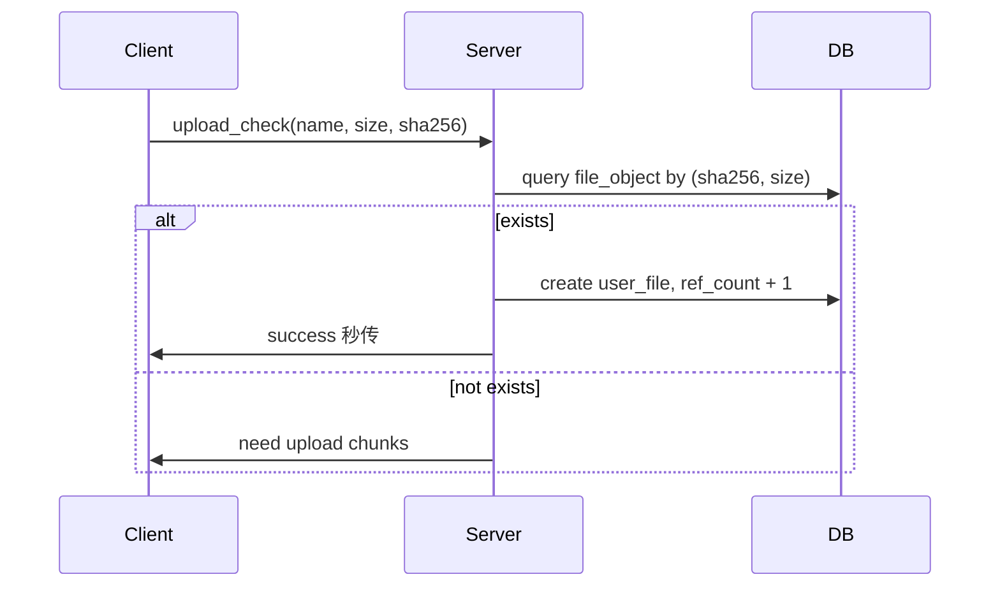

# 设计模式

## 常见设计模式

### 1. 为什么用组合而不要用继承？

#### 面试回答

优先使用组合而不是继承，是因为继承会把父类实现细节暴露给子类，形成强耦合；一旦父类变化，所有子类都可能受影响。组合通过把功能委托给成员对象来复用能力，更符合“对接口编程”和“组合优于继承”的原则，运行期也更容易替换具体实现。只有当子类和父类之间存在稳定的 `is-a` 关系，并且确实需要多态替换时，才适合使用公有继承；如果只是复用代码或表达 `has-a/use-a`，更应该使用组合。

#### 继承的问题

1. **强耦合**：子类依赖父类的接口和实现。
2. **层次膨胀**：需求变化后容易出现很深的继承树。
3. **脆弱基类问题**：父类改动可能破坏子类行为。
4. **复用粒度粗**：继承会继承父类全部可见接口，不一定都需要。
5. **运行期不灵活**：继承关系编译期固定，组合对象可运行期替换。

#### 组合的优势

| 对比项 | 继承 | 组合 |
| --- | --- | --- |
| 关系 | `is-a` | `has-a/use-a` |
| 耦合 | 较强 | 较弱 |
| 灵活性 | 编译期固定 | 运行期可替换 |
| 复用方式 | 复用父类接口和实现 | 委托成员对象 |
| 适合场景 | 稳定抽象、多态 | 能力拼装、策略切换 |

#### 示例

不推荐为了复用代码强行继承：

```cpp
class FileLogger {
public:
    void write(const std::string& msg);
};

class OrderService : public FileLogger {
public:
    void createOrder();
};
```

`OrderService` 不是一种 `FileLogger`，它只是需要日志能力。更合理的组合方式：

```cpp
class Logger {
public:
    virtual ~Logger() = default;
    virtual void write(const std::string& msg) = 0;
};

class OrderService {
public:
    explicit OrderService(Logger& logger) : logger_(logger) {}

    void createOrder() {
        logger_.write("create order");
    }

private:
    Logger& logger_;
};
```

#### 常见追问

- **继承是不是不能用？**  
  不是。继承适合稳定抽象和运行时多态，例如 `Shape` 派生 `Circle/Rectangle`。问题是不要用继承做单纯代码复用。

- **组合和策略模式有什么关系？**  
  策略模式通常就是通过组合一个策略接口对象，把变化的算法从主体类中拆出去。

### 2. 单例模式的构造函数、创建过程，如何保证线程安全？

#### 面试回答

单例模式保证一个类在进程内只有一个实例，并提供全局访问点。构造函数通常设为 `private` 或 `protected`，禁止外部直接构造；拷贝构造和赋值运算符要删除，防止复制出新对象。C++11 之后推荐使用函数局部静态变量实现懒加载单例，标准保证局部静态变量初始化是线程安全的；如果需要更复杂的初始化和生命周期控制，可以使用 `std::call_once`。

#### 单例需要控制哪些点

1. 构造函数私有化，外部不能 `new` 或栈上构造。
2. 删除拷贝构造和拷贝赋值。
3. 删除或禁用移动构造和移动赋值。
4. 提供静态访问函数。
5. 确保多线程下只初始化一次。
6. 注意析构顺序和生命周期。

#### Meyers Singleton

```cpp
class Config {
public:
    static Config& instance() {
        static Config obj;
        return obj;
    }

    Config(const Config&) = delete;
    Config& operator=(const Config&) = delete;
    Config(Config&&) = delete;
    Config& operator=(Config&&) = delete;

private:
    Config() = default;
    ~Config() = default;
};
```

优点：

- 懒加载。
- C++11 起初始化线程安全。
- 无需手写锁。
- 不需要手动释放。

#### `std::call_once` 实现

```cpp
#include <memory>
#include <mutex>

class Logger {
public:
    static Logger& instance() {
        std::call_once(flag_, [] {
            instance_.reset(new Logger);
        });
        return *instance_;
    }

    Logger(const Logger&) = delete;
    Logger& operator=(const Logger&) = delete;

private:
    Logger() = default;

    static std::once_flag flag_;
    static std::unique_ptr<Logger> instance_;
};

std::once_flag Logger::flag_;
std::unique_ptr<Logger> Logger::instance_;
```

#### 常见追问

- **双重检查锁为什么容易错？**  
  早期写法可能因为指令重排导致指针非空但对象未构造完成。C++11 后需要配合原子和内存序，普通业务不建议手写。

- **单例一定线程安全吗？**  
  初始化线程安全不代表内部操作线程安全。单例持有共享状态时，成员函数仍需加锁或设计成无状态。

### 3. 手写单例模式

#### 面试回答

面试中最推荐手写 C++11 局部静态变量版本，因为代码短、懒加载、线程安全，且避免了手动内存释放问题。实现时要把构造函数设为私有，删除拷贝、赋值和移动操作。返回引用通常比返回裸指针更清晰，表达调用方不负责释放。

#### 推荐写法

```cpp
class Singleton {
public:
    static Singleton& instance() {
        static Singleton obj;
        return obj;
    }

    Singleton(const Singleton&) = delete;
    Singleton& operator=(const Singleton&) = delete;
    Singleton(Singleton&&) = delete;
    Singleton& operator=(Singleton&&) = delete;

    void work() {}

private:
    Singleton() = default;
    ~Singleton() = default;
};
```

使用：

```cpp
Singleton::instance().work();
```

#### 懒汉式指针版本

```cpp
#include <mutex>

class SingletonPtr {
public:
    static SingletonPtr* instance() {
        std::lock_guard<std::mutex> lock(mutex_);
        if (!instance_) {
            instance_ = new SingletonPtr;
        }
        return instance_;
    }

private:
    SingletonPtr() = default;
    static SingletonPtr* instance_;
    static std::mutex mutex_;
};

SingletonPtr* SingletonPtr::instance_ = nullptr;
std::mutex SingletonPtr::mutex_;
```

该写法每次访问都加锁，且释放麻烦，通常不如局部静态变量。

#### 饿汉式

```cpp
class EagerSingleton {
public:
    static EagerSingleton& instance() {
        return instance_;
    }

private:
    EagerSingleton() = default;
    static EagerSingleton instance_;
};

EagerSingleton EagerSingleton::instance_;
```

程序启动时就初始化，适合初始化成本低且一定会使用的对象。

#### 常见误区

> [!CAUTION]
> 构造函数私有化不够，还要删除拷贝和移动。否则可以通过返回对象拷贝、容器存储等方式产生额外对象。

### 4. 如何使用单例模式，有什么注意事项？

#### 面试回答

单例适合进程内确实唯一、需要全局共享访问点的对象，例如日志器、配置中心、指标上报器、线程池管理器等。使用时要避免把单例当作全局变量滥用，因为它会隐藏依赖、增加测试难度、引入全局状态污染和初始化顺序问题。多线程环境下，除了保证单例创建线程安全，还要保证单例内部状态访问线程安全。

#### 适合使用的场景

- 全局配置读取器。
- 日志系统入口。
- 进程级监控指标收集器。
- 全局对象工厂或注册表。
- 资源池管理器，但要谨慎设计生命周期。

#### 不适合的场景

- 只是为了方便访问而绕过依赖注入。
- 对象其实可以有多个实例。
- 对象包含大量可变业务状态。
- 单元测试需要频繁替换实现。
- 多动态库环境且要求全进程严格唯一。

#### 注意事项

1. 不要在构造函数中做太重的操作。
2. 不要在单例析构阶段依赖其他单例，避免析构顺序问题。
3. 单例内部共享数据要加锁或无锁设计。
4. 跨动态库时要确认单例定义只存在一份。
5. 为测试预留接口，例如依赖接口而不是直接到处调用单例。

#### 常见追问

- **怎么降低单例对测试的影响？**  
  可以通过接口注入、工厂注入或在测试环境提供 mock 实现，业务类不要直接硬编码调用单例。

### 5. 使用单例模式时创建了多个对象，如何定位？

#### 面试回答

单例创建了多个对象，要从实现、链接和运行环境三个层面排查。实现层面检查构造函数是否私有、拷贝/移动是否删除、获取实例函数是否真的共享同一个静态对象；链接层面检查单例是否定义在头文件中导致多个翻译单元各有一份、是否模板或 inline 变量使用不当、是否多个动态库各自包含一份静态对象；运行层面可在构造函数打印对象地址、线程 ID、进程 ID、动态库路径和调用栈。

#### 常见原因

| 原因 | 现象 | 处理 |
| --- | --- | --- |
| 构造函数不是私有 | 外部能直接构造 | 私有化构造 |
| 拷贝/移动未禁用 | 能复制出对象 | delete 拷贝/移动 |
| 静态变量放头文件且非 inline | 多翻译单元多份定义或链接问题 | 放 `.cpp` 或正确使用 inline |
| 动态库各自链接一份 | 每个 so/dll 一个单例 | 把单例放公共动态库导出 |
| 模板单例 | 每个模板参数一份 | 确认是否符合预期 |
| 多进程 | 每个进程一份 | 单例只保证进程内唯一 |

#### 定位手段

在构造函数中打印：

```cpp
#include <iostream>
#include <thread>

class Singleton {
private:
    Singleton() {
        std::cerr << "Singleton constructed, this=" << this
                  << ", tid=" << std::this_thread::get_id() << '\n';
    }
};
```

Linux 下可进一步打印调用栈：

```cpp
#include <execinfo.h>
#include <unistd.h>

void printBacktrace() {
    void* buffer[32];
    int n = backtrace(buffer, 32);
    backtrace_symbols_fd(buffer, n, STDERR_FILENO);
}
```

#### 常见追问

- **单例能否跨进程唯一？**  
  普通 C++ 单例只能保证单进程内唯一。跨进程唯一需要文件锁、共享内存、数据库锁、Redis 锁或系统服务。

### 6. 请简述适配器模式

#### 面试回答

适配器模式是一种结构型设计模式，用于把一个已有类的接口转换成客户端期望的接口，使原本接口不兼容的类可以协同工作。它常用于封装第三方库、兼容老接口、迁移系统时统一新旧 API。对象适配器通过组合被适配对象实现，更灵活；类适配器通过继承实现，但 C++ 多继承场景下耦合更强。

#### 使用场景

- 新系统需要调用旧系统接口，但接口不匹配。
- 统一多个第三方 SDK 的调用方式。
- 把不同日志库、存储后端、支付渠道适配成统一接口。
- 迁移过程中保留旧接口，内部转发到新实现。

#### 对象适配器示例

旧接口：

```cpp
class OldPrinter {
public:
    void printOld(const std::string& text) {
        // old print
    }
};
```

新系统期望接口：

```cpp
class IPrinter {
public:
    virtual ~IPrinter() = default;
    virtual void print(const std::string& text) = 0;
};
```

适配器：

```cpp
class PrinterAdapter : public IPrinter {
public:
    explicit PrinterAdapter(OldPrinter& old) : old_(old) {}

    void print(const std::string& text) override {
        old_.printOld(text);
    }

private:
    OldPrinter& old_;
};
```

#### 与装饰器区别

| 模式 | 目的 |
| --- | --- |
| 适配器 | 转换接口，让不兼容接口能协作 |
| 装饰器 | 不改变接口，动态增强功能 |
| 代理 | 控制访问，如远程代理、权限代理、缓存代理 |

### 7. 实现一个简单的观察者模式。

#### 面试回答

观察者模式定义对象之间的一对多依赖关系。当被观察者状态变化时，会通知所有观察者。核心接口包括注册观察者、注销观察者和通知观察者。工程实现要特别注意观察者生命周期，避免被观察者保存裸指针后观察者已经析构导致悬空指针；可以使用 `weak_ptr`、连接对象或显式取消订阅。

#### 简单实现

```cpp
#include <algorithm>
#include <iostream>
#include <vector>

class Observer {
public:
    virtual ~Observer() = default;
    virtual void update(int value) = 0;
};

class Subject {
public:
    void attach(Observer* observer) {
        observers_.push_back(observer);
    }

    void detach(Observer* observer) {
        observers_.erase(std::remove(observers_.begin(), observers_.end(), observer),
                         observers_.end());
    }

    void notify(int value) {
        for (Observer* observer : observers_) {
            if (observer) observer->update(value);
        }
    }

private:
    std::vector<Observer*> observers_;
};

class ConsoleObserver : public Observer {
public:
    void update(int value) override {
        std::cout << "value changed: " << value << '\n';
    }
};
```

#### 更安全的 weak_ptr 思路

```cpp
#include <memory>
#include <vector>

class IObserver {
public:
    virtual ~IObserver() = default;
    virtual void update(int value) = 0;
};

class SafeSubject {
public:
    void attach(const std::shared_ptr<IObserver>& observer) {
        observers_.push_back(observer);
    }

    void notify(int value) {
        for (auto it = observers_.begin(); it != observers_.end();) {
            if (auto observer = it->lock()) {
                observer->update(value);
                ++it;
            } else {
                it = observers_.erase(it);
            }
        }
    }

private:
    std::vector<std::weak_ptr<IObserver>> observers_;
};
```

#### 工程注意点

- 通知过程中观察者注销自己，会修改容器，要避免迭代器失效。
- 多线程注册和通知需要加锁或复制观察者列表。
- 通知回调不能太慢，否则阻塞主题对象。
- 异步通知要处理事件顺序和对象生命周期。

### 8. 使用过的设计模式、应用场景、如何应用？

#### 面试回答

回答这类题不要只背模式名字，要结合项目中的变化点说明模式解决了什么问题。例如日志器或配置管理可以用单例保证进程内统一入口；根据协议类型创建不同任务可以用工厂模式；负载均衡算法、压缩算法、排序策略可以用策略模式；事件通知可以用观察者模式；封装第三方库接口可以用适配器模式。重点是说明不用模式会导致大量 `if-else`、耦合第三方接口、难扩展或难测试。

#### 常见模式和项目场景

| 模式 | 解决问题 | 项目例子 |
| --- | --- | --- |
| 单例 | 进程内唯一实例 | 日志器、配置中心 |
| 工厂 | 隐藏对象创建细节 | 按消息类型创建任务 |
| 策略 | 算法可替换 | 负载均衡、压缩算法 |
| 观察者 | 事件通知 | 状态变更通知、配置热更新 |
| 适配器 | 接口不兼容 | 封装第三方存储 SDK |
| 代理 | 控制访问 | 缓存代理、RPC 代理 |
| RAII | 资源自动释放 | 锁、文件句柄、socket |

#### 策略模式示例

```cpp
class BalanceStrategy {
public:
    virtual ~BalanceStrategy() = default;
    virtual int select(const std::vector<int>& nodes) = 0;
};

class RoundRobinStrategy : public BalanceStrategy {
public:
    int select(const std::vector<int>& nodes) override {
        int idx = next_++ % static_cast<int>(nodes.size());
        return nodes[idx];
    }

private:
    int next_ = 0;
};
```

#### 面试表达模板

```text
我在项目中用过策略模式。背景是系统支持多种负载均衡算法，例如轮询、随机和一致性哈希。如果直接写 if-else，新增算法要改调度模块。后来抽象了 BalanceStrategy 接口，调度器只依赖接口，具体算法独立实现。这样新增算法只需要新增类和配置，不影响调度主流程。
```

# 项目

## 网盘项目

### 1. 客户端发消息给服务器，服务器端如何解析？

#### 面试回答

服务端解析客户端消息，首先要设计明确的应用层协议，不能假设一次 `recv` 就是一条完整消息。TCP 是字节流，必须解决粘包和拆包。常见做法是固定长度消息头，头部包含魔数、版本、消息类型、序列号、body 长度、校验等字段；服务端先从连接缓冲区读取完整头部，再根据 body 长度读取完整 body，最后按消息类型分发给对应处理器。body 可以用 JSON、Protobuf 或自定义二进制格式。

#### 协议头设计

```cpp
#include <cstdint>

struct MsgHeader {
    uint32_t magic;
    uint16_t version;
    uint16_t type;
    uint32_t seq;
    uint32_t body_len;
    uint32_t checksum;
};
```

字段说明：

| 字段 | 作用 |
| --- | --- |
| `magic` | 快速识别非法连接或协议错位 |
| `version` | 协议版本兼容 |
| `type` | 登录、上传、下载、心跳等消息类型 |
| `seq` | 请求响应匹配和排障 |
| `body_len` | 解决粘包拆包 |
| `checksum` | 校验 body 完整性 |

#### 解析流程

```text
socket 可读
  -> read 到连接输入缓冲区
  -> 缓冲区长度不足 header：继续等
  -> 解析 header，校验 magic/version/body_len
  -> 缓冲区长度不足完整 body：继续等
  -> 取出完整消息
  -> 按 type 分发 handler
  -> 处理后生成响应
```

#### 常见问题

- body 长度必须设置上限，防止恶意大包打爆内存。
- 多字节字段要统一网络字节序。
- 协议要支持版本兼容和错误码。
- 解析失败要关闭连接或返回错误。
- 文件内容建议走分块流，不要一次性读入内存。

### 2. 多个用户上传同一份文件该如何处理？

#### 面试回答

多个用户上传同一份文件，可以用内容哈希做物理文件去重。服务端根据文件大小和强哈希值判断物理文件是否已存在；如果存在，只需要新增用户目录项或文件引用记录，不重复保存文件内容；如果不存在，则正常上传并落盘。数据库中通常把“用户看到的文件”和“物理存储文件”分成两张表，通过 `file_id` 关联，并维护引用计数，删除时只删除用户引用，引用计数为 0 才删除物理文件。

#### 表设计示例

物理文件表：

```sql
CREATE TABLE file_object (
  id BIGINT PRIMARY KEY,
  sha256 CHAR(64) NOT NULL,
  size BIGINT NOT NULL,
  storage_path VARCHAR(512) NOT NULL,
  ref_count INT NOT NULL DEFAULT 0,
  created_at DATETIME NOT NULL,
  UNIQUE KEY uk_hash_size(sha256, size)
);
```

用户文件表：

```sql
CREATE TABLE user_file (
  id BIGINT PRIMARY KEY,
  user_id BIGINT NOT NULL,
  parent_id BIGINT NOT NULL,
  name VARCHAR(255) NOT NULL,
  file_object_id BIGINT NOT NULL,
  created_at DATETIME NOT NULL,
  UNIQUE KEY uk_user_dir_name(user_id, parent_id, name)
);
```

#### 上传处理

```text
客户端计算 hash + size
  -> 服务端查询 file_object
  -> 存在：创建 user_file，ref_count + 1
  -> 不存在：上传文件到临时区
  -> 校验 hash
  -> 原子移动到正式存储
  -> 插入 file_object 和 user_file
```

#### 并发问题

两个用户同时上传同一个新文件时：

- `file_object(sha256,size)` 必须有唯一索引。
- 插入冲突时说明另一个请求已经完成，当前请求改为引用已有文件。
- 临时文件按 upload_id 隔离，避免覆盖。

### 3. 秒传如何实现？

#### 面试回答

秒传的核心是“服务端已经有相同内容的物理文件时，不再上传文件内容”。客户端先计算文件大小和内容哈希，把元信息发给服务端；服务端查询物理文件表，如果存在相同大小和哈希的文件，就直接创建用户目录记录并增加引用计数，然后返回成功。如果不存在，则进入普通分块上传流程。为了降低哈希碰撞和伪造风险，通常结合大小、强哈希、分块哈希、服务端抽样校验或完整校验。

#### 秒传流程



#### 安全注意

- 只用 MD5 风险较高，建议 SHA-256 或 MD5 + SHA-256。
- 客户端 hash 不能完全信任，普通上传完成后服务端要复算。
- 对敏感资源，秒传可能泄露“服务端是否已有某文件”，需要权限和安全策略。
- 同名文件要处理覆盖、重命名或版本管理。

#### 常见追问

- **秒传是否一定不用传任何数据？**  
  常规秒传不用传文件内容，但安全要求高时可能要求上传抽样块或做二次校验。

### 4. 断点续传如何实现？

#### 面试回答

断点续传通常把文件按固定大小分块，每块有 chunk_id、offset、size、hash。上传开始时服务端创建 upload_id 并记录文件元信息；每上传成功一块，服务端记录该块状态。网络中断后，客户端携带 upload_id 查询已完成分块，只上传缺失部分。所有分块上传完成后，服务端合并文件，校验整体 hash，最后把临时文件移动到正式存储并更新数据库状态。

#### 数据表设计

上传会话表：

```sql
CREATE TABLE upload_session (
  upload_id VARCHAR(64) PRIMARY KEY,
  user_id BIGINT NOT NULL,
  file_name VARCHAR(255) NOT NULL,
  file_size BIGINT NOT NULL,
  file_hash CHAR(64) NOT NULL,
  chunk_size INT NOT NULL,
  status TINYINT NOT NULL,
  created_at DATETIME NOT NULL,
  updated_at DATETIME NOT NULL
);
```

分块表：

```sql
CREATE TABLE upload_chunk (
  upload_id VARCHAR(64) NOT NULL,
  chunk_id INT NOT NULL,
  offset BIGINT NOT NULL,
  size INT NOT NULL,
  hash CHAR(64),
  status TINYINT NOT NULL,
  PRIMARY KEY(upload_id, chunk_id)
);
```

#### 续传流程

```text
init_upload
  -> 服务端返回 upload_id 和缺失分块列表
upload_chunk(chunk_id, offset, data, hash)
  -> 服务端写临时文件并记录 chunk 完成
query_missing(upload_id)
  -> 返回缺失 chunk
complete_upload
  -> 检查所有 chunk 完成
  -> 合并或确认随机写文件完整
  -> 校验整体 hash
  -> 更新 file_object/user_file
```

#### 实现方式

- **分块临时文件**：每块单独保存，最后合并。简单但合并成本高。
- **随机写同一临时文件**：按 offset 写入，完成后直接校验。要求处理并发写和稀疏文件问题。

#### 常见问题

- 分块上传接口要幂等，同一 chunk 重传不能导致状态异常。
- 合并任务要加锁，避免重复合并。
- 未完成 upload_session 要定期清理。
- chunk_size 要平衡并发、内存、元数据数量和重试成本。

### 5. 讲一下虚拟文件目录

#### 面试回答

虚拟文件目录是指用户看到的目录结构不直接等同于服务器磁盘目录，而是由数据库维护目录树和文件引用关系。每个目录项记录用户 ID、父目录 ID、名称、类型、文件对象 ID 等字段。这样可以支持秒传、去重、分享、移动、重命名、权限控制和多用户引用同一物理文件。物理文件按 hash 存在对象存储或磁盘路径中，用户目录只保存逻辑关系。

#### 表结构示例

```sql
CREATE TABLE user_entry (
  id BIGINT PRIMARY KEY,
  user_id BIGINT NOT NULL,
  parent_id BIGINT NOT NULL,
  name VARCHAR(255) NOT NULL,
  type TINYINT NOT NULL, -- 1 dir, 2 file
  file_object_id BIGINT,
  created_at DATETIME NOT NULL,
  updated_at DATETIME NOT NULL,
  UNIQUE KEY uk_user_parent_name(user_id, parent_id, name),
  KEY idx_user_parent(user_id, parent_id)
);
```

#### 为什么用虚拟目录

- 物理文件可去重，一个文件对象被多个目录项引用。
- 重命名和移动只改数据库，不移动磁盘文件。
- 易做权限、分享、回收站和版本控制。
- 存储路径可按 hash 分散，避免单目录文件过多。

#### 路径解析

```text
/docs/a.txt
  -> 查 user_entry(parent=root, name='docs', type=dir)
  -> 查 user_entry(parent=docs_id, name='a.txt', type=file)
  -> 找到 file_object_id
  -> 获取物理 storage_path
```

#### 常见追问

- **如何防止同一目录下重名？**  
  建联合唯一索引 `(user_id, parent_id, name)`。

### 6. 前后端的通信方式知道哪几种？

#### 面试回答

前后端通信常见方式包括 HTTP/HTTPS REST、WebSocket、HTTP/2、SSE、TCP 自定义协议、RPC 和消息队列。普通业务请求适合 HTTP/JSON；上传下载可以用 HTTP multipart、分块上传或自定义 TCP 流；实时通知适合 WebSocket 或 SSE；服务内部通信可使用 gRPC、Protobuf 或消息队列。选择时要看实时性、可靠性、浏览器支持、调试成本和服务端复杂度。

#### 对比表

| 方式 | 特点 | 场景 |
| --- | --- | --- |
| HTTP REST | 简单通用，请求响应 | 登录、目录、查询 |
| WebSocket | 全双工长连接 | 实时通知、进度推送 |
| SSE | 服务端单向推送 | 状态通知、消息流 |
| TCP 自定义协议 | 高性能，可控 | 客户端程序、文件传输 |
| gRPC | IDL、二进制、高效 | 服务内部 RPC |
| MQ | 异步解耦 | 后台任务、通知 |

#### 网盘项目常见组合

```text
登录/目录/分享：HTTP + JSON
上传/下载：HTTP 分块或 TCP 自定义协议
进度通知：WebSocket
后台任务：消息队列
```

#### 常见追问

- **为什么浏览器前端更常用 HTTP？**  
  浏览器原生支持、调试方便、生态成熟、代理和网关支持好。

### 7. 上传或更改文件时网络中断，会不会导致数据库和文件对不上，怎么解决？

#### 面试回答

会有风险，因为数据库事务无法天然覆盖文件系统或对象存储操作。如果上传过程中网络中断，可能出现数据库记录已写但文件未完整、文件已落盘但数据库未提交、临时文件长期残留等问题。解决思路是把上传设计成状态机：文件先写临时区，数据库记录上传中状态；只有文件完整校验通过后，才在事务中写正式元数据，并通过原子 rename 或对象存储 copy/commit 变为可见；后台补偿任务定期清理超时临时文件和修复不一致状态。

#### 状态机

```text
INIT
  -> UPLOADING
  -> MERGING
  -> VERIFYING
  -> AVAILABLE
  -> FAILED / EXPIRED
```

#### 推荐流程

1. 创建上传会话，状态为 `UPLOADING`。
2. 分块写入临时目录或临时对象。
3. 每块完成后记录 chunk 状态。
4. 所有块完成后进入 `MERGING`。
5. 合并并校验整体 hash。
6. 校验成功后开启数据库事务：
   - 写入 `file_object`。
   - 写入 `user_file`。
   - 更新 upload 状态为 `AVAILABLE`。
7. 临时文件原子移动到正式路径。
8. 失败或超时由清理任务处理。

#### 补偿任务

- 找到长时间 `UPLOADING` 的会话，标记过期并删除临时块。
- 找到 `MERGING` 卡住的任务，检查文件是否存在并重试或失败。
- 找到正式文件存在但无数据库引用的对象，延迟清理。
- 找到数据库引用但物理文件缺失的记录，告警并从备份恢复。

#### 常见追问

- **文件系统 rename 为什么有用？**  
  同一文件系统内 `rename` 通常是原子操作，可以避免读到半成品文件。

### 8. 如何做 token 验证？

#### 面试回答

Token 验证一般是在用户登录成功后，由服务端签发包含用户身份和过期时间的 token，客户端后续请求放在 `Authorization` 头里。服务端收到请求后校验 token 签名、过期时间、用户 ID、权限、设备信息和黑名单。常见方案有 JWT 和服务端 session token：JWT 适合无状态校验，扩展方便；session token 需要查 Redis 或数据库，但便于主动失效和权限控制。

#### 请求格式

```http
GET /api/files HTTP/1.1
Authorization: Bearer <token>
```

#### JWT 校验流程

```text
解析 header.payload.signature
  -> 用密钥或公钥校验 signature
  -> 检查 exp/iat/issuer/audience
  -> 解析 user_id 和权限
  -> 检查黑名单或 token_version
  -> 放行或拒绝
```

#### Session Token 流程

```text
登录成功
  -> 生成随机 token
  -> Redis: token -> user_id/role/expire
  -> 客户端携带 token
  -> 服务端查 Redis 验证
```

#### 安全注意

- 必须使用 HTTPS。
- token 设置合理过期时间。
- refresh token 和 access token 分离。
- 退出登录时加入黑名单或删除服务端 token。
- 敏感操作可二次验证。
- 防重放可加入 nonce、timestamp 或请求签名。

### 9. 网盘项目的网络通信方式

#### 面试回答

网盘项目通常把控制面和数据面分开。控制面如登录、目录、秒传检查、分块状态查询可用 HTTP/JSON，简单易调试；数据面如大文件上传下载可用 HTTP 分块上传、断点续传，或 TCP 自定义协议提升性能。服务端高并发可采用 epoll/Reactor 处理网络事件，业务线程池处理数据库、文件 I/O、hash 计算和合并任务。协议必须包含消息长度、类型、文件 ID、分块偏移、分块大小和校验值。

#### 架构示意

```text
Client
  -> Gateway/Nginx
  -> API Service: 登录、目录、秒传、分享
  -> Transfer Service: 上传、下载、断点续传
  -> DB/Redis/Object Storage
```

#### 控制命令

```json
{
  "cmd": "upload_chunk",
  "upload_id": "u123",
  "chunk_id": 5,
  "offset": 5242880,
  "size": 1048576,
  "sha256": "..."
}
```

#### 网络模型

- I/O 线程：epoll 监听连接，负责读写缓冲区。
- 协议解析：处理粘包拆包。
- 业务线程池：处理鉴权、DB、Redis。
- 文件线程池：处理磁盘读写和合并。

#### 常见追问

- **为什么不在 I/O 线程做文件 hash？**  
  hash 计算可能耗 CPU，文件 I/O 可能阻塞，会影响所有连接的事件处理。

### 10. 有考虑过多线程同时上传一个文件的问题吗？

#### 面试回答

考虑过。多线程上传一般按分块并发，不同线程上传不同 chunk，服务端按 `upload_id + chunk_id` 做幂等记录。每个分块写入时要避免同一块重复写冲突，可以使用分块级锁、唯一索引、临时文件隔离或原子覆盖策略。所有分块完成后，合并阶段必须对 upload_id 加任务锁，保证只有一个合并任务执行，最终校验整体 hash 后再提交元数据。

#### 并发上传流程

```text
client thread1 -> chunk 0
client thread2 -> chunk 1
client thread3 -> chunk 2

server:
  write chunk_i.tmp
  verify chunk hash
  insert/update upload_chunk(upload_id, chunk_id, done)
```

#### 幂等设计

数据库唯一键：

```sql
PRIMARY KEY(upload_id, chunk_id)
```

处理逻辑：

- chunk 已完成且 hash 相同：直接返回成功。
- chunk 已完成但 hash 不同：返回冲突或覆盖重传。
- chunk 未完成：写临时文件，校验后标记完成。

#### 合并锁

可用 Redis 锁、数据库状态 CAS 或本地任务锁：

```sql
UPDATE upload_session
SET status = 2
WHERE upload_id = ?
  AND status = 1;
```

影响行数为 1 的线程获得合并权。

### 11. MD5 算法是自己实现的吗？

#### 面试回答

项目中不建议自己实现 MD5、SHA-256 这类摘要算法，生产环境应使用 OpenSSL、系统 crypto 库或成熟第三方库。自己实现适合学习，但容易出现边界、大小端、填充、性能和安全更新问题。网盘秒传和去重如果使用 MD5，最好结合文件大小、分块 hash 或更强的 SHA-256，降低碰撞风险；服务端也应在文件上传完成后复算 hash，不能完全信任客户端。

#### 为什么不用自己实现

- 密码学实现容易出错。
- 成熟库经过大量测试和优化。
- 可利用硬件加速。
- 安全问题能及时更新。

#### 典型用法

```text
文件唯一性判断：
  size + sha256
或
  size + md5 + chunk_sha256
```

#### 常见追问

- **MD5 还能用吗？**  
  MD5 已不适合安全签名和抗攻击场景。用于非安全场景的快速去重可以配合大小和强校验，但更推荐 SHA-256。

### 12. 文件如何和用户绑定？

#### 面试回答

文件和用户通常通过数据库关系绑定，而不是直接把文件放到用户磁盘目录。物理文件表保存内容哈希、大小、存储路径、引用计数；用户文件表保存 user_id、父目录、文件名、文件对象 ID、权限和时间。一个物理文件可以被多个用户目录项引用，实现去重和秒传；删除文件时先删除用户目录项并减少引用计数，引用计数为 0 才删除物理文件。

#### 关系模型

```text
user
  1 -> N user_entry
user_entry(file)
  N -> 1 file_object
```

#### 删除流程

```text
用户删除 /a.txt
  -> 删除 user_entry 或移入回收站
  -> file_object.ref_count - 1
  -> if ref_count == 0:
       标记物理文件待清理
  -> 后台异步删除存储文件
```

#### 为什么异步删除

- 防止请求路径阻塞在慢磁盘或对象存储。
- 给误删恢复和一致性检查留时间。
- 可以批量删除，提高效率。

### 13. 连接使用的是长连接还是短连接？

#### 面试回答

如果是普通 HTTP API，可以使用 HTTP keep-alive 复用连接；如果是自定义 TCP 文件传输服务，通常使用长连接。长连接减少 TCP 三次握手和 TLS 握手开销，适合大文件传输、持续上传下载和进度通知。短连接实现简单，但大量小请求或大文件分块上传时连接建立成本高，容易产生大量 TIME_WAIT。长连接要配套心跳、空闲超时、连接上限和异常断开检测。

#### 对比表

| 对比项 | 长连接 | 短连接 |
| --- | --- | --- |
| 建连成本 | 低，复用连接 | 高，每次新建 |
| 服务端资源 | 长时间占 fd 和内存 | 释放快 |
| 实现复杂度 | 心跳、超时、状态管理 | 简单 |
| 适合 | 大文件、实时通信 | 低频简单请求 |
| 风险 | 死连接、资源占用 | TIME_WAIT、握手开销 |

#### 长连接维护

- 应用层心跳：ping/pong。
- 读写超时。
- TCP keepalive。
- 最大空闲时间。
- 慢连接检测和断开。

### 14. 长连接 socket 参数怎么设置？

#### 面试回答

长连接 socket 常见设置包括地址复用 `SO_REUSEADDR`、非阻塞模式、`TCP_NODELAY`、`SO_KEEPALIVE`、发送/接收缓冲区大小、读写超时等。网络服务通常会把 socket 设置为非阻塞，再配合 epoll；对于小包交互可开启 `TCP_NODELAY` 降低延迟；对于长时间空闲连接可开启 keepalive 或应用层心跳检测死连接。参数不是越大越好，要结合连接数、内存和业务流量调优。

#### 常见参数

| 参数 | 作用 |
| --- | --- |
| `SO_REUSEADDR` | 允许地址端口快速复用 |
| `SO_KEEPALIVE` | TCP keepalive 探测死连接 |
| `TCP_NODELAY` | 关闭 Nagle，降低小包延迟 |
| `SO_SNDBUF` | 发送缓冲区 |
| `SO_RCVBUF` | 接收缓冲区 |
| `O_NONBLOCK` | 非阻塞 I/O |
| `SO_LINGER` | 控制 close 行为 |

#### 示例

```cpp
int opt = 1;
setsockopt(fd, SOL_SOCKET, SO_REUSEADDR, &opt, sizeof(opt));
setsockopt(fd, IPPROTO_TCP, TCP_NODELAY, &opt, sizeof(opt));
setsockopt(fd, SOL_SOCKET, SO_KEEPALIVE, &opt, sizeof(opt));
```

设置非阻塞：

```cpp
int flags = fcntl(fd, F_GETFL, 0);
fcntl(fd, F_SETFL, flags | O_NONBLOCK);
```

#### 应用层也要做

- 心跳包。
- 请求超时。
- 发送队列长度限制。
- 最大连接数限制。
- 慢客户端断开。

### 15. 项目为什么要进行文件去重？

#### 面试回答

网盘项目做文件去重主要是为了节省存储空间、减少上传带宽、提升秒传体验和降低备份成本。大量用户可能上传相同的软件安装包、视频、文档，如果每个用户都存一份，空间浪费很大。通过内容 hash 识别相同文件，只存一份物理文件，多用户通过引用关系绑定即可。但去重要处理 hash 碰撞、引用计数、权限隔离和删除一致性。

#### 收益

- 节省磁盘或对象存储成本。
- 减少重复上传流量。
- 提高上传体验，支持秒传。
- 降低备份和迁移数据量。

#### 风险和处理

| 风险 | 处理 |
| --- | --- |
| hash 碰撞 | size + SHA-256 + 服务端校验 |
| 引用计数错误 | 数据库事务、后台校验 |
| 用户隐私 | 不暴露其他用户文件信息 |
| 删除误删物理文件 | 先删引用，ref_count 为 0 再异步清理 |

### 16. 线程池是如何实现的？

#### 面试回答

线程池本质是生产者消费者模型。线程池预先创建一定数量的工作线程，维护一个任务队列；提交任务时把任务放入队列并通知条件变量；工作线程阻塞等待任务，取到任务后执行；关闭时设置停止标志，唤醒所有线程并 `join`。线程池可以减少频繁创建销毁线程的开销，控制并发度，并统一做监控、限流和拒绝策略。

#### 核心组成

- 工作线程数组。
- 任务队列。
- 互斥锁。
- 条件变量。
- 停止标志。
- 拒绝策略和队列上限。

#### 简化实现

```cpp
#include <condition_variable>
#include <functional>
#include <mutex>
#include <queue>
#include <thread>
#include <vector>

class ThreadPool {
public:
    explicit ThreadPool(size_t n) {
        for (size_t i = 0; i < n; ++i) {
            workers_.emplace_back([this] { workerLoop(); });
        }
    }

    ~ThreadPool() {
        {
            std::lock_guard<std::mutex> lock(mutex_);
            stop_ = true;
        }
        cv_.notify_all();
        for (auto& t : workers_) {
            if (t.joinable()) t.join();
        }
    }

    void submit(std::function<void()> task) {
        {
            std::lock_guard<std::mutex> lock(mutex_);
            tasks_.push(std::move(task));
        }
        cv_.notify_one();
    }

private:
    void workerLoop() {
        while (true) {
            std::function<void()> task;
            {
                std::unique_lock<std::mutex> lock(mutex_);
                cv_.wait(lock, [this] { return stop_ || !tasks_.empty(); });
                if (stop_ && tasks_.empty()) return;
                task = std::move(tasks_.front());
                tasks_.pop();
            }
            task();
        }
    }

    std::vector<std::thread> workers_;
    std::queue<std::function<void()>> tasks_;
    std::mutex mutex_;
    std::condition_variable cv_;
    bool stop_ = false;
};
```

#### 工程增强

- 队列容量限制。
- 拒绝策略：丢弃、阻塞、调用者执行、返回错误。
- Future 返回值。
- 任务超时统计。
- 动态扩缩容。
- 优先级队列。

### 17. 线程池在项目中怎么用，分别有哪些线程，怎么分工？

#### 面试回答

网盘项目中通常把线程按职责拆分，避免一种任务阻塞所有流程。I/O 线程负责 epoll 事件、连接读写和协议解析，不做耗时业务；业务线程池处理登录、鉴权、目录操作、数据库和 Redis；文件线程池处理磁盘读写、分块合并、hash 计算；后台线程负责清理临时文件、过期任务、异步删除和统计上报。这样可以降低网络事件循环延迟，也方便分别监控瓶颈。

#### 分工示例

| 线程/线程池 | 职责 | 不应该做 |
| --- | --- | --- |
| I/O 线程 | epoll、读写缓冲区、协议拆包 | 阻塞 DB、磁盘大 I/O |
| 业务线程池 | 登录、鉴权、目录、元数据 | 长时间 CPU 计算 |
| 文件线程池 | 上传落盘、下载读盘、合并 | 阻塞网络事件循环 |
| Hash 线程池 | MD5/SHA-256 计算 | 持有全局锁 |
| 后台线程 | 清理、补偿、统计 | 处理实时请求 |

#### 请求流转

```text
I/O 线程收到 upload_chunk
  -> 解析协议
  -> 投递到业务线程鉴权和查 upload_session
  -> 投递到文件线程写 chunk
  -> 完成后生成响应
  -> I/O 线程发送响应
```

#### 常见追问

- **为什么文件 I/O 不直接在业务线程做？**  
  文件 I/O 抖动较大，单独线程池便于隔离，避免拖慢登录、目录等轻量请求。

### 18. 线程池线程数是否会随并发量动态增加？

#### 面试回答

可以固定，也可以动态扩缩容。固定线程池实现简单、资源可控，适合任务耗时稳定的系统；动态线程池会设置 core/max 线程数、队列容量、空闲线程回收时间，根据队列积压和活跃线程数扩容，但要防止并发高峰时无限扩张导致上下文切换和内存耗尽。线程数应根据 CPU 核数、I/O 等待比例、数据库连接数、磁盘能力和任务类型综合确定。

#### 线程数估算

CPU 密集型：

```text
线程数 ≈ CPU 核数 或 CPU 核数 + 1
```

I/O 密集型：

```text
线程数 ≈ CPU 核数 * (1 + I/O等待时间 / CPU计算时间)
```

#### 动态扩缩容策略

- 队列未满时优先排队。
- 队列达到阈值且线程数小于 max 时扩容。
- 线程空闲超过 keepalive 时间后回收。
- 队列满且线程已达 max 时触发拒绝策略。

#### 注意

- 数据库连接池大小会限制有效并发。
- 磁盘 I/O 饱和后增加线程只会加重抖动。
- 线程栈也占内存，线程不是越多越好。

### 19. 如何确定线程池中线程的状态？

#### 面试回答

可以从线程池内部状态、任务指标和系统排障三层判断。线程池内部维护线程状态，如空闲、运行、阻塞等待、准备退出；任务指标包括队列长度、活跃线程数、完成任务数、任务平均耗时、最大耗时、拒绝次数和异常次数；排障时可以通过日志、监控接口、线程 dump、gdb、pstack、perf 等工具查看线程是否阻塞在锁、条件变量、磁盘 I/O、网络 I/O 或数据库调用上。

#### 应维护的指标

| 指标 | 作用 |
| --- | --- |
| pool_size | 当前线程数 |
| active_count | 正在执行任务线程数 |
| idle_count | 空闲线程数 |
| queue_size | 等待任务数 |
| completed_tasks | 已完成任务数 |
| rejected_tasks | 被拒绝任务数 |
| task_latency | 任务排队和执行耗时 |
| error_count | 任务异常数 |

#### 线程状态枚举

```cpp
enum class WorkerState {
    Idle,
    Running,
    Waiting,
    Stopping,
    Stopped
};
```

#### 排障命令

```bash
top -H -p <pid>
pstack <pid>
gdb -p <pid>
thread apply all bt
perf top -p <pid>
```

#### 常见问题判断

- 队列很长、active 满：线程池处理能力不足或下游慢。
- active 很低、队列很长：调度或锁可能有问题。
- 线程都阻塞在数据库：DB 或连接池瓶颈。
- 线程都阻塞在 mutex：锁粒度过大或死锁。

## 搜索引擎项目

### 1. 一个网页的信息通过什么形式存储？

#### 面试回答

搜索引擎通常把网页信息拆成原始网页库、解析后的文档库、正排索引和倒排索引。原始网页库存 HTML 和抓取元信息；文档库存 URL、title、正文、摘要、时间、站点、质量分等结构化字段；正排索引按 docID 保存文档详情，便于结果展示；倒排索引按 term 保存包含该词的 docID 列表、词频、位置和权重，用于快速检索。

#### 存储结构

| 存储 | key | value | 用途 |
| --- | --- | --- | --- |
| 原始网页库 | url/docID | HTML、headers、抓取时间 | 复解析、备份 |
| 文档库 | docID | title、url、content、summary | 展示和排序 |
| 正排索引 | docID | term 列表、字段权重 | 计算和展示 |
| 倒排索引 | term | posting list | 查询召回 |

#### 倒排项示例

```text
term = "redis"
posting list:
  (docID=10, tf=3, positions=[5, 20, 88])
  (docID=42, tf=1, positions=[17])
```

#### 工程注意

- 原始 HTML 可压缩存储。
- docID 用整数降低索引体积。
- 倒排列表可用差分编码、变长编码压缩。
- 热门 term 的倒排列表很长，需要跳表或分块加速。

### 2. SimHash 是什么，怎么使用，用什么存储？

#### 面试回答

SimHash 是一种局部敏感哈希，用于文本近似去重。它把文本特征词及权重映射到固定长度 bit 向量，对每一位按特征 hash 的 0/1 做加权累加，最后累加值大于 0 的位设为 1，否则设为 0，得到 64 位或 128 位指纹。两个文本的 SimHash 海明距离越小，说明文本越相似。存储时可以把指纹按若干段切分建立哈希索引，加速近似查找。

#### 计算流程

```text
分词 -> 计算词权重 TF-IDF
每个词 hash 成 64 bit
每一位：
  bit=1 加 weight
  bit=0 减 weight
最终每位 >0 置 1，否则置 0
```

#### 海明距离

海明距离是两个二进制指纹不同 bit 的数量：

```cpp
int hamming(uint64_t a, uint64_t b) {
    return __builtin_popcountll(a ^ b);
}
```

通常海明距离小于某个阈值，如 3，认为近似重复。

#### 存储和检索

64 位 SimHash 可切成 4 段，每段 16 位：

```text
[part1][part2][part3][part4]
```

如果两个指纹海明距离 <= 3，则至少有一段完全相同。可以按每段建立哈希桶，查询时只比较候选集合，避免全量比较。

#### 应用

- 网页去重。
- 新闻相似文章聚合。
- 搜索结果去重。
- 爬虫抓取去重。

### 3. 介绍倒排索引和余弦相似度算法。

#### 面试回答

倒排索引是从词到文档列表的映射，适合根据关键词快速找到包含该词的文档。每个倒排列表中通常保存 docID、词频、词位置、字段信息和权重。查询时对多个关键词的倒排列表做求交或求并，得到候选文档，再用 TF-IDF、BM25、余弦相似度等模型计算相关性。余弦相似度把查询和文档表示为向量，通过夹角余弦衡量相似程度。

#### 倒排索引

```text
"c++"    -> [doc1, doc5, doc9]
"redis"  -> [doc2, doc5, doc8]
"epoll"  -> [doc5, doc7]
```

查询 `c++ redis epoll` 时：

- AND 查询：求交，得到同时包含三个词的文档。
- OR 查询：求并，再按相关性排序。

#### TF-IDF

```text
TF = 词在文档中出现频率
IDF = log(总文档数 / 包含该词的文档数)
weight = TF * IDF
```

高频但常见词权重低，能区分文档的词权重高。

#### 余弦相似度

```text
cos(q, d) = dot(q, d) / (|q| * |d|)
```

适合比较查询向量和文档向量方向是否接近。

#### 常见追问

- **为什么不用正排索引直接搜？**  
  正排索引要遍历所有文档找关键词，效率低；倒排索引可以直接定位包含关键词的文档集合。

### 4. 任务队列怎么实现，阻塞还是非阻塞？

#### 面试回答

搜索项目中的任务队列可以根据场景选择阻塞或非阻塞。后台工作线程消费任务时，常用互斥锁加条件变量实现阻塞队列，队列为空时线程睡眠，避免空转消耗 CPU。网络事件循环和高性能异步场景可以用无锁队列或非阻塞队列，再通过 eventfd、pipe 或条件变量唤醒消费者。核心要考虑线程安全、队列容量、超时、关闭、优先级和任务堆积监控。

#### 阻塞队列

```cpp
template <class T>
class BlockingQueue {
public:
    void push(T value) {
        {
            std::lock_guard<std::mutex> lock(mutex_);
            queue_.push(std::move(value));
        }
        cv_.notify_one();
    }

    bool pop(T& value) {
        std::unique_lock<std::mutex> lock(mutex_);
        cv_.wait(lock, [this] { return stopped_ || !queue_.empty(); });
        if (queue_.empty()) return false;
        value = std::move(queue_.front());
        queue_.pop();
        return true;
    }

    void stop() {
        {
            std::lock_guard<std::mutex> lock(mutex_);
            stopped_ = true;
        }
        cv_.notify_all();
    }

private:
    std::queue<T> queue_;
    std::mutex mutex_;
    std::condition_variable cv_;
    bool stopped_ = false;
};
```

#### 阻塞与非阻塞对比

| 类型 | 优点 | 缺点 | 场景 |
| --- | --- | --- | --- |
| 阻塞队列 | 简单、省 CPU | 线程阻塞唤醒有开销 | 工作线程池 |
| 非阻塞队列 | 延迟低、适合事件驱动 | 实现复杂，可能空转 | 高性能网络 |
| 有界队列 | 可保护系统 | 满时要拒绝或降级 | 生产环境 |

### 5. 负载均衡怎么做？

#### 面试回答

负载均衡可以在入口层用 Nginx/LVS/网关把请求分发到多个搜索服务实例，也可以在服务内部按索引分片分发查询。简单算法有轮询、随机、加权轮询；长连接或耗时差异大时用最少连接或最短响应时间；缓存和分片场景可用一致性哈希。完整方案还要有健康检查、超时、重试、熔断和限流，避免把请求继续发给异常节点。

#### Nginx 示例

```nginx
upstream search_backend {
    server 10.0.0.1:8080 weight=3;
    server 10.0.0.2:8080 weight=2;
    server 10.0.0.3:8080 weight=1;
}

server {
    listen 80;
    location /search {
        proxy_pass http://search_backend;
    }
}
```

#### 搜索分片

```text
query
  -> query coordinator
  -> shard1 / shard2 / shard3 并行检索
  -> 每个 shard 返回 Top K
  -> coordinator 归并全局 Top K
```

#### 常见策略

- 入口服务：加权轮询、最少连接。
- 缓存 key：一致性哈希。
- 文档分片：按 docID hash 或 range。
- 热点 query：缓存或副本扩容。

### 6. 什么是最短编辑距离，举例说明

#### 面试回答

最短编辑距离是把一个字符串转换为另一个字符串所需的最少编辑操作次数，常见操作包括插入、删除和替换。比如 `kitten` 转成 `sitting` 的编辑距离是 3：`k` 替换为 `s`，`e` 替换为 `i`，末尾插入 `g`。搜索引擎中可用于拼写纠错、相似词推荐和模糊匹配。

#### 动态规划

状态：

```text
dp[i][j] = a 的前 i 个字符变成 b 的前 j 个字符的最少操作数
```

转移：

```text
if a[i-1] == b[j-1]:
    dp[i][j] = dp[i-1][j-1]
else:
    dp[i][j] = min(
        dp[i-1][j] + 1,    // 删除
        dp[i][j-1] + 1,    // 插入
        dp[i-1][j-1] + 1   // 替换
    )
```

#### 搜索中的优化

- 对候选词典使用 Trie，剪枝编辑距离过大的分支。
- 先按拼音、前缀或长度过滤候选。
- 热门纠错词缓存。
- 对 query 长度设置不同阈值。

### 7. 双缓存轮换怎么做到，为什么不用单缓存加锁？

#### 面试回答

双缓存轮换是维护一份前台读缓存和一份后台写缓存。查询线程只读前台缓存，不被更新过程阻塞；更新线程在后台缓存中构建新数据，构建完成后短时间加锁或用原子指针交换，把后台缓存切成前台缓存。相比单缓存加锁，双缓存能避免长时间更新过程中阻塞大量读请求，适合搜索系统这种读多写少、索引周期性更新的场景。

#### 工作流程

```text
front_cache: 对外提供查询
back_cache: 后台构建新索引或新词典

更新完成:
  lock
  swap(front_cache, back_cache)
  unlock
  清理旧 back_cache 或继续增量构建
```

#### C++ 思路

```cpp
std::shared_ptr<const Index> current_index;

void reloadIndex() {
    auto new_index = std::make_shared<Index>();
    new_index->loadFromDisk();
    std::atomic_store(&current_index, std::shared_ptr<const Index>(new_index));
}

Result search(const Query& q) {
    auto index = std::atomic_load(&current_index);
    return index->search(q);
}
```

#### 为什么不用单缓存加锁

单缓存更新可能耗时很长：

- 加载索引。
- 构建倒排。
- 归并数据。
- 预热缓存。

如果整个过程持有写锁，查询线程会大量阻塞。双缓存只在切换指针时有极短同步。

### 8. LRU 算法原理

#### 面试回答

LRU 是 Least Recently Used，最近最少使用淘汰算法。它基于时间局部性：最近访问过的数据，短期内更可能再次访问。实现上通常使用哈希表加双向链表，哈希表 O(1) 定位节点，双向链表维护访问顺序；每次访问把节点移动到链表头，容量满时淘汰链表尾部节点。搜索项目中可以用 LRU 缓存热门 query 结果、文档摘要或词典查询结果。

#### 数据结构

```text
unordered_map<key, list iterator>
list: head 最近访问, tail 最久未访问
```

#### 操作

- `get(key)`：命中后移动到头部。
- `put(key,value)`：存在则更新并移头；不存在则插入头部。
- 超容量：删除尾部节点。

#### 复杂度

```text
get: O(1)
put: O(1)
空间: O(capacity)
```

#### 常见追问

- **LRU 对搜索缓存有什么问题？**  
  突发扫描型 query 可能污染缓存，把真正热点挤出去。可结合 TTL、TinyLFU 或分级缓存改进。

### 9. 为什么使用 LRU，还可以选什么算法？

#### 面试回答

使用 LRU 是因为它实现简单、复杂度低，并且对具有时间局部性的访问模式效果较好。搜索服务中热门 query 往往短时间内重复出现，LRU 能提高命中率。可替代算法包括 FIFO、LFU、Clock、2Q、ARC、TinyLFU 等。若热点长期稳定，LFU 可能更好；若希望实现低成本近似 LRU，可以用 Clock；若要抗缓存污染，可以考虑 2Q 或 TinyLFU。

#### 算法对比

| 算法 | 淘汰依据 | 优点 | 缺点 |
| --- | --- | --- | --- |
| FIFO | 最早进入 | 简单 | 不考虑访问热度 |
| LRU | 最久未访问 | 简单，适合时间局部性 | 易被扫描污染 |
| LFU | 访问频率低 | 适合长期热点 | 维护频率复杂，历史污染 |
| Clock | 近似 LRU | 开销低 | 精度不如 LRU |
| TinyLFU | 频率准入 + 淘汰 | 抗污染好 | 实现复杂 |

#### 选择依据

- 访问是否有时间局部性。
- 热点是否长期稳定。
- 是否存在大规模扫描请求。
- 实现复杂度和内存开销。
- 是否需要 TTL 和主动失效。

### 10. 如何加快搜索速度？

#### 面试回答

加快搜索速度要从索引、查询、缓存和系统架构四层优化。索引层建立倒排索引，压缩倒排列表，加入跳表或块索引加速求交；查询层做分词优化、停用词过滤、Top K 提前截断、并行检索和结果归并；缓存层缓存热门 query、热门文档和词典；系统层做索引分片、内存映射、减少锁竞争、异步更新和负载均衡。优化前应通过日志和耗时分解确认瓶颈。

#### 索引优化

- 倒排列表按 docID 排序。
- 使用差分编码和变长编码压缩。
- 长倒排列表增加 skip pointer。
- 字段索引分开，如 title/body/url。
- 增量索引和全量索引定期合并。

#### 查询优化

```text
query 分词
  -> 查倒排列表
  -> 短列表优先求交
  -> 计算 Top K
  -> 排序和摘要
  -> 返回
```

优化点：

- 短倒排列表先处理，减少候选集合。
- 使用堆维护 Top K。
- 提前终止低分候选。
- 并行查询多个 shard。

#### 系统优化

- 热门 query 缓存。
- 索引常驻内存或 mmap。
- 减少全局锁，按 shard 分锁。
- 使用对象池减少分配。
- 监控 P95/P99 延迟。

### 11. 缓存和数据库如何同步？

#### 面试回答

常用方案是 Cache Aside：读请求先查缓存，未命中再查数据库并回填缓存；写请求先更新数据库，再删除缓存。这样可以避免先更新缓存后数据库失败导致脏数据。由于缓存和数据库不是一个事务，强一致很难，通常追求最终一致；为降低不一致概率，可使用延迟双删、消息队列重试删除、binlog 订阅更新缓存、版本号校验和逻辑过期。

#### 读流程

```text
read key
  -> cache hit: return
  -> cache miss: query DB
  -> set cache with TTL
  -> return
```

#### 写流程

```text
update DB
  -> delete cache
```

不推荐先删缓存再更新数据库，因为并发读可能在数据库更新前把旧值重新写入缓存。

#### 延迟双删

```text
delete cache
update DB
sleep short interval
delete cache again
```

更常见的稳妥方式是：

```text
update DB
delete cache
if delete failed:
    send MQ retry
```

#### 常见追问

- **能不能更新数据库后直接更新缓存？**  
  可以但复杂，尤其是复杂查询缓存、并发写乱序和部分失败时更难保证一致。删除缓存让后续读回源重建更简单。

### 12. 项目中的任务队列有哪些任务？

#### 面试回答

搜索引擎项目中的任务队列可以按数据处理流水线划分，包括网页抓取任务、HTML 解析任务、正文提取任务、分词任务、去重任务、正排构建任务、倒排构建任务、索引合并任务、查询请求任务、缓存刷新任务、日志分析任务等。不同任务耗时和优先级不同，通常会拆成多个队列，避免低优先级后台任务阻塞在线查询。

#### 任务分类

| 队列 | 任务 |
| --- | --- |
| 抓取队列 | URL 抓取、重试、限速 |
| 解析队列 | HTML 解析、正文提取 |
| 去重队列 | URL 去重、SimHash 去重 |
| 索引队列 | 分词、正排、倒排构建 |
| 合并队列 | 增量索引合并到全量索引 |
| 查询队列 | 搜索请求、排序、摘要 |
| 维护队列 | 缓存刷新、日志统计、监控 |

#### 设计要点

- 队列要有容量上限。
- 任务要可重试且幂等。
- 失败任务进入死信队列或错误表。
- 高优先级查询任务不能被后台任务拖垮。
- 队列长度是重要监控指标。

### 13. 搜索引擎项目用了几个进程几个线程池？

#### 面试回答

可以根据项目实际回答。如果采用单进程 Reactor + 线程池架构，可以说主进程负责启动和资源管理，一个服务进程内包含 I/O 线程和一个或多个业务线程池：I/O 线程处理网络事件，查询线程池处理分词、查倒排、排序和摘要，后台线程池处理索引加载、缓存刷新和日志。若采用多进程架构，可以把爬虫、索引构建和查询服务拆成独立进程，提升隔离性。

#### 单进程多线程模型

```text
SearchServer Process
  main thread: 初始化、信号处理
  io threads: 网络收发
  query thread pool: 查询处理
  index thread pool: 索引加载/更新
  background thread: 日志、监控、缓存刷新
```

#### 多进程模型

```text
crawler process
parser process
indexer process
search service process
monitor process
```

优点：

- 模块隔离。
- 崩溃影响小。
- 可独立扩容。

缺点：

- IPC 和部署复杂。
- 数据传输成本更高。

#### 线程数选择

- I/O 线程按连接数和 epoll 模型设置。
- 查询线程按 CPU 核数和查询耗时设置。
- 后台索引线程要限速，避免影响在线查询。
- 数据库/缓存连接池会限制并发上限。

## Http 项目

### 1. workflow 编程范式是什么，怎么用，对项目有什么作用？

#### 面试回答

workflow 编程范式是把复杂业务拆成多个有依赖关系的异步任务，通过任务流描述任务的串行、并行、回调和错误处理。HTTP 项目中，一个请求可能包括解析参数、查缓存、访问数据库、调用下游服务、生成响应等步骤，workflow 可以把这些步骤组织成异步任务，避免一个线程阻塞等待 I/O。它的作用是提升并发能力、统一调度任务、降低异步回调散乱带来的维护成本。

#### 传统同步模型

```text
worker thread:
  read request
  query DB blocking
  call RPC blocking
  build response
```

问题是线程会大量阻塞在 I/O 上，高并发时需要很多线程。

#### workflow 异步模型

```text
request
  -> task: parse
  -> task: redis async
  -> task: mysql async
  -> task: build response
  -> callback: send
```

线程不必一直等待 I/O 完成，I/O 完成后由框架调度回调。

#### 适合场景

- HTTP 服务器。
- RPC 调用链。
- 数据库/Redis 异步访问。
- 文件 I/O 或网络 I/O 多的任务。
- 多任务并行后汇总结果。

#### 注意事项

- 回调中要处理对象生命周期。
- 错误处理和超时要统一。
- 避免回调地狱，可用任务流、协程或 future 封装。
- CPU 密集任务仍需线程池隔离。

### 2. 有没有用什么二进制通信协议？

#### 面试回答

如果项目对外主要是 HTTP，HTTP 头部是文本协议，body 可以是 JSON、表单、文件流，也可以承载二进制内容。内部服务如果追求性能和强类型，可以使用 Protobuf、FlatBuffers、Thrift 或自定义 TLV 二进制协议。二进制协议的优点是体积小、解析快、字段类型明确；缺点是调试不如 JSON 直观，需要 IDL、版本兼容和工具链支持。

#### 常见二进制协议

| 协议 | 特点 | 场景 |
| --- | --- | --- |
| Protobuf | 体积小、跨语言、IDL | RPC、内部服务 |
| FlatBuffers | 可零拷贝读取 | 游戏、低延迟 |
| Thrift | RPC 框架和序列化 | 多语言服务 |
| TLV | 简单可扩展 | 自定义协议 |
| MessagePack | 类 JSON 的二进制 | 轻量序列化 |

#### TLV 示例

```text
Type   2 bytes
Length 4 bytes
Value  Length bytes
```

优点：

- 可跳过不认识的字段。
- 便于扩展。
- 解析简单。

#### 版本兼容

- 新增字段要有默认值。
- 不随意复用旧字段编号。
- 保留未知字段或跳过未知字段。
- 协议头包含版本号。
- 服务端兼容旧客户端。

#### 常见追问

- **JSON 和 Protobuf 怎么选？**  
  对外接口、调试友好、流量不大时 JSON 更方便；内部高 QPS、强类型、多语言 RPC 更适合 Protobuf。

## 自检

- 已覆盖设计模式 8 题、项目 34 题，保留原题顺序和分组。
- 设计模式部分已补充组合/继承、单例、适配器、观察者和项目应用场景的定义、代码、误区和追问。
- 项目部分已补充网盘协议解析、秒传、断点续传、虚拟目录、Token、线程池、一致性、搜索引擎索引、SimHash、倒排索引、双缓存、缓存同步、负载均衡、workflow 和二进制协议。
